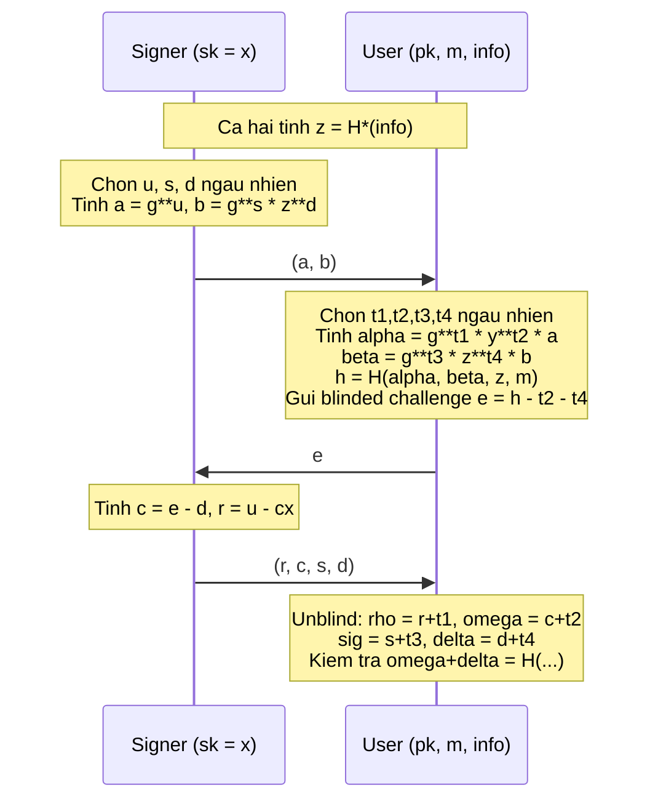

> **Prerequisites**: [[01-blind-signature-definition-security-models|01. Definition & Security Models]], [[03-schnorr-blind-signature|03. Schnorr Blind Signature]], Sigma-protocol, witness indistinguishability (WI), OR-proof technique (Cramer et al.)
> **Lesson type**: Scheme
>
> **Notation** (ký hiệu dùng mà không định nghĩa trong bài này):
> | Ký hiệu | Ý nghĩa |
> |---------|---------|
> | $\mathbb{G}$ | Cyclic group bậc nguyên tố $q$ |
> | $g$ | Generator của $\mathbb{G}$ |
> | $\mathbb{Z}_q$ | Vành số nguyên modulo $q$ |
> | $x$ | Secret key của Signer $\in \mathbb{Z}_q^*$ |
> | $y = g^x$ | Public key của Signer |
> | $H^*, H$ | Hai hash function: $H^*: \{0,1\}^* \to \mathbb{G}^*$, $H: \{0,1\}^* \to \mathbb{Z}_q$ (random oracles) |
> | $\mathsf{negl}(\lambda)$ | Negligible function |

---

## Motivation

Blind signature thông thường cho phép User nhận chữ ký mà Signer **không biết gì** về message. Điều này đôi khi quá mạnh — và gây ra vấn đề thực tế. Trong hệ thống e-cash, ngân hàng muốn kiểm soát một số thông tin nhất định (ví dụ: mệnh giá đồng xu, ngày hết hạn) nhưng vẫn muốn bảo vệ anonymity của user đối với thông tin còn lại (serial number của đồng xu).

**Partially blind signature** (Abe & Fujisaki 1996, Abe & Okamoto 2000) giải quyết bài toán này: cho phép Signer và User thống nhất trước về một **common information** (ký hiệu $\mathsf{info}$) được embed vào chữ ký — thông tin này là visible với Signer và không bị che giấu. Phần nội dung thực sự của message (ký hiệu $m$) vẫn được blind.

Ví dụ: trong e-cash với expiry date, $\mathsf{info} = \text{"2026-12-31, 10 USD"}$ và $m = \text{serial}$. Ngân hàng biết giá trị và ngày hết hạn, nhưng không biết serial khi phát hành — và không thể link serial với giao dịch về sau.

---

## Định nghĩa: Partially Blind Signature

> [!note] Definition 8.1 — Partially Blind Signature Scheme
> Một **partially blind signature scheme** PBS = ($\mathsf{KeyGen}$, $\langle \mathsf{S}, \mathsf{U} \rangle$, $\mathsf{Verify}$) trong đó:
>
> **$\mathsf{KeyGen}(1^\lambda)$**: như blind signature thông thường, sinh $(sk, pk)$.
>
> **Giao thức ký**: cả Signer và User đều biết $\mathsf{info}$ trước khi bắt đầu. Signer giữ $sk$; User giữ $pk, m, \mathsf{info}$. Cuối protocol, User thu được chữ ký $\sigma$ trên $(m, \mathsf{info})$.
>
> **$\mathsf{Verify}(pk, m, \mathsf{info}, \sigma)$**: Output $1$ hoặc $0$.
>
> **Partial blindness**: Signer không thể link session với chữ ký $(m, \sigma)$ cho cùng một $\mathsf{info}$.

Lưu ý: nếu đặt $\mathsf{info} = \varepsilon$ (chuỗi rỗng), PBS trở thành blind signature thông thường. Nếu $\mathsf{info}$ chứa toàn bộ message, PBS trở thành standard signature không có blindness.

---

## Ý tưởng: OR-Proof Technique

Abe & Okamoto xây dựng scheme dựa trên **OR-proof** của Cramer et al. (1994): một Sigma-protocol chứng minh biết một trong hai witnesses mà không tiết lộ witness nào được dùng. Đây là dạng **witness indistinguishable (WI)** — Verifier không thể phân biệt hai witnesses.

**Tag key**: Từ $\mathsf{info}$, cả hai bên tính $z = H^*(\mathsf{info}) \in \mathbb{G}^*$ — đây là *tag key* gắn với $\mathsf{info}$.

Signer thực chất chứng minh biết:
- **Witness thực**: $x = \log_g y$ (secret key của Signer), HOẶC
- **Tag witness**: $\zeta = \log_g z$ (discrete log của tag key, mà Signer không biết)

Do WI, Verifier không biết Signer dùng witness nào. Điều then chốt trong proof bảo mật: reduction có thể **program** $H^*$ để biết $\zeta = \log_g z$, từ đó mô phỏng Signer mà không cần $x$ — đây là lý do tại sao reduction hoạt động mà không break blindness.

---

## Scheme Definition

> [!note] Scheme 8.2 — Abe-Okamoto Partially Blind Signature
> **Type**: Partially Blind Digital Signature
> **Setting**: Cyclic group $\mathbb{G}$ bậc nguyên tố $q$, generator $g$; $H^*: \{0,1\}^* \to \mathbb{G}^*$, $H: \{0,1\}^* \to \mathbb{Z}_q$ (random oracles)
>
> **$\mathsf{KeyGen}(1^\lambda)$**
> - Chọn $x \stackrel{R}{\leftarrow} \mathbb{Z}_q$
> - Output: $\mathsf{sk} = x$, $\mathsf{pk} = y = g^x$
>
> **$\mathsf{Sign}_1(\mathsf{sk}, \mathsf{info})$** — Phase 1 của Signer:
> - Input: $\mathsf{sk} = x$, common information $\mathsf{info}$
> - Tính tag key: $z \leftarrow H^*(\mathsf{info}) \in \mathbb{G}^*$
> - Chọn $u, s, d \stackrel{R}{\leftarrow} \mathbb{Z}_q$
> - Tính OR-commitments: $a = g^u \in \mathbb{G}$, $b = g^s \cdot z^d \in \mathbb{G}$
> - Output: $(a, b)$ gửi User; state $\mathsf{st}_S = (u, s, d)$
>
> **$\mathsf{User}_1(pk, m, \mathsf{info}, a, b)$** — Phase 1 của User (blinding):
> - Input: $pk = y$, message $m$, $\mathsf{info}$, $(a, b)$ từ Signer
> - Tính $z \leftarrow H^*(\mathsf{info})$
> - Chọn $t_1, t_2, t_3, t_4 \stackrel{R}{\leftarrow} \mathbb{Z}_q$
> - Tính blinded commitments:
> $$\alpha = g^{t_1} \cdot y^{t_2} \cdot a \in \mathbb{G}, \qquad \beta = g^{t_3} \cdot z^{t_4} \cdot b \in \mathbb{G}$$
> - Tính $h = H(\alpha, \beta, z, m) \in \mathbb{Z}_q$ (hash thực sự muốn dùng)
> - Tính blinded challenge: $e = h - t_2 - t_4 \pmod{q}$
> - Output: gửi $e$ cho Signer; state $\mathsf{st}_U = (t_1, t_2, t_3, t_4)$
>
> **$\mathsf{Sign}_2(\mathsf{sk}, e, \mathsf{st}_S)$** — Phase 2 của Signer:
> - Input: $\mathsf{sk} = x$, challenge $e$, state $\mathsf{st}_S = (u, s, d)$
> - Tính: $c = e - d \pmod{q}$, $r = u - c \cdot x \pmod{q}$
> - Output: $(r, c, s, d)$ gửi User
>
> **$\mathsf{User}_2(pk, m, \mathsf{info}, (r,c,s,d), \mathsf{st}_U)$** — Unblinding:
> - Input: $(r, c, s, d)$, state $\mathsf{st}_U = (t_1, t_2, t_3, t_4)$
> - Tính:
> $$\rho = r + t_1 \pmod{q}, \quad \omega = c + t_2 \pmod{q}$$
> $$\sigma_{\mathsf{AO}} = s + t_3 \pmod{q}, \quad \delta = d + t_4 \pmod{q}$$
> - Kiểm tra: $\omega + \delta \stackrel{?}{=} H(g^\rho \cdot y^\omega,\; g^{\sigma_{\mathsf{AO}}} \cdot z^\delta,\; z,\; m)$
> - Nếu đúng, output chữ ký $\sigma = (\rho, \omega, \sigma_{\mathsf{AO}}, \delta)$; nếu không, output $\bot$
>
> **$\mathsf{Verify}(pk, m, \mathsf{info}, \sigma)$**
> - Input: $pk = y$, $m$, $\mathsf{info}$, $\sigma = (\rho, \omega, \sigma_{\mathsf{AO}}, \delta)$
> - Tính $z = H^*(\mathsf{info})$
> - Output: $1$ nếu $\omega + \delta = H(g^\rho \cdot y^\omega,\; g^{\sigma_{\mathsf{AO}}} \cdot z^\delta,\; z,\; m)$, ngược lại $0$

---

## Correctness

> [!abstract] Theorem 8.3 — Correctness
> Với mọi $(x, y) \leftarrow \mathsf{KeyGen}$, mọi $m, \mathsf{info}$, khi cả hai bên chạy đúng giao thức:
>
> $$
> \mathsf{Verify}(y, m, \mathsf{info}, \sigma) = 1
> $$

**Proof.** Ta cần chứng minh $\omega + \delta = H(g^\rho y^\omega, g^{\sigma_{\mathsf{AO}}} z^\delta, z, m)$.

Trước tiên, tính $g^\rho y^\omega$:

$$
g^\rho y^\omega = g^{r+t_1} \cdot (g^x)^{c+t_2} = g^{r + t_1 + xc + xt_2}
$$

Vì $r = u - cx$, ta có $r + xc = u$, nên:

$$
g^\rho y^\omega = g^{u + t_1 + xt_2} = g^u \cdot g^{t_1} \cdot (g^x)^{t_2} = a \cdot g^{t_1} \cdot y^{t_2} = \alpha
$$

Tương tự, tính $g^{\sigma_{\mathsf{AO}}} z^\delta$:

$$
g^{\sigma_{\mathsf{AO}}} z^\delta = g^{s+t_3} z^{d+t_4} = g^s z^d \cdot g^{t_3} z^{t_4} = b \cdot g^{t_3} z^{t_4} = \beta
$$

Do đó:

$$
H(g^\rho y^\omega, g^{\sigma_{\mathsf{AO}}} z^\delta, z, m) = H(\alpha, \beta, z, m) = h
$$

Và $\omega + \delta = (c + t_2) + (d + t_4) = (e - d + t_2) + (d + t_4) = e + t_2 + t_4 = (h - t_2 - t_4) + t_2 + t_4 = h$. $\blacksquare$

---

## Partial Blindness

> [!abstract] Theorem 8.4 — Partial Blindness
> AO scheme đạt **partial blindness**: với cùng $\mathsf{info}$, Signer không thể link hai signing sessions với $(m_0, \sigma_0)$ và $(m_1, \sigma_1)$ — ngay cả khi Signer thấy cả hai chữ ký.

**Proof sketch.** Signer thấy: $(a, b)$ (tự sinh), $e$ (từ User). Với $\alpha = a \cdot g^{t_1} y^{t_2}$ và $\beta = b \cdot g^{t_3} z^{t_4}$, ta cần chứng minh $(\alpha, \beta)$ phân phối đều trong $\mathbb{G}^* \times \mathbb{G}^*$ bất kể $m$. Vì $t_1, t_2, t_3, t_4$ được chọn đều độc lập trong $\mathbb{Z}_q$, và bất kỳ $\alpha \in \mathbb{G}^*$ có thể đạt được từ bất kỳ $a, y, g$ (vì $\mathbb{G}$ cyclic bậc nguyên tố), distribution của $(\alpha, \beta)$ đồng đều trong $\mathbb{G}^* \times \mathbb{G}^*$. Do $h = H(\alpha, \beta, z, m)$ và $e = h - t_2 - t_4$, distribution của $e$ cũng đồng đều. Do đó Signer không học được thông tin nào về $m$ hay $\sigma = (\rho, \omega, \sigma_{\mathsf{AO}}, \delta)$ ngoài việc $\sigma$ ứng với $\mathsf{info}$. $\square$

---

## One-More Unforgeability

> [!abstract] Theorem 8.5 — OMUF (Kastner, Loss & Xu, EUROCRYPT 2022)
> AO scheme đạt **sequential OMUF** trong ROM dưới DL assumption (trong single-tag setting) và **multi-tag OMUF** qua một bước hybrid argument.

**Proof sketch.** Reduction $\mathcal{B}$ nhận $(g, y)$ và cần giải DL: tìm $x = \log_g y$.

$\mathcal{B}$ program $H^*$ sao cho với $\mathsf{info}$ mà adversary dùng, $z = H^*(\mathsf{info}) = g^\zeta$ với $\zeta$ biết bởi $\mathcal{B}$. Bây giờ $\mathcal{B}$ có **hai witnesses**: $x$ (không biết) và $\zeta$ (biết). $\mathcal{B}$ mô phỏng Signer bằng cách dùng $\zeta$ (không cần $x$):

- Phase 1: chọn $s', d \stackrel{R}{\leftarrow} \mathbb{Z}_q$, tính $b = g^{s'} z^{-d'}$ với $d' = -d$... thực chất dùng OR-proof simulator cho phía $z$.
- Phase 2: khi nhận $e$, tính $d = e - c$ (đảo vai trò so với signing thực).

Khi adversary xuất forgery $(m^*, \rho^*, \omega^*, \sigma^*_{\mathsf{AO}}, \delta^*)$, $\mathcal{B}$ dùng Forking Lemma: chạy adversary hai lần với cùng random tape nhưng khác $H$ responses tại query $H(\alpha^*, \beta^*, z, m^*)$, thu được hai responses $h^* \neq h^{**}$. Từ đó extract $x = \log_g y$.

> [!warning] Lỗi trong proof gốc và bản sửa
> Abe & Okamoto (2000) có lỗi tinh tế trong counting argument của proof OMUF: xác suất mà reduction extract được witness đúng (phía $z$ thay vì phía $y$) bị tính sai. Kastner, Loss & Xu (EUROCRYPT 2022) sửa lỗi bằng cách dùng "splitting lemma" chính xác hơn và tách rõ ràng single-tag vs. multi-tag setting. Kết quả cuối cùng tương tự nhưng proof chặt hơn đáng kể.

---

## Tại sao OR-Proof cho WI?

Điểm cốt lõi của construction là **witness indistinguishability** của OR-proof. Trong protocol:

- Honest Signer dùng $x$ để tính $c = e - d$ và $r = u - cx$ (phần Schnorr bình thường).
- Reduction dùng $\zeta = \log_g z$ để simulate: chọn $c \stackrel{R}{\leftarrow} \mathbb{Z}_q$ ngẫu nhiên (tức là phần $b$ là "simulated" bằng witness $\zeta$), tính $d = e - c$.

Trong cả hai trường hợp, distribution của $(r, c, s, d)$ nhìn từ phía User là **identically distributed** — đây là tính WI. Do đó User không thể phân biệt đang tương tác với Signer thực (dùng $x$) hay với reduction (dùng $\zeta$).

> [!info] WI vs. ZK
> Witness indistinguishability (WI) yếu hơn zero-knowledge (ZK): WI chỉ yêu cầu distribution của proof không tiết lộ **witness nào** được dùng, không yêu cầu simulation. AO dùng WI vì nó đủ cho OMUF proof và dễ đạt hơn ZK trong 3-move setting.

---

## Ứng dụng và Variant

**E-cash với expiry date**: Ngân hàng phát hành coin với $\mathsf{info} = (\text{mệnh giá}, \text{ngày hết hạn})$ và $m = \text{serial}$. Người dùng có thể tiêu coin ẩn danh, nhưng sau ngày hết hạn, ngân hàng có thể từ chối coin dựa trên $\mathsf{info}$ mà không cần biết serial.

**Anonymous credentials với policy**: Issuer phát credential với $\mathsf{info} = \text{access policy}$ (ví dụ: "tuổi ≥ 18, quốc gia: VN") và $m = \text{user secret}$. Verifier kiểm tra policy mà không biết user secret.

**Abe-Okamoto vs. Okamoto-Schnorr**: Cả hai đều 3-move và dựa trên DL. Abe-Okamoto thêm $\mathsf{info}$ layer qua tag key $z$. Cả hai đều bị ROS attack trong concurrent setting với nhiều sessions cùng $\mathsf{info}$ — xem [[12-ros-attack|Lesson 12]].

---

## So sánh với Blind Signature Thông Thường

| Tiêu chí | Schnorr Blind | Abe-Okamoto Partially Blind |
|---|---|---|
| $\mathsf{info}$ field | Không | Có ($z = H^*(\mathsf{info})$) |
| Signature size | $(\rho, \omega)$ — 2 elements | $(\rho, \omega, \sigma_{\mathsf{AO}}, \delta)$ — 4 elements |
| Technique | Blinding $(α, β)$ scalar | OR-proof với tag key $z$ |
| Concurrent OMUF | Không (ROS) | Không (ROS, same $\mathsf{info}$) |
| Sequential OMUF | Có (DL, ROM) | Có (DL, ROM) |
| Blindness model | Perfect (honest-signer) | Partial (info visible) |
| Ứng dụng | General privacy | E-cash, credentials với metadata |

---

## Summary

- AO scheme mở rộng Schnorr blind signature với **common information** $\mathsf{info}$ được embed vào chữ ký.
- **Tag key** $z = H^*(\mathsf{info})$ cho phép Signer và reduction sử dụng OR-proof với hai witnesses: $x$ (Signer) hoặc $\zeta = \log_g z$ (reduction).
- **Giao thức 3-move**: Signer gửi $(a, b)$ → User gửi $e$ → Signer gửi $(r, c, s, d)$ → User unblind thành $(\rho, \omega, \sigma_{\mathsf{AO}}, \delta)$.
- **Correctness**: $g^\rho y^\omega = \alpha$ và $g^{\sigma_{\mathsf{AO}}} z^\delta = \beta$ → hash check đúng.
- **Partial blindness**: $(\alpha, \beta)$ phân phối đều do $(t_1, t_2, t_3, t_4)$ ngẫu nhiên.
- **Sequential OMUF**: WI của OR-proof + Forking Lemma; proof gốc AO có lỗi, được sửa bởi Kastner-Loss-Xu 2022.
- **Concurrent OMUF bị phá**: tương tự Schnorr, ROS attack áp dụng.

---

## References

- Abe, M. & Okamoto, T. — *Provably Secure Partially Blind Signatures*, CRYPTO 2000
- Abe, M. & Fujisaki, E. — *How to Date Blind Signatures*, ASIACRYPT 1996
- Kastner, J., Loss, J. & Xu, J. — *The Abe-Okamoto Partially Blind Signature Scheme Revisited*, EUROCRYPT 2022
- Cramer, R., Damgård, I. & Schoenmakers, B. — *Proofs of Partial Knowledge and Simplified Design of Witness Hiding Protocols*, CRYPTO 1994
- Boneh & Shoup — *A Graduate Course in Applied Cryptography*, Ch. 19 (toc.cryptobook.us)
