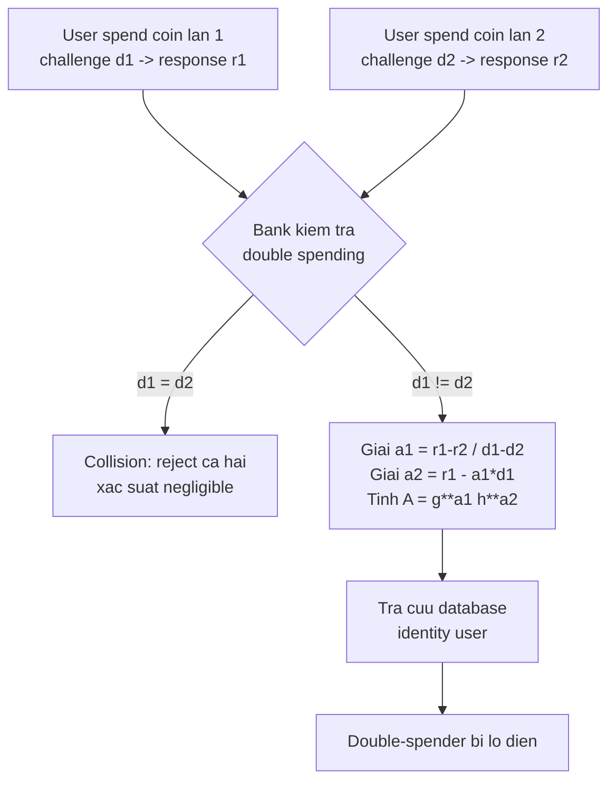

> **Prerequisites**: [[01-blind-signature-definition-security-models|01. Definition & Security Models]], [[02-chaum-rsa-blind-signature|02. Chaum RSA Blind Signature]], e-cash model cơ bản, representation problem trong nhóm cyclic
> **Lesson type**: Scheme
>
> **Notation** (ký hiệu dùng mà không định nghĩa trong bài này):
> | Ký hiệu | Ý nghĩa |
> |---------|---------|
> | $\mathbb{G}$ | Cyclic group bậc nguyên tố $q$ |
> | $g, h$ | Hai generator của $\mathbb{G}$ với $\log_g h$ không biết |
> | $\mathbb{Z}_q$ | Vành số nguyên modulo $q$ |
> | $x$ | Secret key của Signer |
> | $y = g^x$ | Public key của Signer |
> | $H$ | Hash function (random oracle): $\{0,1\}^* \to \mathbb{Z}_q$ |
> | $\mathsf{TTP}$ | Trusted Third Party |
> | $\mathsf{negl}(\lambda)$ | Negligible function |

---

## Motivation

Blind signature thông thường cung cấp **unconditional anonymity** — kể cả khi người dùng lạm dụng hệ thống để rửa tiền hay tống tiền, không ai có thể truy vết. Điều này tạo ra hai vấn đề ứng dụng thực tế:

**Vấn đề 1 — Perfect crime**: Kẻ tấn công dùng e-cash ẩn danh để nhận tiền chuộc hay thực hiện giao dịch bất hợp pháp mà không để lại dấu vết. Cần có cơ chế **revocable anonymity** (ẩn danh có thể thu hồi).

**Vấn đề 2 — Double spending**: Trong e-cash off-line, người dùng có thể copy một đồng coin và tiêu nhiều lần. Scheme Chaum RSA không ngăn được điều này về mặt kỹ thuật — nó chỉ detect sau khi xảy ra (nếu coin bị spend lần hai, ngân hàng thấy duplicate). Cần cơ chế **ràng buộc** user không thể dùng coin tùy tiện.

Hai giải pháp cho hai vấn đề này:

- **Fair blind signature** (Stadler et al. 1995): thêm $\mathsf{TTP}$ có thể revoke anonymity khi có lý do chính đáng.
- **Restrictive blind signature** (Brands 1993): ràng buộc cấu trúc message mà user có thể blind — user chỉ có thể unblind thành message có dạng cụ thể, ngăn double-spending bằng cách tiết lộ identity qua algebraic structure.

---

## Phần I: Fair Blind Signature

### Định nghĩa

> [!note] Definition 9.1 — Fair Blind Signature (FBS)
> Một **fair blind signature scheme** là blind signature scheme trong đó tồn tại $\mathsf{TTP}$ với extra information $\mathsf{tk}$ (tracing key) sao cho:
>
> **Anonymity** (với honest parties): Signer, user thứ ba, hay bất kỳ ai không có $\mathsf{tk}$ không thể link withdrawal với payment.
>
> **Revocable anonymity**: Khi được ủy quyền (ví dụ: warrant tư pháp), $\mathsf{TTP}$ có thể dùng $\mathsf{tk}$ để một trong hai:
> - **Coin tracing**: từ withdrawal record, tìm coin tương ứng trong database payments
> - **Owner identification**: từ một coin đã spend, tìm user đã rút coin đó

### Cơ chế: Escrow-Based Construction

Approach phổ biến nhất: trong giao thức rút tiền (withdrawal), thêm một layer encryption của thông tin nhận dạng (hay linking information) dưới public key của $\mathsf{TTP}$.

> [!note] Construction 9.2 — Off-line Fair Blind Signature (sketch)
> **Setup**: $\mathsf{TTP}$ có key pair $(pk_{\mathsf{TTP}}, sk_{\mathsf{TTP}})$ của một encryption scheme (vd: ElGamal).
>
> **Withdrawal**: Khi user rút coin, ngoài blind signing protocol thông thường, user còn tính:
> $$L = \mathsf{Enc}(pk_{\mathsf{TTP}},\; \mathsf{ID}_{\mathsf{user}} \| \mathsf{serial})$$
> và gửi kèm $L$ (cùng proof ZK rằng $L$ encrypt đúng $\mathsf{ID}$ của user). Bank lưu $(L, \text{transcript})$.
>
> **Payment**: user tiêu coin bình thường — merchant không thấy $L$, không biết identity.
>
> **Tracing** (khi có warrant): $\mathsf{TTP}$ dùng $sk_{\mathsf{TTP}}$ decrypt $L$ từ withdrawal record → thu được $(\mathsf{ID}_{\mathsf{user}}, \mathsf{serial})$ → link withdrawal với payment.

> [!info] Off-line TTP vs. On-line TTP
> Trong **on-line TTP** model, $\mathsf{TTP}$ tham gia vào từng giao dịch — không scalable. Trong **off-line TTP** model (Camenisch, Maurer & Stadler 1996), $\mathsf{TTP}$ chỉ bị kéo vào khi có lý do rõ ràng. Giao thức rút tiền vẫn chạy bình thường — $\mathsf{TTP}$ không online. Đây là mô hình thực tế hơn.

> [!warning] Trade-off: Privacy vs. Accountability
> Fair blind signature không đạt perfect blindness theo định nghĩa nghiêm ngặt — $\mathsf{TTP}$ về nguyên tắc có thể track mọi giao dịch. An toàn của người dùng phụ thuộc vào việc $\mathsf{TTP}$ không bị corrupt hay bị ép buộc tiết lộ. Đây là trade-off thiết kế, không phải lỗi kỹ thuật.

---

## Phần II: Restrictive Blind Signature

### Vấn đề Double Spending

Trong e-cash off-line, coin là một số $(m, \sigma)$ với $\sigma$ là blind signature của bank lên $m$. User có thể copy coin và tiêu $k$ lần. Scheme Chaum RSA chỉ detect sau khi xảy ra (bank thấy $m$ xuất hiện hai lần), nhưng không có cơ chế ngăn trước.

Brands đề xuất giải pháp: **embed identity của user vào coin theo cách ẩn danh**, nhưng nếu user tiêu coin hai lần (double-spend), hai giao dịch cộng lại **tiết lộ identity**.

### Representation Problem

> [!note] Definition 9.3 — Representation Problem
> Cho $\mathbb{G}$ bậc nguyên tố $q$, generators $g_1, \ldots, g_k$, và $h \in \mathbb{G}$. **Representation** của $h$ với respect to $(g_1, \ldots, g_k)$ là tuple $(a_1, \ldots, a_k) \in \mathbb{Z}_q^k$ sao cho $h = g_1^{a_1} \cdots g_k^{a_k}$.
>
> Bài toán tìm representation giả định là khó (tương đương với DL).

Trong Brands' scheme, coin **private key** là một representation $(a_1, a_2)$ của public key $A = g^{a_1} h^{a_2}$. Signer (bank) ký lên $A$ và liên quan đến $(a_1, a_2)$ là identity user.

### Brands' Restrictive Blind Signature

> [!note] Scheme 9.4 — Brands' Restrictive Blind Signature (Simplified)
> **Type**: Restrictive Blind Digital Signature
> **Setting**: $\mathbb{G}$ bậc nguyên tố $q$, generators $g, h$ (với $\log_g h$ ẩn); hash $H: \{0,1\}^* \to \mathbb{Z}_q$ (ROM)
>
> **$\mathsf{KeyGen}(1^\lambda)$** (Bank):
> - Chọn $x \stackrel{R}{\leftarrow} \mathbb{Z}_q^*$, đặt $y = g^x$
> - Output: $\mathsf{sk} = x$, $\mathsf{pk} = y$
>
> **Coin generation** (User):
> - Chọn secret $(a_1, a_2) \stackrel{R}{\leftarrow} \mathbb{Z}_q^2$ (coin private key)
> - Đặt $A = g^{a_1} h^{a_2}$ (coin public key — embed vào coin nhưng ẩn danh)
>
> **Giao thức rút tiền $\langle \mathsf{Bank}(x),\; \mathsf{User}(y, A) \rangle$:**
>
> *Phase 1 — Bank:*
> - Chọn $k \stackrel{R}{\leftarrow} \mathbb{Z}_q^*$, tính $R = g^k \in \mathbb{G}$
> - Gửi $R$ cho User
>
> *Phase 2 — User (blinding):*
> - Chọn $r_1, r_2, r_3 \stackrel{R}{\leftarrow} \mathbb{Z}_q$
> - Tính blinded commitment: $R' = A^{r_1} R^{r_2} g^{r_3}$
> - Tính challenge: $c' = H(A, R', \ldots)$
> - Tính blinded challenge: $c = c' \cdot r_1^{-1} r_2^{-1}$
> - Gửi $c$ cho Bank
>
> *Phase 3 — Bank:*
> - Tính response: $s = cx + k \pmod{q}$
> - Gửi $s$ cho User
>
> *Phase 4 — User (unblinding):*
> - Tính $s' = r_1 r_2 s + r_3 \pmod{q}$
> - Coin = $(A,\, R',\, c',\, s')$
>
> **Payment**: User trình $(A, R', c', s')$ cho merchant. Merchant gửi challenge $d$. User chứng minh biết $(a_1, a_2)$ sao cho $A = g^{a_1} h^{a_2}$ — đây là anonymous credential proving.

> [!tip] Tại sao gọi là "Restrictive"?
> User chỉ có thể unblind thành message $A = g^{a_1} h^{a_2}$ — tức là message **phải thuộc coset** của nhóm con của $\mathbb{G}$ generated by $(g, h)$. User không thể chọn $A$ tùy ý mà phải biết representation $(a_1, a_2)$. Đây là "restriction" — khác với blind signature thông thường nơi user tự do chọn message.

### Anti-Double-Spending Mechanism

Khi user spend coin $(A, R', c', s')$, merchant gửi challenge $d \stackrel{R}{\leftarrow} \mathbb{Z}_q$. User phải trả lời:

$$
r_1 = a_1 \cdot d + a_2 \pmod{q}, \quad r_2 = \ldots
$$

Nếu user tiêu cùng coin hai lần với challenges $d \neq d'$:
- Lần 1: $r = a_1 d + a_2$
- Lần 2: $r' = a_1 d' + a_2$

Từ $r - r' = a_1(d - d')$, ta tính được $a_1 = (r - r')(d - d')^{-1} \pmod q$. Và $a_2 = r - a_1 d \pmod q$. Hai secrets $(a_1, a_2)$ xác định user identity (nếu user đã registered với bank bằng $(a_1, a_2)$).

---

## So sánh: Fair vs. Restrictive

| Tiêu chí | Fair Blind Signature | Restrictive Blind Signature |
|---|---|---|
| Mechanism | TTP có thể decrypt linking info | Algebraic structure tiết lộ identity |
| TTP required | Có | Không |
| Traceability | TTP revokes anonymity theo yêu cầu | Tự động khi double-spend |
| Anonymity | Có (với honest TTP) | Có (khi không double-spend) |
| Anti double-spending | Không trực tiếp | Có (detect + identify) |
| Scheme base | RSA hoặc DL + PKE | Representation problem (DL-based) |
| Efficiency | Thêm 1 layer encrypt + ZK proof | Tương đương Schnorr blind |
| Application | Conditional privacy (legal) | E-cash Brands, wallets with observers |

---

## Quan hệ với Partially Blind Signature

Restrictive blind signature và partially blind signature (Abe-Okamoto, Lesson 08) đều ràng buộc message structure, nhưng theo cách khác:

- **Partially blind**: User tự do chọn $m$, nhưng $\mathsf{info}$ là visible cho Signer.
- **Restrictive**: User tự do chọn $(a_1, a_2)$, nhưng message phải có dạng $A = g^{a_1} h^{a_2}$ (algebraic constraint).

Brands chứng minh: với bất kỳ Fiat-Shamir type signature scheme nào mà ordinary blind signature scheme có thể xây dựng được, một restrictive blind signature scheme cũng có thể xây dựng từ nó.

---

## CTF Pattern

> [!example] CTF Pattern — Double-Spend Oracle
> Một số CTF expose oracle cho phép user "spend" coin và track $(A, d, r)$ tuples. Nếu oracle không kiểm tra double-spending, user có thể spend cùng coin nhiều lần. Trong một số CTF, oracle yêu cầu user cung cấp $r = a_1 d + a_2$ nhưng không track $(A, d)$ pairs — user có thể chọn $d$ tùy ý và tạo nhiều $r$ khác nhau từ cùng $(a_1, a_2)$.
>
> Attack: nếu $(a_1, a_2)$ có thể extract (server expose $(A, d_1, r_1)$ và $(A, d_2, r_2)$ từ hai sessions), compute $a_1 = (r_1 - r_2)(d_1 - d_2)^{-1} \bmod q$ — đây là hidden coin secret.

---

## Summary

- **Fair blind signature**: thêm $\mathsf{TTP}$ có $\mathsf{tk}$ để revoke anonymity. Normal operations không cần $\mathsf{TTP}$ (off-line); khi có warrant, $\mathsf{TTP}$ decrypt linking info để coin tracing hoặc owner identification.
- **Restrictive blind signature** (Brands 1993): message phải có dạng $A = g^{a_1} h^{a_2}$ (representation problem). Anti double-spending: hai spending challenges $d \neq d'$ tiết lộ $(a_1, a_2)$ → identity user.
- Không cần $\mathsf{TTP}$ trong Brands' scheme — anonymity mất tự động khi double-spend.
- Cả hai approach đều là phản ứng với "perfect crime" problem của unconditional anonymity trong blind signature.

---

## References

- Brands, S. — *Untraceable Off-line Cash in Wallets with Observers*, CRYPTO 1993
- Stadler, M., Piveteau, J.-M. & Camenisch, J. — *Fair Blind Signatures*, EUROCRYPT 1995
- Camenisch, J., Maurer, U. & Stadler, M. — *Digital Payment Systems with Passive Anonymity-Revoking Trustees*, ESORICS 1996
- Chaum, D., Fiat, A. & Naor, M. — *Untraceable Electronic Cash*, CRYPTO 1988
- de Solages, A. & Traoré, J. — *An Efficient Fair Off-line Electronic Cash System*, CMS 1996
- Boneh & Shoup — *A Graduate Course in Applied Cryptography*, Ch. 19 (toc.cryptobook.us)
