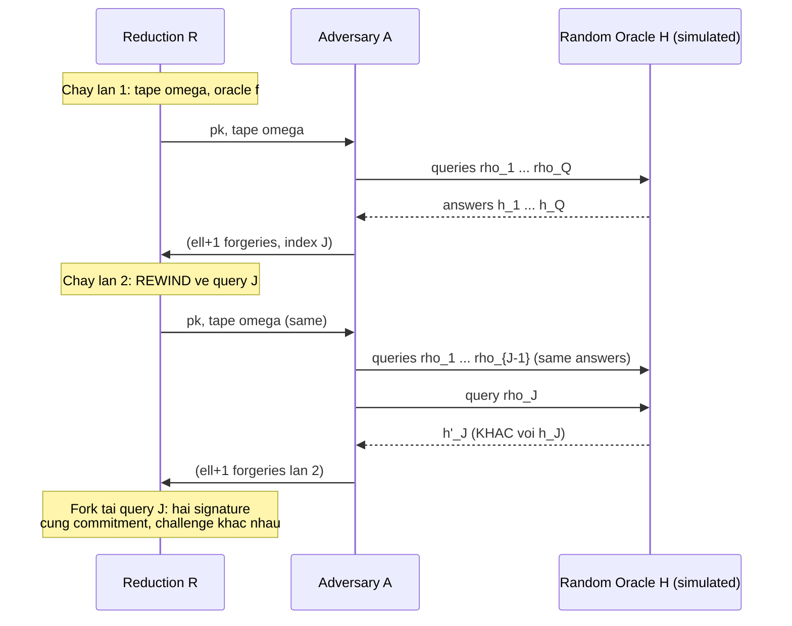
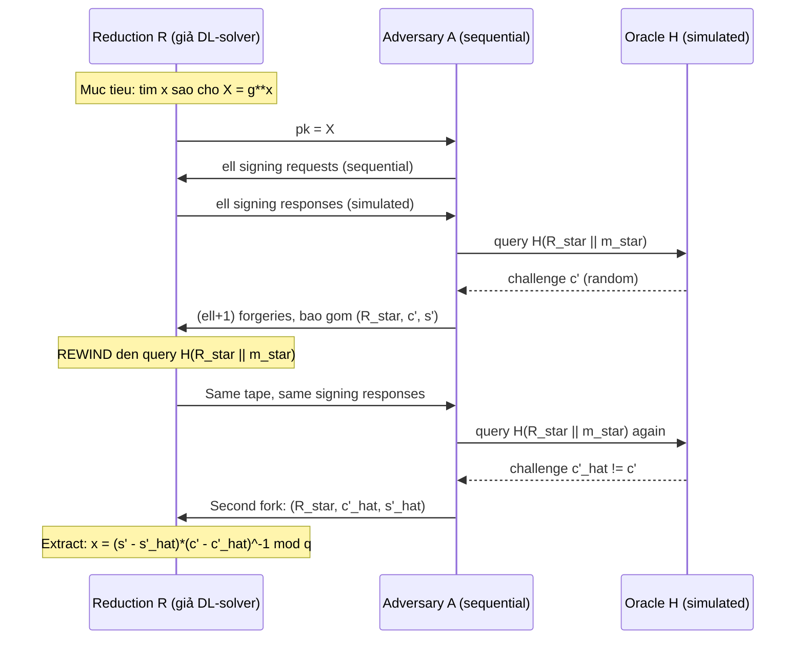

> **Prerequisites**: [[02-chaum-rsa-blind-signature|02. Chaum RSA Blind Signature]], [[03-schnorr-blind-signature|03. Schnorr Blind Signature]]
> **Lesson type**: Deep Dive
>
> **Notation** (ký hiệu dùng mà không định nghĩa trong bài này):
> | Ký hiệu | Ý nghĩa |
> |---------|---------|
> | $\lambda$ | Security parameter |
> | $q$ | Bậc nguyên tố của group $\mathbb{G}$ (hoặc số hash queries, rõ từ context) |
> | $\mathcal{A}$ | Adversary (PPT algorithm) |
> | $\mathbb{G}, g, x, X = g^x$ | Schnorr group, generator, secret/public key |
> | $N, e, d$ | RSA modulus và exponent pair |
> | $H$ | Hash function (random oracle), $q_H$ là số queries |
> | $\mathsf{negl}(\lambda)$ | Negligible function |
> | $\ell$ | Số signing sessions mà adversary mở |

---

## Context

Hai bài trước — Chaum RSA (Lesson 02) và Schnorr blind signature (Lesson 03) — đều tuyên bố sequential OMUF security dưới giả thiết tương ứng (RSA inversion và DLP). Nhưng các proof đó thực ra dựa trên cùng một kỹ thuật nền: **Forking Lemma**, còn gọi là *oracle replay attack* hay *rewinding technique*.

Bài này phân tích kỹ thuật này từ đầu, từ phiên bản gốc của Pointcheval & Stern (JoC 2000) đến dạng tổng quát của Bellare & Neven (CCS 2006), và giải thích tại sao nó hoạt động trong sequential setting nhưng thất bại hoàn toàn khi adversary chạy concurrent sessions.

---

## Tại sao cần một Lemma chuyên biệt?

Trong chứng minh EUF-CMA của Schnorr signature thông thường, kỹ thuật rewinding cũng được dùng: Nếu adversary $\mathcal{A}$ forge được $(m, \sigma)$ với xác suất $\epsilon$, ta chạy lại $\mathcal{A}$ với cùng random tape nhưng oracle trả lời khác nhau tại một điểm cụ thể, thu hai signature có cùng commitment $R$ nhưng challenge khác nhau $c \neq c'$, rồi extract secret key $x$.

Với **blind signature**, logic này phức tạp hơn đáng kể:
- Adversary không chỉ forge một message — nó phải forge $\ell + 1$ message sau $\ell$ sessions.
- Mỗi session là một interactive protocol với Signer; Signer không control được thứ tự queries.
- Random oracle queries và signing protocol queries đan xen nhau.

Ta cần một phiên bản tổng quát hơn của Forking Lemma, phù hợp với cấu trúc multi-session của blind signature.

---

## Oracle Replay Attack — Ý tưởng nền

**Oracle replay attack** (Pointcheval & Stern 1996) là paradigm reduce: dùng adversary $\mathcal{A}$ nhiều lần với random oracle giả, thay đổi câu trả lời oracle tại đúng một điểm, để thu hai transcript "fork" nhau.

Từ hai lần chạy, ta có hai bộ forgeries thỏa: cùng transcript đến query $J$, nhưng hash answer tại $J$ khác nhau. Điều này cho phép extraction.

---

## Splitting Lemma

Trước khi phát biểu Forking Lemma, ta cần một công cụ xác suất cơ bản.

> [!abstract] Lemma 10.1 — Splitting Lemma (Pointcheval & Stern 2000)
> Cho hai tập hợp $A, B \subseteq \Omega$ với $\Pr[A] = a \geq \delta$ và $\Pr[B] = b \geq \delta$ trong không gian xác suất hữu hạn $\Omega$. Khi đó:
>
> $$
> \Pr[A \cap B] \geq \delta \left(a - \delta\right)
> $$
>
> hay cụ thể hơn: tập $C \subseteq \Omega$ thoả mãn $\Pr[\omega \in C] \geq \delta$ thỏa điều kiện "với ít nhất $1/2$ xác suất, khi $\omega \in C$ thì ít nhất $a - \delta$ phần bổ sung $\omega' \in C$".

**Proof sketch.** Định nghĩa $\Omega = \Omega_1 \times \Omega_2$ với $\Omega_1$ là randomness trước fork point và $\Omega_2$ là randomness sau (bao gồm oracle answers). Phân tích theo $\Omega_1$: gọi "tốt" là $\omega_1$ sao cho ít nhất $\delta$-fraction của $\omega_2$ cho thành công. Ít nhất $a - \delta$ fraction của $\omega_1$ là tốt (nếu không, xác suất thành công toàn phần $< a$). Khi $\omega_1$ tốt, replay với $\omega_2' \neq \omega_2$ thành công với xác suất $\geq \delta$. $\blacksquare$

---

## Forking Lemma — Phiên bản Pointcheval-Stern (2000)

Phiên bản gốc áp dụng trực tiếp cho blind signature. Ta xét **sequential OMUF game** với adversary $\mathcal{A}$ và Signer $\Sigma$.

> [!abstract] Theorem 10.2 — Forking Lemma for Blind Signatures (PS 2000)
> Xét blind signature scheme dựa trên Schnorr identification. Cho adversary $\mathcal{A}$ chạy trong sequential model với $\ell$ signing queries, $q_H$ hash queries, thành công (output $\ell+1$ forgeries) với xác suất $\epsilon \geq 4(q_H + 1)/q$.
>
> Khi đó tồn tại máy $M$ (oracle replay machine) chạy trong thời gian kỳ vọng $O(q_H/\epsilon)$ lần gọi $\mathcal{A}$, xuất ra hai bộ forgeries cho cùng một session, dẫn đến extraction của secret key.

**Proof sketch.** Gọi $J$ là index hash query mà $\mathcal{A}$ dùng làm challenge cho forgery cuối (forgery thứ $\ell+1$). Từ Splitting Lemma, với xác suất $\geq \epsilon/2$ trên random tape $\omega$: ít nhất $\epsilon/2 - 1/q > 0$ fraction oracle answers tại query $J$ dẫn đến thành công. Máy $M$:

1. Chạy $\mathcal{A}$ với tape $\omega$ cho đến khi thành công lần đầu (lấy index $J$).
2. Rewind về query $J$, replay với oracle answer mới $h'_J \neq h_J$.
3. Nếu lần 2 thành công tại cùng index, ta có hai transcripts với cùng tiền tố nhưng $h_J \neq h'_J$.

Xác suất fork thành công $\geq \epsilon(\epsilon/2 - 1/q)$. Từ đây, extract DLP hoặc RSA inverse từ hai transcripts. $\blacksquare$

*(Proof đầy đủ trong: Pointcheval & Stern, Journal of Cryptology 2000, §3; bao gồm phân tích chi tiết cho Schnorr blind sig và Okamoto-Schnorr.)*

---

## Forking Lemma — Phiên bản Tổng quát Bellare-Neven (2006)

Bellare và Neven (CCS 2006) tách bạch hoàn toàn phần xác suất khỏi ứng dụng cụ thể, cho phép áp dụng rộng hơn.

> [!note] Definition 10.3 — General Forking Algorithm
> Cho số nguyên $q \geq 1$, tập $H$ có $h \geq 2$ phần tử, và thuật toán ngẫu nhiên $\mathcal{A}$ nhận input $(x, h_1, \ldots, h_q) \in \mathcal{X} \times H^q$ và trả về cặp $(J, \sigma)$ với $J \in \{0, 1, \ldots, q\}$ ("fork index") và $\sigma$ là side output.
>
> **Acceptance probability**: $\mathsf{acc} = \Pr[J \geq 1]$ khi $x \stackrel{R}{\leftarrow} \mathcal{X}$, $h_1, \ldots, h_q \stackrel{R}{\leftarrow} H$.
>
> **Forking Algorithm** $\mathsf{GenFork}_{\mathcal{A}}(x)$:
> - Chọn $h_1, \ldots, h_q \stackrel{R}{\leftarrow} H$ và chạy $(J, \sigma) \leftarrow \mathcal{A}(x, h_1, \ldots, h_q)$
> - Nếu $J = 0$: trả về $(0, \perp, \perp)$
> - Chọn $h'_J \stackrel{R}{\leftarrow} H$ và $h'_{J+1}, \ldots, h'_q \stackrel{R}{\leftarrow} H$
> - Chạy $(J', \sigma') \leftarrow \mathcal{A}(x, h_1, \ldots, h_{J-1}, h'_J, h'_{J+1}, \ldots, h'_q)$
> - Nếu $J' = J$ và $h'_J \neq h_J$: trả về $(1, \sigma, \sigma')$
> - Ngược lại: trả về $(0, \perp, \perp)$

> [!abstract] Theorem 10.4 — General Forking Lemma (Bellare & Neven 2006)
> Xác suất fork thành công của $\mathsf{GenFork}_{\mathcal{A}}$ thỏa:
>
> $$
> \mathsf{frk} \geq \mathsf{acc} \cdot \left(\frac{\mathsf{acc}}{q} - \frac{1}{h}\right)
> $$
>
> Trong đó $\mathsf{acc}$ là acceptance probability của $\mathcal{A}$, $q$ là số hash queries, và $h = |H|$.

**Proof sketch.** Gọi $\Omega = \mathcal{X} \times H^q$ là không gian random tape. Với mỗi $x$ và prefix $(h_1, \ldots, h_{J-1})$ cho trước, gọi $S_J$ là tập $h_J$ dẫn đến thành công tại index $J$. Từ acceptance probability $\mathsf{acc}$:

$$
\mathsf{acc} = \sum_{J=1}^{q} \Pr[\mathcal{A} \text{ succeeds at index } J]
$$

Gọi $X$ là tập "tốt" — random $(x, h_1, \ldots, h_q)$ dẫn đến $J \geq 1$. Với $(x, h_1, \ldots, h_{J-1}) \in X$, xác suất $h_J$ ngẫu nhiên nằm trong $S_J$ là $|S_J|/h$. Từ Splitting Lemma, với xác suất $\geq \mathsf{acc}$: $|S_J|/h \geq \mathsf{acc}/q - 1/h$. Do đó xác suất cả hai lần chạy đều thành công tại cùng $J$ là $\geq \mathsf{acc} \cdot (\mathsf{acc}/q - 1/h)$. $\blacksquare$

*(Proof đầy đủ trong: Bellare & Neven, CCS 2006, §3; full version tại ePrint 2006/285.)*

> [!tip] Nhận xét về tightness
> Forking Lemma gây ra **square-root loss**: nếu $\mathsf{acc} \approx \epsilon$ và $q_H$ là số hash queries, thì $\mathsf{frk} \approx \epsilon^2 / q_H$. Kẻ tấn công DL phải có advantage $\geq \epsilon^2/q_H$. Điều này là nguồn gốc của **quadratic security gap** — lý do nhiều scheme based on forking lemma yêu cầu group order $p$ phải đủ lớn để gap này không cho phép attack hiệu quả hơn DL thông thường.

---

## Ứng dụng: Chaum RSA Blind Signature

Trong proof sequential OMUF của Chaum RSA, adversary $\mathcal{A}$ sau $\ell$ sessions forge ra $\ell+1$ chữ ký. Reduction $R$ mô phỏng Signer và random oracle, và dùng Forking Lemma:

Mấu chốt là hash query $H(m^*)$ tương ứng với một trong $\ell+1$ forgeries — đây là fork point. Tại fork point, Reduction có hai giá trị $H(m^*)$ và $H'(m^*)$ khác nhau, kéo theo hai $\hat{m}$ khác nhau cho cùng $m^*$, từ đó extract RSA inverse $m^{*d}$.

> [!info] Điều kiện áp dụng trong Chaum RSA
> Proof chỉ hoạt động trong **sequential model**: mỗi session phải hoàn thành trước khi session tiếp theo bắt đầu. Khi $\ell=1$ (chỉ một session), reduction đơn giản nhất: mô phỏng signing oracle, fork tại hash query của forgery.
> Tổng quát: với $\ell$ sessions tuần tự, forking machine phải tìm đúng session nào chứa fork point — dẫn đến một hệ số $\ell$ trong complexity.

---

## Ứng dụng: Schnorr Blind Signature — Sequential OMUF

Với Schnorr blind signature, cấu trúc tương tự nhưng extraction khác:

- Fork tại hash query $H(R' \| m^*)$ của forgery thứ $\ell+1$.
- Hai transcript cho cùng $(R', m^*)$: challenge $c' \neq \hat{c}'$, response $s' \neq \hat{s}'$.
- Extraction: $x = (s' - \hat{s}') \cdot (c' - \hat{c}')^{-1} \bmod q$.

---

## Tại sao Forking Lemma thất bại trong Concurrent Setting

Đây là điểm quan trọng nhất. Trong **concurrent OMUF game**, adversary có thể mở nhiều sessions đồng thời và interleave các queries.

**Vấn đề cốt lõi**: Khi Reduction rewind về fork point tại một session, nó phải "đảo ngược" tất cả state liên quan đến session đó. Nhưng trong concurrent setting, session $i$ và session $j$ có thể chia sẻ hash queries:

- Adversary dùng commitment $R_j$ từ session $j$ để tính challenge $c_i$ cho session $i$.
- Khi Reduction rewind session $i$, nó vô tình thay đổi state của session $j$.
- Kết quả: adversary nhận "inconsistent world" — không tương ứng với bất kỳ thực thi hợp lệ nào.

> [!warning] Concurrent OMUF không thể prove bằng simple rewinding
> Điều này không chỉ là limitation của technique — Benhamouda et al. (EUROCRYPT 2021) chứng minh rằng Schnorr và Okamoto-Schnorr blind signature thực sự **không** concurrent OMUF secure khi $\ell > \log p$. Forking Lemma không thể prove điều không đúng.
>
> Giải thích tại sao: Trong concurrent setting, adversary có thể dùng $\ell$ sessions để xây dựng một hệ phương trình tuyến tính quá quyết định (overdetermined) trên các hash values — đây chính là **ROS problem** (xem Lesson 12). Rewinding làm thay đổi các hash values này, phá vỡ cấu trúc của attack mà không ngăn được nó.

> [!tip] Sequential an toàn, Concurrent không an toàn — trade-off thực tế
> Forking Lemma chỉ prove sequential OMUF. Nếu ứng dụng yêu cầu concurrent security (ví dụ server xử lý nhiều signing request đồng thời), cần dùng schemes với proof technique khác: Fischlin's round-optimal scheme (Lesson 06) hay Blind BLS (Lesson 07) không dựa trên forking lemma và concurrently secure.

---

## Summary

- **Forking Lemma** là kỹ thuật proof trung tâm cho sequential OMUF của Schnorr-type blind signatures.
- **Oracle replay attack**: chạy adversary hai lần với cùng tape, fork tại hash query của forgery.
- **Splitting Lemma**: xác suất fork thành công $\geq \mathsf{acc}(\mathsf{acc}/q - 1/h)$ — có **square-root loss**.
- **Áp dụng**: Chaum RSA sequential OMUF (extract RSA inverse), Schnorr blind sig sequential OMUF (extract DLP).
- **Giới hạn**: Không áp dụng được trong concurrent setting — adversary interleave queries, rewinding tạo inconsistent world. Concurrent OMUF của Schnorr blind sig thực sự không đúng (ROS attack).

---

## References

- Pointcheval, D. & Stern, J. — *Security Arguments for Digital Signatures and Blind Signatures*, Journal of Cryptology 13(3), 2000
- Bellare, M. & Neven, G. — *Multi-Signatures in the Plain Public-Key Model and a General Forking Lemma*, ACM CCS 2006; full version ePrint 2006/285
- Bellare, M. & Dai, W. — *The Multi-Base Discrete Logarithm Problem*, EUROCRYPT 2021 (phân tích square-root loss)
- Benhamouda, F. et al. — *On the (In)Security of ROS*, EUROCRYPT 2021
