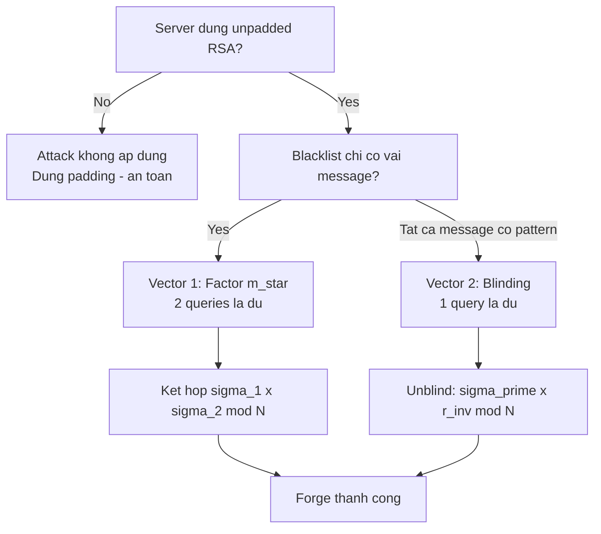

> **Prerequisites**: [[02-chaum-rsa-blind-signature|02. Chaum RSA Blind Signature]]
> **Lesson type**: Attack
>
> **Notation** (ký hiệu dùng mà không định nghĩa trong bài này):
> | Ký hiệu | Ý nghĩa |
> |---------|---------|
> | $N = pq$ | RSA modulus |
> | $e, d$ | RSA public/secret exponent |
> | $\mathbb{Z}_N^*$ | Nhóm nhân modulo $N$ |
> | $H : \{0,1\}^* \to \mathbb{Z}_N^*$ | Hash function (random oracle) |
> | $m^*$ | Message bị blacklist (server từ chối ký) |
> | $\sigma^*$ | Signature giả mạo mà attacker muốn thu được |

---

## Context & Conditions

Attack này khai thác **multiplicative homomorphism** của RSA unpadded signature. Điều kiện áp dụng:

- Server dùng **unpadded RSA** để ký: $\sigma = H(m)^d \bmod N$ (hoặc $\sigma = m^d \bmod N$ nếu không hash).
- Server có một **signing oracle** nhưng **từ chối ký một số message cụ thể** $m^*$.
- Attacker biết $(N, e)$ và có thể truy vấn signing oracle tự do ngoài blacklist.

> [!warning] Điều kiện kích hoạt
> Attack **không** hoạt động khi server dùng padding scheme an toàn (RSA-PSS, PKCS#1 v1.5). Lý do: padding biến $H(m)$ thành giá trị mới $P(H(m))$ không có cấu trúc multiplicative. Bài này chỉ áp dụng cho **unpadded RSA** hoặc "textbook RSA" signing.

---

## Attack Intuition

RSA unpadded có tính chất:

$$
(m_1 \cdot m_2)^d \equiv m_1^d \cdot m_2^d \pmod{N}
$$

Tính chất này có nghĩa: nếu ta biết $\sigma(m_1)$ và $\sigma(m_2)$, ta tính được $\sigma(m_1 \cdot m_2)$ mà không cần secret key $d$. Từ đây có hai attack vector:

**Vector 1 — Factoring**: Phân tích $m^*$ thành tích các thừa số $m_1, m_2, \ldots, m_k$ (mỗi thừa số không bị blacklist), lấy chữ ký từng thừa số, nhân kết quả lại.

**Vector 2 — Blinding**: Chọn blinding factor ngẫu nhiên $r$, tính $m' = m^* \cdot r^e \bmod N$ (không bị blacklist vì ngẫu nhiên), lấy chữ ký $\sigma' = (m')^d = (m^*)^d \cdot r$, unblind bằng cách chia $r$.

Cả hai vector đều hoàn toàn generic và không phụ thuộc vào cấu trúc cụ thể của $m^*$.

---

## Formal Attack

### Vector 1: Factoring Attack

> [!note] Attack 11.1 — Multiplicative Factoring Forgery
> **Input**: Public key $(N, e)$; signing oracle $\mathcal{O}_\mathsf{sign}$ (từ chối ký $m^*$); target $m^* \in \mathbb{Z}_N^*$.
> **Goal**: Tính $\sigma^* = H(m^*)^d \bmod N$ mà không truy vấn $\mathcal{O}_\mathsf{sign}(m^*)$.
>
> **Bước 1** — Factor target:
> Tìm $m_1, m_2, \ldots, m_k \in \mathbb{Z}_N^*$ sao cho $H(m^*) \equiv m_1 \cdot m_2 \cdots m_k \pmod{N}$, với mỗi $m_i$ không bị blacklist.
>
> **Bước 2** — Oracle queries:
> Với mỗi $i = 1, \ldots, k$: truy vấn $\sigma_i = \mathcal{O}_\mathsf{sign}(m_i)$, thu được $\sigma_i = m_i^d \bmod N$.
>
> **Bước 3** — Combine:
> Tính $\sigma^* = \sigma_1 \cdot \sigma_2 \cdots \sigma_k \bmod N$.
>
> **Output**: $\sigma^*$.
>
> **Correctness**: $\sigma^* = m_1^d \cdots m_k^d = (m_1 \cdots m_k)^d = H(m^*)^d \pmod{N}$.

Trường hợp đơn giản nhất ($k=2$): chọn ngẫu nhiên $m_1 \stackrel{R}{\leftarrow} \mathbb{Z}_N^*$, đặt $m_2 = H(m^*) \cdot m_1^{-1} \bmod N$. Nếu $m_2$ không bị blacklist, query và nhân kết quả. Nếu $m_2$ bị blacklist, chọn $m_1$ khác.

### Vector 2: Blinding Factor Attack

> [!note] Attack 11.2 — Blind Unblind Forgery
> **Input**: $(N, e)$; signing oracle $\mathcal{O}_\mathsf{sign}$; target $m^*$.
> **Goal**: Tính $\sigma^* = H(m^*)^d \bmod N$.
>
> **Bước 1** — Chọn blinding factor:
> Chọn $r \stackrel{R}{\leftarrow} \mathbb{Z}_N^*$. Tính $m' = H(m^*) \cdot r^e \bmod N$.
>
> **Bước 2** — Oracle query:
> Truy vấn $\sigma' = \mathcal{O}_\mathsf{sign}(m')$, thu $\sigma' = (m')^d = H(m^*)^d \cdot r \bmod N$.
>
> **Bước 3** — Unblind:
> Tính $\sigma^* = \sigma' \cdot r^{-1} \bmod N$.
>
> **Output**: $\sigma^*$.
>
> **Correctness**: $\sigma^* = H(m^*)^d \cdot r \cdot r^{-1} = H(m^*)^d \pmod{N}$.

---

## Complexity Analysis

- **Vector 1 (Factoring)**: $k$ oracle queries. Phân tích $H(m^*)$ trong $\mathbb{Z}_N^*$ thường chỉ cần $k=2$ (chọn ngẫu nhiên $m_1$, tính $m_2 = H(m^*)/m_1$). Xác suất $m_2$ bị blacklist nhỏ (blacklist thường chỉ có vài phần tử). Do đó **2 oracle queries** là đủ trong hầu hết trường hợp CTF.
- **Vector 2 (Blinding)**: Luôn chỉ **1 oracle query**. Xác suất $m'$ bị blacklist: $< 1/N$ (vì $r$ ngẫu nhiên và $r^e$ là bijection trên $\mathbb{Z}_N^*$).
- **Không yêu cầu factoring $N$**: Attacker không cần biết $p, q$ hay $d$. Chỉ cần oracle.

---

## CTF Pattern: VolgaCTF 2019 — Blind

> [!example] CTF Pattern 11.3 — VolgaCTF 2019 "Blind"
> **Setup**: Server thực thi bash commands. Commands `cat` và `cd` bị blacklist — server từ chối sign. Server ký message bằng unpadded RSA với $\sigma = m^d \bmod N$ (message là integer encoding của string).
>
> **Target**: Forge signature của `"cat flag"` để đọc flag.
>
> **Cách giải (Vector 1 — Factoring)**:
> - Encode `"cat flag"` thành integer $m^*$.
> - Tìm $m_1$ ngẫu nhiên $\in \mathbb{Z}_N^*$ sao cho $m_1$ không decode thành `cat...` hay `cd...`.
> - Đặt $m_2 = m^* \cdot m_1^{-1} \bmod N$. Kiểm tra $m_2$ không bị blacklist.
> - Query $\sigma_1 = \text{sign}(m_1)$ và $\sigma_2 = \text{sign}(m_2)$.
> - Forge: $\sigma^* = \sigma_1 \cdot \sigma_2 \bmod N$.
> - Submit $\sigma^*$ cho command `cat flag`.

```python
from Crypto.Util.number import inverse, bytes_to_long, long_to_bytes
import random

def forge_signature_factor(N, e, target_msg_int, sign_oracle, is_blacklisted):
    while True:
        m1 = random.randint(2, N - 1)
        m2 = (target_msg_int * inverse(m1, N)) % N
        if not is_blacklisted(long_to_bytes(m2)):
            break
    s1 = sign_oracle(m1)
    s2 = sign_oracle(m2)
    return (s1 * s2) % N

def forge_signature_blind(N, e, target_hash_int, sign_oracle):
    r = random.randint(2, N - 1)
    blinded = (target_hash_int * pow(r, e, N)) % N
    sigma_prime = sign_oracle(blinded)
    return (sigma_prime * inverse(r, N)) % N
```

---

## Flowchart — Attack Decision Tree



---

## Mitigation

**Dùng padding scheme an toàn**: RSA-PSS hoặc PKCS#1 v1.5 phá vỡ multiplicative homomorphism — $P(m_1 \cdot m_2) \neq P(m_1) \cdot P(m_2)$ vì padding thêm structure không multiplicative.

**Không bao giờ sign raw hash** nếu signer không kiểm soát được message space. Blind signature scheme hợp lệ (Lesson 02) đã handle điều này: blinding factor $r$ là do User kiểm soát, và Signer không nhận message gốc, nên không có vấn đề forge cho message bị blacklist theo cách này.

> [!warning] Lưu ý quan trọng
> Attack này không phá vỡ Chaum RSA blind signature scheme (Lesson 02) trong vai trò User-Signer protocol đúng chuẩn — vì scheme đó không có blacklist. Attack nhắm vào các **implementation sai** dùng RSA signing oracle với blacklist nhưng không có padding.

---

## Summary

- **Điều kiện**: Unpadded RSA signing oracle với blacklist.
- **Vector 1 (Factoring)**: $m^* = m_1 \cdot m_2 \bmod N$ → $\sigma^* = \sigma_1 \cdot \sigma_2 \bmod N$ — 2 queries.
- **Vector 2 (Blinding)**: $m' = m^* \cdot r^e \bmod N$ → $\sigma^* = \sigma' \cdot r^{-1} \bmod N$ — 1 query.
- **CTF fingerprint**: Server sign anything except target; textbook RSA (no padding).
- **Fix**: RSA-PSS hoặc PKCS#1 padding phá vỡ hoàn toàn tính homomorphism.

---

## References

- Wikipedia — *Blind Signature* (RSA section)
- VolgaCTF 2019 Qualifier — "Blind" challenge writeup (bi0s team, amritabi0s.wordpress.com)
- Masterpessimistaa — *Blinding Attack on RSA Digital Signatures* (masterpessimistaa.wordpress.com)
- Boneh & Shoup — *A Graduate Course in Applied Cryptography*, Ch. 19 (toc.cryptobook.us)
- Bellare, M. et al. — *RSA-OAEP is Secure under the RSA Assumption* (padding construction reference)
