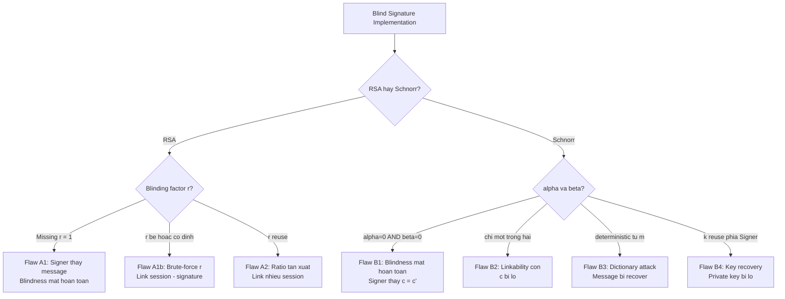

> **Prerequisites**: [[02-chaum-rsa-blind-signature|02. Chaum RSA Blind Signature]], [[03-schnorr-blind-signature|03. Schnorr Blind Signature]]
> **Lesson type**: Attack
>
> **Notation** (ký hiệu dùng mà không định nghĩa trong bài này):
> | Ký hiệu | Ý nghĩa |
> |---------|---------|
> | $N, e, d$ | RSA parameters |
> | $r$ | Blinding factor trong Chaum RSA |
> | $\hat{m}$ | Blinded message gửi đến Signer |
> | $\mathbb{G}, g, x, X = g^x$ | Schnorr group, generator, secret/public key |
> | $\alpha, \beta$ | Blinding factors trong Schnorr blind signature |
> | $R, R'$ | Signer nonce / blinded commitment |
> | $c, c'$ | Signer-side challenge / actual challenge |
> | $H$ | Hash function (random oracle) |

---

## Context & Conditions

Blind signature schemes yêu cầu **randomness chất lượng cao** từ User trong bước blinding. Nếu randomness yếu, thiếu, hoặc bị reuse, property **blindness** bị phá — Signer có thể link session signing với signature cuối cùng, phá vỡ anonymity của User.

Đây là một lớp attack thực tế quan trọng trong CTF và real-world audits: không tấn công vào proof hoặc hardness assumption, mà tấn công **implementation** của scheme.

Bài này chia thành hai phần:
- **Phần A**: Các flaw trong Chaum RSA blind signature.
- **Phần B**: Các flaw trong Schnorr blind signature.

---

## Phần A: RSA Blind Signature — Blinding Factor Flaws

### Flaw A1 — Deterministic hoặc Missing Blinding Factor

> [!danger] Flaw A1 — Không có blinding factor
> **Tình huống**: Implementation gửi $\hat{m} = H(m)$ trực tiếp (không nhân với $r^e$).
>
> **Hậu quả**: Signer nhận $\hat{m} = H(m)$ và trả $\hat{\sigma} = H(m)^d$. Đây chính là signature thực sự. Signer thấy $H(m)$ và biết $m^* = H^{-1}(H(m))$ (nếu table lookup khả thi), hoặc có thể dùng collision để link session với signature cuối.
>
> **CTF pattern**: Challenge yêu cầu "blind signature" nhưng server log toàn bộ $\hat{m}$ → kẻ tấn công với quyền đọc log có thể link session với withdrawal.

> [!danger] Flaw A1b — Blinding factor cố định hoặc quá nhỏ
> **Tình huống**: $r$ là constant hoặc $r$ nhỏ (ví dụ $r < 2^{32}$).
>
> **Attack**: Signer nhận $\hat{m} = H(m) \cdot r^e \bmod N$. Nếu Signer biết $r$ cố định, tính $H(m) = \hat{m} \cdot r^{-e} \bmod N$ và link trực tiếp. Nếu $r$ nhỏ, brute-force $r' \in [1, 2^{32}]$ và kiểm tra $\hat{m} \cdot r'^{-e} \equiv H(m_i) \pmod N$ cho tất cả $m_i$ trong target set.

```python
def detect_small_blinding_factor(N, e, m_hat, hash_targets, r_bound=2**32):
    from Crypto.Util.number import inverse
    for r_candidate in range(1, r_bound):
        r_inv_e = pow(inverse(r_candidate, N), e, N)
        candidate_hash = (m_hat * r_inv_e) % N
        if candidate_hash in hash_targets:
            return r_candidate, hash_targets[candidate_hash]
    return None, None
```

### Flaw A2 — Reusing Blinding Factor Across Sessions

> [!danger] Flaw A2 — Blinding factor $r$ được tái sử dụng
> **Tình huống**: User dùng cùng $r$ cho hai sessions với hai message $m_1 \neq m_2$.
>
> **Attack**: Signer thấy $\hat{m}_1 = H(m_1) \cdot r^e$ và $\hat{m}_2 = H(m_2) \cdot r^e$.
>
> $$
> \frac{\hat{m}_1}{\hat{m}_2} \equiv \frac{H(m_1)}{H(m_2)} \pmod{N}
> $$
>
> Ratio này không phụ thuộc vào $r$ — Signer có thể compute và dùng để link hai sessions với nhau (hoặc với database message fingerprints). Đặc biệt nguy hiểm trong e-cash: nếu Signer link withdrawal session 1 với withdrawal session 2, và biết ai rút tiền lần 2, có thể suy ra danh tính lần 1.
>
> **Fix**: Mỗi session **phải** chọn $r \stackrel{R}{\leftarrow} \mathbb{Z}_N^*$ fresh, cryptographically secure.

### Flaw A3 — Key Reuse: Encryption và Signing

> [!warning] Flaw A3 — Cùng $(N, e)$ dùng cho cả encryption và signing
> **Nguyên nhân**: RSA multiplicative homomorphism hoạt động trên cùng key. Nếu cùng một RSA key dùng cho cả encrypt $c = m^e$ và sign $\sigma = m^d$, attacker có thể dùng encryption oracle để fake signing oracle.
>
> **Attack**: Muốn $\sigma^* = m^{*d}$. Encrypt $m^*$: $c = m^{*e}$. Giờ $c^d = (m^{*e})^d = m^*$... Điều này không trực tiếp cho signature, nhưng trong một số cài đặt sai thêm API endpoint, attacker có thể blend hai chức năng.
>
> **Fix**: Sử dụng **domain separation** — key riêng cho signing và encryption, hoặc dùng RSA-PSS/OAEP để phân biệt.

---

## Phần B: Schnorr Blind Signature — Randomization Flaws

### Flaw B1 — Missing Blinding: $\alpha = 0, \beta = 0$

> [!danger] Flaw B1 — Không randomize commitment và challenge
> **Tình huống**: User không chọn $\alpha, \beta$ ngẫu nhiên mà đặt $\alpha = 0, \beta = 0$.
>
> **Hậu quả**: $R' = g^0 \cdot R \cdot X^0 = R$ và $c = c' - 0 = c'$. Signer thấy $c$ là challenge thực $c' = H(R \| m)$.
>
> **Linkability**: Sau khi signature $(R', c', s')$ xuất hiện, Signer so sánh $c$ mà nó nhận được trong session với $c' = H(R' \| m)$ trong signature. Nếu match, Signer biết chính xác session nào tương ứng với signature nào — **blindness bị phá hoàn toàn**.
>
> **CTF fingerprint**: Kiểm tra implementation có `alpha = 0; beta = 0` hay `blinding_factor = 1` hardcoded.

### Flaw B2 — Chỉ Randomize một trong hai tham số

> [!warning] Flaw B2 — Chỉ $\alpha \neq 0$, $\beta = 0$ (hoặc ngược lại)
> **Tình huống**: $\beta = 0$ nhưng $\alpha \neq 0$.
>
> **Hậu quả**: $R' = g^\alpha \cdot R$ nhưng $c = c' - 0 = c'$. Signer thấy $c = H(R' \| m) = H(g^\alpha R \| m)$.
>
> Signer không biết $m$ vì $R' = g^\alpha R$ vẫn ngẫu nhiên (với $\alpha$ ngẫu nhiên). Nhưng $c$ bị lộ: Signer biết $c$ là challenge thực, và khi signature $(R', c', s')$ xuất hiện với $c' = c$, Signer biết ngay session nào. Linkability vẫn bị phá.
>
> **Phân tích**: Với $\beta \neq 0$, $c = c' - \beta \neq c'$ nên Signer không thể so sánh trực tiếp. Cả hai $\alpha$ và $\beta$ đều **bắt buộc phải** khác $0$.

### Flaw B3 — Deterministic $\alpha$ và $\beta$ từ Message

> [!danger] Flaw B3 — Blinding factors derived from message: $\alpha = H_1(m), \beta = H_2(m)$
> **Tình huống**: Developer muốn "reproducible" blinding, đặt $\alpha = H_1(m)$ và $\beta = H_2(m)$ thay vì chọn ngẫu nhiên.
>
> **Attack**: Signer nhận $c = c' - \beta = H(R' \| m) - H_2(m)$. Với một tập message có thể đoán được (ví dụ: date-based tokens), Signer thử tất cả $m_i$ trong candidate set:
>
> 1. Tính $\alpha_i = H_1(m_i)$, $\beta_i = H_2(m_i)$.
> 2. Tính $R'_i = g^{\alpha_i} R X^{\beta_i}$.
> 3. Tính $c'_i = H(R'_i \| m_i)$, $c_i = c'_i - \beta_i$.
> 4. So sánh $c_i$ với $c$ nhận được — nếu match, biết $m$.
>
> Với $|$candidate set$| = N$, Signer recover message trong $O(N)$ operations.

### Flaw B4 — Signer Nonce Reuse

> [!danger] Flaw B4 — Signer tái sử dụng nonce $k$ (tức là $R = g^k$ cố định)
> **Tình huống**: Signer (lỗi implementation) sinh $k$ một lần và dùng lại cho nhiều sessions.
>
> **Hậu quả kép**:
> 1. **Key exposure nếu có hai responses**: Với hai sessions dùng cùng $k$ và challenge $c_1 \neq c_2$: $s_1 = k - xc_1$, $s_2 = k - xc_2$. Suy ra $x = (s_1 - s_2)(c_1 - c_2)^{-1}$ — **private key bị lộ hoàn toàn**.
> 2. **Linkability**: Vì Signer gửi cùng $R$ cho nhiều sessions, kẻ quan sát biết các sessions này dùng cùng nonce. Khi signature $(R', c', s')$ xuất hiện với $R' = g^\alpha R X^\beta$ cho một số $\alpha, \beta$, nếu Signer lưu danh sách $R$ đã dùng, có thể correlate.

---

## Tổng hợp Attack Taxonomy



---

## CTF Recognition Patterns

> [!example] CTF Pattern 14.1 — Detect Blinding Flaw trong Source Code
> **Dấu hiệu trong Python/server code**:
>
> - `alpha = 0; beta = 0` hoặc `r = 1` — Flaw A1/B1.
> - `r = int(hashlib.md5(message).hexdigest(), 16) % N` — Deterministic, Flaw B3 tương tự.
> - Server sinh nonce một lần ngoài loop session: `k = random.randint(...)` ở module level — Flaw B4.
> - `blinded = hash_of_message` (không nhân blinding) — Flaw A1.
> - `self.r = self._generate_r()` trong `__init__` thay vì trong `blind()` — Flaw A2 nếu object được reuse.

> [!example] CTF Pattern 14.2 — Detect Linkability qua Protocol Transcript
> **Bước kiểm tra**:
> 1. Mở hai sessions với hai messages khác nhau, quan sát $\hat{m}_1, \hat{m}_2$ (RSA) hoặc $c_1, c_2$ (Schnorr).
> 2. Nếu $\hat{m}_1 / \hat{m}_2 \equiv H(m_1) / H(m_2) \pmod N$: blinding factor reuse.
> 3. Nếu $c_i = H(R_i \| m_i)$: missing beta blinding.
> 4. Nếu $R_1 = R_2$ (same Signer nonce): Flaw B4, key exposure possible.

---

## Mitigation Summary

| Flaw | Fix |
|------|-----|
| A1: Missing $r$ | Luôn sample $r \stackrel{R}{\leftarrow} \mathbb{Z}_N^*$ fresh từ CSPRNG |
| A1b: Small $r$ | $r$ phải có ít nhất $\lambda$ bits entropy |
| A2: $r$ reuse | Generate $r$ trong `blind()`, không cache |
| A3: Key reuse | Domain separation: ký riêng, mã hóa riêng |
| B1: $\alpha=\beta=0$ | Cả hai $\alpha, \beta$ phải random và độc lập |
| B2: $\beta=0$ | Enforce $\beta \stackrel{R}{\leftarrow} \mathbb{Z}_q^*$ |
| B3: Deterministic | Không derive blinding từ message |
| B4: Nonce reuse | Signer phải generate $k \stackrel{R}{\leftarrow} \mathbb{Z}_q^*$ fresh mỗi session |

---

## Summary

- **Blindness property** của blind signature phụ thuộc hoàn toàn vào **randomness** trong bước blinding của User.
- **RSA flaws**: Missing $r$ (lộ message), small $r$ (brute-force), $r$ reuse (linkability qua ratio).
- **Schnorr flaws**: $\alpha=\beta=0$ (linkability hoàn toàn), thiếu một trong hai (partial linkability), deterministic blinding (dictionary attack), Signer nonce reuse (key exposure).
- **CTF approach**: Tìm hardcoded constants, non-fresh randomness, object-level vs. call-level generation, reused nonces.
- **Root cause**: Developers nhầm lẫn "correctness" và "security" — scheme đúng về mặt correctness (signature verify được) nhưng sai về security (Signer link được).

---

## References

- Wikipedia — *Blind Signature* (linkability section)
- Green, M. — *A Note on Blind Signature Schemes* (blog.cryptographyengineering.com, 2012)
- Pointcheval, D. & Stern, J. — *Security Arguments for Digital Signatures and Blind Signatures*, JoC 2000 (blindness definition)
- IETF — *RSA Blind Signatures* (draft-irtf-cfrg-rsa-blind-signatures) — randomness requirements §7
