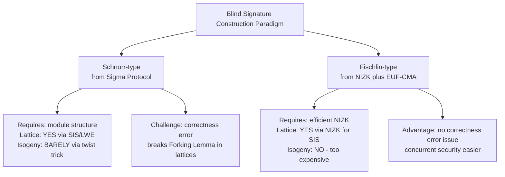
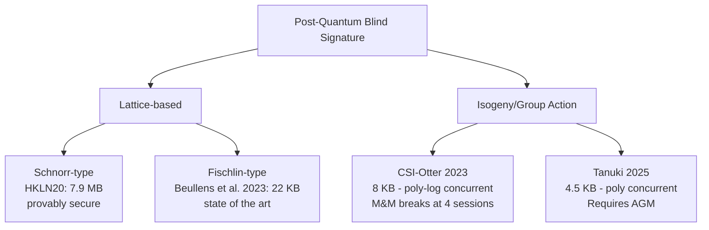

> **Prerequisites**: [[01-blind-signature-definition-security-models|01. Definition & Security Models]], [[06-fischlin-round-optimal|06. Fischlin's Round-Optimal Blind Signature]], [[13-parallel-ros-mnm-attack|13. Parallel ROS & M&M Attack]]
> **Lesson type**: Scheme
>
> **Notation** (ký hiệu dùng mà không định nghĩa trong bài này):
> | Ký hiệu | Ý nghĩa |
> |---------|---------|
> | $\lambda$ | Security parameter |
> | $\mathcal{A}$ | Adversary (PPT) |
> | $\mathsf{negl}(\lambda)$ | Negligible function |
> | $\stackrel{R}{\leftarrow}$ | Lấy mẫu đều ngẫu nhiên |
> | $\mathsf{pk}, \mathsf{sk}$ | Public key, secret key |
> | $\ell$ | Số signing sessions |
> | $\omega$ | Số parallel repetitions |

---

## Motivation

Mọi scheme đã học đều dựa trên giả định khó giải theo thời gian đa thức bằng máy tính cổ điển — discrete logarithm, RSA inversion, bilinear pairing assumption. Thuật toán Shor (1994) phá vỡ cả ba trong thời gian đa thức trên máy tính lượng tử đủ lớn. Khi máy tính lượng tử quy mô lớn trở thành hiện thực, toàn bộ cơ sở hạ tầng blind signature cổ điển — DigiCash, Privacy Pass, FOO92 e-voting — sẽ sụp đổ.

Bài học này khảo sát landscape của **post-quantum (PQ) blind signatures**: tại sao chuyển sang PQ setting khó hơn nhiều so với các primitive khác, hai paradigm construction chính, các scheme cụ thể hiện đại nhất, và tại sao các attack từ Lesson 13 (pROS, M&M) tái xuất hiện nghiêm trọng hơn.

---

## Tại sao PQ blind signatures khó hơn bình thường

Với symmetric encryption hay hash functions, chuyển sang PQ chủ yếu là tăng key/output size. Với digital signatures, NIST đã chuẩn hóa được ML-DSA (Dilithium), SLH-DSA (SPHINCS+), ML-KEM — đều hoạt động tốt. Nhưng **blind signatures** gặp hai thách thức đặc thù.

**Thách thức 1 — Structural mismatch.** Các scheme như Schnorr blind signature khai thác multiplicative homomorphism của group: $g^a \cdot g^b = g^{a+b}$. Blinding transform $R' = g^\alpha R X^\beta$ hoạt động vì group có **module structure** — phép cộng vô hướng lên exponent tương tác tốt với phép nhân trong group. Lattice-based cryptography dùng module lattices (SIS/LWE), nên cũng có cấu trúc này. Nhưng **isogenies** chỉ là group actions — ít cấu trúc hơn modules, không có analogue tự nhiên của blinding transform.

**Thách thức 2 — Correctness error.** Mọi construction lattice-based dựa trên identification protocol đều có **noticeable correctness error** (xác suất protocol thất bại do rejection sampling). Trong setting thông thường, lỗi này nhỏ nhưng chấp nhận được. Trong blind signature, correctness error làm hỏng proof kỹ thuật Forking Lemma — Lemma cần Prover **luôn** respond đúng để extraction work. Đây là lý do nhiều lattice-based blind signature scheme bị phát hiện có lỗi proof sau khi publish.

---

## Paradigm 1: Schnorr-type từ Identification Protocol

Cách tiếp cận đầu tiên: lấy một identification protocol $\Sigma = (\mathsf{Com}, \mathsf{Chal}, \mathsf{Resp}, \mathsf{Ver})$ có structure tốt, rồi áp dụng blinding transform để tạo blind signature.

### Yêu cầu: Linear Identification Protocol

Hauck, Kiltz và Loss (EUROCRYPT 2019) hình thức hóa yêu cầu cần thiết: identification protocol cần phải là **linear** — blinding transform là linear map trên không gian của commitments và responses. Cả Schnorr lẫn Okamoto-Schnorr đều là linear trong ý nghĩa này. Điều kiện linearity tương đương với việc underlying mathematical tool là **module over a ring**.

Lattice-based constructions dựa trên Lyubashevsky's identification scheme đáp ứng điều kiện này vì SIS/LWE problems sống trên module lattices $\mathbb{Z}_q^{n \times m}$. Tuy nhiên correctness error là bài toán kỹ thuật phải xử lý riêng.

### BLAZE+ (Alkadri et al., FC 2020)

BLAZE+ là scheme lattice-based Schnorr-type hiệu quả nhất trong thời gian đó, đạt signature size khoảng 6.6 KB ở mức bảo mật 128-bit, nhỏ hơn 2.7 lần so với các ứng viên trước.

> [!warning] Security flaw phát hiện sau khi publish
> Hauck et al. (2020) chứng minh rằng BLAZE+ và mọi construction theo template của Rückert (2010) đều có lỗi trong security proof liên quan đến correctness error. Cụ thể: rejection sampling trong lattice protocol tạo ra correlation giữa transcript và signing key mà proof technique không xử lý đúng. BLAZE+ không còn được coi là provably secure.

### HKLN20 Framework (Hauck-Kiltz-Loss-Nguyen, 2020)

Hauck et al. sửa bài toán bằng cách xây dựng framework mới xử lý correctness error một cách chính thức. Scheme kết quả là **provably secure** dưới SIS assumption nhưng có signature size khoảng 7.9 MB — lớn hơn BLAZE+ nhiều bậc do phải amortize chi phí của correctness error handling.

> [!note] Tại sao correctness error làm tăng signature size
> Trong Schnorr-type scheme, Prover phải rejection sample để đảm bảo response distribution không leak $\mathsf{sk}$. Acceptance probability $p_{\mathsf{acc}}$ thường nhỏ hơn 1. Để đạt negligible correctness error, phải lặp lại nhiều lần hoặc dùng các kỹ thuật như **commit-and-open** — tất cả đều làm tăng signature size đáng kể.

---

## Paradigm 2: Fischlin-type từ NIZK

Cách tiếp cận thứ hai, như đã học ở Lesson 06, không đòi hỏi linearity. User commit vào message, Signer ký commit bằng EUF-CMA secure signature, User prove bằng NIZK. Không có correctness error vì không có rejection sampling trong signing protocol.

### Lattice-based Fischlin-type

Hiệu quả của Fischlin-type phụ thuộc vào chất lượng NIZK system. Trong lattice setting, có các NIZK proof system hiệu quả cho SIS/LWE relations.

Del Pino và Katsumata (CRYPTO 2022) xây dựng scheme đầu tiên theo Fischlin paradigm với provable security trong **Quantum Random Oracle Model (QROM)**, với signature size khoảng 100 KB dưới SIS assumption. Agrawal, Kirshanova, Stehlé và Yadav (AKSY22, CCS 2022) đạt khoảng 50 KB dưới một **one-more SIS assumption** mới.

Beullens, Lyubashevsky, Nguyen và Seiler (CCS 2023) đạt kết quả tốt nhất hiện tại: **22 KB** signature size, round-optimal, dưới SIS + LWE + NTRU assumptions. Construction dùng NIZK proof system cho concrete hash functions, nhỏ hơn 4 lần so với del Pino-Katsumata.

> [!info] So sánh hiệu năng lattice-based blind signatures
> | Scheme | Paradigm | Sig size | Assumption | QROM | Round |
> |--------|----------|----------|------------|------|-------|
> | HKLN20 | Schnorr | ~7.9 MB | SIS | No | 3 |
> | del Pino-Katsumata 2022 | Fischlin | ~100 KB | SIS | Yes | 2 |
> | AKSY22 | Fischlin | ~50 KB | one-more SIS | No | 2 |
> | Beullens et al. CCS'23 | Fischlin | ~22 KB | SIS+LWE+NTRU | No | 2 |

### Tại sao Fischlin-type không áp dụng tốt cho isogeny

Fischlin paradigm cần NIZK proof cho statement: *"Tôi biết $(m, r, \hat\sigma)$ sao cho $c = \mathsf{COM}(m; r)$ và $\hat\sigma$ là chữ ký hợp lệ trên $c$."* Với lattice-based schemes, đây là statement về linear equations — có NIZK hiệu quả. Với isogeny-based schemes, statement dính đến phép tính isogeny — một phép toán phức tạp không có NIZK hiệu quả đủ nhỏ. State-of-the-art isogeny proof of knowledge yêu cầu xấp xỉ 1000 multiplication gates và proof size vài trăm KB.

---

## CSI-Otter: Isogeny-based Blind Signature

CSI-Otter (Katsumata, Lai, LeGrow, Qin — CRYPTO 2023) là scheme blind signature đầu tiên dựa trên isogeny, tránh được cả hai rào cản trên bằng một kỹ thuật khéo léo.

### Setting: CSIDH Group Action

CSI-Otter dựa trên **CSIDH** (Commutative Supersingular Isogeny Diffie-Hellman), sử dụng class group $\mathcal{G} = \mathcal{Cl}(\mathcal{O})$ của imaginary quadratic order $\mathcal{O}$ acting trên tập hợp các supersingular elliptic curves $\mathcal{S}$ trên $\mathbb{F}_p$.

> [!note] CSIDH Group Action
> Có action $\star: \mathcal{G} \times \mathcal{S} \to \mathcal{S}$, trong đó:
> - $\mathcal{G}$ là class group của $\mathcal{O}$, commutative
> - Với $[\mathfrak{a}] \in \mathcal{G}$ và $E \in \mathcal{S}$: $[\mathfrak{a}] \star E$ là đường cong mới
> - **Commutativity**: $[\mathfrak{a}] \star ([\mathfrak{b}] \star E) = [\mathfrak{b}] \star ([\mathfrak{a}] \star E)$
> - **Hardness**: Group Action Inverse Problem (GAIP) — biết $E$ và $[\mathfrak{a}] \star E$, tìm $[\mathfrak{a}]$ — giả định là khó cả với quantum adversary
>
> **Quadratic twist**: Nếu $E: y^2 = x^3 + Ax^2 + x$ thì twist của nó $E^{-1}: y^2 = x^3 - Ax^2 + x$ thỏa $([\mathfrak{a}] \star E)^{-1} = [\mathfrak{a}]^{-1} \star E^{-1}$. Đây là **extra structure** so với abstract group action thuần túy.

### Key Insight: OR-proof trên Twisted Pair

CSI-Otter không cần module structure đầy đủ. Thay vào đó, dùng quadratic twist để tạo một **OR-proof**: Prover biết một trong hai secret keys — hoặc $\mathfrak{a}$ (cho curve $E$) hoặc $\mathfrak{a}^{-1}$ (cho twist $E^{-1}$) — mà không cần tiết lộ cái nào.

Kỹ thuật này cho phép blinding: User chọn ngẫu nhiên để "route" signing session qua $E$ hay qua $E^{-1}$, tạo ra blind cho Signer.

> [!note] Scheme 15.1 — CSI-Otter (Basic Version)
> **Type**: Blind Signature
> **Setting**: CSIDH group action $\star: \mathcal{G} \times \mathcal{S} \to \mathcal{S}$, $E_0 \in \mathcal{S}$ là base curve, $H: \{0,1\}^* \to \mathcal{G}$ là hash (ROM), CSIDH-512 parameter set
>
> **$\mathsf{KeyGen}(1^\lambda)$**
> - Chọn $\mathfrak{s} \stackrel{R}{\leftarrow} \mathcal{G}$
> - Output: $\mathsf{sk} = \mathfrak{s}$, $\mathsf{pk} = (E_A, E_A^{-1})$ với $E_A = \mathfrak{s} \star E_0$ và $E_A^{-1}$ là quadratic twist
>
> **$\mathsf{Blind}(\mathsf{pk}, m)$**
> - Input: $\mathsf{pk} = (E_A, E_A^{-1})$, message $m \in \{0,1\}^*$
> - Chọn blinding randomness $b \stackrel{R}{\leftarrow} \{0, 1\}$ và $\mathfrak{r} \stackrel{R}{\leftarrow} \mathcal{G}$
> - Nếu $b = 0$: tính $E_R = \mathfrak{r} \star E_0$; nếu $b = 1$: tính $E_R = \mathfrak{r} \star E_0^{-1}$
> - Gửi blinded request $(E_R, \text{state})$ cho Signer
>
> **$\mathsf{Sign}(\mathsf{sk}, E_R)$**
> - Input: $\mathsf{sk} = \mathfrak{s}$, blinded curve $E_R$
> - Tính response $E_S = \mathfrak{s} \star E_R$
> - Output: $E_S$
>
> **$\mathsf{Unblind}(E_S, \text{state}, m)$**
> - Từ $E_S$, blinding randomness, và message $m$, reconstruct signature $\sigma = (E_S', c_0, c_1, r_0, r_1)$ là OR-proof transcript
> - Output: $\sigma$
>
> **$\mathsf{Verify}(\mathsf{pk}, m, \sigma)$**
> - Input: $\mathsf{pk} = (E_A, E_A^{-1})$, $m$, $\sigma$
> - Verify OR-proof $\sigma$ chứng minh Signer biết $\mathsf{sk}$ cho $\mathsf{pk}$, gắn với $m$
> - Output: 1 nếu hợp lệ, 0 ngược lại

### Security của CSI-Otter

> [!abstract] Theorem 15.2 — Security của CSI-Otter
> CSI-Otter đạt blindness (information-theoretic) và OMUF trong ROM, against poly-logarithmically many concurrent signing sessions, dưới GAIP assumption trên CSIDH.

**Proof sketch.** Blindness: blinding factor $\mathfrak{r}$ và bit $b$ đảm bảo Signer nhìn thấy curve $E_R$ được phân phối đều ngẫu nhiên trong $\mathcal{S}$ — không có thông tin về $m$.

OMUF với poly-log concurrent sessions: dùng framework của Kastner, Loss và Xu (2022) — một generalization của sequential proof cho Abe-Okamoto (Lesson 08). OR-proof structure cho phép apply framework này vì CSI-Otter protocol có cùng algebraic pattern với Abe-Okamoto. Chú ý: **không có ROS problem** xuất hiện ở đây vì protocol không là linear identification protocol — không có tuyến tính nào để exploit. $\square$

**Số liệu:** CSIDH-512: public key 128 bytes, signature 8 KB (basic); biến thể optimized: public key 512 bytes, signature 4 KB.

> [!warning] M&M Attack áp dụng cho CSI-Otter
> Từ Lesson 13: M&M attack không cần ROS structure, chỉ cần binary degree of freedom per session (chọn $\mathsf{aux}^0$ hay $\mathsf{aux}^1$). CSI-Otter có đúng binary structure này — bit $b \in \{0,1\}$ trong blinding. Katsumata-Lai-Reichle (EC'24) chứng minh M&M attack phá CSI-Otter với 4 concurrent sessions bằng khoảng $2^{34}$ hash evaluations. Đây là ví dụ quan trọng: thiếu ROS problem **không đủ** để tránh concurrent attacks.

---

## Tanuki: Concurrent-Secure PQ Blind Signatures từ Group Actions

Hanzlik, Lai et al. (ASIACRYPT 2025) giải quyết bài toán concurrent security cho isogeny-based blind signatures với framework mới gọi là **Tanuki**.

Tanuki giới thiệu bốn framework từ **cryptographic group actions** (không yêu cầu commutativity đầy đủ), cho phép instantiate từ CSIDH (isogeny), LESS (code-based, NIST Round 2). Framework cuối cùng — **Randomized Multi-Key construction** — đạt polynomial concurrent security.

> [!info] Kết quả Tanuki (ASIACRYPT 2025)
> | Scheme | Assumption | Concurrent sessions | Sig size | pk size |
> |--------|------------|---------------------|----------|---------|
> | CSI-Otter | GAIP (CSIDH) | poly-log | 8 KB | 128 B |
> | Tanuki (isogeny) | GAIP + AGM | polynomial | 4.5 KB | ~256 B |
> | Tanuki (code/LESS) | LESS inversion + AGM | polynomial | 64.7 KB | ~1 KB |
>
> Lần đầu tiên isogeny-based và code-based blind signatures đạt provable concurrent security với polynomial many sessions.

---

## Tại sao Parallel Repetition Không Fix Được Vấn Đề

Một hướng trực quan: nếu một scheme chỉ secure với $k$ concurrent sessions, lặp lại $\omega$ lần song song thì có secure hơn không? **Không** — vì pROS attack từ Lesson 13 áp dụng trực tiếp.

Với CSI-Otter 4-round repetition: mỗi repetition thêm 1 binary bit; $\omega$ repetitions cho $\omega$ bits. M&M attack cần $\omega \xi$ sessions với $\xi = \lceil \log |C| \rceil$. Số sessions cần thiết **tăng tuyến tính** với $\omega$, nên repeating $\omega$ lần chỉ đẩy ngưỡng attack từ $\ell_0$ lên $\omega \ell_0$ — vẫn polynomial, không exponential.

> [!warning] Không có "free lunch" với parallel repetition
> Để đạt concurrent security thực sự, phải thay đổi fundamental design — như Tanuki's randomized multi-key approach — không phải chỉ repeat scheme gốc.

---

## Landscape Tổng Quan và Hướng Mở

Hướng nghiên cứu còn mở: (1) Fischlin-type isogeny với NIZK hiệu quả hơn; (2) concurrent-secure từ assumptions không cần AGM; (3) lattice-based scheme với signature size dưới 10 KB; (4) SQISign-based blind signature (SQISign có exponential challenge space — không rõ có convert được không).

---

## Summary

Hai paradigm chính: **Schnorr-type** (cần module structure, lattice OK, isogeny khó; vấn đề correctness error) và **Fischlin-type** (cần NIZK hiệu quả, lattice OK, isogeny khó). Lattice-based đạt 22 KB (Beullens et al. 2023). Isogeny-based có CSI-Otter (8 KB, poly-log concurrent) nhưng M&M attack phá 4 sessions; Tanuki (2025) đạt polynomial concurrent. Parallel repetition không giải quyết được vì pROS attack scale tuyến tính. Đây là lĩnh vực nghiên cứu rất active — performance gap giữa PQ và classical vẫn còn ~1–2 bậc độ lớn.

---

## References

- Hauck, Kiltz, Loss, Nguyen — *Lattice-Based Blind Signatures, Revisited*, EUROCRYPT 2020
- Alkadri et al. — *BLAZE: Practical Lattice-Based Blind Signatures for Privacy-Preserving Applications*, FC 2020
- del Pino & Katsumata — *A New Framework for More Efficient Round-Optimal Lattice-Based Blind Signatures*, CRYPTO 2022
- Agrawal, Kirshanova, Stehlé, Yadav — *Practical, Round-Optimal Lattice-Based Blind Signatures*, CCS 2022
- Beullens, Lyubashevsky, Nguyen, Seiler — *Lattice-Based Blind Signatures: Short, Efficient, and Round-Optimal*, CCS 2023
- Katsumata, Lai, LeGrow, Qin — *CSI-Otter: Isogeny-based (Partially) Blind Signatures from the Class Group Action with a Twist*, CRYPTO 2023
- Katsumata, Lai, Reichle — *Breaking the M&M Attacks on Blind Signatures*, EUROCRYPT 2024
- Hanzlik, Lai, Mula, Paracucchi, Slamanig, Tang — *Tanuki: New Frameworks for (Concurrently Secure) Blind Signatures from Post-Quantum Group Actions*, ASIACRYPT 2025
