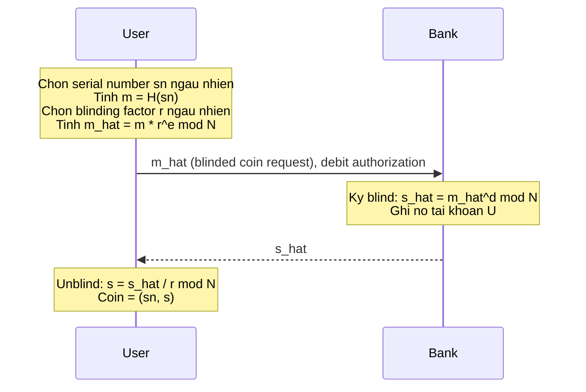
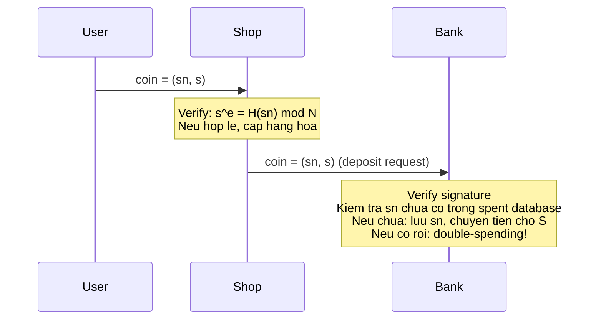
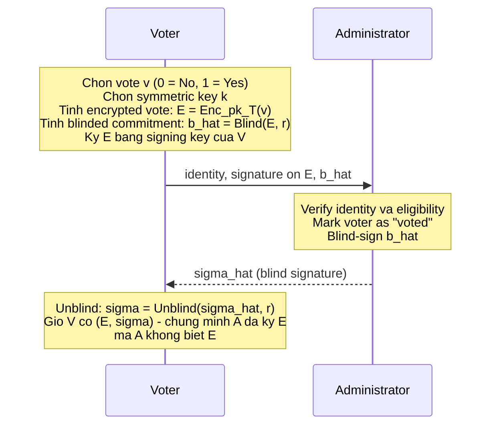
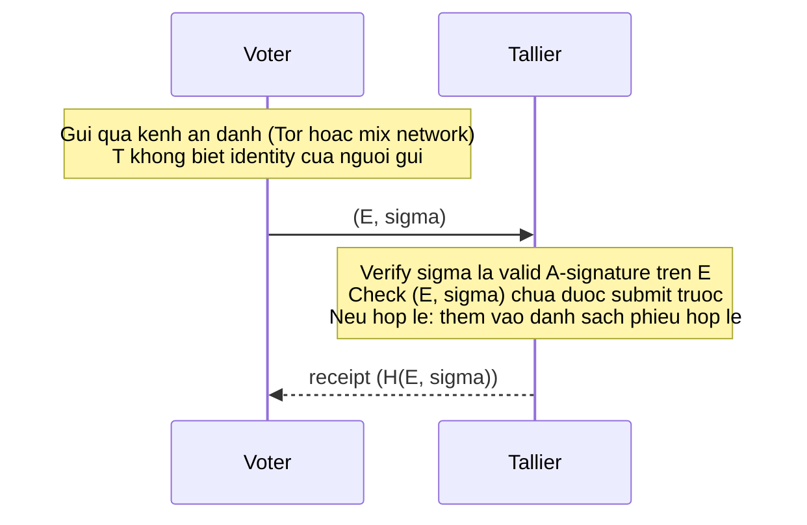
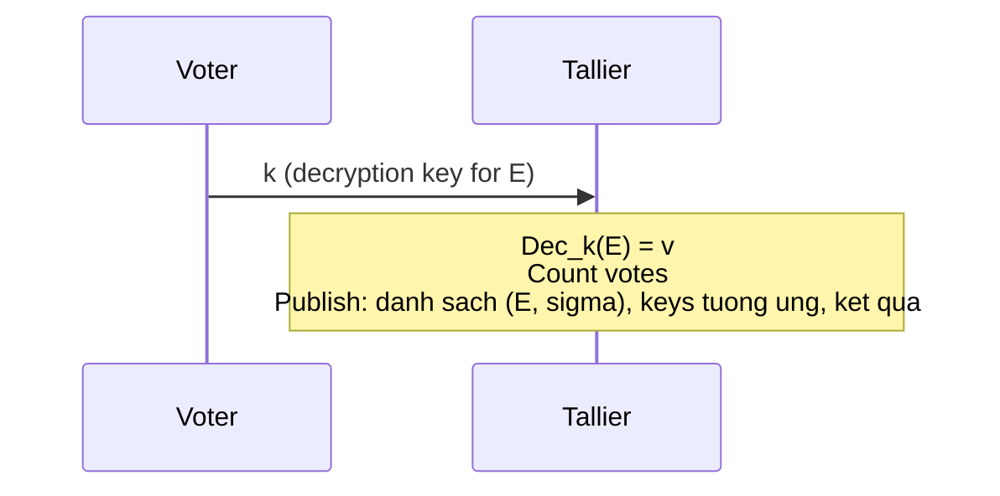
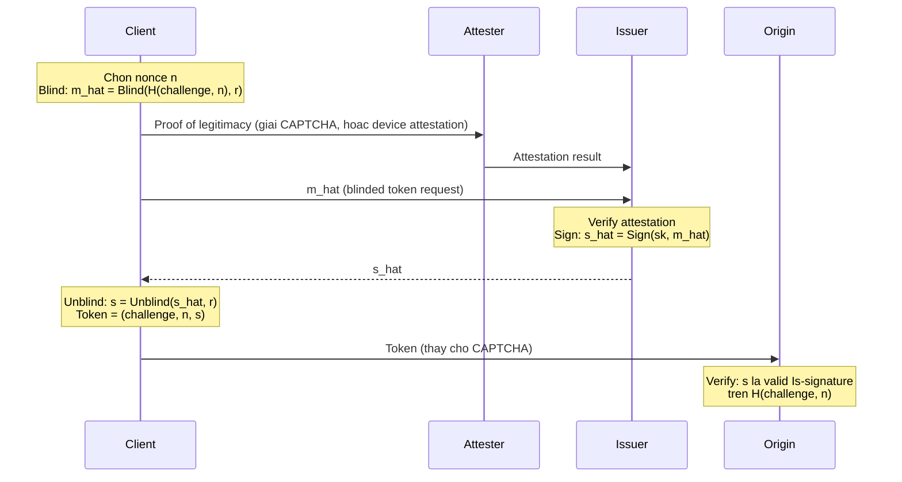
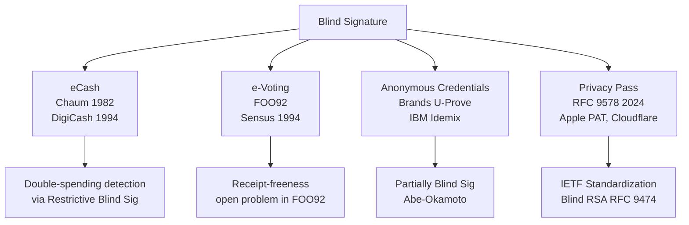

> **Prerequisites**: [[01-blind-signature-definition-security-models|01. Definition & Security Models]], [[02-chaum-rsa-blind-signature|02. Chaum RSA Blind Signature]], [[08-abe-okamoto-partially-blind|08. Partially Blind Signature: Abe-Okamoto]]
> **Lesson type**: Protocol
>
> **Notation** (ký hiệu dùng mà không định nghĩa trong bài này):
> | Ký hiệu | Ý nghĩa |
> |---------|---------|
> | $\lambda$ | Security parameter |
> | $\mathsf{pk}, \mathsf{sk}$ | Public key, secret key |
> | $\mathcal{A}$ | Adversary |
> | $N = pq$ | RSA modulus |
> | $e, d$ | RSA public/secret exponent |
> | $H$ | Hash function (random oracle) |
> | $\mathsf{Enc}, \mathsf{Dec}$ | Public-key encryption, decryption |

---

## Motivation

Các bài học trước tập trung vào formal definitions, security proofs, và attacks. Bài này trả lời câu hỏi ngược lại: **blind signature thực sự được dùng để làm gì?** Ba ứng dụng cốt lõi đã định hình lịch sử của privacy-preserving cryptography: eCash của Chaum (1982), e-voting FOO92, và anonymous credentials. Ngoài ra, các hệ thống hiện đại như Privacy Pass (IETF RFC 9574, 9578) đang triển khai blind signature trong sản phẩm thực tế ở quy mô lớn.

Mỗi ứng dụng đặt ra các **yêu cầu an ninh đặc thù** vượt ra ngoài blindness và OMUF cơ bản — double-spending detection, eligibility checking, coercion resistance — và đây chính là nguồn gốc của các lỗ hổng thực tế.

---

## Phần 1: DigiCash — eCash của Chaum

### Mô hình đe dọa và mục tiêu

Hệ thống tiền điện tử cần cân bằng hai thuộc tính đối nghịch: (1) **untraceability** — ngân hàng không link được coin đã rút với giao dịch chi tiêu; (2) **unforgeability** — không ai có thể mint coin giả. Chaum (1982) giải quyết tension này bằng blind signature.

**Entities:** User (U), Bank (B — signer), Shop (S — verifier).

### Protocol Withdraw (Rút Tiền)

U nhận được **coin = (sn, s)** trong đó $s = H(\mathsf{sn})^d \bmod N$ là chữ ký hợp lệ của Bank trên serial number, nhưng Bank không biết $\mathsf{sn}$.

### Protocol Spend (Chi Tiêu)

> [!note] Tại sao Bank không link được coin
> Bank ký $\hat m = H(\mathsf{sn}) \cdot r^e \bmod N$. Sau khi U unblind, Bank nhận được deposit của $(\mathsf{sn}, s)$ với $s = H(\mathsf{sn})^d \bmod N$. Để link, Bank cần tìm $\mathsf{sn}$ sao cho $H(\mathsf{sn})^d = s$ — tức là đảo ngược RSA. Trong ROM: Bank thấy tập hợp tất cả $\hat m$ đã ký và tập hợp tất cả $H(\mathsf{sn})$ khi deposit, nhưng blinding factor $r$ (chưa biết) tạo ra bijection ngẫu nhiên giữa hai tập → perfect blindness.

### Double-Spending Detection

Off-line eCash (User chi tiêu mà Shop không cần online với Bank ngay) **không thể ngăn chặn** double-spending — chỉ có thể phát hiện sau. Khi Bank nhận hai deposit cùng $\mathsf{sn}$: biết có fraud nhưng không biết ai (vì anonymity).

Để **identify** double-spender, cần thêm cơ chế từ **restrictive blind signatures** (Brands, Lesson 09): coin buộc phải encode identity ẩn sao cho khi chi tiêu hai lần, hai transcripts tiết lộ identity. Cụ thể trong scheme của Brands: coin có dạng $(A, z)$ với $A = (Ig_2)^s$ và $I$ là account number; khi chi tiêu, User thực hiện Okamoto identification với $A$ làm commitment; nếu double-spend, Bank nhận hai challenges $c \neq c'$ và giải hệ phương trình để tính $I$ — tức là account number của double-spender.

> [!warning] Giới hạn của off-line eCash
> Off-line double-spending detection (phát hiện sau) vẫn cho phép thiệt hại xảy ra. On-line verification (Shop check với Bank ngay khi nhận coin) ngăn được nhưng hy sinh tính off-line. Đây là trade-off cơ bản chưa được giải quyết hoàn toàn trong eCash off-line.

---

## Phần 2: FOO92 — E-Voting với Blind Signature

Fujioka, Okamoto và Ohta (1992) đề xuất scheme e-voting dùng blind signature để đạt đồng thời **anonymity** (cơ quan kiểm phiếu không biết ai bỏ phiếu gì) và **eligibility** (chỉ cử tri đăng ký mới được phiếu).

### Entities và Phases

**Entities:** Voter (V), Administrator (A — xác nhận tư cách cử tri và ký mù), Tallier (T — đếm phiếu). Quan trọng: A và T là **hai entity khác nhau**.

### Phase 1 — Chuẩn bị và Đăng ký

### Phase 2 — Bỏ Phiếu Ẩn Danh

### Phase 3 — Mở Phiếu

Sau deadline bỏ phiếu: mỗi Voter public key $k$ của mình (có thể anon qua mix net hoặc công khai sau khi tallying phase).

> [!abstract] Theorem 16.1 — Correctness và Anonymity của FOO92
> Với adversary tấn công Administrator: A không biết nội dung phiếu vì E được mã hóa bằng public key của T. Với adversary tấn công Tallier: T nhận (E, sigma) qua kênh ẩn danh, không biết identity người gửi; blindness của signature đảm bảo A không link được sigma với voter.

**Proof sketch.** Anonymity phân tách thành hai phần: (1) A không biết $v$ vì $\mathsf{Enc}_{pk_T}$ là IND-CPA, (2) T không link được $(E, \sigma)$ với voter nhờ kênh ẩn danh. Hai bên không thể collude hiệu quả nếu kênh ẩn danh là computationally hiding. $\square$

### Vulnerabilities của FOO92

> [!warning] Coercion và Vote Buying
> Voter có thể **tạo receipt verifiable** cho kẻ tấn công: cung cấp $(v, k, r)$ trước khi bỏ phiếu, chứng minh cam kết bỏ phiếu theo ý. Kẻ mua phiếu có thể kiểm tra sau khi Voter nộp $k$. FOO92 **không đạt receipt-freeness** — đây là limitation cơ bản.

> [!warning] Eligibility Verification vs. Anonymity Trade-off
> Phase 1 yêu cầu Voter xác minh identity với A trước khi nhận chữ ký. Nếu A log timestamp đăng ký và T biết thời điểm submit, có thể narrow down identity theo timing. Trong thực tế, cần mix network đủ mạnh để ẩn timing.

> [!warning] Partial Tally Attack
> Nếu T publish danh sách phiếu **trước khi** tất cả Voter nộp key $k$, kẻ tấn công có thể không nộp $k$ của mình nếu thấy kết quả đang bất lợi — tấn công selective key revelation.

---

## Phần 3: Anonymous Credentials

### Mô hình Cơ Bản

Anonymous credential cho phép User chứng minh "Tôi có credential hợp lệ từ Issuer" với Verifier, mà Verifier không học được identity hay có thể link hai lần presentation.

Có thể xem credential như **attribute-bound blind signature**: Issuer ký lên tập thuộc tính $(a_1, \ldots, a_k)$ của User bằng blind signature. Khi present với Verifier, User prove (bằng ZK) rằng mình có signature hợp lệ trên attributes mà không reveal signature hay identity.

### U-Prove (Microsoft, dựa trên Brands credentials)

U-Prove sử dụng restrictive blind signature structure (từ Brands 1994). Token là $(\mathbf{a}, \sigma)$ trong đó $\mathbf{a} = (a_1, \ldots, a_k)$ là attribute vector và $\sigma$ là Okamoto-type signature của Issuer gắn với public key $Z = g_1^{a_1} \cdots g_k^{a_k} h^s$.

**Issuance:** Blind Okamoto-Schnorr protocol giữa User và Issuer.

**Presentation:** User prove knowledge of valid token qua ZK proof — không reveal $\sigma$ trực tiếp mà prove nó exists.

**Single-use tokens:** Mỗi token dùng được đúng một lần (như coin trong eCash) — prevent linking. Multi-use cần thêm mechanism.

### Partially Blind Signatures trong Anonymous Credentials

Lesson 08 (Abe-Okamoto) cho thấy partially blind signature cho phép credential có **public info field** — phần Issuer biết — và **hidden info field** — phần blind. Ứng dụng trực tiếp:

> [!example] Anonymous Credential với Expiry Date
> Issuer phát credential với `info = "expires: 2026-12-31"` (public, Issuer biết) và attributes chứa identity hash (hidden, Issuer không biết khi present). Verifier kiểm tra expiry trong `info` field mà không học identity. Đây là use case trực tiếp của Abe-Okamoto partially blind signature từ Lesson 08.

---

## Phần 4: Privacy Pass — Blind Signature ở Production Scale

### Bối cảnh

Privacy Pass được thiết kế ban đầu (2018) để giảm số lần CAPTCHA cho người dùng Tor. Đến 2024, IETF chuẩn hóa thành RFC 9576 (Architecture), RFC 9577 (HTTP Auth Scheme), RFC 9578 (Issuance Protocols). Các deployment thực tế: Cloudflare, Apple Private Access Tokens (iOS/macOS), Google One VPN, Kagi Search.

### Kiến trúc Privacy Pass

Có bốn entity: **Client** (người dùng), **Attester** (xác nhận Client là legitimate, vd. CAPTCHA service), **Issuer** (Signer — phát token), **Origin** (Verifier — nhận token thay vì CAPTCHA).

**Blind RSA (RFC 9474):** Token type dùng trong Privacy Pass issuance dựa trực tiếp trên Chaum RSA blind signature với RSA-PSS padding — được standardize để tránh attack từ Lesson 11.

> [!info] Các Deployment Thực Tế (2024–2025)
> Apple **Private Access Tokens**: iOS/macOS dùng device attestation thay CAPTCHA — Attester là Apple, Issuer là Cloudflare/Fastly, Origin là bất kỳ website nào. Giải CAPTCHA **một lần** khi setup device; sau đó token tự động issued.
>
> **Kagi Search** (2025): Dùng Privacy Pass để tách authentication (logged-in subscription check) khỏi search query — Kagi không biết query nào tương ứng với user nào.
>
> **Google One VPN**: Blind RSA để xác thực VPN session mà không link với Google account.

---

## Phần 5: Integration Vulnerabilities

Các vulnerability trong ứng dụng thực tế thường không từ flaw trong blind signature scheme mà từ cách ghép scheme vào hệ thống lớn hơn.

> [!warning] Vulnerability 1 — Serial Number không đủ Entropy
> Trong eCash: nếu User chọn $\mathsf{sn}$ từ không gian nhỏ (vd: sequence 1, 2, 3, ...) thay vì ngẫu nhiên, Bank có thể brute-force $H(\mathsf{sn})$ và link coin khi deposit. Fix: $\mathsf{sn} \stackrel{R}{\leftarrow} \{0,1\}^{256}$.

> [!warning] Vulnerability 2 — Timing Attack trên Unlink Property
> FOO92 và Privacy Pass đều assume kênh ẩn danh đủ mạnh. Nếu adversary observe timing (khi nào issuance xảy ra vs. khi nào token được present), có thể narrow candidates. Kênh anonymity (Tor, mix net) phải thực sự mix đủ traffic.

> [!warning] Vulnerability 3 — Issuer Key Reuse và Token Fingerprinting
> Nếu Issuer dùng cùng $(\mathsf{sk}, \mathsf{pk})$ cho nhiều Client batch với attibutes khác nhau, Verifier có thể fingerprint bằng cách phân tích distribution của tokens. Privacy Pass giải quyết bằng key rotation và public key transparency.

> [!warning] Vulnerability 4 — Missing Double-Spend Check
> Trong eCash off-line: nếu Bank không check spent database trước khi accept deposit (vì overwhelmed hoặc race condition), double-spending xảy ra. Database phải atomic — check và insert trong cùng transaction.

> [!warning] Vulnerability 5 — Credential Linkability qua Attribute Correlation
> Anonymous credential chỉ ẩn danh nếu attribute set không quá unique. Nếu Verifier thu thập nhiều presentations với cùng attribute pattern, có thể re-identify User bằng statistical analysis. Minimize disclosed attributes per presentation (principle of least disclosure).

---

## Bức Tranh Toàn Cảnh

---

## Summary

**eCash (Chaum 1982):** Bank ký mù serial number coin; User chi tiêu coin ở Shop; Bank check double-spend khi deposit. Off-line → detect after; on-line → prevent. Restrictive blind sig → identify double-spender.

**FOO92:** Administrator ký mù encrypted vote → User submit qua kênh ẩn danh → Tallier đếm sau khi User reveal key. Không đạt receipt-freeness — coercion vẫn có thể.

**Anonymous Credentials:** Issuer ký attribute-bound credential qua blind protocol; User proves bằng ZK khi present. Partially blind sig (Abe-Okamoto) cho phép public policy field (expiry, issuer ID).

**Privacy Pass (2024):** Production deployment của Chaum RSA (RFC 9474) trong IETF-standardized privacy token protocol. Dùng bởi Apple, Cloudflare, Google, Kagi.

**Integration vulnerabilities:** serial number entropy, timing leaks, issuer key reuse, missing atomic double-spend check, attribute correlation.

---

## References

- Chaum, D. — *Blind Signatures for Untraceable Payments*, CRYPTO 1982
- Chaum, D., Fiat, A., Naor, M. — *Untraceable Electronic Cash*, CRYPTO 1988
- Fujioka, A., Okamoto, T., Ohta, K. — *A Practical Secret Voting Scheme for Large Scale Elections*, AUSCRYPT 1992
- Brands, S. — *Untraceable Off-line Cash in Wallet with Observers*, CRYPTO 1993
- Paquin, C. — *U-Prove Technology Overview*, Microsoft Research 2011
- Davidson et al. — *Privacy Pass: Bypassing Internet Challenges Anonymously*, PoPETs 2018
- Denis, F., Jacobs, F., Wood, C. A. — *RSA Blind Signatures*, RFC 9474, October 2023
- Davidson, A., Iyengar, J., Wood, C. A. — *The Privacy Pass Architecture*, RFC 9576, June 2024
- Celi, S., Davidson, A., Valdez, S., Wood, C. A. — *Privacy Pass Issuance Protocols*, RFC 9578, June 2024
