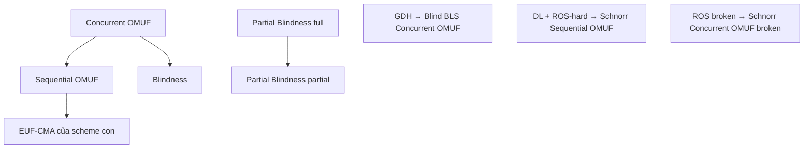

> **Liên quan**: [[01-blind-signature-definition-security-models|01. Definition & Security Models]], [[02-chaum-rsa-blind-signature|02. Chaum RSA]], [[03-schnorr-blind-signature|03. Schnorr Blind Signature]], [[04-okamoto-schnorr-blind-signature|04. Okamoto-Schnorr]], [[05-blind-ecdsa|05. Blind ECDSA]]
>
> **Mục đích**: Tổng hợp tất cả định nghĩa hình thức, security game, và notation dùng xuyên suốt course. Dùng như quick reference khi đọc proof hoặc phân tích scheme mới.

---

## Phần I — Blind Signature Syntax

> [!note] Definition A2.1 — Blind Signature Scheme
> Một **blind signature scheme** là bộ thuật toán $(\mathsf{KeyGen}, \langle \mathsf{User}, \mathsf{Signer} \rangle, \mathsf{Verify})$:
>
> **$\mathsf{KeyGen}(1^\lambda)$**
> - Input: security parameter $\lambda$
> - Output: $(\mathsf{sk}, \mathsf{pk})$ — secret key và public key
>
> **$\langle \mathsf{User}(\mathsf{pk}, m),\; \mathsf{Signer}(\mathsf{sk}) \rangle$**
> - Interactive protocol giữa User (có $\mathsf{pk}$ và message $m$) và Signer (có $\mathsf{sk}$)
> - Output của User: signature $\sigma \in \{0,1\}^*$ hoặc $\perp$
> - Output của Signer: $\top$ (completed) hoặc $\perp$ (aborted)
>
> **$\mathsf{Verify}(\mathsf{pk}, m, \sigma)$**
> - Input: public key $\mathsf{pk}$, message $m \in \mathcal{M}$, signature $\sigma$
> - Output: $1$ (accept) hoặc $0$ (reject)

---

## Phần II — Correctness

> [!abstract] Definition A2.2 — Correctness
> Scheme đạt **correctness** nếu với mọi $(\mathsf{sk}, \mathsf{pk}) \leftarrow \mathsf{KeyGen}(1^\lambda)$, mọi $m \in \mathcal{M}$, execution trung thực của protocol cho $\sigma$ thỏa:
>
> $$
> \Pr[\mathsf{Verify}(\mathsf{pk}, m, \sigma) = 1] = 1
> $$
>
> (hoặc $\geq 1 - \mathsf{negl}(\lambda)$ trong trường hợp có correctness error, vd. lattice schemes)

---

## Phần III — Blindness

> [!note] Definition A2.3 — Blindness Game (Real vs. Ideal)
> **Game $\mathsf{BLIND}^\mathcal{A}(1^\lambda)$**:
>
> **$\mathsf{BLIND}_0$ (Real):**
> > - Challenger chạy $(\mathsf{sk}, \mathsf{pk}) \leftarrow \mathsf{KeyGen}(1^\lambda)$
> > - $\mathcal{A}(\mathsf{sk})$ gửi hai messages $m_0, m_1 \in \mathcal{M}$
> > - Challenger chọn $b \stackrel{R}{\leftarrow} \{0,1\}$
> > - Challenger thực hiện đồng thời hai signing sessions: session $b$ cho $m_0$ và session $1-b$ cho $m_1$
> > - $\mathcal{A}$ quan sát cả hai sessions (nhưng không biết $b$), output $b' \in \{0,1\}$
> > - $\mathcal{A}$ thắng nếu $b' = b$
>
> Scheme đạt **blindness** nếu:
>
> $$
> \Pr[b' = b] \leq \frac{1}{2} + \mathsf{negl}(\lambda)
> $$
>
> **Perfect blindness**: $\Pr[b' = b] = \frac{1}{2}$ — information-theoretic, không phụ thuộc computational power của $\mathcal{A}$.

---

## Phần IV — One-More Unforgeability (OMUF)

> [!note] Definition A2.4 — Sequential OMUF Game
> **Game $\mathsf{OMUF\text{-}SEQ}^\mathcal{A}(1^\lambda)$**:
>
> - Challenger chạy $(\mathsf{sk}, \mathsf{pk}) \leftarrow \mathsf{KeyGen}(1^\lambda)$, gửi $\mathsf{pk}$ cho $\mathcal{A}$
> - $\mathcal{A}$ gửi signing requests **tuần tự** (đóng session này trước khi mở session kế tiếp)
> - Challenger đóng vai Signer, trả lời $\ell$ signing sessions hoàn chỉnh
> - $\mathcal{A}$ output $\ell + 1$ cặp $(m_i, \sigma_i)$ với $m_i$ phân biệt
>
> $\mathcal{A}$ thắng nếu $\mathsf{Verify}(\mathsf{pk}, m_i, \sigma_i) = 1$ với mọi $i \in [\ell+1]$.
>
> Scheme đạt **sequential OMUF** nếu $\Pr[\mathcal{A} \text{ wins}] \leq \mathsf{negl}(\lambda)$.

> [!note] Definition A2.5 — Concurrent OMUF Game
> **Game $\mathsf{OMUF\text{-}CONC}^\mathcal{A}(1^\lambda)$**: Như Definition A2.4, nhưng $\mathcal{A}$ có thể mở **nhiều sessions đồng thời** (interleave messages từ nhiều sessions theo thứ tự tùy ý).
>
> Scheme đạt **concurrent OMUF** nếu $\Pr[\mathcal{A} \text{ wins}] \leq \mathsf{negl}(\lambda)$.
>
> **Quan hệ**: Concurrent OMUF $\Rightarrow$ Sequential OMUF (chiều ngược không đúng — Schnorr blind sig là counterexample điển hình).

---

## Phần V — EUF-CMA (So sánh)

> [!note] Definition A2.6 — EUF-CMA (Existential Unforgeability under Chosen Message Attack)
> **Game $\mathsf{EUF\text{-}CMA}^\mathcal{A}(1^\lambda)$** cho signature scheme thông thường:
>
> - Challenger: $(\mathsf{sk}, \mathsf{pk}) \leftarrow \mathsf{KeyGen}(1^\lambda)$, gửi $\mathsf{pk}$ cho $\mathcal{A}$
> - $\mathcal{A}$ query signing oracle $\mathcal{O}_\mathsf{Sign}(m)$ (không cần là blind): nhận $\sigma = \mathsf{Sign}(\mathsf{sk}, m)$
> - $\mathcal{A}$ output $(m^*, \sigma^*)$ với $m^*$ chưa từng query
>
> $\mathcal{A}$ thắng nếu $\mathsf{Verify}(\mathsf{pk}, m^*, \sigma^*) = 1$.
>
> **Khác biệt với OMUF**: EUF-CMA cho phép adversary nhận đúng $m$ chữ ký rồi forge message thứ $m+1$; OMUF cho phép chỉ $\ell$ interactions nhưng adversary phải output $\ell+1$ valid signatures (có thể forge message từ interaction).

> [!info] Quan hệ giữa EUF-CMA và OMUF
> OMUF mạnh hơn EUF-CMA theo nghĩa sau: OMUF adversary không cần query message cụ thể — nó thực hiện signing protocol trực tiếp và cố forge $\ell+1$ sigs từ $\ell$ interactions. Điều này khó hơn vì Signer ký mà không biết message. Tuy nhiên OMUF không tự động imply EUF-CMA cho scheme thông thường — đây là property riêng của blind signatures.

---

## Phần VI — Computational Models

> [!note] Definition A2.7 — Random Oracle Model (ROM)
> Trong **Random Oracle Model**, hash function $H: \{0,1\}^* \to \{0,1\}^\lambda$ được model như một hàm ngẫu nhiên thực sự (truly random function):
>
> - Mọi query mới $x$ trả về output đều $\stackrel{R}{\leftarrow} \{0,1\}^\lambda$
> - Cùng query $x$ luôn trả về cùng output (consistent)
> - Challenger và Adversary đều truy cập qua oracle interface
>
> Chứng minh bảo mật trong ROM là heuristic — không đảm bảo an toàn khi $H$ được instantiate bằng hash function cụ thể. Tuy nhiên đây là model chuẩn được chấp nhận rộng rãi.

> [!note] Definition A2.8 — Algebraic Group Model (AGM)
> Trong **Algebraic Group Model**, adversary $\mathcal{A}$ là **algebraic**: mỗi group element $Z$ mà $\mathcal{A}$ output phải kèm theo explicit representation dưới dạng tổ hợp tuyến tính của các group elements đã nhận:
>
> $$
> Z = \prod_{i} g_i^{a_i}
> $$
>
> trong đó $(g_i)$ là tất cả group elements $\mathcal{A}$ đã nhận trước đó.
>
> AGM mạnh hơn generic group model nhưng yếu hơn standard model. Cho phép chứng minh bảo mật của Blind Schnorr trong setting concurrent với assumption mạnh hơn (OMDL thay vì DL).

> [!note] Definition A2.9 — Quantum ROM (QROM)
> **Quantum Random Oracle Model**: Adversary có thể query $H$ theo superposition. Quan trọng cho post-quantum security proofs. Nhiều reduction kỹ thuật cần sửa đổi đáng kể khi chuyển từ ROM sang QROM (vd: không thể dùng lazy sampling đơn giản; cần "measure-and-reprogram" technique).

---

## Phần VII — Hardness Assumptions

> [!note] Definition A2.10 — Discrete Logarithm Problem (DLP)
> **DLP** trong group $\mathbb{G}$ bậc nguyên tố $q$, generator $g$: cho $X = g^x$, tìm $x \in \mathbb{Z}_q$.
>
> $(t,\varepsilon)$-hard DLP: không có adversary chạy trong thời gian $t$ giải DLP với xác suất $\geq \varepsilon$.

> [!note] Definition A2.11 — One-More Discrete Logarithm (OMDL)
> **OMDL**: Adversary được truy cập DL oracle $\mathsf{DL}(\cdot)$ (giải DLP cho elements được query), nhận $n+1$ random group elements $X_1, \ldots, X_{n+1}$, và phải tính $\mathsf{DL}(X_i)$ cho tất cả $i \in [n+1]$ với **chỉ $n$ queries** tới DL oracle.
>
> OMDL $\Rightarrow$ DLP (hiển nhiên). OMDL hardness dùng trong proof security của Schnorr blind sig dưới sequential OMUF + AGM.

> [!note] Definition A2.12 — RSA Inversion Assumption
> Cho $N = pq$ (RSA modulus), public exponent $e$, và $y \stackrel{R}{\leftarrow} \mathbb{Z}_N^*$: tìm $x$ sao cho $x^e \equiv y \pmod{N}$.
>
> **ct-RSA (chosen-target RSA)**: Adversary nhận $y$ và có oracle ký bất kỳ message $m \neq y$, cần forge signature trên $y$. Dùng trong proof security của Chaum RSA blind sig concurrent OMUF (Bellare, Namprempre, Pointcheval, Semanko 2003).

> [!note] Definition A2.13 — Gap Diffie-Hellman (GDH) Assumption
> Trong group $\mathbb{G}$ với bilinear pairing $e$: Cho $(g, g^a, g^b)$, tính $g^{ab}$ là CDH-hard, nhưng Adversary có truy cập oracle quyết định DDH (Decisional DH). Dùng trong proof security của Blind BLS (Boldyreva 2003).

> [!note] Definition A2.14 — SIS (Short Integer Solution)
> Cho matrix $\mathbf{A} \stackrel{R}{\leftarrow} \mathbb{Z}_q^{n \times m}$: tìm $\mathbf{z} \in \mathbb{Z}^m$ với $\|\mathbf{z}\|_\infty \leq \beta$ sao cho $\mathbf{A}\mathbf{z} = \mathbf{0} \pmod{q}$.
>
> Dùng trong security proof của lattice-based blind signatures (Fischlin-type variants).

---

## Phần VIII — Partially Blind Signatures

> [!note] Definition A2.15 — Partially Blind Signature Syntax
> Mở rộng Definition A2.1 với **common information field** $\mathsf{info} \in \mathcal{I}$:
>
> **$\langle \mathsf{User}(\mathsf{pk}, m, \mathsf{info}),\; \mathsf{Signer}(\mathsf{sk}, \mathsf{info}) \rangle$**
> - Cả hai bên đều biết $\mathsf{info}$ (không blind)
> - Chỉ $m$ được giữ blind với Signer
>
> **$\mathsf{Verify}(\mathsf{pk}, m, \mathsf{info}, \sigma)$** — Verify cả $m$ lẫn $\mathsf{info}$
>
> **Partial blindness**: Signer không học được $m$ từ protocol transcript (nhưng biết $\mathsf{info}$).

---

## Phần IX — Notation Summary

Bảng ký hiệu dùng nhất quán xuyên suốt course:

| Ký hiệu | Ý nghĩa | Defined in |
|---------|---------|------------|
| $\lambda$ | Security parameter | Course-wide |
| $\mathsf{negl}(\lambda)$ | Negligible function | Course-wide |
| $\stackrel{R}{\leftarrow}$ | Uniform random sampling | Course-wide |
| $\mathcal{A}$ | Adversary (PPT) | [[01-blind-signature-definition-security-models\|L01]] |
| $\mathcal{M}$ | Message space | [[01-blind-signature-definition-security-models\|L01]] |
| $\mathsf{pk}, \mathsf{sk}$ | Public/secret key | [[01-blind-signature-definition-security-models\|L01]] |
| $N = pq$ | RSA modulus | [[02-chaum-rsa-blind-signature\|L02]] |
| $e, d$ | RSA public/secret exponent | [[02-chaum-rsa-blind-signature\|L02]] |
| $\mathbb{Z}_N^*$ | Multiplicative group mod $N$ | [[02-chaum-rsa-blind-signature\|L02]] |
| $\mathbb{G}$ | Cyclic group bậc nguyên tố $q$ | [[03-schnorr-blind-signature\|L03]] |
| $g$ | Generator của $\mathbb{G}$ | [[03-schnorr-blind-signature\|L03]] |
| $\mathbb{Z}_q$ | Ring of integers mod $q$ | [[03-schnorr-blind-signature\|L03]] |
| $H$ | Hash function (random oracle) | [[03-schnorr-blind-signature\|L03]] |
| $x, X = g^x$ | Schnorr secret/public key | [[03-schnorr-blind-signature\|L03]] |
| $g, h$ | Hai generator với unknown DL | [[04-okamoto-schnorr-blind-signature\|L04]] |
| $d, P = dG$ | ECDSA secret/public key | [[05-blind-ecdsa\|L05]] |
| $f: \mathbb{G} \to \mathbb{Z}_q$ | ECDSA x-coord conversion | [[05-blind-ecdsa\|L05]] |
| $q_H$ | Số hash queries của adversary | [[10-forking-lemma-blind-signatures\|L10]] |
| $\ell$ | Số signing sessions | [[10-forking-lemma-blind-signatures\|L10]] |
| $\mathsf{acc}$ | Acceptance probability | [[10-forking-lemma-blind-signatures\|L10]] |
| $\mathsf{frk}$ | Forking probability | [[10-forking-lemma-blind-signatures\|L10]] |
| $r$ | RSA blinding factor $\in \mathbb{Z}_N^*$ | [[11-rsa-blinding-multiplicative-forgery\|L11]] |
| $\hat{m}$ | Blinded message | [[11-rsa-blinding-multiplicative-forgery\|L11]] |
| $H_\mathsf{ros}$ | ROS oracle, range $\mathbb{Z}_p$ | [[12-ros-attack\|L12]] |
| $\hat{\rho}_i \in \mathbb{Z}_p^\ell$ | ROS coefficient vector | [[12-ros-attack\|L12]] |
| $\omega$ | Số parallel repetitions | [[13-parallel-ros-mnm-attack\|L13]] |
| $\xi$ | $\lceil \log |C| \rceil$ bits per challenge | [[13-parallel-ros-mnm-attack\|L13]] |

---

## Phần X — Security Hierarchy

Tóm tắt quan hệ giữa các security notions:

---

## References

- Pointcheval & Stern — *Security Arguments for Digital Signatures and Blind Signatures*, JoC 2000
- Bellare, Namprempre, Pointcheval, Semanko — *The One-More-RSA-Inversion Problems and the Security of Chaum's Blind Signature Scheme*, JoC 2003
- Boldyreva — *Threshold Signatures, Multisignatures and Blind Signatures Based on Gap-DH*, PKC 2003
- Abe & Okamoto — *Provably Secure Partially Blind Signatures*, CRYPTO 2000
- Boneh & Shoup — *A Graduate Course in Applied Cryptography*, Ch. 13, 19 (toc.cryptobook.us)
