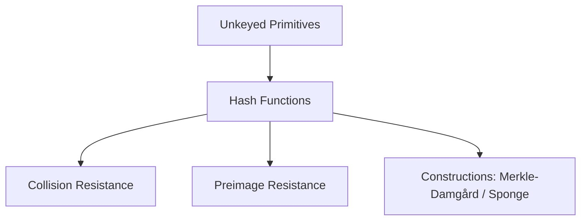
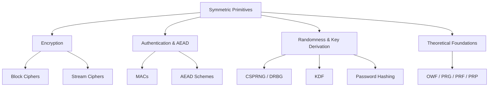

> **Prerequisites**: [[01-math-foundations|01. Mathematical Foundations]]  
> **Lesson type**: Foundation
>
> **Notation** (ký hiệu dùng mà không định nghĩa trong bài này):
> | Ký hiệu | Ý nghĩa |
> |---------|---------|
> | $K, k$ | Key (khóa mã) |
> | $M, m$ | Message / Plaintext |
> | $C, c$ | Ciphertext |
> | $\lambda$ | Security parameter |
> | $\mathbb{G}$ | Cyclic group |
> | $\{0,1\}^n$ | Tập xâu bit độ dài $n$ |

---

## 1. Tổng quan: Tại sao cần phân loại primitive?

Hãy tưởng tượng bạn cần xây một ngôi nhà an toàn. Bạn không cần phát minh lại xi măng, gạch hay thép — bạn chọn vật liệu phù hợp và lắp ghép chúng đúng cách. Mật mã học cũng vậy.

**Cryptographic primitive** là những "vật liệu xây dựng" cơ bản nhất — mỗi primitive giải quyết một vấn đề bảo mật cụ thể, có tính chất toán học được định nghĩa chính xác, và có thể được kết hợp để xây dựng hệ thống phức tạp hơn.

Câu hỏi then chốt khi đánh giá bất kỳ primitive nào là:
1. **Nó giải quyết vấn đề gì?** — Confidentiality? Integrity? Authentication? Non-repudiation?
2. **Nó dựa trên bài toán khó nào?** — Factoring? DLP? LWE?
3. **Điều kiện sử dụng đúng là gì?** — Key phải ngẫu nhiên? Nonce không được tái dùng?

Bài học này đi qua **từng loại primitive** theo cây phân loại, kèm câu chuyện thực tế để ghi nhớ. Trục phân loại chính là **key**: không cần key (Unkeyed) → dùng shared key (Symmetric) → dùng cặp public/private key (Asymmetric) → các protocol và building block nâng cao (Advanced).

![[assets/img-LB-01-primitive-tree.png]]
*Bản đồ primitive theo trục key: Unkeyed (Hash) → Symmetric (Encryption, Auth/AEAD, Randomness/KDF/PassHash, Theoretical Foundations OWF/PRF/PRG) → Asymmetric (PKE, KEM, Key Exchange, Signature, IBE/ABE) → Advanced (Building Blocks, MPC/FHE, ZKP). KDF và CSPRNG nằm trong Symmetric vì dùng HMAC/AES làm core internal primitive.*

---

## 2. UNKEYED PRIMITIVES — Không cần key

Trong nhóm này, không có bí mật nào được chia sẻ trước. Bất kỳ ai cũng có thể tính toán, bất kỳ ai cũng có thể verify. Tính chất an toàn đến từ cấu trúc toán học của hàm, không phải từ secrecy của tham số.

### 2.1. Hash Functions — Hàm băm

**Câu chuyện**: Năm 2004, Xiaoyun Wang công bố tìm được collision trong MD5. Năm 2008, Marc Stevens dùng collision MD5 để giả mạo certificate CA, tạo được CA certificate giả mạo có thể ký bất kỳ domain nào — tức là hoàn toàn phá vỡ HTTPS. Năm 2012, malware Flame exploit MD5 collision để forge Microsoft certificate, lây nhiễm mà không cần crack private key.

> [!note] Định nghĩa: Hash Function
> Một **cryptographic hash function** là hàm $H: \{0,1\}^* \to \{0,1\}^n$ (không có key) với ba tính chất:
>
> **1. Preimage resistance**: Cho $y$, khó tìm $x$ sao cho $H(x) = y$. (Security $\approx 2^n$ queries)  
> **2. Second preimage resistance**: Cho $x_1$, khó tìm $x_2 \neq x_1$ sao cho $H(x_1) = H(x_2)$. (Security $\approx 2^n$ queries)  
> **3. Collision resistance**: Khó tìm bất kỳ $x_1 \neq x_2$ nào sao cho $H(x_1) = H(x_2)$. (Security $\approx 2^{n/2}$ queries — birthday bound)
>
> Thứ bậc: Collision resistance $\Rightarrow$ Second preimage resistance $\Rightarrow$ Preimage resistance. (Chiều ngược lại không đúng.)

**MD5**: 128-bit output. Broken hoàn toàn về collision resistance. **Không dùng** trong bất kỳ ứng dụng security nào.

**SHA-1**: 160-bit output. Broken (SHAttered 2017 — Google và CWI tìm SHA-1 collision). **Không dùng**.

**SHA-2** (SHA-256, SHA-384, SHA-512): Dựa trên Merkle-Damgård construction. Vẫn an toàn. **Dùng SHA-256** cho ứng dụng thông thường.

**SHA-3 (Keccak)**: Sponge construction — hoàn toàn khác kiến trúc SHA-2. Không có Merkle-Damgård weakness (không có length extension attack). **SHA-3-256** là lựa chọn conservative.

**BLAKE2 / BLAKE3**: Nhanh hơn SHA-2/SHA-3, không có MD weakness. BLAKE3 song song hóa được. Dùng nhiều trong ứng dụng hiệu năng cao.

> [!info] Hai kiến trúc construction
> **Merkle-Damgård** (SHA-2): compress từng block $h_i = f(h_{i-1}, m_i)$. Nhược điểm: **length extension attack** — từ $H(m)$ có thể tính $H(m \| \text{ext})$ mà không biết $m$.
>
> **Sponge** (SHA-3/Keccak): absorb tất cả input vào state, squeeze output. Không có length extension weakness vì state không bị lộ hoàn toàn trong output.

---

## 3. SYMMETRIC PRIMITIVES — Khóa chia sẻ

Trong crypto đối xứng, Alice và Bob **chia sẻ cùng một key bí mật** $k$ trước khi giao tiếp. Vấn đề: làm sao họ thỏa thuận $k$ khi kẻ địch nghe lén? (Đây chính là lý do asymmetric crypto ra đời.)

Symmetric primitives bao gồm: Encryption, Authentication/AEAD, Randomness & Key Derivation, và Theoretical Foundations (OWF/PRG/PRF/PRP) — tất cả đều dùng shared secret key làm nền tảng.

### 3.1. Encryption — Mã hóa

#### 3.1.1. Block Ciphers — Mã khối

**Câu chuyện**: Năm 1977, NIST cần một chuẩn mã hóa quốc gia cho ngân hàng và chính phủ Mỹ. IBM đề xuất DES — một cipher dùng key 56-bit. Năm 1997, mạng lưới phân tán đã crack DES trong 22 giờ. Năm 2001, AES (Rijndael của hai nhà mật mã Bỉ) thay thế DES, với key 128/192/256 bit — và vẫn đứng vững đến hôm nay.

> [!note] Định nghĩa: Block Cipher
> Một **block cipher** với block size $n$ và key size $k$ là một hàm:
>
> $$E: \{0,1\}^k \times \{0,1\}^n \to \{0,1\}^n$$
>
> sao cho với mọi key $K$, $E_K(\cdot) = E(K, \cdot)$ là một **hoán vị (permutation)** trên $\{0,1\}^n$. Block cipher lý tưởng là **Pseudorandom Permutation (PRP)**: không có PPT adversary nào phân biệt được $E_K$ với một hoán vị ngẫu nhiên thực sự.

**AES** (Advanced Encryption Standard): Block size 128 bit, key 128/192/256 bit. Gồm 10/12/14 vòng (rounds), mỗi vòng có 4 phép biến đổi: SubBytes (S-box thay thế trên $\mathbb{F}_{2^8}$), ShiftRows, MixColumns (nhân ma trận trên $\mathbb{F}_{2^8}$), AddRoundKey (XOR với round key). Thiết kế đạt **confusion** (S-box) và **diffusion** (MixColumns + ShiftRows).

**Lightweight block ciphers**: PRESENT (64-bit block, 80-bit key) cho IoT devices; SIMON/SPECK của NSA cho hardware/software tối ưu.

> [!warning] Block cipher KHÔNG phải encryption scheme hoàn chỉnh
> Block cipher chỉ encrypt một block. Để encrypt message dài, cần **mode of operation** — và chọn sai mode là nguồn gốc của hầu hết vulnerabilities (ECB, CBC bit-flip, GCM nonce reuse). Xem L07, L08.

#### 3.1.2. Stream Ciphers — Mã dòng

**Câu chuyện**: Trong Thế chiến II, người Đức dùng Enigma (một loại stream cipher cơ điện). Người Ba Lan và Anh (nhóm Bletchley Park với Alan Turing) phá được nhờ khai thác các thói quen lặp đi lặp lại của operators — nonce reuse trong ngôn ngữ hiện đại.

> [!note] Định nghĩa: Stream Cipher
> Một **stream cipher** nhận key $k$ (và thường là nonce $n$) để sinh **keystream** $z = z_1 z_2 \ldots$ có độ dài tùy ý. Mã hóa bằng XOR: $c_i = m_i \oplus z_i$.
>
> Yêu cầu: keystream phải trông ngẫu nhiên (PRG), và **nonce không được tái sử dụng** với cùng key.

**Tại sao?**: Nếu $c_1 = m_1 \oplus K$ và $c_2 = m_2 \oplus K$ (cùng keystream $K$), thì $c_1 \oplus c_2 = m_1 \oplus m_2$ — kẻ địch có ngay XOR của hai plaintext, và từ đó có thể recover cả hai nếu biết thêm thông tin về ngữ cảnh.

**RC4**: Legacy stream cipher dùng trong WEP (WiFi) và TLS cũ. Có nhiều điểm yếu thống kê nghiêm trọng — **đừng dùng**.

**ChaCha20 / Salsa20**: Stream cipher hiện đại của Daniel Bernstein. ChaCha20-Poly1305 là AEAD scheme được dùng trong TLS 1.3, Signal, WireGuard. Nhanh hơn AES-GCM trên phần cứng không có AES-NI instruction.

### 3.2. Authentication & AEAD

#### 3.2.1. MACs — Message Authentication Codes

**Câu chuyện**: Ngân hàng A gửi lệnh chuyển tiền "Transfer \$1000 to account 12345" cho ngân hàng B qua kênh mã hóa. Kẻ tấn công Mallory chặn ciphertext, flip một vài bit, và gửi lại. Ngân hàng B decrypt được "\$1000 to account 67890". Không ai biết gì. Đây là **malleability** — và MAC giải quyết vấn đề này.

> [!note] Định nghĩa: MAC
> Một **Message Authentication Code (MAC)** gồm ba thuật toán $(K\text{gen}, \text{Mac}, \text{Verify})$:
>
> **$\text{Mac}(k, m)$**: Tính **tag** $t$ từ key $k$ và message $m$.
>
> **$\text{Verify}(k, m, t)$**: Kiểm tra tag. Output $1$ (valid) hoặc $0$ (invalid).
>
> Tính chất: Không có PPT adversary nào tạo được $(m', t')$ với $\text{Verify}(k, m', t') = 1$ cho message $m'$ chưa được MAC-tagged trước đó — gọi là **EUF-CMA** (Existential Unforgeability under CMA).

**HMAC**: $\text{HMAC}(K, M) = H\big((K \oplus \text{opad}) \| H((K \oplus \text{ipad}) \| M)\big)$. An toàn với hầu hết hash functions, kể cả MD5 (mặc dù HMAC-MD5 không khuyến khích vì tâm lý). Quan trọng: HMAC **không có** length extension vulnerability dù dùng SHA-2.

**Poly1305**: MAC dựa trên polynomial evaluation trên $\mathbb{F}_{2^{130} - 5}$. Thường đi kèm ChaCha20. **One-time**: key phải unique mỗi lần dùng.

**GHASH**: MAC trong GCM mode — polynomial hash trên $\text{GF}(2^{128})$. Nếu nonce bị tái dùng, GHASH key bị lộ → authentication tag bị giả mạo (Forbidden Attack).

#### 3.2.2. AEAD — Authenticated Encryption with Associated Data

**AEAD** kết hợp encryption và authentication thành một primitive duy nhất: vừa đảm bảo confidentiality vừa đảm bảo integrity của ciphertext và associated data (header không mã hóa nhưng được bảo vệ toàn vẹn).

> [!note] Tính chất AEAD
> Scheme AEAD $(K\text{gen}, \text{Enc}, \text{Dec})$ thỏa:
>
> - **Confidentiality**: Ciphertext không tiết lộ plaintext (IND-CPA)
> - **Integrity**: Không thể forge ciphertext hợp lệ (EUF-CMA trên ciphertext)
> - **Associated data**: Header $\mathit{ad}$ được authenticate nhưng không encrypt
>
> Decryption trả về $\bot$ nếu authentication tag không hợp lệ.

**AES-GCM** (Galois/Counter Mode): Kết hợp AES-CTR (encryption) + GHASH (authentication). Được dùng trong TLS 1.3, HTTPS, SSH. Yêu cầu tuyệt đối: nonce không được tái dùng với cùng key (nếu vi phạm → Forbidden Attack).

**ChaCha20-Poly1305**: ChaCha20 (stream cipher) + Poly1305 (MAC). AEAD hiện đại, không cần AES hardware instruction. Dùng trong TLS 1.3, WireGuard, Signal.

**AES-GCM-SIV**: Nonce-misuse resistant variant — nếu nonce tái dùng chỉ mất confidentiality của repeated messages, không mất authentication key.

### 3.3. Randomness & Key Derivation

Ba primitive trong nhóm này (CSPRNG, KDF, Password Hashing) đều dùng symmetric primitive (HMAC, AES) làm core và đều phục vụ mục đích tạo ra key/randomness chất lượng cao. Chúng liên quan chặt chẽ nhau nhưng phục vụ use case khác nhau.

> [!warning] Phân biệt ba loại
> **CSPRNG**: Tạo randomness từ entropy của hệ thống — dùng để generate key, nonce, IV.
> **KDF**: Derive nhiều key từ một secret (ví dụ DH shared secret) — dùng trong key schedule.
> **Password Hashing (slow KDF)**: Derive key từ password một cách chậm chủ ý — dùng để lưu mật khẩu an toàn.
> Dùng sai loại là lỗi nghiêm trọng trong implementation.

#### 3.3.1. CSPRNG / DRBG — Cryptographically Secure PRNG

**Câu chuyện**: Năm 2006, NIST chuẩn hóa Dual_EC_DRBG — một CSPRNG dựa trên đường cong elliptic với hai điểm P và Q. Năm 2013, Snowden leaks tiết lộ NSA đã can thiệp để Q = eP với e bí mật chỉ NSA biết — bất kỳ ai biết e đều predict được output. NIST withdraw Dual_EC_DRBG năm 2014 sau áp lực từ community. Đây là ví dụ rõ nhất về tầm quan trọng của CSPRNG trustworthy.

> [!note] Định nghĩa: CSPRNG
> Một **Cryptographically Secure Pseudorandom Number Generator** là PRG thỏa:
> - **Next-bit unpredictability**: Không có PPT algorithm nào predict bit tiếp theo tốt hơn $1/2$ khi biết tất cả bits trước đó.
> - **Backtracking resistance (State compromise extension resistance)**: Nếu internal state bị leak tại thời điểm $t$, không thể recover outputs trước $t$.

**CTR_DRBG** (NIST SP 800-90A): Dùng AES-CTR làm core PRF. Được FIPS-certified, dùng trong HSMs, TPM chips, TLS nonce generation trong môi trường FIPS. Require periodic reseed từ entropy source.

**HMAC_DRBG**: SHA-based core. RFC 6979 dùng HMAC_DRBG để generate deterministic ECDSA nonce từ private key và message hash — giải quyết hoàn toàn rủi ro random nonce failure của ECDSA.

**ChaCha20-based**: Linux `/dev/urandom` dùng ChaCha20 PRG (từ Linux 5.17). Không cần AES-NI hardware instruction. `os.urandom()` và `secrets` module của Python đều backed by `/dev/urandom`.

> [!tip] Rule of thumb
> Dùng `os.urandom()` hoặc `secrets` trong Python. **Không bao giờ** dùng `random` module cho crypto. `random.random()` là Mersenne Twister — không CSPRNG, predictable từ 624 consecutive outputs (xem L21).

#### 3.3.2. KDF — Key Derivation Functions

Điểm khác biệt giữa KDF và hash thông thường: hash nhận input tùy ý, output fixed-size. KDF nhận **secret material** (có thể yếu, ngắn, không đồng đều) và **stretch/derive** thành một hoặc nhiều cryptographically strong key.

> [!note] Định nghĩa: KDF
> Một **Key Derivation Function** $\mathsf{KDF}(Z, \mathit{info}, \ell)$ nhận **input keying material** $Z$ (thường là DH shared secret hoặc password), context string $\mathit{info}$, và output length $\ell$, trả về **output keying material** của đúng $\ell$ byte.
>
> Yêu cầu: output phải indistinguishable từ random bits với mọi adversary không biết $Z$.

**HKDF (RFC 5869)**: Chuẩn KDF phổ biến nhất hiện tại. Hai bước: **Extract** ($\text{PRK} = \text{HMAC}(\text{salt}, Z)$) → normalize input thành uniform randomness; **Expand** ($\text{OKM} = T_1 \| T_2 \| \ldots$ với $T_i = \text{HMAC}(\text{PRK}, T_{i-1} \| \mathit{info} \| i)$) → stretch thành key material đủ dài. Dùng trong TLS 1.3, Signal Protocol (Double Ratchet), WireGuard, Age.

**PBKDF2**: Password-based KDF — lặp HMAC nhiều lần (iteration count) để làm chậm brute-force. Vẫn không memory-hard → prefer Argon2 cho password storage. Dùng trong iOS Keychain, PKCS#12.

**Double Ratchet KDF Chain**: Signal Protocol dùng hai KDF chains — symmetric ratchet (mỗi message derive key mới từ chain key) và DH ratchet (khi bên kia gửi Diffie-Hellman ratchet key mới). Đảm bảo forward secrecy per-message.

#### 3.3.3. Password Hashing — Slow KDF

Password hashing là **slow-by-design KDF** — không phải hash thông thường (SHA), không phải KDF thông thường (HKDF). Mục đích: làm chậm offline brute-force attack đủ để không feasible ngay cả với GPU cluster.

Ba tính chất phân biệt:

- **Slow** (computationally expensive): iterations/cost factor điều chỉnh được
- **Memory-hard** (tốt nhất): dùng nhiều RAM, không thể song song hóa rẻ trên GPU/ASIC
- **Salted**: random salt per user ngăn rainbow table

**Argon2id** (khuyến khích): Winner của Password Hashing Competition 2015. Variant `id` kết hợp memory-hard (Argon2i — chống side-channel) và data-dependent (Argon2d — chống GPU). OWASP recommend: Argon2id với memory ≥ 19MB, iterations ≥ 2, parallelism = 1.

**Lý do không dùng plain SHA cho password**: SHA-256 hash 1 triệu passwords/giây trên CPU thông thường, hàng tỷ trên GPU. Argon2id với default params: ~300ms trên CPU. Tốc độ này đủ để user login nhưng quá chậm để brute-force.

### 3.4. Theoretical Foundations — OWF / PRG / PRF / PRP

Đây là những primitive lý thuyết cơ bản nhất của Symmetric crypto — ít được nhắc đến trực tiếp nhưng là nền móng của toàn bộ symmetric cryptography.

**One-Way Function (OWF)**: Hàm dễ tính, khó đảo ngược. Ví dụ thực tế: SHA-256 được *tin là* OWF (chưa chứng minh). Giả thiết tồn tại OWF là giả thiết tối thiểu của symmetric crypto.

**PRG (Pseudorandom Generator)**: Stretch một seed ngắn thành chuỗi dài trông ngẫu nhiên. Xây từ OWF. Stream cipher ≈ PRG.

**PRF (Pseudorandom Function)**: Họ hàm $F_k: \{0,1\}^n \to \{0,1\}^m$ với $k$ ngẫu nhiên, không phân biệt được với hàm ngẫu nhiên thực sự. MAC ≈ PRF. Xây từ PRG.

**PRP (Pseudorandom Permutation)**: PRF đặc biệt: bijective. Block cipher ≈ PRP.

**Chuỗi dẫn xuất quan trọng**:

$$\text{OWF} \Rightarrow \text{PRG} \Rightarrow \text{PRF} \Rightarrow \text{PRP} \Rightarrow \text{Block cipher, MAC, ...}$$

> [!abstract] Định lý 6HILL (Hastad-Impagliazzo-Levin-Luby, 1999)
> OWF tồn tại $\Leftrightarrow$ PRG tồn tại.
>
> **Ý nghĩa**: Nếu phá được mọi PRG thì phá được mọi OWF, và ngược lại. Đây là "phép tương đương tối thiểu" trong complexity-based crypto.

---

## 4. ASYMMETRIC PRIMITIVES — Khóa công khai

Asymmetric crypto giải quyết vấn đề **key distribution**: Alice có thể gửi thông điệp bí mật cho Bob mà không cần gặp nhau trước để thỏa thuận key. Magic này dựa trên **trapdoor one-way functions** — dễ tính theo một chiều, khó đảo ngược trừ khi biết trapdoor.

### 4.1. Public-Key Encryption (PKE)

**Câu chuyện**: Năm 1976, Diffie và Hellman đề xuất ý tưởng "two-key crypto" trong paper "New Directions in Cryptography" — một trong những paper quan trọng nhất trong lịch sử CS. Năm 1977, Rivest, Shamir, Adleman công bố RSA — scheme cụ thể đầu tiên. Năm 2002, Diffie và Hellman nhận Turing Award cho công trình này.

> [!note] Định nghĩa: PKE Scheme
> Một **public-key encryption scheme** gồm $(K\text{gen}, \text{Enc}, \text{Dec})$:  
> **$K\text{gen}(1^\lambda)$**: Sinh cặp $(\text{pk}, \text{sk})$ — public key và secret key.  
> **$\text{Enc}(\text{pk}, m)$**: Mã hóa message $m$ bằng public key, output ciphertext $c$.  
> **$\text{Dec}(\text{sk}, c)$**: Giải mã $c$ bằng secret key, output $m$ hoặc $\bot$.  
> **Correctness**: $\text{Dec}(\text{sk}, \text{Enc}(\text{pk}, m)) = m$ với xác suất 1.  
> **Quan trọng**: PKE phải **probabilistic** — cùng $m$ được encrypt nhiều lần phải cho ciphertext khác nhau. Nếu không, adversary có thể encrypt cả hai candidate messages và so sánh với challenge ciphertext.

**RSA-OAEP**: RSA với OAEP (Optimal Asymmetric Encryption Padding) — an toàn IND-CCA2 trong ROM. Dùng cho key transport (encrypt symmetric key).

**ElGamal**: Dựa trên DLP. $(c_1, c_2) = (g^r, m \cdot h^r)$ với $h = g^x$ là public key. Multiplicatively homomorphic: $\text{Enc}(m_1) \cdot \text{Enc}(m_2) = \text{Enc}(m_1 m_2)$. Dùng trong e-voting.

**Cramer-Shoup**: Extension của ElGamal với IND-CCA2 security trong *standard model* (không cần ROM) — một trong những scheme đầu tiên đạt điều này.

### 4.2. Key Encapsulation Mechanism (KEM)

**Câu chuyện**: Bạn muốn gửi một file 1GB cho đối tác. Encrypt toàn bộ bằng RSA? Impossible — RSA chỉ encrypt vài trăm byte. Giải pháp: Dùng RSA để **encrypt một symmetric key ngẫu nhiên** $k$ (KEM), rồi dùng $k$ để encrypt file thực sự bằng AES (DEM). Đây là KEM/DEM hybrid.

> [!note] Định nghĩa: KEM
> Một **KEM** gồm $(K\text{gen}, \text{Encap}, \text{Decap})$:
>
> **$\text{Encap}(\text{pk})$**: Sinh ngẫu nhiên một symmetric key $k$ và encapsulation $c$. Output $(k, c)$.
>
> **$\text{Decap}(\text{sk}, c)$**: Từ $c$ và $\text{sk}$, recover $k$.
>
> Người dùng không chọn $k$ — nó được sinh ngẫu nhiên bên trong $\text{Encap}$. Điều này loại bỏ nhiều pitfall của PKE.

**HPKE (RFC 9180)**: Hybrid Public Key Encryption — KEM + KDF + AEAD. Dùng trong TLS 1.3 ECH, MLS (Messaging Layer Security), Privacy Pass.

**ML-KEM / Kyber** (NIST 2024): Post-quantum KEM dựa trên Module-LWE. Key size ~800 bytes, thay thế ECDH trong tương lai post-quantum.

![[assets/img-LB-02-kem-dem.png]]
*KEM/DEM hybrid flow: KEM encapsulate symmetric key k → DEM encrypt message với k bằng AEAD. Key k không bao giờ được truyền đi — chỉ encapsulation c₁.*

### 4.3. Key Exchange

**Câu chuyện**: Alice và Bob đứng ở hai đầu cầu. Kẻ nghe lén Evan đứng ở giữa và nghe mọi thứ. Alice muốn thỏa thuận một key bí mật với Bob mà Evan không biết. Năm 1976, Diffie và Hellman chứng minh điều này là có thể — một kỳ tích tưởng như không thể.

**Diffie-Hellman (DH)**: Alice chọn $a$, gửi $g^a$. Bob chọn $b$, gửi $g^b$. Shared secret = $g^{ab}$. Evan thấy $g^a$ và $g^b$ nhưng không thể tính $g^{ab}$ (CDH assumption).

> [!warning] DH không có authentication!
> DH thuần túy **không authenticate** hai bên — Mallory có thể MITM: giả làm Bob với Alice, giả làm Alice với Bob. Trong thực tế, DH luôn đi kèm signature hoặc certificate (TLS, SSH).

**ECDH**: DH trên elliptic curve. Key nhỏ hơn DH factor 10x với cùng security. **X25519**: ECDH trên Curve25519 (Daniel Bernstein) — thiết kế chống nhiều implementation pitfall (không cần validate điểm, không cần check cofactor thủ công). Dùng trong TLS 1.3, Signal, WireGuard.

### 4.4. Digital Signatures

**Câu chuyện**: Bạn nhận được email "From: CEO: Transfer $1M to account X" — làm sao biết email này thực sự từ CEO? Password không giúp được (chỉ authenticate bạn với server). Chữ ký số giải quyết: CEO ký message bằng private key, bất kỳ ai biết public key đều verify được — nhưng chỉ CEO mới ký được.

> [!note] Định nghĩa: Digital Signature
> Một **digital signature scheme** gồm $(K\text{gen}, \text{Sign}, \text{Verify})$:
>
> **$K\text{gen}(1^\lambda)$**: Sinh $(\text{pk}, \text{sk})$.
>
> **$\text{Sign}(\text{sk}, m)$**: Tạo chữ ký $\sigma$ cho message $m$.
>
> **$\text{Verify}(\text{pk}, m, \sigma)$**: Output $1$ nếu chữ ký hợp lệ, $0$ nếu không.
>
> **Correctness**: $\text{Verify}(\text{pk}, m, \text{Sign}(\text{sk}, m)) = 1$.
>
> **Security**: EUF-CMA — không thể forge chữ ký cho message mới dù có signing oracle.

**RSA-PSS**: RSA với PSS padding. Provably secure (EUF-CMA) trong ROM. Dùng trong TLS, code signing. RSA-PKCS#1 v1.5 cho signatures cũng còn dùng nhưng deprecated vì không provably secure.

**ECDSA**: Signature dựa trên ECDLP. Dùng trong Bitcoin, Ethereum (secp256k1), TLS (P-256). **Điểm chết**: nonce $k$ phải thực sự ngẫu nhiên và unique — Sony PS3 (2010), nhiều Bitcoin wallets bị hack vì ECDSA nonce reuse.

**EdDSA (Ed25519)**: Deterministic — $k$ được tính bằng hash của private key và message (không cần external RNG). Nhanh hơn ECDSA, không có nonce failure. Dùng trong SSH, age, Tor, Signal.

**Schnorr Signature**: Đơn giản, compact, nền tảng của nhiều scheme. Có thể **aggregate** nhiều chữ ký thành một (MuSig). Bitcoin Taproot (2021) thêm Schnorr vào chuẩn Bitcoin.

**Exotic signatures** (biết tên):
- **Blind signature** (Chaum 1982): Signer ký mà không biết nội dung — dùng trong anonymous e-cash.
- **Ring signature**: Ký thay mặt nhóm, không ai biết ai — dùng trong Monero.
- **BLS aggregate signature**: $n$ signatures $\to$ 1 signature bằng pairing — dùng trong Ethereum 2.0 (>500K validators), Chia.
- **Threshold signature**: Cần $t$ trong $n$ parties để ký — không có single point of failure.

### 4.5. Identity & Functional Crypto

**IBE (Identity-Based Encryption)** — Boneh-Franklin (2001): Public key chính là identity string (email, phone number). Không cần PKI/certificate. Một **Key Generation Center (KGC)** phát private key cho mỗi identity. Trade-off: KGC biết tất cả private keys ("key escrow").

> [!example] Use case IBE
> Công ty muốn encrypt email cho mọi nhân viên mà không cần phân phối certificate. HR encrypt bằng email address "alice@company.com" — Alice chưa cần có keypair trước đó. Khi Alice vào, cô lấy private key từ KGC. Tất cả email đã gửi từ trước vẫn decrypt được.

**ABE (Attribute-Based Encryption)**: Fine-grained access control. "Decrypt được nếu có attributes: [Manager] AND ([Finance] OR [Legal])". Dùng trong healthcare data sharing, DRM.

**FE (Functional Encryption)**: Decrypt không ra $m$, chỉ ra $f(m)$. Ví dụ: bank có thể tính average salary từ encrypted salary data mà không biết từng mức lương cụ thể.

---

## 5. ADVANCED — Building Blocks & Protocols

Nhóm này bao gồm các primitive phức tạp hơn — thường được xây dựng từ các primitive ở các nhóm trên, hoặc là các protocol multi-party. Chúng giải quyết các bài toán mà symmetric hay asymmetric đơn thuần không thể xử lý.

### 5.1. Building Blocks — Nền tảng xây dựng

#### 5.1.1. Commitment Schemes

**Câu chuyện**: Alice và Bob tung đồng xu qua điện thoại. Alice nói "tôi chọn Heads" — nhưng Bob không tin vì Alice có thể nói ngược lại sau khi biết kết quả. Commitment scheme giải quyết: Alice *commit* vào lựa chọn mà không tiết lộ, sau đó *reveal* cùng với proof.

> [!note] Định nghĩa: Commitment Scheme
> Một **commitment scheme** gồm $(\text{Com}, \text{Open})$:  
> **$\text{Com}(m; r)$**: Tạo commitment $c = \text{Com}(m; r)$ với randomness $r$.  
> **$\text{Open}(c, m, r)$**: Verify rằng $c$ là commitment của $m$.  
> Hai tính chất:  
> **Hiding**: $c$ không tiết lộ thông tin về $m$ (computationally hoặc perfectly).  
> **Binding**: Không thể tìm $m' \neq m, r'$ sao cho $\text{Open}(c, m', r') = 1$ (computationally hoặc perfectly).  
> **Quan trọng**: Không thể đạt *cả hai* perfectly cùng lúc — có trade-off.

**Hash-based commitment**: $c = H(r \| m)$ — computationally hiding (preimage resistance), computationally binding (collision resistance).

**Pedersen commitment**: $c = g^m h^r$ trong cyclic group — **perfectly hiding** (không leak gì ngay cả với quantum computer), computationally binding (dựa trên DLP). Có tính **additively homomorphic**: $\text{Com}(m_1) \cdot \text{Com}(m_2) = \text{Com}(m_1 + m_2)$.

**KZG commitment** (Kate-Zaverucha-Goldberg): Commit to polynomial, open at any point với constant-size proof. Dùng trong Ethereum KZG ceremony, PLONK, EIP-4844.

#### 5.1.2. Oblivious Transfer (OT)

**Câu chuyện**: Alice có hai secrets: $m_0$ và $m_1$. Bob muốn biết $m_b$ (với $b \in \{0,1\}$ là lựa chọn của Bob) mà **không tiết lộ $b$ cho Alice**, và **Alice không biết $m_{1-b}$ có bị Bob học hay không**. Đây là **1-out-of-2 OT**.

OT tưởng như không thể, nhưng tồn tại. Và quan trọng hơn: OT là **primitive đủ mạnh để xây toàn bộ MPC** — mọi multi-party computation đều reduce về OT.

#### 5.1.3. Secret Sharing

> [!note] Định nghĩa: Shamir Secret Sharing
> Shamir $(t, n)$ Secret Sharing phân chia secret $s$ thành $n$ share sao cho:
> - **Threshold**: Bất kỳ $t$ share nào cũng đủ để recover $s$.
> - **Security**: Bất kỳ $t-1$ share nào không tiết lộ gì về $s$ (information-theoretically).
>
> **Construction**: Chọn đa thức ngẫu nhiên $f(x)$ bậc $t-1$ với $f(0) = s$. Share $i$ là $f(i)$. Recovery: Lagrange interpolation từ $t$ điểm $\to$ recover $f(x) \to f(0) = s$.

Secret sharing là nền tảng của: threshold signature, distributed key generation (DKG), SPDZ (MPC protocol), cold storage Bitcoin với multi-sig.

#### 5.1.4. VRF & VDF — Verifiable Random / Delay Functions

**VRF (Verifiable Random Function)**: Hàm $F_k(x)$ sinh output ngẫu nhiên *verifiable* — bất kỳ ai cũng verify được output đúng bằng public key, nhưng không ai predict được trước khi holder public output. Dùng trong: Algorand (block proposer selection), Chainlink VRF, Ethereum RANDAO.

**VDF (Verifiable Delay Function)**: Hàm yêu cầu $T$ bước tính toán **tuần tự** (không thể song song hóa), nhưng output có thể verify nhanh. Dùng để tạo randomness trustworthy trong blockchain (không ai biết output trước khi tính xong), đảm bảo "time has passed". Ví dụ: Ethereum PoS randomness, Chia Network.

> [!info] VRF vs VDF
> **VRF**: Ai biết key mới tính được; ai cũng verify được. Dùng cho randomness có chủ.
> **VDF**: Ai cũng tính được nhưng mất thời gian $T$; ai cũng verify nhanh. Dùng cho time-locked randomness.

### 5.2. Multi-Party & FHE

#### 5.2.1. Secure Multi-Party Computation (MPC)

**Câu chuyện**: Ba CEO (Alice, Bob, Carol) muốn tìm ai lương cao nhất mà không ai tiết lộ lương của mình. Hoặc: Ngân hàng A và B muốn kiểm tra danh sách khách hàng blacklist chung mà không chia sẻ danh sách với nhau. MPC cho phép tính $f(x_A, x_B, x_C)$ mà không ai học được input của người khác (ngoài output).

**Garbled circuits** (Yao, 1982): Một party "garble" mạch logic, party kia evaluate. Two-party MPC cho bất kỳ function nào.

**SPDZ / GMW**: Multi-party protocols với security against malicious adversaries. Nền tảng của nhiều production MPC như các hệ thống threshold custody cho crypto exchanges.

#### 5.2.2. FHE — Fully Homomorphic Encryption

**Câu chuyện**: Bệnh viện có dữ liệu bệnh nhân nhạy cảm. AI company muốn chạy ML model trên đó. FHE cho phép AI company chạy model trên *dữ liệu mã hóa* — không bao giờ decrypt, output là kết quả cũng ở dạng mã hóa, bệnh viện decrypt kết quả.

> [!note] Định nghĩa: FHE
> Một **Fully Homomorphic Encryption** scheme cho phép tính bất kỳ function $f$ trên ciphertext:  
> $$\text{Eval}(\text{pk}, f, c_1, \ldots, c_k) = \text{Enc}(\text{pk}, f(m_1, \ldots, m_k))$$  
> mà không cần $\text{sk}$. Vừa đúng về **correctness** vừa secure (**IND-CPA** cho phiên bản cơ bản).  
> Key challenge: "noise" trong LWE-based FHE tăng theo mỗi phép tính → **bootstrapping** để reset noise.

**CKKS** (Cheon-Kim-Kim-Song): FHE cho floating-point arithmetic — dùng trong privacy-preserving ML. Công ty như Microsoft (SEAL), IBM (HElib) đang tích cực phát triển.

#### 5.2.3. PSI, ORAM, PIR — Privacy-Preserving Queries

**PSI (Private Set Intersection)**: Alice có tập $A$, Bob có tập $B$. Hai bên tính $A \cap B$ mà không bên nào biết phần còn lại của bên kia ngoài giao điểm. Ứng dụng: contact discovery (WhatsApp, Signal), cross-organization fraud detection.

**ORAM (Oblivious RAM)**: Truy cập memory pattern không tiết lộ pattern truy cập — server không biết index nào đang được đọc/ghi, dù thấy toàn bộ traffic. Overhead $O(\log N)$ per access. Dùng trong: secure computation, TEE (Trusted Execution Environment).

**PIR (Private Information Retrieval)**: Query database item tại index $i$ mà database server không biết $i$. Phiên bản computationally private: dùng FHE hoặc MPC. Phiên bản information-theoretically private: cần nhiều servers không collude.

### 5.3. Zero-Knowledge Proofs

**Câu chuyện**: Alibaba muốn thuyết phục người gác cửa rằng anh ta biết mật khẩu hang cô trộm mà không tiết lộ mật khẩu. Giải pháp: Anh ta đi vào hang, người gác hô "Ra từ lối A!" hoặc "Ra từ lối B!" — nếu biết mật khẩu, anh ta luôn ra đúng. Lặp lại $n$ lần → người gác tin với xác suất $1 - 1/2^n$.

> [!note] Định nghĩa: Zero-Knowledge Proof
> Một **ZKP** là protocol tương tác giữa Prover $P$ và Verifier $V$ cho statement $x$ với witness $w$:  
> **Completeness**: Nếu $x$ đúng và $P$ biết $w$, $V$ luôn accept.  
> **Soundness**: Nếu $x$ sai, không có $P^*$ nào convince được $V$ (ngoại trừ xác suất nhỏ).  
> **Zero-Knowledge**: $V$ không học được gì về $w$ ngoài "statement $x$ đúng". Formally: có Simulator $S$ không biết $w$ nhưng simulate được transcript indistinguishable từ giao tiếp thực.

**Sigma-protocols**: ZKP 3-bước (commit → challenge → response). Ví dụ: Schnorr PoK — prove knowledge of $x = \log_g h$ mà không reveal $x$.

**Fiat-Shamir transform**: Biến interactive ZKP thành non-interactive bằng cách thay challenge bằng $H(\text{commit})$. Nền tảng của hầu hết NIZK trong thực tế.

**zk-SNARKs**: Succinct (proof nhỏ, verify nhanh), Non-interactive, Arguments of Knowledge. Groth16: proof 192 bytes; verify vài ms với pairing. Dùng trong Zcash, zkSync, Polygon zkEVM. Trade-off: cần trusted setup per-circuit.

**zk-STARKs**: Không cần trusted setup, post-quantum secure, nhưng proof lớn hơn (~10-100x SNARK). FRI-based polynomial commitment. Dùng trong StarkWare, Polygon Miden.

---

## 6. Tổng hợp: Primitive → Mục đích → Use case

| Primitive | Nhóm | Mục đích | Use case thực tế |
|-----------|------|----------|-----------------|
| Hash (SHA-256) | Unkeyed | Integrity, fingerprint | Git commits, Bitcoin PoW |
| Block cipher (AES) | Sym — Enc | Confidentiality (fixed block) | Disk encryption, VPN |
| Stream cipher (ChaCha20) | Sym — Enc | Confidentiality (arbitrary length) | TLS 1.3, WireGuard |
| MAC (HMAC) | Sym — Auth | Integrity + Authentication | API auth, JWT HS256 |
| AEAD (AES-GCM) | Sym — Auth | Confidentiality + Integrity | TLS record layer |
| CSPRNG (CTR_DRBG) | Sym — RNG | Random nonce/key generation | TLS nonce, keygen |
| KDF (HKDF) | Sym — RNG | Derive multiple keys from one secret | TLS key schedule, Signal ratchet |
| Password hash (Argon2) | Sym — RNG | Slow hash chống brute-force | User password storage |
| OWF / PRF / PRG | Sym — Theory | Theoretical foundation | Building symmetric schemes |
| PKE (RSA-OAEP) | Asym | Key transport | Email encryption (PGP) |
| KEM (ECDH + HKDF) | Asym | Session key establishment | TLS 1.3, Signal Protocol |
| Key Exchange (X25519) | Asym | Agree shared secret | TLS, WireGuard |
| Digital signature (EdDSA) | Asym | Non-repudiation | Code signing, TLS certificates |
| IBE / ABE | Asym | Fine-grained access control | Healthcare data, DRM |
| Commitment (Pedersen) | Advanced | Binding + hiding | Auction, ZKP |
| Secret sharing (Shamir) | Advanced | Threshold access | Cold storage key backup |
| VRF | Advanced | Verifiable randomness | Algorand, Chainlink |
| VDF | Advanced | Time-locked randomness | Ethereum PoS, Chia |
| MPC | Advanced | Collaborative computation | Threshold custody, PSI |
| PSI / ORAM / PIR | Advanced | Privacy-preserving query | Contact discovery, DB privacy |
| FHE (CKKS) | Advanced | Compute on encrypted data | Privacy-preserving ML |
| ZKP (Groth16) | Advanced | Prove without reveal | Zcash private transactions |

---

## 7. Tài liệu tham khảo

- Boneh & Shoup — *A Graduate Course in Applied Cryptography* (toc.cryptobook.us) — Toàn bộ quyển
- Katz & Lindell — *Introduction to Modern Cryptography*, CRC Press 2020
- Ferguson, Schneier, Kohno — *Cryptography Engineering*, Wiley 2010
- Goldreich, O. — *Foundations of Cryptography*, Cambridge 2001 (lý thuyết sâu về OWF, PRG, PRF)
- Bernstein & Lange — *Post-Quantum Cryptography*, Springer 2009
- Boneh, Boyen & Goh — *Hierarchical Identity Based Encryption with Constant Size Ciphertext*, EUROCRYPT 2005
- Dan Boneh — *A Course in Applied Cryptography* (cs.stanford.edu/~dabo)