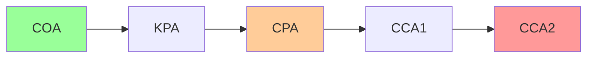
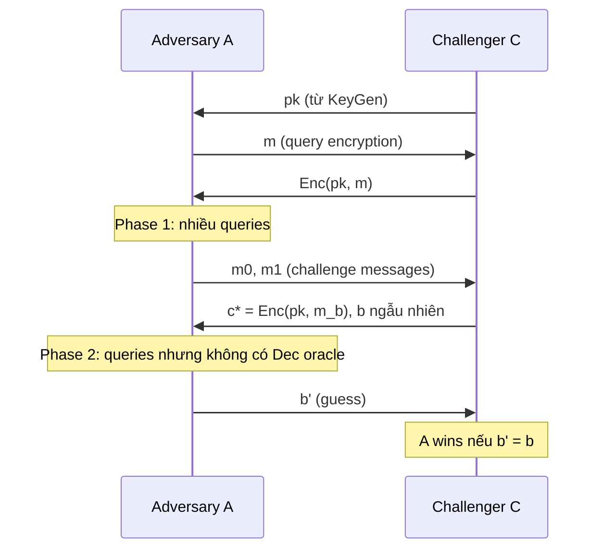
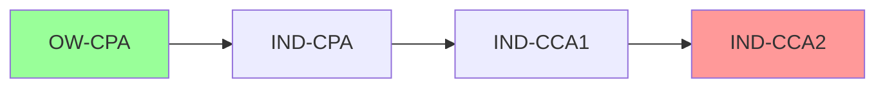
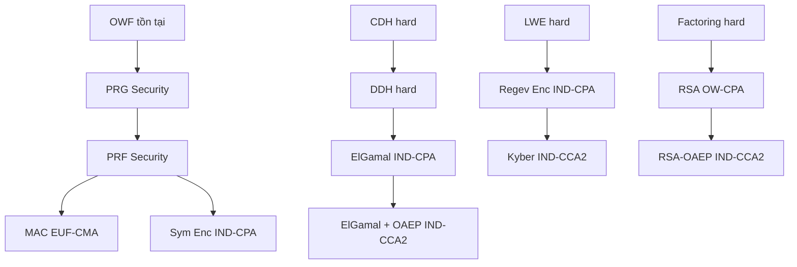

> **Prerequisites**: [[01-math-foundations|01. Mathematical Foundations]], [[02-primitives-overview|02. Cryptographic Primitives]]  
> **Lesson type**: Foundation
>
> **Notation** (ký hiệu dùng mà không định nghĩa trong bài này):
> | Ký hiệu | Ý nghĩa |
> |---------|---------|
> | $\lambda$ | Security parameter (thường là key length) |
> | $\mathsf{negl}(\lambda)$ | Negligible function |
> | $\mathsf{poly}(\lambda)$ | Polynomial function |
> | PPT | Probabilistic Polynomial-Time (algorithm) |
> | $\mathcal{A}$ | Adversary (kẻ tấn công) |
> | $\mathcal{C}$ | Challenger (bên thách thức trong game) |
> | $\Pr[E]$ | Xác suất của sự kiện $E$ |
> | $\mathsf{Adv}$ | Advantage (lợi thế của adversary) |

---

## 1. Tổng quan: Tại sao cần định nghĩa formal?

### 1.1. Câu chuyện: "Cipher này không ai phá được"

Năm 1918, Gilbert Vernam phát minh One-Time Pad. Suốt nhiều thập kỷ, người ta nói: "OTP an toàn tuyệt đối." Nhưng "an toàn" nghĩa là gì? Adversary có vô hạn tài nguyên? Hay chỉ có tài nguyên hữu hạn? Adversary biết gì trước? Họ có thể query gì?

Năm 1949, Claude Shannon đưa ra định nghĩa **perfect secrecy** — lần đầu tiên "an toàn" được phát biểu chính xác bằng toán học. Shannon chứng minh OTP đạt perfect secrecy, DES không đạt. Đây là bước ngoặt quan trọng nhất trong lịch sử mật mã.

Nhưng perfect secrecy có giá quá đắt (key dài bằng message). Vào những năm 1980-1990, Goldwasser-Micali-Rivest-Sherman và nhiều người khác xây dựng framework **computational security** — an toàn với adversary có tài nguyên đa thức — và phát triển ngôn ngữ game-based security definitions mà toàn bộ crypto hiện đại sử dụng.

### 1.2. Tại sao cần formal definitions?

Khi không có định nghĩa rõ ràng:
- "Cipher này mạnh" — mạnh với ai? Trong điều kiện nào?
- "Scheme này an toàn" — an toàn chống attack nào? CPA? CCA? Side-channel?
- Hai nhà crypto tranh luận — không có ngôn ngữ chung để phân xử

Với game-based definitions:
- **Chứng minh an toàn** (security proof) trở thành bài toán toán học rõ ràng
- Có thể so sánh schemes một cách công bằng
- Biết chính xác điều kiện nào phá được scheme → biết cách vá

---

## 2. Mô hình adversary (Adversary Model)

### 2.1. Adversary là ai?

Trong crypto formal, **adversary** $\mathcal{A}$ là một algorithm — cụ thể là **PPT algorithm** (Probabilistic Polynomial-Time). Giả thiết này có nghĩa:

- Adversary có thể làm bất cứ điều gì tính được trong thời gian đa thức theo $\lambda$
- Adversary có thể ngẫu nhiên hóa (dùng coin flips)
- Adversary **không** giới hạn về thông minh hay chiến lược — chỉ giới hạn về thời gian tính toán

Tại sao PPT? Đây là model của "kẻ tấn công thực tế" — máy tính thực tế chạy polynomial time. Adversary exponential time thì không phải mối đe dọa thực tế.

### 2.2. Thang đo adversary models (từ yếu đến mạnh)

| Model | Tên | Adversary được phép |
|-------|-----|---------------------|
| **COA** | Ciphertext-Only Attack | Chỉ quan sát ciphertext |
| **KPA** | Known-Plaintext Attack | Có plaintext/ciphertext pairs |
| **CPA** | Chosen-Plaintext Attack | Query encryption oracle với plaintext tùy chọn |
| **CCA1** | Non-Adaptive Chosen-Ciphertext | Query decryption oracle **trước** challenge |
| **CCA2** | Adaptive Chosen-Ciphertext | Query decryption oracle **cả sau** challenge |
| **RKA** | Related-Key Attack | Adversary chọn keys có quan hệ đại số với $k$ |

![[assets/img-LC-01-security-hierarchy.png]]
*Hierarchy đầy đủ: OW-CPA → IND-CPA → IND-CCA1 → IND-CCA2 cho PKE, và EUF-CMA → SUF-CMA cho Digital Signatures. Adversary models từ COA đến CCA2 ở cuối.*

**Quan trọng**: Khi ta nói scheme "an toàn" mà không specify model, mặc định trong crypto hiện đại là **IND-CCA2** cho PKE. Nếu chỉ nói "CPA secure", scheme đó có thể bị phá trong CCA setting.

> [!warning] Thực tế thường cần CCA2
> Trong hầu hết ứng dụng thực tế (TLS, API, etc.), adversary **có** decryption oracle — server decrypt ciphertext và trả lời theo nhiều cách khác nhau (lỗi, timing, ...). Đây chính xác là CCA2 setting. Scheme chỉ IND-CPA có thể bị phá trong thực tế dù "an toàn về lý thuyết".

### 2.3. Adversary goals

Không chỉ model khả năng của adversary, ta cũng cần specify *mục tiêu* của họ:

| Goal | Mô tả | Ví dụ |
|------|-------|-------|
| **OW** (One-Wayness) | Không thể recover plaintext từ ciphertext | RSA bare (textbook) phải OW |
| **IND** (Indistinguishability) | Không phân biệt ciphertext của hai messages | Mục tiêu cơ bản cho encryption |
| **NM** (Non-malleability) | Không thể tạo ciphertext liên quan đến challenge | Ngăn attacker "biến đổi" ciphertext |
| **EUF** (Existential Unforgeability) | Không forge signature cho message mới | Mục tiêu cơ bản cho signature |
| **SUF** (Strong UF) | Không forge kể cả signature *khác* cho message cũ | Mạnh hơn EUF |

---

## 3. Game-based Security Definitions

### 3.1. Framework: Security Game

**Security game** là protocol tương tác giữa **Challenger** $\mathcal{C}$ (đại diện cho scheme) và **Adversary** $\mathcal{A}$:

1. $\mathcal{C}$ setup (keygen, chọn bit bí mật $b$, v.v.)
2. $\mathcal{A}$ có thể query $\mathcal{C}$ (encryption oracle, decryption oracle, signing oracle, ...)
3. $\mathcal{A}$ output một guess $b'$
4. $\mathcal{A}$ **wins** nếu $b' = b$ (hoặc điều kiện tương tự)

**Advantage** của $\mathcal{A}$:

$$\mathsf{Adv}^\mathsf{game}_{\Pi}(\mathcal{A}) = \left| \Pr[\mathcal{A} \text{ wins}] - \frac{1}{2} \right|$$

Scheme $\Pi$ **an toàn** nếu với mọi PPT $\mathcal{A}$: $\mathsf{Adv}^\mathsf{game}_\Pi(\mathcal{A}) \leq \mathsf{negl}(\lambda)$.

Tại sao $-1/2$? Vì adversary luôn đoán được với xác suất $1/2$ (random guessing). Ta quan tâm đến **lợi thế vượt trội** so với đoán mù.

### 3.2. IND-CPA cho PKE

> [!note] Định nghĩa: IND-CPA Game cho PKE
> **Setup**: $\mathcal{C}$ chạy $(\mathsf{pk}, \mathsf{sk}) \leftarrow K\mathsf{gen}(1^\lambda)$, gửi $\mathsf{pk}$ cho $\mathcal{A}$.  
> **Phase 1 (Query)**: $\mathcal{A}$ gửi bất kỳ plaintext $m$ nào, $\mathcal{C}$ trả về $\mathsf{Enc}(\mathsf{pk}, m)$.  
> **Challenge**: $\mathcal{A}$ gửi hai messages $m_0, m_1$ với $|m_0| = |m_1|$. $\mathcal{C}$ chọn $b \leftarrow \{0,1\}$ ngẫu nhiên, trả về $c^* = \mathsf{Enc}(\mathsf{pk}, m_b)$.  
> **Phase 2 (Query)**: $\mathcal{A}$ tiếp tục query encryption oracle.  
> **Guess**: $\mathcal{A}$ output $b' \in \{0,1\}$.  
> $\mathsf{Adv}^\mathsf{IND\text{-}CPA}(\mathcal{A}) = |\Pr[b' = b] - 1/2|$

**Hệ quả quan trọng**: Không có scheme PKE **deterministic** nào an toàn IND-CPA! Nếu $\mathsf{Enc}$ deterministic, $\mathcal{A}$ chỉ cần encrypt $m_0$ và $m_1$, so sánh với $c^*$ → win với xác suất 1. Do đó mọi PKE scheme an toàn phải **probabilistic** (dùng randomness).

### 3.3. IND-CCA1 và IND-CCA2

> [!note] Định nghĩa: IND-CCA2 Game cho PKE
> Giống IND-CPA, nhưng **thêm decryption oracle**:  
> **Phase 1**: $\mathcal{A}$ query cả encryption lẫn **decryption oracle** — $\mathcal{C}$ decrypt mọi ciphertext.  
> **Challenge**: Như IND-CPA, nhận $c^*$.  
> **Phase 2**: $\mathcal{A}$ tiếp tục query decryption oracle, với ràng buộc **không query $c^*$ chính nó**.  
> **IND-CCA1**: Phase 2 không có decryption queries (non-adaptive).
> **IND-CCA2**: Phase 2 có decryption queries trừ $c^*$ (adaptive).

**Tại sao Phase 2 quan trọng?** Vì adversary thực tế luôn thấy challenge ciphertext (ví dụ: attacker nhìn TLS traffic) và sau đó có thể gửi nhiều ciphertext khác nhau cho server để decrypt (thông qua SSL/TLS requests, API calls, ...). CCA2 model đúng hơn với threat model thực tế.

> [!example] Tại sao ElGamal không IND-CCA2
> ElGamal encrypt $m$ thành $(c_1, c_2) = (g^r, m \cdot h^r)$. Nếu $\mathcal{A}$ nhận challenge $(c_1^*, c_2^*)$, adversary query decryption oracle với $(c_1^*, 2 \cdot c_2^*)$. Đây là ciphertext hợp lệ của $2m_b$. Server decrypt → output $2m_b$. Adversary biết $b$! ElGamal là IND-CPA nhưng **không** IND-CCA2.
>
> Giải pháp: OAEP, Cramer-Shoup, hoặc bất kỳ scheme IND-CCA2 nào.

### 3.4. Hierarchy của security notions cho PKE

> [!abstract] Định lý: IND-CCA2 $\Rightarrow$ IND-CCA1 $\Rightarrow$ IND-CPA $\Rightarrow$ OW-CPA
>
> Mỗi chiều ngược **không** đúng — tồn tại scheme phân tách từng cặp.

**Quan hệ với Non-malleability**: IND-CCA2 $\Leftrightarrow$ NM-CCA2 (hai định nghĩa tương đương). Nếu scheme malleable thì có thể bị CCA2 attack.

### 3.5. Security Notions cho Symmetric Encryption

Với symmetric encryption $(\mathsf{Enc}, \mathsf{Dec})$ với shared key $k$:

**IND-CPA (symmetric)**: Adversary có encryption oracle (biết plaintext, lấy ciphertext). Challenge giống PKE. Scheme an toàn nếu $\mathcal{A}$ không phân biệt được $\mathsf{Enc}(k, m_0)$ và $\mathsf{Enc}(k, m_1)$.

> [!example] ECB không an toàn IND-CPA
> ECB encrypt từng block độc lập. $\mathcal{A}$ gửi $m_0 = \texttt{"A" × 32}$ và $m_1 = \texttt{"A" × 16 + "B" × 16}$. Challenge ciphertext: nếu 2 block đầu giống nhau → $m_0$, khác nhau → $m_1$. Win với xác suất 1. ECB **không** IND-CPA.

**IND\$-CPA** (Real-or-random): Mạnh hơn — phân biệt ciphertext của $m$ với chuỗi random bits hoàn toàn. Nhiều scheme hiện đại đạt được điều này (CTR mode với nonce ngẫu nhiên).

**IND-CCA (symmetric)**: Có decryption oracle. Cần AEAD (AES-GCM, ChaCha20-Poly1305) để đạt được điều này — chỉ encrypt không đủ.

### 3.6. Security Notions cho Digital Signatures

> [!note] Định nghĩa: EUF-CMA Game
> **Setup**: $\mathcal{C}$ chạy $(\mathsf{pk}, \mathsf{sk}) \leftarrow K\mathsf{gen}(1^\lambda)$, gửi $\mathsf{pk}$ cho $\mathcal{A}$.  
> **Query**: $\mathcal{A}$ gửi bất kỳ message $m_i$ nào, $\mathcal{C}$ trả về $\sigma_i = \mathsf{Sign}(\mathsf{sk}, m_i)$.  
> **Forgery**: $\mathcal{A}$ output $(m^*, \sigma^*)$.  
> **$\mathcal{A}$ wins** nếu:
> 1. $\mathsf{Verify}(\mathsf{pk}, m^*, \sigma^*) = 1$
> 2. $m^* \notin \{m_1, m_2, \ldots\}$ (message mới, chưa được ký)  
> 
> **EUF-CMA security**: Không có PPT $\mathcal{A}$ win với xác suất non-negligible.  
> **SUF-CMA (Strong UF-CMA)**: $\mathcal{A}$ wins kể cả khi $(m^*, \sigma^*) \neq (m_i, \sigma_i)$ với message cũ $m^* = m_i$ — tức là adversary tìm được signature *khác* cho cùng message đã ký.

**SUF-CMA mạnh hơn EUF-CMA**: Có scheme EUF-CMA nhưng không SUF-CMA (ví dụ: RSA-PKCS#1 v1.5 có thể tìm được signature khác cho message đã ký trong một số setting). Nhiều protocol thực tế cần SUF-CMA.

### 3.7. Security Notions cho MACs

Tương tự signatures nhưng key $k$ là shared secret:

**EUF-CMA (MAC)**: Adversary có MAC oracle (cho $m$, nhận $\mathsf{Mac}(k, m)$). Mục tiêu: tạo $(m^*, t^*)$ với $m^*$ chưa query và $\mathsf{Verify}(k, m^*, t^*) = 1$.

**PRF-based MAC**: Nếu $F_k$ là PRF, thì $\mathsf{Mac}(k, m) = F_k(m)$ là EUF-CMA secure. HMAC được chứng minh dựa trên PRF property của compression function.

### 3.8. Security Notions cho Hash Functions

Hash function $H$ là **unkeyed** — không có key → không dùng game adversarial model theo nghĩa truyền thống.

**Collision resistance**: Khó tìm $(x_1, x_2)$ với $x_1 \neq x_2$ và $H(x_1) = H(x_2)$. Hardness phụ thuộc vào $n$: Birthday attack tìm collision trong $O(2^{n/2})$.

**Preimage resistance** (One-wayness): Cho $y$, khó tìm $x$ sao cho $H(x) = y$. Hardness $\approx O(2^n)$.

**Second preimage resistance**: Cho $x_1$, khó tìm $x_2 \neq x_1$ sao cho $H(x_1) = H(x_2)$.

> [!abstract] Định lý: Collision Resistance $\Rightarrow$ Second Preimage Resistance $\Rightarrow$ Preimage Resistance
>
> Chiều ngược lại đều không đúng. Ví dụ: MD5 collision resistant = broken, nhưng preimage resistant = vẫn còn (đến 2024).

---

## 4. Proof Models — Mô hình chứng minh

Một scheme có thể an toàn trong một model nhưng không an toàn trong model khác. Việc biết scheme được chứng minh an toàn trong model nào là **quan trọng để đánh giá độ tin cậy**. Một cách hình dung đơn giản: các idealized models đặt một "oracle lý tưởng" vào tay mọi người — thay cho các primitive cụ thể (hash, block cipher, group) bằng những đối tượng ngẫu nhiên hoàn hảo. Proof trong model đó sau đó được "instantiate" bằng cách thay oracle lý tưởng bởi primitive thực tế.

![[assets/img-LC-03-proof-models.png]]
*7 proof models đầy đủ: SM · ROM · ICM · RPM · QROM · AGM · UC — trust level, oracle/constraint đặc trưng, và schemes tiêu biểu của mỗi model. Trust bar từ mạnh nhất (SM, UC) đến specialized (AGM, RPM).*

### 4.1. Standard Model (SM)

**Standard model** không có oracle đặc biệt nào. Security được reduce trực tiếp về hardness assumption (factoring, DLP, LWE, ...) — không thêm giả thiết nào khác.

**Ưu điểm**: Proof mạnh nhất — nếu assumption đúng, scheme an toàn. Không phụ thuộc vào cách hash function "behaves" trong thực tế.

**Nhược điểm**: Schemes thường ít hiệu quả hơn (Cramer-Shoup PKE là IND-CCA2 trong SM nhưng cần 5 exponentiations thay vì 1 như RSA-OAEP). Một số functionality (ví dụ: OAEP padding, Fiat-Shamir) chưa có SM proof tốt.

**Ví dụ schemes an toàn trong SM**: Cramer-Shoup (IND-CCA2 dưới DDH), Regev encryption (IND-CPA dưới LWE), BB signature (dưới CDH), Waters IBE (dưới DBDH), Kyber dưới MLWE (gần SM).

### 4.2. Random Oracle Model (ROM)

> [!note] Định nghĩa: Random Oracle Model
> Trong **Random Oracle Model** (Bellare-Rogaway 1993), ta giả sử tồn tại một **oracle ngẫu nhiên** $H: \{0,1\}^* \to \{0,1\}^n$ — một hàm được chọn uniformly at random từ tập tất cả hàm với cùng domain/range.
>
> Cả Prover lẫn Adversary đều có thể query $H$ bất kỳ lúc nào và nhận response nhất quán — nhưng response của query mới là truly random, không liên quan đến query cũ.
>
> Trong proof, hash function thực tế (SHA-256, Keccak...) được **model** như random oracle. Đây là **heuristic** — không có hash function nào thực sự là random oracle.

**Điểm mạnh của ROM**: Nhiều scheme hiệu quả có proof trong ROM. RSA-OAEP, Schnorr signature, ECDSA, Fiat-Shamir transform, HKDF, TLS 1.3 PRF — tất cả được chứng minh trong ROM. Community đã chấp nhận ROM là practical sufficient — hầu hết crypto thực tế (TLS, SSH, Bitcoin, Signal, ...) dùng ROM và chưa bị phá *vì lý do ROM*.

**Điểm yếu của ROM**: Có những "uninstantiatable" results (Canetti, Goldreich, Halevi 1998) — tồn tại scheme an toàn trong ROM nhưng *không* an toàn khi thay bằng bất kỳ concrete hash function nào. ROM proof không *đảm bảo* security trong thực tế — chỉ là strong heuristic evidence. Nhà lý thuyết vẫn xem ROM proof là "weaker than SM".

> [!tip] Cách đọc paper
> "Scheme X is IND-CCA2 secure in the ROM assuming CDH" nghĩa là: **nếu** CDH hard **VÀ** SHA-256 behaves như random oracle **thì** X an toàn. Tốt nhưng không phải SM proof.

### 4.3. Ideal Cipher Model (ICM)

**Ideal Cipher Model** là model dành cho **block cipher**: thay AES hay DES bằng một **ideal block cipher** $E: \mathcal{K} \times \{0,1\}^n \to \{0,1\}^n$ trong đó với mỗi key $k$, $E_k(\cdot)$ là một random permutation độc lập. Mọi party (kể cả adversary) đều có oracle access cho cả encrypt và decrypt: $E_k(\cdot)$ và $E_k^{-1}(\cdot)$.

**Tại sao cần ICM?** Nhiều hash function cổ điển được xây từ block cipher (Davies-Meyer: $h_i = E_{m_i}(h_{i-1}) \oplus h_{i-1}$) — security của chúng chỉ có thể được phân tích trong ICM, không phải SM. SHA-1, SHA-2, MD5 đều có Davies-Meyer structure → được analyzed trong ICM.

**ICM và ROM tương đương**: Coron-Patarin-Seurin (2008) chứng minh rằng ROM và ICM là **equivalent** dưới notion of indifferentiability — tức là bất kỳ scheme an toàn trong ROM đều có thể proven an toàn trong ICM và ngược lại (với một số loss). Điều này trả lời câu hỏi tồn tại lâu: ICM có "mạnh hơn" ROM không? Không — hai model tương đương nhau.

**Ứng dụng thực tế**: AES-based constructions (Even-Mansour cipher, SpongeWrap dùng AES permutation), DES-based hash functions, PKCS#11 security analysis, PAKE schemes như EKE.

### 4.4. Random Permutation Model (RPM)

**Random Permutation Model (RPM)** là variant của ICM không có key: thay block cipher bằng một **random permutation** $\pi: \{0,1\}^n \to \{0,1\}^n$ duy nhất (không phụ thuộc key). Tất cả parties đều có oracle access cho cả $\pi$ và $\pi^{-1}$.

**Tại sao cần RPM?** Sponge construction (SHA-3/Keccak) dùng một public random permutation làm round function — security của SHA-3 được proven trong RPM (Bertoni et al. 2008): sponge construction là **indifferentiable from a random oracle** trong RPM với advantage $O(q^2 / 2^c)$ cho $q$ queries. RPM và ICM có thể được dùng interchangeably cho nhiều applications nhờ quan hệ indifferentiability.

**Ứng dụng thực tế**: SHA-3 (Keccak), ASCON (AEAD lightweight), Xoodyak, nhiều sponge-based constructions. RPM analysis cho thấy SHA-3 không có length extension weakness vì output không để lộ internal state.

### 4.5. Algebraic Group Model (AGM)

> [!note] Định nghĩa: Algebraic Group Model
> Trong **AGM** (Fuchsbauer-Kiltz-Loss 2018), **algebraic adversary** $\mathcal{A}$: khi output group element $Z$, phải **kèm theo biểu diễn algebraic** của $Z$ theo các group elements đã nhận:
>
> $$Z = \prod_i X_i^{a_i} \quad \text{(với } a_i \in \mathbb{Z}_q\text{)}$$
>
> Tức là $\mathcal{A}$ phải "show work" — không thể conjure group elements mà không giải thích source. Điều này loại bỏ adversaries "non-algebraic" (các adversary khai thác hash collision, etc.).

**Tại sao AGM hữu ích?** AGM nằm giữa SM và GGM về độ mạnh. Trong AGM, có thể chứng minh tight reductions cho nhiều scheme mà SM proof quá loose hoặc không tồn tại — đặc biệt với **knowledge assumptions** như Knowledge of Exponent (KEA) và Discrete Logarithm Representation. Groth16 zkSNARK, BLS aggregate signature đều được chứng minh trong AGM + ROM.

**Hạn chế**: AGM không capture được non-algebraic attacks (side-channels, timing, format errors). Không phải mọi adversary thực tế đều algebraic theo nghĩa AGM.

### 4.6. Generic Group Model (GGM)

**GGM** (Shoup 1997) là model trong đó adversary chỉ truy cập group qua **oracle** — không biết gì về representation cụ thể của group elements (chỉ thấy random handles), chỉ có thể thực hiện group operations (add, multiply, compare). Giống như "blind computation" trong nhóm.

**Ứng dụng**: Chứng minh **lower bounds** — "không có thuật toán generic nào giải DLP tốt hơn $O(\sqrt{p})$" (Baby-Step Giant-Step là optimal trong GGM). Cũng dùng để analyze BLS, CDH, DDH một cách clean.

**Hạn chế quan trọng**: GGM không capture được các attacks exploit structure cụ thể của group. Adversary thực tế biết secp256k1, BN254, v.v. và có thể dùng Pohlig-Hellman, index calculus, Weil descent — những attack này vô hình trong GGM.

### 4.7. Quantum Random Oracle Model (QROM)

**QROM** (Boneh et al. 2011) là version lượng tử của ROM: adversary có thể query random oracle $H$ bằng **quantum superposition** — tức là query $\sum_x \alpha_x |x\rangle$ và nhận $\sum_x \alpha_x |x, H(x)\rangle$. Đây là model phù hợp để phân tích security trong thế giới có quantum computers.

**Tại sao QROM quan trọng?** Nhiều proof trong ROM không giữ nguyên trong QROM — adversary quantum có thể exploit ROM structure theo cách adversary classical không thể. Fiat-Shamir transform, OAEP, và nhiều scheme khác cần re-proven trong QROM.

**Kỹ thuật chính**: Zhandry's "compressed oracle" technique (2019) cho phép "record" quantum queries vào random oracle — một công cụ kỹ thuật quan trọng nhất trong QROM proofs. "Lazy sampling" trong QROM phức tạp hơn nhiều so với ROM.

**Ứng dụng thực tế**: ML-KEM (Kyber) và ML-DSA (Dilithium) đều được proven trong QROM — đây là điều kiện bắt buộc của NIST PQC standardization. Các scheme như Falcon, SPHINCS+ cũng cần QROM analysis.

> [!info] QROM vs ROM: quan trọng như thế nào?
> Có những scheme an toàn trong ROM nhưng **không** an toàn trong QROM (ví dụ: một số Fiat-Shamir transforms với hash không quantum-resistant). Post-quantum crypto *phải* được proven trong QROM, không chỉ ROM. Đây là lý do Kyber và Dilithium có "QROM security proofs" riêng trong NIST submission documents.

### 4.8. Quantum Generic Group Model (QGGM)

**QGGM** là version lượng tử của GGM: adversary có quantum access đến group oracle. Dùng để prove lower bounds cho quantum algorithms trong generic groups — ví dụ: Shor's algorithm cần group structure cụ thể (biết representation), nên không thể phá DLP trong QGGM.

### 4.9. Indifferentiability Framework

**Indifferentiability** (Maurer-Renner-Holenstein 2004, Coron et al. 2005) là công cụ lý thuyết để so sánh hai proof models và cho phép "lift" proofs từ model này sang model khác.

Informally: Construction $C$ với primitive $P$ là **indifferentiable** từ ideal primitive $F$ nếu không có distinguisher nào phân biệt $(C^P, P)$ và $(F, S^F)$ với simulator $S$. Hệ quả: nếu scheme $\Pi$ an toàn khi dùng $F$, thì cũng an toàn khi dùng $C^P$.

**Ứng dụng quan trọng**:
- Sponge construction indifferentiable từ random oracle trong RPM → SHA-3 an toàn như random oracle
- Merkle-Damgård (với padding đặc biệt) indifferentiable từ random oracle trong ICM với điều kiện
- ROM và ICM tương đương (Coron-Patarin-Seurin 2008) qua indifferentiability

### 4.10. Concrete Security Model

**Concrete security** (Bellare-Rogaway 1993) là cách tiếp cận đặt câu hỏi không phải "scheme có an toàn không?" mà là "**với adversary chạy $t$ bước và có $q$ queries, advantage là bao nhiêu?**". Thay vì asymptotic statement "negl(λ)", ta có concrete bound như "advantage ≤ $q^2/2^{128}$".

Ví dụ concrete bound cho AES-GCM: adversary với $q$ queries đến oracle và ciphertext tổng $\sigma$ blocks có advantage:

$$\mathsf{Adv} \leq \frac{\sigma^2}{2^{128}} + \frac{q \cdot \sigma}{2^{128}}$$

**Tại sao quan trọng?** Asymptotic security ("negligible") không nói gì về security với parameter cụ thể. Concrete bounds cho phép tính toán: với $q = 2^{32}$ queries, need $2^{128}$-bit key thay vì $2^{64}$-bit key để đạt $2^{-32}$ advantage. Đây là nền tảng của **NIST parameter selection** và cryptographic engineering.

### 4.11. So sánh tổng hợp

| Model | Dùng cho | Điểm mạnh | Điểm yếu | Ví dụ scheme |
|-------|----------|-----------|----------|--------------|
| **SM** | Mọi primitive | Proof mạnh nhất | Kém hiệu quả | Cramer-Shoup, Regev |
| **ROM** | Hash-based schemes | Thực dụng, phổ biến nhất | Uninstantiatable | RSA-OAEP, ECDSA, TLS KDFs |
| **ICM** | Block cipher-based | Tốt cho hash từ BC | Tương đương ROM | Davies-Meyer, PKCS#11 |
| **RPM** | Sponge-based hash | Phân tích SHA-3 | Chỉ cho keyless permutation | SHA-3, ASCON |
| **AGM** | Pairing, ZK | Tight reductions | Chỉ algebraic adversaries | Groth16, BLS agg. |
| **GGM** | Asymmetric primitive | Lower bounds rõ ràng | Không capture structure | DLP hardness, CDH |
| **QROM** | PQC schemes | Post-quantum proof | Kỹ thuật phức tạp | ML-KEM, ML-DSA, Dilithium |
| **QGGM** | PQC lower bounds | Quantum lower bounds | Rất lý thuyết | Shor's optimality |
| **Concrete** | Engineering | Actionable parameter choice | Tính toán phức tạp | AES-GCM nonce limits |

---

## 5. Security Assumptions — Giả thuyết an toàn

Crypto hiện đại dựa trên **giả thuyết (assumptions)** về độ khó của các bài toán toán học. Không có scheme nào được chứng minh an toàn tuyệt đối (đó sẽ cần chứng minh P ≠ NP và mạnh hơn). Thay vào đó, ta reduce security về một assumption.

### 5.1. Vai trò của assumption

> [!abstract] Dạng tổng quát của security theorem
>
> $$\text{"Scheme } \Pi \text{ đạt notion } X \text{ nếu problem } P \text{ là hard trong model } M\text{"}$$
>
> Tức là: **Nếu** $P$ khó **thì** $\Pi$ an toàn.
>
> Contrapositive: Nếu phá được $\Pi$, thì giải được $P$. Do đó để phá $\Pi$ = phải giải được $P$ — một điều được tin là rất khó.

### 5.2. Taxonomy của assumptions

**Computational assumptions (hard to compute)**:

- **CDH (Computational Diffie-Hellman)**: Cho $g, g^a, g^b$, tính $g^{ab}$. Hard trong nhóm phù hợp.
- **DLP / DLOG**: Cho $g, g^x$, tìm $x$.
- **IFP (Integer Factoring Problem)**: Factoring $n = pq$.
- **RSA assumption**: Cho $(n, e, c = m^e \bmod n)$, tìm $m$. Strictly weaker assumption than IFP.

**Decisional assumptions (hard to decide)**:

- **DDH (Decisional Diffie-Hellman)**: Phân biệt $(g, g^a, g^b, g^{ab})$ và $(g, g^a, g^b, g^c)$ với $c$ ngẫu nhiên.
- **LWE (Learning With Errors)**: Phân biệt $(\mathbf{A}, \mathbf{As+e})$ và $(\mathbf{A}, \mathbf{u})$ với $\mathbf{u}$ ngẫu nhiên.
- **RLWE (Ring-LWE)**: Version ring của LWE.
- **QRP (Quadratic Residuosity Problem)**: Phân biệt QR và non-QR mod $n$.

**Knowledge assumptions** (existential — adversary phải "biết" witness):

- **KEA (Knowledge of Exponent Assumption)**: Nếu adversary output $(A, B = A^e)$, thì adversary "biết" $e$.
- **DLEQ**: Biết exponent chung trong discrete log equality.
- Dùng nhiều trong ZK-SNARK proofs.

**Hiệu ứng dây chuyền giữa các assumptions**:

$$\text{Factoring} \Leftarrow \text{RSA} \leftarrow \text{IND-CPA security of RSA}$$

$$\text{DLP} \Leftarrow \text{CDH} \Leftarrow \text{DDH} \leftarrow \text{IND-CPA security of ElGamal}$$

Notation: $A \leftarrow B$ nghĩa là "B hard $\Rightarrow$ A hard". Biết DDH hard nhưng không biết CDH hard hay easy, tương tự CDH và Factoring.

> [!info] Giả thuyết nào mạnh hơn?
> "Giả thuyết X **mạnh hơn** Y" nghĩa là: X hard $\Rightarrow$ Y hard (nhưng chiều ngược chưa biết). Scheme dựa trên assumption yếu hơn được tin tưởng hơn. DDH là assumption yếu hơn CDH (DDH hard $\Rightarrow$ CDH hard), nên scheme dựa trên DDH tốt hơn scheme dựa trên CDH.

### 5.3. Quantum resistance của assumptions

| Assumption | Classical hardness | Quantum hardness |
|------------|-------------------|-----------------|
| IFP | $L[1/2, c]$ sub-exp | Shor: $O(\text{poly}(n))$ — BROKEN |
| DLP | $L[1/2, c]$ sub-exp | Shor: $O(\text{poly}(n))$ — BROKEN |
| ECDLP | $O(\sqrt{n})$ | Shor: $O(\text{poly}(n))$ — BROKEN |
| LWE | $2^{O(n)}$ | Best known: $2^{O(n)}$ — SAFE |
| SIS | $2^{O(n)}$ | Best known: $2^{O(n)}$ — SAFE |
| SVP (lattice) | $2^{O(n)}$ | Grover: $O(2^{n/2})$ — SAFE (halved) |
| Hash collision | $O(2^{n/2})$ | Grover: $O(2^{n/3})$ — SAFE (weakened) |

---

## 6. Security Reductions

### 6.1. Khái niệm reduction

**Security reduction** là kỹ thuật trung tâm của provable security. Một reduction từ problem $P$ sang scheme $\Pi$ là một algorithm $\mathcal{B}$ sao cho: nếu adversary $\mathcal{A}$ phá $\Pi$ với advantage $\epsilon$, thì $\mathcal{B}$ giải $P$ với advantage $\epsilon' \approx \epsilon$.

> [!abstract] Dạng chuẩn của reduction argument
>
> **Claim**: Nếu $\mathcal{A}$ phá game $G_\Pi$ với advantage $\epsilon$, thì tồn tại $\mathcal{B}$ giải problem $P$ với advantage $\epsilon'$.
>
> **Proof**. Xây dựng $\mathcal{B}$: $\mathcal{B}$ nhận input của $P$, simulate $G_\Pi$ cho $\mathcal{A}$, dùng output của $\mathcal{A}$ để giải $P$.
>
> Nếu $P$ hard (không có PPT algorithm giải với advantage non-negligible), thì không có $\mathcal{B}$ nào efficient → không có $\mathcal{A}$ nào efficient → $\Pi$ an toàn. $\blacksquare$

**Ví dụ cụ thể — ElGamal IND-CPA dưới DDH**:

$\mathcal{B}$ nhận $(g, g^a, g^b, T)$ — phân biệt $T = g^{ab}$ hay $T = g^c$ (DDH challenge).

$\mathcal{B}$ simulate game cho $\mathcal{A}$: public key = $g^a$. Khi $\mathcal{A}$ gửi $(m_0, m_1)$, $\mathcal{B}$ chọn $b$ ngẫu nhiên, tạo $c^* = (g^b, m_b \cdot T)$.

Nếu $T = g^{ab}$: $c^*$ là encrypt hợp lệ của $m_b$. Nếu $T = g^c$: $c^*$ là gibberish. Nếu $\mathcal{A}$ phân biệt được, $\mathcal{B}$ phân biệt được DDH.

### 6.2. Tightness của reduction

**Tight reduction**: $\epsilon' \approx \epsilon$ (không mất factor lớn).

**Loose reduction**: $\epsilon' = \epsilon / q$ với $q$ là số queries — reduction "tốn" xác suất theo số queries.

Tại sao quan trọng? Nếu reduction có loss factor $q = 2^{30}$ (1 tỷ queries), thì scheme cần $\lambda$ lớn hơn $30$ bit để compensate. Tight reductions là "gold standard" — Schnorr signature, BLS signature đều có tight reductions.

### 6.3. Hybrid Arguments

**Hybrid argument** là kỹ thuật chứng minh quan trọng: xây dựng chuỗi games $G_0, G_1, \ldots, G_n$ sao cho:
- $G_0$ là game thực (với scheme $\Pi$)
- $G_n$ là game "lý tưởng" (adversary không phân biệt được)
- Mỗi bước $G_i \to G_{i+1}$ thay đổi một điều nhỏ và sự khác biệt là negligible

Bằng triangle inequality, advantage trong $G_0$ và $G_n$ cách nhau tối đa $n \cdot \mathsf{negl}(\lambda)$ = negligible.

---

## 7. Các khái niệm an toàn nâng cao

### 7.1. Non-malleability

**Non-malleability (NM)**: Không thể tạo ciphertext $c'$ liên quan đến challenge $c^*$ sao cho $\mathsf{Dec}(c')$ có quan hệ đặc biệt với $\mathsf{Dec}(c^*)$.

**Quan hệ với IND**: IND-CCA2 $\Leftrightarrow$ NM-CCA2. Đây là một trong những kết quả đẹp nhất trong crypto foundations. Trực giác: nếu scheme malleable thì ta có thể "biến đổi" $c^*$ để học thông tin về plaintext.

### 7.2. Forward Secrecy (Perfect Forward Secrecy — PFS)

**PFS**: Nếu long-term key bị compromise trong tương lai, các session keys cũ **không bị ảnh hưởng**.

**Cơ chế**: Sử dụng **ephemeral key exchange** — mỗi session dùng key DH mới (không lưu lâu dài). Sau khi session kết thúc, session key bị xóa. Ngay cả khi server private key bị lộ sau này, kẻ tấn công không thể decrypt traffic cũ.

**TLS 1.3**: Yêu cầu PFS bắt buộc (chỉ dùng ECDHE). TLS 1.2: PFS là option (nếu dùng DHE/ECDHE cipher suites).

**Đối lập**: Static RSA key exchange (encrypt session key bằng RSA public key của server) — nếu RSA private key bị lộ, **tất cả** traffic cũ decrypt được. NSA ghi lại TLS traffic để decrypt sau khi steal key.

### 7.3. Universal Composability (UC Security)

Mô hình **UC** (Canetti 2001) định nghĩa security theo nghĩa mạnh nhất: scheme an toàn dù được dùng trong bất kỳ context nào, compose với bất kỳ protocol nào khác.

**UC game**: Adversary trong "real world" không thể phân biệt với adversary trong "ideal world" (tương tác với functionality lý tưởng $\mathcal{F}$) — dù compose với environment bên ngoài tùy ý.

**Tại sao khó và mạnh**: IND-CCA2 chỉ đảm bảo security trong game độc lập. Khi combine nhiều protocol, security có thể không giữ nguyên. UC đảm bảo "composition theorem" — combine các UC-secure components → vẫn UC-secure.

**Ứng dụng**: MPC protocols (SPDZ, GMW), Signal Protocol (Double Ratchet có informal UC analysis).

### 7.4. Multi-instance và Multi-user Security

**Standard game**: Adversary tấn công **một instance** của scheme với **một key**.

**Multi-user security**: Adversary tấn công $N$ users đồng thời, muốn phá *ít nhất một*. Quan trọng trong thực tế — biết breaking probability scale thế nào với số users.

**Concrete security**: Với $N = 2^{32}$ users (khoảng dân số thế giới dùng HTTPS), advantage tăng factor $2^{32}$. Scheme cần key đủ dài để compensate.

**Neon lights example**: AES-128 với 1 user: $2^{128}$ work. Với $2^{32}$ users, chỉ cần $2^{96}$ work trung bình để phá một user. Đây là lý do nhiều applications dùng AES-256.

### 7.5. Semantic Security vs Indistinguishability

**Semantic security** (Goldwasser-Micali 1984): Không có PPT algorithm nào tính được bất kỳ "partial information" về plaintext từ ciphertext và public key.

> [!abstract] Định lý: IND-CPA $\Leftrightarrow$ Semantic Security
>
> Hai định nghĩa này **tương đương** cho PKE. Semantic security là định nghĩa "intuitive" hơn, IND-CPA là định nghĩa "game-based" dễ dùng trong proof hơn.

### 7.6. KEM/DEM Security (Hybrid Encryption)

Real-world encryption thường dùng **KEM/DEM hybrid**:

1. **KEM**: Encapsulate symmetric key $k$ bằng PKE. $c_1 = \mathsf{Encap}(\mathsf{pk})$ → $k$
2. **DEM (Data Encapsulation Mechanism)**: Encrypt message $m$ bằng $k$. $c_2 = \mathsf{Enc}(k, m)$
3. Ciphertext = $(c_1, c_2)$

**Security theorem**: Nếu KEM đạt IND-CCA2 và DEM đạt IND-CCA2, thì hybrid đạt IND-CCA2. Đây là nền tảng của TLS 1.3, HPKE (RFC 9180), PGP, Signal.

---

## 8. Security Definitions cho các primitive khác

### 8.1. PRF Security

> [!note] Định nghĩa: PRF Security
> Một keyed function $F: \mathcal{K} \times \mathcal{X} \to \mathcal{Y}$ là **secure PRF** nếu không PPT adversary nào phân biệt được oracle access đến $F_k$ (với $k$ ngẫu nhiên) và oracle access đến hàm ngẫu nhiên thực sự $f: \mathcal{X} \to \mathcal{Y}$.
>
> $$\mathsf{Adv}^\mathsf{PRF}(\mathcal{A}) = \left| \Pr[\mathcal{A}^{F_k(\cdot)} = 1] - \Pr[\mathcal{A}^{f(\cdot)} = 1] \right| \leq \mathsf{negl}(\lambda)$$

PRF dùng để xây MAC ($\mathsf{Mac}(k, m) = F_k(m)$), KDF, và nhiều construction khác.

### 8.2. CPA/CCA Security cho AEAD

**AEAD (Authenticated Encryption with Associated Data)** đạt hai tính chất đồng thời:

1. **Privacy (confidentiality)**: IND-CPA/IND-CCA cho message
2. **Integrity (authenticity)**: EUF-CMA cho (message, associated data)

**AES-GCM** đạt AEAD IND-CCA security (trong ROM với GHASH key không bị leak). **Điều kiện**: nonce không được tái sử dụng với cùng key.

---

## 9. Tổng hợp: Security Notion Map

### 9.1. Tóm tắt: Khi nào dùng notion nào?

| Ứng dụng | Security Notion tối thiểu |
|----------|--------------------------|
| Mã hóa symmetric cho storage | IND-CPA |
| Mã hóa trong network protocol | IND-CCA2 (hoặc AEAD) |
| Key exchange | Auth. + DH (IND-CCA2 của kết quả) |
| Digital signature thông thường | EUF-CMA |
| Signature trong complex protocol | SUF-CMA |
| Password storage | Preimage resistance + slow |
| Session freshness | Forward Secrecy |
| Multi-protocol composition | UC Security |

---

## 10. Tài liệu tham khảo

- Goldwasser & Micali — *Probabilistic Encryption*, JCSS 1984 (định nghĩa semantic security lần đầu)
- Bellare & Rogaway — *Random Oracles are Practical*, CCS 1993 (nền tảng ROM)
- Canetti, Goldreich, Halevi — *The Random Oracle Methodology, Revisited*, STOC 1998 (giới hạn của ROM)
- Canetti — *Universally Composable Security*, FOCS 2001 (UC framework)
- Fuchsbauer, Kiltz, Loss — *The Algebraic Group Model and its Applications*, CRYPTO 2018 (AGM)
- Boneh & Shoup — *A Graduate Course in Applied Cryptography* (toc.cryptobook.us) — Ch. 2, 11, 13
- Katz & Lindell — *Introduction to Modern Cryptography*, CRC Press 2020 — Ch. 2, 3
- Shoup — *Sequences of Games: A Tool for Taming Complexity in Security Proofs*, IACR ePrint 2004/332
