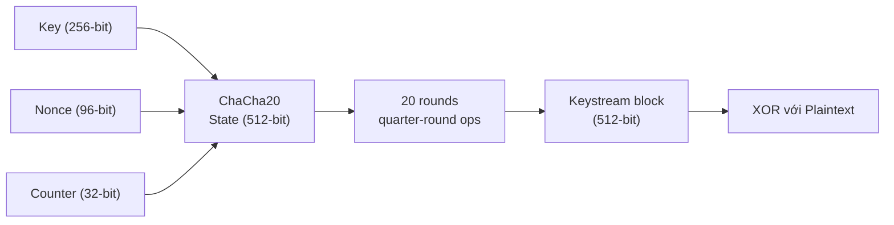
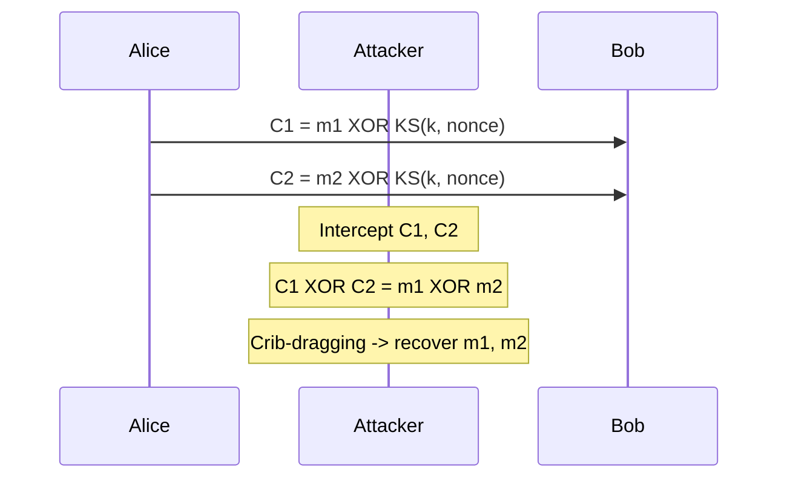

> **Prerequisites**: [[07-encoding-xor-otp|07. Encoding & XOR / OTP]] — XOR operation, keystream; [[04-modular-arithmetic|04. Modular Arithmetic]] — GF(2) arithmetic  
> **Lesson type**: Scheme + Attack
>
> **Notation** (ký hiệu dùng mà không định nghĩa trong bài này):
> | Ký hiệu | Ý nghĩa |
> |---------|---------|
> | $\mathbb{F}_2$ | Trường GF(2) = $\{0, 1\}$, phép cộng là XOR |
> | $\mathbb{F}_2[x]$ | Vành đa thức trên GF(2) |
> | $\oplus$ | XOR (phép cộng trong GF(2)) |
> | $\mathsf{negl}(\lambda)$ | Negligible function của security parameter |

---

## 1. Motivation

Mã hóa đối xứng có hai hướng tiếp cận chính. Hướng thứ nhất — **block cipher** — xử lý dữ liệu theo khối cố định (128-bit với AES). Hướng thứ hai, được giới thiệu trong bài này, là **stream cipher**: mã hóa từng bit hoặc byte ngay khi chúng xuất hiện, bằng cách XOR với một dòng bit giả ngẫu nhiên gọi là **keystream**. Về nguyên lý, stream cipher là hiện thực hóa xấp xỉ của One-Time Pad: thay vì dùng key dài thực sự ngẫu nhiên (không thực tế), ta dùng một PRNG an toàn để kéo dài key ngắn thành keystream dài tùy ý.

Stream cipher xuất hiện sớm trong lịch sử vì chúng cực kỳ nhanh và dễ cài đặt trong phần cứng, đặc biệt khi dùng **LFSR (Linear Feedback Shift Register)** — mạch điện tử chỉ gồm flip-flops và cổng XOR. Tuy nhiên, như chúng ta sẽ thấy, LFSR đơn thuần là tuyến tính và dễ bị phá bởi thuật toán **Berlekamp-Massey**. Bài học này khảo sát toàn bộ hành trình: từ định nghĩa stream cipher, đến LFSR và điểm yếu của nó, đến các stream cipher hiện đại an toàn, và kết thúc bằng attack nguy hiểm nhất của stream cipher: nonce reuse.

---

## 2. Stream Cipher: Định nghĩa và Mô hình

Ý tưởng cốt lõi của stream cipher đã được giới thiệu trong [[04-encoding-xor-otp|L04]] qua One-Time Pad: $C = M \oplus K$ an toàn tuyệt đối nếu $K$ hoàn toàn ngẫu nhiên và dài bằng $M$. Stream cipher giải quyết bài toán thực tế hơn: tạo $K$ từ một seed ngắn.

> [!note] Định nghĩa — Stream Cipher
> **Type**: Symmetric Encryption (stream-based)
> **Setting**: Security parameter $\lambda$, key space $\mathcal{K} = \{0,1\}^\lambda$, nonce space $\mathcal{N}$
>
> **$\mathsf{KeyGen}(1^\lambda)$**  
> - Chọn $k \stackrel{R}{\leftarrow} \{0,1\}^\lambda$  
> - Output: $k$
>
> **$\mathsf{Enc}(k,\, \text{nonce},\, m)$**  
> - Input: key $k$, nonce $\nu \in \mathcal{N}$, plaintext $m \in \{0,1\}^*$  
> - Tính keystream $\text{KS} = \mathsf{PRG}(k, \nu, |m|)$ — chuỗi giả ngẫu nhiên dài $|m|$ bit  
> - Output: $c = m \oplus \text{KS}$
>
> **$\mathsf{Dec}(k,\, \text{nonce},\, c)$**  
> - Input: key $k$, nonce $\nu$, ciphertext $c$  
> - Tính keystream $\text{KS} = \mathsf{PRG}(k, \nu, |c|)$  
> - Output: $m = c \oplus \text{KS}$

Tính đúng đắn hiển nhiên: $(m \oplus \text{KS}) \oplus \text{KS} = m$ vì $\text{KS} \oplus \text{KS} = 0$.

> [!abstract] Định lý — IND-CPA Security của Stream Cipher
> Stream cipher đạt **IND-CPA** nếu và chỉ nếu $\mathsf{PRG}(k, \cdot)$ là một PRF an toàn (pseudorandom function). Nói không chính thức: nếu keystream không thể phân biệt được với chuỗi ngẫu nhiên thực sự, thì ciphertext không rò rỉ thông tin.

**Proof sketch.** Nếu adversary $\mathcal{A}$ phân biệt được hai ciphertext tương ứng với $m_0$ và $m_1$, tức là $\mathcal{A}$ phân biệt $m_b \oplus \text{KS}$ với $m_{1-b} \oplus \text{KS}$. Điều này tương đương với phân biệt $\text{KS}$ với chuỗi ngẫu nhiên — mâu thuẫn với giả thiết PRG an toàn. $\blacksquare$

> [!warning] Điểm yếu chết người: Nonce Reuse
> Stream cipher **tuyệt đối không được tái sử dụng (key, nonce)**. Nếu hai message $m_1$, $m_2$ được mã hóa với cùng keystream $\text{KS}$:
>
> $$C_1 \oplus C_2 = (m_1 \oplus \text{KS}) \oplus (m_2 \oplus \text{KS}) = m_1 \oplus m_2$$
>
> Kẻ tấn công thu được $m_1 \oplus m_2$ — đủ để recover cả hai plaintext qua statistical analysis (xem [[04-encoding-xor-otp|Many-Time Pad attack]]). Đây là **Many-Time Pad problem** — giống hệt lý do OTP không an toàn khi reuse.

---

## 3. LFSR — Linear Feedback Shift Register

### 3.1. Cấu trúc vật lý

LFSR là một thanh ghi dịch (shift register) gồm $L$ ô nhớ (flip-flop), mỗi ô chứa một bit. Tại mỗi clock cycle, toàn bộ thanh ghi dịch sang phải một vị trí, bit cuối cùng được xuất ra làm keystream, và bit mới nhất được tính bằng XOR của một số ô được chọn gọi là **tap positions**.

![[assets/img-06-lfsr-structure.png]]
*LFSR độ dài L=4 với feedback polynomial C(x) = 1 + x + x⁴ (tap tại vị trí 1 và 4)*

### 3.2. Toán học: Recurrence và Feedback Polynomial

> [!note] Định nghĩa — LFSR
> Một LFSR độ dài $L$ được xác định bởi:
> - **Trạng thái**: $(s_0, s_1, \ldots, s_{L-1}) \in \mathbb{F}_2^L$ (initial fill / seed)
> - **Tap coefficients**: $(c_1, c_2, \ldots, c_L) \in \mathbb{F}_2^L$
>
> **Recurrence**:
>
> $$s_n = c_1 s_{n-1} \oplus c_2 s_{n-2} \oplus \cdots \oplus c_L s_{n-L} \pmod{2}, \quad n \geq L$$
>
> **Feedback polynomial (connection polynomial)**:
>
> $$C(x) = 1 + c_1 x + c_2 x^2 + \cdots + c_L x^L \in \mathbb{F}_2[x]$$
>
> LFSR được ký hiệu $\langle L, C(x) \rangle$.

### 3.3. Period và Maximum-Length LFSR

Vì LFSR có hữu hạn trạng thái ($2^L$ trạng thái), nó phải lặp lại sau nhiều nhất $2^L$ bước. Trạng thái toàn zero luôn tạo ra dòng zero, nên ta loại nó. Period tối đa là $2^L - 1$.

> [!abstract] Định lý — Maximum-Length LFSR
> LFSR $\langle L, C(x) \rangle$ đạt period tối đa $2^L - 1$ nếu và chỉ nếu $C(x)$ là **primitive polynomial** trên $\mathbb{F}_2$ (tức là $C(x)$ là primitive và có degree $L$).

Ví dụ: $C(x) = 1 + x + x^4$ là primitive polynomial bậc 4 trên $\mathbb{F}_2$. LFSR tương ứng có period $2^4 - 1 = 15$ và đi qua tất cả 15 trạng thái non-zero.

> [!example] Ví dụ — LFSR bậc 4 với $C(x) = 1 + x + x^4$
> Initial state: $(1, 1, 0, 1)$. Recurrence: $s_n = s_{n-1} \oplus s_{n-4}$ (tap tại 1 và 4).
>
> | $n$ | $s_{n-4}$ | $s_{n-3}$ | $s_{n-2}$ | $s_{n-1}$ | $s_n = s_{n-1} \oplus s_{n-4}$ |
> |-----|-----------|-----------|-----------|-----------|-------------------------------|
> | 4 | 1 | 1 | 0 | 1 | $1 \oplus 1 = 0$ |
> | 5 | 1 | 0 | 1 | 0 | $0 \oplus 1 = 1$ |
> | 6 | 0 | 1 | 0 | 1 | $1 \oplus 0 = 1$ |
> | 7 | 1 | 0 | 1 | 1 | $1 \oplus 1 = 0$ |
>
> Keystream xuất ra: $1, 1, 0, 1, 0, 1, 1, 0, 0, 1, 0, 0, 0, 1, 1, \ldots$ (period 15)

### 3.4. Tại sao LFSR Không An Toàn Đứng Một Mình?

LFSR là hệ **tuyến tính** hoàn toàn: tất cả quan hệ giữa bits keystream đều là hệ phương trình tuyến tính trên $\mathbb{F}_2$. Đây là điều kiện lý tưởng để ứng dụng thuật toán Berlekamp-Massey.

> [!danger] Định lý — LFSR Không Phải CSPRNG
> Cho LFSR $\langle L, C(x) \rangle$. Nếu adversary quan sát $2L$ bits liên tiếp của keystream, thuật toán Berlekamp-Massey có thể:
> 1. Tìm độ dài $L$ tối thiểu của LFSR sinh ra chuỗi đó
> 2. Recover feedback polynomial $C(x)$ chính xác
> 3. Dự đoán toàn bộ keystream tương lai (và quá khứ)
>
> **Complexity**: $O(n^2)$ trong đó $n$ là số bits keystream quan sát được. Với $n = 2L$ bits, độ phức tạp là $O(L^2)$ — hoàn toàn thực tế với $L$ lên đến hàng nghìn.

---

## 4. Berlekamp-Massey Algorithm

### 4.1. Bài toán

**Input**: Chuỗi bit $s = (s_0, s_1, \ldots, s_{n-1}) \in \mathbb{F}_2^n$  
**Output**: LFSR ngắn nhất $\langle L, C(x) \rangle$ sinh ra chuỗi $s$; nếu không có LFSR nào sinh $s$, tăng $L$ đến khi tìm được

**Linear complexity** $\Lambda(s)$ của chuỗi $s$: độ dài LFSR tối thiểu sinh ra $s$. Berlekamp-Massey tính $\Lambda(s)$ và $C(x)$ trong $O(n^2)$ phép toán trên $\mathbb{F}_2$.

### 4.2. Ý tưởng Thuật toán

Thuật toán xây dựng LFSR theo từng bước, mỗi bước xử lý một bit mới:

```
BM Algorithm (binary):
Input:  s[0..n-1]
Output: LFSR polynomial C, length L

C = 1, B = 1          // current polynomial, previous
L = 0, m = 1, b = 1   // length, step since last update, discrepancy

for t = 0 to n-1:
    // Tính discrepancy (sai số)
    d = s[t] XOR sum(C[i] * s[t-i] for i in 1..L)
    if d == 0:
        m += 1        // predicted correctly, no update
    elif 2*L <= t:
        T = C
        C = C XOR (d/b) * x^m * B
        L = t + 1 - L
        B = T; b = d; m = 1
    else:
        C = C XOR (d/b) * x^m * B
        m += 1

return C, L
```

> [!example] Ví dụ — Berlekamp-Massey trên SageMath
> Từ chuỗi keystream biết trước, recover LFSR tạo ra nó:
>
> ```python
> from sage.matrix.berlekamp_massey import berlekamp_massey
> from sage.rings.finite_rings.finite_field_constructor import GF
>
> F = GF(2)
> s = [F(b) for b in [1,1,0,1,0,1,1,0,0,1,0,0,0,1,1]]
> poly = berlekamp_massey(s)
> print(poly)  # x^4 + x^3 + 1 (hoặc x^4 + x + 1 tùy variant)
> ```

> [!tip] CTF Pattern
> Trong CTF, khi thấy stream cipher dùng LFSR:
> 1. Thu thập $2L$ bits keystream từ known plaintext (XOR ciphertext với phần plaintext đã biết)
> 2. Chạy Berlekamp-Massey để recover $C(x)$ và $L$
> 3. Khởi tạo lại LFSR với initial state đã biết
> 4. Generate toàn bộ keystream còn lại → decrypt

---

## 5. Tấn Công LFSR Ngoài Berlekamp-Massey

Berlekamp-Massey phá được LFSR thuần trong $O(L^2)$ khi biết đủ $2L$ bits. Nhưng trong thực tế, LFSR thường được bọc bởi **nonlinear combination** hoặc **filter function** để che đi tính tuyến tính. Ba kỹ thuật tấn công tiếp theo nhắm vào những cấu trúc đó.

### 5.1. Correlation Attack (Meier & Staffelbach, 1988)

**Target**: Combination generator — nhiều LFSR ghép qua hàm Boolean $f$:

$$z_t = f(s_t^{(1)}, s_t^{(2)}, \ldots, s_t^{(k)})$$

> [!note] Ý tưởng Correlation Attack
> Nếu $\Pr[z_t = s_t^{(i)}] = p_i \neq 0.5$ (tức là output của $f$ bị *correlated* với LFSR thứ $i$), thì ta có thể tấn công **từng LFSR độc lập**:
>
> 1. Brute-force initial state của LFSR-$i$ (chỉ $2^{L_i}$ khả năng).
> 2. So sánh output của LFSR-$i$ với keystream quan sát: đếm số vị trí agree.
> 3. State nào cho agreement rate ≈ $p_i$ (thay vì 0.5) → đó là state đúng.
>
> **Complexity**: $O(2^{L_i})$ cho LFSR-$i$, thay vì $O(2^{L_1 + L_2 + \ldots + L_k})$ brute-force toàn bộ.

**Ví dụ thực tế**: A5/1 (GSM) — 3 LFSRs (length 19, 22, 23) với majority clocking function. Correlation attack về lý thuyết phá được trong $O(2^{19} + 2^{22} + 2^{23}) \approx 2^{24}$. Kết hợp với time-memory tradeoff, A5/1 bị phá hoàn toàn từ 2010.

**Điều kiện**: Hàm $f$ phải có *correlation immunity* thấp. Hàm là correlation immune bậc $t$ nếu output không bị correlated với bất kỳ $t$ input nào — xây dựng hàm đạt cả nonlinearity cao lẫn correlation immunity cao là bài toán khó.

### 5.2. Algebraic Attack

**Target**: Nonlinear filter generator — một LFSR với output qua hàm Boolean phi tuyến $f$:

$$z_t = f(s_{t}, s_{t+1}, \ldots, s_{t+L-1})$$

> [!note] Ý tưởng Algebraic Attack
> Biểu diễn $z_t$ như **đa thức trong initial state bits** $x_0, x_1, \ldots, x_{L-1}$:
>
> - Do LFSR là tuyến tính: $s_{t+j}$ là linear combination của $\{x_i\}$.
> - Áp dụng $f$: $z_t = f(s_t, \ldots)$ = đa thức bậc $\deg(f)$ trong $\{x_i\}$.
> - Thu thập đủ $z_t$ → hệ phương trình đa thức.
>
> **Giải**:
> - **Linearization**: Thay mỗi monomial bậc cao bằng biến mới → hệ tuyến tính → Gaussian elimination.
> - **Gröbner basis**: Tổng quát hơn, xử lý bậc cao hơn với công cụ như SageMath.
>
> **Hiệu quả**: Với $L = 128$, $d = 2$: số phương trình cần ≈ $\binom{128}{2} \approx 8000$ — rất ít so với $2^{128}$ brute-force.

**Điều kiện**: Filter function $f$ phải có *algebraic degree* thấp hoặc có *annihilator* bậc thấp.

### 5.3. Z3 SAT Solver — Tấn Công Trong CTF

Trong CTF, LFSR thường có length và taps nhỏ. Cách nhanh nhất: dùng **Z3 SMT solver** để model toàn bộ bài toán như bài toán thỏa mãn ràng buộc.

> [!note] Z3 Attack cho LFSR
> **Ý tưởng**: Mỗi bit initial state $s_0, \ldots, s_{L-1}$ là biến `Bool` trong Z3. Với mỗi keystream bit đã biết $z_t$, thêm constraint theo recurrence. Z3 tìm assignment thỏa mãn tất cả.
>
> **Ưu điểm**: Không cần cài đặt thuật toán phức tạp. Cần ≥ $L$ observed bits. Có thể thêm taps như biến Bool nếu không biết tap positions — solve cả state lẫn taps cùng lúc.

```python
from z3 import Bool, Solver, Xor, sat

def lfsr_z3_attack(observed_bits, L, taps):
    solver = Solver()
    state = [Bool(f's{i}') for i in range(L)]
    cur = list(state)

    for z in observed_bits:
        solver.add(cur[0] == bool(z))
        new_bit = cur[taps[0]]
        for t in taps[1:]:
            new_bit = Xor(new_bit, cur[t])
        cur = cur[1:] + [new_bit]

    if solver.check() == sat:
        m = solver.model()
        return [int(bool(m[state[i]])) for i in range(L)]
    return None

# Ví dụ: L=4, taps=[0,3], observe 10 bits
state = lfsr_z3_attack([1,1,0,1,0,1,1,0,0,1], L=4, taps=[0, 3])
print("Recovered state:", state)
```

> [!tip] CTF Pattern Nhận Dạng
> ```python
> # Code CTF thường thấy — LFSR L bits, taps đã biết
> state = secret_seed  # L-bit unknown
> def next_bit():
>     feedback = sum((state >> t) & 1 for t in TAPS) % 2
>     state = ((state << 1) | feedback) & mask
>     return state & 1
> ```
> Nếu biết ≥ $L$ keystream bits → Z3 attack recover state trong < 1 giây (L ≤ 64). Với L lớn hơn, kết hợp Berlekamp-Massey.

---

## 6. LFSR-Based Stream Ciphers: Thực tế

LFSR đứng một mình không an toàn, nhưng là **building block** tốt nếu kết hợp đúng cách. Ba kỹ thuật phổ biến để tăng độ phức tạp:

> [!info] Kỹ thuật cải tiến LFSR
>
> **1. Nonlinear Combination Generator**: Kết hợp output của nhiều LFSR qua hàm Boolean phi tuyến $f(s_1, s_2, \ldots, s_k)$.
> Ví dụ: Bluetooth E0 dùng 4 LFSR với combining function.
>
> **2. Nonlinear Filter Generator**: Lấy output từ nhiều tap của một LFSR rồi áp dụng hàm Boolean phi tuyến lên đó.
>
> **3. Irregular Clocking (Clock-Controlled)**: Sử dụng output của một LFSR để điều khiển tốc độ clock của LFSR khác.
> Ví dụ: A5/1 (GSM) dùng 3 LFSR với majority clocking.

### 6.1. Các Stream Cipher Lịch Sử và Điểm Yếu

**A5/1 (GSM, 1987)**: 3 LFSRs độ dài 19, 22, 23 với irregular clocking. Đã bị phá bằng time-memory trade-off attacks; rainbow table cho A5/1 tồn tại từ 2010.

**RC4 (1987, Ron Rivest)**: Stream cipher phổ biến nhất lịch sử, dùng trong WEP, TLS, SSL. Không dùng LFSR mà dùng S-box dựa trên permutation.

> [!danger] RC4 — Vì sao không dùng nữa
> RC4 có nhiều điểm yếu nghiêm trọng:
> - **Biased output**: Bytes đầu tiên bị bias thống kê — các keystream byte ban đầu không đủ random
> - **WEP attack**: RC4 trong WEP bị phá bởi FMS Attack — recover key từ ~4 triệu packets
> - **BEAST attack (2011)**: RC4 trong TLS 1.0 bị khai thác
> - **Bar-Mitzvah attack (2015)**: Bias trong RC4 keystream cho phép partial plaintext recovery
>
> RFC 7465 (2015) cấm RC4 trong TLS. Không dùng RC4 trong bất kỳ ứng dụng mới nào.

### 6.2. Stream Cipher Hiện Đại: ChaCha20

**ChaCha20** (Daniel Bernstein, 2008) là stream cipher hiện đại an toàn, được thiết kế để:
- Không dùng LFSR (không có linear weakness)
- Constant-time (chống timing attack)
- Nhanh trên phần mềm (không cần hardware AES acceleration)

ChaCha20 dùng trong TLS 1.3, Signal Protocol, WireGuard, và nhiều hệ thống hiện đại. Nó tạo keystream từ 256-bit key, 96-bit nonce, và 32-bit block counter qua 20 vòng "quarter-round" operations (phép cộng + XOR + rotation).



---

## 7. Nonce Reuse Attack — Many-Time Pad Revisited

![[assets/img-06-nonce-reuse.png]]
*Nonce reuse dẫn đến M₁ ⊕ M₂ bị lộ — kẻ tấn công có thể recover cả hai plaintext*

Đây là attack quan trọng nhất đối với stream cipher và được cover kỹ hơn trong [[04-encoding-xor-otp|L04]]. Ta tóm tắt lại trong context stream cipher:

> [!warning] Attack — Nonce Reuse (Many-Time Pad)
> **Điều kiện**: Stream cipher dùng cùng $(k, \nu)$ để mã hóa hai message $m_1 \neq m_2$.
>
> **Phân tích**:
>
> $$C_1 = m_1 \oplus \text{KS}(k, \nu), \quad C_2 = m_2 \oplus \text{KS}(k, \nu)$$
>
> $$C_1 \oplus C_2 = m_1 \oplus m_2$$
>
> Keystream $\text{KS}(k, \nu)$ bị triệt tiêu hoàn toàn. Attacker có $m_1 \oplus m_2$.
>
> **Exploit**: Nếu attacker biết một phần $m_1$ (known plaintext), recover $m_2$ tương ứng trivially. Ngay cả không biết, dùng **crib-dragging** (thử các từ/cụm từ tiếng Anh phổ biến như " the ", " and ", "http") để recover dần.
>
> **Thực tế**: Project Venona (NSA, 1943-1980) — phá mã điện tín Liên Xô vì OTP bị reuse. Nhiều CTF challenge dựa trên pattern này.
>
> **Phòng chống**: Mỗi cặp $(k, \nu)$ chỉ được dùng **đúng một lần**. Với AES-CTR: counter tăng dần tự nhiên đảm bảo block khác nhau; với ChaCha20-Poly1305: generate nonce ngẫu nhiên 96-bit mỗi message.



---

## 8. PRNG vs CSPRNG — Phân biệt quan trọng

> [!info] PRNG vs CSPRNG
>
> | | PRNG | CSPRNG |
> |---|---|---|
> | Mục đích | Simulation, games, Monte Carlo | Cryptographic keys, nonces, OTP |
> | Predictability | Có thể predict từ seed | Không thể predict dù biết nhiều output |
> | Ví dụ | Mersenne Twister (Python `random`) | `/dev/urandom`, `os.urandom()`, ChaCha20-DRBG |
> | Dùng cho crypto? | **KHÔNG** | **CÓ** |
>
> **Quy tắc vàng**: Không bao giờ dùng `random.random()`, `Math.random()`, hay `rand()` trong C cho mục đích cryptographic. Luôn dùng `os.urandom()` (Python), `/dev/urandom` (Linux), hoặc `crypto.getRandomValues()` (JavaScript).

---

## 9. Công cụ & Code

### 9.1. Implement LFSR bằng Python

```python
def lfsr(seed, taps, length):
    state = list(seed)
    L = len(state)
    output = []
    for _ in range(length):
        output.append(state[-1])
        new_bit = 0
        for t in taps:
            new_bit ^= state[t]
        state = [new_bit] + state[:-1]
    return output

seed = [1, 1, 0, 1]
taps = [0, 3]
ks = lfsr(seed, taps, 20)
print(ks)
```

### 9.2. Berlekamp-Massey với SageMath

```python
from sage.matrix.berlekamp_massey import berlekamp_massey
from sage.rings.finite_rings.finite_field_constructor import GF

F = GF(2)
known_keystream = [1,1,0,1,0,1,1,0,0,1,0,0,0,1,1]
s = [F(b) for b in known_keystream]
C = berlekamp_massey(s)
print("Feedback polynomial:", C)
print("LFSR length L:", C.degree())
```

### 9.3. Nonce Reuse Attack Template

```python
c1 = bytes.fromhex("...")
c2 = bytes.fromhex("...")

xored = bytes(a ^ b for a, b in zip(c1, c2))

crib = b" the "
for i in range(len(xored) - len(crib)):
    candidate = bytes(xored[i+j] ^ crib[j] for j in range(len(crib)))
    print(f"Pos {i}: m1[{i}:{i+len(crib)}] might be {crib}, m2 fragment: {candidate}")
```

### 9.4. ChaCha20 với Python (an toàn)

```python
from Crypto.Cipher import ChaCha20

key = os.urandom(32)
nonce = os.urandom(12)
cipher = ChaCha20.new(key=key, nonce=nonce)
ct = cipher.encrypt(b"Hello World")

cipher2 = ChaCha20.new(key=key, nonce=nonce)
pt = cipher2.decrypt(ct)
```

---

## 10. CTF Relevance

**Rất phổ biến**

**Dạng bài hay gặp**:

1. **LFSR recovery**: Source code cho LFSR, ciphertext, một phần plaintext đã biết. Dùng Berlekamp-Massey để recover LFSR, decrypt phần còn lại.

2. **Nonce Reuse / Many-Time Pad**: Server encrypt nhiều message với cùng (key, nonce). XOR tất cả các ciphertext, dùng crib-dragging để recover plaintext.

3. **Weak PRNG as keystream**: Code dùng Mersenne Twister (`random` module của Python) làm PRNG. Sau khi quan sát đủ 624 × 32-bit = 19968 bits output, recover state hoàn toàn (xem L21).

4. **RC4 weak key**: WEP-style challenge — IV prefix exposed, recover RC4 key.

**Nhận dạng nhanh**:
- Source code có `LFSR` class, `feedback`, `tap` → likely LFSR challenge
- Server encrypt nhiều lần, nonce được increment không đúng hoặc static → nonce reuse
- `import random` trong crypto code → Mersenne Twister attack (L21)

---

## 11. Các biến thể Shift Register

LFSR cơ bản (tuyến tính) có một điểm yếu cốt lõi: Berlekamp-Massey algorithm có thể recover toàn bộ LFSR state từ chỉ $2L$ bits output — không đủ an toàn cho stream cipher thực tế. Các biến thể sau đây giải quyết vấn đề này theo những hướng khác nhau.

---

### 11.1. NLFSR — Nonlinear Feedback Shift Register

Thay function feedback tuyến tính bằng hàm **phi tuyến** (nonlinear boolean function):

$$
s_{L+k} = f(s_k, s_{k+1}, \ldots, s_{k+L-1})
$$

trong đó $f$ chứa các phép AND, OR, XNOR (không chỉ XOR).

**Ưu điểm:**
- **Linear complexity** cao hơn LFSR nhiều lần — Berlekamp-Massey không áp dụng trực tiếp
- Period và output distribution tốt nếu thiết kế đúng

**Nhược điểm:**
- **Algebraic attacks** (XL algorithm, Gröbner basis): nếu $f$ có algebraic degree thấp, attacker xây hệ phương trình phi tuyến và giải
- Khó phân tích security chính thức hơn LFSR

**Ứng dụng thực tế:**
- **Grain-128AEAD** (NIST Lightweight Cryptography finalist): kết hợp 1 LFSR + 1 NLFSR 128-bit
- Nhiều block ciphers dùng NLFSR thay cho S-box trong môi trường hardware hạn chế

---

### 11.2. Shrinking Generator (Coppersmith, Krawczyk, Mansour — Crypto 1993)

Kết hợp **hai LFSR** với cơ chế clock control để tạo keystream phi tuyến:

> [!note] Shrinking Generator
> **Thành phần:**
> - **LFSR-A** (output register): độ dài $L_A$
> - **LFSR-S** (selector/clock control register): độ dài $L_S$
>
> **Mỗi clock cycle:**
> - Đọc output bit $A_i$ từ LFSR-A và $S_i$ từ LFSR-S
> - **Nếu $S_i = 1$:** output $A_i$; **nếu $S_i = 0$:** discard, không output

**Tính chất:**
- **Period:** $\geq 2^{L_A - 1} \cdot (2^{L_S} - 1)$ — rất lớn
- **Linear complexity:** $\approx L_A \cdot 2^{L_S - 2}$ — lớn hơn bất kỳ LFSR nào có độ dài tương đương
- **Output rate:** Không đều (xấp xỉ $50\%$ bits của LFSR-A được output)

**Điểm yếu:**
- **Correlation attack:** Output rate không đều → timing patterns → correlation với trạng thái của LFSR-S
- **Inversion attack (Biryukov-Shamir 2000):** Nếu biết một số bits output, có thể recover LFSR-A state

---

### 11.3. Self-Shrinking Generator (Meier & Staffelbach, 1994)

Đơn giản hơn: chỉ dùng **một LFSR**, self-select theo cặp bits:

> [!note] Self-Shrinking Generator
> - Đọc cặp bits liên tiếp: $(a_{2i}, a_{2i+1})$ từ LFSR
> - **Nếu $a_{2i} = 1$:** output $a_{2i+1}$
> - **Nếu $a_{2i} = 0$:** discard cả hai

**Ưu điểm so với Shrinking Generator:**
- Cần ít LFSR hơn (chỉ một) → hardware đơn giản hơn
- **Period:** $\geq 2^{L-1}$ với LFSR độ dài $L$
- Kháng correlation attacks tốt hơn vì selector và output source cùng LFSR

---

### 11.4. Filter Generator

Một LFSR + **nonlinear boolean function** $f$ áp lên subset các cell của state:

$$
z_t = f(s_t, s_{t+q_1}, s_{t+q_2}, \ldots, s_{t+q_m})
$$

trong đó $q_1, q_2, \ldots, q_m$ là các tap positions được chọn trước.

**Dùng trong các cipher thực tế:**
- **A5/1** (GSM encryption): 3 LFSRs với clock control + nonlinear combination
- **E0** (Bluetooth): 4 LFSRs + finite state machine
- **Geffe Generator** (đơn giản): $z = (s_1 \cdot s_2) \oplus (s_2 \cdot s_3) \oplus s_3$

**Attacks:**
- **Algebraic attack:** Nếu $f$ có algebraic immunity thấp (annihilator tồn tại) → Gröbner basis attack
- **Correlation attack (Siegenthaler 1985):** Nếu output $z$ tương quan với một LFSR individual → solve riêng từng LFSR

---

### 11.5. Clock-Controlled Generators

Một LFSR điều khiển số lần clock của LFSR khác (irregular clocking):

**Alternating Step Generator:**
- Ba LFSR: R, R1, R2
- Nếu output của R = 1: clock R1; output từ R1
- Nếu output của R = 0: clock R2; output từ R2

**Stop-and-Go Generator:**
- Hai LFSR: LFSR1, LFSR2
- LFSR2 chỉ được clock khi output của LFSR1 = 1

**Dùng trong:**
- A5/2 (weak export-grade GSM cipher — đã bị crack)
- Nhiều proprietary stream ciphers thập niên 1990s

---

### 11.6. Bảng so sánh tổng thể

| Loại | Cấu trúc | Linear Complexity | Điểm yếu chính | Ứng dụng thực tế |
|------|----------|-------------------|--------------|--------------------|
| **LFSR** | 1 linear register | $= L$ (thấp) | Berlekamp-Massey ($2L$ bits) | Mã hóa hardware, GPS |
| **NLFSR** | 1 nonlinear register | Cao | Algebraic attacks | Grain cipher |
| **Shrinking Gen** | 2 LFSR + clock-ctrl | $L_A \cdot 2^{L_S-2}$ | Correlation, Inversion | Wireless comms (cũ) |
| **Self-Shrinking** | 1 LFSR + self-select | $\geq 2^{L-1}$ | Inversion attack | Hardware-limited |
| **Filter Generator** | 1 LFSR + bool $f$ | Phụ thuộc $f$ | Algebraic, Correlation | A5/1, E0, Geffe |
| **Clock-Controlled** | 2+ LFSR + irregular | Rất cao | Guess-and-determine | A5/2, proprietary |

> [!tip] CTF Pattern
> - Source code có 2 LFSRs với one "selector": → Shrinking Generator → correlation attack
> - LFSR output rate thay đổi bất thường: → clock-controlled → timing analysis
> - Boolean combination của nhiều LFSRs: → correlation attack (guess-and-determine từng LFSR)

---

## 12. Summary

- **Stream cipher** = plaintext XOR keystream. An toàn khi keystream là PRF output với nonce không reuse.
- **LFSR** là thanh ghi dịch tuyến tính trên GF(2). Period tối đa $2^L - 1$ nếu dùng primitive polynomial.
- **Berlekamp-Massey**: từ $2L$ bits keystream, recover LFSR trong $O(L^2)$. LFSR một mình không thể làm stream cipher.
- **Nonce reuse** phá hủy bảo mật hoàn toàn: $C_1 \oplus C_2 = m_1 \oplus m_2$. Đây là lỗi phổ biến nhất trong thực tế.
- **ChaCha20** là stream cipher hiện đại an toàn, thay thế RC4. Luôn dùng CSPRNG (không phải Mersenne Twister) cho mọi mục đích crypto.

---

## 13. References

- Handbook of Applied Cryptography — Menezes, van Oorschot, Vanstone — Chapter 6 (Stream Ciphers) — cacr.uwaterloo.ca/hac
- Massey, J.L. — *Shift-Register Synthesis and BCH Decoding* — IEEE Transactions on Information Theory, 1969
- Bernstein, D.J. — *ChaCha, a variant of Salsa20* — SASC 2008 — cr.yp.to/chacha.html
- Boneh & Shoup — *A Graduate Course in Applied Cryptography* — Chapter 3 (Stream Ciphers) — toc.cryptobook.us
- CryptoHack — Stream Ciphers track — cryptohack.org/challenges/symmetric
- Cryptopals — Set 3 — cryptopals.com
