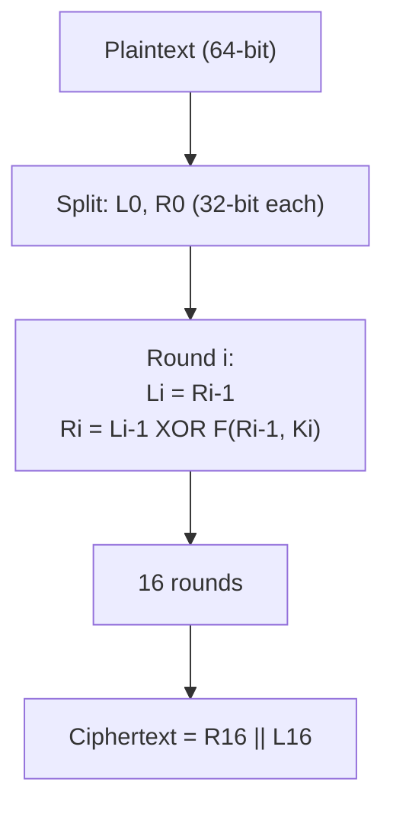

> **Prerequisites**: [[09-stream-ciphers-lfsr|09. Stream Ciphers & LFSR]] — keystream, nonce; [[04-modular-arithmetic|04. Modular Arithmetic]] — GF(2⁸) arithmetic; [[07-encoding-xor-otp|07. Encoding & XOR / OTP]] — XOR  
> **Lesson type**: Scheme + Foundation
>
> **Notation** (ký hiệu dùng mà không định nghĩa trong bài này):
> | Ký hiệu | Ý nghĩa |
> |---------|---------|
> | $\mathbb{F}_{2^8}$ | Trường GF(2⁸) — 256 phần tử, phần tử là byte |
> | $\oplus$ | XOR (cộng trong GF(2) hoặc GF(2⁸)) |
> | $E_K(\cdot)$ | Hàm mã hóa AES với key $K$ |
> | $D_K(\cdot)$ | Hàm giải mã AES với key $K$ |
> | $\mathsf{negl}(\lambda)$ | Negligible function |

---

## 1. Motivation

Stream cipher mã hóa từng bit một, phù hợp cho dữ liệu streaming. Nhưng phần lớn ứng dụng thực tế cần mã hóa **khối dữ liệu có cấu trúc**: file, gói tin mạng, bản ghi database. Với những use-case này, **block cipher** là lựa chọn phù hợp hơn.

Block cipher hoạt động trên khối dữ liệu cố định — **128 bit (16 byte)** với AES hiện đại — và từ cùng một key tạo ra một **permutation ngẫu nhiên** (pseudorandom permutation, PRP) trên không gian khối đó. Mỗi key định nghĩa một trong $2^{128}!$ hoán vị có thể của 128-bit strings. Không có key, không thể phân biệt output AES với oracle ngẫu nhiên.

Tuy nhiên, block cipher đơn thuần chỉ mã hóa **một khối 16 byte**. Để mã hóa message dài hơn, cần **mode of operation** — quy trình kết hợp nhiều lần gọi block cipher theo cách an toàn. Lựa chọn mode sai có thể phá hủy hoàn toàn bảo mật ngay cả khi AES bên dưới hoàn toàn an toàn.

---

## 2. Block Cipher: Định nghĩa Chính Thức

> [!note] Định nghĩa — Block Cipher
> **Type**: Symmetric Encryption Primitive
> **Setting**: Block size $n$ (AES: $n = 128$), key size $\kappa$ (AES: $\kappa \in \{128, 192, 256\}$)
>
> **$\mathsf{KeyGen}(1^\lambda)$**  
> - Chọn $K \stackrel{R}{\leftarrow} \{0,1\}^\kappa$  
> - Output: $K$
>
> **$E_K : \{0,1\}^n \to \{0,1\}^n$**  
> - Input: plaintext block $P \in \{0,1\}^n$, key $K \in \{0,1\}^\kappa$  
> - Output: ciphertext block $C \in \{0,1\}^n$  
> - $E_K$ là một **bijection** (permutation) trên $\{0,1\}^n$
>
> **$D_K : \{0,1\}^n \to \{0,1\}^n$**  
> - $D_K = E_K^{-1}$: hàm ngược của $E_K$  
> - $D_K(E_K(P)) = P$ với mọi $P$

Block cipher khác stream cipher ở chỗ **có thể giải mã**: $D_K$ tồn tại (vì $E_K$ là bijection).

> [!abstract] Định lý — PRP Security
> Block cipher an toàn nếu $E_K$ không thể phân biệt được với một permutation ngẫu nhiên thực sự. Formally: với mọi adversary PPT $\mathcal{A}$:
>
> $$\left|\Pr[\mathcal{A}^{E_K(\cdot)} = 1] - \Pr[\mathcal{A}^{\pi(\cdot)} = 1]\right| \leq \mathsf{negl}(\lambda)$$
>
> trong đó $\pi$ là permutation ngẫu nhiên thực sự trên $\{0,1\}^n$.

Nói không chính thức: không adversary nào với tài nguyên polynomial có thể phân biệt AES với một hộp đen ngẫu nhiên, dù họ được query bao nhiêu lần (với key cố định).

---

## 3. AES — Advanced Encryption Standard

### 3.1. Lịch Sử

AES được NIST lựa chọn năm 2001 qua cuộc thi mở (1997-2001), đánh bại 14 candidate khác. Thuật toán chiến thắng là **Rijndael** (Vincent Rijmen và Joan Daemen, Bỉ). AES có ba phiên bản theo key size: AES-128 (10 rounds), AES-192 (12 rounds), AES-256 (14 rounds). Block size luôn là **128 bit**.

### 3.2. State và Round Structure

AES làm việc trên **state** — ma trận 4×4 bytes (16 bytes = 128 bits), được sắp xếp theo cột:

$$\text{State} = \begin{bmatrix} s_{0,0} & s_{0,1} & s_{0,2} & s_{0,3} \\ s_{1,0} & s_{1,1} & s_{1,2} & s_{1,3} \\ s_{2,0} & s_{2,1} & s_{2,2} & s_{2,3} \\ s_{3,0} & s_{3,1} & s_{3,2} & s_{3,3} \end{bmatrix}, \quad s_{i,j} \in \mathbb{F}_{2^8}$$

![[assets/img-07-aes-round.png]]
*Hình 1: Cấu trúc round của AES-128 — 10 rounds, mỗi round gồm 4 transformations*

### 3.3. Bốn Transformations Trong Mỗi Round

> [!note] SubBytes — Confusion (Phi tuyến)
> Mỗi byte trong state được thay thế qua S-box: $s'_{i,j} = \text{S}[s_{i,j}]$.
>
> S-box được thiết kế từ: (1) tính nghịch đảo trong $\mathbb{F}_{2^8}$ (modulo irreducible polynomial $x^8 + x^4 + x^3 + x + 1$), (2) áp dụng affine transformation. S-box có **differential uniformity = 4** và **nonlinearity = 112** — tham số tốt nhất có thể chống differential và linear cryptanalysis.

> [!note] ShiftRows — Diffusion (Hoán vị hàng)
> Hàng $i$ của state bị dịch vòng trái $i$ byte:
> - Hàng 0: không dịch
> - Hàng 1: dịch 1 byte
> - Hàng 2: dịch 2 bytes
> - Hàng 3: dịch 3 bytes
>
> Kết quả: mỗi cột ciphertext sau ShiftRows chứa bytes từ 4 cột khác nhau của plaintext.

> [!note] MixColumns — Diffusion (Trộn cột)
> Mỗi cột của state được nhân với ma trận cố định $M$ trong $\mathbb{F}_{2^8}$:
>
> $$M = \begin{bmatrix} 2 & 3 & 1 & 1 \\ 1 & 2 & 3 & 1 \\ 1 & 1 & 2 & 3 \\ 3 & 1 & 1 & 2 \end{bmatrix}$$
>
> Phép nhân thực hiện trong $\mathbb{F}_{2^8}$. Sau MixColumns, mỗi byte output phụ thuộc vào tất cả 4 bytes input của cột đó.
>
> **Sau 2 rounds** (ShiftRows + MixColumns kết hợp): mọi output bit phụ thuộc vào mọi input bit — đây là **full diffusion** hay còn gọi là **avalanche effect**.

> [!note] AddRoundKey — Key Mixing
> State được XOR với **round key** $RK_i$ tương ứng:
>
> $$\text{state}' = \text{state} \oplus RK_i$$
>
> Đây là bước **duy nhất** đưa key vào state. Round keys được tạo từ master key qua **Key Schedule** — một thuật toán mở rộng từ master key thành 11 round keys (với AES-128), mỗi key 128 bit.

### 3.4. Security Status của AES

AES ra đời năm 2001 và đến nay vẫn chưa bị phá. Cuộc tấn công tốt nhất lên AES-128 (biclique cryptanalysis, 2011) yêu cầu $2^{126.1}$ operations — chỉ tốt hơn brute-force khoảng $4 \times$ và hoàn toàn không thực tế.

> [!tip] AES-128 vs AES-256
> Với ứng dụng thông thường, AES-128 là đủ an toàn. AES-256 cung cấp security margin lớn hơn cho "harvest now, decrypt later" scenario (kẻ tấn công lưu ciphertext để giải mã sau khi có QC). TLS 1.3 mặc định dùng AES-128-GCM nhưng hỗ trợ AES-256-GCM cho high-security.

---

## 4. Padding — PKCS#7

Block cipher cần plaintext là bội số của block size (16 bytes). Để xử lý message có độ dài tùy ý, ta dùng **padding**.

> [!note] Định nghĩa — PKCS#7 Padding
> Thêm $k$ bytes có giá trị $k$ vào cuối message, với $1 \leq k \leq \text{block\_size}$:
>
> - Nếu message dài $m$ bytes, $k = \text{block\_size} - (m \bmod \text{block\_size})$
> - Nếu $m$ đã là bội số của block_size, thêm **một block padding đầy đủ** ($k = 16$, thêm 16 bytes `\x10`)

> [!example] Ví dụ — PKCS#7 với block_size = 16
> | Message (ASCII) | Length | Padded |
> |---|---|---|
> | `"Hello"` | 5 bytes | `48 65 6c 6c 6f` **`0b 0b 0b 0b 0b 0b 0b 0b 0b 0b 0b`** |
> | `"Hello World!!!"` | 15 bytes | `...` **`01`** |
> | `"Hello World!!!!!"` | 17 bytes | `...` **`0f 0f 0f 0f 0f 0f 0f 0f 0f 0f 0f 0f 0f 0f 0f`** |

```python
from Crypto.Util.Padding import pad, unpad

pt = b"Hello"
padded = pad(pt, 16)
print(padded)
print(unpad(padded, 16))
```

> [!warning] Padding Oracle
> Kẻ tấn công có thể khai thác việc server báo lỗi "padding invalid" để decrypt ciphertext từng byte một — **padding oracle attack**. Đây là lý do tại sao CBC + manual PKCS#7 nguy hiểm nếu không implement cẩn thận.

---

## 5. Modes of Operation

Như đã đề cập, block cipher chỉ mã hóa 16 bytes. Mode of operation xác định cách **kết hợp nhiều lần gọi** $E_K$ để mã hóa message dài. Lựa chọn mode quyết định bảo mật thực tế của toàn hệ thống.

![[assets/img-07-modes.png]]
*Hình 2: So sánh ECB, CBC, CTR, GCM — cấu trúc, data flow, và security properties*

### 5.1. ECB — Electronic Codebook

> [!note] Scheme — ECB Mode
> **Type**: Block Cipher Mode (KHÔNG AN TOÀN)
> **Setting**: Block cipher $E_K$, block size $n = 128$ bit
>
> **$\mathsf{Enc\_ECB}(K,\, M)$**  
> - Input: key $K$, plaintext $M$ (đã padded, chia thành blocks $M_1, M_2, \ldots, M_\ell$)  
> - Với mỗi $i$: tính $C_i = E_K(M_i)$  
> - Output: $C = C_1 \| C_2 \| \cdots \| C_\ell$
>
> **$\mathsf{Dec\_ECB}(K,\, C)$**  
> - Input: key $K$, ciphertext $C = C_1 \| \cdots \| C_\ell$  
> - Với mỗi $i$: tính $M_i = D_K(C_i)$  
> - Output: $M = M_1 \| \cdots \| M_\ell$ (unpad)

> [!danger] ECB Không Đạt IND-CPA — Tại Sao Không Bao Giờ Dùng
> ECB encrypt mỗi block **hoàn toàn độc lập**. Hệ quả:
>
> - **Pattern leakage**: Nếu $M_i = M_j$ thì $C_i = C_j$. Attacker quan sát được block nào giống nhau.
> - **ECB Penguin**: Ảnh bitmap encrypt bằng ECB vẫn giữ nguyên hình dạng vì các pixel đồng màu tạo ra ciphertext blocks giống nhau.
> - **Deterministic**: Không có IV/nonce, nên encrypt cùng message luôn cho cùng ciphertext → không đạt IND-CPA.
> - **Cut-and-paste attack**: Attacker có thể cắt và ghép các blocks ciphertext để tạo ra plaintext tùy ý.
>
> **Kết luận**: ECB không đạt ngay cả OW-CPA (onewaỳness). Không dùng ECB trong bất kỳ ứng dụng thực tế nào.

### 5.2. CBC — Cipher Block Chaining

> [!note] Scheme — CBC Mode
> **Type**: Block Cipher Mode (confidentiality only)
> **Setting**: Block cipher $E_K$, block size $n$, $IV \stackrel{R}{\leftarrow} \{0,1\}^n$ (random)
>
> **$\mathsf{Enc\_CBC}(K,\, IV,\, M)$**  
> - Input: key $K$, random IV, plaintext $M = M_1 \| \cdots \| M_\ell$ (padded)  
> - Đặt $C_0 = IV$  
> - Với $i = 1, \ldots, \ell$: tính $C_i = E_K(M_i \oplus C_{i-1})$  
> - Output: $C = IV \| C_1 \| C_2 \| \cdots \| C_\ell$
>
> **$\mathsf{Dec\_CBC}(K,\, C)$**  
> - Input: key $K$, ciphertext $C = IV \| C_1 \| \cdots \| C_\ell$  
> - Với $i = 1, \ldots, \ell$: tính $M_i = D_K(C_i) \oplus C_{i-1}$ (với $C_0 = IV$)  
> - Output: $M = M_1 \| \cdots \| M_\ell$ (unpad)

**Correctness**: $D_K(C_i) \oplus C_{i-1} = D_K(E_K(M_i \oplus C_{i-1})) \oplus C_{i-1} = (M_i \oplus C_{i-1}) \oplus C_{i-1} = M_i$. $\blacksquare$

> [!abstract] Định lý — CBC đạt IND-CPA
> Nếu $E_K$ là PRP an toàn và IV được chọn **uniform random** mỗi lần encrypt, thì CBC mode đạt **IND-CPA**.

**Proof sketch.** Vì IV random, block đầu tiên $C_1 = E_K(M_1 \oplus IV)$ là pseudorandom (IV làm diversifier). Mỗi block tiếp theo $C_i = E_K(M_i \oplus C_{i-1})$ được "chained" qua ciphertext trước — tạo hiệu ứng cascade ngẫu nhiên. Adversary không thể phân biệt ciphertext với chuỗi ngẫu nhiên. $\square$

> [!warning] Các Attack Lên CBC
> - **Padding Oracle Attack** (Vaudenay, 2002): Server báo "invalid padding" → attacker có thể decrypt từng byte.
> - **CBC Bit-Flipping**: Flip bit trong $C_{i-1}$ → flip bit tương ứng trong $M_i$ (XOR property của CBC decrypt). Dùng để bypass authentication: flip "admin=false" → "admin=true".
> - **BEAST Attack (2011)**: IV predictable trong TLS 1.0 → CBC không đạt IND-CPA khi IV không random.
> - **POODLE Attack (2014)**: Padding oracle trên SSLv3 CBC.
>
> **Chú ý**: CBC **không có authentication** — attacker có thể tamper ciphertext mà không bị phát hiện. Cần kết hợp với MAC.

### 5.3. CTR — Counter Mode

> [!note] Scheme — CTR Mode
> **Type**: Block Cipher Mode (confidentiality, no padding needed)
> **Setting**: Block cipher $E_K$, block size $n$, nonce $\nu$ (unique per message)
>
> **$\mathsf{Enc\_CTR}(K,\, \nu,\, M)$**  
> - Input: key $K$, nonce $\nu \in \{0,1\}^{n/2}$, plaintext $M$ (không cần padding)  
> - Tính keystream block $i$: $\text{KS}_i = E_K(\nu \| \text{ctr}_i)$, với $\text{ctr}_i$ là counter 64-bit  
> - Với mỗi block $M_i$: tính $C_i = M_i \oplus \text{KS}_i$  
> - Output: $C = \nu \| C_1 \| C_2 \| \cdots$
>
> **$\mathsf{Dec\_CTR}(K,\, C)$**  
> - Input: key $K$, ciphertext $C = \nu \| C_1 \| \cdots$  
> - Tính lại keystream blocks (cùng công thức)  
> - Với mỗi block: $M_i = C_i \oplus \text{KS}_i$  
> - Output: $M = M_1 \| M_2 \| \cdots$

> [!tip] CTR biến Block Cipher thành Stream Cipher
> CTR mode tạo keystream bằng cách encrypt các counter values $(IV\|0, IV\|1, IV\|2, \ldots)$. Kết quả: XOR plaintext với keystream — y hệt stream cipher. Ưu điểm so với CBC:
> - **Không cần padding** (không cần toàn bộ block)
> - **Encrypt và decrypt song song** (tất cả counter blocks độc lập)
> - **Seek được** — decrypt từ vị trí bất kỳ mà không cần decrypt toàn bộ

> [!warning] Nonce Reuse trong CTR — Thảm Họa
> Nếu cùng (key, nonce) được dùng hai lần:
>
> $$C_1 \oplus C_2 = m_1 \oplus m_2$$
>
> Giống hệt nonce reuse trong stream cipher. CTR **không có authentication** — cần kết hợp với MAC.

### 5.4. GCM — Galois/Counter Mode (Chuẩn Vàng)

GCM là **AEAD (Authenticated Encryption with Associated Data)**: vừa mã hóa (confidentiality) vừa xác thực integrity trong một thao tác duy nhất. Đây là mode được khuyến nghị cho mọi ứng dụng hiện đại.

> [!note] Scheme — GCM Mode
> **Type**: AEAD (Authenticated Encryption with Associated Data)
> **Setting**: Block cipher $E_K$ (AES), nonce $\nu$ (96-bit recommended), AAD $A$
>
> **$\mathsf{Setup}$**  
> - Tính $H = E_K(0^{128})$ — authentication key
>
> **$\mathsf{Enc\_GCM}(K,\, \nu,\, A,\, M)$**  
> - Input: key $K$, nonce $\nu$, associated data $A$, plaintext $M$  
> - Mã hóa bằng CTR: $C = \mathsf{CTR}\_\mathsf{Enc}(K, \nu, M)$  
> - Tính authentication tag: $T = \mathsf{GHASH}(H, A, C) \oplus E_K(J_0)$, với $J_0 = \nu \| 1$  
> - Output: $(C, T)$
>
> **$\mathsf{Dec\_GCM}(K,\, \nu,\, A,\, C,\, T)$**  
> - Input: key $K$, nonce $\nu$, $A$, ciphertext $C$, tag $T$  
> - Verify tag: tính $T' = \mathsf{GHASH}(H, A, C) \oplus E_K(J_0)$; nếu $T \neq T'$ → reject  
> - Nếu tag hợp lệ: decrypt $M = \mathsf{CTR}\_\mathsf{Dec}(K, \nu, C)$  
> - Output: $M$ hoặc $\perp$ (nếu tag invalid)

**GHASH** là polynomial hash trên $\mathbb{F}_{2^{128}}$:

$$\mathsf{GHASH}(H, A, C) = (A_1 H^{m+n+1} \oplus \cdots \oplus A_m H^{n+2}) \oplus (C_1 H^{n+1} \oplus \cdots \oplus C_n H^2) \oplus \text{len}(A,C) \cdot H$$

trong đó các phép nhân thực hiện trong $\mathbb{F}_{2^{128}}$ (modulo irreducible polynomial bậc 128).

> [!abstract] Định lý — GCM đạt IND-CCA2 (với nonce unique)
> Nếu $E_K$ là PRP an toàn và nonce không bao giờ reuse, GCM đạt **IND-CCA2** — security notion mạnh nhất thực tế cho authenticated encryption.

> [!warning] Attack — GCM Forbidden Attack (Nonce Reuse)
> Nếu cùng $(K, \nu)$ được dùng hai lần để encrypt $(m_1, A_1)$ và $(m_2, A_2)$, authentication key $H = E_K(0^{128})$ có thể bị recover:
>
> $$T_1 \oplus T_2 = \mathsf{GHASH}(H, A_1, C_1) \oplus \mathsf{GHASH}(H, A_2, C_2)$$
>
> Phương trình này là đa thức bậc thấp trong $H$ trên $\mathbb{F}_{2^{128}}$ → giải tìm $H$ → forge tag cho message tùy ý.  
> **Kết quả**: Nonce reuse trong GCM phá cả confidentiality **và** authenticity. Nguy hiểm hơn nonce reuse trong CTR thuần túy.  
> **Phòng chống**: Dùng nonce ngẫu nhiên 96-bit (xác suất collision $\approx 2^{-48}$ sau $2^{32}$ messages), hoặc counter, hoặc dùng **AES-GCM-SIV** (nonce-misuse resistant).

> [!info] Associated Data (AAD) là gì?
> AAD là dữ liệu được **authenticate nhưng không mã hóa**. Dùng cho headers, metadata, addresses — thông tin cần public nhưng không được tamper.
> Ví dụ trong TLS 1.3: AAD = sequence number + record type + version. Ciphertext = encrypted application data.
> Nếu attacker thay đổi AD → tag verification fail → connection rejected.

---

## 6. So Sánh Toàn Diện

| Mode | IV/Nonce | Parallel Enc | Parallel Dec | Auth | Padding | Khuyến nghị |
|---|---|---|---|---|---|---|
| **ECB** | Không | ✓ | ✓ | ✗ | Cần | **KHÔNG BAO GIỜ** |
| **CBC** | Random IV | ✗ | ✓ | ✗ | Cần | Legacy — cần Enc-then-MAC |
| **CTR** | Unique nonce | ✓ | ✓ | ✗ | Không | Tốt — cần MAC riêng |
| **GCM** | Unique nonce | ✓ | ✓ | ✓ (128-bit) | Không | **KHUYẾN NGHỊ** |
| **CFB** | Random IV | ✗ | ✓ | ✗ | Không | Ít dùng |
| **OFB** | Unique nonce | ✗ | ✗ | ✗ | Không | Không dùng |

> [!tip] Quy tắc chọn mode
> 1. Cần authentication (mọi trường hợp thực tế) → **GCM** (hoặc ChaCha20-Poly1305)
> 2. Legacy system phải dùng CBC → **CBC + HMAC (Encrypt-then-MAC)**
> 3. Streaming data không cần auth → **CTR** (kết hợp HMAC riêng)
> 4. ECB → **KHÔNG BAO GIỜ** trong ứng dụng thực tế

### 6.1. Các Mode Đặc Biệt — Breadth Overview

Ngoài ECB/CBC/CTR/GCM, có một số mode đáng biết trong các ngữ cảnh đặc thù:

> [!info] XEX và XTS — Disk Encryption Modes
>
> **XEX (XOR-Encrypt-XOR)**: Tweakable block cipher. Mã hóa block $P$ với tweak $T$ (thường là địa chỉ sector + index block):
>
> $$C = E_K(P \oplus T') \oplus T', \quad T' = E_K(T) \cdot \alpha^i$$
>
> Trong đó $\alpha$ là primitive element trong $\text{GF}(2^{128})$, $i$ là index block trong sector. Mỗi block được mã hóa với tweak khác nhau → không bị ECB penguin.
>
> **XTS (XEX + Ciphertext Stealing)**: NIST SP 800-38E. Dựa trên XEX với ciphertext stealing để xử lý block không đủ 16 bytes. Dùng **hai key** $K_1$ (mã hóa) và $K_2$ (tính tweak):
>
> $$T' = E_{K_2}(\text{sector\_num}) \cdot \alpha^i$$
>
> $$C_i = E_{K_1}(P_i \oplus T') \oplus T'$$
>
> **Đặc điểm quan trọng**: XTS **chỉ cung cấp confidentiality, không có authentication**. Attacker có thể flip bits trong sector mà server không phát hiện được. Chỉ dùng khi layer khác (filesystem integrity check, dm-integrity, signed boot) xử lý authentication.
>
> **Dùng trong**: macOS FileVault 2, Linux dm-crypt/LUKS (XTS mode), VeraCrypt, Windows BitLocker.

> [!info] OCB — Single-Pass AEAD
>
> **OCB (Offset Codebook Mode)**: RFC 7253 (Krovetz & Rogaway). AEAD single-pass — mã hóa và authenticate trong **một lần duyệt** qua data, không cần hai pass như CCM.
>
> - Tag sizes: 128, 96, 64 bits (default 128).
> - Parallel encryption: mỗi block xử lý độc lập với offset khác nhau.
> - Throughput tương đương GCM nhưng không cần GHASH riêng.
> - Patent issues từ 2001–2021 (nay đã resolved, free to use).
>
> **Dùng trong**: OpenSSH (thực nghiệm), một số high-performance VPN.

> [!info] CCM — AEAD cho IoT/Embedded
>
> **CCM (Counter with CBC-MAC)**: NIST SP 800-38C. Two-pass AEAD: CBC-MAC tính authentication tag, sau đó CTR mode mã hóa data + tag.
>
> - Nonce 7–13 bytes (variable), tag 4–16 bytes (variable).
> - **Chậm hơn GCM**: hai pass → không parallel được hoàn toàn.
> - Yêu cầu biết trước độ dài message trước khi bắt đầu.
> - Được chứng nhận NIST → dùng nhiều trong các ứng dụng cần certification.
>
> **Dùng trong**: IEEE 802.15.4 (Zigbee), Bluetooth LE (BLE), TLS 1.2 (cipher suites TLS_RSA_WITH_AES_128_CCM), nhiều thiết bị IoT/embedded.

> [!info] SIV — Deterministic AEAD
>
> **SIV (Synthetic IV)**: RFC 5297. Deterministic AEAD — không cần nonce từ bên ngoài. Tag $T$ được tính từ message + AAD, rồi dùng $T$ làm IV cho CTR encryption:
>
> $$T = S2V_{K_1}(A_1, \ldots, A_n, M), \quad C = \text{CTR}_{K_2}(T, M)$$
>
> **Nonce-misuse resistant by design**: Nếu cùng $(K, M, A)$ → cùng $(C, T)$ (deterministic). Nếu $(K, M)$ khác → $(C, T)$ hoàn toàn khác. Attacker chỉ có thể biết hai message có giống nhau hay không, không hơn.
>
> **Dùng trong**: Key wrapping (AES-SIV wrap), contexts không có reliable counter, AES-GCM-SIV (L09) dùng biến thể POLYVAL thay SIV-CMAC.

> [!warning] Tóm tắt quan trọng
> | Mode | Auth | Parallel | Nonce cần | Dùng khi |
> |------|------|----------|-----------|----------|
> | **XTS** | ✗ | ✓ | ✓ | Disk encryption (với integrity layer khác) |
> | **OCB** | ✓ | ✓ | ✓ | High-perf AEAD không có AES-NI constraint |
> | **CCM** | ✓ | ✗ | ✓ | IoT/embedded cần certification NIST |
> | **SIV** | ✓ | ✗ | ✗ | Stateful, deterministic, key wrapping |
>
> **Với CTF**: XTS thỉnh thoảng xuất hiện trong disk image forensics. CCM gặp trong BLE/Zigbee challenges. SIV gặp trong challenges về nonce-misuse resistance.

---

## 7. Confusion và Diffusion — Shannon's Design Principles

Claude Shannon (1949) đề xuất hai nguyên tắc thiết kế block cipher:

> [!info] Shannon's Confusion and Diffusion
>
> **Confusion** (gây rối loạn): Làm cho quan hệ giữa plaintext, key và ciphertext trở nên phức tạp, phi tuyến. Mục tiêu: mỗi bit ciphertext phụ thuộc vào nhiều phần của key theo cách phi tuyến.
> → AES thực hiện qua **SubBytes** (S-box dựa trên GF(2⁸) inverse — phi tuyến cao)
>
> **Diffusion** (khuếch tán): Một bit thay đổi trong plaintext/key làm khoảng 50% bits ciphertext thay đổi (**avalanche effect**). Mục tiêu: thông tin từ một vị trí được spread ra toàn bộ ciphertext.
> → AES thực hiện qua **ShiftRows** (hoán vị hàng) + **MixColumns** (trộn cột)

Hai nguyên tắc này giải thích tại sao AES cần cả S-box phi tuyến (SubBytes) và linear mixing (ShiftRows + MixColumns). Chỉ có một trong hai là không đủ.

---

## 8. DES và Feistel Network (Historical Context)

Trước AES, chuẩn là **DES** (Data Encryption Standard, 1977). DES dùng **Feistel network** — cấu trúc khác hoàn toàn với AES:



Feistel network có tính chất quan trọng: **decrypt dùng cùng cấu trúc với keys đảo ngược** (không cần $F$ phải invertible). AES không dùng Feistel vì SPN (Substitution-Permutation Network) mạnh hơn với cùng số rounds.

DES bị broken vì key size chỉ 56-bit (2^56 ≈ 7.2 × 10^16 — feasible với hardware hiện đại năm 1998). Triple-DES (3DES) dùng 3DES với 2 hoặc 3 keys khác nhau, nhưng chậm và đã deprecated năm 2023 (NIST SP 800-131A).

---

## 9. Công cụ & Code

### 9.1. AES với pycryptodome

```python
from Crypto.Cipher import AES
from Crypto.Util.Padding import pad, unpad
from Crypto.Random import get_random_bytes

key = get_random_bytes(16)
plaintext = b"Hello, AES world"

ecb = AES.new(key, AES.MODE_ECB)
ct_ecb = ecb.encrypt(pad(plaintext, 16))

iv = get_random_bytes(16)
cbc = AES.new(key, AES.MODE_CBC, iv=iv)
ct_cbc = cbc.encrypt(pad(plaintext, 16))

nonce = get_random_bytes(16)
ctr = AES.new(key, AES.MODE_CTR, nonce=b'', initial_value=nonce)
ct_ctr = ctr.encrypt(plaintext)

nonce_gcm = get_random_bytes(12)
gcm = AES.new(key, AES.MODE_GCM, nonce=nonce_gcm)
ct_gcm, tag = gcm.encrypt_and_digest(plaintext)
```

### 9.2. Demo ECB Penguin (Pattern Leakage)

```python
from Crypto.Cipher import AES
from Crypto.Util.Padding import pad

key = b"0123456789ABCDEF"
block = b"AAAAAAAAAAAAAAAA"

ecb = AES.new(key, AES.MODE_ECB)
ct = ecb.encrypt(block * 4)
print([ct[i:i+16].hex() for i in range(0, len(ct), 16)])
```

Quan sát: 4 blocks giống nhau → 4 ciphertext blocks giống nhau. Đây là ECB Penguin.

### 9.3. Decrypt CBC (một block)

```python
def cbc_decrypt_block(ciphertext_block, prev_ciphertext_block, key):
    ecb = AES.new(key, AES.MODE_ECB)
    intermediate = ecb.decrypt(ciphertext_block)
    return bytes(a ^ b for a, b in zip(intermediate, prev_ciphertext_block))
```

---

## 10. CTF Relevance

**Nền tảng để hiểu Phase 2 attacks**

**Dạng bài hay gặp**:

1. **ECB Pattern Attack**: Exploit identical blocks trong ECB ciphertext. Phổ biến: block permutation, ECB byte-at-a-time oracle. Nhận dạng: ciphertext có 16-byte blocks lặp lại.

2. **ECB Cut-and-Paste**: Cắt và ghép các blocks ciphertext để tạo plaintext tùy ý. Xem [[08-block-cipher-attacks|L08]] để làm bài tập.

3. **CBC Bit-Flipping**: Flip bit trong $C_{i-1}$ để flip bit tương ứng trong $P_i$. Thường dùng để set `admin=true`.

4. **Padding Oracle** (phổ biến nhất): Server báo lỗi padding → decrypt từng byte. Xem [[08-block-cipher-attacks|L08]].

5. **GCM Nonce Reuse**: Source code generate nonce không đúng cách → Forbidden Attack để forge tag.

**Nhận dạng nhanh**:
- `AES.MODE_ECB` trong source code → ECB attack
- `AES.MODE_CBC` + server response khác nhau khi ciphertext tampered → padding oracle
- `AES.MODE_GCM` + nonce là static hay counter ngắn → Forbidden Attack
- Import `random` thay vì `os.urandom` → predictable key/IV

---

## 11. Summary

- **Block cipher** mã hóa khối 128-bit cố định. AES là PRP an toàn: output không phân biệt được với random permutation.
- **AES rounds**: AddRoundKey (XOR key) → SubBytes (confusion, S-box phi tuyến) → ShiftRows + MixColumns (diffusion, avalanche). AES-128 có 10 rounds.
- **ECB**: Mỗi block độc lập → pattern leakage, deterministic → **tuyệt đối không dùng**.
- **CBC**: Chain qua XOR với ciphertext trước, IV random → IND-CPA. Nhưng không có auth, cần Encrypt-then-MAC. Dễ bị padding oracle.
- **CTR**: Biến block cipher thành stream cipher qua counter → parallel, không cần padding. Cần nonce unique và MAC riêng.
- **GCM**: CTR + GHASH authentication → AEAD, IND-CCA2. **Mode khuyến nghị.** Nonce reuse → catastrophic (Forbidden Attack).
- **Shannon's principles**: Confusion (SubBytes) + Diffusion (ShiftRows + MixColumns) = nền tảng thiết kế mọi block cipher hiện đại.

---

## 12. References

- NIST FIPS 197 — Advanced Encryption Standard (AES), 2001 — csrc.nist.gov/publications/fips/fips197/fips-197.pdf
- NIST SP 800-38A — Recommendation for Block Cipher Modes of Operation, 2001
- McGrew, D. & Viega, J. — *The Galois/Counter Mode of Operation (GCM)*, 2005 — luca-giuzzi.unibs.it/corsi/Support/papers-cryptography/gcm-spec.pdf
- Vaudenay, S. — *Security Flaws Induced by CBC Padding*, EUROCRYPT 2002
- Boneh & Shoup — *A Graduate Course in Applied Cryptography* — Chapters 4–5 (Block Ciphers, Modes) — toc.cryptobook.us
- Daemen & Rijmen — *The Design of Rijndael: AES — The Advanced Encryption Standard*, Springer 2002
- Cryptopals — Set 1 & Set 2 — cryptopals.com (challenges 7-17 cover block ciphers & modes)
- https://aes.cryptohack.org — interactive AES visualization
