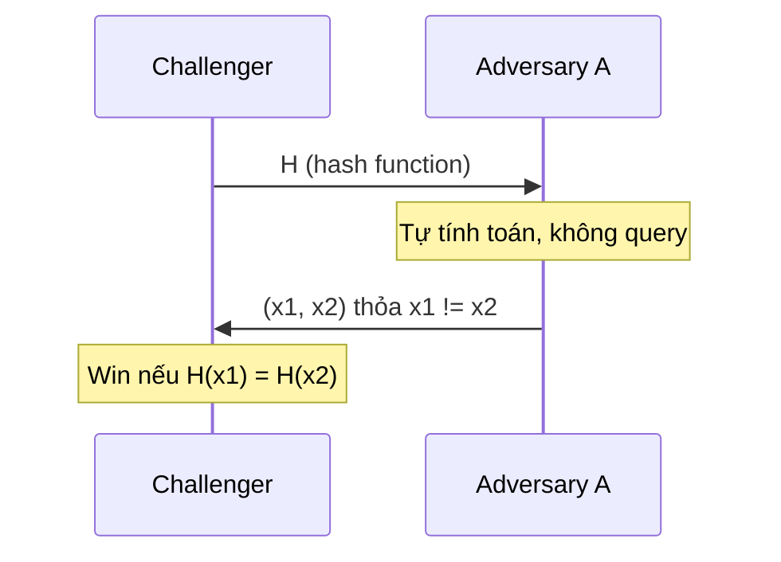

> **Prerequisites**: [[07-encoding-xor-otp|07 — Encoding & XOR / OTP]], [[04-modular-arithmetic|04 — Modular Arithmetic]] (đặc biệt khái niệm entropy từ 08)  
> **Lesson type**: Foundation
>
> **Notation** (ký hiệu dùng mà không định nghĩa lại trong bài này):
> | Ký hiệu | Ý nghĩa |
> |---------|---------|
> | $H : \{0,1\}^* \to \{0,1\}^n$ | Hash function, output $n$ bits |
> | $\lambda$ | Security parameter (thường = output bit-length) |
> | $\mathsf{negl}(\lambda)$ | Negligible function của $\lambda$ |
> | $\text{Adv}[\mathcal{A}]$ | Advantage của adversary $\mathcal{A}$ |
> | $f : \{0,1\}^{m+t} \to \{0,1\}^m$ | Compression function (trong MD construction) |
> | $\text{IV}$ | Initialization Vector — trạng thái khởi đầu |

---

## 1. Motivation

Hash function là một trong những primitive được sử dụng rộng rãi nhất trong toàn bộ hệ sinh thái mật mã. Không một giao thức hiện đại nào — TLS, SSH, Bitcoin, Git, digital signatures — lại hoạt động được thiếu nó.

Ý tưởng cốt lõi rất đơn giản: biến đổi một chuỗi đầu vào tùy độ dài thành một "dấu vân tay" cố định độ dài, theo cách mà về mặt tính toán là không thể đảo ngược và cực khó bị trùng lặp. Tuy nhiên, phía sau sự đơn giản đó là một hệ thống tính chất bảo mật tinh vi, và lịch sử của hash functions là lịch sử của những tính chất đó bị tấn công từng cái một.

Bài này trả lời ba câu hỏi nền tảng: *hash function là gì*, *cách xây dựng*, và *tại sao một số construction an toàn còn một số thì không*.

---

## 2. Định nghĩa hình thức

> [!note] Định nghĩa — Cryptographic Hash Function
> Một **cryptographic hash function** là hàm:
>
> $$
> H : \{0,1\}^* \to \{0,1\}^n
> $$
>
> Nhận input tùy độ dài và output chuỗi $n$ bits cố định, thỏa mãn đồng thời ba tính chất bảo mật sau (xem 2, 3, 4).

Lưu ý quan trọng: hash function là **unkeyed** — không có key. Đây là điểm phân biệt căn bản với MAC và PRF.

---

## 3. Ba tính chất bảo mật cốt lõi

### 3.1. Preimage Resistance (One-Wayness)

> [!note] Định nghĩa — Preimage Resistance
> $H$ là **preimage resistant** (hay one-way) nếu với mọi PPT adversary $\mathcal{A}$:
>
> $$
> \Pr\bigl[\mathcal{A}(H(x)) = x' : H(x') = H(x)\bigr] \leq \mathsf{negl}(\lambda)
> $$
>
> Tức là: biết $y = H(x)$, không thể tìm được **bất kỳ** $x'$ nào sao cho $H(x') = y$.

**Intuition**: Từ "dấu vân tay" không thể tái tạo lại "ngón tay". Tính chất này bảo vệ password hashing: dù database bị leak, attacker không thể đảo ngược hash để lấy password gốc.

**Độ phức tạp tấn công**: $O(2^n)$ — phải thử toàn bộ $2^n$ giá trị có thể.

### 3.2. Second Preimage Resistance

> [!note] Định nghĩa — Second Preimage Resistance
> $H$ là **second preimage resistant** nếu với mọi PPT adversary $\mathcal{A}$ và với một $x$ cho trước:
>
> $$
> \Pr\bigl[\mathcal{A}(x) = x' : x' \neq x \text{ và } H(x') = H(x)\bigr] \leq \mathsf{negl}(\lambda)
> $$
>
> Tức là: biết $x$, không thể tìm $x' \neq x$ có cùng hash.

**Intuition**: Không thể thay thế một document đã ký bằng một document khác có cùng hash. Tính chất này bảo vệ integrity của signed messages.

**Thứ bậc**: Collision resistance $\Rightarrow$ second preimage resistance $\Rightarrow$ preimage resistance (implication một chiều, không đảo được).

### 3.3. Collision Resistance

> [!note] Định nghĩa — Collision Resistance
> $H$ là **collision resistant** nếu với mọi PPT adversary $\mathcal{A}$:
>
> $$
> \Pr\bigl[\mathcal{A}() = (x_1, x_2) : x_1 \neq x_2 \text{ và } H(x_1) = H(x_2)\bigr] \leq \mathsf{negl}(\lambda)
> $$
>
> Tức là: khó tìm **bất kỳ** cặp $(x_1, x_2)$ nào có cùng hash.

**Intuition**: Đây là tính chất mạnh nhất và cũng khó bảo đảm nhất. Collision **luôn luôn tồn tại** về mặt toán học (domain vô hạn, codomain hữu hạn → Pigeonhole principle), nhưng phải không tìm được trong thực tế.

**Độ phức tạp tấn công** — Birthday Attack:

---

## 4. Birthday Attack và Birthday Bound

![[assets/img-10-birthday.png]]
*Birthday paradox và độ phức tạp collision attack theo output size của hash function.*

> [!abstract] Định lý — Birthday Bound
> Để tìm collision trong $H : \{0,1\}^* \to \{0,1\}^n$ với xác suất $\geq 1/2$, cần **$\Theta(2^{n/2})$** queries đến $H$.

**Proof sketch.** Xét $Q$ giá trị $h_1, h_2, \ldots, h_Q \stackrel{R}{\leftarrow} \{0,1\}^n$ độc lập. Xác suất không có collision sau $Q$ lần:

$$
\Pr[\text{no collision}] = \prod_{i=0}^{Q-1}\left(1 - \frac{i}{2^n}\right) \approx e^{-Q(Q-1)/(2 \cdot 2^n)}
$$

Đặt $\Pr[\text{no collision}] = 1/2$ thì $Q \approx \sqrt{2 \ln 2} \cdot 2^{n/2} \approx 1.18 \cdot 2^{n/2}$.

Nói cách khác, collision resistance thực sự chỉ đạt **$n/2$ bit security**, không phải $n$ bit. $\blacksquare$

> [!warning] Hệ quả thực tế
> - MD5 ($n = 128$): birthday bound $\approx 2^{64}$ → feasible với GPU hiện đại
> - SHA-1 ($n = 160$): birthday bound $\approx 2^{80}$ → deprecated
> - SHA-256 ($n = 256$): birthday bound $\approx 2^{128}$ → secure
>
> Quy tắc thiết kế: muốn $k$-bit security thì dùng hash output $\geq 2k$ bits.

---

## 5. Tính chất bổ sung

### 5.1. Avalanche Effect

> [!info] Avalanche Effect
> Thay đổi 1 bit ở input phải làm thay đổi xấp xỉ 50% bits ở output. Đây là đặc tính thiết kế quan trọng — nếu output thay đổi ít khi input thay đổi ít, attacker có thể tìm cấu trúc để exploit.

### 5.2. Determinism và Fast Computation

Hash function phải **deterministic** (cùng input luôn ra cùng output) và **nhanh để tính** — đây là yêu cầu thực tế. Chú ý: *nhanh* ở đây là ngược lại với password hashing — xem phần HMAC và password hashing cuối bài.

---

## 6. Merkle–Damgård Construction

Phần lớn hash functions trước năm 2015 (MD5, SHA-1, SHA-2) được xây dựng theo một pattern chung gọi là **Merkle–Damgård construction**.

![[assets/img-10-merkle-damgard.png]]
*Merkle–Damgård construction: message được chia block, mỗi block được xử lý qua compression function $f$, state truyền tiếp từng bước.*

> [!note] Construction 6 — Merkle–Damgård
> **Input**: Message $M$ tùy độ dài
> **Output**: Hash $H(M)$ có $n$ bits
>
> **Bước 1 — Padding**: Thêm padding vào $M$ để độ dài là bội của block size $t$:
>
> $$
> M \to M \| 1 \| 0^k \| \langle|M|\rangle_{64}
> $$
>
> trong đó $k$ được chọn để tổng độ dài là bội của $t$, và $\langle|M|\rangle_{64}$ là encoding 64-bit của độ dài gốc.  
> **Bước 2 — Phân block**: Chia $M_{\text{padded}} = M_1 \| M_2 \| \cdots \| M_\ell$ (mỗi block $t$ bits).  
> **Bước 3 — Compression**: Bắt đầu với $H_0 = \text{IV}$, tính:
>
> $$
> H_i = f(H_{i-1}, M_i) \quad \text{cho } i = 1, 2, \ldots, \ell
> $$
>
> **Output**: $H(M) = H_\ell$

> [!abstract] Định lý — Bảo toàn Collision Resistance (Merkle–Damgård)
> Nếu compression function $f$ là collision resistant, thì hash function xây dựng theo Merkle–Damgård cũng collision resistant.

**Proof sketch.** Giả sử attacker tìm được $M \neq M'$ với $H(M) = H(M')$. Vì $H_\ell = H'_\ell$, và nếu $M_\ell \neq M'_\ell$ hoặc $H_{\ell-1} \neq H'_{\ell-1}$ thì $(H_{\ell-1}, M_\ell)$ và $(H'_{\ell-1}, M'_\ell)$ là collision cho $f$. Truy hồi ngược về block đầu tiên khác nhau để tìm collision cho $f$. $\blacksquare$

### 6.1. Điểm yếu của Merkle–Damgård

Định lý trên là tốt, nhưng MD construction có **cấu trúc nguy hiểm** khi dùng sai:

- **Length Extension Attack** — hash output là internal state cuối → có thể tiếp tục hash mà không cần biết secret.
- **Multi-collision**: Joux 2004 — tìm $2^k$ messages có cùng hash với chỉ $k \cdot 2^{n/2}$ ops
- **Long-message second preimage attacks**: Hiệu quả hơn brute force với messages dài

---

## 7. Sponge Construction — SHA-3 / Keccak

Năm 2012, Keccak được chọn làm SHA-3, giới thiệu một construction hoàn toàn khác: **sponge construction**. Không có Merkle–Damgård, không có length extension vulnerability.

![[assets/img-10-sponge.png]]
*Sponge construction: phase Absorb XOR message vào rate bits và apply permutation; phase Squeeze đọc output từ rate bits.*

> [!note] Construction 8 — Sponge Construction
> **Parameters**: State $b = r + c$ bits (rate $r$ + capacity $c$); permutation $f : \{0,1\}^b \to \{0,1\}^b$
>
> **Absorb phase**: Với mỗi message block $M_i$ ($r$ bits):
>
> $$
> S \leftarrow f(S \oplus (M_i \| 0^c))
> $$
>
> **Squeeze phase**: Output $r$ bits từ state, áp dụng $f$, lặp lại đến đủ output length:
>
> $$
> Z_i = S[0:r], \quad S \leftarrow f(S)
> $$

**Tại sao sponge không bị length extension?** Vì attacker không thể "tiếp tục" sponge từ output — output không phải toàn bộ state (chỉ là phần rate), và capacity $c$ không bao giờ được XOR với input. $c$ bits "ẩn" này chính là nguồn gốc security.

> [!info] SHA-3 Security
> Keccak sử dụng permutation **Keccak-p** (5×5 matrix of 64-bit lanes = 1600-bit state) với 24 rounds. Security phụ thuộc vào capacity $c$:
> - SHA3-256: $c = 512$, security = $2^{256}$ preimage, $2^{128}$ collision
> - SHA3-512: $c = 1024$, security = $2^{512}$ preimage, $2^{256}$ collision

---

## 8. ZK-Friendly Hash Functions — Hash trong Arithmetic Circuit

Zero-knowledge proofs hoạt động trên **arithmetic circuits**: mạch tính toán với các phép cộng và nhân trên trường hữu hạn $\mathbb{F}_p$. Khi muốn chứng minh "tôi biết preimage của hash này" trong một ZK proof, toàn bộ hàm hash phải được biểu diễn dưới dạng circuit.

### 8.1. Vấn đề với SHA-256 trong circuit

SHA-256 sử dụng các phép toán bitwise: XOR, AND, NOT, bit rotation. Mỗi phép toán này khi dịch sang arithmetic circuit tốn rất nhiều **constraints** (ràng buộc đại số):

- SHA-256 (512-bit input): $\approx 27\,000$ R1CS constraints
- Với zk-SNARK hiện đại (Groth16): mỗi constraint tăng prover time lên đáng kể

Cần hash function hoạt động **natively trên $\mathbb{F}_p$** — chỉ dùng phép cộng và nhân trường — để số constraints nhỏ nhất.

---

### 8.2. Pedersen Hash

Lấy cảm hứng từ Pedersen commitment, hash này chuyển input bits thành điểm elliptic curve:

$$
H(\mathbf{m}) = \sum_{i} m_i \cdot G_i
$$

trong đó $G_i$ là các base points được chọn trước, $m_i$ là các chunks của message. Phép cộng điểm curve tốn ít hơn nhiều so với SHA-256 trong circuit.

- **Constraints**: $\approx 2\,000$ (về SHA-256: $\approx 13.5\times$ ít hơn)
- **Dùng trong**: Zcash Sapling (2018), Ethereum zk-apps
- **Nhược điểm**: không có cấu trúc sponge → không có squeezing; output không thể dễ dàng thay đổi độ dài

---

### 8.3. MiMC Hash (Albrecht et al., 2016)

MiMC (Minimalist Symmetric-key Cryptography) xây dựng hash function bằng cách lặp phép nâng lũy thừa bậc 3 trên $\mathbb{F}_p$:

$$
R_i(x) = (x + c_i)^3 \quad \text{(round } i\text{)}
$$

Mỗi round chỉ cần **1 phép nhân** $\Rightarrow$ multiplicative depth tối thiểu.

> [!info] MiMC Parameters
> - Field: $\mathbb{F}_p$ với $p$ là số nguyên tố lớn, hoặc $\text{GF}(2^n)$
> - Rounds: $\lceil \log_3 p \rceil$ để đảm bảo security
> - Constraints: $\approx 550$ (với 256-bit output)

> [!warning] Vulnerability
> Nếu số rounds thấp hơn khuyến nghị: algebraic attack với Gröbner basis có thể recover preimage. Tham số phải được chọn cẩn thận theo security analysis chính thức.

---

### 8.4. Poseidon Hash (Grassi et al., 2019)

**Poseidon** là state-of-the-art ZK-friendly hash, dùng **sponge construction** trên $\mathbb{F}_p$ với S-box $x^5$ (hoặc $x^3$ tùy field):

> [!note] Poseidon Construction
> **Parameters**: state size $t$; full rounds $R_F$; partial rounds $R_P$; MDS matrix $M$; round constants $c$
>
> **Round function**:
> - Full round: áp $x^5$ lên **toàn bộ** state, sau đó nhân MDS, cộng constants
> - Partial round: áp $x^5$ chỉ lên **một phần tử**, tiết kiệm constraints
>
> **Absorb/Squeeze**: giống sponge SHA-3 nhưng trên $\mathbb{F}_p$ thay vì bits

Cấu trúc full + partial rounds cho phép bảo mật cao mà tiết kiệm constraints tối đa.

**Ứng dụng thực tế:**
- Filecoin: merkle tree commitments
- Mina Protocol: recursive proof system
- StarkWare, zkEVM: transaction hashing

---

### 8.5. Rescue / Rescue-Prime (Aly et al., 2019)

Rescue xen kẽ S-box thuận $x^d$ và nghịch $x^{1/d}$ để chống algebraic attacks tốt hơn MiMC:

$$
\text{Round}(x) = M \cdot (x^{1/d}) + c_i, \quad \text{sau đó} \quad M \cdot (x^d) + c_{i+1}
$$

Inverse S-box $x^{1/d}$ tăng độ khó của Gröbner basis attacks vì tạo ra quan hệ phi tuyến phức tạp hơn.

---

### 8.6. Bảng so sánh ZK-Friendly Hashes

| Hash function | R1CS constraints (~256-bit) | Cấu trúc | Ứng dụng chính | Ghi chú |
|---------------|-----------------------------|----------|----------------|---------|
| **SHA-256** | ~27 000 | MD construction | TLS, Bitcoin, Git | Không ZK-friendly |
| **Pedersen** | ~2 000 | EC-based | Zcash Sapling (cũ) | Phụ thuộc ECC group |
| **MiMC** | ~550 | Feistel / iterated | General ZK | Cần round count đủ |
| **Poseidon** | ~240 | Sponge / SPN | Filecoin, zkEVM | State-of-the-art hiện tại |
| **Rescue-Prime** | ~400 | SPN (dual S-box) | ZK research | Kháng algebraic tốt nhất |

> [!tip] CTF Relevance
> Nếu gặp challenge ZK proof dùng Poseidon/MiMC với tham số bất thường (round count thấp, weak constants):
> - Thử algebraic attack: xây hệ phương trình đa thức, giải bằng Gröbner basis trong SageMath (`ideal(...).groebner_basis()`)
> - Constraint count nhỏ có thể allow brute-force trên zkSNARK witness space
> - Kiểm tra IACR ePrint để xem có attack mới nào cho tham số đó không

---

## 9. Tổng quan các Hash Function

![[assets/img-10-hash-comparison.png]]
*So sánh các hash function: output size, construction, collision security, status và CTF hex length để nhận diện.*

> [!tip] Nhận diện Hash trong CTF
> - 32 hex chars → MD5 (128-bit)
> - 40 hex chars → SHA-1 (160-bit)
> - 56 hex chars → SHA-224
> - 64 hex chars → SHA-256 hoặc SHA3-256 (không phân biệt được chỉ từ độ dài)
> - 96 hex chars → SHA-384
> - 128 hex chars → SHA-512

---

## 10. HMAC — Hash-based MAC

Một lỗi phổ biến là dùng $\text{MAC}(K, M) = H(K \| M)$ hoặc $H(M \| K)$ như một MAC. Cả hai đều **không an toàn** với Merkle–Damgård functions (lý do: length extension).

**HMAC** là construction đúng:

> [!note] Scheme — HMAC
> **Type**: Message Authentication Code (keyed hash)
> **Parameters**: Hash function $H$ với block size $B$ bytes; key $K$; constants:
>
> $$
> \text{ipad} = \texttt{0x36}^B, \quad \text{opad} = \texttt{0x5C}^B
> $$
>
> **$\mathsf{HMAC}(K, M)$**
> - Nếu $|K| > B$: $K \leftarrow H(K)$; nếu $|K| < B$: pad với zero
> - Tính $K_{\text{in}} = K \oplus \text{ipad}$, $K_{\text{out}} = K \oplus \text{opad}$
> - Output:
>
> $$
> \mathsf{HMAC}(K, M) = H\bigl(K_{\text{out}} \| H(K_{\text{in}} \| M)\bigr)
> $$

**Tại sao HMAC an toàn?** Lớp hash ngoài ($K_{\text{out}} \| \cdot$) "seal" output của lớp trong. Attacker không thể extend message vì việc extend hash bên trong chỉ tạo ra một giá trị được hash thêm một lần nữa với $K_{\text{out}}$ — không có cách bypass lớp ngoài này nếu không biết $K$.

> [!abstract] Định lý — HMAC Security
> Nếu $H$ là một PRF khi dùng với fixed-length key, thì $\mathsf{HMAC}$ là an toàn EUF-CMA.

*(Proof: Bellare, Canetti, Krawczyk — Crypto 1996)*

---

## 11. Password Hashing — KDF cho Passwords

Hash functions thông thường như SHA-256 **không phù hợp** cho password hashing vì chúng được thiết kế để **nhanh**. Attacker với GPU có thể thử $10^9$ SHA-256 hashes/giây.

Password hashing cần **chậm có kiểm soát** (slow by design) và **memory-hard** (kháng GPU/ASIC):

> [!info] Password Hashing Functions
>
> **bcrypt** (Niels Provos & David Mazières, 1999)
> - Cost factor $2^{10}$ → ~100ms/hash; tăng cost khi hardware mạnh hơn
> - Built-in 128-bit salt
> - Giới hạn password length 72 bytes (limitation)
>
> **scrypt** (Colin Percival, 2009)
> - Memory-hard: đòi hỏi $N \times r \times 128$ bytes RAM
> - Kháng ASIC/GPU tốt hơn bcrypt
> - Tham số: $N$ (cost), $r$ (block size), $p$ (parallelism)
>
> **Argon2id** (Winner PHC 2015 — RECOMMENDED)
> - Hybrid: kháng side-channel (Argon2i) và kháng GPU (Argon2d)
> - Tham số: time cost $t$, memory cost $m$, parallelism $p$
> - RFC 9106 — tiêu chuẩn IETF

> [!warning] Rainbow Table và Salt
> **Rainbow table** là bảng precomputed hash → plaintext. Nếu không có salt, attacker lookup trực tiếp.  
> **Salt** = random bytes thêm vào password trước khi hash, unique cho mỗi user:
>
> $$
> \text{stored} = \text{Hash}(\text{salt} \| \text{password}), \quad \text{salt random và stored plaintext}
> $$
>
> Salt không cần secret — mục đích là khiến mỗi hash unique để rainbow table không dùng được.

---

## 12. Security Game: Collision Resistance

Để hiểu formally, đây là security game cho collision resistance:



**Adversary win** nếu tìm được $x_1 \neq x_2$ với $H(x_1) = H(x_2)$.

$H$ là collision resistant nếu $\text{Adv}[\mathcal{A}] = \Pr[\mathcal{A} \text{ wins}] \leq \mathsf{negl}(\lambda)$ với mọi PPT $\mathcal{A}$.

Chú ý: game này không có oracle query — adversary phải tự tìm collision, không có "hint" từ challenger. Đây là điểm khác với nhiều game bảo mật khác.

---

## 13. CTF Relevance

> [!example] CTF Pattern — Hash Recognition
> Khi gặp một chuỗi hex trong CTF:
>
> ```python
> import hashlib
>
> def identify_hash(h):
>     lengths = {32: "MD5", 40: "SHA-1", 56: "SHA-224",
>                64: "SHA-256/SHA3-256", 96: "SHA-384", 128: "SHA-512"}
>     return lengths.get(len(h), f"Unknown ({len(h)} chars)")
>
> identify_hash("d41d8cd98f00b204e9800998ecf8427e")  # "MD5"
> identify_hash("da39a3ee5e6b4b0d3255bfef95601890afd80709")  # "SHA-1"
> ```

> [!example] CTF Pattern — Hash Cracking với hashcat
>
> ```bash
> hashcat -m 0 hash.txt wordlist.txt        # MD5
> hashcat -m 100 hash.txt wordlist.txt      # SHA-1
> hashcat -m 1400 hash.txt wordlist.txt     # SHA-256
> hashcat -m 3200 hash.txt wordlist.txt     # bcrypt
>
> john --format=raw-md5 --wordlist=rockyou.txt hash.txt
> ```

> [!example] CTF Pattern — HMAC vs H(key||msg)
>
> ```python
> import hmac, hashlib
>
> key = b"secret"
> msg = b"hello"
>
> bad_mac = hashlib.sha256(key + msg).hexdigest()
>
> good_mac = hmac.new(key, msg, hashlib.sha256).hexdigest()
>
> print(bad_mac)
> print(good_mac)
> ```
>
> Nếu challenge code dùng `H(secret + message)` → nghĩ ngay đến **length extension attack** (xem L11).

---

## 14. Summary

- Hash function $H : \{0,1\}^* \to \{0,1\}^n$ cần thỏa 3 tính chất: **preimage resistance** ($2^n$), **second preimage resistance**, **collision resistance** ($2^{n/2}$ — birthday bound).
- **Merkle–Damgård**: MD5, SHA-1, SHA-2. Hiệu quả, nhưng dễ bị length extension nếu dùng sai.
- **Sponge (Keccak/SHA-3)**: không bị length extension. State $b = r + c$; capacity $c$ là nguồn security.
- **HMAC**: construction đúng cho keyed hash. $H(K_{\text{out}} \| H(K_{\text{in}} \| M))$. Dùng HMAC thay vì $H(K \| M)$.
- **Password hashing**: dùng Argon2id, bcrypt, scrypt. Không dùng plain SHA-256 cho password.
- **Salt** vô hiệu hóa rainbow table; cost parameter của password KDF cần điều chỉnh khi hardware mạnh hơn.

---

## 15. References

- Boneh & Shoup — *A Graduate Course in Applied Cryptography*, Ch. 8 (Hash Functions) — toc.cryptobook.us
- Bertoni, Daemen, Peeters, Van Assche — *Sponge Functions* (2007) — keccak.noekeon.org
- Bellare, Canetti, Krawczyk — *Keying Hash Functions for Message Authentication* (Crypto 1996) — HMAC proof
- NIST FIPS 202 — SHA-3 Standard (2015)
- NIST SP 800-107 — Recommendations for Applications Using Approved Hash Algorithms
- RFC 2104 — HMAC specification
- RFC 9106 — Argon2 specification
- CryptoHack — Hash Functions track: https://cryptohack.org/challenges/hashing/
