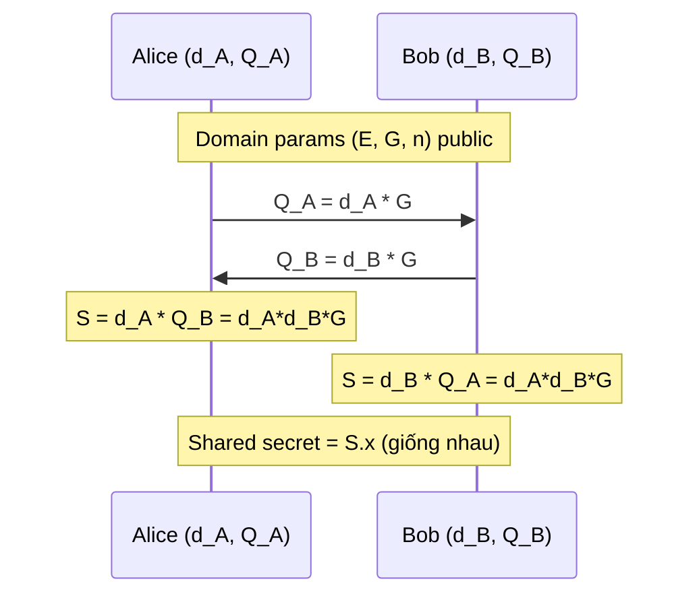

> **Prerequisites**: [[20-ecc-fundamentals|20 — ECC Fundamentals]] (group law, ECDLP, scalar multiplication), [[18-diffie-hellman-dlp|18 — Diffie-Hellman & DLP]] (key exchange concept), [[04-modular-arithmetic|04]] (modular inverse)    
> **Lesson type**: Scheme + Protocol
>
> **Notation**:
> | Ký hiệu | Ý nghĩa |
> |---------|---------|
> | $E(\mathbb{F}_p)$ | Elliptic curve group (từ L16) |
> | $G$ | Generator point, bậc nguyên tố $n$ |
> | $n$ | Order của $G$ |
> | $d$ | Private key: scalar $d \in [1, n-1]$ |
> | $Q$ | Public key: $Q = d \cdot G$ |
> | $k$ | Nonce — ephemeral scalar trong signing |
> | $H$ | Hash function (SHA-256, SHA-512, ...) |
> | $z$ | Hash của message: $z = H(m) \bmod n$ |
> | $(r, s)$ | ECDSA signature pair |

---

## 1. Motivation

Sau khi xây dựng nền tảng ECC, ta đã biết nhóm điểm $E(\mathbb{F}_p)$ và bài toán ECDLP. Bây giờ ta xây dựng hai ứng dụng cốt lõi nhất:

1. **ECDH** — giao thức trao đổi khóa: Alice và Bob thỏa thuận shared secret qua kênh công khai.
2. **ECDSA** — chữ ký số: Alice ký message chứng minh sở hữu private key, không tiết lộ private key.

Cả hai thay thế DH và RSA tương ứng với key nhỏ hơn nhiều. ECDSA là scheme phía sau Bitcoin, Ethereum, TLS certificates, SSH — và có **điểm chết cực kỳ phổ biến trong CTF**: nonce reuse.

---

## 2. Phần I — ECDH: Key Exchange

### 2.1. Giao thức ECDH

> [!note] Protocol 17.1 — ECDH Key Exchange
> **Setting**: Domain parameters $(p, a, b, G, n, h)$ là public.
>
> **$\mathsf{KeyGen}()$** (mỗi party thực hiện độc lập):
> - Chọn $d \stackrel{R}{\leftarrow} [1, n-1]$ (private key)
> - Tính $Q = d \cdot G$ (public key, gửi cho bên kia)
>
> **$\mathsf{SharedSecret}(d_{\text{self}},\; Q_{\text{other}})$**:
> - Tính $S = d_{\text{self}} \cdot Q_{\text{other}}$
> - Output: $S.x$ (x-coordinate của $S$)
>
> **Session key**: $K = \mathsf{KDF}(S.x)$ (thường dùng HKDF hoặc SHA-256)

![[assets/img-04-ecdh-protocol.png]]
*ECDH Protocol Flow: Alice và Bob trao đổi public keys, mỗi bên độc lập tính shared secret.*



### 2.2. Correctness

> [!abstract] Theorem — Correctness của ECDH
> Alice và Bob nhận được cùng shared secret:
>
> $$
> d_A \cdot Q_B = d_A \cdot (d_B \cdot G) = (d_A d_B) \cdot G = d_B \cdot (d_A \cdot G) = d_B \cdot Q_A
> $$

**Proof.** Trực tiếp từ tính associativity và commutativity của scalar multiplication: $(d_A d_B) G = (d_B d_A) G$. $\blacksquare$

Eve nhìn thấy $Q_A = d_A G$ và $Q_B = d_B G$. Để tính $d_A d_B G$, cần phải giải ECDLP (tìm $d_A$ hoặc $d_B$) hoặc giải bài toán **ECDH Problem** — cả hai đều không có thuật toán hiệu quả trên curve được chọn tốt.

### 2.3. Lưu ý quan trọng

> [!warning] ECDH không có Authentication
> ECDH cơ bản không xác thực danh tính. Mallory có thể MITM: intercept $Q_A$, gửi $Q_M$ cho Bob; intercept $Q_B$, gửi $Q_M'$ cho Alice — cả hai nghĩ nói chuyện với nhau nhưng thực ra với Mallory.
>
> **Giải pháp**: Kết hợp ECDH với ECDSA certificates (như TLS) hoặc dùng **ECDHE** (Ephemeral) với server certificate trong TLS 1.3.

> [!tip] Ephemeral vs Static ECDH
> **Static ECDH**: Dùng long-term keypair. Nếu private key bị lộ sau này, attacker decrypt mọi session đã record.
>
> **Ephemeral ECDH (ECDHE)**: Mỗi session tạo keypair mới, xóa sau. Đạt **Perfect Forward Secrecy (PFS)**. TLS 1.3 bắt buộc ECDHE.

### 2.4. X25519 — ECDH trên Curve25519

X25519 là phiên bản ECDH chuẩn hóa trên **Curve25519** (Montgomery curve), mô tả trong RFC 7748. Ưu điểm so với ECDH trên Weierstrass curve:

- **Tốc độ**: Montgomery ladder nhanh hơn và constant-time.
- **Safety**: Tự nhiên resistant to invalid curve attack — mọi input 32-byte đều là valid x-coordinate.
- **Simplicity**: API chỉ làm việc với x-coordinate, tránh nhiều implementation bug.
- **Transparency**: Tham số giải thích công khai (nothing-up-my-sleeve).

```python
from cryptography.hazmat.primitives.asymmetric.x25519 import (
    X25519PrivateKey, X25519PublicKey
)

alice_priv = X25519PrivateKey.generate()
bob_priv   = X25519PrivateKey.generate()

alice_shared = alice_priv.exchange(bob_priv.public_key())
bob_shared   = bob_priv.exchange(alice_priv.public_key())

assert alice_shared == bob_shared
print(f"Shared secret: {alice_shared.hex()}")
```

---

## 3. Phần II — ECDSA: Digital Signature

### 3.1. Bối cảnh

**ECDSA** là phiên bản ECC của DSA, chuẩn hóa bởi ANSI X9.62 (1998) và FIPS 186. Hiện diện trong Bitcoin, Ethereum, TLS certificates, SSH, Android, iOS, và phần lớn hạ tầng PKI hiện đại.

Security notion: **EUF-CMA** (Existential Unforgeability under Chosen Message Attack) — adversary không thể forge signature mới dù có signing oracle.

### 3.2. ECDSA Scheme

> [!note] Scheme — ECDSA
> **Type**: Digital Signature
> **Setting**: Domain parameters $(E, G, n)$; hash $H : \{0,1\}^* \to \mathbb{Z}_n$ (modeled as random oracle)
>
> **$\mathsf{KeyGen}(1^\lambda)$**
> - Chọn $d \stackrel{R}{\leftarrow} [1, n-1]$
> - Output: $\mathsf{sk} = d$, $\;\mathsf{pk} = Q = d \cdot G$
>
> **$\mathsf{Sign}(\mathsf{sk} = d,\; m)$**
> - Tính $z = H(m) \bmod n$
> - Chọn nonce $k \stackrel{R}{\leftarrow} [1, n-1]$ (xem RFC 6979 ở mục 3)
> - Tính $(x_1, y_1) = k \cdot G$; đặt $r = x_1 \bmod n$
> - Nếu $r = 0$: chọn lại $k$
> - Tính $s = k^{-1}(z + r \cdot d) \bmod n$
> - Nếu $s = 0$: chọn lại $k$
> - Output: $\sigma = (r, s)$
>
> **$\mathsf{Verify}(\mathsf{pk} = Q,\; m,\; \sigma = (r,s))$**
> - Kiểm tra $r, s \in [1, n-1]$; nếu không: reject
> - Tính $z = H(m) \bmod n$
> - Tính $w = s^{-1} \bmod n$
> - Tính $u_1 = z \cdot w \bmod n$, $\;u_2 = r \cdot w \bmod n$
> - Tính $(x_1, y_1) = u_1 \cdot G + u_2 \cdot Q$
> - Accept iff $x_1 \equiv r \pmod{n}$

![[assets/img-05-ecdsa.png]]
*ECDSA Sign và Verify: luồng tính toán chi tiết, công thức, và nguy hiểm của nonce reuse.*

### 3.3. Correctness

> [!abstract] Theorem — Correctness của ECDSA
> Với mọi $(d, Q)$ hợp lệ và message $m$ bất kỳ:
>
> $$
> \mathsf{Verify}(Q,\; m,\; \mathsf{Sign}(d, m)) = 1
> $$

**Proof.** Gọi $\sigma = (r, s)$ được tạo bởi $\mathsf{Sign}(d, m)$ với nonce $k$, nên $r = (kG).x \bmod n$ và $s = k^{-1}(z + rd) \bmod n$.

Trong $\mathsf{Verify}$, tính $w = s^{-1} \bmod n$, $u_1 = zw$, $u_2 = rw$. Khi đó:

$$
u_1 G + u_2 Q \;=\; zwG + rwdG \;=\; w(z + rd)G \;=\; \frac{z+rd}{s} \cdot G
$$

Thay $s^{-1} = k(z+rd)^{-1}$:

$$
= \frac{z+rd}{k^{-1}(z+rd)} \cdot G = k \cdot G
$$

Vậy $(x_1, y_1) = kG$, tức $x_1 \equiv r \pmod{n}$. $\blacksquare$

### 3.4. Security

> [!abstract] Theorem — EUF-CMA Security (ROM)
> Nếu ECDLP trong $E(\mathbb{F}_p)$ là $(t, \varepsilon)$-hard, thì ECDSA đạt EUF-CMA trong Random Oracle Model.

**Proof sketch.** Một forger PPT $\mathcal{A}$ tạo $(m^*, r^*, s^*)$ valid không qua signing oracle. Bằng Forking Lemma (Bellare & Neven 2006): chạy $\mathcal{A}$ hai lần với cùng random tape nhưng khác hash challenge tại cùng query $\to$ thu được hai equations tuyến tính trong $d$ $\to$ giải ra $d$ $\to$ mâu thuẫn với ECDLP assumption. *(Chứng minh đầy đủ trong Boneh & Shoup Ch. 21.)* $\square$

---

## 4. Phần III — Nonce k: Điểm Chết của ECDSA

Đây là phần quan trọng nhất của bài, và là dạng CTF phổ biến nhất.

### 4.1. Toán học của nonce reuse

Từ công thức signing $s = k^{-1}(z + rd) \bmod n$: nếu $k$ biết trước, giải ngay được $d$:

$$
d = r^{-1}(sk - z) \bmod n
$$

Nhưng nguy hiểm hơn: nếu cùng $k$ ký hai message khác nhau $m_1 \ne m_2$:

> [!danger] Attack — ECDSA Nonce Reuse: Private Key Recovery
> Attacker có hai signatures $(r, s_1)$ trên $m_1$ và $(r, s_2)$ trên $m_2$ với cùng nonce $k$ (nhận biết qua $r_1 = r_2$):
>
> $$
> s_1 = k^{-1}(z_1 + rd) \pmod{n}
> $$
>
> $$
> s_2 = k^{-1}(z_2 + rd) \pmod{n}
> $$
>
> Trừ hai phương trình:
>
> $$
> s_1 - s_2 \equiv k^{-1}(z_1 - z_2) \pmod{n}
> $$
>
> Suy ra:
>
> $$
> k = (z_1 - z_2)(s_1 - s_2)^{-1} \bmod n
> $$
>
> Sau đó recover private key:
>
> $$
> d = r^{-1}(s_1 k - z_1) \bmod n
> $$
>
> **Kết quả**: Private key $d$ bị recover hoàn toàn chỉ từ **hai signature** và message tương ứng.

**Các vụ real-world nổi tiếng**:

- **Sony PS3 (2010)**: Engineering team dùng $k$ cố định (không đổi) cho mọi game firmware. Các game signed với cùng $k$ $\to$ private key recovered $\to$ toàn bộ hệ thống bảo mật bị phá vỡ. Cho phép homebrew và piracy.
- **Android Bitcoin wallets (2013)**: Java `SecureRandom` bị seeded sai trên một số Android device $\to$ $k$ bị reuse $\to$ hàng trăm ví Bitcoin bị hack.
- **PlayStation Network**: Tương tự Sony PS3 case.

> [!tip] Nhận diện nonce reuse trong CTF
> Thu thập nhiều signatures $(r_i, s_i, z_i)$. Kiểm tra: có $r_i = r_j$ với $i \ne j$ không? Cùng $r$ nghĩa là cùng $k$ (vì $r = (kG).x$).

### 4.2. RFC 6979 — Deterministic Nonce

RFC 6979 (Thomas Pornin, 2013) giải quyết bằng cách **tính $k$ deterministically** từ private key và message:

> [!note] RFC 6979 — Deterministic Nonce Generation
> Thay vì $k \stackrel{R}{\leftarrow} [1, n-1]$, tính:
>
> $$
> k = \mathsf{HMAC\text{-}DRBG}(\,d,\;\; H(m)\,)
> $$
>
> Các tính chất:
>
> - **Deterministic**: cùng $(d, m)$ $\to$ cùng $k$ $\to$ cùng signature.
> - **Unpredictable**: $k$ trông như random vì HMAC là PRF; không leak $d$.
> - **Unique per (d, m)**: hai message khác $\to$ hai $H(m)$ khác $\to$ hai $k$ khác.
> - **Compatible**: Verifier không cần biết RFC 6979; signature format y hệt.

**Tại sao an toàn?** $k$ phụ thuộc vào $H(m)$. Hai message khác $\to$ hai $k$ khác $\to$ không bao giờ nonce reuse (với cùng private key).

RFC 6979 hiện được implement trong: Bitcoin's `libsecp256k1`, OpenSSL 3.x+, Python `cryptography` library.

---

## 5. Phần IV — EdDSA: Giải pháp Hoàn chỉnh hơn

### 5.1. Giới thiệu

**EdDSA** (Edwards-curve Digital Signature Algorithm) được thiết kế bởi Bernstein et al. (2011) như alternative đến ECDSA khắc phục nhiều điểm yếu. EdDSA dùng twisted Edwards curve thay vì Weierstrass.

**Ed25519** là phiên bản phổ biến nhất: twisted Edwards curve birationally equivalent Curve25519, dùng SHA-512. Chuẩn hóa trong RFC 8032 (2017) và FIPS 186-5 (2023).

### 5.2. EdDSA Scheme

> [!note] Scheme — Ed25519 (EdDSA on Curve25519)
> **Setting**: Twisted Edwards curve $\mathcal{E}$ trên $\mathbb{F}_{2^{255}-19}$; base point $B$; prime order $\ell$ ($\approx 2^{252}$); hash $H = \mathsf{SHA\text{-}512}$.
>
> **$\mathsf{KeyGen}(1^\lambda)$**
> - Chọn seed $\stackrel{R}{\leftarrow} \{0,1\}^{256}$
> - Tính $(a \;\|\; b) = H(\mathsf{seed})$ — 512 bits, split làm đôi
> - Clamp $a$ (set/clear các bit đặc biệt để tăng tốc và an toàn)
> - $\mathsf{sk} = \mathsf{seed}$; $\;\mathsf{pk} = A = a \cdot B$ (encode 32 bytes)
>
> **$\mathsf{Sign}(\mathsf{sk},\; m)$**
> - Tính $(a \;\|\; b) = H(\mathsf{seed})$
> - Nonce deterministic: $r_0 = H(b \;\|\; m) \bmod \ell$
> - Tính $R = r_0 \cdot B$ (encode 32 bytes)
> - Tính $k = H(R \;\|\; A \;\|\; m) \bmod \ell$
> - Tính $S = (r_0 + k \cdot a) \bmod \ell$
> - Output: $\sigma = (R,\; S)$ (64 bytes)
>
> **$\mathsf{Verify}(\mathsf{pk} = A,\; m,\; \sigma = (R, S))$**
> - Tính $k = H(R \;\|\; A \;\|\; m) \bmod \ell$
> - Accept iff $S \cdot B = R + k \cdot A$

### 5.3. Correctness của EdDSA

> [!abstract] Theorem — Correctness của EdDSA
> Với signing đúng, verification luôn accept.

**Proof.** Từ định nghĩa $S = r_0 + ka \bmod \ell$ và $A = aB$, $R = r_0 B$:

$$
S \cdot B = (r_0 + ka) B = r_0 B + k(aB) = R + k \cdot A \quad \blacksquare
$$

### 5.4. So sánh EdDSA vs ECDSA

> [!info] EdDSA vs ECDSA
>
> | Tính chất | ECDSA | EdDSA (Ed25519) |
> |-----------|-------|-----------------|
> | Nonce generation | Random (nguy hiểm nếu RNG yếu) | Deterministic built-in: $r_0 = H(b \| m)$ |
> | Nonce reuse risk | Catastrophic — leak private key | Không có: nonce khác nhau theo $m$ |
> | Side-channel | Vulnerable (branching theo nonce bits) | Resistant by design — constant time |
> | Signing speed | Nhanh | Nhanh hơn P-256 ECDSA |
> | Verification | Nhanh | Batch verify 64x faster |
> | Public key size | 33 bytes (compressed) | 32 bytes |
> | Signature size | ~71 bytes (DER) | 64 bytes |
> | Standardization | FIPS 186-4, ANSI X9.62 | RFC 8032, FIPS 186-5 |
> | Ứng dụng | Bitcoin, TLS certs, SSH (cũ) | SSH, GnuPG, Signal, iOS/macOS |

> [!tip] Khuyến nghị thực tế
> Project mới: dùng **Ed25519** cho signatures và **X25519** cho key exchange. Nếu cần NIST compliance: dùng P-256 với RFC 6979.

---

## 6. Phần V — So sánh tổng thể

| | RSA-PSS | ECDSA (P-256) | EdDSA (Ed25519) |
|-|---------|---------------|-----------------|
| **Hard problem** | Factoring (IFP) | ECDLP | ECDLP |
| **Key size (128-bit sec)** | 3072 bit | 256 bit | 256 bit |
| **Signature size** | 384 bytes | ~71 bytes | 64 bytes |
| **Nonce** | Không cần | Cần (nguy hiểm) | Deterministic |
| **Signing speed** | Chậm | Nhanh | Nhanh nhất |
| **Verification** | Rất nhanh | Nhanh | Nhanh (batch faster) |

---

## 7. Phần VI — Công cụ & Code

### 7.1. ECDH (Python `cryptography`)

```python
from cryptography.hazmat.primitives.asymmetric.ec import (
    ECDH, SECP256R1, generate_private_key
)
from cryptography.hazmat.primitives import hashes
from cryptography.hazmat.primitives.kdf.hkdf import HKDF

alice_key = generate_private_key(SECP256R1())
bob_key   = generate_private_key(SECP256R1())

shared_alice = alice_key.exchange(ECDH(), bob_key.public_key())
shared_bob   = bob_key.exchange(ECDH(), alice_key.public_key())
assert shared_alice == shared_bob

session_key = HKDF(
    algorithm=hashes.SHA256(), length=32,
    salt=None, info=b'ecdh-session'
).derive(shared_alice)
print(f"Session key: {session_key.hex()}")
```

### 7.2. ECDSA Sign & Verify (Python `cryptography`)

```python
from cryptography.hazmat.primitives.asymmetric.ec import (
    ECDSA, SECP256R1, generate_private_key
)
from cryptography.hazmat.primitives import hashes

private_key = generate_private_key(SECP256R1())
public_key  = private_key.public_key()

message   = b"Hello CTF!"
signature = private_key.sign(message, ECDSA(hashes.SHA256()))

try:
    public_key.verify(signature, message, ECDSA(hashes.SHA256()))
    print("Signature VALID")
except Exception as e:
    print(f"Invalid: {e}")
```

### 7.3. EdDSA — Ed25519 (Python `cryptography`)

```python
from cryptography.hazmat.primitives.asymmetric.ed25519 import Ed25519PrivateKey

private_key = Ed25519PrivateKey.generate()
public_key  = private_key.public_key()

message   = b"Sign me!"
signature = private_key.sign(message)

public_key.verify(signature, message)
print("EdDSA signature VALID — 64 bytes:", signature.hex())
```

### 7.4. SageMath — ECDSA tay (để học và debug CTF)

```python
p = 0xFFFFFFFFFFFFFFFFFFFFFFFFFFFFFFFFFFFFFFFFFFFFFFFFFFFFFFFEFFFFFC2F
a, b = 0, 7
E = EllipticCurve(GF(p), [a, b])
G = E.gen(0)
n = G.order()

d = randint(1, int(n) - 1)
Q = d * G

def ecdsa_sign(d, z, k=None):
    if k is None:
        k = randint(1, int(n) - 1)
    R = k * G
    r = int(R[0]) % int(n)
    s = pow(k, -1, int(n)) * (z + r * d) % int(n)
    return r, s, k

def ecdsa_verify(Q, z, r, s):
    w  = pow(s, -1, int(n))
    u1 = z * w % int(n)
    u2 = r * w % int(n)
    pt = int(u1) * G + int(u2) * Q
    return int(pt[0]) % int(n) == r

import hashlib
z  = int(hashlib.sha256(b"hello ctf").hexdigest(), 16)
r, s, k = ecdsa_sign(d, z)
print("Valid:", ecdsa_verify(Q, z, r, s))
```

### 7.5. Nonce Reuse Attack Skeleton

```python
from itertools import combinations

def recover_privkey_nonce_reuse(sigs, n):
    for (r1, s1, z1), (r2, s2, z2) in combinations(sigs, 2):
        if r1 == r2 and s1 != s2:
            k = (z1 - z2) * pow(s1 - s2, -1, n) % n
            d = (s1 * k - z1) * pow(r1, -1, n) % n
            print(f"k  = {hex(k)}")
            print(f"d  = {hex(d)}")
            return d
    return None

sigs = [(r1, s1, z1), (r2, s2, z2), (r3, s3, z3)]
d = recover_privkey_nonce_reuse(sigs, n)
```

### 7.6. X25519 (Python)

```python
from cryptography.hazmat.primitives.asymmetric.x25519 import (
    X25519PrivateKey, X25519PublicKey
)

alice_priv = X25519PrivateKey.generate()
bob_priv   = X25519PrivateKey.generate()

alice_shared = alice_priv.exchange(bob_priv.public_key())
bob_shared   = bob_priv.exchange(alice_priv.public_key())
assert alice_shared == bob_shared
print(f"Shared: {alice_shared.hex()}")
```

---

## 8. CTF Relevance

**ECDH trong CTF** (⭐⭐⭐):

- Thường gặp khi server trao đổi public key với client → shared secret → dùng làm AES key.
- Attack vector: server không validate điểm → invalid curve attack.
- Attack vector: weak curve → small order group → Pohlig-Hellman.

**ECDSA trong CTF** (⭐⭐⭐ — phổ biến nhất trong hard CTF):

- **Nonce reuse**: nhiều signatures cùng $r$ → recover $k$ → recover $d$.
- **Biased nonce**: một số bit của $k$ bị leak → HNP → lattice attack.
- **Weak hash**: signature malleability nếu $H$ không collision-resistant.

> [!example] CTF Checklist khi gặp ECDSA
> 1. Thu thập tất cả $(r_i, s_i, z_i)$ từ server.
> 2. Kiểm tra $r_i = r_j$ → nonce reuse attack.
> 3. Kiểm tra $r_i$ có phân phối đều không → nếu lệch → biased nonce (HNP).
> 4. Kiểm tra $n$ factorize được không → Pohlig-Hellman trên DLP.
> 5. Nếu EdDSA: tìm các signature cùng $R$ (cùng nonce?) — ít xảy ra nhưng đã từng gặp.

---

## 9. Summary

**ECDH**:
- Alice: $d_A$, $Q_A = d_A G$; Bob: $d_B$, $Q_B = d_B G$.
- Shared secret: $d_A Q_B = d_B Q_A = d_A d_B G$. Security từ ECDLP.
- ECDH không có authentication → kết hợp certificates trong TLS.
- X25519 (Curve25519) là phiên bản hiện đại, khuyến nghị.

**ECDSA**:
- KeyGen: $d \stackrel{R}{\leftarrow} \mathbb{Z}_n$, $Q = dG$.
- Sign: $r = (kG).x$, $s = k^{-1}(z + rd) \bmod n$.
- Verify: $u_1 G + u_2 Q \stackrel{?}{=} kG$ — kiểm tra x-coordinate.
- **Nonce reuse → recover private key**: $k = (z_1-z_2)(s_1-s_2)^{-1}$, $d = r^{-1}(sk-z)$.
- RFC 6979: $k = \mathsf{HMAC\text{-}DRBG}(d, H(m))$ — deterministic, không reuse.

**EdDSA (Ed25519)**:
- Nonce deterministic built-in: $r_0 = H(b \| m)$.
- Verify: $S \cdot B = R + k \cdot A$.
- Không có nonce reuse risk. Nhanh hơn. Batch verifiable.
- Dùng trong SSH, GnuPG, Signal, iOS/macOS, FIPS 186-5.

---

## 10. References

- Johnson, Menezes & Vanstone — *The ECDSA*, International Journal of Information Security, 2001
- Bernstein et al. — *High-speed high-security signatures* (Ed25519 paper), CHES 2011
- Pornin, T. — RFC 6979: Deterministic Usage of DSA and ECDSA, IETF 2013
- Kleppmann, M. — *Implementing Curve25519/X25519: A Tutorial on ECC* (martin.kleppmann.com)
- Boneh & Shoup — *A Graduate Course in Applied Cryptography*, Ch. 19–21 (toc.cryptobook.us)
- FIPS 186-5 — Digital Signature Standard, NIST 2023
- RFC 8032 — Edwards-Curve Digital Signature Algorithm (EdDSA), IETF 2017
- SafeCurves — safecurves.cr.yp.to
