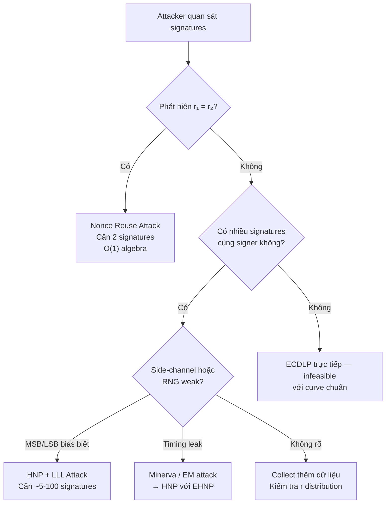

> **Prerequisites**: [[21-ecdh-ecdsa|21. ECDH & ECDSA]], [[26-lattice-attacks-lll|26. Lattice Attacks & LLL]], [[22-ecc-attacks|22. ECC Attacks]]  
> **Lesson type**: Attack / Cryptanalysis
>
> **Notation** (ký hiệu dùng mà không định nghĩa lại trong bài):
> | Ký hiệu | Ý nghĩa |
> |---------|---------|
> | $n$ | Order của generator $G$ trong $E(\mathbb{F}_p)$ |
> | $d$ | ECDSA private key, $d \in [1, n-1]$ |
> | $Q = dG$ | ECDSA public key |
> | $k$ | Nonce (ephemeral scalar), chọn mới mỗi lần sign |
> | $R = kG$ | Ephemeral public key; $r = R.x \bmod n$ |
> | $(r, s)$ | ECDSA signature |
> | $h = H(m)$ | Hash của message, truncated đến $\log_2 n$ bits |
> | $\mathcal{L}$ | Lattice trong bài toán HNP |
> | $\ell$ | Số bits bị leak từ mỗi nonce $k$ |

---

## 1. Tại sao ECDSA đặc biệt dễ bị phá?

ECDSA là signature scheme phổ biến nhất trong blockchain (Bitcoin, Ethereum), TLS, SSH, và hầu hết PKI hiện đại. Nhưng nó có một điểm yếu nghiêm trọng về mặt thiết kế: **security của toàn bộ scheme phụ thuộc hoàn toàn vào chất lượng của một số ngẫu nhiên $k$**, được gọi là **nonce**.

Không như RSA (chỉ cần giữ $d$ bí mật), ECDSA đòi hỏi:
1. $k$ phải **ngẫu nhiên thực sự** (không predictable).
2. $k$ phải **duy nhất** cho mỗi lần ký — tuyệt đối không được tái sử dụng.
3. $k$ phải **đồng đều** trong $[1, n-1]$ — không được có bias.

Nếu vi phạm bất kỳ điều kiện nào, private key $d$ có thể bị recover. Bài này phân tích hai nhóm tấn công chính: **nonce reuse** (vi phạm điều 2) và **nonce bias** (vi phạm điều 3).

---

## 2. Phần I — Nonce Reuse Attack

### 2.1. Toán học đằng sau

Recall: ECDSA sign $(m, d)$ với nonce $k$:

$$
s = k^{-1}(h + r \cdot d) \pmod{n}
$$

trong đó $h = H(m)$, $r = (kG).x \bmod n$. Bây giờ, nếu cùng $k$ được dùng để ký **hai message khác nhau** $m_1, m_2$, ta có hai phương trình:

$$
s_1 = k^{-1}(h_1 + r \cdot d) \pmod{n}
$$

$$
s_2 = k^{-1}(h_2 + r \cdot d) \pmod{n}
$$

Chú ý: cùng $k$ → cùng $r$ (vì $r = (kG).x$). Attacker quan sát $r_1 = r_2$ trong hai signature → biết ngay $k$ đã bị reuse.

![[assets/img-19-nonce-reuse.png]]
*Nonce reuse attack: chỉ cần 2 signatures và algebra đơn giản để recover private key d*

> [!abstract] Theorem — Nonce Reuse → Private Key Recovery
> Nếu ECDSA signer dùng cùng nonce $k$ để ký hai message $m_1 \neq m_2$, cho ra $(r, s_1)$ và $(r, s_2)$, thì từ public information $(r, s_1, s_2, h_1, h_2)$:
>
> $$k = (h_1 - h_2) \cdot (s_1 - s_2)^{-1} \pmod{n}$$
>
> $$d = (s_1 \cdot k - h_1) \cdot r^{-1} \pmod{n}$$

**Proof.** Trừ hai phương trình sign: $s_1 - s_2 \equiv k^{-1}(h_1 - h_2) \pmod{n}$. Suy ra $k = (h_1 - h_2)(s_1 - s_2)^{-1} \bmod n$. Thay $k$ vào phương trình 1: $s_1 k \equiv h_1 + rd \pmod{n}$, suy ra $d = (s_1 k - h_1) r^{-1} \bmod n$. $\blacksquare$

### 2.2. Thực thi trong thực tế

```python
def recover_private_key_nonce_reuse(r, s1, s2, h1, h2, n):
    k = (h1 - h2) * pow(s1 - s2, -1, n) % n
    d = (s1 * k - h1) * pow(r, -1, n) % n
    return k, d

def detect_nonce_reuse(signatures):
    r_values = [r for r, s, h in signatures]
    seen = {}
    for i, r in enumerate(r_values):
        if r in seen:
            j = seen[r]
            print(f"[!] Nonce reuse: sig {j} and sig {i} have same r={r}")
        seen[r] = i
```

> [!example] Real-world case — Sony PlayStation 3 (2010)
> Nhóm fail0verflow phát hiện ECDSA firmware signing của PS3 dùng cùng $k$ cho **mọi firmware** mà Sony phát hành. Khi họ lấy được hai signatures trên hai firmware khác nhau với cùng $r$, họ recover private key của Sony trong vài giây. Điều này cho phép bất kỳ ai ký firmware tùy ý và cài lên PS3.

> [!example] Real-world case — Bitcoin wallet drains (2013)
> Nhóm Heninger et al. (2013) quét Bitcoin blockchain, tìm các transaction có cùng giá trị $r$. Họ tìm thấy hàng trăm private key bị lộ do Android Java `SecureRandom` bug (không đủ entropy). Ước tính khoảng 412 BTC bị rút trái phép.

### 2.3. Biến thể: Nonce có quan hệ tuyến tính

Nếu hai nonces không giống nhau nhưng có quan hệ $k_2 = a \cdot k_1 + b$ với $a, b$ biết, ta vẫn có thể recover $d$ bằng algebra:

$$
s_1 = k_1^{-1}(h_1 + r_1 d), \quad s_2 = (ak_1 + b)^{-1}(h_2 + r_2 d)
$$

Hai phương trình này tạo thành hệ $2 \times 2$ với ẩn $(k_1, d)$, giải được bằng elimination. Đây là lý do **counter-based nonce** (như `k = counter`) cực kỳ nguy hiểm.

---

## 3. Phần II — Nonce Bias Attack và HNP

### 3.1. Nonce bias là gì?

Thay vì reuse nonce, đây là trường hợp nonce $k$ vẫn unique nhưng **không đồng đều**: một vài bit của $k$ luôn có giá trị cố định. Ví dụ:

- **MSB bias**: $k < 2^{256 - \ell}$, tức $\ell$ bits đầu luôn bằng $0$.
- **LSB bias**: $k \equiv 0 \pmod{2^\ell}$, tức $\ell$ bits cuối luôn bằng $0$.
- **Partial leak**: side-channel tiết lộ $\ell$ bits của $k$ tại vị trí bất kỳ.

Dù nhỏ — chỉ cần **4 bits bias** trên 256-bit curve — là đủ để phá toàn bộ scheme với đủ signatures!

> [!warning] Tại sao 4 bits là nguy hiểm?
> Với 256-bit ECDSA và 4-bit bias (khoảng $\ell = 4$), cần khoảng $\lceil 256/4 \rceil + \text{buffer} \approx 70-100$ signatures. Với 8-bit bias, chỉ cần 30-50 signatures. Với bias cố định 80 bits (như YubiKey Infineon bug), chỉ cần **5 signatures**.

### 3.2. Hidden Number Problem (HNP)

Tấn công này đưa ECDSA về bài toán **Hidden Number Problem**, được Boneh và Venkatesan định nghĩa năm 1996.

> [!note] Definition — Hidden Number Problem (HNP)
> **Input**: Số nguyên tố $n$; các cặp $(t_i, u_i) \in \mathbb{Z}_n \times \mathbb{Z}_n$ với $i = 1, \ldots, m$; bound $B$.
>
> **Điều kiện**: Tồn tại **hidden number** $d \in \mathbb{Z}_n$ sao cho với mỗi $i$:
>
> $$|k_i - t_i d - u_i| \leq B \pmod{n}$$
>
> với $k_i$ "nhỏ" (bounded by $B = n/2^\ell$).
>
> **Mục tiêu**: Tìm $d$.

**Kết nối với ECDSA**: Từ phương trình sign $s_i k_i \equiv h_i + r_i d \pmod{n}$, ta viết lại:

$$
k_i \equiv \underbrace{r_i s_i^{-1}}_{t_i} \cdot d + \underbrace{h_i s_i^{-1}}_{u_i} \pmod{n}
$$

Với bias MSB: $k_i < B = n/2^\ell$, tức $k_i$ "nhỏ". Đây chính xác là một instance của HNP!

![[assets/img-19-hnp-lll.png]]
*HNP + LLL: 5 bước từ biased ECDSA signatures → xây lattice → LLL reduction → private key*

### 3.3. Giải HNP bằng Lattice Reduction

**Ý tưởng**: Xây dựng một lattice sao cho vector ngắn nhất tương ứng với solution $(k_1, \ldots, k_m, d, 1)$.

> [!abstract] Theorem — HNP → SVP Reduction (Boneh-Venkatesan 1996)
> Với $m$ instances HNP với bound $B = n/2^\ell$, construct lattice $\mathcal{L}$ với basis matrix:
>
> $$M = \begin{pmatrix} n & 0 & \cdots & 0 & 0 & 0 \\ 0 & n & \cdots & 0 & 0 & 0 \\ \vdots & & \ddots & & & \vdots \\ 0 & \cdots & & n & 0 & 0 \\ t_1 & t_2 & \cdots & t_m & 1/B & 0 \\ u_1 & u_2 & \cdots & u_m & 0 & 1/B \end{pmatrix}$$
>
> Target vector $\mathbf{v} = (k_1, k_2, \ldots, k_m, d/B, 1/B)$ là vector ngắn trong $\mathcal{L}$. LLL tìm vector gần ngắn nhất, recover $d$.

**Proof sketch.** Mỗi $k_i \leq B$, $d/B \leq n/B = 2^\ell$ — tất cả bounded. Vector target có norm $\approx \sqrt{m \cdot B^2} = B\sqrt{m}$. Gaussian heuristic cho shortest vector của $\mathcal{L}$ có norm $\approx (n^m \cdot B^{-2})^{1/(m+2)}$. Khi $m$ đủ lớn, target vector nằm trong tầm với của LLL. $\blacksquare$

### 3.4. Thực thi đầy đủ

```python
from sage.all import *

def hnp_lattice_attack(signatures, n, l):
    m = len(signatures)
    B = n // (2**l)

    ts = [(r * pow(s, -1, n)) % n for r, s, h in signatures]
    us = [(h * pow(s, -1, n)) % n for r, s, h in signatures]

    rows = []
    for i in range(m):
        row = [0] * (m + 2)
        row[i] = n
        rows.append(row)

    last_row = ts + [QQ(1)/B, 0]
    second_last = us + [0, QQ(1)/B]
    rows.append(last_row)
    rows.append(second_last)

    M = Matrix(QQ, rows)
    M_lll = M.LLL()

    for row in M_lll:
        candidate_d = ZZ(row[-2] * B) % n
        if candidate_d != 0:
            Q_check = candidate_d * G
            if Q_check == Q_public:
                return candidate_d

    return None

def ecdsa_sign_biased(d, m, G, n, l):
    """Sign với nonce k bị bias: l MSB = 0"""
    k = randint(1, n // (2**l))
    R = k * G
    r = int(R[0]) % n
    h = int(sha256(m).hexdigest(), 16) % n
    s = pow(k, -1, n) * (h + r*d) % n
    return (r, s, h)
```

> [!example] Ví dụ: Số signatures cần thiết theo bias
> | Curve | Bias (bits) | Signatures cần | Ví dụ thực tế |
> |---|---|---|---|
> | secp256k1 | 4 | ~70-100 | Lý thuyết tối thiểu |
> | secp256k1 | 8 | ~35-50 | Bug thường gặp trong CTF |
> | secp256k1 | 80 | 5 | YubiKey Infineon (2017) |
> | secp256k1 | 256 | 1 | Nonce reuse (k cố định) |

---

## 4. Phần III — Các biến thể và real-world attacks

### 4.1. EHNP (Extended HNP)

Generalization: bits của $k$ bị leak không phải ở MSB/LSB mà ở vị trí **bất kỳ**. Kỹ thuật tương tự nhưng cần nhiều signatures hơn và lattice phức tạp hơn.

> [!info] Minerva Attack (2020)
> Jančár et al. phát hiện rằng nhiều **smartcard crypto libraries** (Infineon, Libgcrypt, OpenSSL) leak **bit-length của nonce $k$** qua timing side-channel (khi tính $kG$, số bước tính phụ thuộc vào số bit của $k$). Ngay cả khi chỉ biết bit-length (không biết bits cụ thể), vẫn đủ để mount HNP-style attack. YubiKey 5 series bị ảnh hưởng.

### 4.2. RFC 6979 — Giải pháp chuẩn

RFC 6979 (T. Pornin, 2013) định nghĩa cách generate nonce $k$ một cách **deterministic nhưng an toàn**:

$$
k = \text{HMAC-DRBG}(d \| H(m))
$$

Tức là $k$ được tính từ private key $d$ và hash của message. Kết quả:
- **Unique per message**: khác message → khác $k$ (với xác suất áp đảo vì hash khác nhau).
- **Không cần random**: không phụ thuộc vào RNG quality.
- **Không bị bias**: HMAC output đồng đều trong $\mathbb{Z}_n$.

EdDSA (Ed25519) dùng ý tưởng tương tự: $k = H(b \| m)$ với $b$ là một phần của private key.

```python
import hmac, hashlib, struct

def rfc6979_nonce(d, h, n):
    """RFC 6979 deterministic nonce generation"""
    n_len = (n.bit_length() + 7) // 8
    d_bytes = d.to_bytes(n_len, 'big')
    h_bytes = h.to_bytes(n_len, 'big')

    V = b'\x01' * 32
    K = b'\x00' * 32

    K = hmac.new(K, V + b'\x00' + d_bytes + h_bytes, hashlib.sha256).digest()
    V = hmac.new(K, V, hashlib.sha256).digest()
    K = hmac.new(K, V + b'\x01' + d_bytes + h_bytes, hashlib.sha256).digest()
    V = hmac.new(K, V, hashlib.sha256).digest()

    while True:
        T = hmac.new(K, V, hashlib.sha256).digest()
        k = int.from_bytes(T, 'big')
        if 1 <= k < n:
            return k
        K = hmac.new(K, V + b'\x00', hashlib.sha256).digest()
        V = hmac.new(K, V, hashlib.sha256).digest()
```

### 4.3. Comparison: ECDSA vs EdDSA

| Tính năng | ECDSA | EdDSA (Ed25519) |
|---|---|---|
| Nonce generation | Random (CSPRNG required) | Deterministic (hash-based) |
| Nonce reuse | Catastrophic — key leak | Impossible by construction |
| Bias risk | Depends on RNG | Không có |
| Signing speed | Trung bình | Nhanh hơn |
| Verification | Chuẩn | Nhanh hơn |
| RFC | FIPS 186-4 | RFC 8032 |
| Dùng trong | Bitcoin, TLS, SSH cũ | Signal, TLS 1.3, SSH mới |

---

## 5. Phần IV — Phân tích theo threat model

### 5.1. Khi nào attacker có thể mount attack?



### 5.2. Tóm tắt điều kiện tấn công

| Attack | Cần gì | Không cần |
|---|---|---|
| Nonce reuse | 2 signatures, $r_1 = r_2$ | Bất kỳ thêm gì |
| Linearly related nonce | 2 signatures, biết relationship $(a, b)$ | Private key |
| HNP (known bias) | $m \approx 256/\ell$ signatures, biết $\ell$ bits của $k$ | Full nonce |
| HNP (timing) | $m$ signatures + timing measurements | RNG source |

---

## 6. CTF Relevance

> [!info] Mức độ xuất hiện
> - ⭐⭐⭐ **Nonce reuse** — cực phổ biến, detection dễ (so sánh r values)
> - ⭐⭐⭐ **HNP + LLL** — phổ biến ở hard CTF, cần implement lattice
> - ⭐⭐ **Related nonce** — xuất hiện khi source code có counter/LCG làm nonce

> [!example] CTF Pattern — Nhận dạng nhanh
> ```python
> sigs = read_signatures()
>
> rs = [r for r,s,h in sigs]
> if len(rs) != len(set(rs)):
>     print("Nonce reuse detected! Run nonce_reuse_attack()")
>
> if all(k_upper_bits_zero(k_estimate) for sigs):
>     print("MSB bias! Run HNP lattice attack.")
>
> if len(sigs) > 50:
>     print("Collect more and try LLL with l=4 bias assumption")
> ```

> [!example] Full CTF Template — Nonce Reuse
> ```python
> from pwn import *
> from hashlib import sha256
> from Crypto.Util.number import inverse
>
> n = 0xFFFFFFFFFFFFFFFFFFFFFFFFFFFFFFFEBAAEDCE6AF48A03BBFD25E8CD0364141
>
> def get_signature(conn, msg):
>     conn.sendlineafter(b"> ", b"sign")
>     conn.sendlineafter(b"msg: ", msg.encode().hex().encode())
>     r = int(conn.recvlineafter(b"r: ").strip(), 16)
>     s = int(conn.recvlineafter(b"s: ").strip(), 16)
>     h = int(sha256(msg.encode()).hexdigest(), 16)
>     return r, s, h
>
> conn = remote("chall.ctf.example", 1337)
>
> sigs = [get_signature(conn, f"message_{i}") for i in range(20)]
>
> rs = {r: (r, s, h) for r, s, h in sigs}
> for r, s, h in sigs:
>     if list(rs.values()).count((r, s, h)) > 1:
>         pass
>
> seen = {}
> for r, s, h in sigs:
>     if r in seen:
>         r2, s2, h2 = seen[r]
>         k = (h - h2) * inverse(s - s2, n) % n
>         d = (s * k - h) * inverse(r, n) % n
>         print(f"Private key: {d}")
>         break
>     seen[r] = (r, s, h)
> ```

---

## 7. Phần V — ECDSA Signature Malleability

### 7.1. Malleability là gì?

ECDSA có một đặc điểm ít được biết đến: **signature không unique**. Nếu $(r, s)$ là signature hợp lệ cho message $m$ với public key $Q$, thì $(r, -s \bmod n)$ **cũng là signature hợp lệ** cho cùng message và public key.

**Tại sao?** Nhìn vào verification equation: $u_1 G + u_2 Q = kG$ với $u_1 = z/s$, $u_2 = r/s$. Khi negating $s$:
- $u_1' = z/(-s) = -u_1$, $u_2' = r/(-s) = -u_2$
- $u_1' G + u_2' Q = -(u_1 G + u_2 Q) = -kG$

Nhưng $(-kG).x = (kG).x$ vì phép negation ECC chỉ đổi dấu y-coordinate! Vì vậy $x_1 \equiv r \pmod n$ vẫn đúng. $\square$

> [!danger] Attack — Signature Malleability
> Cho signature hợp lệ $\sigma = (r, s)$ trên message $m$:
>
> $$\sigma' = (r, n - s) = (r, -s \bmod n)$$
>
> cũng là signature hợp lệ cho **cùng message $m$** và **cùng public key $Q$**, không cần biết private key.

### 7.2. Bitcoin Transaction Malleability (Pre-SegWit)

Bitcoin **TXID (Transaction ID)** được tính là hash của raw transaction — trong đó bao gồm signature. Nếu signature bị "malleated" (flip $s$ → $-s$), TXID thay đổi **dù transaction data và tác dụng kinh tế giống hệt nhau**.

**Attack scenario (MtGox, 2014)**:
1. Alice gửi 1 BTC cho Bob (TXID = T1).
2. Mallory intercept, flip signature: TXID mới T2.
3. T2 được broadcast và mine trước T1.
4. Alice thấy T1 chưa confirm, nghĩ giao dịch failed, gửi lại → double spend confusion.
5. MtGox hệ thống tự động refund dựa trên TXID T1 không tồn tại → mất tiền.

**Fix**: **BIP-66** (2015) enforce DER encoding nghiêm ngặt + **Low-S normalization**: Bitcoin chỉ chấp nhận $s \leq n/2$. Vì một trong $(s, n-s)$ luôn $\leq n/2$, rule này loại bỏ ambiguity.

**SegWit (Segregated Witness, BIP-141, 2017)**: Giải pháp triệt để — tách signature ra khỏi transaction data khi tính TXID. TXID không còn phụ thuộc signature → malleability không còn ảnh hưởng.

```python
# Low-S normalization (Bitcoin standard)
def normalize_signature(r, s, n):
    if s > n // 2:
        s = n - s  # Flip sang low-S
    return r, s

# Kiểm tra signature malleability
def is_malleable(r, s, n):
    return s > n // 2  # True = malleable (high-S)
```

### 7.3. ECDSA vs EdDSA: Không có malleability

EdDSA (Ed25519) **không có malleability** vì:
- Signature là $(R, S)$ với $S \in \mathbb{Z}_\ell$ (scalar, không phải pair)
- Nonce $r_0$ được tính deterministic từ message → không thể flip
- Không có giá trị $-S$ tương đương trong Ed25519

Đây là một trong những lý do EdDSA được ưu tiên trong các hệ thống mới.

---

## 8. Phần VI — Fault Attacks on ECDSA

### 8.1. Fault injection tổng quan

**Fault attacks** inject lỗi vào quá trình tính toán để buộc thiết bị ký với nonce yếu hoặc leak thông tin về private key. Các kỹ thuật inject fault: voltage glitching, clock glitching, laser fault injection, electromagnetic pulse (kết nối với L23 — Side-Channel Attacks).

### 8.2. Skip Attack — Nhảy lệnh kiểm tra nonce

ECDSA chuẩn có kiểm tra: **"Nếu $r = 0$, chọn lại $k$"**. Nếu attacker có thể **bỏ qua lệnh này** (instruction skip), thiết bị có thể ký với $k = 1$.

**Với $k = 1$**: $r = G.x \bmod n$ (giá trị cố định, public!). Từ $s = k^{-1}(z + rd) = z + rd \bmod n$:
$$d = (s - z) \cdot r^{-1} \bmod n$$

Private key leaked ngay lập tức từ **một signature**.

```python
# Nếu r == G.x mod n → khả năng fault attack
G_x_mod_n = int(G[0]) % n  # Giá trị cố định cho mỗi curve

def detect_fault_k1(r, s, z, G_x, n):
    if r == G_x % n:
        d = (s - z) * pow(r, -1, n) % n
        print(f"[!] k=1 fault detected! d = {d}")
        return d
    return None
```

### 8.3. SafeError Attack on Scalar Multiplication

Trong **double-and-add** algorithm, mỗi bit của nonce $k$ quyết định có thực hiện lệnh `add` hay không. Fault injection vào một bước `add` tạo ra "faulty output".

**Pair-wise SafeError**: So sánh output với fault và không fault:
- Fault **không ảnh hưởng** output: bit đó là 0 (add không xảy ra, fault harmless).
- Fault **thay đổi** output: bit đó là 1.

Sau đủ fault queries, toàn bộ nonce $k$ được recover bit-by-bit → private key $d$.

### 8.4. Countermeasures

> [!tip] Chống fault attacks trên ECDSA
> - **Redundant computation**: Tính $(r, s)$ hai lần độc lập, so sánh trước khi output. Fault chỉ ảnh hưởng một lần → mismatch phát hiện được.
> - **Verify trước khi output**: Sau khi tính $(r, s)$, chạy **ECDSA Verify** với chính signature đó. Nếu invalid → discard.
> - **Randomize nonce**: Dùng RFC 6979 với thêm randomness ngoài — `k = HMAC-DRBG(d, H(m), random_aux)`.

---

## 9. Phần VII — Weak Hash Truncation và ECDSA

### 9.1. ECDSA spec và truncation

Theo ECDSA specification (FIPS 186), hash được xử lý như sau:

$$z = \text{leftmost } \min(\lfloor\log_2 n\rfloor + 1,\; |H(m)|) \text{ bits of } H(m)$$

Nếu hash output **ngắn hơn** curve order bit-length: dùng toàn bộ hash (zero-pad bên phải, về mặt số học $z$ nhỏ hơn $n$ nhiều).

### 9.2. Tấn công khi hash quá ngắn

Xét **secp256k1** ($n \approx 2^{256}$) với **SHA-1** (160-bit output):

$$z = H_{\text{SHA-1}}(m) \in [0, 2^{160})$$

Tức là top 96 bits của $z$ (khi xem như 256-bit number) **luôn là 0**. Đây là dạng **MSB-HNP** với $\ell = 96$ bits bias.

Từ HNP lattice theory: với $\ell = 96$ bits bias, chỉ cần **2–3 signatures** để recover $d$ bằng LLL.

> [!abstract] Tính toán độ tệ
> Với SHA-1 + secp256k1:
> - $z < 2^{160}$ trong khi $n \approx 2^{256}$
> - Bound trong HNP: $B = n / 2^{96} \approx 2^{160}$ — bound lớn nghĩa là chỉ cần ít samples hơn
> - Lattice: kết hợp phương trình $k_i \approx s_i^{-1}(z_i + r_i d)$ với $z_i$ nhỏ → basis lattice shrinks

```python
# Simulate weak hash truncation
import hashlib

def z_sha1_secp256k1(message, n):
    """SHA-1 với secp256k1 — z rất nhỏ so với n."""
    h = int(hashlib.sha1(message).hexdigest(), 16)
    return h  # Đây chỉ ~2^160, còn n ~2^256 → top 96 bits của z luôn = 0
```

### 9.3. Bài học thực tế

> [!warning] Luôn dùng hash phù hợp với curve
> - **secp256k1, P-256**: Dùng SHA-256 (256-bit ≈ 256-bit order). Không dùng SHA-1 hay MD5.
> - **P-384**: Dùng SHA-384 hoặc SHA-512.
> - **Ed25519**: Cố định SHA-512 trong spec — không cần quan tâm.
>
> Hash quá ngắn → $z$ có nhiều MSBs = 0 → tạo thêm HNP bias → tấn công dễ hơn nhiều.

---

## 10. Tài liệu tham khảo

- Boneh & Venkatesan — *Hardness of Computing the Most Significant Bits of Secret Keys in DH and Related Schemes*, CRYPTO 1996
- Howgrave-Graham & Smart — *Lattice Attacks on Digital Signature Schemes*, 2001
- Breitner & Heninger — *Biased Nonce Sense: Lattice Attacks against Weak ECDSA Signatures in Cryptocurrencies*, FC 2019 (https://eprint.iacr.org/2019/023.pdf)
- Pornin, T. — *Deterministic Usage of the Digital Signature Algorithm (DSA) and Elliptic Curve Digital Signature Algorithm (ECDSA)*, RFC 6979, 2013
- Jančár et al. — *Minerva: The Curse of ECDSA Nonces*, CHES 2020
- Trail of Bits — *ECDSA: Handle with Care*: https://blog.trailofbits.com/2020/06/11/ecdsa-handle-with-care/
- Boneh & Shoup — *A Graduate Course in Applied Cryptography*, Ch. 19
- daedalus/BreakingECDSAwithLLL — code demo: https://github.com/daedalus/BreakingECDSAwithLLL
- CryptoHack — ECDSA challenges: https://cryptohack.org/challenges/elliptic/
