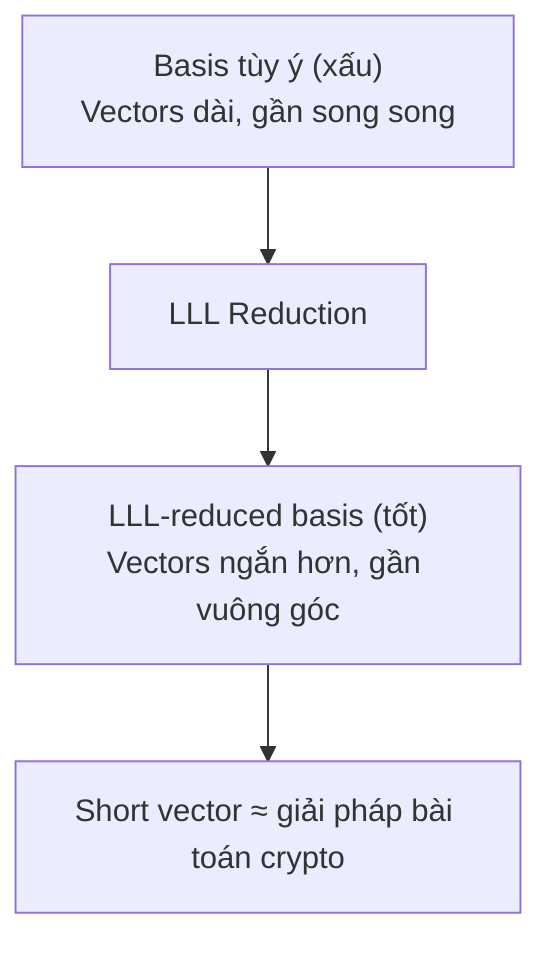

> **Prerequisites**: [[04-modular-arithmetic|04. Modular Arithmetic]], [[15-rsa-fundamentals|15. RSA Fundamentals]], [[23-ecdsa-attacks|23. ECDSA Attacks]]  
> **Lesson type**: Attack / Mathematical Component
>
> **Notation** (ký hiệu dùng mà không định nghĩa trong bài này):
> | Ký hiệu | Ý nghĩa |
> |---------|---------|
> | $\mathbb{Z}$ | Tập số nguyên |
> | $\mathbb{R}^n$ | Không gian vector thực $n$ chiều |
> | $\mathbf{b}_1, \ldots, \mathbf{b}_n$ | Basis vectors của lattice |
> | $\det(L)$ | Determinant của lattice $L$ |
> | $\lambda_1(L)$ | Shortest vector length (minimum successive minima) |
> | $\|\mathbf{v}\|$ | Euclidean norm của vector $\mathbf{v}$ |
> | $N$ | RSA modulus |
> | $n$ | ECDSA curve order |
> | $k$ | ECDSA nonce |
> | $d$ | ECDSA private key |

---

## 1. Motivation

Lattice reduction là một trong những kỹ thuật **mạnh nhất và đa dụng nhất** trong cryptanalysis hiện đại. Không giống các attack toán học thuần túy nhắm vào một primitive cụ thể, tư duy lattice cho phép ta **chuyển đổi** rất nhiều loại bài toán crypto — tìm private key RSA, recover nonce ECDSA, break LCG — thành một bài toán hình học chung: tìm vector ngắn trong một mạng điểm.

Thuật toán LLL (Lenstra-Lenstra-Lovász, 1982) là công cụ trung tâm: chạy trong thời gian **đa thức**, luôn trả về kết quả, và trong thực tế (đặc biệt CTF) hầu như luôn tìm đúng vector cần thiết. Biết cách xây lattice đúng là kỹ năng phân biệt người giải được CTF hard với người không giải được.

---

## 2. Phần 1 — Lattice là gì?

### 2.1. Định nghĩa

> [!note] định nghĩa — Lattice
> Cho $n$ vector độc lập tuyến tính $\mathbf{b}_1, \ldots, \mathbf{b}_n \in \mathbb{R}^m$ (với $n \leq m$). **Lattice** $L$ sinh bởi tập basis này là tập hợp tất cả tổ hợp **nguyên**:
>
> $$
> L = \mathcal{L}(\mathbf{b}_1, \ldots, \mathbf{b}_n) = \left\{ \sum_{i=1}^{n} c_i \mathbf{b}_i \;\middle|\; c_i \in \mathbb{Z} \right\}
> $$
>
> - **Dimension**: $n$ (số basis vectors)
> - **Ambient space**: $\mathbb{R}^m$
> - **Determinant**: $\det(L) = \sqrt{\det(\mathbf{B} \mathbf{B}^T)}$ với $\mathbf{B}$ là matrix có hàng là basis vectors. Nếu $n = m$: $\det(L) = |\det(\mathbf{B})|$

Intuition đơn giản: lattice là tập điểm trong không gian được sắp xếp theo pattern lặp đi lặp lại, giống như mạng tinh thể. Điểm quan trọng: **cùng một lattice có vô số basis khác nhau** — LLL tìm basis "đẹp" (nearly orthogonal) từ basis xấu tuỳ ý.

### 2.2. Basis tốt và basis xấu



Ví dụ trực quan: basis $\{(1, 0), (0, 1)\}$ và $\{(1000001, 1000000), (1000000, 999999)\}$ sinh cùng một lattice (lattice các điểm nguyên $\mathbb{Z}^2$), nhưng basis thứ hai rất "xấu" — trông như là chúng không liên quan đến $\mathbb{Z}^2$ chút nào.

### 2.3. Hai bài toán nền tảng

> [!note] Bài toán — SVP và CVP
> **SVP (Shortest Vector Problem)**: Cho lattice $L$, tìm vector $\mathbf{v} \in L \setminus \{0\}$ sao cho $\|\mathbf{v}\|$ nhỏ nhất.  
> **CVP (Closest Vector Problem)**: Cho lattice $L$ và target vector $\mathbf{t} \in \mathbb{R}^m$, tìm $\mathbf{v} \in L$ sao cho $\|\mathbf{v} - \mathbf{t}\|$ nhỏ nhất.  
> Cả hai đều **NP-hard** trong trường hợp tổng quát (với factor xấp xỉ tùy ý). LLL giải **xấp xỉ** SVP với approximation factor $2^{(n-1)/4}$ trong thời gian đa thức.

### 2.4. Gaussian Heuristic — ước lượng độ dài vector ngắn nhất

> [!abstract] Ước lượng — Gaussian Heuristic
> Với lattice $L$ ngẫu nhiên chiều $n$, độ dài vector ngắn nhất xấp xỉ:
>
> $$
> \lambda_1(L) \approx \sqrt{\frac{n}{2\pi e}} \cdot \det(L)^{1/n}
> $$

Đây là ước lượng thực hành: nếu LLL tìm được vector ngắn hơn Gaussian heuristic đáng kể, nhiều khả năng đó là vector "ẩn" chứa thông tin bí mật.

---

## 3. Phần 2 — Thuật toán LLL

### 3.1. Gram-Schmidt và LLL condition

Trước LLL, ta cần hiểu **Gram-Schmidt orthogonalization**: từ basis $\{\mathbf{b}_i\}$, tính basis trực giao $\{\mathbf{b}_i^*\}$ (không nhất thiết là nguyên):

$$
\mathbf{b}_i^* = \mathbf{b}_i - \sum_{j < i} \mu_{ij} \mathbf{b}_j^*, \quad \text{với } \mu_{ij} = \frac{\langle \mathbf{b}_i, \mathbf{b}_j^* \rangle}{\langle \mathbf{b}_j^*, \mathbf{b}_j^* \rangle}
$$

> [!note] định nghĩa — LLL-reduced Basis
> Basis $\{\mathbf{b}_1, \ldots, \mathbf{b}_n\}$ là **LLL-reduced** với tham số $\delta \in (1/4, 1)$ (thường $\delta = 3/4$) nếu:
>
> **(1) Size-reduced**: $|\mu_{ij}| \leq 1/2$ với mọi $i > j$  
> **(2) Lovász condition**: $\delta \|\mathbf{b}_{k-1}^*\|^2 \leq \|\mathbf{b}_k^* + \mu_{k,k-1} \mathbf{b}_{k-1}^*\|^2$ với mọi $k$

### 3.2. Thuật toán LLL (phác thảo)

```
Input:  Basis B = [b_1, ..., b_n] (rows of a matrix)
Output: LLL-reduced basis B'

1. Compute Gram-Schmidt: b_i* và μ_ij
2. k = 2
3. Lặp:
   a. Size-reduce: với j = k-1 xuống 1:
      b_k ← b_k - round(μ_{k,j}) × b_j
      Cập nhật lại Gram-Schmidt
   b. Kiểm tra Lovász condition tại k:
      Nếu ĐÚNG: k ← k + 1 (tiến)
      Nếu SAI:  swap(b_{k-1}, b_k); k ← max(k-1, 2) (lùi)
4. Dừng khi k > n
```

> [!abstract] Định lý — Độ phức tạp và chất lượng LLL
> Với basis nguyên chiều $n$, LLL chạy trong thời gian **đa thức** $O(n^4 \log B)$ (với $B$ là giới hạn norm của basis). Vector đầu tiên trong LLL-reduced basis thỏa:
>
> $$
> \|\mathbf{b}_1\| \leq 2^{(n-1)/4} \cdot \lambda_1(L)
> $$

**Proof sketch.** Mỗi swap trong LLL giảm $\det$ của phần basis hiện tại đi ít nhất $\sqrt{\delta}$ factor. Tổng số swap bị chặn bởi $O(n^2 \log B)$ bởi vì $\det$ không thể giảm vô hạn trong $\mathbb{Z}$. Bound chất lượng suy ra từ Hermite's theorem áp dụng trên LLL-reduced basis. $\blacksquare$

> [!tip] LLL trong SageMath
> LLL được implement sẵn, cực kỳ dễ dùng:
> ```python
> M = matrix(ZZ, [[...], [...], ...])   # Basis là hàng của matrix
> M_lll = M.LLL()                        # LLL-reduced basis
> shortest = M_lll[0]                    # Vector ngắn nhất (hàng đầu)
> ```

---

## 4. Phần 3 — Coppersmith's Method

### 4.1. Bài toán: tìm small roots của polynomial modular

> [!note] Bài toán 22.6 — Modular Small Root Problem
> Cho $f(x) \in \mathbb{Z}[x]$ bậc $d$ và modulus $N$. Tìm $x_0 \in \mathbb{Z}$ sao cho:
> - $f(x_0) \equiv 0 \pmod{N}$
> - $|x_0| \leq X$ (nghiệm "nhỏ")

Bài toán này **dễ** khi biết factorization của $N$, nhưng **khó** (trong trường hợp tổng quát) khi không biết. Coppersmith phát hiện rằng nếu nghiệm đủ nhỏ, LLL có thể tìm ra.

### 4.2. Howgrave-Graham Lemma — nền tảng kỹ thuật

> [!abstract] Lemma 22.7 — Howgrave-Graham (1997)
> Cho $h(x) \in \mathbb{Z}[x]$ bậc $d$ và $X > 0$. Nếu:
>
> 1. $h(x_0) \equiv 0 \pmod{N^m}$ với $|x_0| \leq X$
> 2. $\|h(xX)\| < \frac{N^m}{\sqrt{d+1}}$ (norm của coefficient vector)
>
> Thì $h(x_0) = 0$ trong $\mathbb{Z}$ (nghiệm thực sự, không chỉ modular).

**Proof sketch.** Nếu $h(x_0) \equiv 0 \pmod{N^m}$, thì $|h(x_0)|$ là bội của $N^m$. Nhưng nếu $h$ có hệ số nhỏ và $|x_0| \leq X$, thì $|h(x_0)| \leq \sqrt{d+1} \cdot \|h(xX)\| < N^m$. Bội khác 0 nhỏ nhất của $N^m$ là chính $N^m$ > upper bound, nên $h(x_0) = 0$. $\blacksquare$

### 4.3. Coppersmith's Theorem

> [!abstract] Định lý — Coppersmith (1996)
> Cho $f(x) \in \mathbb{Z}[x]$ đơn thức bậc $d$, modulus $N$ (không cần biết factorization). Nếu tồn tại $x_0 \in \mathbb{Z}$ với $f(x_0) \equiv 0 \pmod{N}$ và:
>
> $$
> |x_0| \leq X = N^{1/d - \varepsilon} \quad (\text{với } \varepsilon > 0 \text{ nhỏ})
> $$
>
> Thì có thể tìm $x_0$ trong thời gian đa thức theo $\log N$ và $1/\varepsilon$.

**Cơ chế (phác thảo):** Xây dựng một tập polynomial $g_{i,j}(x) = N^{m-j} x^i f(x)^j$ có cùng nghiệm $x_0$ modulo $N^m$. Các polynomial này tạo thành một lattice khi coi coefficient vector của $g_{i,j}(xX)$ là các hàng của matrix. LLL tìm vector ngắn → polynomial mới $h(x)$ thoả Howgrave-Graham Lemma → giải $h(x_0) = 0$ trong $\mathbb{Z}$ bằng các method thông thường.

### 4.4. Ứng dụng 1 — RSA Stereotyped Message

> [!example] Ví dụ — RSA với Partial Plaintext Known
> **Tình huống:** Alice encrypt message $m$ bằng RSA với $e = 3$: $c = m^3 \bmod N$.
> Ta biết $m = m_0 + x_0$ với $m_0$ đã biết (prefix hoặc format cố định) và $x_0$ là phần ẩn nhỏ.  
> **Xây dựng polynomial:** $f(x) = (m_0 + x)^3 - c \pmod{N}$  
> $f(x_0) \equiv 0 \pmod{N}$, và nếu $|x_0| \leq N^{1/3}$, Coppersmith tìm được $x_0$.  
> **Trong thực tế:** nếu biết ít nhất 2/3 message (với $e=3$), phần còn lại recover được.
>
> ```python
> # SageMath — Coppersmith cho RSA stereotyped message
> N = ...   # RSA modulus
> e = 3
> c = ...   # Ciphertext
> m0 = ...  # Known part (prefix)
>
> P.<x> = PolynomialRing(Zmod(N), implementation='NTL')
> f = (m0 + x)^e - c
> roots = f.small_roots(X=2^200, beta=1)
> # X là upper bound của |x0|; beta=1 vì N=N (không biết factor)
> print(m0 + roots[0])   # Full plaintext
> ```

### 4.5. Ứng dụng 2 — RSA với Known High Bits of p

> [!example] Ví dụ — Partial Prime Factor Recovery
> **Tình huống:** Biết $N = pq$ và xấp xỉ tốt $\tilde{p}$ của $p$: $|p - \tilde{p}| < N^{1/4}$.  
> **Xây dựng polynomial:** $f(x) = \tilde{p} + x$ → tìm $x_0 = p - \tilde{p}$ thoả $f(x_0) \equiv 0 \pmod{p}$ với $p | N$.  
> Coppersmith với $\beta = 0.5$ (vì ta muốn nghiệm modulo $p \approx N^{0.5}$) và $X = N^{0.25}$.
>
> ```python
> P.<x> = PolynomialRing(Zmod(N))
> f = p_high + x   # p_high là high bits đã biết
> roots = f.small_roots(X=2^512, beta=0.5)
> p = p_high + roots[0]
> q = N // p
> ```

---

## 5. Phần 4 — Hidden Number Problem và ECDSA

### 5.1. Hidden Number Problem (HNP)

> [!note] định nghĩa — Hidden Number Problem (Boneh-Venkatesan 1996)
> Cho số nguyên tố $p$ và số ẩn $\alpha \in \mathbb{Z}_p$. Adversary nhận được $\ell$ cặp $(t_i, u_i)$ thoả:  
> $$
> u_i \equiv \alpha \cdot t_i + e_i \pmod{p}, \quad |e_i| < p/2^k
> $$  
> Tìm $\alpha$.  
> **Điều kiện giải được:** cần đủ nhiều samples $\ell$ và $k$ đủ lớn (bias đủ mạnh).

HNP chính là bài toán "biết nhiều hints tuyến tính, mỗi hint có noise nhỏ, tìm số ẩn" — cấu trúc này xuất hiện tự nhiên khi ECDSA nonce bị bias.

### 5.2. Kết nối ECDSA nonce bias → HNP → Lattice

Trong ECDSA ký message $m$ với nonce $k$:

$$
s = k^{-1}(h + r \cdot d) \bmod n
$$

Rearrange: $k = s^{-1} h + s^{-1} r \cdot d \pmod{n}$

Đặt $t_i = s_i^{-1} r_i \bmod n$ và $u_i = -s_i^{-1} h_i \bmod n$, thì:

$$
d \cdot t_i - u_i \equiv k_i \pmod{n}
$$

Nếu nonce $k_i$ bị bias (ví dụ: $\ell$ bit cao nhất bằng 0, tức $k_i < 2^{b-\ell}$ với $b = \log_2 n$), thì $|k_i|$ nhỏ → **đây chính là HNP** với $\alpha = d$, $e_i = k_i$ nhỏ.

### 5.3. Xây dựng Lattice cho HNP

Với $\ell$ signatures $(r_i, s_i, h_i)$ và giả sử $k_i < B$ (bias), ta xây dựng matrix:

$$
M = \begin{pmatrix}
n & 0 & \cdots & 0 & 0 \\
0 & n & \cdots & 0 & 0 \\
\vdots & & \ddots & & \vdots \\
0 & 0 & \cdots & n & 0 \\
t_1 & t_2 & \cdots & t_\ell & 1/n \\
u_1 & u_2 & \cdots & u_\ell & 0
\end{pmatrix}
$$

(Với $t_i, u_i$ như trên, và scaling phù hợp để lattice cân bằng.)

Lattice này chứa vector "ẩn" liên quan đến $(k_1, k_2, \ldots, k_\ell, d)$. LLL hoặc BKZ tìm vector ngắn → extract $d$.

> [!tip] Thực hành CTF: HNP với SageMath
> ```python
> from sage.all import *
>
> def hnp_attack(signatures, n, B):
>     """
>     signatures: list of (t_i, u_i) pairs
>     n: curve order
>     B: upper bound on nonce k_i
>     """
>     ell = len(signatures)
>
>     # Build lattice matrix
>     M = matrix(ZZ, ell + 2, ell + 2)
>     for i in range(ell):
>         M[i, i] = n
>         M[ell, i] = signatures[i][0]    # t_i
>         M[ell+1, i] = signatures[i][1]  # u_i
>
>     M[ell, ell] = B
>     M[ell+1, ell+1] = 0  # last row scaling
>
>     # LLL reduction
>     M_lll = M.LLL()
>
>     # Extract d from short vectors
>     for row in M_lll:
>         candidate_d = (row[ell] * pow(B, -1, n)) % n
>         # Verify against known public key
>         # ...
>     return None
> ```

> [!warning] Cần bao nhiêu signatures?
> Trong lý thuyết, cần $O(n/k^2)$ signatures với $k$-bit bias. Trong thực tế CTF:
> - 4-bit bias (top 4 bits = 0): cần ~50-100 signatures
> - 8-bit bias: cần ~10-20 signatures
> - Nonce reuse (k bằng nhau): chỉ cần 2 signatures.
---

## 6. Phần 5 — Kannan Embedding và CVP

### 6.1. Chuyển CVP về SVP

Nhiều bài toán crypto là CVP: ta có target $\mathbf{t}$ và cần tìm điểm lattice gần nhất. **Kannan embedding** chuyển CVP thành SVP bằng cách mở rộng lattice:

> [!note] Kĩ thuật — Kannan Embedding
> Cho lattice $L$ và target $\mathbf{t}$. Xây dựng lattice mới $L'$ với basis bao gồm basis của $L$ và thêm vector $(\mathbf{t}, c)$ (với $c$ là scaling constant):  
> $$
> M' = \begin{pmatrix} \mathbf{B} & \mathbf{0} \\ \mathbf{t} & c \end{pmatrix}
> $$  
> Vector ngắn nhất của $L'$ (tìm bằng LLL) sẽ là $(\mathbf{v} - \mathbf{t}, -c)$ với $\mathbf{v}$ là điểm lattice gần $\mathbf{t}$ nhất.

### 6.2. Babai's Nearest Plane Algorithm (CVP approximation)

> [!note] Thuật toán — Babai's Nearest Plane
> ```
> Input: LLL-reduced basis B, target vector t
> 1. b = t
> 2. Với i = n xuống 1:
>    ci = round(<b, bi*> / <bi*, bi*>)
>    b = b - ci × bi
> 3. Trả về t - b (điểm lattice xấp xỉ gần nhất)
> ```
>
> **Complexity:** $O(n^2)$ sau khi đã LLL-reduce. Không đảm bảo optimal nhưng rất tốt trong thực tế.

---

## 7. Phần 6 — Knapsack Attack (ứng dụng ngoài RSA/ECDSA)

> [!example] Ví dụ — Phá Merkle-Hellman Knapsack (1984)
> Cryptosystem Merkle-Hellman (1978) dùng superincreasing sequence làm private key, biến đổi thành "random" knapsack sequence làm public key.
>
> **Công thức:** $c = \sum_{i=1}^n m_i \cdot a_i \pmod{m}$ (với $a_i$ là public key, $m_i \in \{0,1\}$)
>
> **Adi Shamir phá năm 1984 bằng LLL:** Xây lattice từ $\{a_1, \ldots, a_n, c\}$, LLL tìm $\{m_i\}$ thoả $\sum m_i a_i = c$. Đây là ví dụ kinh điển nhất về LLL trong cryptanalysis — chứng tỏ không thể dùng knapsack hard để xây PKE.
>
> ```python
> # Sketch: Shamir attack on Merkle-Hellman
> n = len(public_key)
> M = identity_matrix(ZZ, n + 1)
> for i in range(n):
>     M[i, n] = public_key[i]
> M[n, n] = -ciphertext
> # Scale last column for balance
> M_lll = M.LLL()
> # Row with entries in {0, 1} and last entry 0 is solution
> ```

---

## 8. Phần 7 — BKZ và Lattice Reduction Mạnh Hơn

> [!info] Beyond LLL: BKZ Algorithm
> **BKZ (Block Korkine-Zolotarev)** — cải tiến của LLL bằng cách áp dụng SVP oracle trên các block con kích thước $\beta$:
>
> - BKZ-$\beta$: mỗi block $\beta$ vectors được reduce bằng SVP oracle
> - $\beta = 2$: tương đương LLL
> - $\beta$ lớn hơn → output tốt hơn nhưng chậm hơn theo cấp số nhân
> - Trong CTF: thường $\beta = 20$ đến $\beta = 40$ là đủ
>
> ```python
> M_bkz = M.BKZ(block_size=30)   # BKZ-30
> ```
>
> **Root Hermite Factor** $\delta$: đo chất lượng reduction. LLL: $\delta \approx 1.022$. BKZ-20: $\delta \approx 1.013$.

---

## 9. CTF Relevance

⭐⭐⭐ **Kỹ năng differentiator trong hard CTF**

### 9.1. Nhận diện attack

> [!tip] Checklist khi gặp bài CTF liên quan Lattice
> ```
> RSA với thông tin partial?
>   → e = 3, biết prefix/suffix message  → Coppersmith stereotyped message
>   → Biết ~N^0.25 high/low bits của p   → Coppersmith partial factor
>   → d < N^0.25                          → Wiener (xem L13)
>   → d < N^0.292                         → Boneh-Durfee (Coppersmith bivariate)
>
> ECDSA/DSA nhiều signatures?
>   → Biết một phần nonce k               → HNP + LLL
>   → Nonce sử dụng ít bit ngẫu nhiên    → HNP + LLL
>   → Thấy output PRNG bị bias            → LCG attack (xem L21) hoặc HNP
>
> Knapsack / subset sum?
>   → Density < 0.9408                    → LLL attack trực tiếp
> ```

### 9.2. Pattern phổ biến trong CTF

> [!example] Pattern 22.15 — "Small Secret" RSA
> Source code CTF điển hình:
> ```python
> p = getPrime(512)
> q = getPrime(512)
> N = p * q
> # "Efficient" nhưng sai lầm:
> d = getPrime(256)        # d nhỏ!
> e = pow(d, -1, phi)
> print(N, e, c)
> ```
> → **Boneh-Durfee attack**: $d < N^{0.292}$ → dùng lattice bivariate.

> [!example] Pattern 22.16 — Biased ECDSA Nonces
> ```python
> import os
> def gen_nonce():
>     # Bug: first byte always 0x00
>     return int.from_bytes(b'\x00' + os.urandom(31), 'big')
> ```
> → Top 8 bits = 0 → 8-bit bias → HNP attack với ~20 signatures.

---

## 10. Phần 8 — AGCD: Approximate Greatest Common Divisor

### 10.1. Bài toán AGCD

> [!note] định nghĩa — Bài toán AGCD (Approximate GCD)
> **Input**: $m$ số nguyên $x_0, x_1, \ldots, x_{m-1}$ trong đó:
> $$x_i = q_i \cdot p + r_i$$
> với $p$ là **số nguyên tố ẩn** (~$\eta$ bits), $q_i$ là ngẫu nhiên lớn (~$\gamma$ bits), và $r_i$ là **"noise" nhỏ** (~$\rho$ bits).
>
> **Goal**: Tìm $p$ từ các $x_i$.

**Phân biệt với GCD thông thường**: Nếu $r_i = 0$ với mọi $i$, bài toán trở thành tính $\gcd(x_i, x_j)$ — trivially dễ. AGCD khó vì noise $r_i \neq 0$ làm $\gcd$ thực sự bằng 1 (các $x_i$ không chia hết cho nhau theo $p$).

> [!abstract] Độ khó của AGCD
> AGCD với tham số $(\gamma, \eta, \rho)$ được giả sử là **NP-hard** khi $\gamma, \eta, \rho$ đủ lớn và $\rho \ll \eta$. Bài toán này là nền tảng bảo mật cho một số lược đồ FHE.

**Kết nối với LWE**: AGCD là "LWE qua số nguyên":
- LWE: $b_i = \langle \mathbf{a}_i, \mathbf{s} \rangle + e_i \pmod{q}$ (modular, vector)
- AGCD: $x_i = q_i \cdot p + r_i$ (integer, scalar)

Cả hai đều dạng "secret + small noise"; cả hai đều hard khi noise đủ lớn.

---

### 10.2. AGCD và DGHV FHE

AGCD là nền tảng của **DGHV scheme** (van Dijk, Gentry, Halevi, Vaikuntanathan, 2010) — lược đồ FHE đầu tiên có thể hiểu được mà không cần nền tảng lattice sâu.

> [!note] Scheme — DGHV (FHE over the Integers)
> **KeyGen**:
> - Secret key: một số nguyên tố lẻ $p$ có $\eta$ bits.
> - Public key: $\{x_0, x_1, \ldots, x_{\tau}\}$ với $x_i = q_i p + 2r_i$ ($q_i$ ngẫu nhiên lớn, $r_i$ nhỏ lẻ).
> - Thêm $x_0 = q_0 p + r_0$ được chọn để $x_0$ lớn nhất và lẻ (làm modulus).
>
> **Encrypt** (bit $m \in \{0,1\}$):
> - Chọn tập con ngẫu nhiên $S \subseteq \{1, \ldots, \tau\}$ và số nhỏ $r$.
> - $c = m + 2r + 2\sum_{i \in S} x_i \pmod{x_0}$
>
> **Decrypt** (có $p$):
> - $m = (c \bmod p) \bmod 2$
>
> **Tính đúng**: $c \bmod p = m + 2r + 2\sum r_i \cdot [\text{nhỏ}] \pmod{p}$ → $\bmod 2$ cho lại $m$.

> [!tip] Tại sao DGHV quan trọng?
> DGHV là **nguyên mẫu khái niệm** của FHE. Mặc dù không hiệu quả về thực tế (key quá lớn), nó minh họa trực quan nhất tại sao FHE khả thi:
> - **Cộng**: $c_1 + c_2 = (m_1 + m_2) + \text{noise}$ — noise cộng thêm.
> - **Nhân**: $c_1 \cdot c_2 = m_1 m_2 + \text{noise lớn hơn}$ — noise tăng, nhưng bootstrapping reset nó.
>
> Các scheme BGV/BFV/CKKS (xem L32) đều kế thừa tư duy này nhưng dùng LWE thay AGCD.

---

### 10.3. Tấn công AGCD bằng Lattice

**Small noise attack**: Nếu noise $\rho$ nhỏ hơn ngưỡng, LLL tìm được $p$.

**Ý tưởng**: Xét các số $y_i = x_0 x_i - x_i x_0 = x_0(q_i p + r_i) - x_i(q_0 p + r_0)$... À, thực ra cách đơn giản hơn:

Xây matrix:
$$
M = \begin{pmatrix} 2^{\rho+1} x_1 & x_0 & 0 & \cdots & 0 \\ 2^{\rho+1} x_2 & 0 & x_0 & \cdots & 0 \\ \vdots & \vdots & & \ddots & \vdots \\ 2^{\rho+1} x_m & 0 & 0 & \cdots & x_0 \end{pmatrix}
$$

Short vector của lattice này có dạng $(2^{\rho+1} q_0 r_i - 2^{\rho+1} q_i r_0,\; ...)$ — các thành phần nhỏ. Từ đó recover $p = \gcd(\text{short vector entries}) / 2^{\rho+1}$.

```python
def agcd_attack(xs, rho):
    """
    xs = [x0, x1, ..., xm] là các samples AGCD.
    rho = bit-length của noise ri.
    Trả về secret p nếu thành công.
    """
    m = len(xs) - 1
    x0 = xs[0]

    # Xây lattice (phiên bản đơn giản)
    M = Matrix(ZZ, m + 1, m + 1)
    M[0, 0] = 2^(rho + 1)
    for i in range(1, m + 1):
        M[i, 0] = 2^(rho + 1) * xs[i]
        M[i, i] = x0
    # Thêm x0 vào hàng đầu
    M[0, 0] = 2^(rho + 1) * x0

    L = M.LLL()
    for row in L:
        candidate = gcd(list(row))
        # Kiểm tra xem candidate có phải p không
        if candidate > 1 and all(xi % candidate <= 2^rho for xi in xs):
            return candidate
    return None
```

> [!warning] Điều kiện tấn công thành công
> Attack hoạt động khi: $\rho < \eta/2$ — tức noise phải nhỏ hơn nửa secret. Nếu $\rho \geq \eta/2$, LLL không đủ mạnh và cần BKZ hoặc sieving.

---

### 10.4. So sánh AGCD, LWE, và NTRU

| Bài toán | Domain | Cấu trúc | FHE dựa trên |
|----------|--------|----------|--------------|
| **AGCD** | $\mathbb{Z}$ (integers) | Scalar: $x = qp + r$ | DGHV, BGV (phiên bản integer) |
| **LWE** | $\mathbb{Z}_q$ (modular) | Vector: $b = \langle \mathbf{a}, \mathbf{s} \rangle + e$ | BFV, BGV, CKKS |
| **RLWE** | $R_q = \mathbb{Z}_q[x]/(x^n+1)$ | Polynomial: $b = a \cdot s + e$ | ML-KEM, TFHE |
| **NTRU** | $R = \mathbb{Z}[x]/(x^n-1)$ | Polynomial ratio: $h = g/f$ | NTRU, FN-DSA |

Tất cả đều có dạng chung: **ẩn một secret bằng cách cộng small noise vào một function của secret đó**. Độ khó đến từ việc không thể "trừ đi noise" để recover secret.

---

## 11. Phần 9 — HNP-SUM và Biến thể HNP

### 11.1. HNP nhắc lại và các biến thể

**Standard HNP** (Boneh & Venkatesan, 1996):

> [!note] định nghĩa — Hidden Number Problem (HNP)
> Cho số nguyên tố $n$ và oracle $\mathsf{MSB}_\ell(x)$ trả về $\ell$ bit cao nhất của $x \bmod n$.
> **HNP**: Tìm số ẩn $\alpha \in \mathbb{Z}_n$ từ $m$ cặp $(t_i, u_i)$ sao cho:
> $$\left|\alpha t_i - u_i \bmod n\right| < \frac{n}{2^\ell}$$
> Tức là $u_i \approx \alpha t_i \pmod n$ với lỗi nhỏ hơn $n/2^\ell$.

Từ ECDSA nonce bias (Bài 19) đến HNP: mỗi equation $s_i k_i \equiv z_i + r_i d \pmod n$ với $k_i$ bị bias → rearrange → phương trình HNP với ẩn $d$.

**Các biến thể HNP:**

| Biến thể | Mô tả | Ứng dụng |
|----------|-------|----------|
| **MSB-HNP** | Top $\ell$ bits của $k_i$ biết (= 0) | Nonce với MSB = 0 |
| **LSB-HNP** | Bottom $\ell$ bits của $k_i$ biết | Nonce với LSB = 0 |
| **EHNP** | Extended HNP: bits tại vị trí tùy ý biết | Minerva-style attack (L19) |
| **HNP-SUM** | Small Unknown Multiplier: tìm tᵢ nhỏ thỏa uᵢ ≡ α·tᵢ (mod n) | MEGA attack, short-multiplier recovery |

---

### 11.2. HNP-SUM — Small Unknown Multiplier

> [!note] định nghĩa — HNP với Small Unknown Multiplier (HNP-SUM)
> **Cho**: số nguyên tố $n$, số đã biết $\alpha \in \mathbb{Z}_n^*$, và $m$ giá trị quan sát $u_i$.
>
> **Tìm**: các số nguyên **nhỏ** $t_i$ với $|t_i| < T$ sao cho:
> $$u_i \equiv \alpha \cdot t_i \pmod{n}$$
>
> Đây là biến thể HNP nơi **ẩn là các multiplier $t_i$** (nhỏ), còn $\alpha$ đã biết — ngược với HNP chuẩn (ẩn là $\alpha$, $t_i$ đã biết).

**Tại sao bài toán khó?** Biết $u_i$ và $\alpha$, ta có thể tính $t_i = u_i \cdot \alpha^{-1} \bmod n$ — nhưng kết quả là phần tử ngẫu nhiên trong $\mathbb{Z}_n$, không small. Thông tin "small" không rõ ràng từ giá trị modular, nên cần lattice để khai thác.

**Ứng dụng thực tế**: Ryan & Heninger (2022) dùng HNP-SUM để phá khóa RSA trên MEGA cloud trong **6 queries** (thay vì 512 như các phương pháp trước).

> [!abstract] Giải với 2 samples — Ma trận 2×2 (tương tự AGCD)
> Với $m = 2$: biết $u_1 \equiv \alpha t_1 \pmod n$ và $u_2 \equiv \alpha t_2 \pmod n$.
>
> Xây lattice basis 2×2:
> $$M = \begin{pmatrix} n & 0 \\ u_1 & T \end{pmatrix}$$
>
> Vector $(t_1, -t_2)$ nằm trong lattice vì: $u_1 t_2 - u_2 t_1 \equiv \alpha t_1 t_2 - \alpha t_2 t_1 = 0 \pmod n$.
>
> Nếu $T \approx \sqrt{n}$ (Gaussian heuristic), LLL tìm được $(t_1, t_2)$ trực tiếp.

```python
# HNP-SUM: 2-sample case (SageMath)
# Biết alpha, u1, u2, n; tìm t1, t2 nhỏ với u_i = alpha * t_i mod n

def hnp_sum_2sample(alpha, u1, u2, n, T):
    M = Matrix(ZZ, [
        [n, 0],
        [u1, T]
    ])
    L = M.LLL()
    # Short vector [t1, *] → t1 = L[0][0]; recover t2 = u2 * inverse(alpha, n) có |t2| < T
    for row in L:
        t1 = abs(row[0])
        if t1 < T and (alpha * t1 - u1) % n == 0:
            t2_mod = int(u2 * pow(int(alpha), -1, n) % n)
            t2 = t2_mod if t2_mod < T else t2_mod - n
            if abs(t2) < T:
                return t1, t2
    return None
```

> [!abstract] Giải với $m$ samples — LLL + HNF
> Xây lattice $(m+1) \times (m+1)$ tương tự HNP chuẩn:
>
> $$M = \begin{pmatrix} n & & & \\ u_1 & T & & \\ u_2 & & T & \\ \vdots & & & \ddots \end{pmatrix}$$
>
> **Bước 1 — LLL**: Tìm các short vectors (tập ứng viên cho $(t_1, \ldots, t_m)$).
>
> **Bước 2 — HNF** (Hermite Normal Form): Chuyển lattice về dạng tam giác trên (upper triangular) chuẩn tắc — loại bỏ nghiệm giả, xác định nghiệm nguyên duy nhất thỏa hệ $Ax \equiv b \pmod n$.
>
> Điều kiện heuristic để có nghiệm: $T^{(m+1)/(m-1)} \lesssim n$ (tức là $m$ đủ lớn so với $\log_n T$).

---

### 11.3. Fourier vs Lattice cho HNP

Không phải lúc nào lattice cũng tốt nhất:

| Phương pháp | Phù hợp khi | Độ phức tạp |
|-------------|-------------|-------------|
| **LLL/BKZ lattice** | $\ell \geq 4$ bits bias, ít noise | $O(m^3)$ với matrix size $m$ |
| **Bleichenbacher/Fourier** | $\ell = 1$–$3$ bits, nhiều samples | $O(m \log m)$ + heuristic |
| **4-list sum (Esslinger 2020)** | HNP với scattered bits (EHNP) | Exponential in bits per leak |

**Bleichenbacher's method** (1994, later applied to HNP by De Mulder et al.): thay vì lattice, dùng DFT để tìm $d$ từ nhiều noisy equations. Phù hợp hơn khi bias rất nhỏ (1–2 bits) và có hàng nghìn samples.

> [!tip] Khi nào dùng gì trong CTF?
> - **$\geq 4$ bits bias, $\geq 20$ signatures**: Dùng lattice (code ở L19).
> - **1–3 bits bias, rất nhiều signatures**: Thử Bleichenbacher/Fourier.
> - **Biết $\alpha$, cần tìm multiplier nhỏ**: Thử HNP-SUM (2 sample → 2×2 matrix; nhiều hơn → LLL + HNF).

---

## 12. Tóm tắt

- **Lattice** là tập điểm nguyên: $L = \{\sum c_i \mathbf{b}_i \mid c_i \in \mathbb{Z}\}$. Hai bài toán nền: SVP và CVP.
- **LLL** giải xấp xỉ SVP trong thời gian đa thức; `M.LLL()` trong SageMath.
- **Coppersmith's method** = LLL để tìm small roots của polynomial mod $N$; `f.small_roots()` trong SageMath. Áp dụng khi biết partial RSA plaintext hoặc partial prime.
- **HNP** = hidden number problem; xuất hiện khi ECDSA nonce bị bias. Solve bằng cách xây lattice và chạy LLL/BKZ.
- **Kannan embedding** chuyển CVP về SVP; **Babai's nearest plane** xấp xỉ CVP sau LLL.
- **BKZ** mạnh hơn LLL; dùng khi LLL không đủ.
- Kỹ năng chính: **biết dịch bài toán crypto sang bài toán lattice**, không phải hiểu LLL internals.

---

## 13. Tài liệu tham khảo

- Lenstra, A.K.; Lenstra Jr., H.W.; Lovász, L. — *Factoring polynomials with rational coefficients*, Mathematische Annalen, 1982 (bài báo LLL gốc)
- Coppersmith, D. — *Finding a Small Root of a Univariate Modular Equation*, EUROCRYPT 1996
- Boneh, D.; Venkatesan, R. — *Hardness of Computing the Most Significant Bits of Secret Keys in DH and Related Schemes*, CRYPTO 1996 (bài báo HNP gốc)
- Surin, J.; Cohney, S. — *A Gentle Tutorial for Lattice-Based Cryptanalysis*, eprint.iacr.org/2023/032 (**khuyên đọc — toàn diện nhất**)
- Galbraith, S.D. — *Mathematics of Public Key Cryptography*, Chapter 17-19 (math.auckland.ac.nz/~sgal018/crypto-book)
- Boneh & Shoup — *A Graduate Course in Applied Cryptography*, Ch. 20 (toc.cryptobook.us)
- Shamir, A. — *A Polynomial-Time Algorithm for Breaking the Basic Merkle-Hellman Cryptosystem*, FOCS 1984
- Ryan, K.; Heninger, N. — *The Hidden Number Problem with Small Unknown Multipliers*, IACR ePrint 2022/914 (tấn công MEGA cloud — 6 queries)
- GitHub: mimoo/RSA-and-LLL-attacks (implementations của Coppersmith, Boneh-Durfee)

---

## 14. Diagram Assets

### 14.1. Basis Reduction — LLL Pipeline

![[assets/img-22-01-basis-reduction.png]]
*Từ basis xấu tùy ý, LLL reduction tìm basis tốt (nearly orthogonal). Short vector đầu ra là giải pháp ẩn trong bài toán crypto.*

### 14.2. Coppersmith's Method — Full Pipeline

![[assets/img-22-02-coppersmith-pipeline.png]]
*Pipeline đầy đủ của Coppersmith: từ polynomial f(x) → xây họ gᵢⱼ → lattice → LLL → Howgrave-Graham check → nghiệm x₀. Phần dưới: 3 ứng dụng CTF và HNP pipeline cho ECDSA.*
