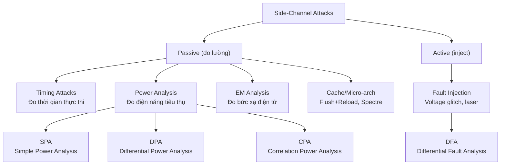
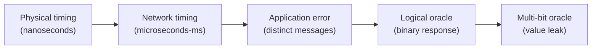

> **Prerequisites**: [[10-block-ciphers-modes|10. Block Ciphers & Modes]], [[15-rsa-fundamentals|15. RSA Fundamentals]], [[20-ecc-fundamentals|20. ECC Fundamentals]]  
> **Lesson type**: Attack  
> **Notation** (ký hiệu dùng mà không định nghĩa trong bài này):
> | Ký hiệu | Ý nghĩa |
> |---------|---------|
> | $k$ | Secret key (hoặc private key) |
> | $d$ | RSA private exponent |
> | $e_i$ | Bit thứ $i$ của exponent |
> | $P_i$ | Power trace (dãy đo lường điện năng theo thời gian) |
> | $\mathsf{HW}(x)$ | Hamming weight của $x$ (số bit 1) |
> | $\mathsf{HD}(a,b)$ | Hamming distance giữa $a$ và $b$: $\mathsf{HW}(a \oplus b)$ |

---

## 1. Motivation

Trong tất cả các lesson trước, ta tấn công **thuật toán** — tìm điểm yếu toán học trong RSA, AES, hoặc protocol. Nhưng có một lớp tấn công hoàn toàn khác: không nhắm vào toán học, mà nhắm vào **implementation vật lý**.

Năm 1996, Paul Kocher công bố một quan sát đơn giản nhưng đột phá: khi một thiết bị (smart card, CPU) thực hiện phép tính mật mã, nó **vô tình rò rỉ thông tin** qua các kênh phụ như thời gian thực thi, mức điện năng tiêu thụ, và bức xạ điện từ. Những tín hiệu này tương quan với dữ liệu bí mật bên trong.

**Side-channel attack** khai thác thông tin này để recover secret key mà không cần break thuật toán về mặt toán học. Trong CTF, side-channel thường xuất hiện dưới dạng **timing oracle** qua server response time hoặc error message — không cần thiết bị phần cứng.

---

## 2. Phần 1 — Taxonomy Tổng quan



> [!note] Nguyên lý chung
> Mọi side-channel attack đều khai thác cùng một sự thật: **physical execution leaks information correlated with secret data**. Dù qua thời gian, điện năng, hay cache — đều là cùng một ý tưởng cốt lõi.

---

## 3. Phần 2 — Timing Attacks

### 3.1. Nguyên lý

Timing attack dựa trên quan sát: nếu thời gian thực thi của một hàm mật mã **phụ thuộc vào giá trị secret**, adversary đo timing nhiều lần có thể suy ra secret.

> [!abstract] Ví dụ — Square-and-Multiply RSA Timing
> Thuật toán **square-and-multiply** tính $m^d \bmod N$:
>
> ```
> result = 1
> Với mỗi bit e_i của d (từ high đến low):
>     result = result^2 mod N       # LUÔN thực hiện
>     Nếu e_i = 1:
>         result = result × m mod N # CHỈ thực hiện khi bit = 1
> ```
>
> **Vấn đề:** Bước nhân thêm tốn thêm ~2-3% thời gian. Với nhiều phép đo, adversary phân biệt được $e_i = 0$ hay $e_i = 1$ → recover từng bit của $d$.

**Paul Kocher (1996)** chứng minh điều này thực tế: chỉ cần ~1000 timing measurements là đủ để recover RSA private key từ thiết bị không có constant-time implementation.

### 3.2. Timing Oracle trong CTF

Trong CTF, timing attack thường xuất hiện dưới dạng **server với response time khác nhau** tùy theo giá trị input:

> [!example] Ví dụ — Timing Oracle (non-physical)
> ```python
> # Vulnerable: early termination khi so sánh sai
> def check_password(guess):
>     for i in range(len(correct)):
>         if guess[i] != correct[i]:
>             return False    # Dừng sớm → timing khác nhau!
>     return True
>
> # Safe: constant-time comparison
> import hmac
> def check_password_safe(guess):
>     return hmac.compare_digest(guess, correct)
> ```
>
> **Attack**: gửi password từng ký tự, đo response time. Ký tự đúng → server check thêm 1 ký tự tiếp → chậm hơn một chút. Recover toàn bộ password bằng $O(|\Sigma| \times |password|)$ queries.

### 3.3. Padding Oracle là Timing Oracle đặc biệt

Padding oracle attack từ [[l08-block-cipher-attacks|L08]] thực chất là **timing/error oracle**: server respond khác nhau (hoặc mất thời gian khác nhau) khi padding valid vs invalid. Không cần đo timing vật lý — error message là đủ.

> [!warning] Lucky13 Attack (2013)
> TLS CBC với MAC-then-Encrypt có một timing side-channel tinh tế:
>
> - Padding valid: compute MAC (tốn $O(\text{padlen})$ time thêm)
> - Padding invalid: return error ngay
>
> Sự chênh lệch rất nhỏ (~microseconds) nhưng đo được từ mạng sau hàng nghìn queries. Al Fardan & Paterson (2013) khai thác thành công để recover plaintext từ TLS 1.2.

### 3.4. Các biến thể Timing Attack nổi tiếng

| Attack | Target | Năm | Cơ chế |
|--------|--------|-----|--------|
| Kocher RSA timing | RSA square-and-multiply | 1996 | Bit 1 → thêm multiply |
| BSAFE timing | RSA với CRT | 2003 | CRT Fault detection |
| Lucky13 | TLS CBC MAC | 2013 | Padding length → MAC time |
| ROBOT | RSA PKCS#1 v1.5 | 2017 | Error timing phân biệt |
| Spectre/Meltdown | CPU cache | 2018 | Speculative execution |

---

## 4. Phần 3 — Power Analysis

### 4.1. Mô hình tiêu thụ điện

Phần cứng kỹ thuật số tiêu thụ điện khác nhau tuỳ theo dữ liệu đang xử lý. Hai mô hình phổ biến nhất:

> [!note] Mô hình — Leakage Models
> **Hamming Weight model**: Năng lượng tỷ lệ với số bit 1 trong giá trị đang xử lý:
>
> $$
> P \propto \mathsf{HW}(\text{data})
> $$
>
> **Hamming Distance model**: Năng lượng tỷ lệ với số bit thay đổi từ trạng thái trước sang trạng thái hiện tại:
>
> $$
> P \propto \mathsf{HD}(\text{data\_prev}, \text{data\_curr}) = \mathsf{HW}(\text{data\_prev} \oplus \text{data\_curr})
> $$

### 4.2. SPA — Simple Power Analysis

**SPA** nhìn trực quan một power trace duy nhất để suy ra thông tin:

> [!example] Ví dụ — SPA trên RSA
> Trong square-and-multiply, mỗi bit của exponent $d$ tương ứng với:
> - Bit 0: chỉ 1 phép tính (square)
> - Bit 1: 2 phép tính (square + multiply)
>
> Trên power trace, **multiply** trông khác **square** về mặt hình dạng và độ cao. Expert nhìn trace biết ngay bit 0 hay 1.
>
> **Countermeasure**: Montgomery ladder — luôn thực hiện cả square và multiply, dù bit là 0 hay 1. Trade kết quả multiply vào biến giả (dummy operation).

### 4.3. DPA — Differential Power Analysis

**DPA** (Kocher, Jaffe, Jun 1999) dùng **thống kê** từ nhiều traces để break key ngay cả khi SPA fail:

> [!note] Thuật toán — DPA trên AES
> **Input**: $N$ power traces $P_1, \ldots, P_N$ (mỗi trace là function theo thời gian), plaintexts $m_1, \ldots, m_N$
>
> **Target**: Byte đầu tiên của key $k[0]$
>
> **Bước 1**: Với mỗi key guess $\hat{k} \in \{0, \ldots, 255\}$:
> - Tính intermediate value: $v_i = \mathsf{Sbox}(m_i[0] \oplus \hat{k})$ cho mỗi $i$
> - Partition traces: $D_0 = \{P_i \mid \mathsf{bit}(v_i) = 0\}$, $D_1 = \{P_i \mid \mathsf{bit}(v_i) = 1\}$
>
> **Bước 2**: Tính differential signal:
>
> $$
> \Delta(t) = \frac{1}{|D_1|}\sum_{i \in D_1} P_i(t) - \frac{1}{|D_0|}\sum_{i \in D_0} P_i(t)
> $$
>
> **Bước 3**: Nếu $\hat{k} = k[0]$ (đúng), $\Delta(t)$ sẽ có **spike rõ rệt** tại thời điểm Sbox được tính. Nếu sai, noise sẽ triệt tiêu về 0.
>
> **Repeat** cho từng byte của key.

> [!abstract] Vì sao DPA hoạt động?
> Khi $\hat{k} = k[0]$ đúng: $v_i$ tương quan với power trace tại đúng thời điểm → averaging reveals signal.
> Khi $\hat{k}$ sai: $v_i$ ngẫu nhiên → signals cancel out → $\Delta(t) \approx 0$.
>
> Đây là ứng dụng của **Signal-to-Noise Ratio (SNR)**: cần khoảng $N \sim 1/\text{SNR}^2$ traces để có statistical significance.

### 4.4. CPA — Correlation Power Analysis

**CPA** (Brier, Clavier, Olivier 2004) là cải tiến của DPA dùng **Pearson correlation coefficient** thay vì mean-difference:

$$
\rho(\hat{k}, t) = \frac{\sum_{i=1}^N (h_i - \bar{h})(P_i(t) - \bar{P}(t))}{\sqrt{\sum (h_i - \bar{h})^2 \cdot \sum (P_i(t) - \bar{P}(t))^2}}
$$

Với $h_i = \mathsf{HW}(\mathsf{Sbox}(m_i \oplus \hat{k}))$ là predicted leakage. Key guess đúng có $|\rho| \approx 1$.

> [!tip] CPA vs DPA
> CPA mạnh hơn DPA vì:
> - Tận dụng continuous Hamming Weight model thay vì binary partition
> - Cần ít traces hơn (~factor 4-8x)
> - Không cần biết chính xác thời điểm leakage (chỉ cần scan hết trace)

---

## 5. Phần 4 — Fault Injection và DFA

### 5.1. Fault Injection là gì?

Thay vì đo passively, **fault injection** là tấn công **chủ động**: attacker gây ra lỗi có kiểm soát trong quá trình tính toán để extract thông tin bí mật.

> [!note] Phương thức Fault Injection
> **Voltage glitch**: giảm/tăng điện áp đột ngột → CPU skip instruction hoặc compute sai  
> **Clock glitch**: thay đổi clock frequency → setup/hold time violation → bit flip  
> **Laser fault injection**: chiếu laser vào chip → flip bit cụ thể trong memory/register  
> **Electromagnetic pulse**: pulse EM → flip bits từ xa  
> **Temperature manipulation**: freeze hoặc overheat → change transistor behavior

### 5.2. DFA — Differential Fault Analysis

> [!abstract] Định lý — DFA trên AES (Boneh, DeMillo, Lipton 1997)
> **Mục tiêu**: Recover $k$ (AES key) từ một correct ciphertext $C$ và một faulty ciphertext $C'$ (với fault tại round 9).
>
> **Cơ chế**: Nếu fault xảy ra tại đầu round 9 của AES-128, faulty state và correct state khác nhau đúng 1 byte. Sự khác biệt này propagate theo cách **deterministic** qua MixColumns và ShiftRows cuối:
>
> $$
> C' \oplus C = f(k_{10}, \delta)
> $$
>
> Với $\delta$ là fault value không biết. Enumerate $\delta \in \{0, \ldots, 255\}$ và $k_{10}[j] \in \{0, \ldots, 255\}$:
> Chỉ một số ít (thường 2-4) cặp $(\delta, k_{10}[j])$ giải thích được difference → intersect với faulty pairs khác → recover $k_{10}$.

> [!example] Ví dụ — DFA trên RSA với CRT
> RSA decrypt thường dùng CRT để tăng tốc:
> ```
> m_p = pow(c, d_p, p)   # d_p = d mod (p-1)
> m_q = pow(c, d_q, q)   # d_q = d mod (q-1)
> m = CRT(m_p, m_q, p, q)
> ```
>
> Nếu fault inject khiến $m_q$ sai thành $m_q'$:
> - Output: $m' = \text{CRT}(m_p, m_q', p, q)$
> - $m' \equiv m \pmod{p}$ (correct) nhưng $m' \not\equiv m \pmod{q}$
>
> Thì: $\gcd(m' - m, N) = p$ → **factor ngay tức khắc**!
>
> Chỉ cần MỘT faulty signature để recover $p$ và $q$.

### 5.3. Fault Attack trong CTF

Trong CTF, fault attack thường xuất hiện dưới dạng **"restart" hoặc "skip comparison"**:

> [!example] Ví dụ — Skip Comparison Fault (CTF)
> ```python
> # Giả lập: server cho phép "inject fault" bằng cách gửi special request
> def verify_pin(pin):
>     hash_stored = sha256(secret_pin)
>     hash_input = sha256(pin)
>     if hash_stored == hash_input:   # Fault: skip này → bypass auth!
>         return "ACCESS GRANTED"
>     return "WRONG PIN"
> ```
>
> Một số CTF có challenge giả lập fault injection qua signal hoặc special input — result là một phép so sánh bị skip, cho phép bypass authentication.

---

## 6. Phần 5 — Cache Attacks và Microarchitectural Attacks

### 6.1. Cache Timing Basics

> [!note] Cache Hierarchy
> CPU hiện đại có 3 cấp cache: L1 (~4 cycles), L2 (~12 cycles), L3 (~40 cycles), RAM (~200 cycles). Cache miss vs cache hit tạo ra timing difference đo được.

**AES Cache Timing Attack (Bernstein 2005)**: Implement AES dùng lookup table (T-table). Bảng T-table access pattern phụ thuộc key và plaintext → cache miss/hit pattern leak information về key.

> [!warning] Attack Mechanics (AES T-table)
> AES encryption access pattern:
> ```
> T0[p[0] ^ k[0]], T1[p[5] ^ k[5]], ...
> ```
> Nếu attacker và victim chia sẻ cache (đám mây, container), attacker có thể:
> 1. Prime cache với data của attacker
> 2. Để victim encrypt → victim cache accesses evict attacker's data
> 3. Attacker probe (measure timing) → biết which cache lines were accessed
> 4. Correlate với possible key bytes

### 6.2. Flush+Reload Attack

> [!note] Kĩ thuật — Flush+Reload (Yarom & Falkner 2014)
> **Setup**: Victim và attacker share memory-mapped library (e.g. OpenSSL).  
> **Bước 1 (Flush)**: Attacker flush target memory line từ cache bằng `clflush` instruction.  
> **Bước 2 (Wait)**: Để victim thực thi → nếu victim access target line → nó được load vào cache.  
> **Bước 3 (Reload)**: Attacker đọc target line, đo thời gian:
> - Fast (~4-12 cycles) → victim đã access → thông tin leak
> - Slow (~200+ cycles) → victim không access

### 6.3. Spectre/Meltdown (2018)

> [!danger] Spectre và Meltdown
> **Meltdown** (Lipp et al. 2018): exploit **out-of-order execution** — CPU thực thi instruction trước khi permission check hoàn thành → transient execution kết hợp cache → read arbitrary kernel memory từ user space.  
> **Spectre** (Kocher et al. 2018): exploit **speculative execution** — CPU "đoán" branch và execute trước khi điều kiện được evaluate → covert channel qua cache.  
> Đây không phải tấn công crypto trực tiếp, nhưng có thể leak RSA/AES keys từ kernel memory hoặc SGX enclaves.  
> **Khả năng**: Đọc ~2KB/s từ kernel memory trong Meltdown; cross-process secret leakage trong Spectre.

---

## 7. Phần 6 — Countermeasures

### 7.1. Constant-Time Programming

> [!tip] Countermeasure — Constant-Time Code
> Mọi branch phụ thuộc secret data phải được loại bỏ:
>
> ```python
> # VULNERABLE: timing leak
> def bad_compare(a, b):
>     for i in range(len(a)):
>         if a[i] != b[i]:
>             return False
>     return True
>
> # SAFE: constant-time
> import hmac
> hmac.compare_digest(a, b)  # Python built-in
>
> # SAFE: bitwise constant-time
> def ct_compare(a, b):
>     diff = 0
>     for x, y in zip(a, b):
>         diff |= x ^ y     # Accumulate, never branch
>     return diff == 0
> ```
>
> Rule: **không bao giờ** dùng `if secret_bit == 1` trong path nhạy cảm. Dùng **bitwise masking** thay thế.

### 7.2. Masking (Blinding)

> [!tip] Countermeasure — Masking / Blinding
> **RSA Blinding (Kocher 1996)**: Trước khi decrypt, nhân ciphertext với random factor:
>
> $$
> c' = c \cdot r^e \bmod N
> $$
>
> Decrypt $m' = (c')^d \bmod N = m \cdot r$. Sau đó remove blinding: $m = m' \cdot r^{-1} \bmod N$.  
> Mỗi lần decrypt dùng $r$ khác nhau → timing không tương quan với $c$ → DPA fail.  
> **Software Masking (AES)**: XOR mọi intermediate value với random mask $s$: $v' = v \oplus s$. Tính toán với $v'$, remove mask ở cuối. Mọi power trace lúc này không tương quan với $v$ (chỉ tương quan với $v \oplus s$, mà $s$ ngẫu nhiên).

### 7.3. Physical Countermeasures

> [!info] Hardware Countermeasures
> - **Noise injection**: thêm random noise vào power supply → giảm SNR cho DPA
> - **Power balancing**: thiết kế mạch luôn consume cùng power dù data nào
> - **Shielding (Faraday cage)**: giảm EM emission → chống EM analysis
> - **Randomized execution order**: shuffle byte processing order
> - **Dual-rail logic**: mỗi bit được biểu diễn bởi 2 wire luôn complement nhau → constant Hamming weight

---

## 8. CTF Relevance

⭐⭐ **Ít gặp dưới dạng physical attack, nhưng timing/error oracle xuất hiện nhiều**

### 8.1. Kết nối với CTF Attacks đã học

> [!tip] Side-Channel trong các CTF attacks quen thuộc
> Nhiều attack đã học thực chất là dạng side-channel:
>
> | Attack từ bài trước | Side-channel element |
> |---------------------|---------------------|
> | Padding oracle (L08) | Error message là timing/error oracle |
> | LSB oracle RSA (L14) | Response (odd/even) là 1-bit oracle |
> | GCM Forbidden Attack (L09) | Authentication failure là oracle |
> | Bleichenbacher (L14) | PKCS#1 error distinction là oracle |
> | Lucky13 | Actual network timing |
>
> **Bài học**: Bất kỳ **response khác nhau** từ server tùy theo secret-dependent computation đều là side-channel!

### 8.2. Pattern phổ biến trong CTF

> [!example] Pattern 23.12 — Timing Oracle Server
> ```python
> # Challenge server
> def handle(ciphertext):
>     decrypted = decrypt(ciphertext)
>     # Timing leak: validate() takes different time depending on content
>     if validate_format(decrypted):
>         return b"Valid"
>     else:
>         return b"Invalid"
>
> # Exploit: binary search based on timing/response difference
> def exploit():
>     results = []
>     for byte_guess in range(256):
>         modified_ct = flip_byte(ciphertext, target_pos, byte_guess)
>         t_start = time.time()
>         response = send(modified_ct)
>         t_elapsed = time.time() - t_start
>         results.append((t_elapsed, byte_guess))
>     return max(results)  # longest time = correct guess (more processing)
> ```

> [!example] Pattern 23.13 — Non-Constant-Time PIN Verification
> ```python
> # Vulnerable server (simulated CTF)
> import time
>
> SECRET = b"FLAG_IS_HERE_1234"
>
> def check(guess):
>     for i in range(len(SECRET)):
>         if i >= len(guess) or guess[i] != SECRET[i]:
>             return False
>         time.sleep(0.01)    # Simulate processing time per char
>     return True
>
> # Attack: per-character timing
> def recover():
>     known = b""
>     charset = b"ABCDEFGHIJKLMNOPQRSTUVWXYZ_0123456789"
>     while True:
>         times = {}
>         for c in charset:
>             t0 = time.time()
>             check(known + bytes([c]))
>             times[c] = time.time() - t0
>         best = max(times, key=times.get)
>         known += bytes([best])
>         print(known)
> ```

---

## 9. Phần 7 — Kết nối với Advanced CTF Challenges

### 9.1. Oracle Attacks và Timing Unification

Mọi oracle attack đều thuộc spectrum side-channel:



Từ physical hardware đến logical CTF challenge — cùng một mô hình tư duy: **secret-dependent behavior → information leak**.

### 9.2. Checklist nhận diện Side-Channel trong CTF

> [!tip] Checklist khi phân tích CTF source code
> ```
> 1. Có hàm decrypt() trả về error message khác nhau không?
>    → Padding oracle, format oracle, MAC oracle
>
> 2. Có comparison với early-exit không?
>    → if a[i] != b[i]: return False → Timing oracle
>
> 3. Có response time khác nhau không?
>    → Đo timing nhiều lần, tìm correlation
>
> 4. Server có exception khác nhau tùy input không?
>    → Exception type là oracle (ValueError vs TypeError)
>
> 5. Có random nonce/IV nhưng encrypt nhiều lần không?
>    → Nonce reuse (xem L06, L09)
>
> 6. Có "fault injection" mechanism (restart/skip) không?
>    → Fault attack, bypass authentication
> ```

---

## 10. Tóm tắt

- **Side-channel attack** khai thác thông tin rò rỉ từ **physical execution** (timing, power, EM) thay vì toán học thuật toán.
- **Timing attack** (Kocher 1996): thời gian phụ thuộc secret → binary search recover key. Phổ biến nhất trong CTF qua error oracle.
- **SPA**: nhìn một trace → suy ra bit. **DPA**: thống kê nhiều traces → recover byte từng byte. **CPA**: correlation coefficient → hiệu quả hơn DPA.
- **DFA**: inject fault → compare correct vs faulty output → recover key. Một fault trong RSA-CRT → GCD ngay $p$.
- **Cache attacks**: Flush+Reload, Spectre/Meltdown — microarchitectural leakage.
- **Countermeasures**: constant-time code, blinding/masking, hardware shielding.
- Trong CTF: padding oracle, LSB oracle, error oracle đều là side-channel. Nhận diện bằng: "server respond khác nhau tùy secret-dependent computation?"

---

## 11. Tài liệu tham khảo

- Kocher, P. — *Timing Attacks on Implementations of Diffie-Hellman, RSA, DSS, and Other Systems*, CRYPTO 1996 (bài báo gốc timing attack)
- Kocher, P.; Jaffe, J.; Jun, B. — *Differential Power Analysis*, CRYPTO 1999 (bài báo gốc DPA)
- Boneh, D.; DeMillo, R.; Lipton, R. — *On the Importance of Checking Cryptographic Protocols for Faults*, EUROCRYPT 1997 (DFA)
- Al Fardan, N.; Paterson, K. — *Lucky Thirteen: Breaking the TLS and DTLS Record Protocols*, IEEE S&P 2013
- Bernstein, D.J. — *Cache-timing attacks on AES*, 2005 (cr.yp.to/antiforgery/cachetiming-20050414.pdf)
- Yarom, Y.; Falkner, K. — *Flush+Reload: a High Resolution, Low Noise, L3 Cache Side-Channel Attack*, USENIX Security 2014
- Lipp, M. et al. — *Meltdown*, USENIX Security 2018 (meltdownattack.com)
- Kocher, P. et al. — *Spectre Attacks: Exploiting Speculative Execution*, IEEE S&P 2019 (spectreattack.com)
- Boneh & Shoup — *A Graduate Course in Applied Cryptography*, Ch. 9 (MAC and authentication) — xem thêm về MAC-then-Encrypt vs Encrypt-then-MAC
- CTF Wiki: ctf-wiki.org/crypto/asymmetric/rsa/rsa_side_channel/

---

## 12. Diagram Assets

### 12.1. Side-Channel Attack Taxonomy

![[assets/img-23-01-sca-taxonomy.png]]
*Hình 23.1 — Phân loại đầy đủ các dạng SCA: Passive (timing, SPA/DPA/CPA, EM, cache) và Active (fault injection, DFA). Bảng so sánh traces cần, thiết bị, và CTF tương đương.*

### 12.2. DPA & CPA — Power Analysis

![[assets/img-23-02-dpa-cpa.png]]
*Hình 23.2 — DPA algorithm 4 bước trên AES. Power trace visualization: spike cao hơn = bit 1 (multiply). Leakage models: Hamming Weight và Hamming Distance. Countermeasures.*

### 12.3. Oracle Spectrum — Từ Physical đến Logical

![[assets/img-23-03-oracle-spectrum.png]]
*Hình 23.3 — Spectrum từ physical hardware timing (ns) đến logical binary oracle. Mọi oracle attack đều cùng nguyên lý: secret-dependent behavior → information leak. CTF checklist và countermeasures.*
