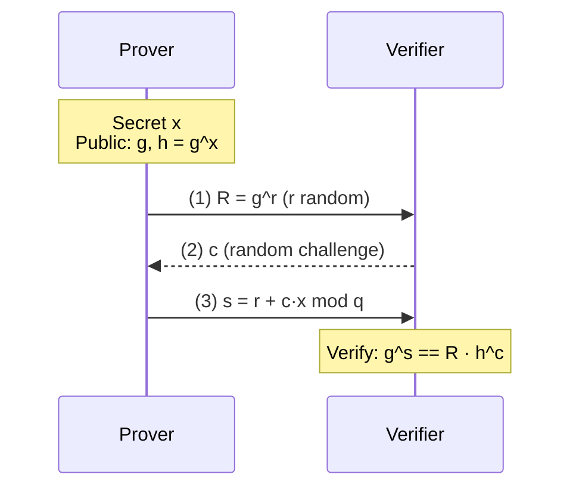
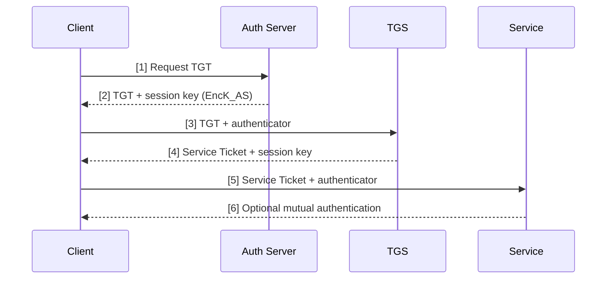
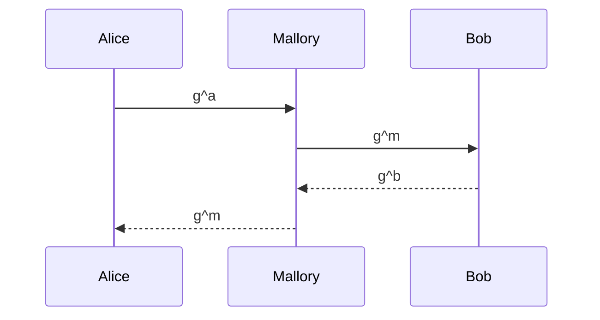

> **Prerequisites**: [[18-diffie-hellman-dlp|18 — Diffie-Hellman & DLP]], [[24-digital-signatures-zoo|24 — Digital Signatures]], [[03-security-definitions|03 — Security Definitions]]  
> **Lesson type**: Scheme (Type 2)
>
> **Notation**:
> | Ký hiệu | Ý nghĩa |
> |---------|---------|
> | $\mathsf{pk}, \mathsf{sk}$ | Public/secret key |
> | $\mathbb{G}, g, q$ | Cyclic group, generator, order |
> | $\mathsf{Commit}, c, s$ | Commitment, challenge, response trong Σ-protocol |
> | $H(\cdot)$ | Hash function (random oracle) |
> | $\mathsf{CA}$ | Certificate Authority |
> | $\mathsf{Cert}$ | X.509 certificate |
> | $\mathsf{SCT}$ | Signed Certificate Timestamp (CT log) |

---

## 1. Motivation

Sau khi đã hiểu các primitive (mã hóa, chữ ký) và giao thức trao đổi khóa cơ bản, bài này đặt câu hỏi thực tế hơn: **Ai nói chuyện với ai? Làm sao biết đúng người? Khóa đến từ đâu và tin được không?**

| Vấn đề | Giải pháp |
|--------|-----------|
| Chứng minh bản thân không tiết lộ secret | Identification schemes (Schnorr, FFS) |
| Phân phối khóa đối xứng không có PKI | KDC (Kerberos), predistribution (Blom) |
| Tin vào public key của người lạ | PKI, X.509 certificates, CA hierarchy |
| Phát hiện cert giả / mis-issued | Certificate Transparency logs |

---

## 2. Identification Schemes

### 2.1. Identification vs. Authentication

**Authentication** (xác thực) là xác nhận danh tính trong bối cảnh cụ thể (đăng nhập hệ thống, TLS handshake). **Identification** (định danh) là chứng minh biết một secret mà không tiết lộ secret — dạng **interactive proof of knowledge (PoK)**.

Ba tính chất cốt lõi của PoK:

| Tính chất | Nghĩa |
|-----------|-------|
| **Completeness** | Prover trung thực luôn thuyết phục được Verifier |
| **Soundness** | Prover giả (không biết secret) chỉ thuyết phục được với xác suất negligible |
| **Zero-knowledge** | Verifier không học được gì ngoài "Prover biết secret" |

![[assets/img-E-01-schnorr-protocol.png]]
*Hình E.1 — Schnorr Identification Protocol: flow 3 bước (commit → challenge → response) và 3 tính chất bảo mật.*

### 2.2. Σ-Protocol — Cấu trúc chung

Hầu hết identification schemes thuộc họ **Σ-protocol** (sigma protocol) gồm 3 bước:



**Tại sao ZK?** Verifier chỉ thấy $(R, c, s)$ với $s = r + cx$. Vì $r$ random, $s$ uniform ngay cả khi biết $c$ và $x$ — transcript có thể mô phỏng mà không cần biết $x$ (simulator ZK).

**Special soundness**: Với 2 transcripts hợp lệ cùng $R$ nhưng khác $c$: $(R, c, s)$ và $(R, c', s')$ → $s - s' = (c - c') x$ → $x = (s-s')/(c-c') \bmod q$. Như vậy extractor có thể rút $x$ từ 2 transcripts → soundness.

---

## 3. Schnorr Identification Protocol (1989)

### 3.1. Scheme

> [!note] Scheme — Schnorr Identification
> **Setting:** Nhóm $\mathbb{G} = \langle g \rangle$ với bậc nguyên tố $q$; public key $h = g^x$ với $x$ bí mật.
>
> **Prover** (biết $x$):
> 1. Chọn $r \xleftarrow{R} \mathbb{Z}_q$; tính $R = g^r$
> 2. Gửi commitment $R$ cho Verifier
> 3. Nhận challenge $c \xleftarrow{R} \mathbb{Z}_q$ từ Verifier
> 4. Tính response $s = r + c \cdot x \bmod q$; gửi $s$
>
> **Verifier** (biết $h$):
> - Kiểm tra: $g^s \stackrel{?}{=} R \cdot h^c$

**Correctness:** $g^s = g^{r+cx} = g^r \cdot (g^x)^c = R \cdot h^c$ ✓

**Security:** Honest-verifier ZK + special soundness → Schnorr là một Σ-protocol hoàn chỉnh. Security dựa trên DLOG assumption.

### 3.2. Fiat-Shamir Transform → Non-interactive

Thay challenge $c$ bằng $c = H(h, R, \text{message})$ (random oracle):

$$\sigma = (R,\; s = r + H(h, R, m) \cdot x)$$

Đây chính là **Schnorr signature** (xem L16). Fiat-Shamir transform biến Σ-protocol thành chữ ký không tương tác.

### 3.3. Security Pitfalls và CTF Patterns

> [!danger] Reuse nonce $r$ → private key leak
> Nếu cùng $r$ dùng cho 2 challenges $c \neq c'$:
> $$s = r + cx, \quad s' = r + c'x \implies x = \frac{s - s'}{c - c'} \bmod q$$
> Hoàn toàn tương tự ECDSA nonce reuse (L19).

> [!warning] Weak challenge entropy
> Nếu $c \in \{0, 1\}$ (1 bit): prover giả chọn $s$ ngẫu nhiên, đặt $R = g^s$ nếu đoán $c=0$, hoặc $R = g^s h^{-1}$ nếu đoán $c=1$ → pass với xác suất $1/2$ mỗi round → cần $k$ rounds để giảm error xuống $2^{-k}$.

```python
# CTF: Detect Schnorr nonce reuse
# Cùng R = g^r xuất hiện với 2 responses (c1,s1), (c2,s2)
# x = (s1 - s2) * modular_inverse(c1 - c2, q) % q
from math import gcd

def recover_schnorr_key(c1, s1, c2, s2, q):
    dc = (c1 - c2) % q
    ds = (s1 - s2) % q
    x = ds * pow(dc, -1, q) % q
    return x
```

---

## 4. Feige–Fiat–Shamir (FFS) Identification (1988)

### 4.1. Nền tảng: Square Root Problem

Dựa trên: biết $n = pq$, cho $y \in \mathbb{Z}_n^*$, **tìm $\sqrt{y} \bmod n$ là hard** (tương đương factoring).

> [!note] Scheme — FFS Identification (single bit variant)
> **Setup:** $n = pq$; secret $s$; public $v = s^{-2} \bmod n$ (hoặc $v = s^2$).
>
> **Round** (lặp $k$ lần để giảm soundness error về $2^{-k}$):
> 1. Prover: chọn $r \xleftarrow{R} \mathbb{Z}_n^*$; gửi $x = r^2 \bmod n$
> 2. Verifier: gửi bit $b \in \{0, 1\}$
> 3. Prover: gửi $y = r \cdot s^b \bmod n$
> 4. Verifier: kiểm tra $y^2 \stackrel{?}{=} x \cdot v^b \bmod n$

**Soundness:** Prover giả không biết $s$: với xác suất $1/2$ đoán đúng $b$ và pre-commit $r$ hoặc $rs$ → pass. Cần $k \geq 20$ rounds cho security $2^{-20}$.

**So với Schnorr:** FFS dựa trên factoring (không cần DLOG group); Schnorr dựa trên DLOG, hiệu quả hơn (1 round với challenge lớn). FFS quan trọng lịch sử nhưng ít dùng thực tế.

---

## 5. Key Distribution — Symmetric Setting

### 5.1. Vấn đề phân phối khóa đối xứng

Để Alice và Bob communicate bí mật cần shared symmetric key. Nếu chưa có PKI/DH, cần một **Key Distribution Center (KDC)** trực tuyến.

### 5.2. Needham-Schroeder Protocol (1978)

> [!note] NS Protocol (simplified)
> - Alice và KDC share $K_{AS}$; Bob và KDC share $K_{BS}$
>
> 1. Alice → KDC: $(A, B, N_A)$ — xin session key với Bob, nonce $N_A$
> 2. KDC → Alice: $\{N_A, B, K_{AB}, \{K_{AB}, A\}_{K_{BS}}\}_{K_{AS}}$
> 3. Alice → Bob: $\{K_{AB}, A\}_{K_{BS}}$ (ticket)
> 4. Bob → Alice: $\{N_B\}_{K_{AB}}$
> 5. Alice → Bob: $\{N_B - 1\}_{K_{AB}}$

> [!danger] Denning-Sacco Attack (1981)
> Nếu $K_{AB}$ cũ bị lộ (compromised sau này), kẻ tấn công replay ticket cũ từ bước 3 → Bob chấp nhận session key cũ → **không có forward secrecy**.
>
> **Fix (Needham-Schroeder-Lowe 1996):** Thêm identity của Bob vào message 2: $\{N_A, B, K_{AB}, \{K_{AB}, A, B\}_{K_{BS}}\}_{K_{AS}}$.

### 5.3. Kerberos (1988, v5 — RFC 4120)

Kerberos là triển khai thực tế của NS protocol với timestamps thay nonces:



**Thành phần:**
- **AS (Authentication Server):** Phát TGT (Ticket Granting Ticket) sau khi xác thực password
- **TGS (Ticket Granting Server):** Phát service ticket từ TGT (không cần password lại)
- **Ticket:** Encrypt bằng key của service — chứa client identity, session key, timestamp, lifetime

> [!warning] Kerberos CTF Patterns
> - **AS-REP Roasting**: User không yêu cầu pre-auth → AS trả TGT encrypt bằng key từ password → crack offline (hashcat)
> - **Kerberoasting**: Request service ticket cho SPN → encrypt bằng service account key → crack offline
> - **Golden Ticket**: Biết `krbtgt` hash (NTLM) → forge TGT tùy ý với PAC bất kỳ → domain admin
> - **Silver Ticket**: Biết service account hash → forge service ticket → access service không qua KDC

---

## 6. Key Predistribution (Không cần KDC online)

### 6.1. Vấn đề và mục tiêu

Trong **sensor networks, IoT, DTN (Delay-Tolerant Networks)**: không có infrastructure — không KDC trực tuyến, bandwidth thấp. Cần phân phối key **offline** trước khi deploy.

**Mục tiêu**: $n$ nodes, mỗi node chứa một phần nhỏ thông tin → bất kỳ 2 nodes nào cũng tính được shared key; node bị compromise chỉ ảnh hưởng tối thiểu.

### 6.2. Blom's Scheme (1984)

> [!note] Scheme — Blom Key Predistribution
> **Setup** (Trust Authority — TA):
> 1. Chọn prime $q > n$; tạo **public matrix** $G$ ($2 \times n$, các cột là public IDs của nodes)
> 2. Tạo **secret symmetric matrix** $D$ ($2 \times 2$, random over $\mathbb{F}_q$)
> 3. Tính $A = D \cdot G$ ($2 \times n$, bí mật); phân phối cho node $i$: cột $i$ của $A$ (= $\mathbf{a}_i$)
>
> **Session key** giữa node $i$ và $j$:
> $$K_{ij} = \mathbf{g}_j^T \cdot \mathbf{a}_i = \mathbf{g}_j^T D \mathbf{g}_i = \mathbf{g}_i^T D^T \mathbf{g}_j = \mathbf{g}_i^T \cdot \mathbf{a}_j = K_{ji} \pmod q$$
> (symmetric vì $D = D^T$)

**Tính chất:**
- Mỗi node chứa $O(\lambda)$ bits (vector $\mathbf{a}_i$)
- Bất kỳ 2 nodes nào tính được cùng $K_{ij}$ độc lập — không cần communication
- **Security**: Nếu $\leq 1$ node bị compromise → matrix $D$ vẫn ẩn (vì $2 \times 2$ có 3 phần tử ẩn, 1 node chỉ cho 2 equations)

> [!warning] Giới hạn của Blom
> Nếu **$k$ nodes** bị compromise (với $k \geq 2$ trong scheme 2×2): có thể reconstruct $D$ → compromise toàn bộ network.
>
> **Generalization:** Blom $(k+1)$-secure: dùng ma trận $(k+1) \times (k+1)$ → chịu đựng đến $k$ compromised nodes; nhưng storage per node tăng lên $O(k \cdot \lambda)$.

### 6.3. Polynomial-Based Predistribution (Blundo et al. 1993)

Variant dùng **symmetric polynomial** $f(x, y) = f(y, x)$ bậc $k$ over $\mathbb{F}_q$:
- Node $i$ nhận $f(i, y)$ (polynomial bậc $k$ theo $y$)
- Shared key: $K_{ij} = f(i, j) = f(j, i)$ (tính local)
- $k$-secure: cần $k+1$ nodes để recover $f$
- Storage: $O(k \log q)$ per node

---

## 7. Public Key Infrastructure (PKI)

### 7.1. Vấn đề cốt lõi: Key Authenticity

DH key exchange (L15) và mã hóa công khai giải quyết confidentiality — nhưng không trả lời: **Public key này có thực sự thuộc về Alice không?**

**Man-in-the-Middle không có PKI:**

Mallory intercept, lập 2 session riêng. Alice và Bob không biết.

**Giải pháp:** Bind public key với identity bằng chữ ký của bên thứ ba tin cậy — **Certificate Authority (CA)**.

### 7.2. X.509 Certificate — Cấu trúc

> [!note] X.509 v3 Certificate Fields (RFC 5280)
> | Field | Nội dung |
> |-------|----------|
> | Version | v3 (0x02) |
> | Serial Number | Unique per CA |
> | Signature Algorithm | e.g., sha256WithRSAEncryption |
> | Issuer | DN của CA ký cert này |
> | Validity | notBefore, notAfter |
> | Subject | DN của entity được chứng nhận |
> | Subject Public Key Info | Algorithm + public key bytes |
> | Extensions | BasicConstraints, SAN, KeyUsage, OCSP URL, CT SCTs... |
> | Signature | CA ký bằng private key trên DER-encoded TBSCertificate |

**Subject Alternative Name (SAN):** Liệt kê các domain/IP được cert bảo vệ. Modern TLS dùng SAN thay CN.

**BasicConstraints — CA flag:** `cA = TRUE` → cert này có thể ký cert khác (intermediate CA). `cA = FALSE` → end-entity cert.

### 7.3. CA Hierarchy và Chain of Trust

![[assets/img-E-02-pki-hierarchy.png]]
*Hình E.2 — PKI trust chain: Root CA (offline) → Intermediate CA → End-entity cert, cùng các cơ chế revocation và Certificate Transparency.*

**Chain validation:**
1. Verify server cert signed by Intermediate CA
2. Verify Intermediate CA cert signed by Root CA
3. Verify Root CA is in trust store (self-signed — trust anchor)
4. Check validity dates, revocation status, key usage

**Tại sao dùng Intermediate CA?** Root CA private key cực kỳ sensitive — giữ **offline** (air-gapped). Intermediate CA online để ký cert hàng ngày; nếu bị compromise → revoke intermediate, không ảnh hưởng root.

### 7.4. Certificate Revocation

> [!note] Ba cơ chế revocation
>
> **CRL (Certificate Revocation List):**
> - CA publish danh sách serial numbers đã revoked, ký bằng CA key
> - Client download định kỳ (giờ/ngày) — stale, to (MB)
> - Vẫn dùng trong enterprise PKI nội bộ
>
> **OCSP (Online Certificate Status Protocol — RFC 6960):**
> - Client query OCSP responder với serial number → "good" / "revoked" / "unknown"
> - Real-time nhưng: thêm latency, privacy leak (CA biết user visit đâu)
> - **Soft-fail**: nhiều browsers bỏ qua OCSP error → revocation vô nghĩa nếu server unreachable
>
> **OCSP Stapling (RFC 6066):**
> - Server tự fetch OCSP response, cache và đính kèm vào TLS handshake
> - Client không cần contact CA riêng → faster, private
> - OCSP response có timestamp và CA signature → client verify offline
> - Must-Staple extension (RFC 7633): server cam kết luôn staple → client từ chối nếu thiếu

### 7.5. Certificate Transparency (CT Logs — RFC 6962)

> [!info] Tại sao cần CT?
> Web PKI có ~100+ trusted CAs (trong browser trust stores). Bất kỳ CA nào cũng có thể issue cert cho **bất kỳ domain** — ngay cả khi domain owner không yêu cầu.
>
> **DigiNotar 2011**: CA bị hack → attacker issue cert cho google.com, used in Iran to MITM 300k+ users trước khi phát hiện.

**CT Architecture:**

```
CA ──→ Submit cert ──→ CT Log (append-only Merkle tree)
                           │
                           ├── Returns SCT (Signed Certificate Timestamp)
                           │   (proof cert was logged)
                           │
Browser ←── cert + SCT ─── TLS Server
   │
   └── Verify SCT signature from known log keys
       + periodic audit: root hash matches public log
```

**SCT (Signed Certificate Timestamp):**
- Chữ ký của CT log trên `(cert, timestamp, log_id)` → chứng minh cert đã được submit
- Browser từ chối cert không có SCT (Chrome: cần $\geq 2$ SCTs từ different logs)

**Auditing:** Monitors kiểm tra CT logs tìm certs không được domain owner authorize → report mis-issuance. Public log → bất kỳ ai cũng monitor.

> [!abstract] Merkle Tree trong CT
> CT log dùng Merkle tree để:
> 1. **Append-only**: chứng minh inclusion (một cert có trong log)
> 2. **Consistency**: chứng minh log chỉ thêm không xóa/sửa entry cũ
>
> Proof size: $O(\log n)$ hashes cho $n$ entries.

---

## 8. Trust Models và Vấn đề Web PKI

### 8.1. Các mô hình trust

| Model | Mô tả | Ví dụ |
|-------|-------|-------|
| **Monopolar** | Một root CA duy nhất | Government PKI, enterprise internal PKI |
| **Oligarchic** | ~100 roots trong browser trust stores | Web PKI (TLS) |
| **Web of Trust** | Peer-signed (không có CA) | PGP/GPG network |
| **TOFU (Trust on First Use)** | Trust key lần đầu gặp | SSH host keys |

**Web PKI vấn đề:** Bất kỳ trong ~100 CAs nào đều có thể issue cert cho mọi domain → weak link problem. Một CA bị compromise → toàn bộ ecosystem vulnerable.

### 8.2. Các cơ chế giảm thiểu

**CAA (Certification Authority Authorization — RFC 8659):**
- DNS record: `example.com. CAA 0 issue "letsencrypt.org"`
- Chỉ định CA nào được phép issue cert cho domain này
- CA phải kiểm tra CAA trước khi issue; bypass CAA = mis-issuance

**HPKP (HTTP Public Key Pinning — RFC 7469):**
- Server publish hash của expected certs qua HTTP header
- Browser cache và từ chối cert không match
- **Deprecated (2018)**: quá rigid, nhiều sites bị locked out khi quên pin backup key

**Certificate Transparency** (mục 6.5) là thay thế chính cho HPKP — phát hiện mis-issuance sau thực tế thay vì ngăn trước.

### 8.3. Misissuance Incidents Nổi bật

| Năm | Incident | Impact |
|-----|----------|--------|
| 2011 | DigiNotar bị hack | Cert giả google.com, CA bị remove khỏi trust stores |
| 2015 | China Internet Network Information Center (CNNIC) | Issue intermediate cert không được phép; Google/Mozilla distrust |
| 2017 | Symantec CA mis-issuance | Chrome announce distrust timeline; Symantec bán CA cho DigiCert |
| 2023 | TrustCor revocation | Liên quan đến government surveillance; CAs removed |

---

## 9. CTF Relevance

### 9.1. Identification Scheme Attacks

```text
Thấy Schnorr/Sigma protocol?
├── Cùng R với 2 transcripts? → Nonce reuse → private key leak
├── Challenge space nhỏ? → Guess attack (k rounds)
├── Verifier không random? → Chosen-challenge attack
└── Fiat-Shamir implementation? → Weak hash → forge signature
```

### 9.2. Certificate / PKI Attacks

```text
Thấy X.509 cert hoặc TLS?
├── Parse cert: openssl x509 -text -noout -in cert.pem
├── Self-signed với cA=TRUE? → Rogue CA cert
├── Null byte trong Subject? → null byte injection (CVE-2009-2408 era)
├── Same public key in 2 certs? → Key reuse → cross-domain impersonation
├── CA private key leaked? → Forge certs cho bất kỳ domain
└── CT log? → Search logs: crt.sh, censys → enumerate subdomains
```

### 9.3. Kerberos CTF Checklist

```text
Active Directory / Kerberos environment?
├── No pre-auth required? → AS-REP Roasting
│   impacket-GetNPUsers domain/ -no-pass -usersfile users.txt
├── SPN accounts exist? → Kerberoasting
│   impacket-GetUserSPNs domain/user:pass -request
├── krbtgt hash known? → Golden Ticket
│   impacket-ticketer -nthash <krbtgt_hash> -domain-sid <SID> -domain domain Administrator
└── Service account hash? → Silver Ticket (no DC contact needed)
```

### 9.4. Key Distribution CTF Patterns

```python
# Blom's scheme: nếu biết 2+ nodes' keying material
# có thể recover ma trận D → compromise toàn network
# Pattern: 2 nodes bị leak → solve linear system over Fq

from sage.all import *

def break_blom(g_i, a_i, g_j, a_j, q):
    """
    g_i, g_j: public column vectors (2x1)
    a_i, a_j: leaked secret vectors (2x1) = D * g_i, D * g_j
    Recover D (2x2 symmetric)
    """
    G = Matrix(GF(q), [g_i, g_j]).T  # 2x2
    A = Matrix(GF(q), [a_i, a_j]).T  # 2x2
    D = A * G.inverse()              # D = A * G^{-1}
    return D
```

---

## 10. Tóm tắt

- **Σ-protocol** (commit → challenge → response): nền tảng của identification và ZK. **Schnorr** = Σ-protocol trên DLOG; **FFS** = Σ-protocol trên factoring.
- **Fiat-Shamir transform**: biến interactive PoK thành non-interactive signature.
- **Nonce reuse trong Schnorr** = private key leak (giống ECDSA).
- **Kerberos** = KDC-based symmetric key distribution; Kerberoasting/AS-REP roasting là attack vectors chính trong CTF AD challenges.
- **Blom's scheme**: $k$-secure predistribution không cần online KDC; $k+1$ compromised nodes phá vỡ scheme.
- **X.509 + CA hierarchy**: trust chain từ root CA qua intermediate CA đến end-entity. Root CA offline; intermediate online.
- **Revocation**: CRL (stale) → OCSP (real-time, soft-fail) → OCSP Stapling (privacy-preserving).
- **Certificate Transparency**: append-only Merkle log; SCT = proof cert đã logged; phát hiện mis-issuance.
- **CAA records**: giới hạn CA nào được issue cert cho domain.

---

## 11. Tài liệu tham khảo

- Schnorr, C.-P. — *Efficient Signature Generation by Smart Cards*, J. Cryptology, 1991
- Feige, U.; Fiat, A.; Shamir, A. — *Zero-Knowledge Proofs of Identity*, J. Cryptology, 1988
- Needham, R.M.; Schroeder, M.D. — *Using Encryption for Authentication in Large Networks*, CACM, 1978
- Blom, R. — *An Optimal Class of Symmetric Key Generation Systems*, EUROCRYPT 1984
- RFC 4120 — The Kerberos Network Authentication Service (V5)
- RFC 5280 — Internet X.509 PKI Certificate and CRL Profile (PKIX)
- RFC 6960 — X.509 Internet PKI Online Certificate Status Protocol (OCSP)
- RFC 6962 — Certificate Transparency
- RFC 8659 — DNS Certification Authority Authorization (CAA) Resource Record
- Boneh & Shoup — *A Graduate Course in Applied Cryptography*, Ch. 13 (toc.cryptobook.us)
- Goldwasser, S.; Micali, S.; Rackoff, C. — *The Knowledge Complexity of Interactive Proof Systems*, SIAM J. Computing, 1989 (định nghĩa ZK gốc)
- Impacket — https://github.com/fortra/impacket (Kerberos attack tools)
- crt.sh — https://crt.sh (CT log search)
