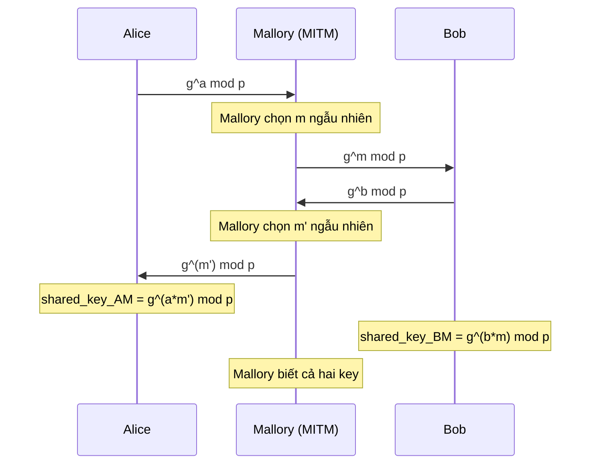

> **Prerequisites**: [[15-rsa-fundamentals|15. RSA]] · [[11-block-cipher-attacks|11. Block Cipher Attacks]] · [[10-block-ciphers-modes|10. Block Ciphers & Modes]] · [[18-diffie-hellman-dlp|18. Diffie-Hellman & DLP]]  
> **Lesson type**: Attack / Cryptanalysis
>
> **Notation** (ký hiệu dùng mà không định nghĩa trong bài này):
> | Ký hiệu | Ý nghĩa |
> |---------|---------|
> | $n,\, e,\, d$ | RSA modulus, public exponent, private exponent |
> | $B = 2^{8(k-2)}$ | PKCS#1 v1.5 lower bound, $k$ = byte-length của $n$ |
> | $g, p$ | Generator và prime modulus trong Diffie-Hellman |
> | $\text{HMAC}(k, m)$ | Keyed hash với key $k$ và message $m$ |

---

## 1. Motivation

Các bài trước tập trung vào tấn công *thuật toán*: exploit toán học của RSA, DH, ECC khi tham số yếu. Tuy nhiên, trong thực tế phần lớn lỗ hổng crypto nằm ở **tầng protocol** — cách các primitive được *kết hợp* và *triển khai* với nhau.

Protocol attack khai thác các sai lầm thiết kế ở tầng cao hơn: thiếu freshness mechanism (replay), thiếu authentication trong key exchange (MITM), cho phép negotiation xuống version yếu hơn (downgrade), hay cho phép attacker kiểm soát tham số nhạy cảm (JWT algorithm confusion). Tất cả những attack này đều đã có exploit thực tế ảnh hưởng đến hàng tỷ connection HTTPS mỗi ngày.

---

## 2. Replay Attack

**Replay attack** xảy ra khi attacker ghi lại một message hợp lệ và gửi lại sau đó để giả mạo hành động của bên gốc. Đây là dạng tấn công đơn giản nhất trong protocol attacks nhưng cực kỳ phổ biến khi protocol thiếu *freshness*.

> [!example] Ví dụ — Replay trên banking API
> Alice gửi request: `{ action: "transfer", to: "Bob", amount: 1000, sig: σ }`  
> Server xác thực chữ ký σ → chấp nhận.  
> Mallory capture request này và gửi lại 10 lần → 10 lần transfer dù Alice chỉ muốn 1 lần.

**Điều kiện để replay attack thành công:**
- Server không track xem message đã được xử lý chưa
- Message không có yếu tố time-bound (timestamp hoặc nonce)

**Các cơ chế chống replay:**
- **Nonce (number used once)**: server tạo nonce ngẫu nhiên, client include vào message và sign. Server track nonce đã dùng.
- **Timestamp với tolerance window**: reject message có `|now - msg.time| > Δ`
- **Sequence number**: mỗi message có số thứ tự tăng dần; server từ chối nếu số cũ hơn expected.

> [!warning] Lưu ý
> Nonce-based freshness chỉ an toàn nếu nonce thực sự ngẫu nhiên và server lưu trữ nonce đã dùng. Nếu server stateless (không nhớ nonce cũ), replay vẫn có thể xảy ra sau một khoảng thời gian.

---

## 3. Man-in-the-Middle (MITM) Attack

MITM là tấn công trong đó Mallory đứng giữa Alice và Bob, intercept và forward (hoặc modify) tất cả message mà hai bên không phát hiện.

### 3.1. MITM trên Unauthenticated Diffie-Hellman

DH key exchange thuần túy hoàn toàn không có authentication — không có gì đảm bảo Alice đang nói chuyện với Bob thật sự.



Sau khi MITM thành công:
- Alice–Mallory session key: $g^{am'} \bmod p$
- Mallory–Bob session key: $g^{bm} \bmod p$
- Mọi message Alice gửi cho "Bob" đều đi qua Mallory, decryptable và re-encryptable.

**Nguyên nhân**: DH chỉ đảm bảo *confidentiality* (forward secrecy), không đảm bảo *authenticity*.

**Fix**: Authenticate DH bằng digital signature hoặc certificate. TLS làm điều này bằng cách kết hợp `(EC)DHE` với chứng chỉ X.509.

![[assets/img-24-01-mitm-dh.png]]
*MITM trên unauthenticated DH (trái) và taxonomy JWT attacks (phải).*

---

## 4. Downgrade Attacks

Downgrade attack ép các bên sử dụng cryptographic primitive yếu hơn mà attacker có thể phá. Attacker không cần phá cipher mạnh — chỉ cần ép dùng cipher yếu.

### 4.1. BEAST (2011) — Browser Exploit Against SSL/TLS

**Điều kiện**: TLS 1.0 dùng CBC với `IV = last ciphertext block` — IV có thể đoán trước.

**Attack intuition**: Trong CBC encrypt, $C_i = E_K(P_i \oplus C_{i-1})$. Nếu attacker biết $C_{i-1}$ (IV block tiếp theo), có thể guess $P_i$ bằng cách craft $P' = P_\text{guess} \oplus C_{i-1} \oplus C_i^{\text{prev}}$ và kiểm tra xem cipher output có match không → chosen-plaintext oracle.

**Tác động**: Attacker có thể recover session cookie từ HTTPS traffic. Demo tại ekoparty 2011 — steal Google session cookie.

**Fix**: TLS 1.1 dùng random IV; upgrade lên TLS 1.2+.

### 4.2. POODLE (2014) — Padding Oracle On Downgraded Legacy Encryption

**Attack chain**: (1) Mallory dùng MITM để trigger SSL handshake failure nhiều lần → (2) Browser downgrade xuống SSLv3 (fallback mechanism) → (3) Khai thác CBC padding oracle trong SSLv3.

**Tại sao SSLv3 dễ bị oracle**: SSLv3 không define giá trị của padding bytes — chỉ check byte cuối cùng. Điều này cho phép 1 trong 256 crafted block có valid padding → oracle xác suất 1/256 mỗi request.

**Độ phức tạp**: Mỗi byte của cookie cần trung bình 256/2 = 128 requests → steal 16-byte cookie trong ~2000 requests.

**Fix**: Disable SSLv3; dùng `TLS_FALLBACK_SCSV` cipher suite để signal downgrade intent và reject.

### 4.3. FREAK (2015) — Factoring RSA Export Keys

**Background**: Trong thập niên 1990, luật Mỹ cấm export cryptography mạnh → TLS phải hỗ trợ "export cipher suites" với RSA 512-bit.

**Attack**: Mallory intercept ClientHello, thay cipher suites list chỉ còn export ciphers → server gửi export certificate (512-bit RSA) → attacker factor 512-bit RSA trong vài giờ với GNFS → break key exchange → decrypt session.

**Tác động**: ~36% HTTPS server còn hỗ trợ export suites (2015). Ảnh hưởng Apple SSL, OpenSSL, Microsoft Schannel.

### 4.4. Logjam (2015) — Weak Diffie-Hellman

Giống FREAK nhưng cho DHE: downgrade DHE xuống 512-bit DH. NSA đã precompute discrete log cho một số group nhỏ (1024-bit) commonly used — 8.4% top HTTPS servers dùng cùng 1024-bit DH group.

> [!warning] Nguyên tắc thiết kế protocol
> Không bao giờ hỗ trợ "export" hay "legacy" cipher suites. Mọi negotiation cần có authenticated transcript để phát hiện downgrade. `TLS_FALLBACK_SCSV` và sau đó là TLS 1.3 (loại bỏ toàn bộ legacy modes) giải quyết vấn đề này.

### 4.5. CRIME & BREACH (2012-2013) — Compression Oracle

**CRIME**: HTTP/TLS cho phép compress request trước khi encrypt. Attacker kiểm soát một phần plaintext (query string) → observe compressed+encrypted length → nếu guess đúng secret byte, compression giảm length → length oracle.

**BREACH**: HTTP-level compression (gzip). Tương tự CRIME nhưng ở application layer, tồn tại ngay cả khi TLS compression disabled.

**Fix**: Disable TLS compression. Rate-limit requests. Thêm random padding.

---

## 5. JWT Attacks

JSON Web Token (JWT) là format phổ biến nhất cho session token trong web API. JWT có cấu trúc:

$$
\text{JWT} = \underbrace{\text{base64url}(header)}_{\text{alg, typ}} \cdot \texttt{.} \cdot \underbrace{\text{base64url}(payload)}_{\text{claims}} \cdot \texttt{.} \cdot \text{signature}
$$

Ví dụ header: `{"alg": "RS256", "typ": "JWT"}` · payload: `{"sub": "user123", "role": "user"}`

> [!warning] Attack — Algorithm Confusion (RS256 → HS256)
> **Điều kiện**: Server dùng asymmetric key (RS256), nhưng verification library có generic `verify(token, key)` method tự detect algorithm từ header.
>
> **Attack steps**:
> 1. Attacker lấy server's RSA public key từ `/jwks.json` hoặc certificate
> 2. Tạo JWT với `"alg": "HS256"` (HMAC-SHA256) trong header
> 3. Sign JWT bằng `HMAC-SHA256` với **RSA public key làm HMAC secret**
> 4. Server gọi `verify(token, publicKey)`: library đọc `alg=HS256` → dùng publicKey làm HMAC key → signature hợp lệ!
>
> **Root cause**: Server muốn dùng RS256 nhưng library không enforce algorithm whitelist. Attacker kiểm soát `alg` field.

> [!warning] Attack — alg=none Bypass
> JWT spec cho phép `"alg": "none"` với empty signature cho "unsecured JWT". Một số library cũ chấp nhận token có `alg=none` mà không cần signature.
>
> ```text
> header = base64url({"alg": "none", "typ": "JWT"})
> payload = base64url({"role": "admin", "sub": "attacker"})
> token   = header + "." + payload + "."   (empty signature)
> ```
>
> **Fix**: Whitelist algorithms: only accept `["RS256", "HS256"]`. Never accept `none`.

> [!warning] Attack — jwk Header Injection
> Một số server accept key từ `jwk` field trong JWT header (để caller cung cấp key của mình). Attacker embed RSA public key tự tạo vào header, ký bằng private key tương ứng → server dùng key attacker cung cấp để verify.
>
> **Fix**: Server phải dùng key từ local trusted store, không từ token header.

> [!warning] Attack — kid (Key ID) Path Traversal
> `kid` field trong header dùng để chọn key. Nếu server dùng `kid` làm filename để đọc key file:
> ```text
> kid: "../../dev/null"  # file rỗng -> HMAC key = empty string
> ```
> Attacker ký JWT với empty key → server verify thành công vì cùng empty key.

![[assets/img-24-02-bleichenbacher.png]]
*Bleichenbacher padding oracle mechanics (trái) và taxonomy downgrade/protocol attacks (phải).*

**Summary các JWT attack và mitigation:**

| Attack | Điều kiện | Mitigation |
|--------|-----------|------------|
| `alg=none` | Library accept unsecured JWT | Whitelist: reject `none` |
| RS256→HS256 confusion | Generic verify, no alg enforcement | Hardcode expected algorithm |
| Weak HS256 secret | Secret dễ đoán/brute-force | Secret ≥ 256 random bits |
| jwk injection | Server trust user-provided JWK | Use server-side key store only |
| kid traversal | kid dùng làm file path unsanitized | Validate kid là opaque identifier |

---

## 6. Bleichenbacher Attack & ROBOT (1998/2017)

### 6.1. Context

**Bleichenbacher (1998)** là adaptive chosen-ciphertext attack lên RSA PKCS#1 v1.5 padding scheme, áp dụng khi có padding oracle — tức là server trả lời "padding valid/invalid" theo cách phân biệt được.

### 6.2. PKCS#1 v1.5 Padding Structure

$$
m_{\text{padded}} = \underbrace{\texttt{0x00}}_{\text{lead}} \underbrace{\texttt{0x02}}_{\text{type}} \underbrace{\text{[≥8 non-zero bytes]}}_{\text{random PS}} \underbrace{\texttt{0x00}}_{\text{sep}} \underbrace{m}_{\text{message}}
$$

Server sau khi decrypt: kiểm tra format có đúng không. Nếu server trả lời khác nhau khi format đúng vs sai → padding oracle.

### 6.3. Attack Mechanics

> [!note] Định nghĩa — PKCS Conformant
> Ciphertext $c'$ là **PKCS conformant** nếu $m' = c'^d \bmod n$ thỏa mãn $\texttt{0x00}\texttt{0x02} \text{ prefix}$, tức là $m' \in [2B,\, 3B)$ với $B = 2^{8(k-2)}$, $k = \lceil\log_{256}(n)\rceil$.

**Attack steps:**

1. Attacker có ciphertext $c = m^e \bmod n$ muốn recover $m$.
2. Chọn $s_1 = \lceil n / 3B \rceil$ và gửi $c' = c \cdot s_1^e \bmod n$ cho oracle.
3. Oracle trả lời: $c'$ PKCS conformant? → biết được $m \cdot s_1 \bmod n \in [2B, 3B)$.
4. Narrow interval: maintain set $\mathcal{M}$ các interval có thể chứa $m$; mỗi query thu hẹp $\mathcal{M}$.
5. Khi $|\mathcal{M}| = 1$ (một điểm duy nhất), recover $m$.

**Complexity**: ~$3 \times 2^{17} \approx 390{,}000$ queries cho 1024-bit RSA (gọi là **"Million Message Attack"** vì version gốc cần ~1M queries).

> [!abstract] Theorem — Bleichenbacher Correctness
> Nếu oracle là deterministic và perfect (không có false positive/negative), thuật toán Bleichenbacher terminate sau $O(n^{1/3})$ queries trong worst case và recover $m$ chính xác.

**ROBOT Attack (2017)**: Bock et al. phát hiện nhiều TLS implementation (F5, Citrix, Cisco, Palo Alto) vẫn vulnerable với variations nhỏ: oracle signal qua TCP reset, timeout, duplicate alert thay vì explicit error code. Scan top-1M domains → 27% vulnerable, bao gồm Facebook, PayPal.

Demo ROBOT: Sign message với private key của facebook.com certificate — practical attack.

### 6.4. Mitigation

1. Migrate từ `RSA key exchange` sang `ECDHE` (forward secrecy, không dùng RSA để encrypt session key)
2. Dùng **OAEP padding** (RSA-OAEP) thay PKCS#1 v1.5 — không deterministic, không có oracle structure
3. Implement constant-time padding check (không leak qua timing)
4. **TLS 1.3** loại bỏ hoàn toàn RSA key exchange

```python
from Crypto.PublicKey import RSA
from Crypto.Cipher import PKCS1_OAEP

key = RSA.generate(2048)
cipher = PKCS1_OAEP.new(key)
ciphertext = cipher.encrypt(b"secret message")
plaintext  = cipher.decrypt(ciphertext)
```

---

## 7. CTF Checklist — Protocol Attacks

```text
NHAN DIEN
- Server tra loi khac nhau voi ciphertext invalid -> oracle
- JWT voi alg field user-controlled -> algorithm confusion
- DH key exchange khong co authentication -> MITM
- TLS version negotiation trong challenge -> downgrade
- Replay: request duoc accept nhieu lan

IDENTIFY -> ANALYZE -> EXPLOIT
- Replay: thu gui lai cung request -> server accept?
- JWT alg=none: thay header, empty signature
- JWT RS256->HS256: lay pubkey -> sign HS256
- Bleichenbacher: tim endpoint decrypt/verify, check behavior voi crafted input
- Downgrade: thu force cipher suite cu
```

> [!tip] CTF Pattern
> Nhiều web CTF có JWT component. Quy trình chuẩn:
> 1. `jwt.io` để decode và analyze token
> 2. Thử `alg=none` với empty signature
> 3. Nếu server dùng RS256, thử lấy public key từ `/jwks.json`, convert sang HMAC key, forge HS256 token
> 4. Kiểm tra `kid` field có path traversal không

---

## 8. Công cụ & Code

```python
import jwt
import base64, json

def forge_jwt_alg_none(payload: dict) -> str:
    header = base64.urlsafe_b64encode(
        json.dumps({"alg":"none","typ":"JWT"}).encode()
    ).rstrip(b'=').decode()
    body = base64.urlsafe_b64encode(
        json.dumps(payload).encode()
    ).rstrip(b'=').decode()
    return f"{header}.{body}."

def forge_jwt_rs256_to_hs256(payload: dict, public_key_pem: bytes) -> str:
    return jwt.encode(payload, public_key_pem, algorithm="HS256")

from Crypto.PublicKey import RSA
from Crypto.Cipher import PKCS1_v1_5
from gmpy2 import mpz

def bleichenbacher_oracle_step(c: int, s: int, e: int, n: int) -> int:
    c_prime = (c * pow(s, e, n)) % n
    return c_prime
```

**Tools:**
- `jwt_tool` — Swiss army knife cho JWT: `python jwt_tool.py <token> -X a` (alg=none)
- `jwt.io` — Online JWT decode/encode
- `python-jwt`, `pyjwt` — Libraries để craft tokens

---

## 9. JWT Attacks Mở Rộng

### 9.1. JWKS Endpoint Confusion

Nhiều OAuth2/OIDC server expose JSON Web Key Set (JWKS) tại endpoint `/jwks.json` hoặc `/.well-known/jwks.json`. Các library JWT thường có tùy chọn tự fetch key từ URL được chỉ định trong JWT header:

```json
{
  "alg": "RS256",
  "jku": "https://attacker.com/jwks.json",
  "kid": "my-key"
}
```

**Attack**: Nếu server không validate rằng `jku` URL trỏ về trusted domain, attacker có thể:
1. Tạo RSA key pair tự ký
2. Host JWKS với public key tại attacker.com
3. Forge JWT với `jku` trỏ về attacker.com, ký bằng private key của mình
4. Server fetch key từ attacker.com → verify thành công

**Fix**: Whitelist allowed `jku` domains; luôn dùng local key store.

### 9.2. kid SQL Injection và Command Injection

`kid` (Key ID) được dùng để chọn key. Nếu server dùng `kid` trong SQL query để lookup key:

```sql
SELECT key FROM keys WHERE kid = '<kid_value>'
```

**SQL Injection qua kid**:
```json
{"kid": "x' UNION SELECT 'attackerkey'--"}
```

Nếu server build query trực tiếp từ `kid` mà không sanitize, attacker có thể inject UNION SELECT trả về key tùy ý.

**Command Injection** (nếu `kid` dùng trong shell command):
```json
{"kid": "../../dev/null; echo 'pwned'"}
```

> [!tip] CTF Template — JWT Full Attack Toolkit
> ```python
> import jwt, json, base64, requests
>
> def decode_jwt(token):
>     parts = token.split('.')
>     header = json.loads(base64.urlsafe_b64decode(parts[0] + '=='))
>     payload = json.loads(base64.urlsafe_b64decode(parts[1] + '=='))
>     return header, payload
>
> def forge_none(payload):
>     h = base64.urlsafe_b64encode(b'{"alg":"none","typ":"JWT"}').rstrip(b'=')
>     p = base64.urlsafe_b64encode(json.dumps(payload).encode()).rstrip(b'=')
>     return f"{h.decode()}.{p.decode()}."
>
> def forge_hs256_with_pubkey(payload, pubkey_pem):
>     return jwt.encode(payload, pubkey_pem, algorithm='HS256')
>
> def forge_kid_sqli(payload, pubkey_pem):
>     # kid = empty string injection → HMAC với empty key
>     header = {"alg": "HS256", "kid": "../../dev/null"}
>     return jwt.encode(payload, "", algorithm='HS256',
>                       headers=header)
> ```

---

## 10. DROWN Attack và RC4 NOMORE

### 10.1. DROWN — SSLv2 Cross-Protocol Oracle

**DROWN** (Decrypting RSA with Obsolete and Weakened eNcryption, 2016) là cross-protocol attack khai thác server hỗ trợ SSLv2 để giải mã TLS 1.2 session của cùng RSA key.

**Điều kiện**:
- Server A dùng TLS 1.2 với RSA key exchange (RSA dùng để encrypt pre-master secret)
- Cùng RSA private key được dùng trên Server B hỗ trợ SSLv2 (hoặc Server A chính nó hỗ trợ SSLv2)

**SSLv2 Padding Oracle**: SSLv2 dùng RSA PKCS#1 v1.5 nhưng có protocol-level oracle: server trả lời khác nhau khi decryption thành công hay thất bại (qua behavior của session).

**Attack flow**:
1. Attacker intercept TLS 1.2 ClientKeyExchange: $c = m^e \bmod n$ (RSA-encrypted pre-master secret)
2. Attacker craft SSLv2 messages trực tiếp đến Server B (hoặc cùng server) với modified ciphertext
3. SSLv2 oracle trả lời có/không → Bleichenbacher-like narrowing
4. Sau ~1000 SSLv2 queries, recover TLS 1.2 pre-master secret → decrypt session

**Tác động**: 33% HTTPS servers năm 2016 vulnerable. Các CA lớn, mail servers, VPN — đều bị ảnh hưởng.

**Fix**: Vô hiệu hóa SSLv2 hoàn toàn. Không reuse RSA key giữa SSLv2 và TLS. TLS 1.3 loại bỏ RSA key exchange.

### 10.2. RC4 NOMORE (2015)

RC4 là stream cipher được dùng trong TLS và WEP từ thập niên 1990. Mặc dù đã biết yếu từ lâu, năm 2015 Vanhoef & Piessens công bố tấn công thực tế:

- **Bias thống kê trong RC4 keystream**: RC4 byte thứ 2 có bias $P[\text{byte}_2 = 0] = 2/256$ thay vì $1/256$. Tương tự nhiều vị trí khác.
- **Attack**: Với 75 giờ traffic HTTPS, recover HTTP session cookie 16 bytes từ bias tích lũy.
- **Thực tế**: Attacker inject JavaScript vào victim browser → browser gửi request lặp lại → observe 2^26 encryptions của cùng cookie.

**RFC 7465 (2015)**: Cấm dùng RC4 trong TLS.

---

## 11. HTTP/API Crypto Failures

### 11.1. ECB Mode Pattern Leakage

ECB (Electronic Codebook) mã hóa từng block 16 bytes **độc lập với nhau**. Cùng plaintext block → cùng ciphertext block. Điều này cho phép phát hiện pattern trong ciphertext mà không cần decrypt.

**Ví dụ thực tế**: Application encrypt user data với ECB và trả về ciphertext trong cookie. Nếu user profile có các trường định dạng như `role=user           ` (padded 16 bytes), attacker có thể:

```
"role=user      " → block ciphertext A
"role=admin     " → block ciphertext B
```

Nếu attacker kiểm soát một phần input (ví dụ username), có thể **ECB cut-and-paste**: sắp xếp các block để ghép ciphertext của `admin` vào vị trí role field.

```python
# Ví dụ ECB cut-and-paste
# Username: "AAAAAAAAAAAAAAA" + "admin" + padding
# Khiến "admin" nằm trong block riêng → copy block đó vào vị trí role
```

### 11.2. CBC Padding Oracle qua HTTP Status

Khi server dùng CBC decrypt và trả về **HTTP 500** với padding error vs **HTTP 200** với decryption error khác → đây là padding oracle.

Attacker có thể recover plaintext byte-by-byte:
- Mỗi byte cần trung bình 128 requests
- 16-byte block: ~2048 requests
- Tool: `padbuster`, `python-paddingoracle`

> [!example] Nhận diện CBC Padding Oracle trong HTTP
> ```
> POST /api/decrypt
> cookie: encrypted_data=<base64>
>
> Response 200: {"error": "invalid data format"}   ← data decrypted OK nhưng sai format
> Response 500: Internal Server Error               ← padding error → oracle!
> ```

### 11.3. Length Extension Attack qua HMAC-MD5 / SHA1

Một số API authenticate request bằng:
```
sig = MD5(secret_key || message)
```

**Vấn đề**: MD5 và SHA-1/256 dùng Merkle-Damgård construction. Nếu biết $H(\text{key} \| m)$ và $|\text{key}|$, có thể tính $H(\text{key} \| m \| \text{padding} \| m')$ mà không biết key — **length extension attack**.

```python
# Dùng hashpumpy để length extension
import hashpumpy

original_msg = b"user=alice&role=user"
original_sig = "5f4dcc3b5aa765d61d8327deb882cf99"  # MD5(key || original_msg)
key_length = 16  # đoán hoặc brute-force

new_sig, new_msg = hashpumpy.hashpump(
    original_sig,
    original_msg,
    b"&role=admin",
    key_length
)
# new_msg = original_msg + padding + "&role=admin"
# new_sig = MD5(key || new_msg) — hợp lệ!
```

**Fix**: Dùng **HMAC** (Hash-based MAC) thay vì raw hash concatenation:
```python
import hmac, hashlib
sig = hmac.new(key, message, hashlib.sha256).hexdigest()
```

HMAC không vulnerable với length extension vì cấu trúc `H(k_outer || H(k_inner || m))` — outer hash bao bọc bảo vệ cả inner hash.

> [!info] CTF Pattern — Crypto Failures Checklist
> ```text
> 1. Response thay đổi theo ciphertext input → oracle (timing/error)
> 2. Cookie/token là base64 → decode, xem structure
> 3. Token length tăng theo block size → likely CBC/ECB
> 4. MAC = MD5/SHA1(key || msg) → thử length extension
> 5. JWT header có user-controlled fields → algorithm confusion
> 6. Server có debug endpoint trả về error details → leak oracle
> ```

---

## 12. Tài liệu tham khảo

- Bleichenbacher, D. — *Chosen Ciphertext Attacks Against Protocols Based on the RSA Encryption Standard PKCS#1*, CRYPTO 1998
- Bock, H. et al. — *Return of Bleichenbacher's Oracle Threat (ROBOT)*, USENIX Security 2018; robotattack.org
- McLean, T. — *Critical vulnerabilities in JSON Web Token libraries*, Auth0 Blog 2015
- Möller, B. et al. — *This POODLE Bites: Exploiting The SSL 3.0 Fallback*, Google Security, 2014
- Adrian, D. et al. — *Imperfect Forward Secrecy: How Diffie-Hellman Fails in Practice* (Logjam), CCS 2015
- Duong, T. & Rizzo, J. — *The BEAST*, ekoparty 2011
- PortSwigger Web Security Academy — JWT Attacks: https://portswigger.net/web-security/jwt
- RFC 8725 — *JSON Web Token Best Current Practices*
