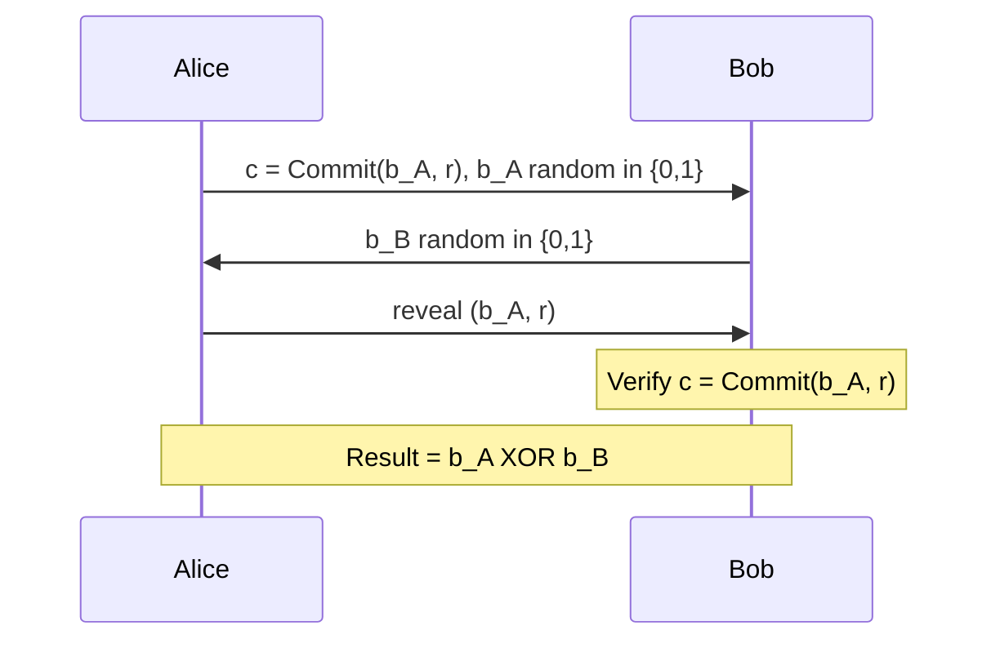

> **Prerequisites**: [[04-modular-arithmetic|04. Modular Arithmetic]] · [[20-ecc-fundamentals|20. ECC Fundamentals]] · [[18-diffie-hellman-dlp|18. Diffie-Hellman & DLP]]  
> **Lesson type**: Foundation + Scheme
>
> **Notation** (ký hiệu dùng mà không định nghĩa trong bài này):
> | Ký hiệu | Ý nghĩa |
> |---------|---------|
> | $\mathbb{G}$ | Cyclic group bậc nguyên tố $q$ với generators $g, h$ |
> | $\mathbb{Z}_q$ | Ring số nguyên modulo $q$ |
> | $f(x) \in \mathbb{Z}_q[x]$ | Polynomial bậc $\leq t-1$ trên $\mathbb{Z}_q$ |
> | $\lambda_i$ | Lagrange coefficient tại $x = 0$ cho tập $S$ |
> | $\mathsf{negl}(\lambda)$ | Negligible function |

---

## 1. Motivation

Cho đến nay, các scheme ta đã học đều giả định secret được nắm bởi *một* entity. Nhưng thực tế nhiều hệ thống quan trọng cần tránh **single point of failure**: nếu Bob là người duy nhất giữ private key và Bob mất key (hoặc bị compromise), toàn bộ hệ thống sụp đổ.

**Secret sharing** giải quyết bài toán này bằng cách phân chia secret thành $n$ *shares* và phân phát cho $n$ parties. Chỉ khi có đủ $t$ shares mới reconstruct được secret — ít hơn $t-1$ shares không tiết lộ bất kỳ thông tin gì.

Bài này còn giới thiệu **commitment scheme** — primitive cho phép một party "cam kết" với một giá trị mà không reveal ngay, và sau đó prove cam kết đó là đúng. Đây là building block thiết yếu của ZKP, MPC, và hầu hết advanced crypto protocols.

---

## 2. Secret Sharing — Chia sẻ bí mật có ngưỡng

### 2.1. Additive Secret Sharing

Dạng đơn giản nhất: chia secret $s$ thành $n$ shares sao cho $s_1 + s_2 + \ldots + s_n \equiv s \pmod{q}$.

**Construction**: Chọn $s_1, s_2, \ldots, s_{n-1} \stackrel{R}{\leftarrow} \mathbb{Z}_q$ và đặt $s_n = s - \sum_{i=1}^{n-1} s_i \pmod{q}$.

**Ưu điểm**: Đơn giản, hỗ trợ homomorphic addition (dùng trong MPC).  
**Nhược điểm**: Cần *tất cả n shares* để reconstruct — không có threshold linh hoạt $(t, n)$ với $t < n$.

### 2.2. Shamir Secret Sharing (1979)

Adi Shamir giải quyết bài toán threshold bằng cách dùng **Lagrange interpolation**: $k$ điểm xác định duy nhất một polynomial bậc $k-1$.

> [!note] Scheme — Shamir $(t, n)$-Threshold Secret Sharing
> **Setting**: Prime $q > n$; secret $s \in \mathbb{Z}_q$; parties $P_1, \ldots, P_n$.
>
> **$\mathsf{Share}(s, t, n)$**
> - Chọn $a_1, \ldots, a_{t-1} \stackrel{R}{\leftarrow} \mathbb{Z}_q$
> - Xây dựng polynomial $f(x) = s + a_1 x + a_2 x^2 + \ldots + a_{t-1} x^{t-1} \in \mathbb{Z}_q[x]$
> - Tính share: $s_i = f(i)$ cho mỗi $i \in \{1, \ldots, n\}$
> - Output: $\{(i, s_i)\}_{i=1}^{n}$
>
> **$\mathsf{Reconstruct}(S)$** với $|S| = t$
> - Input: $S = \{(i, s_i)\}$ với $|S| = t$
> - Dùng Lagrange interpolation để tìm $f(0) = s$:
>
> $$s = f(0) = \sum_{(i, s_i) \in S} s_i \cdot \lambda_i \pmod{q}$$
>
> $$\lambda_i = \prod_{\substack{j \in S, j \neq i}} \frac{-j}{i - j} \pmod{q}$$

**Tại sao đúng?** Polynomial bậc $t-1$ xác định duy nhất bởi $t$ điểm (Lagrange interpolation theorem). Đúng $t$ điểm → recover $f(x)$ → evaluate tại $x=0$ → ra $s$.

> [!abstract] Theorem — Information-Theoretic Security
> Với bất kỳ tập $T \subset \{1,\ldots,n\}$ nào có $|T| \leq t-1$, phân phối của shares $\{s_i\}_{i \in T}$ là **independent** với $s$. Cụ thể:
>
> $$\Pr[s = v \mid \{s_i\}_{i \in T}] = \Pr[s = v] \quad \forall v \in \mathbb{Z}_q$$

**Proof sketch.** Với bất kỳ $t-1$ điểm $(i, f(i))$ và bất kỳ giá trị $s^* \in \mathbb{Z}_q$, tồn tại đúng một polynomial bậc $\leq t-1$ đi qua $t-1$ điểm đó với $f(0) = s^*$. Do đó mọi giá trị của $s$ đều equally likely từ góc nhìn của adversary chỉ có $t-1$ shares. $\blacksquare$

> [!info] So sánh Computational vs Information-Theoretic Security
> Phần lớn schemes ta học (RSA, AES, DH) chỉ an toàn với adversary *đa thức thời gian* (computational security). Shamir SSS an toàn **ngay cả với adversary vô hạn computing power** — đây là tính chất mạnh nhất có thể trong mật mã học.

![[assets/img-25-01-sss-pedersen.png]]
*Shamir SSS: t=3 shares (màu vàng) đủ reconstruct secret qua Lagrange interpolation; Pedersen commitment properties (phải).*

### 2.3. Ví dụ số học cụ thể

> [!example] Ví dụ — Shamir (2, 3) với $q = 17$
> Secret $s = 13$. Threshold $t = 2$, $n = 3$.  
> Dealer chọn $a_1 = 7$ (random). Polynomial: $f(x) = 13 + 7x \pmod{17}$  
> Shares:
> - $s_1 = f(1) = 13 + 7 = 20 \equiv 3 \pmod{17}$
> - $s_2 = f(2) = 13 + 14 = 27 \equiv 10 \pmod{17}$
> - $s_3 = f(3) = 13 + 21 = 34 \equiv 0 \pmod{17}$
>
> Reconstruct từ $\{(1, 3), (2, 10)\}$:  
> $$\lambda_1 = \frac{-2}{1-2} = \frac{-2}{-1} = 2 \pmod{17}$$  
> $$\lambda_2 = \frac{-1}{2-1} = -1 \equiv 16 \pmod{17}$$  
> $$s = 3 \cdot 2 + 10 \cdot 16 = 6 + 160 = 166 \equiv 166 - 9\times 17 = 166 - 153 = 13 \pmod{17} \checkmark$$

### 2.4. Ứng dụng thực tế

- **HashiCorp Vault** — unseal với Shamir $(t, n)$ trên master key
- **Bitcoin hardware wallets** — Shamir backup cho seed phrase
- **Threshold ECDSA** (Binance TSS, GG18) — $t$-of-$n$ signing mà không ai biết full private key
- **Distributed Key Generation (DKG)** — threshold setup cho multi-party systems

---

## 3. Verifiable Secret Sharing (VSS)

Shamir SSS có điểm yếu: *trust dealer*. Dealer có thể distribute inconsistent shares — party $P_i$ nhận $s_i$ không thuộc đường cong thật → reconstruct ra sai. VSS thêm tính chất **verifiability**: mỗi party có thể verify share của mình là consistent với một committed secret.

### 3.1. Feldman VSS (1987)

Feldman VSS kết hợp Shamir SSS với commitments lên polynomial coefficients.

> [!note] Scheme — Feldman VSS
> **Setting**: Cyclic group $\mathbb{G}$ bậc $q$, generator $g$; polynomial $f(x) = s + a_1 x + \ldots + a_{t-1}x^{t-1}$  
> **Sharing phase**:
> 1. Dealer broadcast commitments: $C_j = g^{a_j} \bmod p$ cho $j = 0, 1, \ldots, t-1$ (với $a_0 = s$)
> 2. Dealer gửi riêng $s_i = f(i) \pmod{q}$ cho party $P_i$  
> **Verification** (mỗi $P_i$ thực hiện):  
> $$g^{s_i} \equiv \prod_{j=0}^{t-1} C_j^{i^j} = g^{\sum_j a_j i^j} = g^{f(i)} \pmod{p}$$  
> Nếu không thỏa: $P_i$ broadcast complaint; Dealer phải reveal $(i, f(i))$ publicly.

**Điểm yếu Feldman**: Commitments $C_j = g^{a_j}$ — từ $C_0 = g^s$, adversary có thể check brute-force xem $s$ có thuộc tập nhỏ nào không → **computationally hiding only**.

### 3.2. Pedersen VSS (1991)

Pedersen VSS sửa điểm yếu này bằng cách thêm random blinding:

> [!note] Scheme — Pedersen VSS (Information-Theoretically Hiding)
> **Setting**: $g, h$ là generators của $\mathbb{G}$ với $\log_g(h)$ không ai biết.  
> Dealer chọn *hai* polynomials:
> - $f(x) = s + a_1 x + \ldots + a_{t-1}x^{t-1}$ (secret polynomial)
> - $g'(x) = r + b_1 x + \ldots + b_{t-1}x^{t-1}$ (blinding polynomial)  
> **Commitments**: $C_j = g^{a_j} h^{b_j}$ cho $j = 0, \ldots, t-1$  
> **Share cho $P_i$**: $(f(i), g'(i))$  
> **Verification**:  
> $$g^{f(i)} h^{g'(i)} \stackrel{?}{=} \prod_{j=0}^{t-1} C_j^{i^j}$$

**Security**: Perfectly hiding vì $g^{f(i)} h^{g'(i)}$ có $g'(i)$ random → no information leak.

---

## 4. Commitment Schemes

### 4.1. Định nghĩa và Tính chất

> [!note] định nghĩa — Commitment Scheme
> Một commitment scheme gồm hai thuật toán:
> - $\mathsf{Commit}(m, r) \to c$ — tính commitment $c$ cho message $m$ với randomness $r$
> - $\mathsf{Verify}(c, m, r) \to \{0, 1\}$ — kiểm tra $(m, r)$ có mở commitment $c$ không  
> Hai tính chất bắt buộc:  
> **Binding**: Infeasible để tìm $(m_1, r_1) \neq (m_2, r_2)$ sao cho $\mathsf{Commit}(m_1, r_1) = \mathsf{Commit}(m_2, r_2)$.  
> **Hiding**: Commitment $c = \mathsf{Commit}(m, r)$ không tiết lộ thông tin về $m$.

> [!info] Binding vs Hiding strength
> - **Computationally binding / Perfectly hiding**: Binding có thể bị phá bởi adversary với vô hạn thời gian, nhưng hiding là hoàn toàn an toàn. Ví dụ: **Pedersen**.
> - **Perfectly binding / Computationally hiding**: Binding là tuyệt đối, nhưng hiding chỉ an toàn với PPT adversary. Ví dụ: **hash-based**.
> - Không thể đạt perfectly binding VÀ perfectly hiding cùng lúc (impossibility result).

### 4.2. Hash-Based Commitment

Scheme đơn giản nhất:

$$\mathsf{Commit}(m, r) = H(r \| m)$$

với $r \stackrel{R}{\leftarrow} \{0,1\}^\lambda$ là random nonce và $H$ là collision-resistant hash function.

- **Computationally binding**: Tìm $(m_1, r_1) \neq (m_2, r_2)$ với cùng hash = tìm collision của $H$.
- **Computationally hiding**: $H$ preimage-resistant → $c$ không leak $m$.
- **Không homomorphic**: $\mathsf{Commit}(m_1) \cdot \mathsf{Commit}(m_2) \neq \mathsf{Commit}(m_1 + m_2)$.

### 4.3. Pedersen Commitment

> [!note] Scheme — Pedersen Commitment
> **Setting**: Cyclic group $\mathbb{G}$ bậc nguyên tố $q$; generators $g, h$ với $\log_g(h)$ không ai biết (discrete log hardness).  
> **$\mathsf{Setup}$**: Public parameters $(g, h) \in \mathbb{G}^2$  
> **$\mathsf{Commit}(m, r)$**
> - Input: $m \in \mathbb{Z}_q$ (message), $r \stackrel{R}{\leftarrow} \mathbb{Z}_q$ (blinding factor)
> - Output: $c = g^m \cdot h^r \in \mathbb{G}$  
> **$\mathsf{Open}(c, m, r)$**
> - Reveal $(m, r)$; verifier kiểm tra $g^m \cdot h^r \stackrel{?}{=} c$

> [!abstract] Theorem — Hiding (Perfectly)
> Với bất kỳ $m_0, m_1 \in \mathbb{Z}_q$, phân phối $\mathsf{Commit}(m_0, \cdot)$ và $\mathsf{Commit}(m_1, \cdot)$ là giống hệt nhau (khi $r$ uniform random).

**Proof.** Fix $m_0, m_1$. Với mọi commitment $c \in \mathbb{G}$, tồn tại đúng một $r_0 = \log_h(c/g^{m_0})$ và đúng một $r_1 = \log_h(c/g^{m_1})$ trong $\mathbb{Z}_q$. Vì $r$ uniform trên $\mathbb{Z}_q$, cả hai phân phối output ra $c$ với xác suất $1/q$. $\blacksquare$

> [!abstract] Theorem — Binding (Computationally, under DLP)
> Nếu DLP trong $\mathbb{G}$ là hard, thì không có PPT adversary $\mathcal{A}$ có thể tìm $(m_1, r_1), (m_2, r_2)$ với $m_1 \neq m_2$ và $\mathsf{Commit}(m_1, r_1) = \mathsf{Commit}(m_2, r_2)$ với xác suất non-negligible.

**Proof.** Nếu $\mathcal{A}$ tìm được: $g^{m_1} h^{r_1} = g^{m_2} h^{r_2}$ → $h^{r_1 - r_2} = g^{m_2 - m_1}$ → $\log_g h = (m_2 - m_1)(r_1 - r_2)^{-1} \pmod{q}$. Đây là giải DLP. $\blacksquare$

> [!info] Homomorphic Property — Additive
> Pedersen commitment là **additively homomorphic**:
>
> $$\mathsf{Commit}(m_1, r_1) \cdot \mathsf{Commit}(m_2, r_2) = g^{m_1+m_2} \cdot h^{r_1+r_2} = \mathsf{Commit}(m_1+m_2,\, r_1+r_2)$$
>
> Đây là property then chốt cho phép ZKP prove "tổng của hai committed values bằng zero" mà không reveal values.

![[assets/img-25-02-vss-coinflip.png]]
*Feldman VSS protocol flow (trái); coin-flipping protocol và Shamir SSS Python implementation (phải).*

### 4.4. Ứng dụng: Fair Coin-Flipping

Hai parties muốn flip a fair coin qua network mà không trust nhau. Commitment scheme giải quyết bài toán "ai output trước bị thua" (output antes).



- **Binding** đảm bảo Alice không thể đổi $b_A$ sau khi thấy $b_B$ của Bob.
- **Hiding** đảm bảo Bob không thể bias $b_B$ theo $b_A$ của Alice.
- Result $b_A \oplus b_B$ phân phối uniform bất kể một bên cheating (miễn là 1 bên honest).

### 4.5. KZG Polynomial Commitment (Đề cập)

**KZG (Kate-Zaverucha-Goldberg, 2010)** là commitment scheme cho **polynomial** dùng pairing. Cho phép commit polynomial $\phi(x)$ và later prove $\phi(\tau) = v$ tại bất kỳ điểm $\tau$ nào với **constant-size proof** (1 group element).

Đây là building block của **PLONK**, **Groth16** variant, và **EIP-4844** (Ethereum blob transactions). Sẽ được cover chi tiết trong [[l31-zero-knowledge-proofs|L31. Zero-Knowledge Proofs]].

---

## 5. Ứng dụng và Kết nối

Hai primitive này không đứng độc lập — chúng là foundation cho gần như mọi advanced crypto protocol:

| Application | Dùng gì | Lý do |
|-------------|---------|-------|
| **MPC** (SPDZ, Garbled Circuits) | Additive SSS + Pedersen | Compute on shares, verify consistency |
| **Threshold ECDSA** | Shamir SSS | Chia private key, không bao giờ reconstruct full key |
| **DKG (Distributed Key Gen)** | Pedersen VSS | Dealer-free key generation |
| **ZKP (Range proof)** | Pedersen Commitment | Prove $0 \leq m \leq 2^n$ mà không reveal $m$ |
| **zkRollup** | KZG Commitment | Batch prove nhiều transactions |
| **Verifiable Random Function** | Commitment + Schnorr PoK | Prove random output correct |
| **Blockchain multi-sig** | Threshold Schnorr/ECDSA | $t$-of-$n$ signing |

---

## 6. CTF Relevance

⭐ **Ít gặp trong CTF thông thường**, nhưng xuất hiện trong:
- Research/academic CTF (HITCON, PlaidCTF) — bài về threshold decryption với weak dealer
- Blockchain CTF — exploit misconfigured secret sharing
- ZKP CTF (zk-CTF, paradigm CTF) — commitment scheme vulnerabilities

> [!warning] Attack vector: Dealer không random
> Nếu dealer chọn polynomial coefficients không đủ random (e.g., seed từ timestamp), adversary có thể predict coefficients → recover secret từ ít hơn $t$ shares.

---

## 7. Công cụ & Code

```python
import random
from sympy.ntheory.modular import crt

PRIME = 2**127 - 1

def eval_poly(coeffs, x, p):
    return sum(c * pow(x, i, p) for i, c in enumerate(coeffs)) % p

def make_shares(secret, t, n, p=PRIME):
    coeffs = [secret] + [random.randrange(p) for _ in range(t - 1)]
    return [(i, eval_poly(coeffs, i, p)) for i in range(1, n + 1)]

def lagrange_interp(shares, p=PRIME):
    xs = [s[0] for s in shares]
    secret = 0
    for i, (xi, yi) in enumerate(shares):
        num = 1
        den = 1
        for j, xj in enumerate(xs):
            if i != j:
                num = (num * (-xj)) % p
                den = (den * (xi - xj)) % p
        secret = (secret + yi * num * pow(den, -1, p)) % p
    return secret

def pedersen_commit(m: int, r: int, g: int, h: int, p: int) -> int:
    return (pow(g, m, p) * pow(h, r, p)) % p

def pedersen_verify(c: int, m: int, r: int, g: int, h: int, p: int) -> bool:
    return pedersen_commit(m, r, g, h, p) == c

s = 1234567890
shares = make_shares(s, t=3, n=5)
assert lagrange_interp(shares[:3]) == s
```

**SageMath:**
```python
p = next_prime(2^128)
F = GF(p)
R.<x> = F[]

secret = F(1234567890)
t, n = 3, 5
coeffs = [secret] + [F.random_element() for _ in range(t-1)]
f = sum(c * x^i for i, c in enumerate(coeffs))

shares = [(F(i), f(F(i))) for i in range(1, n+1)]

def lagrange(pts):
    xs = [p[0] for p in pts]
    result = F(0)
    for xi, yi in pts:
        li = prod((x_0 - xj) for xj in xs if xj != xi)
        result += yi * prod((-xj)/(xi - xj) for xj in xs if xj != xi)
    return result

assert lagrange(shares[:3]) == secret
```

---

## 8. Proactive Secret Sharing (PSS)

### 8.1. Vấn đề: Mobile Adversary

Shamir SSS có một điểm yếu ẩn khi hệ thống hoạt động lâu dài: adversary không cần compromise $t$ parties *cùng một lúc*. Nếu adversary có thể từ từ xâm nhập $t-1$ parties *theo thời gian* (mỗi tháng một party), cuối cùng họ tích lũy đủ $t$ shares và recover secret — dù mỗi thời điểm họ chỉ compromise dưới ngưỡng.

> [!warning] Patient Attacker Problem
> Standard Shamir SSS: adversary compromise party $P_1$ vào tháng 1, $P_2$ vào tháng 2, ..., $P_t$ vào tháng $t$ → sau $t$ tháng recover secret hoàn toàn, mặc dù *tại mọi thời điểm* số parties compromised $< t$.

### 8.2. Giải pháp PSS: Periodic Share Refresh

**Proactive Secret Sharing (Herzberg et al., 1995)** giải quyết bài toán này bằng cách định kỳ *refresh* shares mà không thay đổi secret:

1. **Re-sharing**: Mỗi party $P_i$ chạy một sub-VSS về share $s_i$ của mình — tức là tạo polynomial $h_i(x)$ bậc $t-1$ với $h_i(0) = s_i$ và phát $h_i(j)$ cho $P_j$
2. **Aggregation**: Party $P_j$ tính share mới $s_j' = \sum_i h_i(j)$ — đây vẫn là evaluation tại $j$ của $f'(x) = \sum_i h_i(x)$ với $f'(0) = \sum_i s_i = f(0) = s$
3. **Destruction**: Tất cả shares cũ bị xóa vĩnh viễn (secure erase)

**Security guarantee**: Adversary phải compromise $t$ parties trong *một* time period duy nhất. Thông tin từ period trước hoàn toàn vô dụng sau refresh.

> [!note] Scheme — PSS Share Refresh Protocol
> **Mỗi time period $\tau$**:
>
> For each party $P_i$ (song song):
> - Chọn random polynomial $h_i^{(\tau)}(x)$ bậc $t-1$ với $h_i^{(\tau)}(0) = s_i^{(\tau-1)}$
> - Gửi $\delta_{ij} = h_i^{(\tau)}(j)$ cho mỗi $P_j$ qua authenticated channel
>
> Party $P_j$ nhận xong:
> - Verify consistency (dùng VSS commitments)
> - Tính $s_j^{(\tau)} = \sum_{i=1}^{n} \delta_{ij} \pmod{q}$
> - **Xóa** $s_j^{(\tau-1)}$ và tất cả $\delta_{ij}$ trung gian

```python
# PSS Share Refresh — Python Pseudocode
import random

def pss_refresh(current_shares: list[int], t: int, n: int, p: int) -> list[int]:
    """
    Refresh n shares of a secret without revealing it.
    current_shares[i] = s_{i+1} = f(i+1) for old polynomial f
    Returns new_shares[i] = s'_{i+1} = f'(i+1) for new polynomial f'
    with f'(0) = f(0) = secret (unchanged).
    """
    # Each party i generates a sub-sharing of their own share
    # h_i(x) = s_i + rand*x + ... (degree t-1, h_i(0) = s_i)
    delta = [[0] * n for _ in range(n)]   # delta[i][j] = h_i(j+1)

    for i in range(n):
        s_i = current_shares[i]
        # Random polynomial h_i with h_i(0) = s_i
        coeffs_i = [s_i] + [random.randrange(p) for _ in range(t - 1)]
        for j in range(n):
            x = j + 1
            delta[i][j] = sum(c * pow(x, k, p) for k, c in enumerate(coeffs_i)) % p

    # Each party j aggregates: s'_j = sum_i delta[i][j]
    new_shares = [(sum(delta[i][j] for i in range(n)) % p) for j in range(n)]

    # In practice: securely erase current_shares and intermediate delta values here
    return new_shares
```

### 8.3. Kết nối thực tiễn

- **Mobile adversary model**: Threshold $t$ vẫn giữ nguyên, nhưng security window thu hẹp về từng time period
- **HSMs (Hardware Security Modules)**: Refresh theo lịch để limit exposure window
- **Ethereum DVT (Distributed Validator Technology)**: Obol, SSV Network dùng PSS-like refresh để bảo vệ validator keys dài hạn
- **Blockchain validator keys**: Re-keying định kỳ ngăn slow-motion key compromise
- **Contrast**: Standard SSS an toàn *at one point in time*; PSS an toàn *over time* dù adversary kiên nhẫn

---

## 9. Commitment Scheme Taxonomy

### 9.1. Trapdoor Commitments

**Trapdoor commitment** (hay **equivocable commitment**) là perfectly hiding scheme có thêm một *trapdoor* $\tau$ cho phép *equivocate* — tức là mở commitment thành bất kỳ giá trị nào.

Trong Pedersen commitment, trapdoor là $\tau = \log_g h$. Nếu biết $\tau$, party có thể:
- Commit $m$ với $r$ tùy chọn: $c = g^m h^r$
- Sau đó mở $c$ thành $m'$ bất kỳ: tìm $r' = r + (m - m')\tau^{-1} \pmod{q}$, vì $g^{m'} h^{r'} = g^{m'} h^{r+(m-m')\tau^{-1}} = g^m h^r = c$

> [!info] Tại sao Trapdoor Commitments hữu ích?
> Trong simulatable ZKP protocols (đặc biệt trong UC security model), simulator cần equivocate commitments khi xây dựng ideal-world simulation. Trapdoor commitments cho phép simulator "thay đổi mind" sau khi commit, tái tạo view của adversary mà không cần biết witness thật.

### 9.2. Vector Commitments

**Vector commitment** cho phép commit một vector $(v_1, \ldots, v_n)$ và sau đó *open* bất kỳ vị trí $i$ nào với **constant-size proof** (không phụ thuộc $n$):

- **KZG as vector commitment**: Cho polynomial $f(x)$ với $f(i) = v_i$, commitment $[f]_1 = g^{f(\tau)}$ (trusted setup). Proof tại vị trí $i$: chứng minh $f(i) = v_i$ bằng quotient polynomial — proof là 1 group element
- **Merkle trees**: Vector commitment *không succinct* — proof size $O(\log n)$. Transparent (không cần trusted setup), được dùng trong Bitcoin UTXO, Ethereum state trie, zk-STARKs
- **RSA accumulators**: Commit tập hợp, prove membership với constant-size proof; dùng trong anonymous credential schemes

### 9.3. Functional Commitments

**Functional commitment** tổng quát hóa vector commitment: commit vector $(v_1, \ldots, v_n)$, prove $f(\vec{v}) = y$ cho một hàm $f$ thuộc một class $\mathcal{F}$:

| Class $\mathcal{F}$ | Scheme | Ví dụ |
|---|---|---|
| Linear functions $\langle \vec{a}, \vec{v} \rangle$ | Pedersen | Bulletproofs inner product |
| Polynomial evaluation $p(r)$ | KZG | PLONK, Halo2 |
| Inner product $\langle \vec{u}, \vec{v} \rangle$ | IPA/Bulletproofs | Monero RingCT |
| Arbitrary circuits | SNARK-based | Groth16, STARK |

### 9.4. Bảng so sánh Commitment Schemes

| Scheme | Binding | Hiding | Proof size | Setup | Homomorphic |
|--------|---------|--------|-----------|-------|-------------|
| **Hash-based** $H(r\|m)$ | Perfectly | Computationally | $O(1)$ | Transparent | Không |
| **Pedersen** $g^m h^r$ | Computationally (DLP) | Perfectly | $O(1)$ | Trusted ($g,h$) | Additive |
| **KZG** $g^{f(\tau)}$ | Computationally (q-SDH) | Computationally | $O(1)$ constant | Trusted SRS | Polynomial |
| **Merkle tree** $H^{\log n}$ | Computationally (CRHF) | Computationally | $O(\log n)$ | Transparent | Không |
| **RSA accumulator** | Computationally (strong RSA) | Perfectly | $O(1)$ | Trusted (RSA modulus) | Multiplicative |

> [!info] Trade-off cốt lõi
> Không thể đạt **perfectly binding** và **perfectly hiding** cùng lúc (impossibility theo information theory). Mọi scheme phải chọn một trong hai để đạt *perfectly*, phần còn lại chỉ *computationally* secure.

---

## 10. Distributed Key Generation (DKG)

### 10.1. Bài toán

**Mục tiêu**: $n$ parties muốn cùng tạo ra keypair $(\mathsf{sk}, \mathsf{pk})$ sao cho:
- $\mathsf{pk} = g^{\mathsf{sk}}$ là public và mọi người biết
- $\mathsf{sk} = f(0)$ là **threshold-shared** — không party nào biết $\mathsf{sk}$ hoàn chỉnh
- Không có trusted dealer

Nếu dùng trusted dealer: dealer biết $\mathsf{sk}$ → single point of failure. DKG loại bỏ dealer bằng cách mỗi party *là* dealer cho một phần bí mật của mình.

### 10.2. Pedersen DKG Construction

> [!note] Scheme — Pedersen DKG (Gennaro et al., 1999)
> **Round 1 — Commit**:
> - Mỗi party $P_i$ chọn secret $a_i \stackrel{R}{\leftarrow} \mathbb{Z}_q$
> - $P_i$ chạy Pedersen VSS với $a_i$ làm secret: tạo $f_i(x) = a_i + \ldots$ (bậc $t-1$), broadcast commitments $\{C_{ij}\}_j$, gửi shares $f_i(j)$ cho $P_j$
>
> **Round 2 — Complaint**:
> - Mỗi $P_j$ verify share từ mọi $P_i$: $g^{f_i(j)} h^{g'_i(j)} \stackrel{?}{=} \prod_k C_{ik}^{j^k}$
> - Nếu fail: $P_j$ broadcast complaint $(j \to i)$; $P_i$ phải publicly reveal $f_i(j)$
> - Parties bị expose inconsistency bị loại khỏi qualified set $\mathcal{Q}$
>
> **Output**:
> $$\mathsf{sk} = \sum_{i \in \mathcal{Q}} a_i \pmod{q} \quad \text{(không ai tính được)}$$
> $$\mathsf{pk} = \prod_{i \in \mathcal{Q}} g^{a_i} = g^{\sum_{i \in \mathcal{Q}} a_i} \quad \text{(mọi người tính được)}$$
> $$\text{Share của } P_j: \quad s_j = \sum_{i \in \mathcal{Q}} f_i(j) \pmod{q}$$

**Tại sao đúng?** Mỗi $f_i(j)$ là evaluation của polynomial $f_i$ tại $j$. Tổng $\sum_i f_i(j) = F(j)$ với $F(x) = \sum_i f_i(x)$ là polynomial bậc $t-1$ thỏa $F(0) = \sum_i a_i = \mathsf{sk}$. Đây là Shamir sharing của $\mathsf{sk}$ với $t$ threshold.

### 10.3. Security Requirements

- **Honest majority**: Ít nhất $t$ parties honest để đảm bảo reconstructibility và security
- **Synchronous broadcast**: Tất cả parties nhận đủ messages trong cùng round (broadcast channel); nếu async, cần thêm timeout protocol
- **Authenticated channels**: Mỗi party biết ai gửi message (prevent impersonation)

> [!warning] DKG Không Đơn Giản Trong Thực Tế
> Nhiều DKG protocol có subtle issues:
> - **Biased output**: Adversary có thể abort sau khi thấy partial output để bias $\mathsf{pk}$
> - **Asynchronous networks**: Classic Pedersen DKG giả định synchrony; ADKG (Async DKG) phức tạp hơn nhiều
> - **Identification of malicious parties**: Complaint rounds cần careful handling để tránh DoS

### 10.4. Ứng dụng thực tiễn

| Application | DKG Protocol | Chi tiết |
|---|---|---|
| **Ethereum DVT** | Obol/SSV DKG | Chia validator signing key cho $t$-of-$n$ operators |
| **Chainlink DON** | FROST-based DKG | Threshold VRF và oracle signing |
| **FROST threshold keygen** | Pedersen DKG variant | Key generation cho FROST threshold Schnorr |
| **Filecoin** | DKG cho storage miner keys | Decentralized key management |
| **MPC wallets** (Fireblocks, ZenGo) | Custom DKG | $2$-of-$2$ hoặc $2$-of-$3$ threshold ECDSA |

> [!info] DKG → Threshold Signing Pipeline
> DKG chỉ là bước *setup*. Sau DKG, parties dùng shares $s_j$ để thực hiện **threshold signing** (Threshold ECDSA, FROST Schnorr, BLS aggregation) mà không bao giờ reconstruct $\mathsf{sk}$ tại một điểm duy nhất.

---

## 11. Tài liệu tham khảo

- Shamir, A. — *How to Share a Secret*, Communications of the ACM, 1979
- Blakley, G.R. — *Safeguarding Cryptographic Keys*, AFIPS 1979 (alternative threshold scheme)
- Feldman, P. — *A Practical Scheme for Non-interactive Verifiable Secret Sharing*, FOCS 1987
- Pedersen, T.P. — *Non-Interactive and Information-Theoretic Secure Verifiable Secret Sharing*, CRYPTO 1991
- Kate, A., Zaverucha, G., Goldberg, I. — *Polynomial Commitments*, Asiacrypt 2010
- Boneh & Shoup — *A Graduate Course in Applied Cryptography*, Ch. 19 (Secret Sharing), Ch. 12 (Commitments) — toc.cryptobook.us
- Gennaro, R. et al. — *Secure Distributed Key Generation for Discrete-Log Based Cryptosystems*, Eurocrypt 1999
