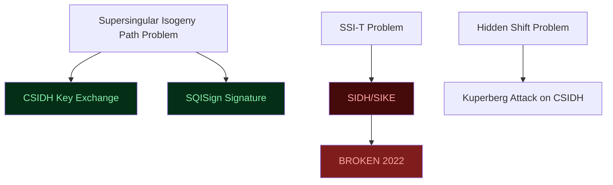

> **Prerequisites**: Elliptic curve fundamentals, ECDH/ECDSA, ECC attacks — MOV attack, basic abstract algebra (group, field)  
> **Lesson type**: Scheme + Mathematical Component (Survey-level — Phase 7)
>
> **Notation** (ký hiệu dùng mà không định nghĩa trong bài này):
> | Ký hiệu | Ý nghĩa |
> |---------|---------|
> | $E / \mathbb{F}_p$ | Elliptic curve định nghĩa trên trường $\mathbb{F}_p$ |
> | $j(E)$ | $j$-invariant của curve $E$ — bất biến theo isomorphism |
> | $E[N]$ | $N$-torsion subgroup: $\{P \in E : [N]P = \mathcal{O}\}$ |
> | $\phi : E \to E'$ | Isogeny (group homomorphism) từ $E$ đến $E'$ |
> | $\ker(\phi)$ | Kernel của isogeny $\phi$ |
> | $\mathrm{End}(E)$ | Endomorphism ring của curve $E$ |
> | $\mathcal{O}$ | Maximal order trong quaternion algebra |
> | $\mathrm{cl}(\mathcal{O})$ | Ideal class group của order $\mathcal{O}$ |
> | $\mathbb{Z}[\sqrt{-d}]$ | Ring số nguyên Gauss / quadratic imaginary field |

---

## 1. Motivation

Isogeny-based cryptography là nhóm PQC nhỏ nhất, toán học nặng nhất, và cũng có "drama" nhất trong lịch sử PQC: năm 2022, SIKE — scheme được coi là promising với key size nhỏ nhất trong tất cả PQC candidates — bị phá vỡ hoàn toàn bởi một tờ giấy viết trong vài tuần, chạy trên CPU đơn từ năm 2013, mất chưa đầy một giờ. Đây là sự kiện chấn động cộng đồng crypto và là bài học về rủi ro khi phụ thuộc vào một hard problem chưa được kiểm chứng đủ lâu.

Nhưng isogeny-based crypto chưa chết. CSIDH và SQISign — hai scheme không dựa trên SIDH — vẫn an toàn trước attack đó, và tiếp tục được nghiên cứu vì một lý do hấp dẫn: chúng có **key size nhỏ nhất trong tất cả PQC**, đặc biệt SQISign với public key chỉ 64 bytes.

Bài này là **survey-level**: biết khái niệm isogeny, biết tại sao SIKE bị phá và tại sao CSIDH/SQISign không bị, và đặt isogeny trong bức tranh tổng thể PQC.

---

## 2. Phần 1 — Nền tảng Toán học: Isogeny là gì?

### 2.1. Từ Elliptic Curve sang Isogeny

Từ bài L16, ta đã biết elliptic curve $E / \mathbb{F}_p$ là một nhóm Abel. **Isogeny** là ánh xạ "tốt" giữa hai curve: vừa là group homomorphism, vừa là morphism của algebraic variety.

> [!note] Definition 1 — Isogeny
> Cho hai elliptic curves $E, E' / \mathbb{F}_p$. Một **isogeny** (đồng cấu đẳng cấu) là ánh xạ:
>
> $$\phi : E \to E'$$
>
> thỏa mãn:
> 1. $\phi$ là rational map (biểu diễn được bằng phân thức của tọa độ)
> 2. $\phi(\mathcal{O}_E) = \mathcal{O}_{E'}$ (map điểm vô cực về điểm vô cực)
> 3. $\phi$ là group homomorphism: $\phi(P + Q) = \phi(P) + \phi(Q)$
>
> **Degree** của $\phi$: nếu $|\ker(\phi)| = \ell$, ta nói $\phi$ là **$\ell$-isogeny**.
>
> **Dual isogeny** $\hat{\phi} : E' \to E$: tồn tại và thỏa mãn $\hat{\phi} \circ \phi = [\ell]$ (nhân scalar $\ell$).

Ví dụ đơn giản nhất: multiplication-by-$N$ map $[N] : E \to E$ là isogeny từ $E$ vào chính nó (endomorphism). Nhưng isogeny thú vị hơn khi $E \neq E'$.

**Định lý Vélu (1971)**: Cho subgroup hữu hạn $G \subset E(\overline{\mathbb{F}}_p)$, tồn tại duy nhất (đến đẳng cấu) isogeny $\phi : E \to E'$ với $\ker(\phi) = G$. Công thức Vélu cho phép tính $E'$ và $\phi$ hiệu quả từ $G$.

### 2.2. Supersingular Elliptic Curves

Không phải mọi curve đều phù hợp cho isogeny crypto. Nhóm scheme hiện đại dùng **supersingular curves**.

> [!note] Definition 2 — Supersingular Elliptic Curve
> Elliptic curve $E / \mathbb{F}_p$ là **supersingular** nếu:
>
> $$\#E(\mathbb{F}_p) = p + 1 - t \text{ với } t \equiv 0 \pmod{p}$$
>
> Tương đương: **trace of Frobenius** $t = 0$, hoặc $E[p](\overline{\mathbb{F}}_p) = \{O\}$ (không có $p$-torsion points trên $\overline{\mathbb{F}}_p$).
>
> **Endomorphism ring**: Với supersingular curve, $\mathrm{End}(E) \otimes \mathbb{Q}$ là quaternion algebra — 4-dimensional algebra không giao hoán. Đây là khác biệt cơ bản so với ordinary curve (endomorphism ring là imaginary quadratic field — 2-dimensional).

**Số lượng**: Với prime $p$, số supersingular $j$-invariants trên $\overline{\mathbb{F}}_p$ là $\lfloor p/12 \rfloor + \epsilon$ ($\epsilon \in \{0,1,2\}$ tùy $p \bmod 12$) — một tập hữu hạn compact.

### 2.3. Supersingular Isogeny Graph

> [!note] Definition 3 — Supersingular $\ell$-Isogeny Graph
> Cho prime $\ell \neq p$. **Supersingular $\ell$-isogeny graph** $\mathcal{G}(\ell, p)$:
> - **Vertices**: Tất cả supersingular $j$-invariants trên $\overline{\mathbb{F}}_p$ (khoảng $p/12$ nodes)
> - **Edges**: Có edge từ $j(E)$ đến $j(E')$ nếu tồn tại $\ell$-isogeny $E \to E'$
>
> Mỗi vertex có degree **chính xác** $\ell + 1$ (với $\ell$-isogenies, mỗi curve có $\ell + 1$ isogenies con tới $\ell + 1$ curves khác).

**Tính chất quan trọng**: Graph này là **Ramanujan expander** — "ngẫu nhiên" tốt nhất có thể về mặt spectral. Random walk trên graph này trộn rất nhanh, và sau $O(\log p)$ bước, vị trí gần như uniform. Tính chất này là nền tảng của **hard problem** trong isogeny crypto.

**Hard problem**: Cho hai curve $E_0$ và $E_1$ (biết $j(E_0)$ và $j(E_1)$), tìm isogeny $\phi : E_0 \to E_1$. Đây là bài toán **"find path in isogeny graph"** — không có thuật toán classical hiệu quả. Best known attacks (meet-in-the-middle) có complexity $O(p^{1/4})$.

---

## 3. Phần 2 — SIDH và SIKE (đã bị phá)

### 3.1. SIDH Protocol

![[assets/img-29-sidh-flow.png]]
*SIDH key exchange: Alice và Bob đi theo different paths trong isogeny graph, rồi đến cùng một điểm từ hai hướng. Việc publish torsion point images là lỗ hổng chết người.*

**SIDH** (Supersingular Isogeny Diffie-Hellman) được Jao và De Feo đề xuất năm 2011. Ý tưởng: hai bên đi random walk trên supersingular isogeny graph, rồi "commute" theo cách tương tự DH.

> [!note] Protocol 4 — SIDH Key Exchange (Simplified)
> **Setting**: Prime $p = 2^a \cdot 3^b - 1$; supersingular curve $E_0 / \mathbb{F}_{p^2}$; generators $P_A, Q_A \in E_0[2^a]$ và $P_B, Q_B \in E_0[3^b]$
>
> **Alice:**
> - Chọn random $m_A, n_A$; kernel $G_A = \langle [m_A]P_A + [n_A]Q_A \rangle \subset E_0[2^a]$
> - Tính $2^a$-isogeny $\phi_A : E_0 \to E_A = E_0 / G_A$
> - Publish $(E_A,\; \phi_A(P_B),\; \phi_A(Q_B))$
>
> **Bob:**
> - Chọn random $m_B, n_B$; kernel $G_B = \langle [m_B]P_B + [n_B]Q_B \rangle \subset E_0[3^b]$
> - Tính $3^b$-isogeny $\phi_B : E_0 \to E_B = E_0 / G_B$
> - Publish $(E_B,\; \phi_B(P_A),\; \phi_B(Q_A))$
>
> **Shared secret:**
> - Alice tính $\phi'_A : E_B \to E_{AB}$ với kernel $G'_A = \langle [m_A]\phi_B(P_A) + [n_A]\phi_B(Q_A) \rangle$
> - Bob tính $\phi'_B : E_A \to E_{BA}$ với kernel $G'_B = \langle [m_B]\phi_A(P_B) + [n_B]\phi_A(Q_B) \rangle$
> - $j(E_{AB}) = j(E_{BA})$ — đây là shared secret!

**Tại sao commute?** Các isogenies từ kernels disjoint commute: $E_0 / \langle G_A, G_B \rangle \cong E_{AB} \cong E_{BA}$.

**Dấu hiệu nguy hiểm**: Cả hai bên đều phải publish **torsion point images** $\phi_A(P_B), \phi_A(Q_B)$ và $\phi_B(P_A), \phi_B(Q_A)$. Đây là thông tin "phụ" cần thiết để bên kia tính $G'$. Nhưng nó cũng là thông tin mà kẻ tấn công khai thác.

> [!info] SIKE — KEM dựa trên SIDH
> **SIKE** (Supersingular Isogeny Key Encapsulation) là KEM xây từ SIDH, submit vào NIST PQC năm 2017. Vào tháng 7/2022, SIKE vừa được chọn vào **Round 4** (finalist) thì bị break.

### 3.2. Castryck-Decru Attack — Thảm họa của SIKE

> [!danger] Castryck-Decru Attack — SIKE Broken (August 2022)
> Ngày 5/8/2022, Wouter Castryck và Thomas Decru (KU Leuven) đăng bài "An Efficient Key Recovery Attack on SIDH" lên IACR ePrint. Kết quả:
> - SIKEp434 (Level 1): bị phá trong **62 phút** trên single CPU core (Intel Xeon từ 2013)
> - SIKEp503: **~2 giờ**
> - SIKEp751 (Level 5): **~21 giờ**
>
> NIST ngay lập tức remove SIKE khỏi standardization process.

**Tại sao attack thành công?** Ý tưởng cốt lõi:

1. **Auxiliary torsion points là chìa khóa**: Khi Alice publish $(E_A, \phi_A(P_B), \phi_A(Q_B))$, bà đã vô tình cho biết "isogeny $\phi_A$ tác động như thế nào lên $E_0[3^b]$" — tức là nhiều thông tin hơn chỉ curve $E_A$.

2. **Gluing trick**: Castryck và Decru dùng kỹ thuật "glue" hai elliptic curves lại thành một **abelian surface** (surface abelian 4-dimensional). Torsion point images cho phép xây dựng isogeny trên higher-dimensional object này.

3. **Higher-dimensional isogeny**: Trên abelian surface, dùng kỹ thuật $(2,2)$-isogenies (hoặc tổng quát hơn là $(\ell,\ell)$-isogenies), attack tìm được secret isogeny $\phi_A$ trong polynomial time.

4. **Classical algorithm**: Toàn bộ attack chạy trên **classical computer** — không cần quantum computer!

> [!warning] Bài học từ SIKE
> - **Auxiliary information là nguy hiểm**: Trong Diffie-Hellman thông thường, chỉ cần publish $g^a$ và $g^b$. SIDH buộc phải publish thêm torsion point images vì cần chúng để tính shared secret. Chính thông tin phụ này phá vỡ hardness assumption.
> - **Security assumption chưa đủ "aged"**: SIDH chỉ được nghiên cứu từ 2011, và hard problem của nó ("SIDH problem") ít được kiểm tra hơn nhiều so với factoring hay DLP.
> - **Hard problem in higher dimension**: Cryptography dựa trên bài toán mới luôn có rủi ro — cần thời gian dài để community kiểm tra tất cả angles.

---

## 4. Phần 3 — CSIDH — Vẫn an toàn

### 4.1. Ý tưởng: Commutative Group Action

**CSIDH** (Commutative Supersingular Isogeny Diffie-Hellman) được Castryck, Lange, Martindale, Panny, và Renes đề xuất năm 2018. Nó khác SIDH về mặt kiến trúc cơ bản.

![[assets/img-29-isogeny-landscape.png]]
*Bản đồ isogeny crypto: SIDH-based đã bị phá, CSIDH và SQISign không dùng torsion point nên không bị ảnh hưởng.*

**Nguyên lý cốt lõi**: Thay vì "random walk" trực tiếp trong isogeny graph, CSIDH dùng **group action của ideal class group** $\mathrm{cl}(\mathcal{O})$ lên tập supersingular curves.

> [!note] Definition 5 — CSIDH Group Action
> Cho prime $p \equiv 3 \pmod{8}$ và order $\mathcal{O} = \mathbb{Z}[\sqrt{-p}]$ (imaginary quadratic field).  
> **Setting**: Tập $\mathcal{E}\ell\ell_p(\mathcal{O})$ — tất cả supersingular curves $E / \mathbb{F}_p$ với $\mathrm{End}(E) \cong \mathcal{O}$  
> **Group action**: $\mathrm{cl}(\mathcal{O}) \times \mathcal{E}\ell\ell_p(\mathcal{O}) \to \mathcal{E}\ell\ell_p(\mathcal{O})$  
> Với ideal $\mathfrak{a} = \langle \ell, \pi - 1 \rangle$ (prime ideal above $\ell$):
> - $\mathfrak{a} \star E = E / E[\mathfrak{a}]$ (quotient curve bởi isogeny với kernel $E[\mathfrak{a}]$)  
> **Commutativity**: $\mathfrak{a} \star (\mathfrak{b} \star E) = \mathfrak{b} \star (\mathfrak{a} \star E)$ — đây là điểm khác biệt với SIDH!

**Key exchange**: Tương tự DH cổ điển nhưng thay "$g^x$" bằng "group action":

> [!note] Protocol 6 — CSIDH Key Exchange
> **Public**: Starting curve $E_0 / \mathbb{F}_p$ (fixed globally)  
> **Alice**: Chọn random vector $(e_1, \ldots, e_n) \in \mathbb{Z}^n$ (exponent vector)
> - Tính $E_A = [\mathfrak{l}_1^{e_1} \cdots \mathfrak{l}_n^{e_n}] \star E_0$ (bằng cách compose isogenies)
> - Publish $E_A$ (chỉ cần publish $j(E_A)$!)
>
> **Bob**: Tương tự, publish $E_B$  
> **Shared secret**:
> - Alice: $\mathfrak{a} \star E_B = E_{AB}$
> - Bob: $\mathfrak{b} \star E_A = E_{BA}$
> - $E_{AB} = E_{BA}$ vì group action commutative!

**Tại sao CSIDH không bị Castryck-Decru?** Đơn giản: CSIDH **không publish bất kỳ torsion point nào**. Chỉ có curve $E_A$ (một $j$-invariant duy nhất) được public. Không có "auxiliary information" để attack khai thác. Castryck và Decru sau đó tự xác nhận: "attack của chúng tôi không áp dụng cho CSIDH."

> [!info] CSIDH Security
> **Classical security**: Best known attack là Kuperberg's algorithm (quantum subexponential) và sieve algorithms. Classical hardness: exponential.
> **Quantum security**: Kuperberg-Regev algorithm có complexity $L[1/2]$ (subexponential). Với CSIDH-512 (prime $p \approx 2^{512}$), quantum security ước tính ~64–128 bit.
>
> **Trade-off**: Key size nhỏ (~64 bytes), nhưng key generation và key exchange **chậm** hơn ML-KEM đáng kể (vài giây mỗi operation).

---

## 5. Phần 4 — SQISign — Chữ ký từ Quaternion và Isogeny

### 5.1. Deuring Correspondence — Cầu nối quan trọng

Để hiểu SQISign, cần biết một kết quả toán học sâu:

> [!note] Theorem — Deuring Correspondence
> Có bijection (tương ứng 1-1) giữa:
> - **Isogenies** $\phi : E \to E'$ giữa supersingular curves
> - **Ideals** $I \subset \mathrm{End}(E)$ trong endomorphism ring (maximal order $\mathcal{O}_E$ trong quaternion algebra $B_{p,\infty}$)  
> Cụ thể: $\phi \leftrightarrow I = \{f \in \mathcal{O}_E : f(\ker(\phi)) = 0\}$  
> Và: $E' \cong E_I$ (curve tương ứng với ideal $I$ qua Deuring's construction)

**Ý nghĩa thực tế**: Thay vì làm việc với isogenies (khó compute, khó describe), SQISign làm việc với **ideals trong quaternion algebra** (có cấu trúc algebraic rõ ràng hơn). KLPT algorithm cho phép convert giữa hai thế giới này.

### 5.2. SQISign — Scheme

**SQISign** (Short Quaternion and Isogeny Signature) được De Feo, Kohel, Leroux, Petit, và Wesolowski đề xuất năm 2020. Đây là signature scheme với key size compact nhất trong tất cả PQC.

**Ý tưởng**: Dùng Fiat-Shamir transform trên một interactive identification protocol trong isogeny world. Thay vì commit/challenge/respond trên group như Schnorr, SQISign làm điều tương tự trên **endomorphism ring của supersingular curves**.

> [!note] Scheme — SQISign (High-Level Overview)
> **Setting**: Prime $p$; fixed supersingular curve $E_0$ với known endomorphism ring $\mathcal{O}_0$
>
> **$\mathsf{KeyGen}$**
> - Chọn random secret ideal $I \subset \mathcal{O}_0$ (represent secret isogeny $\phi_I : E_0 \to E_A$)
> - Public key: $E_A = E_I$ (chỉ cần publish $j(E_A)$ — 64 bytes với $p \approx 2^{254}$!)
> - Private key: ideal $I$ (hoặc generator của isogeny)
>
> **$\mathsf{Sign}(\mathsf{sk},\, m)$** (Non-interactive via Fiat-Shamir)
> - **Commit**: Chọn random ideal $J$ → compute $E_1 = E_J$ (random walk từ $E_0$)
> - **Challenge**: $c = H(E_1, m)$ → map thành ideal $I_c \subset \mathcal{O}_{E_A}$ via Deuring
> - **Response**: Dùng **KLPT algorithm** để tìm ideal $K$ sao cho $E_K \cong E_1$ khi đi từ $E_A$ qua $I_c$ rồi qua $K$
> - Output: $\sigma = (E_1, \phi_K)$ — isogeny từ $E_A$ đến $E_1$
>
> **$\mathsf{Verify}(\mathsf{pk},\, m,\, \sigma)$**
> - Verify $\phi_K : E_A \to E_1$ là isogeny hợp lệ
> - Recompute $c = H(E_1, m)$; verify degree và structure của $\phi_K$

> [!info] SQISign Parameters và Performance
> | Property | Value |
> |----------|-------|
> | Public key | **64 bytes** |
> | Signature | **177 bytes** |
> | Security level | ~128-bit classical |
> | Sign time | ~1 giây (CPU-intensive KLPT) |
> | Verify time | ~10–50 ms |
> | Assumption | Supersingular isogeny path problem |
>
> So sánh: ML-DSA (Dilithium) sign <1ms nhưng pk = 1.3 KB, sig = 2.4 KB. SQISign nhỏ hơn nhiều nhưng sign chậm hơn 1000×.

**Tại sao SQISign không bị SIDH attack?** SQISign không publish torsion point images. Commitment $E_1$ chỉ là một curve (j-invariant), và signature $\phi_K$ là isogeny — không có auxiliary point structure mà Castryck-Decru exploit.

> [!tip] SQISign 2.0 và SQISignHD (2023)
> Sau 2022, community đã cải thiện SQISign:
> - **SQISignHD** (Higher-Dimension): Dùng higher-dimensional isogenies để tăng tốc KLPT, giảm sign time đáng kể
> - **SQISign 2.0**: Cải thiện security proof, smaller parameters
> - **Learning to SQI**: Tutorial và tools để implement/understand SQISign
>
> Đây là active research area (2023–2026) và có thể trở thành candidate PQC signature trong tương lai.

---

## 6. Phần 5 — Bức tranh tổng thể

### 6.1. So sánh Isogeny Schemes

| Scheme | Type | Status 2026 | Key size | Signing | Hard problem |
|--------|------|-------------|---------|---------|-------------|
| SIDH | Key exchange | **BROKEN** | ~300 B | — | SSI-T (broken) |
| SIKE | KEM | **WITHDRAWN** | ~300 B | — | SSI-T (broken) |
| CSIDH | Key exchange | Research | ~64 B | — | CSIDH problem |
| CSI-FiSH | Signature | Research | ~64 B | slow | CSIDH |
| SQISign | Signature | Research | **64 B** | ~1s | SuperSing. iso. path |

### 6.2. Isogeny trong Context PQC tổng thể

> [!info] Vị trí của Isogeny trong PQC Landscape
> Isogeny **không được NIST chuẩn hóa** (2024). Ba tiêu chuẩn của NIST là:
> - ML-KEM (Kyber) — lattice
> - ML-DSA (Dilithium) — lattice
> - SLH-DSA (SPHINCS+) — hash-based
>
> Tuy nhiên, isogeny được tiếp tục nghiên cứu vì:
> 1. **Key size compact** nhất trong tất cả PQC — quan trọng cho DNS, IoT, certificate transparency
> 2. **Toán học phong phú** — Deuring correspondence, quaternion algebras, class field theory
> 3. **Diversity** — nếu lattice bị break, cần alternative không phụ thuộc cùng assumption

### 6.3. Hard Problems — Taxonomy



---

## 7. CTF Relevance

> [!example] CTF Pattern — Isogeny
> ⭐ **Rất hiếm trong CTF thông thường** — chủ yếu trong research-track CTF
>
> **Pattern thường gặp**:
> - Challenge implement CSIDH không correctly (sai group action composition)
> - Challenge dùng SIDH với auxiliary points bị leak → apply Castryck-Decru concept
> - Math puzzle về Deuring correspondence
>
> **Nhận diện**:
> - Source code có operations trên supersingular curves over $\mathbb{F}_{p^2}$
> - Mention "isogeny", "j-invariant", "torsion points"
> - Key rất nhỏ (~64 bytes) cho public key exchange
>
> **Tool**: SageMath có built-in support cho isogenies:
> ```python
> from sage.all import *
>
> p = 431
> F = GF(p^2)
> E = EllipticCurve(F, [1, 0])
>
> P = E.random_point()
> n = 4
> ker = E(0) + P
>
> phi = E.isogeny(P)
> E_prime = phi.codomain()
> print("Target curve:", E_prime)
> print("j-invariant:", E_prime.j_invariant())
>
> P2 = E.random_point()
> Q2 = phi(P2)
> print("Image of point:", Q2)
> ```
>
> **SIKE challenge (deprecated)**: Nếu gặp challenge based on SIDH với known torsion point images, đây là bài toán đã có known attack. Lookup Castryck-Decru Magma code (public domain).

---

## 8. Tài liệu tham khảo

- Jao & De Feo — *Towards Quantum-Resistant Cryptosystems from Supersingular Elliptic Curve Isogenies*, PQCrypto 2011 — bài gốc SIDH
- Castryck & Decru — *An Efficient Key Recovery Attack on SIDH*, CRYPTO 2022 — bài phá SIKE
- Castryck, Lange, Martindale, Panny, Renes — *CSIDH: An Efficient Post-Quantum Commutative Group Action*, ASIACRYPT 2018
- De Feo, Kohel, Leroux, Petit, Wesolowski — *SQISign: Compact Post-Quantum Signatures from Quaternions and Isogenies*, ASIACRYPT 2020
- De Feo — *Mathematics of Isogeny-Based Cryptography*, lecture notes 2017 (tại https://defeo.lu/math/)
- Urbanik — *A Friendly Introduction to Supersingular Isogeny Diffie-Hellman*, Master thesis, Waterloo 2017 (đọc thêm, dễ tiếp cận)
- sike.org — *SIKE and SIDH are insecure and should not be used* (official statement 2022)
