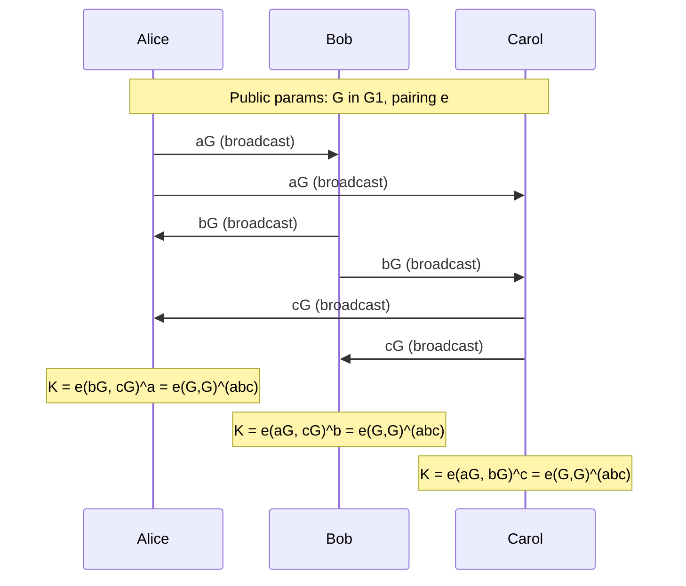

> **Prerequisites**: Elliptic curve group law, ECDLP và discrete logarithm, scalar multiplication, hash functions  
> **Lesson type**: Math-Component (hybrid với Scheme — BF-IBE, BLS, KZG)
>
> **Notation** (ký hiệu dùng mà không định nghĩa trong bài này):
> | Ký hiệu | Ý nghĩa |
> |---------|---------|
> | $E(\mathbb{F}_q)$ | Nhóm các điểm elliptic curve trên trường $\mathbb{F}_q$ |
> | $[n]P$ | Scalar multiplication: cộng $P$ với chính nó $n$ lần |
> | $\mathbb{F}_q^{\times}$ | Nhóm nhân của trường hữu hạn $\mathbb{F}_q$ (phần tử khác 0) |
> | $\mathsf{negl}(\lambda)$ | Hàm negligible theo security parameter $\lambda$ |
> | $\stackrel{R}{\leftarrow}$ | Lấy mẫu ngẫu nhiên đồng đều |
> | $H_1$ | Hàm hash vào $\mathbb{G}_1$ (hash-to-curve) |

---

## 1. Motivation

Mọi scheme asymmetric mà ta đã học — RSA, DH, ECDH, ECDSA — đều hoạt động trên **một** nhóm duy nhất. Nhưng điều gì xảy ra nếu ta có thể kết nối **hai nhóm** với nhau qua một ánh xạ có cấu trúc? Câu trả lời là pairing (phép ghép đôi), và hệ quả là một nhánh mật mã hoàn toàn mới.

Ba ứng dụng đặc biệt thuyết phục đã biến pairing-based cryptography thành một lĩnh vực trung tâm:

- **Identity-Based Encryption (2001):** Boneh-Franklin giải quyết bài toán 17 năm của Shamir — mã hóa với public key là chuỗi email, không cần certificate.
- **BLS Signature (2001):** Chữ ký có thể **aggregate** — $n$ chữ ký trên $n$ message được nén thành một chữ ký duy nhất, verify với một phép tính.
- **KZG Commitment (2010):** Polynomial commitment với kích thước constant — nền tảng của mọi zk-SNARK pairing-based và của KZG ceremony trong Ethereum.

Bài học này xây dựng khái niệm từ nền tảng toán học đến các scheme cụ thể.

---

## 2. Bilinear Pairing — Định nghĩa và Tính chất

### 2.1. Định nghĩa hình thức

> [!note] Definition 30.1 — Bilinear Pairing
> Cho $\mathbb{G}_1$, $\mathbb{G}_2$, $\mathbb{G}_T$ là ba nhóm cyclic có cùng bậc nguyên tố $r$. Một **bilinear pairing** (hay bilinear map) là ánh xạ:
>
> $$
> e : \mathbb{G}_1 \times \mathbb{G}_2 \to \mathbb{G}_T
> $$
>
> thỏa mãn ba tính chất:
>
> **Bilinearity:** Với mọi $P \in \mathbb{G}_1$, $Q \in \mathbb{G}_2$, $a, b \in \mathbb{Z}_r$:
>
> $$
> e([a]P,\, [b]Q) = e(P, Q)^{ab}
> $$
>
> Tương đương: $e(P + P', Q) = e(P,Q) \cdot e(P', Q)$ và $e(P, Q + Q') = e(P,Q) \cdot e(P, Q')$
>
> **Non-degeneracy:** Nếu $P \neq \mathcal{O}$ và $Q \neq \mathcal{O}$ thì $e(P, Q) \neq 1_{\mathbb{G}_T}$. Tức là ánh xạ không bị "collapsed" về 1.
>
> **Efficiency:** Có thuật toán thời gian đa thức để tính $e(P, Q)$.

Bilinearity là cốt lõi của sức mạnh pairing. Nó cho phép "di chuyển" scalar qua ánh xạ: nếu Alice biết $[a]P$ và Bob biết $[b]Q$, họ có thể **tính cùng một giá trị** $e(P,Q)^{ab}$ mà không cần biết scalar của nhau.

![[assets/img-30-pairing-map.png]]
*Ba nhóm trong pairing: $\mathbb{G}_1$ (source, curve over $\mathbb{F}_q$), $\mathbb{G}_2$ (source, curve over extension field), $\mathbb{G}_T$ (target, multiplicative group). Ánh xạ $e$ computed bằng Miller's algorithm.*

### 2.2. Phân loại pairing

Tùy theo quan hệ giữa $\mathbb{G}_1$ và $\mathbb{G}_2$, pairings được chia thành ba loại:

**Type 1 (Symmetric):** $\mathbb{G}_1 = \mathbb{G}_2$. Tồn tại trên supersingular curves. Đơn giản nhất nhưng có embedding degree nhỏ → ảnh hưởng bảo mật. Hiện nay ít dùng do các cuộc tấn công.

**Type 2 (Asymmetric, với isomorphism):** $\mathbb{G}_1 \neq \mathbb{G}_2$ nhưng tồn tại $\phi: \mathbb{G}_2 \to \mathbb{G}_1$ hiệu quả. Cho phép một số tối ưu hóa.

**Type 3 (Asymmetric, không có isomorphism):** $\mathbb{G}_1 \neq \mathbb{G}_2$ và không có isomorphism hiệu quả đã biết. Đây là loại **phổ biến nhất trong thực tế** (BN254, BLS12-381 đều là Type 3).

---

## 3. Embedding Degree và Pairing-Friendly Curves

### 3.1. Embedding degree

> [!note] Definition 30.2 — Embedding Degree
> Cho nhóm elliptic curve $E(\mathbb{F}_q)$ có subgroup bậc $r$. **Embedding degree** $k$ là số nguyên dương nhỏ nhất sao cho:
>
> $$
> r \mid (q^k - 1)
> $$

Điều này có nghĩa: $r$-torsion subgroup $E[r]$ nằm hoàn toàn trong $E(\mathbb{F}_{q^k})$. Pairing ánh xạ vào nhóm con bậc $r$ của $\mathbb{F}_{q^k}^{\times}$.

**Tại sao embedding degree quan trọng?**

- $k$ **quá nhỏ** (k = 1, 2): Pairing ánh xạ về $\mathbb{F}_q^{\times}$ hoặc $\mathbb{F}_{q^2}^{\times}$. DLP trong $\mathbb{G}_T$ dễ hơn nhiều → đây là nguyên lý của **MOV attack** (L18): nếu $k$ nhỏ, ECDLP bị reduced về DLP trong extension field → có thể dùng Index Calculus.
- $k$ **quá lớn**: Arithmetic trong $\mathbb{F}_{q^k}$ chậm, pairing không thực tế.
- $k$ **vừa phải** (k = 12 cho BN254, BLS12-381): Đủ bảo mật, đủ nhanh.

> [!warning] Attack — MOV/FR Reduction
> Nếu $E(\mathbb{F}_q)$ có embedding degree $k$ nhỏ, pairing $e: \mathbb{G} \times \mathbb{G} \to \mathbb{F}_{q^k}^{\times}$ biến ECDLP trong $\mathbb{G}$ thành DLP trong $\mathbb{F}_{q^k}^{\times}$. DLP trong finite field có sub-exponential algorithm (Index Calculus). Do đó các curve an toàn cho ECC thông thường (secp256k1 có $k \approx 2^{32}$) **không phù hợp** để xây dựng pairing — embedding degree quá lớn khiến pairing không tính được.

### 3.2. Pairing-friendly curves

**Pairing-friendly curves** là các curve được thiết kế để có embedding degree $k$ vừa đủ nhỏ để pairing thực tế, nhưng đủ lớn để bảo mật.

| Curve | $k$ | Bit security ước tính | Ghi chú |
|---|---|---|---|
| **BN254** | 12 | ~100 bit (đã giảm) | Ethereum Precompile, Zcash Sprout |
| **BLS12-381** | 12 | ~120 bit | Ethereum 2.0, Zcash Sapling/Orchard |
| **BLS12-377** | 12 | ~125 bit | Aleo, Zexe |
| **BLS24-477** | 24 | ~150 bit | High security |
| **BW6-761** | 6 | ~128 bit (trên GF(p)) | Companion curve cho BLS12-377 |

> [!info] Lưu ý về BN254
> Trước 2016, BN254 được cho là đạt 128-bit security. Tuy nhiên kết quả của Kim và Barbulescu (2016) sử dụng Extended Tower Number Field Sieve (ExTNFS) đã giảm security xuống còn khoảng 100 bit. BLS12-381 ra đời sau để thay thế với security margin tốt hơn.

---

## 4. Weil, Tate và Ate Pairing

Trong thực tế có nhiều cách xây dựng pairing cụ thể. Ba loại chính:

**Weil Pairing** ($e_r$): Dựa trên divisors và rational functions trên elliptic curve. Miller (1985) chứng minh có thể tính hiệu quả. Weil pairing là **symmetric**: $e_r(P, Q) = e_r(Q, P)^{-1}$, do đó $e_r(P, P) = 1$ — không dùng được dưới dạng symmetric pairing hiệu quả.

**Tate Pairing** ($\hat{t}_r$): Biến thể thực tế hơn Weil. Không symmetric. Dùng nhiều trong implementations đầu tiên. Tính bằng Miller's algorithm với **final exponentiation**: $\hat{t}_r(P, Q) = f_{r,P}(Q)^{(q^k - 1)/r}$.

**Ate Pairing** (và variants: Optimal Ate, R-ate): Cải tiến của Tate. Optimal Ate pairing rút ngắn Miller loop xuống còn $\log_2(t)$ iterations (với $t$ là trace of Frobenius) thay vì $\log_2(r)$ iterations — nhanh hơn đáng kể. Đây là **pairing được dùng trong thực tế** hiện nay (blst library, arkworks).

### 4.1. Miller's Algorithm

Miller's Algorithm là thuật toán tính pairing, hoạt động tương tự **double-and-add** cho scalar multiplication. Đầu vào: điểm $P \in \mathbb{G}_1$, $Q \in \mathbb{G}_2$. Đầu ra: $f \in \mathbb{F}_{q^k}^{\times}$ (trước final exponentiation).

```python
from py_ecc.bn128 import bn128, pairing, G1, G2, multiply, add

P = G1
Q = G2

e_PQ = pairing(Q, P)

a, b = 5, 7
lhs = pairing(multiply(Q, b), multiply(P, a))
rhs = pow(e_PQ, a * b, bn128.curve_order)
```

Cốt lõi Miller loop (pseudo-code, không chạy được):

```python
def miller_loop(P, Q, r):
    f = 1
    T = P
    for bit in bits_of(r)[1:]:
        f = f * f * line(T, T, Q)
        T = double(T)
        if bit == 1:
            f = f * line(T, P, Q)
            T = add(T, P)
    return f
```

Độ phức tạp: $O(\log r)$ iterations, mỗi iteration là double + một line function evaluation trong $\mathbb{F}_{q^k}$.

---

## 5. Hard Problems trong Pairing Setting

> [!note] Definition 30.4 — DBDH và BDH Assumption
> **Bilinear Diffie-Hellman (BDH) Problem:** Cho $(P, [a]P, [b]P, [c]P) \in \mathbb{G}_1^4$ (hoặc mixed $\mathbb{G}_1, \mathbb{G}_2$), tính $e(P, P)^{abc} \in \mathbb{G}_T$.
>
> **Decisional BDH (DBDH):** Phân biệt $(P, [a]P, [b]P, [c]P, e(P,P)^{abc})$ với $(P, [a]P, [b]P, [c]P, e(P,P)^z)$ với $z \stackrel{R}{\leftarrow} \mathbb{Z}_r$.
>
> **q-Strong Diffie-Hellman (q-SDH):** Cho $(\tau, [\tau]P, [\tau^2]P, \ldots, [\tau^q]P)$, tính một cặp $(c, [(\tau + c)^{-1}]P)$. Nền tảng bảo mật của BLS và KZG.

---

## 6. Joux's Three-Party Key Agreement

Đây là ứng dụng đầu tiên và đơn giản nhất của pairing trong cryptography (Antoine Joux, 2000). Ba bên Alice, Bob, Carol muốn agree trên shared key mà không trao đổi secret.



Mỗi bên tính shared key: $K = e(G, G)^{abc}$, nhưng qua đường khác nhau. Alice tính $e([b]G, [c]G)^a = e(G, G)^{bc \cdot a}$. Điều này **không thể làm** với DH thông thường (2-party) mà không cần thêm round.

> [!warning] Lưu ý bảo mật
> Joux's protocol là **unauthenticated** — không có xác thực, dễ bị MITM. Không dùng trực tiếp trong thực tế. Giá trị của nó là chứng minh pairing mở ra tính năng mới về nguyên tắc.

---

## 7. BLS Signature Scheme

BLS (Boneh-Lynn-Shacham, 2001) là signature scheme pairing-based quan trọng nhất, nổi tiếng vì **chữ ký rất nhỏ** và **khả năng aggregation**.

![[assets/img-30-bls-signature.png]]
*BLS signature flow: KeyGen sinh cặp $(x, V = [x]G_1)$; Sign hash message về $\mathbb{G}_2$ rồi scalar multiply; Verify dùng pairing equation.*

> [!note] Scheme — BLS Signature
> **Type**: Digital Signature
> **Setting**: Pairing $e: \mathbb{G}_1 \times \mathbb{G}_2 \to \mathbb{G}_T$ bậc $r$ nguyên tố, generator $G_1 \in \mathbb{G}_1$, hash-to-curve $H_1: \{0,1\}^* \to \mathbb{G}_2$
>
> **$\mathsf{KeyGen}(1^\lambda)$**
> - Chọn $x \stackrel{R}{\leftarrow} \mathbb{Z}_r^*$
> - Output: $\mathsf{sk} = x$, $\mathsf{pk} = V = [x]G_1 \in \mathbb{G}_1$
>
> **$\mathsf{Sign}(\mathsf{sk}, m)$**
> - Input: $\mathsf{sk} = x$, message $m \in \{0,1\}^*$
> - Tính $H = H_1(m) \in \mathbb{G}_2$
> - Tính $\sigma = [x]H \in \mathbb{G}_2$
> - Output: $\sigma \in \mathbb{G}_2$
>
> **$\mathsf{Verify}(\mathsf{pk}, m, \sigma)$**
> - Input: $\mathsf{pk} = V \in \mathbb{G}_1$, message $m$, signature $\sigma \in \mathbb{G}_2$
> - Tính $H = H_1(m) \in \mathbb{G}_2$
> - Kiểm tra: $e(G_1, \sigma) \stackrel{?}{=} e(V, H)$
> - Output: $1$ nếu đẳng thức thỏa, $0$ nếu không

> [!abstract] Theorem — Correctness of BLS
> Nếu $\sigma = [x]H$ được tính đúng từ $V = [x]G_1$, thì $\mathsf{Verify}$ accept.

**Proof.**

$$
e(G_1, \sigma) = e(G_1, [x]H) = e(G_1, H)^x = e([x]G_1, H) = e(V, H)
$$

Đẳng thức thứ hai và ba dùng bilinearity. $\blacksquare$

> [!abstract] Theorem — EUF-CMA Security (co-CDH assumption)
> BLS đạt EUF-CMA trong Random Oracle Model dưới **co-CDH assumption**: cho $([a]P, [b]Q)$ với $P \in \mathbb{G}_1$, $Q \in \mathbb{G}_2$, không thể tính $[ab]Q$ hiệu quả.

**Proof sketch.** Giả sử adversary $\mathcal{A}$ forge signature $(m^*, \sigma^*)$. Vì $H_1$ là random oracle, với xác suất không negligible, $\mathcal{A}$ query $H_1(m^*)$. Simulator đặt $H_1(m^*) = [b]Q$ với $Q \in \mathbb{G}_2$ và $b$ ẩn. Sau đó $\sigma^* = [x][b]Q$ cho phép recover $[xb]Q$ — giải co-CDH. $\square$

*(Chi tiết trong: Boneh, Lynn, Shacham — ASIACRYPT 2001; Journal of Cryptology 2004.)*

### 7.1. BLS Aggregation

Đặc tính nổi bật nhất của BLS là **aggregation** — tính năng làm cho nó trở thành chuẩn trong Ethereum 2.0 và các hệ thống blockchain khác.

**Signature aggregation:** $n$ người ký $n$ message khác nhau. Thay vì lưu $n$ chữ ký, tính:

$$
\sigma_{\text{agg}} = \sigma_1 + \sigma_2 + \cdots + \sigma_n = [x_1]H_1(m_1) + [x_2]H_1(m_2) + \cdots + [x_n]H_1(m_n)
$$

Verify aggregated signature:

$$
e(G_1, \sigma_{\text{agg}}) \stackrel{?}{=} \prod_{i=1}^n e(V_i, H_1(m_i))
$$

Từ $n$ pairings riêng lẻ (n verify) → $1 + n$ pairings (1 pairing bên trái, $n$ bên phải). Với Ethereum validator set có hàng trăm nghìn validators, tiết kiệm này là cực kỳ quan trọng.

> [!warning] Rogue Key Attack
> Nếu tất cả người ký ký cùng một message, kẻ tấn công có thể gửi $V_{\text{evil}} = [x_{\text{evil}}]G_1 - \sum_{i \neq \text{evil}} V_i$. Khi đó aggregate key $\sum V_i = [x_{\text{evil}}]G_1$ bị kiểm soát bởi attacker.
>
> **Mitigation:** Proof of Possession (PoP) — mỗi người ký phải cung cấp BLS signature trên public key của mình trước khi tham gia aggregation.

---

## 8. Boneh-Franklin IBE

IBE (Identity-Based Encryption) của Boneh và Franklin (2001) giải quyết vấn đề Shamir đặt ra năm 1984: mã hóa dùng email address làm public key, không cần certificate.

Hệ thống có 4 thuật toán: **Setup** (PKG — Private Key Generator sinh master key), **Extract** (PKG cấp private key cho user dựa trên identity), **Encrypt** (sender mã hóa dùng identity), **Decrypt** (receiver giải mã dùng private key).

> [!note] Scheme — Boneh-Franklin IBE (BasicIdent)
> **Type**: Identity-Based Encryption
> **Setting**: Pairing $e: \mathbb{G}_1 \times \mathbb{G}_1 \to \mathbb{G}_T$ (Type 1), generator $P \in \mathbb{G}_1$, hash functions $H_1: \{0,1\}^* \to \mathbb{G}_1$, $H_2: \mathbb{G}_T \to \{0,1\}^n$
>
> **$\mathsf{Setup}(1^\lambda)$**
> - PKG chọn $s \stackrel{R}{\leftarrow} \mathbb{Z}_r^*$ (master secret key)
> - Tính $P_{\mathsf{pub}} = [s]P$
> - Output: params $= (P, P_{\mathsf{pub}}, H_1, H_2)$; master-key $= s$
>
> **$\mathsf{Extract}(\mathsf{ID})$**
> - Input: identity string $\mathsf{ID}$ (e.g., email address)
> - PKG tính $Q_{\mathsf{ID}} = H_1(\mathsf{ID}) \in \mathbb{G}_1$
> - Tính private key $d_{\mathsf{ID}} = [s]Q_{\mathsf{ID}} \in \mathbb{G}_1$
> - Output: $d_{\mathsf{ID}}$
>
> **$\mathsf{Encrypt}(\mathsf{ID}, m)$**
> - Input: identity $\mathsf{ID}$, message $m \in \{0,1\}^n$
> - Tính $Q_{\mathsf{ID}} = H_1(\mathsf{ID})$
> - Chọn $r \stackrel{R}{\leftarrow} \mathbb{Z}_r^*$; tính $g_{\mathsf{ID}} = e(Q_{\mathsf{ID}}, P_{\mathsf{pub}}) \in \mathbb{G}_T$
> - Output: ciphertext $C = ([r]P,\; m \oplus H_2(g_{\mathsf{ID}}^r))$
>
> **$\mathsf{Decrypt}(d_{\mathsf{ID}}, C)$**
> - Input: $d_{\mathsf{ID}}$, $C = (U, V)$ với $U \in \mathbb{G}_1$, $V \in \{0,1\}^n$
> - Tính $e(d_{\mathsf{ID}}, U) = e([s]Q_{\mathsf{ID}},\, [r]P) = e(Q_{\mathsf{ID}}, P)^{sr} = g_{\mathsf{ID}}^r$
> - Output: $m = V \oplus H_2(e(d_{\mathsf{ID}}, U))$

**Correctness:** Decrypt recover đúng $m$ vì $e(d_{\mathsf{ID}}, U) = e([s]Q_{\mathsf{ID}}, [r]P) = e(Q_{\mathsf{ID}}, P)^{sr} = g_{\mathsf{ID}}^r$ và $V \oplus H_2(g_{\mathsf{ID}}^r) \oplus H_2(g_{\mathsf{ID}}^r) = m$.

> [!tip] Ý nghĩa thực tế của IBE
> Trong PKI truyền thống: Alice gửi email cho Bob → cần biết certificate của Bob → cần CA → có thể bị expire. Với IBE: Alice encrypt với "bob@company.com", Bob contact PKG, PKG verify identity (qua password, 2FA, ...) và cấp private key. Không cần certificate, không cần Bob đã setup key trước.

---

## 9. KZG Polynomial Commitment

KZG (Kate, Zaverucha, Goldberg, 2010) là polynomial commitment scheme nền tảng của Ethereum KZG ceremony (EIP-4844) và nhiều zk-SNARK.

### 9.1. Polynomial commitment là gì?

Committer muốn commit một polynomial $f(x)$ mà không reveal. Sau đó, với query $z$, cung cấp **opening proof** chứng minh $f(z) = v$ mà không reveal toàn bộ $f$.

> [!note] Scheme — KZG Polynomial Commitment
> **Type**: Polynomial Commitment Scheme
> **Setting**: Pairing $e: \mathbb{G}_1 \times \mathbb{G}_2 \to \mathbb{G}_T$, generators $G_1, G_2$; **trusted setup** (SRS) $([τ^i]G_1)_{i=0}^d$ và $[τ]G_2$ với $τ$ ẩn sau ceremony
>
> **$\mathsf{Setup}(1^\lambda, d)$**
> - Ceremony sinh $\tau \stackrel{R}{\leftarrow} \mathbb{Z}_r^*$ (toxic waste — phải destroy)
> - SRS $= (\,[G_1], [\tau]G_1, [\tau^2]G_1, \ldots, [\tau^d]G_1,\; [G_2], [\tau]G_2\,)$
> - Output: SRS (không ai biết $\tau$)
>
> **$\mathsf{Commit}(f)$**
> - Input: polynomial $f(x) = \sum_{i=0}^d a_i x^i$ với $\deg(f) \le d$
> - Tính $C = f(\tau) \cdot G_1 = \sum_{i=0}^d a_i [\tau^i]G_1 \in \mathbb{G}_1$
> - Output: commitment $C \in \mathbb{G}_1$
>
> **$\mathsf{Open}(f, z)$**
> - Input: $f$, evaluation point $z \in \mathbb{Z}_r$
> - Tính $v = f(z)$
> - Tính quotient polynomial: $q(x) = \frac{f(x) - v}{x - z}$ (chia hết vì $f(z) = v$)
> - Tính proof $\pi = q(\tau) \cdot G_1 \in \mathbb{G}_1$
> - Output: $(v, \pi)$
>
> **$\mathsf{Verify}(C, z, v, \pi)$**
> - Kiểm tra bằng pairing equation:
>
> $$
> e(\pi,\; [\tau]G_2 - [z]G_2) \stackrel{?}{=} e(C - [v]G_1,\; G_2)
> $$
>
> - Output: $1$ nếu đẳng thức thỏa

> [!abstract] Theorem — Correctness of KZG
> Nếu $\pi = [q(\tau)]G_1$ với $q(x) = (f(x) - v)/(x-z)$, thì Verify accept.

**Proof.**

$$
e([q(\tau)]G_1,\; [\tau - z]G_2) = e(G_1, G_2)^{q(\tau)(\tau - z)} = e(G_1, G_2)^{f(\tau) - v} = e([f(\tau)]G_1 - [v]G_1, G_2)
$$

Đẳng thức thứ hai dùng $q(\tau)(\tau - z) = f(\tau) - v$ (từ định nghĩa $q$). $\blacksquare$

> [!warning] Binding Security và Trusted Setup
> KZG binding dựa trên **q-SDH assumption**: không thể tạo opening proof giả mà không biết $\tau$. Tuy nhiên, nếu $\tau$ bị lộ (toxic waste chưa destroy), bất kỳ ai biết $\tau$ có thể tạo fake commitment và fake proof cho bất kỳ polynomial nào.
>
> **Powers of Tau ceremony** (Ethereum, Zcash) dùng Multi-Party Computation: $n$ participant, mỗi người thêm randomness vào SRS. Chỉ cần 1 participant honest → $\tau$ không bị recover.

> [!tip] Ứng dụng trong EIP-4844 (Proto-Danksharding)
> Ethereum sử dụng KZG commitment để commit data blobs trong blob-carrying transactions. Mỗi blob (128 KB dữ liệu) được commit thành một $G_1$ element (48 bytes). Verification dùng pairing equation trên BLS12-381. Đây là bước đầu tiên đến Danksharding full.

---

## 10. Optimal Ate Pairing — Hiệu quả trong thực tế

Trong phần trước đã đề cập Optimal Ate là pairing được dùng thực tế. Phần này đi sâu vào lý do tại sao nó nhanh hơn và được triển khai ra sao.

### 10.1. Miller Loop Optimization

**Weil/Tate pairing** tiêu chuẩn chạy Miller loop với độ dài $O(\log r)$ iterations, với $r \approx 2^{255}$ cho BLS12-381. **Optimal Ate pairing** rút ngắn Miller loop xuống $O(\log t)$ iterations, với $t$ là *trace of Frobenius*:

$$
t = q + 1 - \#E(\mathbb{F}_q)
$$

| Pairing | Miller loop length | BLS12-381 iterations | Speedup |
|---|---|---|---|
| Weil | $O(\log r)$ | ~255 bits | baseline |
| Tate | $O(\log r)$ | ~255 bits | ~1x |
| Ate | $O(\log t)$ | ~64 bits | ~4x |
| **Optimal Ate** | $O(\log t)$ | ~64 bits | **~4x** |

Với BLS12-381: $r \approx 2^{255}$ nhưng $t \approx 2^{64}$, nên Optimal Ate nhanh hơn khoảng **4 lần** so với Weil pairing.

### 10.2. Final Exponentiation

Sau Miller loop, kết quả $f \in \mathbb{F}_{q^{12}}^{\times}$ chưa phải phần tử canonical trong $\mathbb{G}_T$. Phải raise lên lũy thừa $(q^{12} - 1)/r$ để ép về subgroup bậc $r$:

$$
e(P, Q) = f_{t,P}(Q)^{(q^{12} - 1)/r}
$$

Exponentiation này được tách thành hai phần để tối ưu:

```
Final exp = Easy part × Hard part

Easy part:  f^(q^6 - 1) · f^(q^2 + 1)      ← chỉ dùng Frobenius + nghịch đảo
Hard part:  f^((q^4 - q^2 + 1)/r)           ← dùng addition chain tối ưu
```

*Easy part* sử dụng Frobenius endomorphism (tính rất nhanh trong tower field), *hard part* dùng addition chain với NAF representation để giảm số phép nhân.

### 10.3. Performance thực tế

```python
# blst library (Ethereum) — BLS12-381 Optimal Ate pairing
# ~600 microseconds per single pairing trên Intel Ice Lake

# Multi-pairing: batch Miller loops trước final exponentiation
# e(P1,Q1) * e(P2,Q2) * ... * e(Pn,Qn)
# = miller(P1,Q1) * miller(P2,Q2) * ... * miller(Pn,Qn)  ^(final_exp)
#                                                          ^^^^^^^^^^^
#                                           chỉ một final_exp thay vì n cái

# Tiết kiệm: final_exp chiếm ~30-40% thời gian pairing
# Với n pairings: n * miller_loop + 1 * final_exp (thay vì n * full_pairing)
```

**Multi-pairing optimization:** Khi cần tính $\prod_i e(P_i, Q_i)$ (như trong BLS aggregation verify), ta batch tất cả Miller loops trước rồi chỉ thực hiện **một** final exponentiation duy nhất. Vì final exponentiation chiếm ~30–40% tổng thời gian, tiết kiệm là đáng kể khi $n$ lớn.

> [!tip] `blst` library
> `blst` (Basic Library for Schnorr and pairing-based signatures) là thư viện C được Supranational phát triển, sử dụng bởi Ethereum consensus layer (lighthouse, teku, prysm). Đạt ~600 µs/pairing nhờ kết hợp: assembly tối ưu cho Fp12 arithmetic, Optimal Ate với NAF Miller loop, và pipeline-friendly final exponentiation.

---

## 11. Powers of Tau Ceremony — Thiết lập độ tin cậy

KZG commitments và Groth16 đều cần **Structured Reference String (SRS)** — một danh sách các điểm elliptic curve liên quan đến một giá trị bí mật $\tau$. Làm thế nào để tạo SRS mà không ai biết $\tau$?

### 11.1. Tại sao cần ceremony?

SRS của KZG có dạng:
$$
\mathsf{SRS} = \bigl([G_1],\; [\tau]G_1,\; [\tau^2]G_1,\; \ldots,\; [\tau^d]G_1,\; [G_2],\; [\tau]G_2\bigr)
$$

Giá trị $\tau$ được gọi là **toxic waste** — nếu bất kỳ ai biết $\tau$, họ có thể forge bất kỳ commitment nào. Vấn đề: ai sẽ sinh $\tau$ và đảm bảo nó bị destroy?

### 11.2. Multi-Party Ceremony Protocol

```
Participant 1: chọn r_1 ngẫu nhiên
               SRS_1 = SRS_0^{r_1}  (mỗi điểm nhân với r_1)
               destroy r_1, publish SRS_1

Participant 2: chọn r_2 ngẫu nhiên
               SRS_2 = SRS_1^{r_2}
               destroy r_2, publish SRS_2

...

Participant n: chọn r_n ngẫu nhiên
               SRS_final = SRS_{n-1}^{r_n}
               destroy r_n, publish SRS_final

Kết quả: tau_final = r_1 * r_2 * ... * r_n
Bảo mật: an toàn nếu ÍT NHẤT 1 participant honest và destroy randomness
```

**Xác minh tính hợp lệ của từng contribution:** Participant $i$ publish $([\tau_i]G_1,\; [\tau_i]G_2)$ và mọi người kiểm tra:

$$
e\!\left([\tau_i]G_1,\; G_2\right) \stackrel{?}{=} e\!\left(G_1,\; [\tau_i]G_2\right)
$$

Pairing check này đảm bảo participant đã dùng *cùng một* $\tau_i$ cho cả hai nhóm — không thể cheat bằng cách publish hai giá trị không liên quan.

### 11.3. Các ceremony lớn

| Ceremony | Năm | Số participants | Mục đích |
|---|---|---|---|
| **Ethereum KZG Ceremony** | 2023 | **141,416** | EIP-4844 blob transactions |
| Zcash Sprout (MPC) | 2016 | 6 | Groth16 SRS cho Zcash |
| Zcash Sapling | 2018 | ~90 | SRS cho Sapling upgrade |
| **Perpetual Powers of Tau** | 2019–nay | Ongoing | ZK community, open-source |

> [!note] Ethereum KZG Ceremony (2023)
> Ceremony tại `ceremony.ethereum.org` — largest MPC ceremony ever conducted với 141,416 participants. Đây là phần của **EIP-4844** (proto-danksharding / blob transactions), cho phép L2 rollups đăng dữ liệu rẻ hơn ~10–100x. Mỗi participant thêm entropy riêng; chỉ cần 1/141,416 người honest là $\tau$ hoàn toàn không bị biết.

> [!info] Perpetual Powers of Tau (PPOT)
> **PPOT** (github.com/weijiekoh/perpetualpowersoftau) là ceremony open-source ongoing cho ZK community rộng hơn. Bất kỳ ai cũng có thể join bất cứ lúc nào. Đây là **updatable SRS**: ngay cả sau ceremony ban đầu, participant mới vẫn có thể update SRS và tăng cường bảo mật. Miễn là một updater bất kỳ honest, SRS an toàn.

---

## 12. Groth-Sahai Proofs và NIWI

Trước Groth16 và các zk-SNARK hiện đại, **Groth-Sahai proofs** (2008) là hệ thống proof pairing-based quan trọng nhất — đặc biệt cho các statements tự nhiên biểu diễn được dưới dạng phương trình bilinear.

### 12.1. NIWI vs NIZK

> [!note] Định nghĩa — NIWI (Non-Interactive Witness-Indistinguishable)
> Proof system $(P, V)$ là **NIWI** nếu:
> - **Soundness**: Không thể prove statement sai (với xác suất negligible)
> - **Witness Indistinguishability**: Với hai valid witnesses $w_0, w_1$ cho cùng statement $x$, verifier không thể phân biệt proof được tạo từ $w_0$ hay $w_1$
>
> NIWI **yếu hơn** ZK: verifier biết statement đúng (vì proof hợp lệ), chỉ không biết witness *nào* được dùng — nhưng vẫn có thể học được thông tin về witness từ proof.

| Property | NIZK | NIWI | GS Proofs |
|---|---|---|---|
| Soundness | ✓ | ✓ | ✓ (perfectly sound) |
| Zero-knowledge | ✓ | ✗ | ✗ |
| Witness-indistinguishable | ✓ (implied) | ✓ | ✓ (computational, SXDH/DLIN) |
| Overhead vs GS | Higher | — | Baseline |

### 12.2. Groth-Sahai Framework

Groth-Sahai proofs (Groth & Sahai, Eurocrypt 2008) cung cấp NIWI cho các phương trình trong bilinear groups:

```
Các loại phương trình GS hỗ trợ:

1. Linear equations over G1/G2:
   Σ a_i * X_i = T    (X_i là witness elements trong G1)

2. Multi-scalar multiplication equations:
   Σ a_i * X_i + Σ y_j * B_j = T   (mix scalars và group elements)

3. Pairing product equations:
   ∏ e(X_i, Y_j)^γ_ij * ∏ e(X_i, B_j) * ∏ e(A_i, Y_j) = t_T
   (X_i ∈ G1, Y_j ∈ G2 là witnesses; A_i, B_j là constants)
```

Với mỗi loại phương trình, GS proofs cung cấp commitment cho từng witness variable, sau đó proof rằng commitments satisfy phương trình — tất cả non-interactive.

**Bảo mật:** GS proofs là *perfectly sound* và *computationally witness-indistinguishable* dưới **SXDH assumption** (trên asymmetric pairing) hoặc **DLIN assumption** (trên symmetric pairing).

### 12.3. Use Cases

**Anonymous credentials:** Prove "tôi có valid credential từ issuer X" mà không reveal credential nào. Biểu diễn dưới dạng pairing product equation: $e(\mathsf{sk}, \mathsf{pk}_{\text{issuer}}) = e(\mathsf{credential}, G_2)$.

**Group signatures:** Prove membership trong group và rằng chữ ký hợp lệ, không reveal identity cụ thể. Dùng trong Boyen-Waters và Camenisch-Lysyanskaya (CL) signature systems.

**Relationship với ZKP hiện đại:**

```
General-purpose ZKP (Groth16, PLONK, STARKs)
├── Pro: prove bất kỳ NP statement nào
├── Pro: zero-knowledge
└── Con: circuit compilation phức tạp, overhead lớn hơn

Groth-Sahai Proofs
├── Pro: prove bilinear equations directly — không cần circuit
├── Pro: perfectly sound, simpler to implement cho đúng loại statement
└── Con: chỉ NIWI (không ZK), chỉ cho statements biểu diễn dưới dạng bilinear equations
```

> [!tip] Khi nào dùng GS thay vì Groth16?
> Nếu statement tự nhiên là "tôi biết $(x, y)$ sao cho $e(xG_1, yG_2) = T$" — dùng GS proofs: đơn giản, không cần trusted setup riêng ngoài pairing parameters, sound perfectly. Nếu statement phức tạp hơn (arithmetic circuit), dùng Groth16/PLONK.

---

## 13. Tóm tắt và CTF Relevance

> [!info] Bản đồ pairing-based cryptography
> Pairing mở ra ba loại tính năng mới so với ECC thông thường:
> **1.** Ánh xạ "đồng chiều" $e(aP, bQ) = e(P,Q)^{ab}$ — tạo ra IBE, BLS aggregation, Joux's 3-party DH.
> **2.** Polynomial commitment kích thước constant — nền tảng của mọi zk-SNARK pairing-based.
> **3.** MOV attack — biến ECDLP thành DLP trong extension field (double-edged sword: nguy hiểm nếu $k$ nhỏ).

**CTF Relevance: ⭐⭐**

Pairing trực tiếp xuất hiện ít trong CTF thông thường nhưng có trong **advanced/research CTF** (PlaidCTF, HITCON). Các dạng bài gặp:

- **MOV attack implementation**: curve có embedding degree nhỏ → dùng pairing reduce ECDLP về DLP.
- **KZG opening forgery**: khi $\tau$ bị lộ một phần.
- **BLS signature aggregation edge cases**: rogue key attack, missing PoP.

> [!example] CTF Pattern — MOV Attack
> Gặp ECC challenge → kiểm tra embedding degree:
> ```python
> from py_ecc.bn128 import bn128, pairing, G1, G2, multiply
>
> p = curve_order
> E = EllipticCurve(GF(q), [a, b])
> r = E.order()
> k = GF(r)(q).multiplicative_order()
> if k <= 6:
>     print("MOV attack applicable!")
> ```
> Nếu $k$ nhỏ, dùng pairing để map ECDLP → DLP trong $\mathbb{F}_{q^k}^{\times}$, rồi dùng Pohlig-Hellman hoặc Index Calculus.

---

## 14. References

- Boneh, D., Franklin, M. — *Identity-Based Encryption from the Weil Pairing*, CRYPTO 2001; SIAM J. Computing 2003
- Boneh, D., Lynn, B., Shacham, H. — *Short Signatures from the Weil Pairing*, ASIACRYPT 2001; Journal of Cryptology 2004
- Kate, A., Zaverucha, G., Goldberg, I. — *Constant-Size Commitments to Polynomials*, ASIACRYPT 2010
- Menezes, A. — *An Introduction to Pairing-Based Cryptography* (uwaterloo.ca) — survey paper
- Tomescu, A. — *Pairings or Bilinear Maps* (alinush.github.io) — excellent accessible introduction
- Boneh & Shoup — *A Graduate Course in Applied Cryptography*, Ch. 15–16 (toc.cryptobook.us)
- BLS12-381 specification: https://hackmd.io/@benjaminion/bls12-381
