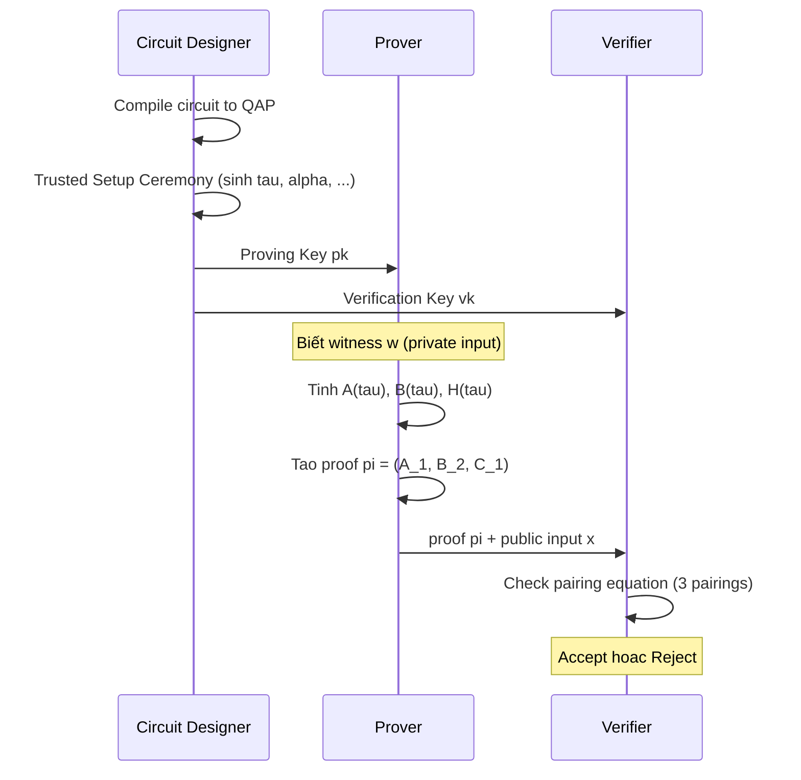
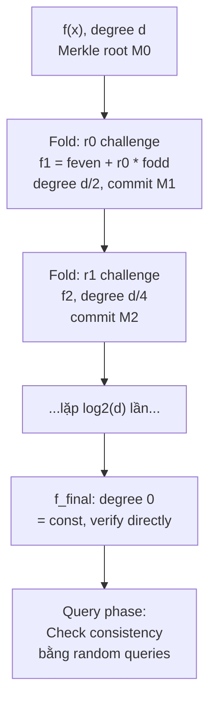

> **Prerequisites**: Schnorr identification protocol (tùy chọn), hash functions, elliptic curves cơ bản, pairing overview (cho phần zk-SNARK)  
> **Lesson type**: Foundation (hybrid Protocol — Sigma-protocols, Scheme — Groth16/STARK survey)
>
> **Notation** (ký hiệu dùng mà không định nghĩa trong bài này):
> | Ký hiệu | Ý nghĩa |
> |---------|---------|
> | $\mathbb{G}$ | Cyclic group bậc nguyên tố $q$ |
> | $g$ | Generator của $\mathbb{G}$ |
> | $\mathbb{Z}_q$ | Vành số nguyên modulo $q$ |
> | $H$ | Hàm hash, modeled as random oracle |
> | $e(\cdot, \cdot)$ | Bilinear pairing (L30) |
> | $\mathsf{negl}(\lambda)$ | Negligible function của security parameter |
> | $\mathcal{A}$ | Adversary (probabilistic polynomial-time) |
> | $\mathcal{L}$ | NP language (tập statement hợp lệ) |

---

## 1. Motivation

Tưởng tượng bạn muốn thuyết phục ngân hàng rằng bạn biết password của tài khoản — **mà không tiết lộ password đó**. Hoặc: bạn muốn chứng minh số tiền trong ví crypto của bạn đủ để thực hiện giao dịch — mà không lộ số dư. Hoặc: bạn muốn chứng minh đã thực thi một computation đúng mà không buộc verifier phải re-execute toàn bộ.

Đây là bài toán **Zero-Knowledge Proof (ZKP)** giải quyết: prove một statement mà không leak witness.

Khái niệm được Goldwasser, Micali và Rackoff đặt ra năm 1985, ban đầu là theoretical. Ngày nay ZKP là nền tảng của **zkRollups** (Ethereum Layer 2), **anonymous cryptocurrency** (Zcash), **private smart contracts**, và đang trở thành công nghệ trung tâm của Web3.

---

## 2. Ba Tính chất Cốt lõi

> [!note] Definition 31.1 — Zero-Knowledge Proof System
> Một ZKP system cho ngôn ngữ $\mathcal{L}$ (tập statement đúng) là một interactive protocol giữa **Prover** $P$ và **Verifier** $V$, thỏa mãn:
>
> **Completeness:** Nếu statement $x \in \mathcal{L}$ và Prover trung thực (biết witness $w$), thì Verifier chấp nhận với xác suất 1 (hoặc overwhelming probability):
>
> $$
> \Pr[\langle P(x, w), V(x) \rangle = 1] = 1
> $$
>
> **Soundness:** Nếu statement $x \notin \mathcal{L}$ (false), thì **không** Prover gian lận nào có thể thuyết phục Verifier chấp nhận, ngoại trừ với probability negligible:
>
> $$
> \forall P^*, \quad \Pr[\langle P^*(x), V(x) \rangle = 1] \le \mathsf{negl}(\lambda)
> $$
>
> **Zero-Knowledge:** Verifier không học thêm bất kỳ thông tin nào ngoài "statement is true". Chính thức: tồn tại simulator $S$ (không biết witness $w$) có thể sinh transcript indistinguishable với transcript thật:
>
> $$
> \{\langle P(x, w), V^*(x) \rangle\} \approx_c \{S(x)\}
> $$
>
> Ký hiệu $\approx_c$: computationally indistinguishable.

**Proof of Knowledge (PoK)** là ZKP với thêm một tính chất: tồn tại **extractor** $E$ có thể extract witness $w$ từ bất kỳ Prover nào succeed với probability nonnegligible. Điều này đảm bảo Prover thực sự *biết* witness, không chỉ chứng minh statement đúng theo một cách khác.

Phân biệt:
- **ZKP**: chứng minh statement đúng, giữ bí mật witness.
- **PoK**: chứng minh *biết* witness cụ thể.
- **NIZK**: Non-Interactive ZKP — không cần nhiều round.
- **zk-SNARK**: Succinct NIZK Argument of Knowledge — proof rất ngắn, verify nhanh.

---

## 3. Sigma Protocols — Interactive ZKP

### 3.1. Cấu trúc 3-move

Sigma protocol (Σ-protocol) là loại interactive ZKP đơn giản và nền tảng nhất. Tên "Sigma" vì cấu trúc 3 bước giống chữ Σ.

![[assets/img-31-sigma-protocol.png]]
*Sigma protocol: 3 bước commit-challenge-response. Prover biết witness $x$, muốn chứng minh biết $x$ với $X = g^x$ mà không tiết lộ $x$. Correctness: $g^s \cdot X^c = g^{k - xc} \cdot g^{xc} = g^k = R$.*

> [!note] Definition 31.2 — Sigma Protocol for Discrete Log
> **Relation:** $\mathcal{R} = \{(X, x) : X = g^x\}$ — biết DL của $X$.
>
> **$\mathsf{Commit}:$** $P$ chọn $k \stackrel{R}{\leftarrow} \mathbb{Z}_q$, tính $R = g^k$, gửi $R$.
>
> **$\mathsf{Challenge}:$** $V$ chọn $c \stackrel{R}{\leftarrow} \mathbb{Z}_q$, gửi $c$.
>
> **$\mathsf{Response}:$** $P$ tính $s = k - x \cdot c \pmod{q}$, gửi $s$.
>
> **$\mathsf{Verify}:$** $V$ accept nếu $g^s \cdot X^c = R$.

> [!abstract] Theorem — Sigma Protocol là ZKP
> Sigma protocol cho DL thỏa mãn:
> **Completeness:** $g^s \cdot X^c = g^{k - xc} \cdot g^{xc} = g^k = R$. ✓
>
> **Special Soundness:** Nếu tồn tại hai accepting transcripts $(R, c, s)$ và $(R, c', s')$ với $c \neq c'$, thì có thể extract $x = (s - s')(c - c')^{-1} \pmod{q}$.
>
> **Honest-Verifier Zero-Knowledge (HVZK):** Simulator chọn $c, s$ ngẫu nhiên, tính $R = g^s \cdot X^c$. Transcript $(R, c, s)$ có cùng distribution với transcript thật.

**Proof (Special Soundness).** Từ hai transcripts: $s = k - xc$ và $s' = k - xc'$. Trừ: $s - s' = x(c' - c)$. Do $c \neq c'$ nên $(c' - c)$ có nghịch đảo mod $q$, suy ra $x = (s - s')(c' - c)^{-1} \pmod{q}$. $\blacksquare$

### 3.2. Chaum-Pedersen Protocol

Một Sigma protocol quan trọng khác: chứng minh **equality of discrete logs** (DLEQ).

**Relation:** Biết $x$ sao cho $X = g^x$ **và** $Y = h^x$ (cùng $x$ trong hai group khác nhau).

**Ứng dụng:** Verifiable Random Functions (VRF), anonymous credentials, ElGamal re-encryption proofs.

Protocol:
1. $P$ chọn $k \stackrel{R}{\leftarrow} \mathbb{Z}_q$; tính $A = g^k$, $B = h^k$; gửi $(A, B)$.
2. $V$ gửi $c \stackrel{R}{\leftarrow} \mathbb{Z}_q$.
3. $P$ tính $s = k - xc \pmod{q}$; gửi $s$.
4. $V$ accept nếu $g^s \cdot X^c = A$ **và** $h^s \cdot Y^c = B$.

---

## 4. Fiat-Shamir Transform

Interactive ZKP yêu cầu nhiều round — không phù hợp cho nhiều ứng dụng. **Fiat-Shamir heuristic** biến interactive ZKP thành **Non-Interactive ZKP (NIZK)** bằng cách thay challenge của Verifier bằng hash.

> [!note] Definition 31.4 — Fiat-Shamir Transform
> Cho Sigma protocol $(P, V)$ với 3 bước $(commit, challenge, response)$. **Fiat-Shamir transform** tạo NIZK $(P', V')$:
>
> **$P'(x, w):$**
> - Tính commitment $R$ (như bước 1 của $P$)
> - Tính challenge $c = H(x \| R)$ — hash của statement và commitment
> - Tính response $s$ (như bước 3 của $P$ với challenge $c$)
> - Output proof: $\pi = (R, s)$
>
> **$V'(x, \pi):$**
> - Parse $\pi = (R, s)$
> - Tính $c = H(x \| R)$
> - Verify như bước 4 của $V$

> [!abstract] Theorem — Fiat-Shamir NIZK là Sound (Random Oracle Model)
> Nếu Sigma protocol có soundness error $\epsilon$ và $H$ là random oracle, thì Fiat-Shamir transform cho NIZK có soundness: $\Pr[\text{forger succeeds}] = O(\epsilon + Q_H / q)$ với $Q_H$ là số hash queries.

**Proof sketch.** Adversary query random oracle $H$ để "tìm" challenge tốt. Mỗi query là một attempt. Với $Q_H$ queries, xác suất tìm được challenge hữu ích là $O(Q_H/q)$. Nếu adversary forge với probability cao hơn, áp dụng Forking Lemma để extract witness — mâu thuẫn soundness của Sigma protocol. $\square$

*(Fiat, Shamir — CRYPTO 1986; Pointcheval, Stern — Journal of Cryptology 2000.)*

> [!warning] Lỗi phổ biến khi implement Fiat-Shamir
> **Hash phải cover toàn bộ context:** $c = H(\text{statement} \| \text{commitment})$, không chỉ commitment. Nếu hash chỉ dùng commitment: adversary có thể chọn commitment sau khi thấy challenge — phá soundness hoàn toàn. Đây là lỗi thực tế trong nhiều protocol (xem: "How not to prove yourself", Bernhard et al. 2012).

---

## 5. Từ Interactive đến zk-SNARK

### 5.1. Vấn đề với Sigma-protocols

Sigma protocols tốt cho discrete-log-based statements nhưng **không expressible** với arbitrary computations. Để prove "Tôi biết $w$ sao cho SHA-256 của $w$ là $h$" cần cách khác.

Hướng tiếp cận: **arithmetize** computation thành polynomial equations, rồi prove các equations đó bằng polynomial commitment.

### 5.2. Arithmetic Circuits và R1CS

Mọi computation có thể biểu diễn dưới dạng **arithmetic circuit** — mạng lưới các phép cộng và nhân trong trường hữu hạn $\mathbb{F}_p$.

**R1CS (Rank-1 Constraint System):** Một cách encode computation dưới dạng hệ phương trình:

$$
\mathbf{a}_i \cdot \mathbf{z} \times \mathbf{b}_i \cdot \mathbf{z} = \mathbf{c}_i \cdot \mathbf{z}, \quad i = 1, \ldots, m
$$

Với $\mathbf{z}$ là vector gồm input, output và intermediate values. Mỗi constraint tương ứng một cổng nhân trong circuit.

**QAP (Quadratic Arithmetic Program):** Chuyển hệ R1CS thành polynomial equality. Với Lagrange interpolation, encode mỗi "cột" của R1CS thành một polynomial. R1CS có nghiệm khi và chỉ khi:

$$
A(x) \cdot B(x) - C(x) = H(x) \cdot Z(x)
$$

Với $Z(x)$ là vanishing polynomial, $H(x)$ là quotient. Prover prove biết $H$ thỏa mãn equation này.

> [!tip] Hiểu QAP theo cách đơn giản
> R1CS là một "bảng" hệ phương trình. QAP "nén" bảng này thành một polynomial equality. Thay vì check $m$ phương trình, chỉ cần check một polynomial identity — compact hơn nhiều.

### 5.3. Groth16 — zk-SNARK nền tảng

Groth16 (Groth, 2016) là zk-SNARK được dùng nhiều nhất: proof size 3 group elements (~192 bytes trên BLS12-381), verification chỉ cần 3 pairing operations — nhanh nhất trong các scheme đã biết.

> [!note] Scheme — Groth16 (overview)
> **Type**: zk-SNARK
> **Setting**: Pairing $e: \mathbb{G}_1 \times \mathbb{G}_2 \to \mathbb{G}_T$, QAP $(A, B, C, Z)$ encoding computation
>
> **$\mathsf{Setup}(1^\lambda, \text{circuit})$**
> - Ceremony sinh toxic waste $(\alpha, \beta, \gamma, \delta, \tau)$
> - Output: CRS (Common Reference String) — proving key $\mathsf{pk}$ và verification key $\mathsf{vk}$
> - Mỗi circuit cần ceremony riêng (per-circuit setup)
>
> **$\mathsf{Prove}(\mathsf{pk}, x, w)$**
> - Input: public input $x$, private witness $w$
> - Tính $A(τ), B(τ), C(τ), H(τ)$ theo QAP
> - Chọn $r, s \stackrel{R}{\leftarrow} \mathbb{Z}_r$ (blinding factors)
> - Output: proof $\pi = ([A]_1, [B]_2, [C]_1) \in \mathbb{G}_1 \times \mathbb{G}_2 \times \mathbb{G}_1$
>
> **$\mathsf{Verify}(\mathsf{vk}, x, \pi)$**
> - Input: vk, public input $x$, proof $\pi = ([\mathbf{A}], [\mathbf{B}], [\mathbf{C}])$
> - Kiểm tra pairing equation:
>
> $$
> e([\mathbf{A}], [\mathbf{B}]) = e([\alpha], [\beta]) \cdot e\!\left(\frac{\sum x_i [\gamma_i]}{\gamma}, [\gamma]\right) \cdot e([\mathbf{C}], [\delta])
> $$
>
> - Output: $1$ nếu thỏa, $0$ nếu không



> [!warning] Trusted Setup — Điểm yếu của Groth16
> Nếu toxic waste $(\alpha, \beta, \gamma, \delta, \tau)$ bị lộ, adversary có thể forge proof cho **bất kỳ** statement nào — kể cả statement sai. Đây là lý do **Powers of Tau ceremony** quan trọng: nhiều participant độc lập contribute randomness, chỉ cần 1 participant honest là đủ an toàn.
>
> Zcash Sapling ceremony (2018) có 90 participant từ 5 châu lục. Ethereum KZG ceremony (2023) có hơn 140,000 participant.

### 5.4. PLONK và Universal Setup

Điểm yếu của Groth16: mỗi circuit cần trusted setup riêng. **PLONK** (Gabizon et al., 2019) giải quyết bằng **universal SRS**: setup một lần, dùng cho mọi circuit có kích thước $\le d$.

Trade-off: proof lớn hơn (~768 bytes so với ~192 bytes), nhưng setup linh hoạt hơn. **Halo2** (Electric Coin Co., 2020) loại bỏ trusted setup hoàn toàn cho folding-based recursion, dùng trong Zcash Orchard.

---

## 6. zk-STARK — Transparent và PQ-Secure

**zk-STARK** (Ben-Sasson et al., 2018) là hướng tiếp cận khác hoàn toàn: không dùng pairing, không cần trusted setup, và post-quantum secure.

### 6.1. FRI Protocol — Nền tảng của STARK

FRI (Fast Reed-Solomon Interactive Oracle Proof) là polynomial commitment scheme **không cần trusted setup**, chỉ dùng hash functions.

**Intuition:** Muốn prove $f$ là polynomial bậc thấp. FRI "fold" $f$ nhiều lần, mỗi lần giảm bậc, đến khi đủ nhỏ để verify directly. Mỗi bước fold: $f(x)$ → $f_{\text{even}}(x^2) + r \cdot f_{\text{odd}}(x^2)$ với $r$ là random challenge. Prover commit mỗi lần fold bằng Merkle tree.



**Tính chất FRI:**
- Proof size: $O(\log^2 d)$ hash values
- Không cần trusted setup
- Soundness: hash collision resistance — **PQ-secure**

### 6.2. STARK Construction

STARK dùng FRI như polynomial commitment trong một Interactive Oracle Proof (IOP):

1. **Arithmetization:** Biểu diễn computation như trace — một bảng các giá trị theo từng bước.
2. **Constraint polynomials:** Encode "computation correct" thành polynomial constraints.
3. **FRI:** Prove polynomial constraints thỏa mãn với low-degree test.
4. **Fiat-Shamir:** Biến interactive thành non-interactive.

> [!info] SNARK vs STARK — So sánh tổng quan
> | Tính chất | zk-SNARK (Groth16) | zk-STARK |
> |---|---|---|
> | Proof size | ~192 bytes | ~50–200 KB |
> | Trusted setup | Có (per-circuit) | Không |
> | PQ-secure | Không (pairing) | Có (hash) |
> | Verify time | O(1) pairings | O(log² n) |
> | Prover time | O(n log n) | O(n log² n) |
> | Cơ sở bảo mật | q-SDH, BDH | Hash collision resistance |

![[assets/img-31-zkp-landscape.png]]
*Landscape of ZKP systems: Sigma/Fiat-Shamir (simple, DL-based), Groth16 (smallest proof, trusted setup), PLONK (universal setup), STARK (transparent, PQ-secure). Không có winner — chọn theo trade-off.*

---

## 7. Các Ứng dụng Quan trọng

### 7.1. Zcash — Private Transactions

Zcash dùng zk-SNARK để ẩn amount, sender, receiver trong blockchain transaction trong khi vẫn prove transaction valid (không có double-spending, conservation of funds).

- **Sprout** (2016): Groth-Maller SNARK trên BN254.
- **Sapling** (2018): Groth16 trên BLS12-381, nhanh hơn 6x, trusted setup 90 participants.
- **Orchard** (2021): Halo2, loại bỏ trusted setup hoàn toàn.

### 7.2. zkRollup — Ethereum Layer 2

zkRollup batch hàng nghìn transactions, tạo một proof chứng minh tất cả valid, post proof lên Ethereum L1.

- **StarkNet**: STARK-based, PQ-secure, no trusted setup.
- **zkSync Era**: PLONK + Boojum (custom STARK-like).
- **Polygon zkEVM**: PLONK/FFLONK, prove EVM execution.

Kết quả: throughput tăng 100-1000x, chi phí giảm, bảo mật inherit từ L1.

### 7.3. Anonymous Credentials

Prove "Tôi trên 18 tuổi" mà không reveal ngày sinh. Prove "Tôi là citizen" mà không reveal tên. Dùng Sigma protocols hoặc zk-SNARK cho privacy-preserving identity.

---

## 8. Phần 5 — Polynomial Commitment Schemes (PCS) — Taxonomy

### 8.1. Khung chung của PCS

Một **Polynomial Commitment Scheme (PCS)** cho phép prover cam kết với một polynomial $f \in \mathbb{F}[X]$ (degree $\leq d$), sau đó chứng minh evaluations $f(z) = v$ tại bất kỳ điểm $z$ nào do verifier chọn, với proof ngắn gọn.

> [!note] định nghĩa — Polynomial Commitment Scheme
> Một PCS gồm bốn thuật toán:
> - $\mathsf{Setup}(1^\lambda, d) \to \mathsf{pp}$: Tạo public parameters cho degree $\leq d$.
> - $\mathsf{Commit}(\mathsf{pp}, f) \to (C, \mathsf{opening\_key})$: Commit polynomial $f$.
> - $\mathsf{Open}(\mathsf{pp}, C, z, v, f) \to \pi$: Tạo proof rằng $f(z) = v$.
> - $\mathsf{Verify}(\mathsf{pp}, C, z, v, \pi) \to \{0,1\}$: Kiểm tra proof.
>
> **Tính chất bảo mật**:
> - **Binding**: Không thể commit vào $f$, sau đó open thành công với $f' \neq f$.
> - **Evaluation binding**: Không thể chứng minh $f(z) = v$ và $f(z) = v'$ với $v \neq v'$.
> - **Hiding** (tùy chọn): Commitment không leak thông tin về $f$.

PCS là **building block trung tâm** của mọi zk-SNARK/STARK hiện đại. Chọn PCS nào ảnh hưởng đến trusted setup, proof size, và quantum resistance.

---

### 8.2. KZG (Kate-Zaverucha-Goldberg, 2010) — Pairing-based

> [!note] KZG Commitment
> **Setup** (Powers of Tau): $\mathsf{pp} = ([G_1], [\tau G_1], [\tau^2 G_1], \ldots, [\tau^d G_1], [G_2], [\tau G_2])$ với $\tau$ là toxic waste.
>
> **Commit**: $C = f(\tau) \cdot G_1 = \sum_{i=0}^{d} a_i [\tau^i G_1]$ (linear combination).
>
> **Open at $z$**: Tính quotient $q(X) = (f(X) - f(z))/(X - z)$, proof $\pi = q(\tau) \cdot G_1$.
>
> **Verify**: $e(C - [v]G_1, G_2) \stackrel{?}{=} e(\pi, [\tau]G_2 - [z]G_2)$.

**Tính chất KZG**:
- Commitment size: **1 điểm $\mathbb{G}_1$** = 48 bytes (BLS12-381)
- Proof size: **1 điểm $\mathbb{G}_1$** = 48 bytes — **constant-size**
- Verification: **2 pairings** — $O(1)$ thời gian
- Trusted setup: **Bắt buộc** (Powers of Tau ceremony)
- Quantum security: ❌ (dựa trên discrete log trong pairing groups)

**Updatable & Universal SRS**: Một ceremony tạo SRS cho tất cả circuits với degree $\leq d$. Nhiều participants có thể contribute randomness; ceremony an toàn khi ít nhất 1 participant honest. Ethereum KZG ceremony (2023): 141,416 participants.

**Ứng dụng**: PLONK, Groth16 (với per-circuit SRS), Marlin, EIP-4844 (blob commitments).

---

### 8.3. FRI (Fast Reed-Solomon IOP, Ben-Sasson et al., 2018) — Hash-based

FRI không phải PCS thuần túy — nó là **polynomial proximity test** (IOP), nhưng được dùng làm core của STARKs. DEEP-FRI (Direct Evaluation Extension) mở rộng FRI thành PCS đầy đủ.

> [!note] FRI — Cơ chế cốt lõi
> FRI kiểm tra xem prover có thực sự commit vào một polynomial degree thấp không, thông qua **fold-and-query**:
> 1. Prover commit vào $f_0(X)$ trên domain $D_0$ bằng Merkle tree.
> 2. Verifier gửi challenge $\beta$.
> 3. Prover "fold": $f_1(X^2) = (f_0(X) + f_0(-X))/2 + \beta \cdot (f_0(X) - f_0(-X))/(2X)$.
> 4. Lặp lại $\log_2(|D|)$ lần cho đến khi poly đủ nhỏ để gửi trực tiếp.
> 5. Verifier query ngẫu nhiên để xác nhận folding đúng.

**Tính chất FRI**:
- Commitment size: Merkle root = 32 bytes (SHA-256)
- Proof size: $O(\log^2 d)$ — với $d = 2^{20}$: ~100–200 KB
- Verification: $O(\log^2 d)$
- Trusted setup: ❌ **Không cần** (transparent)
- Quantum security: ✅ (chỉ dựa trên hash collision resistance)

> [!warning] FRI không phải PCS hoàn chỉnh
> FRI là IOP — nó chứng minh polynomial "gần" đúng degree. Để thành PCS đầy đủ, cần thêm **evaluation argument** (DEEP-FRI). Sự kết hợp này là cốt lõi của STARKs.

**Ứng dụng**: StarkNet (Cairo VM), Plonky2 (Goldilocks field), Polygon Hermez.

---

### 8.4. IPA / Bulletproofs (Bünz et al., 2018) — Discrete Log

**Inner Product Argument (IPA)** chứng minh rằng $\langle \mathbf{a}, \mathbf{b} \rangle = c$ cho hai committed vectors, mà không cần trusted setup.

**Bulletproofs** dùng IPA để xây dựng PCS: commit $f$ bằng cách commit vào vector hệ số $\mathbf{a} = (a_0, a_1, \ldots, a_d)$, sau đó dùng IPA để prove evaluation.

**Tính chất IPA/Bulletproofs**:
- Commitment size: 1 điểm nhóm = 32 bytes (Curve25519)
- Proof size: $O(\log d)$ — $2\log_2 d$ điểm nhóm
- Verification: $O(d)$ — **tuyến tính** (chậm hơn KZG nhiều)
- Trusted setup: ❌ **Không cần** (chỉ cần common random string)
- Quantum security: ❌ (dựa trên discrete log)

> [!tip] Khi nào dùng IPA?
> IPA phù hợp khi proof size là ưu tiên (nhỏ hơn STARK), không có trusted setup, và verification time không quá quan trọng. Monero dùng Bulletproofs cho range proofs từ 2018.

**Halo 2 (ZCash, 2020)**: cải tiến IPA với **accumulation scheme** — amortize verification cost qua nhiều proofs. Được dùng trong Mina Protocol (recursive proof).

**Ứng dụng**: Monero range proofs, Halo 2 (ZCash Orchard, Mina).

---

### 8.5. Dory (Lee, 2021) — Structured Setup

Dory lấp đầy khoảng trống giữa IPA (no setup, slow verifier) và KZG (trusted setup, fast verifier):

**Tính chất Dory**:
- Commitment size: $O(1)$ điểm
- Proof size: $O(\log d)$
- Verification: $O(\log d)$ — **logarithmic** (tốt hơn IPA's $O(d)$!)
- Trusted setup: Transparent (structured nhưng không toxic waste)
- Quantum security: ❌ (dựa trên pairing-based discrete log)

Dory dùng bilinear pairings theo cách khác KZG: thay vì polynomial evaluation, nó dùng **matrix commitment** kết hợp với inner product argument trên pairing groups.

---

### 8.6. Bảng so sánh PCS

| PCS | Commit | Proof | Verify | Trusted setup | PQ-safe | Dùng trong |
|-----|--------|-------|--------|---------------|---------|------------|
| **KZG** | 48B | 48B | $O(1)$ | ✅ Bắt buộc | ❌ | PLONK, Groth16, EIP-4844 |
| **FRI** | 32B | ~100KB | $O(\log^2 d)$ | ❌ Không | ✅ | STARKs, Plonky2 |
| **IPA** | 32B | $2\log d \cdot 32$B | $O(d)$ | ❌ Không | ❌ | Bulletproofs, Halo 2 |
| **Dory** | $O(1)$ | $O(\log d)$ | $O(\log d)$ | Structured | ❌ | Research |
| **Pedersen** | 32B | $O(d)$ | $O(d)$ | ❌ Không | ❌ | Commitments thuần túy |

> [!tip] Cách chọn PCS
> - **Cần proof nhỏ nhất, không quan tâm setup**: KZG.
> - **Cần transparent, post-quantum**: FRI.
> - **Cần transparent, proof nhỏ vừa**: IPA/Bulletproofs.
> - **Deployment có KZG ceremony rồi**: KZG (ceremony tốn chi phí 1 lần).

---

## 9. Phần 6 — PIOP: Polynomial Interactive Oracle Proof

### 9.1. Định nghĩa PIOP

> [!note] định nghĩa — PIOP (Polynomial Interactive Oracle Proof)
> Một PIOP là giao thức tương tác giữa prover $P$ và verifier $V$ trong đó:
> 1. $P$ gửi **oracle** cho một polynomial $f_i$ (verifier chỉ có thể query evaluation, không thấy full poly).
> 2. $V$ gửi **challenge ngẫu nhiên** $\alpha_i \in \mathbb{F}$.
> 3. Lặp lại $r$ rounds.
> 4. $V$ thực hiện $q$ evaluation queries $f_i(z_{ij})$ và check một số polynomial identity.
>
> PIOP an toàn **information-theoretically** (không cần giả thuyết computational hardness).

**Tại sao PIOP quan trọng?**

PIOP tách biệt:
- **Proof logic** (bài toán cần chứng minh gì, polynomial nào cần commit) — mô tả bằng PIOP.
- **Cryptographic binding** (làm sao commit polynomial an toàn) — thực hiện bằng PCS.

$$\text{zk-SNARK} = \text{PIOP} + \text{PCS}$$

Thay PCS khác nhau → system khác nhau, nhưng cùng security logic. Đây là **modularization** giúp thiết kế ZKP nhanh hơn nhiều.

```
PLONK   = PlonKish Arithmetization (PIOP) + KZG  → standard PLONK
Plonky2 = PlonKish Arithmetization (PIOP) + FRI  → STARK-like speed
Halo 2  = PlonKish Arithmetization (PIOP) + IPA  → transparent, recursive
```

---

### 9.2. PLONK như PIOP

PLONK (Gabizon, Williamson, Ciobotaru, 2019) là PIOP nổi tiếng nhất. Nó arithmetize circuit thành hệ polynomial:

**PlonKish arithmetization**:
- Witness polynomials: $a(X), b(X), c(X)$ (wire values: left, right, output)
- Selector polynomials: $q_L, q_R, q_O, q_M, q_C$ (gate types — const, precomputed)
- Permutation polynomial: $Z(X)$ (copy constraints — prove wire $i$ = wire $j$)

**PIOP rounds của PLONK**:

```
Round 1: P commits a, b, c (witness polys)
Round 2: V sends β, γ (challenges cho permutation argument)
         P commits Z (accumulator poly)
Round 3: V sends α (linearization challenge)
         P sends linearized constraint poly t(X)
Round 4: V sends ζ (evaluation point)
         P opens tất cả polys tại ζ và ζ·ω
Round 5: V checks identity: t(ζ) · Z_H(ζ) = ... (gate constraint)
                             Z(ζ·ω) = ... (permutation constraint)
```

Khi instantiate PIOP này với KZG → **PLONK** chuẩn. Thay bằng FRI → **Plonky2** (nhanh hơn do FRI không cần pairing). Thay bằng IPA → **Halo 2** (recursive proofs).

---

### 9.3. Marlin và Spartan — PIOP cho R1CS

**Marlin** (Chiesa et al., 2020): PIOP cho R1CS (thay vì PlonKish).

- R1CS: $\mathbf{A}\mathbf{z} \circ \mathbf{B}\mathbf{z} = \mathbf{C}\mathbf{z}$ (circ là Hadamard product)
- Marlin dùng **AHP (Algebraic Holographic Proof)** — dual concept của PIOP.
- Kết hợp với KZG → system với universal SRS (một setup cho mọi circuit).
- Hiệu quả hơn Groth16 theo nghĩa không cần per-circuit trusted setup.

**Spartan** (Setty, 2020): PIOP dùng sumcheck protocol trực tiếp.

- Biểu diễn constraint system bằng **multilinear polynomials**.
- Sumcheck protocol: check $\sum_{x \in \{0,1\}^n} f(x) = v$ mà không evaluate tất cả $2^n$ điểm.
- **Transparent** — không cần trusted setup.
- Proof lớn hơn Marlin/PLONK nhưng prover đơn giản hơn.

---

### 9.4. Hệ sinh thái PIOP

```
Statement (circuit/R1CS)
         |
         v
  ┌─────────────┐     ┌─────────────────────────────┐
  │    PIOP    │  +  │          PCS              │
  │  (PLONK/   │     │  (KZG / FRI / IPA / Dory) │
  │  Marlin/   │     └──────────────────────────────┘
  │  Spartan)  │           |
  └─────────────┘           v
                    ┌─────────────────────┐
                    │   zk-SNARK/STARK  │
                    │  (concrete system)│
                    └─────────────────────┘
```

| PIOP | PCS | Result system | Setup | Proof size |
|------|-----|---------------|-------|------------|
| PLONK | KZG | PLONK | Universal | ~1 KB |
| PLONK | FRI | Plonky2 | Transparent | ~100 KB |
| PLONK | IPA | Halo 2 | Transparent | ~50 KB (amortized) |
| Marlin/AHP | KZG | Marlin | Universal | ~1.5 KB |
| Spartan | IPA | Spartan | Transparent | ~200 KB |
| Custom PIOP | KZG | Groth16* | Per-circuit | ~200 B |

*Groth16 predates PIOP terminology nhưng fits the framework.

> [!info] Xu hướng 2024–2025
> - **Boojum** (zkSync): custom PIOP + FRI trên Goldilocks field — cực nhanh prover.
> - **HyperPlonk**: PLONK trên multilinear extensions, tận dụng sumcheck.
> - **Lasso + Jolt**: PIOP cho VM execution (lookup arguments thay gate constraints).
> - **Circle STARK**: FRI trên M31 (Mersenne prime) — thêm 4x nhanh hơn.

---

## 10. CTF Relevance và Tools

**CTF Relevance: ⭐ (rare nhưng growing)**

ZKP xuất hiện trong **advanced CTF** (crypto research categories). Dạng bài thường gặp:

> [!example] CTF Pattern 1 — Broken Fiat-Shamir
> Source code dùng $c = H(\text{commitment})$ thay vì $c = H(\text{statement} \| \text{commitment})$. Attacker chọn statement sau khi biết commitment có thể chứa hash phù hợp → forge proof.
> ```python
> c = int(sha256(commitment.encode()).hexdigest(), 16) % q
> ```
> Fix: Phải include toàn bộ statement trong hash.

> [!example] CTF Pattern 2 — Nonce Reuse trong Sigma Protocol
> Cùng nonce $k$ cho hai statements khác nhau → hai transcripts $(R, c_1, s_1)$ và $(R, c_2, s_2)$. Extract witness: $x = (s_1 - s_2)(c_1 - c_2)^{-1} \pmod{q}$.

> [!example] CTF Pattern 3 — KZG Trusted Setup Leak
> Server cung cấp nhiều evaluations của commitment. Nếu $\tau$ bị lộ qua side-channel, attacker có thể compute arbitrary commitments.

```python
from py_ecc.bn128 import bn128, pairing, G1, G2, multiply, add, neg

def bls_verify(pk, message_hash, signature):
    G1_point = G1
    lhs = pairing(signature, G1_point)
    rhs = pairing(message_hash, pk)
    return lhs == rhs

def schnorr_verify(X, m, R, s, q, g):
    c = int(sha256(str(X) + str(R) + m).hexdigest(), 16) % q
    lhs = pow(g, s, q)
    rhs = (R * pow(X, c, q)) % q
    return lhs == rhs
```

---

## 11. Tóm tắt

> [!abstract] Những điều cần nhớ từ L31
> **Ba tính chất** của ZKP: Completeness (honest prover convinces), Soundness (cheater cannot convince), Zero-Knowledge (verifier learns nothing but truth).
>
> **Sigma protocols** = 3-move interactive ZKP cho DL-based relations. Special soundness → extractor. HVZK → simulator.
>
> **Fiat-Shamir** biến interactive → non-interactive bằng $c = H(\text{statement} \| \text{commit})$. An toàn trong ROM.
>
> **zk-SNARK** = arithmetize computation (R1CS/QAP) → polynomial commitment (KZG) → pairing-based verify. Proof nhỏ, cần trusted setup.
>
> **zk-STARK** = arithmetize → polynomial commitment (FRI, hash-based) → no trusted setup, PQ-secure, proof lớn hơn.
>
> **Trade-off** không có winner tuyệt đối: SNARK (small proof, trusted setup), STARK (transparent, large proof), PLONK (universal setup, medium proof).

---

## 12. References

- Goldwasser, S., Micali, S., Rackoff, C. — *The Knowledge Complexity of Interactive Proof Systems*, SIAM J. Comput. 1989
- Fiat, A., Shamir, A. — *How to Prove Yourself: Practical Solutions to Identification and Signature Problems*, CRYPTO 1986
- Pointcheval, D., Stern, J. — *Security Arguments for Digital Signatures and Blind Signatures*, Journal of Cryptology 2000
- Groth, J. — *On the Size of Pairing-Based Non-Interactive Arguments*, EUROCRYPT 2016
- Gabizon, A., Williamson, Z.J., Ciobotaru, O. — *PLONK*, ePrint 2019/953
- Ben-Sasson, E. et al. — *Scalable, transparent, and post-quantum secure computational integrity*, ePrint 2018/046
- Boneh & Shoup — *A Graduate Course in Applied Cryptography*, Ch. 20 (zk-SNARKs) — toc.cryptobook.us
- ZKProof Community Reference — docs.zkproof.org
- Thaler, J. — *Proofs, Arguments, and Zero-Knowledge* (free book) — people.cs.georgetown.edu/jthaler/ProofsArgsAndZK.pdf
