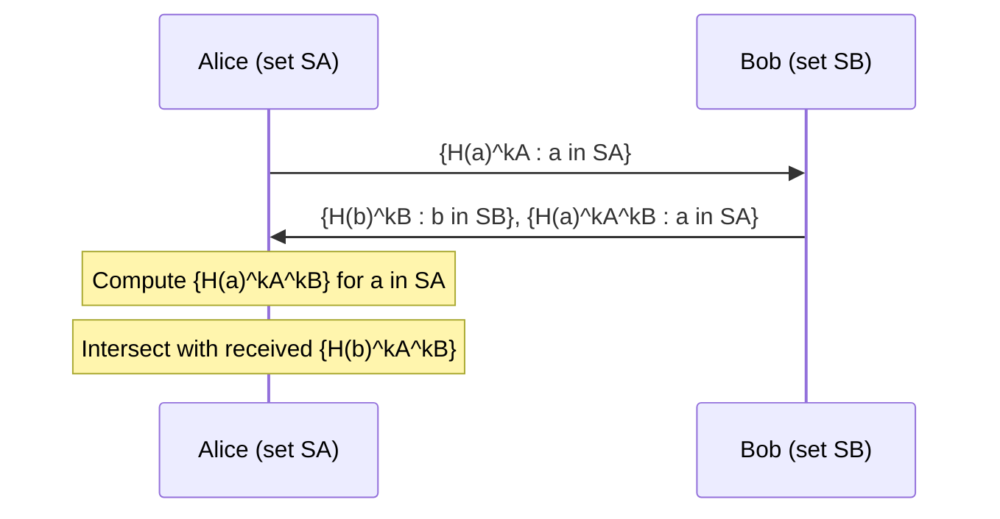
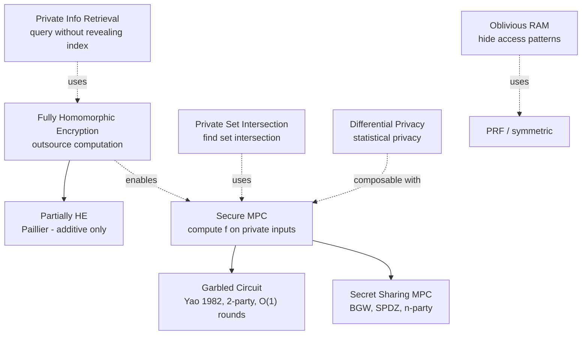
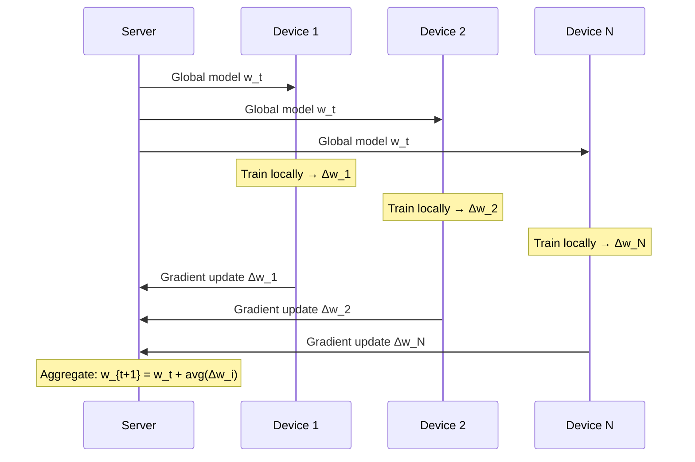

> **Prerequisites**: [[30-secret-sharing|30. Secret Sharing]], [[10-block-ciphers-modes|10. Block Ciphers & Modes]], LWE (xem [[32-lattice-based-pqc|32]])  
> **Lesson type**: Foundation (Survey)
>
> **Notation** (ký hiệu dùng mà không định nghĩa trong bài này):
> | Ký hiệu | Ý nghĩa |
> |---------|---------|
> | $\mathsf{Enc}_k(m)$ | Mã hóa message $m$ bằng key $k$ |
> | $\oplus$ | XOR / phép cộng trong trường $\mathbb{F}_2$ |
> | $\mathbb{Z}_q$ | Vành số nguyên modulo $q$ |
> | $\lambda$ | Security parameter |
> | $\mathsf{negl}(\lambda)$ | Negligible function |
> | $\lfloor \cdot \rceil$ | Làm tròn đến số nguyên gần nhất |
> | $\mathbf{A}, \mathbf{s}, \mathbf{e}$ | Ma trận / vector trong LWE |

---

## 1. Động lực — Tại sao cần tính toán trên dữ liệu mã hóa?

Hãy tưởng tượng bạn muốn sử dụng dịch vụ phân tích y tế trên đám mây (cloud), nhưng dữ liệu bệnh nhân của bạn cực kỳ nhạy cảm. Nếu bạn gửi dữ liệu rõ, nhà cung cấp cloud có thể đọc được. Nếu bạn mã hóa trước khi gửi, cloud không thể phân tích được. Tình huống này tạo ra hai hướng nghiên cứu song song:

- **Homomorphic Encryption (HE)** — mã hóa dữ liệu, nhưng cloud *vẫn có thể tính toán trên ciphertext* mà không biết plaintext. Kết quả trả về vẫn ở dạng mã hóa, chỉ bạn mới decrypt được.
- **Secure Multi-Party Computation (MPC)** — nhiều bên cùng tính một hàm trên dữ liệu *riêng của từng người* mà không ai trong số họ biết input của người khác.

Hai hướng này, cùng với **PSI**, **ORAM**, và **Differential Privacy**, tạo thành *privacy-enhancing cryptography* — một trong những lĩnh vực được ứng dụng nhiều nhất trong thập kỷ 2020.

---

## 2. Homomorphic Encryption

### 2.1. Từ PHE đến FHE

![[assets/img-32a-fhe-overview.png]]
*Ba thế hệ HE và vị trí của Bootstrapping trong chuỗi tiến hóa PHE → SHE → FHE.*

> [!note] Định nghĩa — Homomorphic Encryption
> Một encryption scheme $(\mathsf{KeyGen}, \mathsf{Enc}, \mathsf{Dec}, \mathsf{Eval})$ được gọi là **homomorphic** đối với class hàm $\mathcal{F}$ nếu với mọi $f \in \mathcal{F}$, mọi key $k$, và mọi message $(m_1, \ldots, m_n)$:
>
> $$
> \mathsf{Dec}_k\!\bigl(\mathsf{Eval}(f, \mathsf{Enc}_k(m_1), \ldots, \mathsf{Enc}_k(m_n))\bigr) = f(m_1, \ldots, m_n)
> $$
>
> Tức là: **tính $f$ trên ciphertext cho kết quả bằng encrypt của $f$ trên plaintext**.

Dựa trên class $\mathcal{F}$ được hỗ trợ, người ta phân loại:

- **PHE (Partially Homomorphic Encryption)** — chỉ hỗ trợ *một* phép toán: cộng hoặc nhân.
- **SHE (Somewhat HE)** — hỗ trợ cả cộng lẫn nhân, nhưng với *giới hạn chiều sâu mạch*.
- **Leveled FHE** — hỗ trợ mạch đến độ sâu $L$ cho trước trong tham số.
- **FHE (Fully HE)** — hỗ trợ **mạch tùy ý, không giới hạn** nhờ bootstrapping.

### 2.2. Ví dụ PHE thực tế — Paillier

Paillier (1999) là PHE scheme phổ biến nhất vì tính đơn giản và ứng dụng thực tế cao:

> [!note] Scheme — Paillier Encryption (rút gọn)
> **Setting**: $n = pq$ với $p, q$ nguyên tố; nhóm $\mathbb{Z}_{n^2}^*$
>
> **$\mathsf{Enc}(m)$**: Chọn $r \stackrel{R}{\leftarrow} \mathbb{Z}_n^*$; trả về $c = g^m \cdot r^n \pmod{n^2}$
>
> **Tính chất additive homomorphic**:
> $$\mathsf{Enc}(m_1) \cdot \mathsf{Enc}(m_2) = g^{m_1+m_2} \cdot (r_1 r_2)^n \equiv \mathsf{Enc}(m_1 + m_2) \pmod{n^2}$$

Tính chất này cho phép server tính tổng của các giá trị mã hóa mà không biết từng giá trị riêng lẻ. Ứng dụng điển hình: *e-voting* (kiểm phiếu online), *private auction*.

> [!warning] Giới hạn của PHE
> Paillier chỉ có phép cộng. Bất kỳ bài toán nào cần nhân (ví dụ: dot product, polynomial evaluation) đều **không** thực hiện được mà không decrypt trước.

### 2.3. Nguồn gốc noise trong LWE-based HE

Phần lớn SHE/FHE hiện đại dựa trên **LWE (Learning With Errors)**. Ý tưởng mã hóa một bit $b \in \{0,1\}$:

$$
c = (\mathbf{a},\, \mathbf{a}^T \mathbf{s} + e + b \cdot \lfloor q/2 \rceil)
$$

Trong đó $\mathbf{s}$ là secret key, $\mathbf{a}$ ngẫu nhiên, $e$ là *error nhỏ*. Decrypt: tính $c_1 - \mathbf{a}^T \mathbf{s}$, xem gần với $0$ hay $q/2$.

Mỗi lần **cộng** hai ciphertext: $e_{new} = e_1 + e_2$ — noise tăng *tuyến tính*.  
Mỗi lần **nhân** hai ciphertext: $e_{new} \approx e_1 \cdot e_2$ — noise tăng *bình phương*.  
Sau đủ phép nhân, noise vượt ngưỡng → decrypt sai.

### 2.4. Bootstrapping — Biến SHE thành FHE

> [!abstract] Ý tưởng cốt lõi (Gentry 2009)
> Để "làm mới" một ciphertext có noise gần bão hòa, ta **homomorphically evaluate chính vòng decrypt của scheme trên ciphertext đó**, bằng một *fresh* ciphertext của secret key.
>
> Nói cách khác: ta giải mã *bên trong mạch mã hóa*. Kết quả là ciphertext hợp lệ của cùng plaintext nhưng với noise **reset về mức ban đầu**.

Bootstrapping là nút thắt hiệu năng của FHE hiện nay — chi phí thường chiếm 99% thời gian tính toán. Đây là lý do FHE vẫn chậm hơn tính toán thông thường hàng nghìn lần.

### 2.5. Các scheme FHE hiện đại

| Scheme | Trường plaintext | Phép toán | Đặc điểm nổi bật |
|--------|-----------------|-----------|-----------------|
| **BGV** (2012) | $\mathbb{Z}_t$ (integers) | $+$, $\times$ | Exact arithmetic, noise tăng có kiểm soát |
| **BFV** (2012) | $\mathbb{Z}_t$ | $+$, $\times$ | Tương tự BGV, scaling khác; Microsoft SEAL |
| **CKKS** (2017) | $\mathbb{R}$ (approximate) | $+$, $\times$ | Floating point, ML/stats; mất độ chính xác |
| **TFHE / FHEW** | $\{0,1\}$ (boolean) | Gates | Fast bootstrapping per gate; circuit-level |

> [!tip] Khi nào dùng scheme nào?
> - **CKKS**: machine learning, thống kê trên số thực — chấp nhận xấp xỉ.
> - **BGV/BFV**: tính toán số nguyên chính xác (voting, financial).
> - **TFHE**: logic boolean, so sánh, lookup table — không cần batch.

### 2.6. Thư viện FHE thực tế

```python
from openfhe import *

cc = GenCryptoContext(CCParamsCKKSRNS())
cc.Enable(PKESchemeFeature.PKE)
cc.Enable(PKESchemeFeature.LEVELEDSHE)

keys = cc.KeyGen()
plaintext1 = cc.MakeCKKSPackedPlaintext([1.5, 2.0, 3.1])
plaintext2 = cc.MakeCKKSPackedPlaintext([0.5, 1.0, 0.9])

ct1 = cc.Encrypt(keys.publicKey, plaintext1)
ct2 = cc.Encrypt(keys.publicKey, plaintext2)

ct_add = cc.EvalAdd(ct1, ct2)
ct_mul = cc.EvalMult(ct1, ct2)

result = cc.Decrypt(keys.secretKey, ct_add)
```

---

## 3. Secure Multi-Party Computation (MPC)

### 3.1. Bài toán MPC

> [!note] Định nghĩa — Secure MPC
> Cho $n$ bên $P_1, \ldots, P_n$ với inputs $x_1, \ldots, x_n$. Giao thức MPC cho phép các bên **cùng tính $f(x_1, \ldots, x_n)$** sao cho:
> - **Correctness**: mọi bên honest nhận kết quả đúng.
> - **Privacy**: bên $P_i$ không học được thông tin nào về $x_j$ ($j \neq i$) ngoài những gì có thể suy ra từ output.

Bài toán khởi đầu là *Yao's Millionaires Problem* (1982): Alice có $a$ triệu USD, Bob có $b$ triệu. Ai giàu hơn? Cả hai muốn biết $a > b$ mà không tiết lộ $a$ hay $b$.

### 3.2. Yao's Garbled Circuit

![[assets/img-32b-mpc-garbled.png]]
*Giao thức 2 bên của Yao: Alice tạo garbled circuit, Bob evaluate. Oblivious Transfer (OT) giải quyết vấn đề Bob nhận wire labels mà không Alice biết input của Bob.*

Nguyên lý cốt lõi:

> [!note] Cơ chế Garbled Gate
> Mỗi wire $w$ nhận hai label ngẫu nhiên: $W^0$ (đại diện cho bit 0) và $W^1$ (bit 1). Garbled gate tương ứng với cổng AND là 4 ciphertext:
>
> $$G[b_a, b_b] = \mathsf{Enc}_{W_a^{b_a}} \bigl( \mathsf{Enc}_{W_b^{b_b}}(W_{out}^{b_a \wedge b_b}) \bigr)$$
>
> Bob biết đúng hai labels cho các input wires, decrypt được *đúng một* trong bốn hàng. Nhận được $W_{out}$ nhưng **không biết đó là bit 0 hay 1**.

Cuối cùng, Alice tiết lộ *decoding table* cho output wire: cho Bob biết $W_{out}^0$ hay $W_{out}^1$ là kết quả thật.

> [!abstract] Đặc điểm của Yao's Protocol
> **Round complexity**: O(1) — constant rounds, không phụ thuộc độ sâu mạch.  
> **Communication**: $O(|C|)$ với $|C|$ là kích thước circuit.  
> **Security**: Passive (semi-honest) adversary.  
> **Extension sang malicious**: Cut-and-choose paradigm (tốn kém), hoặc SPDZ.

**Tối ưu hóa quan trọng**:
- **Free-XOR**: XOR gates không cần gửi garbled row, chỉ XOR labels → giảm 75% cho XOR-heavy circuits.
- **Half-gate**: cắt bảng garbled gate còn 2 hàng thay vì 4.

### 3.3. Mô hình Secret Sharing — SPDZ

Thay vì garble circuit, cách tiếp cận thứ hai là **secret sharing**.

> [!note] Định nghĩa — Additive Secret Sharing
> Để chia sẻ giá trị $x$ giữa 2 bên: chọn $r \stackrel{R}{\leftarrow} \mathbb{Z}_q$, đặt $[x]_1 = r$ và $[x]_2 = x - r$. Không bên nào biết $x$; cả hai cộng lại mới ra $x$.
>
> **Phép cộng miễn phí**: $[x + y]_i = [x]_i + [y]_i$ — không cần giao tiếp.  
> **Phép nhân tốn kém**: cần **Beaver triple** $(a, b, c)$ với $c = a \cdot b$ được tạo offline.

**Giao thức nhân (Beaver triple)**:

$$
[z] = [x \cdot y]: \quad z = (x-a)(y-b) + b(x-a) + a(y-b) + c
$$

Các parties tiết lộ $(x-a)$ và $(y-b)$ — không lộ $x$ hay $y$ vì $a, b$ ngẫu nhiên.

**SPDZ** (Damgård et al., 2012) = Additive Secret Sharing + MAC (message authentication code) trên shares để phát hiện cheating của *malicious adversaries*. Mỗi share $[x]_i$ đi kèm MAC tag $[t_i] = \Delta \cdot [x]_i$, với $\Delta$ là global MAC key.

```python
from mpyc.runtime import mpc

async def secure_inner_product():
    async with mpc:
        secint = mpc.SecInt()
        x = mpc.input(secint(5), senders=0)
        y = mpc.input(secint(3), senders=1)
        z = mpc.run(mpc.output(x * y))
        print(z)
```

### 3.4. So sánh Garbled Circuit vs Secret Sharing

| Tiêu chí | Garbled Circuit (Yao) | Secret Sharing (SPDZ) |
|---|---|---|
| **Rounds** | O(1) — constant | O(depth) — phụ thuộc mạch |
| **Communication** | Lớn (mỗi gate nhiều bytes) | Nhỏ hơn (chỉ Beaver triples) |
| **Tốt cho** | High-latency WAN, ít rounds | Low-latency LAN, circuits sâu |
| **Security** | Semi-honest / Cut-and-choose | Malicious natively (SPDZ) |
| **Parties** | 2-party | n-party tự nhiên |

---

## 4. Private Set Intersection & PIR

### 4.1. PSI — Private Set Intersection

> [!note] Bài toán PSI
> Alice có tập $S_A$, Bob có tập $S_B$. Cả hai muốn biết $S_A \cap S_B$ mà **không ai lộ phần còn lại** của tập mình.

Ứng dụng nổi tiếng: Google/Apple **Private Contact Discovery** trong iMessage và WhatsApp — server biết bạn của bạn đang dùng app mà không biết toàn bộ danh bạ của bạn.

**Phương pháp DH-based PSI** (đơn giản nhất):



Alice compute $H(a)^{k_A \cdot k_B}$ từ bộ nhận; Bob compute $H(b)^{k_A \cdot k_B}$ từ tập của mình. Giao là $\{ e \mid H(e)^{k_A k_B} \in \text{cả hai} \}$.

> [!warning] Giới hạn DH-PSI
> Scheme trên chỉ an toàn với *semi-honest* adversary. Với malicious adversary cần thêm zero-knowledge proof rằng đã nhân đúng bằng $k$.

Các scheme PSI hiện đại (OPRF-based, KKRT16, Circuit-PSI) đạt O(n log n) và là backbone của nhiều hệ thống privacy thực tế.

### 4.2. PIR — Private Information Retrieval

> [!note] Bài toán PIR
> Alice muốn truy vấn mục $i$ trong database $DB$ của server mà **server không biết $i$ là gì**.

**Trivial solution**: server gửi toàn bộ DB — communication cost $O(n)$.

**Computational PIR** (Kushilevitz-Ostrovsky 1997): dùng homomorphic encryption:
- Alice encrypt chỉ số $i$ thành vector $\mathbf{e}_i$ (one-hot) dưới HE.
- Server tính $\sum_j DB[j] \cdot \mathsf{Enc}(e_j)$ — dot product homomorphically.
- Alice decrypt → nhận $DB[i]$.

Communication: $O(\sqrt{n})$ với các phiên bản tối ưu; gần đây tiệm cận $O(\log^2 n)$.

---

## 5. Oblivious RAM (ORAM)

> [!note] Định nghĩa — ORAM
> Một giao thức ORAM cho phép client **truy cập RAM** (đọc/ghi) trên server mà **access pattern** (địa chỉ nào được truy cập, thứ tự ra sao) **không lộ thông tin** về data hay query.

**Tại sao cần ORAM?** Ngay cả khi data được mã hóa, *access pattern* vẫn có thể leak thông tin: "client truy cập địa chỉ 0x004 ba lần liên tiếp → likely là hot record trong DB".

**Ý tưởng cơ bản (Path ORAM)**:
- Data được lưu trữ trong cây nhị phân.
- Mỗi lần đọc/ghi block $b$: client traverse một đường dẫn random từ root xuống leaf.
- Sau mỗi access, re-randomize vị trí của block.

> [!abstract] Chi phí ORAM
> Path ORAM (Stefanov et al., 2013) đạt overhead $O(\log^2 N)$ bandwidth per access (N là tổng số blocks). Đây là tiệm cận optimal về mặt lý thuyết đến hằng số.

```text
ORAM Tree (4 levels):
Root [batch mix]
+-- L1 [path x]
|   +-- L2 [block A (randomized)]
|   +-- L2 [block B]
+-- L1 [path y]
    +-- ...
```

**Ứng dụng**: Signal Protocol dùng khái niệm liên quan để ẩn contact graph.

---

## 6. Differential Privacy

### 6.1. Định nghĩa

> [!note] Định nghĩa — $\varepsilon$-Differential Privacy
> Cơ chế ngẫu nhiên $M: \mathcal{D} \to \mathcal{R}$ thỏa $\varepsilon$-DP nếu với mọi cặp dataset $D, D'$ chỉ khác nhau **một phần tử**, và mọi output $S \subseteq \mathcal{R}$:
>
> $$
> \Pr[M(D) \in S] \leq e^\varepsilon \cdot \Pr[M(D') \in S]
> $$
>
> Tham số $\varepsilon$ ("privacy budget") kiểm soát trade-off: $\varepsilon$ nhỏ → privacy mạnh hơn nhưng utility giảm.

**Trực giác**: adversary không thể phân biệt được output $M(D)$ và $M(D')$ quá $e^\varepsilon$ lần → không thể suy ra dữ liệu cá nhân từ kết quả thống kê.

### 6.2. Laplace Mechanism

Để thêm $\varepsilon$-DP vào query $f: \mathcal{D} \to \mathbb{R}^k$, thêm noise Laplace:

$$
M(D) = f(D) + \mathsf{Lap}\!\left(\frac{\Delta f}{\varepsilon}\right)^k
$$

Trong đó $\Delta f = \max_{D, D'} \|f(D) - f(D')\|_1$ là **global sensitivity** của $f$.

```python
import numpy as np

def laplace_mechanism(true_value, sensitivity, epsilon):
    noise = np.random.laplace(loc=0, scale=sensitivity/epsilon)
    return true_value + noise

count = 1000
noisy_count = laplace_mechanism(count, sensitivity=1, epsilon=0.1)
```

> [!tip] DP trong thực tế
> - **Apple** dùng DP để collect keyboard usage statistics trên iOS mà không biết từng user gõ gì.
> - **Google RAPPOR** dùng DP trong Chrome để phát hiện malware phổ biến.
> - **Tensorflow Privacy** implement DP-SGD — train ML models với differential privacy.

---

## 7. Privacy-Enhancing Cryptography Landscape



---

## 8. CTF Relevance — ⭐⭐

> [!example] Dạng bài CTF liên quan đến FHE/MPC
> **Xuất hiện ít trong CTF thông thường** (nhưng vẫn có) vì implementation phức tạp. Tuy nhiên:
>
> 1. **Paillier homomorphic CTF** — biết tính chất additive: $\mathsf{Enc}(m_1) \cdot \mathsf{Enc}(m_2) = \mathsf{Enc}(m_1+m_2)$ → thao túng ciphertext mà không biết plaintext.
>
> ```python
> from Crypto.PublicKey import ECC
> n2 = n * n
> c1, c2 = ...
> c_sum = (c1 * c2) % n2
> ```
>
> 2. **Secret sharing reconstruction** — nhận $k$ trong $n$ shares, reconstruct secret qua Lagrange interpolation (thấy trong L25).
>
> 3. **Two-party computation protocol challenge** — server cho phép query với input mã hóa, cần extract thông tin từ oracle bằng cách chọn input thông minh.
>
> **Nhận dạng**: challenge nói "homomorphic", "shares", "secure computation", "threshold" → map về các concept ở bài này.

---

## 9. Công cụ & Code

```python
import tenseal as ts

context = ts.context(
    ts.SCHEME_TYPE.CKKS,
    poly_modulus_degree=8192,
    coeff_mod_bit_sizes=[60, 40, 40, 60]
)
context.generate_galois_keys()
context.global_scale = 2**40

v1 = ts.ckks_vector(context, [1.0, 2.0, 3.0])
v2 = ts.ckks_vector(context, [4.0, 5.0, 6.0])

add_result = v1 + v2
mul_result = v1 * v2
dot_result = v1.dot(v2)

print(add_result.decrypt())
print(mul_result.decrypt())
print(dot_result.decrypt())
```

```python
from mpyc.runtime import mpc
import asyncio

async def run():
    async with mpc:
        secint = mpc.SecInt(32)
        a = mpc.input(secint(10), senders=0)
        b = mpc.input(secint(7), senders=1)
        c = await mpc.output(a * b)
        print(f"Secure product: {c}")

asyncio.run(run())
```

| Thư viện | Scheme hỗ trợ | Ngôn ngữ | Ghi chú |
|---|---|---|---|
| **OpenFHE** | BGV, BFV, CKKS, TFHE | C++ / Python | Kế thừa PALISADE |
| **TenSEAL** | CKKS, BFV | Python | Wrapper TorchTensor |
| **TFHE-rs** | TFHE/FHEW | Rust | Zama, fast bootstrapping |
| **MPyC** | SPDZ-like | Python | Multi-party computation |
| **MP-SPDZ** | 30+ protocols | C++ | Research framework |
| **PySyft** | DP + FHE + FL | Python | OpenMined, federated learning |

---

## 10. Threshold Cryptography và Key Management

### 10.1. Threshold Decryption

> [!note] Định nghĩa — Threshold Decryption
> Trong hệ $(t, n)$-threshold decryption, $n$ parties mỗi người giữ một **share** của decryption key. Cần ít nhất $t$ parties hợp tác mới có thể giải mã ciphertext — bất kỳ tập $t-1$ parties nào đều không thể decrypt.

Phân biệt với **threshold signature**:
- **Threshold signature**: $t$ parties hợp tác để tạo ra *chữ ký* (signature) — output là một signature trên message.
- **Threshold decryption**: $t$ parties hợp tác để *giải mã* một ciphertext được gửi đến *group* — output là plaintext.

Cả hai dùng secret sharing để chia khóa, nhưng use case khác nhau hoàn toàn.

### 10.2. ElGamal Threshold Decryption

Cho ciphertext ElGamal $(C_1, C_2) = (g^r, m \cdot h^r)$ với public key $h = g^d$:

- **Key sharing**: Chia $d$ thành $n$ shares $d_1, \ldots, d_n$ qua Shamir secret sharing sao cho $d = f(0)$ với $f$ là polynomial bậc $t-1$.
- **Partial decryption**: Mỗi party $i$ tính $\hat{D}_i = C_1^{d_i}$ (partial decryption share).
- **Combine**: Lấy $t$ shares bất kỳ, dùng **Lagrange interpolation** để recover $C_1^d$:

$$
C_1^d = \prod_{i \in S} \hat{D}_i^{\lambda_{i,S}}
\quad \text{với} \quad
\lambda_{i,S} = \prod_{j \in S, j \neq i} \frac{-j}{i - j} \pmod{q}
$$

- **Recover plaintext**: $m = C_2 / C_1^d$.

```python
# Pseudocode: ElGamal threshold decryption combine step
def combine_partial_decryptions(partial_decrypts, indices, t, q):
    """
    partial_decrypts: list of C1^{d_i} from t parties
    indices: which party indices contributed
    returns: C1^d (shared secret)
    """
    result = 1
    for i, Di in zip(indices, partial_decrypts):
        # Compute Lagrange coefficient lambda_{i, S}
        lam = lagrange_coeff(i, indices, q)
        result = (result * pow(Di, lam, p)) % p
    return result  # = C1^d

def lagrange_coeff(i, S, q):
    num, den = 1, 1
    for j in S:
        if j != i:
            num = (num * (-j)) % q
            den = (den * (i - j)) % q
    return (num * pow(den, -1, q)) % q
```

### 10.3. Threshold BLS Decryption

BLS (Boneh-Lynn-Shacham) dùng pairing $e: G_1 \times G_2 \to G_T$. Ciphertext IBE/BLS-based: $(U, V)$.

Mỗi party $i$ tính partial decrypt $\hat{D}_i = e(U, g_2^{d_i})$. Combine $t$ partials bằng Lagrange trong $G_T$:

$$
\hat{D} = \prod_{i \in S} \hat{D}_i^{\lambda_{i,S}} = e(U, g_2^d)
$$

Ưu điểm: Pairing cho phép verify từng partial decryption bằng $e(\hat{D}_i, g_2) \stackrel{?}{=} e(U, h_i)$ mà không cần ZK proof phức tạp.

### 10.4. Ứng dụng thực tế

| Dự án | Ứng dụng |
|---|---|
| **Lit Protocol** | Threshold decryption cho Web3 access control — NFT gating, token-gated content |
| **NuCypher / Threshold Network** | Decentralized KMS (Key Management Service) — proxy re-encryption + threshold |
| **Filecoin** | Threshold custody cho storage provider keys |
| **tBTC** | $(51, 100)$-threshold custody của Bitcoin private keys — trustless BTC bridge sang Ethereum |

> [!tip] Khi nào dùng threshold decryption vs threshold signature?
> - Cần *gửi data bí mật đến một group* và chỉ group mới mở được → **threshold decryption**.
> - Cần *group cùng ký một message* để xác thực với bên ngoài → **threshold signature**.

---

## 11. Federated Learning với Privacy

### 11.1. Federated Learning cơ bản

**Federated Learning (FL)** — Google 2016 (McMahan et al.): Huấn luyện mô hình ML trên dữ liệu phân tán mà không tập trung raw data.



Mỗi thiết bị train cục bộ trên data của mình, gửi **gradient updates** (không phải data thô) về server. Server aggregate → model mới → gửi lại thiết bị.

### 11.2. Privacy Problem: Gradient Inversion Attack

> [!warning] Gradient Inversion (Zhu et al., 2019 — NeurIPS)
> Chỉ từ gradient $\nabla W$ mà không có raw data, adversary có thể **reconstruct hình ảnh training** với độ chính xác pixel-level.
>
> Ý tưởng: tối ưu $\tilde{x}$ sao cho $\|\nabla \mathcal{L}(\tilde{x}, \tilde{y}) - \nabla W\|^2$ nhỏ nhất. Đây là optimization problem có thể giải bằng gradient descent.

Điều này có nghĩa: server nhận gradient → có thể khôi phục lại ảnh hay văn bản mà user dùng để train. **FL không privacy-safe by default**.

### 11.3. DP-SGD — Differential Privacy cho Gradient Descent

**DP-SGD** (Abadi et al., Google Brain, 2016 — CCS):

```
Algorithm DP-SGD:
  For each mini-batch B:
    1. Compute gradient g_i = ∇L(x_i, y_i) for each sample i in B
    2. CLIP: ĝ_i = g_i / max(1, ||g_i||_2 / C)   ← bound L2 sensitivity
    3. ADD NOISE: g̃ = (1/|B|) * (Σ ĝ_i + N(0, σ²C²I))
    4. Update: w ← w - η * g̃
```

- **Clipping** giới hạn $L_2$ sensitivity của mỗi gradient → kiểm soát mức độ ảnh hưởng của một sample.
- **Gaussian noise** $\sigma$ đảm bảo $(\varepsilon, \delta)$-DP.
- **Privacy accounting**: dùng **Rényi Differential Privacy (RDP) accountant** hoặc **moments accountant** để theo dõi tổng privacy cost qua nhiều steps.

```python
import tensorflow_privacy as tfp

optimizer = tfp.DPKerasSGDOptimizer(
    l2_norm_clip=1.0,       # clipping threshold C
    noise_multiplier=1.1,   # sigma = noise_multiplier * C
    num_microbatches=256,
    learning_rate=0.01
)
model.compile(optimizer=optimizer, loss='categorical_crossentropy')
```

### 11.4. Secure Aggregation

**Secure Aggregation** (Bonawitz et al., Google, 2017 — CCS): Server chỉ nhìn thấy **tổng** của gradients, không thấy gradient từng thiết bị — kết hợp FL với MPC.

Kỹ thuật: additive secret sharing với one-time pairwise masks.

```
Device i gửi: Δw_i + Σ_{j≠i} s_{ij}   (s_{ij} là mask ngẫu nhiên)
Server cộng tất cả: Σ_i (Δw_i + Σ_j s_{ij})
                  = Σ_i Δw_i  (vì masks cancel nhau: s_{ij} + s_{ji} = 0)
```

Server nhận tổng gradient đúng nhưng không thể tách ra từng $\Delta w_i$.

### 11.5. Production và Trade-off

| Hệ thống | Quy mô | Kỹ thuật |
|---|---|---|
| **Google Gboard** | 500M+ Android devices | FL + DP-SGD + Secure Aggregation |
| **Apple iOS keyboard** | Hàng trăm triệu thiết bị | FL + Local DP (DP trước khi gửi) |
| **Apple Health** | iOS 15+ | FL cho health predictions |

> [!warning] Trade-off cốt lõi của DP-SGD
> **Noise ↑ → Privacy ↑ → Accuracy ↓**
>
> Thực tế: với $\varepsilon = 8, \delta = 10^{-5}$ (DP budget) trên MNIST, accuracy giảm ~1–2%. Với $\varepsilon = 1$, accuracy giảm đáng kể hơn. Không có free lunch.

---

## 12. PSI mở rộng: Cardinality, Circuit, Labeled

### 12.1. PSI-CA — Cardinality Only

**PSI-CA (Private Set Intersection - Cardinality)**: Chỉ reveal $|S_A \cap S_B|$, không reveal các phần tử.

> [!example] Use case
> "Công ty chúng tôi có bao nhiêu user chung với đối tác?" — cần con số để business decision, không cần danh sách user cụ thể (vì đó là PII).

Xây dựng từ OPRF (Oblivious PRF): mỗi bên evaluate OPRF trên elements của mình, trao đổi outputs đã hash, đếm collisions — không lộ elements.

### 12.2. Circuit-PSI

**Circuit-PSI**: Tính $f(S_A \cap S_B)$ cho hàm $f$ tùy ý mà không lộ phần tử giao.

```
Input:  S_A = {user records from company A}
        S_B = {user records from company B}
Goal:   Count records in S_A ∩ S_B where attribute > threshold
Output: COUNT — không lộ S_A ∩ S_B hay records cụ thể
```

Cách xây dựng: dùng PSI để tạo **secret-shared intersection membership bits** $b_i \in \{0,1\}$, sau đó chạy MPC circuit để tính $f$ trên các bits đó.

Ứng dụng:
- **Fraud detection**: "Bao nhiêu giao dịch của tôi cũng xuất hiện trong blacklist của bạn?"
- **Ad attribution**: "Bao nhiêu user click quảng cáo của tôi sau đó mua hàng trên platform của bạn?" — không lộ danh sách user.

### 12.3. Labeled-PSI

**Labeled-PSI**: Mỗi phần tử $a \in S_A$ gắn với label $\ell_a$. Với mỗi $b \in S_B$ thỏa $b \in S_A$, Bob nhận được $\ell_b$ — nhưng không biết gì về $a \in S_A \setminus S_B$.

```
Alice: S_A = {hash_1 → label_1, hash_2 → label_2, ...}  (large DB)
Bob:   S_B = {query_1, query_2, ...}                     (small query set)
Output: For each q in S_B ∩ S_A: Bob learns label(q)
        Bob learns nothing about S_A \ S_B
        Alice learns nothing about S_B \ S_A
```

> [!example] Apple CSAM Detection (2021) — Controversial
> Apple's proposed system (2021) là một Labeled-PSI instance: Server (Apple) giữ DB các hash ảnh CSAM (label = "flagged"). User device query với hash ảnh trên device. Nếu match → device nhận label "flagged".
>
> Bị rút lại do lo ngại: scheme đúng về mặt kỹ thuật nhưng tạo tiền lệ cho mass surveillance nếu DB bị mở rộng.

### 12.4. KKRT16 — State-of-the-Art Practical PSI

**KKRT16** (Kolesnikov, Kumaresan, Rosulek, Trieu — CCS 2016): PSI hiệu quả nhất cho sets lớn dựa trên **Oblivious PRF (OPRF)**.

```
Protocol sketch (semi-honest):
1. Bob (receiver) chọn input set S_B
2. Alice (sender) và Bob chạy OPRF protocol:
   - Bob học F(k, b) cho mỗi b ∈ S_B
   - Alice biết key k, không biết b
3. Alice gửi {H(F(k, a)) : a ∈ S_A}
4. Bob compute {H(F(k, b)) : b ∈ S_B}
5. Bob intersect → tìm S_A ∩ S_B
```

Complexity: **$O(n)$ OT extensions** — sublinear communication cho large sets nhờ OT extension (IKNP). Với $|S_A| = |S_B| = 10^6$, chạy trong vài giây.

### 12.5. Unbalanced PSI

**Unbalanced PSI**: $|S_A| \gg |S_B|$ — server có DB lớn (millions), client có query nhỏ (vài items). Client computation nên là $O(|S_B|)$, không phải $O(|S_A|)$.

```
Scenario: Contact discovery
  Server: S_A = {hash of all registered phone numbers}  ← millions
  Client: S_B = {hash of user's contacts}               ← hundreds
  Goal: Client learns which contacts are registered, server learns nothing

Naive PSI: client does O(|S_A|) work — too expensive on mobile
Unbalanced PSI: client does O(|S_B|) work, server does O(|S_A|) offline
```

Cách xây dựng: **keyword PIR** (Private Information Retrieval) kết hợp với OPRF, hoặc dùng **polynomial representation** của $S_A$ để client query từng element với O(1) amortized cost.

> [!example] Signal Private Contact Discovery
> Signal dùng unbalanced PSI (Intel SGX TEE + OPRF hybrid) để user khám phá ai trong danh bạ cũng dùng Signal, mà không lộ toàn bộ danh bạ cho Signal server.

### 12.6. Tóm tắt các biến thể PSI

| Variant | Reveal gì | Use case điển hình |
|---|---|---|
| **Standard PSI** | $S_A \cap S_B$ (các phần tử) | Contact discovery |
| **PSI-CA** | $\|S_A \cap S_B\|$ (chỉ số lượng) | Business analytics |
| **Circuit-PSI** | $f(S_A \cap S_B)$ (hàm tùy ý) | Fraud detection, ad attribution |
| **Labeled-PSI** | Labels của phần tử giao | CSAM detection, DB lookup |
| **Unbalanced PSI** | $S_A \cap S_B$, client $\ll$ server | Mobile contact discovery |

---

## 13. Tài liệu tham khảo

- Gentry, C. — *A Fully Homomorphic Encryption Scheme*, Stanford PhD Thesis, 2009
- Yao, A. — *How to generate and exchange secrets*, FOCS 1986
- Damgård, I. et al. — *Multiparty Computation from Somewhat Homomorphic Encryption* (SPDZ), CRYPTO 2012
- Dwork, C. & Roth, A. — *The Algorithmic Foundations of Differential Privacy*, FnTCS 2014
- Boneh & Shoup — *A Graduate Course in Applied Cryptography*, Ch. 22–23
- Jeremy Kun — *A High-Level Technical Overview of FHE*, jeremykun.com 2024
- OpenFHE Documentation: openfhe.org
- MPyC: mpyc.dev
