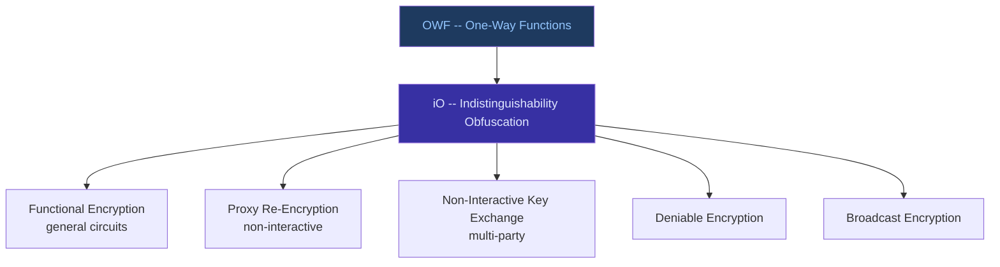

> **Prerequisites**: [[35-pairing-based-cryptography|35. Pairing-Based Cryptography]], [[30-secret-sharing|30. Secret Sharing]], [[36-zero-knowledge-proofs|36. Zero-Knowledge Proofs]]  
> **Lesson type**: Foundation (Survey)
>
> **Notation** (ký hiệu dùng mà không định nghĩa trong bài này):
> | Ký hiệu | Ý nghĩa |
> |---------|---------|
> | $\mathbb{G}_1, \mathbb{G}_2, \mathbb{G}_T$ | Ba nhóm trong bilinear pairing |
> | $e: \mathbb{G}_1 \times \mathbb{G}_2 \to \mathbb{G}_T$ | Bilinear pairing |
> | $g, P$ | Generator của $\mathbb{G}_1$ |
> | $\mathsf{msk}$ | Master secret key (PKG) |
> | $\mathsf{pp}$ | Public parameters |
> | $\mathsf{BDH}$ | Bilinear Diffie-Hellman assumption |
> | $H_1: \{0,1\}^* \to \mathbb{G}_1$ | Hash-to-curve function |

---

## 1. Mở đầu — Bản đồ các primitive "exotic"

Sau khi đã đi qua toàn bộ stack cryptographic — từ block cipher đến ZKP đến FHE — bài học cuối cùng này dừng lại ở những primitive **đặt câu hỏi mới hơn**: *Ai* được phép decrypt? *Hàm nào* được phép tính trên ciphertext? *Làm sao* sinh ra randomness có thể verify? *Có thể* ẩn cả chương trình tính toán không?

Đây là những câu hỏi mà public-key cryptography thông thường không trả lời. Chúng yêu cầu các primitive mới: **IBE**, **ABE**, **FE**, **VRF**, **Searchable Encryption**, **Proxy Re-Encryption**, **VDF**, và **iO**.

---

## 2. Identity-Based Encryption (IBE)

### 2.1. Vấn đề PKI và động lực IBE

Trong PKE thông thường, để gửi email mã hóa cho Alice, bạn cần public key của cô ấy — nhưng lấy nó từ đâu? Bạn phải truy vấn một *Certificate Authority* (CA), download certificate, verify certificate chain, rồi mới encrypt được. Toàn bộ hạ tầng PKI này cực kỳ phức tạp và dễ bị tấn công (compromise CA = compromise mọi người).

**Adi Shamir (1984)** đặt câu hỏi: *Tại sao public key không thể là chính định danh (identity) của người dùng — ví dụ email address?* Nếu vậy, Alice chỉ cần công bố "địa chỉ email của tôi là alice@company.com", và bất kỳ ai cũng có thể encrypt message gửi cho cô ấy mà **không cần download bất kỳ certificate nào**.

Shamir đặt ra khái niệm, nhưng chỉ xây dựng được *identity-based signatures*. Bài toán **IBE** (Identity-Based Encryption) phải đợi đến năm **2001** mới có nghiệm thực tế, khi **Boneh và Franklin** dùng bilinear pairing để giải quyết.

### 2.2. Kiến trúc IBE

IBE giới thiệu một thực thể mới: **PKG (Private Key Generator)** — cơ quan giữ master secret, cấp private key cho users theo yêu cầu.

> [!note] Scheme — IBE (4 thuật toán)
> **Type**: Identity-Based Encryption
>
> **$\mathsf{Setup}(1^\lambda) \to (\mathsf{pp}, \mathsf{msk})$**
> Sinh public parameters $\mathsf{pp}$ và master secret key $\mathsf{msk}$. PKG giữ bí mật $\mathsf{msk}$.  
> **$\mathsf{Extract}(\mathsf{msk}, \mathsf{ID}) \to \mathsf{sk}_{\mathsf{ID}}$**
> PKG sinh private key cho identity $\mathsf{ID} \in \{0,1\}^*$. Chỉ user với identity $\mathsf{ID}$ nhận được $\mathsf{sk}_{\mathsf{ID}}$.  
> **$\mathsf{Enc}(\mathsf{pp}, \mathsf{ID}, m) \to c$**
> Bất kỳ ai cũng có thể encrypt message $m$ cho identity $\mathsf{ID}$ mà **không cần biết $\mathsf{sk}_{\mathsf{ID}}$**.  
> **$\mathsf{Dec}(\mathsf{sk}_{\mathsf{ID}}, c) \to m$**
> User với private key $\mathsf{sk}_{\mathsf{ID}}$ decrypt ciphertext.

### 2.3. Boneh-Franklin IBE

**BF-IBE** (Boneh-Franklin 2001) là IBE scheme đầu tiên thực tế, dựa trên bilinear pairing.

> [!note] Scheme — BF-IBE BasicIdent
> **Setting**: Bilinear pairing $e: \mathbb{G}_1 \times \mathbb{G}_1 \to \mathbb{G}_T$, generator $P \in \mathbb{G}_1$ bậc $q$; hàm hash $H_1: \{0,1\}^* \to \mathbb{G}_1^*$, $H_2: \mathbb{G}_T \to \{0,1\}^n$  
> **$\mathsf{Setup}$**: Chọn $s \stackrel{R}{\leftarrow} \mathbb{Z}_q^*$ (master secret); đặt $P_{pub} = sP$. Public: $(\mathbb{G}_1, q, e, P, P_{pub}, H_1, H_2)$.  
> **$\mathsf{Extract}(\mathsf{ID})$**: Tính $Q_{\mathsf{ID}} = H_1(\mathsf{ID}) \in \mathbb{G}_1$; trả về $\mathsf{sk}_{\mathsf{ID}} = s \cdot Q_{\mathsf{ID}} \in \mathbb{G}_1$.  
> **$\mathsf{Enc}(\mathsf{ID}, m)$** ($m \in \{0,1\}^n$):
> - Tính $Q_{\mathsf{ID}} = H_1(\mathsf{ID})$
> - Chọn $r \stackrel{R}{\leftarrow} \mathbb{Z}_q^*$
> - Output: $c = \bigl(rP,\; m \oplus H_2(e(Q_{\mathsf{ID}}, P_{pub})^r)\bigr)$
>
> **$\mathsf{Dec}(\mathsf{sk}_{\mathsf{ID}}, c = (U, V))$**:
> - Tính $V \oplus H_2(e(\mathsf{sk}_{\mathsf{ID}}, U))$
> - Vì $e(\mathsf{sk}_{\mathsf{ID}}, U) = e(sQ_{\mathsf{ID}}, rP) = e(Q_{\mathsf{ID}}, P)^{sr} = e(Q_{\mathsf{ID}}, P_{pub})^r$

> [!abstract] Theorem — Correctness BF-IBE
> Với mọi $\mathsf{ID}$ và $m$: $\mathsf{Dec}(\mathsf{sk}_{\mathsf{ID}}, \mathsf{Enc}(\mathsf{ID}, m)) = m$.

**Proof.** Tính $e(\mathsf{sk}_{\mathsf{ID}}, U) = e(s Q_{\mathsf{ID}}, rP) = e(Q_{\mathsf{ID}}, P)^{sr}$ (bilinearity). Trong bước encrypt: $e(Q_{\mathsf{ID}}, P_{pub})^r = e(Q_{\mathsf{ID}}, sP)^r = e(Q_{\mathsf{ID}}, P)^{sr}$. Hai giá trị trùng nhau → XOR cancel → recover $m$. $\blacksquare$

**Security**: BF-IBE an toàn IND-ID-CPA trong Random Oracle Model dưới **BDH assumption** (Bilinear Diffie-Hellman: cho $(P, aP, bP, cP)$ không thể tính $e(P,P)^{abc}$). Phiên bản FullIdent (Fujisaki-Okamoto transform) đạt IND-ID-CCA2.

> [!warning] Key Escrow Problem
> PKG giữ master secret $s$ → PKG **có thể extract private key của bất kỳ user nào**. Đây là điểm yếu cố hữu của IBE. Giải pháp:
> - **Distributed PKG**: chia $s$ thành $t$-of-$n$ shares bằng Shamir Secret Sharing.
> - **Dùng khi tin tưởng PKG** (corporate setting, internal use).
> - Không phù hợp cho hệ thống cần key privacy tuyệt đối.

### 2.4. Ứng dụng độc đáo của IBE

IBE cho phép một số use-case rất creative:

- **Key expiration tự nhiên**: Encrypt cho `"alice@company.com || 2026-Q1"` → chỉ decrypt được trong Q1/2026.
- **Forward secrecy**: Mỗi ngày dùng identity `"alice@x.com || 2026-04-20"` — key hôm nay không decrypt ngày khác.
- **Email encryption không cần PKI**: Gửi email mã hóa cho người chưa đăng ký key bao giờ — khi họ register, PKG cấp key và họ decrypt được email cũ.
- **Hierarchical IBE (HIBE)**: Identity có cấu trúc phân cấp; parent có thể delegate key generation cho child.

---

## 3. Attribute-Based Encryption (ABE)

### 3.1. Từ IBE đến ABE

IBE trả lời câu hỏi: "ai được decrypt?" bằng identity string. ABE đặt câu hỏi tổng quát hơn: **"ai thỏa mãn điều kiện gì được decrypt?"**

![[assets/img-33a-ibe-abe-fe.png]]
*Thứ bậc từ Standard PKE → IBE → ABE → Functional Encryption → iO. Mỗi tầng mở rộng khả năng kiểm soát truy cập.*

> [!note] Định nghĩa — Attribute-Based Encryption (ABE)
> Trong ABE:
> - Ciphertext được gắn với **attribute set** $\gamma$ hoặc **access policy** $\mathbb{A}$.
> - Private key được gắn với **access policy** $\mathbb{A}$ hoặc **attribute set** $S$.
> - Decrypt thành công **khi và chỉ khi** policy và attributes "khớp nhau" (satisfy).

Có hai variant chính:

**KP-ABE (Key-Policy)**: key ↔ policy; ciphertext ↔ attributes.  
→ Ai giải mã được phụ thuộc vào policy trong key.

**CP-ABE (Ciphertext-Policy)**: ciphertext ↔ policy; key ↔ attributes.  
→ Khi encrypt, sender quyết định ai được đọc.

> [!example] Ví dụ CP-ABE
> Bệnh viện encrypt hồ sơ bệnh nhân với policy:
> ```text
> (role=Doctor AND dept=Cardiology) OR (role=Admin AND clearance=L3)
> ```
> - Bác sĩ tim mạch có key với attrs {Doctor, Cardiology} → decrypt được.
> - Y tá tim mạch có attrs {Nurse, Cardiology} → không thể.
> - Admin L3 → decrypt được theo nhánh OR thứ hai.

### 3.2. Cơ chế CP-ABE (Sketch)

**Waters 2011** CP-ABE scheme:

> [!note] Scheme — CP-ABE (Sketch)
> **Setup**: Sinh $(\mathsf{pp}, \mathsf{msk})$. $\mathsf{pp}$ gồm nhóm $\mathbb{G}$, generator $g$, $e(g,g)^\alpha$ với $\alpha$ secret.  
> **KeyGen**($\mathsf{msk}$, attribute set $S$): Sinh shares của secret dọc theo attributes trong $S$. Output $\mathsf{sk}_S$.  
> **Encrypt**($\mathsf{pp}$, policy $\mathbb{A}$, $m$): Chia secret $s$ theo cấu trúc access tree $\mathbb{A}$ (threshold gates). Output ciphertext $c$ gồm các components $\{C_x\}$ cho từng nút trong cây.  
> **Decrypt**($\mathsf{sk}_S$, $c$): Nếu $S$ satisfy $\mathbb{A}$, dùng Lagrange interpolation trên pairing values để recover $e(g,g)^{\alpha s}$ → decrypt message.

Độ phức tạp ciphertext: $O(|A|)$ group elements, với $|A|$ là số leaves trong access tree.

> [!info] KP-ABE vs CP-ABE trong thực tế
> **CP-ABE phổ biến hơn** trong hệ thống thực vì data owner kiểm soát policy khi encrypt. Dùng trong: AWS IAM tương tự, cloud storage (Dropbox-like với fine-grained access), medical record systems, DRM.

---

## 4. Functional Encryption (FE)

### 4.1. Tổng quát hóa của IBE và ABE

> [!note] Định nghĩa — Functional Encryption
> Một **Functional Encryption scheme** cho function family $\mathcal{F}$ gồm:
> - **$\mathsf{Setup}(1^\lambda) \to (\mathsf{pp}, \mathsf{msk})$**
> - **$\mathsf{KeyGen}(\mathsf{msk}, f) \to \mathsf{sk}_f$** — sinh key cho function $f \in \mathcal{F}$
> - **$\mathsf{Enc}(\mathsf{pp}, m) \to c$** — encrypt message
> - **$\mathsf{Dec}(\mathsf{sk}_f, c) \to f(m)$** — decrypt reveals **chỉ $f(m)$**, không phải $m$

IBE là trường hợp đặc biệt: $f_{\mathsf{ID}}(m) = m$ nếu ciphertext encrypted cho $\mathsf{ID}$, else $\bot$.  
ABE là trường hợp đặc biệt: $f_\mathbb{A}(m) = m$ nếu attributes satisfy policy, else $\bot$.

FE tổng quát hóa sang **bất kỳ hàm có thể tính được**:

| Class $\mathcal{F}$ | Tên scheme | Ứng dụng |
|---|---|---|
| Identity function với identity check | IBE | Định danh người nhận |
| Predicate check | ABE (predicate encryption) | Access control |
| **Inner product** $\langle \mathbf{x}, \mathbf{y} \rangle$ | IPFE | Private ML (linear regression) |
| **Quadratic functions** | QPFE | Non-linear analytics |
| **Arbitrary circuits** | General FE | Anything — theoretical |

> [!example] Ứng dụng IPFE — Private ML Inference
> Bank A muốn chạy credit scoring model (vector $\mathbf{w}$) trên financial data của client (vector $\mathbf{x}$) mà không biết $\mathbf{x}$:
> 1. Client encrypt $\mathbf{x}$ thành ciphertext $c$.
> 2. Bank có functional key $\mathsf{sk}_\mathbf{w}$ cho inner product với $\mathbf{w}$.
> 3. Bank tính $\mathsf{Dec}(\mathsf{sk}_\mathbf{w}, c) = \langle \mathbf{w}, \mathbf{x} \rangle$ — credit score.
> 4. Bank **không biết $\mathbf{x}$**, client **không biết $\mathbf{w}$**.

> [!warning] Trạng thái hiện tại của FE
> **General FE** (arbitrary circuits) tồn tại nhưng chỉ là lý thuyết hoặc cực kỳ chậm. **Inner product FE** đã thực tế (DDH-based, LWE-based). Research đang push toward **quadratic FE** trong thực tế. Thư viện **CiFEr** (Go) implement IPFE production-ready.

---

## 5. Verifiable Random Functions (VRF)

### 5.1. Vấn đề sinh randomness có thể verify

Nhiều hệ thống phân tán cần **randomness công bằng**: lottery trên blockchain, chọn validator trong PoS, phân bổ shard. Vấn đề: ai sinh randomness? Nếu một bên sinh, họ có thể bias kết quả. Nếu hash block data, miner có thể manipulate.

**VRF** (Micali-Rabin-Vadhan, 1999) giải quyết: một bên với secret key có thể sinh output pseudorandom **và** cung cấp proof mà ai cũng verify được, nhưng **không ai khác có thể predict hay bias** output.

> [!note] Định nghĩa — Verifiable Random Function
> Một VRF $(\mathsf{KeyGen}, \mathsf{Eval}, \mathsf{Verify})$ thỏa mãn:  
> **$\mathsf{KeyGen}(1^\lambda) \to (\mathsf{sk}, \mathsf{pk})$**  
> **$\mathsf{Eval}(\mathsf{sk}, x) \to (y, \pi)$**: Sinh output $y$ và proof $\pi$.  
> **$\mathsf{Verify}(\mathsf{pk}, x, y, \pi) \to \{0,1\}$**: Verify $(y, \pi)$ đúng cho input $x$.  
> **Ba tính chất**:
> - **Correctness**: $\mathsf{Verify}(\mathsf{pk}, x, \mathsf{Eval}(\mathsf{sk}, x)) = 1$.
> - **Uniqueness**: Với mọi $(\mathsf{pk}, x)$, có tối đa một $y$ có proof hợp lệ (không thể forge).
> - **Pseudorandomness**: Với adversary không biết $\mathsf{sk}$: output $y = F(\mathsf{sk}, x)$ trông random — không phân biệt được với output thật sự ngẫu nhiên, kể cả sau khi thấy proof cho các input khác.

### 5.2. ECVRF — VRF dựa trên Elliptic Curve

ECVRF (RFC 9381, 2023) là standard VRF dùng trong thực tế:

> [!note] Scheme — ECVRF (Rút gọn)
> **Setting**: Đường cong elliptic $E$, generator $G$, hash-to-curve $H: \{0,1\}^* \to E$  
> **$\mathsf{KeyGen}$**: $\mathsf{sk} = x \stackrel{R}{\leftarrow} \mathbb{Z}_q$; $\mathsf{pk} = xG$  
> **$\mathsf{Eval}(\mathsf{sk}, \alpha)$**:
> - $H_p = \mathsf{hash\_to\_curve}(\mathsf{pk} \| \alpha)$ — hash input lên curve
> - $\Gamma = x \cdot H_p$ — **VRF hash point**
> - $y = \mathsf{hash\_points}(\Gamma)$ — output cuối
> - Sinh NIZK proof $\pi$ rằng $\Gamma = x \cdot H_p$ với cùng $x$ mà $\mathsf{pk} = xG$ (Schnorr-style)  
> **$\mathsf{Verify}$**: Dùng proof $\pi$ kiểm tra tính nhất quán của $(\mathsf{pk}, H_p, \Gamma)$.

> [!tip] Ứng dụng VRF trong Blockchain
> - **Algorand**: mỗi node chạy VRF để xem mình có được chọn làm validator không. Chỉ mình biết kết quả trước khi publish; sau khi publish có proof → không thể bias.
> - **Chainlink VRF**: randomness oracle cho smart contract; on-chain verify bằng ECVRF.
> - **Ethereum RANDAO + VDF**: VRF kết hợp VDF để ensure delay.

```python
from cryptography.hazmat.primitives.asymmetric.ed25519 import Ed25519PrivateKey
from vrf import ECVRF_P256_SHA256_TAI

sk = ECVRF_P256_SHA256_TAI()
sk.gen_key()
alpha = b"block_hash_12345"

beta, pi = sk.prove(alpha)
result = sk.verify(sk.get_public_key(), alpha, pi)
print(f"VRF output: {beta.hex()}")
print(f"Valid: {result}")
```

---

## 6. Searchable Encryption (SE)

### 6.1. Tìm kiếm trên dữ liệu mã hóa

> [!note] Bài toán Searchable Encryption
> Client lưu documents mã hóa trên server. Khi cần, client muốn tìm documents chứa keyword $w$ mà **server không biết $w$ là gì**.

**Symmetric Searchable Encryption (SSE)** — Song & Wagner & Perrig (2000):

> [!note] Scheme — SSE cơ bản
> **Setup**: Với mỗi keyword $w$ trong document $D_i$: tính $\mathsf{idx}(w, i) = F_k(w) \oplus \mathsf{addr}(D_i)$ — một entry trong inverted index mã hóa.  
> **Search**: Client gửi **trapdoor** $T_w = F_k(w)$ (PRF của keyword). Server tìm tất cả entries khớp mà không biết $w$.  
> **Retrieve**: Server trả về encrypted documents có keyword $w$.

Tính chất: server chỉ biết **bao nhiêu** documents match, không biết keyword cụ thể.

> [!warning] Search Pattern Leakage
> SSE naïve lộ **access pattern**: server biết khi nào query trùng nhau (cùng keyword bị tìm lại). Attacker có thể dùng frequency analysis để đoán keywords. **SSE forward-secure** (Bost 2016) giải quyết một phần bằng cách cập nhật token mỗi lần search.

**Public-key SE (PEKS)** — Boneh et al. (2004): Dùng IBE. Alice gửi email với keyword $w$ kèm `PEKS(pk, w)`. Bob (server) có trapdoor $T_w = \mathsf{Extract}(\mathsf{msk}, w)$. Server test: $e(T_w, H(w)) = e(pk, H(w))^s$.

---

## 7. Proxy Re-Encryption (PRE)

> [!note] Định nghĩa — Proxy Re-Encryption
> PRE cho phép **proxy** biến ciphertext $c_A = \mathsf{Enc}(\mathsf{pk}_A, m)$ thành $c_B = \mathsf{Enc}(\mathsf{pk}_B, m)$ **mà không biết $m$**.
>
> Giao thức:
> - Alice tạo **re-encryption key** $\mathsf{rk}_{A \to B} = \mathsf{ReKeyGen}(\mathsf{sk}_A, \mathsf{pk}_B)$
> - Proxy dùng $\mathsf{rk}_{A \to B}$ để chạy $\mathsf{ReEnc}(\mathsf{rk}_{A \to B}, c_A) \to c_B$
> - Bob decrypt $c_B$ bằng $\mathsf{sk}_B$

**Ứng dụng thực tế**:
- **Email forwarding**: Alice forward email cho Bob, email vẫn mã hóa trong suốt quá trình.
- **Cloud re-sharing**: Bạn chia sẻ encrypted file với người khác mà không cần decrypt rồi re-encrypt.
- **Key rotation**: Biến ciphertext cũ sang ciphertext với key mới mà server không biết plaintext.

> [!info] Tính chất PRE
> PRE *uni-directional* (chỉ từ A→B, không từ B→A) và *non-transitive* (proxy không thể tạo $\mathsf{rk}_{A \to C}$ từ $\mathsf{rk}_{A \to B}$ và $\mathsf{rk}_{B \to C}$) là các tính chất bảo mật quan trọng.

---

## 8. Verifiable Delay Functions (VDF)

### 8.1. Cần "proof of time"

Một số ứng dụng cần **randomness được sinh sau một khoảng thời gian nhất định** — không ai có thể biết trước kết quả, ngay cả người sinh ra nó:

> [!note] Định nghĩa — Verifiable Delay Function
> VDF $(\mathsf{Setup}, \mathsf{Eval}, \mathsf{Verify})$ thỏa mãn:
>
> - **$\mathsf{Eval}(x, T) \to (y, \pi)$**: Đòi hỏi **đúng $T$ bước tuần tự** (sequential steps), không thể parallel hóa.
> - **$\mathsf{Verify}(x, T, y, \pi) \to \{0,1\}$**: Verify nhanh (poly-logarithmic trong $T$).
> - **Sequentiality**: Không có adversary với polynomial *parallel* processors có thể tính $y$ nhanh hơn đáng kể so với $T$ steps.

**Pietrzak VDF** và **Wesolowski VDF** (cả hai từ 2018) dựa trên group of unknown order (RSA group hoặc class group). Wesolowski dùng proof nhỏ hơn nhưng verify hơi chậm hơn; Pietrzak ngược lại.

> [!tip] VDF trong Ethereum
> Ethereum 2.0 dùng **RANDAO** (accumulated randomness từ validators) kết hợp với VDF để đảm bảo validators không thể predict output và bias stake allocation. VDF delay (~10 phút) đủ để reveal trở nên "unforkable".

---

## 9. Indistinguishability Obfuscation (iO)

![[assets/img-33b-exotic-primitives.png]]
*Bốn primitive exotic và vị trí của iO trong hierarchy — iO implies FE và hầu hết các primitive khác.*

### 9.1. Định nghĩa

> [!note] Định nghĩa — Indistinguishability Obfuscation (iO)
> Một PPT obfuscator $\mathcal{O}$ là **iO** nếu với mọi cặp chương trình có cùng kích thước và cùng functionality $C_0 \equiv C_1$ (tức $\forall x: C_0(x) = C_1(x)$):
>
> $$
> \mathcal{O}(C_0) \approx_c \mathcal{O}(C_1)
> $$
>
> Tức là: adversary không phân biệt được obfuscated version của hai chương trình tương đương.

> [!warning] iO KHÔNG phải VBB (Virtual Black-Box)
> **VBB** (Black-box obfuscation) mạnh hơn: adversary không học được bất cứ gì từ $\mathcal{O}(C)$ ngoài input-output behavior. **VBB không tồn tại** cho các chương trình tổng quát (Barak et al., 2001). iO yếu hơn và tồn tại theoretically (candidates từ 2013+).

### 9.2. iO implies gần như tất cả

Đây là lý do iO được gọi là "holy grail of cryptography":



Nếu iO tồn tại (và OWF tồn tại), **hầu hết primitive trong modern cryptography có thể được construct từ iO**. Đây là kết quả lý thuyết cực kỳ mạnh.

**Tình trạng hiện tại (2026)**: Candidates iO dựa trên multilinear maps (Garg et al. 2013), LWE + LPN (Jain-Lin-Sahai 2021), và một số assumptions khác. Chưa có construction được tin tưởng hoàn toàn về security và hiệu năng cho ứng dụng thực tế.

---

## 10. Anamorphic Cryptography

> [!info] Khái niệm mới nhất — Persiano, Phan, Yung (2022)
> **Anamorphic encryption** đặt câu hỏi: Nếu một chính phủ độc đoán *chiếm được private key* của người dùng (forced key disclosure), liệu người dùng có thể vẫn gửi thông điệp bí mật không?

> [!note] Định nghĩa — Anamorphic Encryption
> Một PKE scheme $(K, E, D)$ là **anamorphic** nếu tồn tại một PKE scheme **ẩn** $(K_{am}, E_{am}, D_{am})$ sao cho:
> - Message $m_{ext}$ (external, bình thường) và message $m_{am}$ (anamorphic, bí mật) đều được encode trong cùng một ciphertext.
> - Ciphertext trông giống ciphertext bình thường với $K_{ext}$ — key-holder (adversary/dictator) giải mã được $m_{ext}$.
> - Chỉ người biết **double key** $dk$ (anamorphic key) mới extract được $m_{am}$.
> - **Key-holder không biết** rằng ciphertext chứa anamorphic message.

Nhiều scheme phổ biến (ElGamal, RSA-OAEP) đã được chứng minh là anamorphic. Đây là một hướng nghiên cứu mới mẻ về "cryptography under compulsion".

---

## 11. Blockchain-Specific Cryptographic Primitives

### 11.1. Schnorr/Taproot trong Bitcoin

Bitcoin upgrade **Taproot** (BIP340, 2021) tích hợp Schnorr signature:

- **Aggregate multi-sig**: $n$ parties ký với $n$ keys → **1 aggregated signature** (MuSig2). Trông như single-sig on-chain → privacy tốt hơn, fee thấp hơn.
- **Script obfuscation**: Pay-to-Taproot ẩn complex spending conditions (multisig, timelocks) trong hash → chỉ reveal khi spend.

### 11.2. STARKs trong Ethereum (L2 Scaling)

**StarkNet** dùng zk-STARK natively cho L2:
- User submit transaction → **Prover** tính STARK proof của execution.
- **Verifier** contract trên L1 verify proof (microseconds) → settle thousands of transactions.
- **Key property**: transparent setup, no trusted ceremony, PQ-secure.

### 11.3. Commitment Schemes trong Merkle Tree

Ethereum state trie dùng **Merkle-Patricia Tree** với hash-based commitments:

$$
\mathsf{root} = H(H(H(a,b), H(c,d)), H(H(e,f), H(g,h)))
$$

Merkle proof cho phép verify một leaf trong O(log n) hashes mà không cần toàn bộ cây. Nền tảng của light client, cross-chain bridges, rollup state proofs.

---

## 12. Signature Variants Nâng cao

Ngoài các scheme đã học, một số variant signature có tính chất đặc biệt:

> [!info] Một số Signature Variant Đặc biệt
>
> **Undeniable Signature** (Chaum-van Antwerpen 1989): Signer *phải tham gia* vào quá trình verify. Không thể verify hay deny independently. Dùng khi muốn kiểm soát ai được verify.
>
> **Fail-stop Signature**: Nếu signer bị hack và private key bị lộ, signer có thể *chứng minh* signature là forgery (có "failure key" riêng). Bảo vệ signer khỏi blame cho forgeries.
>
> **Sanitizable Signature**: Một authorized party có thể *modify* một phần message mà vẫn giữ signature valid. Dùng trong healthcare (redact private fields), legal documents.
>
> **Designated Verifier Signature (DVS)**: Chỉ một verifier cụ thể mới verify được signature. Verifier có thể tạo signature trông giống hệt → signer có thể deny "đó là tôi ký".

---

## 13. CTF Relevance — ⭐

> [!example] Trong CTF  
> 1. **IBE/Pairing challenge**: Cho biết $P_{pub} = sP$, một số queries extract key. Exploit: nếu có nhiều extracted keys, có thể recover $s$ (master secret) nếu implementation sai.
>
> 2. **VRF predictability**: Nếu VRF implementation dùng deterministic RNG (seed yếu), output có thể predict trước → bypass "randomness" trong protocol.
>
> 3. **ABE access policy bypass**: Nếu access tree evaluation sai (integer overflow trong policy check), có thể satisfy policy mà không có đủ attributes.
>
> 4. **Searchable Encryption trapdoor**: Nếu trapdoor = simple hash(keyword), brute-force dictionary attack trên trapdoor → recover keyword.
>
> **Nhận dạng**: Challenge nói "identity", "attribute", "policy", "verifiable random" → liên kết về bài này.

---

## 14. Công cụ & Code

```python
from charm.toolbox.pairinggroup import PairingGroup, ZR, G1, G2, GT, pair
from charm.schemes.ibenc.ibenc_bf01 import IBE_BonehFranklin

group = PairingGroup('MNT224')
ibe = IBE_BonehFranklin(group)

(master_public_key, master_secret_key) = ibe.setup()

identity = "alice@company.com"
private_key = ibe.extract(master_secret_key, identity)

msg = group.random(GT)
ciphertext = ibe.encrypt(master_public_key, identity, msg)

decrypted = ibe.decrypt(master_public_key, private_key, ciphertext)
print(msg == decrypted)
```

```python
from charm.schemes.abenc.abenc_waters09 import CPabe_BSW07

group = PairingGroup('SS512')
cpabe = CPabe_BSW07(group)
(pk, mk) = cpabe.setup()

attr_list = ['doctor', 'cardiology', 'senior']
key = cpabe.keygen(pk, mk, attr_list)

access_policy = '((doctor and cardiology) or (admin and level3))'
msg = group.random(GT)
ciphertext = cpabe.encrypt(pk, msg, access_policy)

decrypted = cpabe.decrypt(pk, key, ciphertext)
print(msg == decrypted)
```

```python
from cifer import FHIPE

params = FHIPE.generate_params(n=10, bound=100)
(pk, sk) = FHIPE.keygen(params)

x = [1, 2, 3, 4, 5, 6, 7, 8, 9, 10]
y = [2, 2, 2, 2, 2, 2, 2, 2, 2, 2]

ct = FHIPE.encrypt(pk, x)
key_y = FHIPE.key_derive(sk, y)
inner_product = FHIPE.decrypt(ct, key_y)
print(f"<x, y> = {inner_product}")
```

| Thư viện | Scheme | Ngôn ngữ | Ghi chú |
|---|---|---|---|
| **Charm-Crypto** | IBE, ABE, pairing | Python | Research, nhiều scheme |
| **OpenABE** | CP-ABE, KP-ABE | C++ / Python | Production-ready |
| **CiFEr** | IPFE, DDFE | Go | Inner product FE |
| **py-rfc9381** | ECVRF | Python | RFC 9381 compliant |
| **vdf-competition** | Pietrzak, Wesolowski | Python/C++ | VDF implementations |

---

## 16. Tài liệu tham khảo

- Boneh, D. & Franklin, M. — *Identity-Based Encryption from the Weil Pairing*, CRYPTO 2001 ([eprint.iacr.org/2001/090](https://eprint.iacr.org/2001/090))
- Waters, B. — *Ciphertext-Policy Attribute-Based Encryption*, IEEE S&P 2011
- Boneh, D., Sahai, A., Waters, B. — *Functional Encryption: Definitions and Challenges*, TCC 2011
- Micali, S., Rabin, M., Vadhan, S. — *Verifiable Random Functions*, FOCS 1999
- Pietrzak, K. — *Simple Verifiable Delay Functions*, ITCS 2019
- Jain, A., Lin, H., Sahai, A. — *Indistinguishability Obfuscation from LPN, LWE, and PRGs*, STOC 2022
- Persiano, G., Phan, D.H., Yung, M. — *Anamorphic Encryption*, EUROCRYPT 2022
- Boneh & Shoup — *A Graduate Course in Applied Cryptography*, Ch. 15 (IBE), toc.cryptobook.us
- Boneh, D. — *IBE Overview Slides*, NIST STPPA5, 2023 ([csrc.nist.gov](https://csrc.nist.gov/csrc/media/Presentations/2023/stppa5-ibe/images-media/20230209-stppa5-Dan-Boneh--IBE.pdf))
- RFC 9381 — *Verifiable Random Functions (VRFs)*, IETF 2023
