Tài liệu tổng hợp toàn bộ 39 bài học của khoá **CLB Cryptography Training**, trải dài từ bootstrap (mindset, toán, tool) qua classical → symmetric → hash → asymmetric (RSA/DH) → ECC & signatures → advanced techniques → frontier crypto. Mục tiêu kép: xây nền lý thuyết vững và rèn kỹ năng giải CTF.

**Kiến thức nền tảng yêu cầu**: IT/CS cơ bản; toán phổ thông – năm nhất đại học (modular arithmetic, linear algebra sơ bộ).  
**Tài liệu tham khảo chính**: Boneh & Shoup *A Graduate Course in Applied Cryptography*; Hoffstein–Pipher–Silverman *An Introduction to Mathematical Cryptography*; cryptopals.com; cryptohack.org.

---

> [!Note] Rougitsune Notes:  
> - Tuy nó bao quát gần như hầu hết các khía cạnh về mật mã. Nhưng đây không phải là toàn bộ kiến thức học trong mật mã về chiều sâu.  
> - Các bài học này như một bản đồ trải rộng qua các miền đất mật mã mà mọi người sẽ khám quá.  
> - Hãy dùng nó như một la bàn và định hướng những điều mình sẽ học.  

## Lesson Overview

### 🟢 Phase 0 — Bootstrap

| # | Title | Type | File | Dependencies |
|---|-------|------|------|-------------|
| 00 | CTF & Big Picture | Foundation | [[00-ctf-big-picture\|00. CTF & Big Picture]] | — |
| 01 | Math Foundations | Math Component | [[01-math-foundations\|01. Math Foundations]] | — |
| 02 | Primitives Overview | Foundation | [[02-primitives-overview\|02. Primitives Overview]] | — |
| 03 | Security Definitions | Foundation | [[03-security-definitions\|03. Security Definitions]] | — |
| 04 | Modular Arithmetic | Math Component | [[04-modular-arithmetic\|04. Modular Arithmetic]] | — |
| 05 | Toolbox | Foundation | [[05-toolbox\|05. Toolbox]] | 04 |

### 🟡 Phase 1 — Classical Cryptography

| # | Title | Type | File | Dependencies |
|---|-------|------|------|-------------|
| 06 | Classical Ciphers | Scheme · Attack | [[06-classical-ciphers\|06. Classical Ciphers]] | 00 |
| 07 | Encoding, XOR & OTP | Scheme | [[07-encoding-xor-otp\|07. Encoding, XOR & OTP]] | 04 |
| 08 | Information Theory | Math Component | [[08-information-theory\|08. Information Theory]] | 07 |

### 🔵 Phase 2 — Symmetric Cryptography

| # | Title | Type | File | Dependencies |
|---|-------|------|------|-------------|
| 09 | Stream Ciphers & LFSR | Scheme · Attack | [[09-stream-ciphers-lfsr\|09. Stream Ciphers & LFSR]] | 07, 08 |
| 10 | Block Ciphers & Modes | Scheme | [[10-block-ciphers-modes\|10. Block Ciphers & Modes]] | 07 |
| 11 | Block Cipher Attacks | Attack | [[11-block-cipher-attacks\|11. Block Cipher Attacks]] | 10 |
| 12 | Authenticated Encryption | Scheme · Attack | [[12-authenticated-encryption\|12. Authenticated Encryption]] | 10, 11 |

### 🟠 Phase 3 — Hash Functions

| # | Title | Type | File | Dependencies |
|---|-------|------|------|-------------|
| 13 | Hash Functions | Scheme | [[13-hash-functions\|13. Hash Functions]] | 07, 08 |
| 14 | Hash Attacks | Attack | [[14-hash-attacks\|14. Hash Attacks]] | 13 |

### 🔴 Phase 4 — Asymmetric Core: RSA & DH

| # | Title | Type | File | Dependencies |
|---|-------|------|------|-------------|
| 15 | RSA Fundamentals | Scheme | [[15-rsa-fundamentals\|15. RSA Fundamentals]] | 04 |
| 16 | RSA Attacks I | Attack | [[16-rsa-attacks-i\|16. RSA Attacks I]] | 15 |
| 17 | RSA Attacks II | Attack | [[17-rsa-attacks-ii\|17. RSA Attacks II]] | 15, 16 |
| 18 | Diffie-Hellman & DLP | Protocol · Scheme | [[18-diffie-hellman-dlp\|18. Diffie-Hellman & DLP]] | 04 |
| 19 | Alternative PKE ✦ | Scheme | [[19-alternative-pke\|19. Alternative PKE]] | 15, 18 |

### 🟣 Phase 5 — Elliptic Curve Cryptography & Digital Signatures

| # | Title | Type | File | Dependencies |
|---|-------|------|------|-------------|
| 20 | ECC Fundamentals | Math Component | [[20-ecc-fundamentals\|20. ECC Fundamentals]] | 04 |
| 21 | ECDH & ECDSA | Protocol · Scheme | [[21-ecdh-ecdsa\|21. ECDH & ECDSA]] | 18, 20 |
| 22 | ECC Attacks | Attack | [[22-ecc-attacks\|22. ECC Attacks]] | 20, 21 |
| 23 | ECDSA Attacks & Nonce Bias | Attack | [[23-ecdsa-attacks\|23. ECDSA Attacks & Nonce Bias]] | 21, 22 |
| 24 | Digital Signatures Zoo | Scheme | [[24-digital-signatures-zoo\|24. Digital Signatures Zoo]] | 15, 21 |

### ⚫ Phase 6 — Advanced Techniques

| # | Title | Type | File | Dependencies |
|---|-------|------|------|-------------|
| 25 | PRNG Attacks | Attack | [[25-prng-attacks\|25. PRNG Attacks]] | 07 |
| 26 | Lattice Attacks & LLL | Attack · Math Component | [[26-lattice-attacks-lll\|26. Lattice Attacks & LLL]] | 04, 16, 23 |
| 27 | Side-Channel Attacks | Attack | [[27-side-channel-attacks\|27. Side-Channel Attacks]] | 15, 20 |
| 28 | Identification, Key Distribution & PKI ✦ | Protocol · Scheme | [[28-identification-key-distribution-pki\|28. Identification, Key Distribution & PKI]] | 18, 21, 03 |
| 29 | Protocol Attacks | Attack | [[29-protocol-attacks\|29. Protocol Attacks]] | 12, 15, 18 |
| 30 | Secret Sharing & Commitments | Scheme | [[30-secret-sharing\|30. Secret Sharing & Commitments]] | 04, 20 |

### 🌌 Phase 7 — Frontier & Exotic Cryptography

| # | Title | Type | File | Dependencies |
|---|-------|------|------|-------------|
| 31 | Post-Quantum Overview | Foundation | [[31-post-quantum-overview\|31. Post-Quantum Overview]] | 15, 18, 20 |
| 32 | Lattice-Based PQC | Scheme | [[32-lattice-based-pqc\|32. Lattice-Based PQC]] | 26, 31 |
| 33 | Hash-Based & Code-Based PQC | Scheme | [[33-hash-based-code-based-pqc\|33. Hash & Code-Based PQC]] | 13, 31 |
| 34 | Isogeny-Based Crypto | Scheme · Math Component | [[34-isogeny-based-crypto\|34. Isogeny-Based Crypto]] | 20, 31 |
| 35 | Pairing-Based Cryptography | Math Component · Scheme | [[35-pairing-based-cryptography\|35. Pairing-Based Cryptography]] | 20 |
| 36 | Zero-Knowledge Proofs | Foundation · Protocol | [[36-zero-knowledge-proofs\|36. Zero-Knowledge Proofs]] | 04, 21, 30, 35 |
| 37 | FHE, MPC & Privacy-Enhancing Crypto | Scheme | [[37-fhe-mpc-privacy\|37. FHE, MPC & Privacy]] | 04, 30 |
| 38 | Functional & Exotic Cryptography | Scheme · Foundation | [[38-functional-exotic-crypto\|38. Functional & Exotic Crypto]] | 24, 35, 36 |

---

## Dependency Graph

```mermaid
graph TD
    R01[01 - Math Foundations]
    R02[02 - Primitives]
    R03[03 - Security Defs]
    L00[00 - Big Picture]
    L04[04 - Modular Arithmetic]
    L05[05 - Toolbox]
    L06[06 - Classical Ciphers]
    L07[07 - Encoding & XOR]
    L08[08 - Info Theory]
    L09[09 - Stream Ciphers]
    L10[10 - Block Ciphers]
    L11[11 - Block Attacks]
    L12[12 - Auth Encryption]
    L13[13 - Hash Functions]
    L14[14 - Hash Attacks]
    L15[15 - RSA]
    L16[16 - RSA Attacks I]
    L17[17 - RSA Attacks II]
    L18[18 - DH & DLP]
    L19[19 - Alt PKE]
    L20[20 - ECC Fundamentals]
    L21[21 - ECDH & ECDSA]
    L22[22 - ECC Attacks]
    L23[23 - ECDSA Attacks]
    L24[24 - Sig Zoo]
    L25[25 - PRNG Attacks]
    L26[26 - Lattice & LLL]
    L27[27 - Side-Channel]
    L28[28 - ID & PKI]
    L29[29 - Protocol Attacks]
    L30[30 - Secret Sharing]
    L31[31 - PQC Overview]
    L32[32 - Lattice PQC]
    L33[33 - Hash & Code PQC]
    L34[34 - Isogeny]
    L35[35 - Pairing]
    L36[36 - ZKP]
    L37[37 - FHE & MPC]
    L38[38 - Functional]

    L04 --> L05
    L04 --> L07
    L04 --> L15
    L04 --> L18
    L04 --> L20
    L07 --> L08
    L07 --> L09
    L07 --> L10
    L07 --> L13
    L08 --> L09
    L09 --> L12
    L10 --> L11
    L10 --> L12
    L11 --> L12
    L13 --> L14
    L15 --> L16
    L15 --> L17
    L15 --> L19
    L15 --> L24
    L16 --> L17
    L18 --> L19
    L18 --> L21
    L18 --> L28
    L20 --> L21
    L20 --> L22
    L20 --> L34
    L20 --> L35
    L21 --> L22
    L21 --> L23
    L21 --> L24
    L21 --> L28
    L22 --> L23
    L23 --> L26
    L16 --> L26
    L26 --> L32
    L13 --> L33
    L15 --> L27
    L20 --> L27
    L15 --> L29
    L18 --> L29
    L12 --> L29
    L20 --> L30
    L04 --> L30
    L30 --> L36
    L35 --> L36
    L21 --> L36
    L15 --> L31
    L18 --> L31
    L20 --> L31
    L31 --> L32
    L31 --> L33
    L31 --> L34
    L04 --> L37
    L30 --> L37
    L24 --> L38
    L35 --> L38
    L36 --> L38
```

---

## Lessons

### [[00-ctf-big-picture|00. CTF & Big Picture]]

Bài định hướng: mật mã là gì, phân biệt cryptography với cryptanalysis, giới thiệu bức tranh toàn cảnh primitive (Symmetric / Asymmetric / Building Blocks / ZK) và quy trình 4 bước giải bài CTF (Identify → Analyze → Research → Exploit).

### [[01-math-foundations|01. Math Foundations]]

Reference Sheet A — cây toán học nền tảng mật mã: Number Theory → Abstract Algebra (Group/Ring/Field) → Elliptic Curves (pairings, isogenies) → Lattices → Probability & Information Theory → Computational Complexity. Tra cứu khi cần định vị toán học của một scheme.

### [[02-primitives-overview|02. Primitives Overview]]

Reference Sheet B — cây primitive mật mã đầy đủ: Symmetric (Block/Stream/Hash/MAC) → Asymmetric (PKE/KEM/KeyExchange/Signature) → Building Blocks (Commitment/OT/SecretSharing/PRF) → Interactive (MPC/FHE) → ZK. Dán lên bảng suốt khoá học.

### [[03-security-definitions|03. Security Definitions]]

Reference Sheet C — định nghĩa an toàn hệ thống: thứ bậc OW-CPA < IND-CPA < IND-CCA1 < IND-CCA2 cho PKE; EUF-CMA/SUF-CMA cho chữ ký; Perfect Secrecy, PRG/PRF/PRP, OWF; adversary models COA → KPA → CPA → CCA2. Attack taxonomy đầy đủ.

### [[04-modular-arithmetic|04. Modular Arithmetic]]

Toán học nền tảng quan trọng nhất của khoá học: GCD và Extended Euclidean Algorithm, modular inverse, Euler phi, Định lý Fermat & Euler, Chinese Remainder Theorem (CRT), quadratic residues, Legendre symbol. Nắm bài này là điều kiện đủ để bắt đầu Phase 4.

### [[05-toolbox|05. Toolbox]]

Hands-on hoàn toàn: SageMath (số học, polynomial, LLL, ECC), pwntools (kết nối server, parse output, oracle interaction), z3 (SAT/SMT constraint solver). Bao gồm cheatsheet khi nào dùng tool nào.

### [[06-classical-ciphers|06. Classical Ciphers]]

C�c cipher cổ điển và cách nhận diện: Caesar/ROT13/Affine (monoalphabetic), Vigenère/Autokey (polyalphabetic), Playfair/Hill (polygraphic), Rail Fence/Columnar (transposition). Kerckhoffs's principle và Shannon's Confusion/Diffusion ra đời từ đây.

### [[07-encoding-xor-otp|07. Encoding, XOR & OTP]]

Phân biệt encoding (Base64/Hex/ASCII — không ẩn thông tin) với encryption (có key). XOR cipher, Many-Time Pad attack (C₁⊕C₂ = M₁⊕M₂), One-Time Pad và chứng minh Perfect Secrecy của Shannon. Kỹ năng cơ bản nhất cho CTF.

### [[08-information-theory|08. Information Theory]]

Shannon entropy H(X), conditional entropy, mutual information, Index of Coincidence (IC ≈ 0.065 cho tiếng Anh vs 0.038 ngẫu nhiên). Kasiski examination để tìm key length của Vigenère. Unicity distance. Nền tảng lý thuyết cho frequency analysis.

### [[09-stream-ciphers-lfsr|09. Stream Ciphers & LFSR]]

Stream cipher và keystream generation: LFSR (tap polynomial, period, primitive polynomial), Berlekamp-Massey algorithm (recover LFSR từ keystream), nonce reuse attack (hai ciphertext cùng nonce → XOR = plaintext XOR). RC4 (legacy, broken) vs ChaCha20/Salsa20 (modern).

### [[10-block-ciphers-modes|10. Block Ciphers & Modes]]

AES ở mức overview (S-box/ShiftRows/MixColumns/KeySchedule, GF(2⁸)), PKCS#7 padding. Các modes: ECB (deterministic, nguy hiểm), CBC (chaining, IV), CTR (biến block cipher thành stream), GCM (CTR + GHASH authentication). Authenticated Encryption / AEAD.

### [[11-block-cipher-attacks|11. Block Cipher Attacks]]

Ba attack kinh điển: ECB cut-and-paste / byte-at-a-time (pattern repeat), CBC bit-flipping (flip Cᵢ → predictably flip Pᵢ₊₁), PKCS#7 padding oracle (O(256n) queries để decrypt). Real-world: POODLE (SSLv3), Lucky13 (TLS), Meet-in-the-Middle trên 2DES.

### [[12-authenticated-encryption|12. Authenticated Encryption]]

GCM Forbidden Attack: nonce reuse → recover authentication key H từ GHASH polynomial → forge tags tuỳ ý. Encrypt-then-MAC vs MAC-then-Encrypt (tại sao sau là sai). AES-GCM-SIV (nonce-misuse resistant). Poly1305 + ChaCha20.

### [[13-hash-functions|13. Hash Functions]]

Collision / Preimage / Second-preimage resistance và birthday bound 2^(n/2). Merkle-Damgård construction (MD5/SHA-1/SHA-2) vs Sponge (SHA-3/Keccak). HMAC (keyed), KMAC, password hashing (bcrypt/scrypt/Argon2 — slow by design). Rainbow table và salt.

### [[14-hash-attacks|14. Hash Attacks]]

Length Extension Attack trên Merkle-Damgård (từ H(secret‖msg) tính H(secret‖msg‖ext) không cần biết secret — áp dụng MD5/SHA-1/SHA-2, không áp dụng SHA-3/HMAC). HashPump. MD5 chosen-prefix collision (Wang 2004, Flame malware 2012). SHAttered (SHA-1, 2017). Rainbow table attack.

### [[15-rsa-fundamentals|15. RSA Fundamentals]]

Keygen đầy đủ (p,q,n,e,d,φ,λ), encrypt c=mᵉ mod n, decrypt m=cᵈ mod n (chứng minh qua Euler). Tại sao e=65537. Textbook RSA (deterministic, malleable) vs PKCS#1 v1.5 vs OAEP (IND-CCA2). CRT optimization cho decryption. Integer Factorization Problem (IFP) là hard problem nền tảng.

### [[16-rsa-attacks-i|16. RSA Attacks I]]

Attacks khai thác tham số yếu: Small-e không padding (cube root, iroot), Hastad Broadcast (e bản mã cùng message khác moduli → CRT + integer root), Common Modulus (hai e cùng n → Bézout), Wiener's attack (d < N^0.25 → continued fraction expansion của e/n → d), Boneh-Durfee (d < N^0.292, lattice).

### [[17-rsa-attacks-ii|17. RSA Attacks II]]

Attacks factoring: Fermat (p≈q → tìm a²-n là perfect square), Pollard p-1 (p-1 B-smooth → gcd(aᴹ-1,n)), Pollard ρ (cycle detection, O(n^(1/4))). Oracle attacks: LSB/parity oracle (binary search O(log n)), Bleichenbacher PKCS#1 v1.5 (million message attack, ROBOT 2017), Manger OAEP timing.

### [[18-diffie-hellman-dlp|18. Diffie-Hellman & DLP]]

DH key exchange (1976) và Discrete Logarithm Problem. ElGamal encryption và signature. Baby-Step Giant-Step (O(√|G|) time/space). Pohlig-Hellman (group order smooth → DLP theo từng prime factor + CRT). Small subgroup attack (order có factor nhỏ → leak private key). Logjam (512-bit DH). Index Calculus (sub-exponential, chỉ áp dụng nhóm nhân).

### [[19-alternative-pke|19. Alternative PKE]]

PKE ngoài RSA: ElGamal (IND-CPA, dựa DDH), Rabin (dựa factoring, decryption ambiguity), Goldwasser-Micali (quadratic residuosity, semantically secure), Paillier (additive homomorphic: E(m₁)·E(m₂)=E(m₁+m₂) mod n²). So sánh security notions và hard problems.

### [[20-ecc-fundamentals|20. ECC Fundamentals]]

Weierstrass equation y²=x³+ax+b (mod p), điều kiện non-singular (Δ≠0), điểm tại vô cực O. Group law: chord-and-tangent rule, công thức λ, point doubling. Hasse's theorem về #E(GF(p)). ECDLP và tại sao khó hơn DLP (không có index calculus). Double-and-add scalar multiplication. Các curve chuẩn: secp256k1, P-256, Curve25519, BN254.

### [[21-ecdh-ecdsa|21. ECDH & ECDSA]]

ECDH: shared secret = dₐ·Q_B = d_B·Q_A. ECDSA: sign với nonce k (r=(kG).x, s=k⁻¹(H(m)+rd) mod n), verify. Tại sao k phải random và unique (reuse → private key leak). EdDSA (Ed25519): deterministic nonce k=H(b‖m), không có random failure. RFC 6979 (deterministic k). X25519 key exchange.

### [[22-ecc-attacks|22. ECC Attacks]]

Checklist 4 điểm: (1) |E|=p? → Anomalous/Smart's attack (p-adic lifting, O(1)). (2) Δ=0? → Singular curve (additive/multiplicative group, DLP trivial). (3) Embedding degree k nhỏ? → MOV/FR attack (Weil/Tate pairing → DLP trong GF(pᵏ)). (4) Point validation? → Invalid curve attack (subgroup nhỏ → Pohlig-Hellman leak).

### [[23-ecdsa-attacks|23. ECDSA Attacks & Nonce Bias]]

Nonce reuse (k reuse → cùng r value → recover k → recover d). Biased nonce: k < n/2ˡ → HNP (Hidden Number Problem) → lattice formulation → LLL/BKZ → recover d với ~5–6 signatures. Sony PS3 (k cố định mọi signature). Bitcoin wallet hacks. EHNP (Extended HNP). RFC 6979 là giải pháp đúng.

### [[24-digital-signatures-zoo|24. Digital Signatures Zoo]]

Survey các signature exotic: RSA-PSS (probabilistic, provably secure), Schnorr (compact, nền tảng MuSig/Taproot), Blind signature (Chaum 1982, e-cash), Ring signature (Monero, "one of us signed"), Group signature (accountability), Threshold t-of-n (Shamir + signing), BLS Aggregate (pairing, n→1 signature), MuSig2 (Bitcoin Taproot).

### [[25-prng-attacks|25. PRNG Attacks]]

Mersenne Twister (MT19937): 624 state words, temper/untemper, recover full state từ 624 consecutive 32-bit outputs → predict mọi output tương lai/quá khứ. LCG (Xₙ₊₁=aXₙ+b mod m) prediction. Truncated LCG với lattice. Seed brute-force (time-based). Dual EC DRBG backdoor. os.urandom() / secrets là CSPRNG đúng, random module là không.

### [[26-lattice-attacks-lll|26. Lattice Attacks & LLL]]

Lattice, basis, SVP/CVP. LLL algorithm (1982): polynomial time, nearly-orthogonal basis, λ₁ ≤ 2^((n-1)/4) det^(1/n). BKZ (cải tiến LLL). Coppersmith's method: tìm small root của polynomial mod N (nếu |x₀|<N^(1/d-ε)). Kannan embedding (CVP→SVP). HNP→lattice (ECDSA nonce bias). Knapsack bị phá bằng LLL (Shamir 1984).

### [[27-side-channel-attacks|27. Side-Channel Attacks]]

Timing attacks (Kocher 1996: RSA square-and-multiply, AES cache, Bernstein 2005). Power analysis: SPA (một trace), DPA/CPA (statistical, nhiều traces, Hamming weight model). Fault injection / DFA (voltage glitch, laser → flip bit → compare correct vs faulty). Cache attacks: Flush+Reload, Prime+Probe, Spectre-class. Trong CTF: padding oracle = "timing oracle qua error message".

### [[28-identification-key-distribution-pki|28. Identification, Key Distribution & PKI]]

Identification protocols: Schnorr ID (3-move Sigma-protocol, PoK of discrete log), Feige-Fiat-Shamir. Key pre-distribution: Blom scheme (symmetric key setup). Kerberos (ticket-based, shared-key). PKI: X.509 certificate structure, certificate chains, CA/RA. Certificate Transparency (CT logs). Kết nối DH/ECDSA với TLS 1.3 handshake.

### [[29-protocol-attacks|29. Protocol Attacks]]

Lỗ hổng ở tầng protocol, không phải thuật toán: Replay attack (thiếu nonce/timestamp), MITM trên DH không authenticated. Downgrade: FREAK (RSA_EXPORT 512-bit), Logjam (DHE_EXPORT 512-bit), POODLE (SSLv3 CBC), BEAST (predictable IV CBC TLS 1.0). CRIME/BREACH (compression oracle). JWT attacks: alg=none, RS256→HS256 confusion.

### [[30-secret-sharing|30. Secret Sharing & Commitments]]

Shamir Secret Sharing (1979): polynomial degree t-1, f(0)=secret, phân phát f(1)..f(n), recover bằng Lagrange interpolation. Additive sharing, VSS (Verifiable Secret Sharing). Commitment schemes: Pedersen (perfectly hiding, computationally binding, additive homomorphic: commit(m,r)=mG+rH), hash-based, KZG polynomial commitment. Coin-flipping protocol.

### [[31-post-quantum-overview|31. Post-Quantum Overview]]

Shor's algorithm: phá IFP và DLP trong O(poly(n)) → phá RSA/DH/ECDH/DSA/ECDSA. Grover: O(√N) search → AES-128 → AES-256 (không thay, chỉ tăng keysize). CRQC (chưa tồn tại 2024). "Harvest now, decrypt later" threat. NIST PQC Standardization 2024: ML-KEM (Kyber), ML-DSA (Dilithium), SLH-DSA (SPHINCS+). 4 families: Lattice, Hash, Code, Isogeny.

### [[32-lattice-based-pqc|32. Lattice-Based PQC]]

LWE (Regev 2005): As+e khó invert với e nhỏ ngẫu nhiên. Ring-LWE (compact, polynomial ring). Module-LWE (Kyber/Dilithium). Kyber → ML-KEM (NIST 2024, key ~800B, IND-CCA2). Dilithium → ML-DSA (sig ~2.4KB). Falcon (NTRU lattice, compact ~666B, Gaussian sampling). FrodoKEM (conservative, không dùng ring). Worst-case to average-case reduction.

### [[33-hash-based-code-based-pqc|33. Hash & Code-Based PQC]]

Hash-based: OTS (Lamport, Winternitz — ký một lần), Merkle tree (many-time từ OTS), XMSS/LMS (stateful — phải track index), SPHINCS+ → SLH-DSA (stateless, NIST 2024). Stateful vs stateless tradeoff. Code-based: McEliece (1978, key ~MB), Goppa codes (efficient decoder), syndrome decoding (NP-hard), Classic McEliece (NIST alternate KEM). Niederreiter.

### [[34-isogeny-based-crypto|34. Isogeny-Based Crypto]]

Isogeny φ:E→E' (group homomorphism), j-invariant, supersingular isogeny graph. SIDH/SIKE: random walk → BỊ PHÁ hoàn toàn bởi Castryck-Decru 2022 (classical computer, vài phút, dùng Weil pairing). CSIDH (commutative, vẫn an toàn, compact key). SQISign (204B pubkey + 177B sig, sign chậm ~1s). Deuring correspondence (isogeny ↔ ideal trong quaternion algebra).

### [[35-pairing-based-cryptography|35. Pairing-Based Cryptography]]

Bilinear pairing e:G₁×G₂→Gₜ (bilinear, non-degenerate, efficiently computable). Weil/Tate/Ate pairing, Miller algorithm O(log r). Pairing-friendly curves: BN254, BLS12-381. Ứng dụng: BF-IBE (Boneh-Franklin 2001, identity = public key), BLS signature (aggregatable, dùng trong Ethereum 2.0/Chia), KZG polynomial commitment (constant size, trusted setup, nền tảng zkSNARK). MOV attack là hệ quả tiêu cực.

### [[36-zero-knowledge-proofs|36. Zero-Knowledge Proofs]]

Ba tính chất: Completeness, Soundness, Zero-Knowledge. Sigma-protocols (commit-challenge-respond), Schnorr PoK of discrete log. Fiat-Shamir transform (interactive → NIZK). R1CS/QAP (constraint system). zk-SNARK: Groth16 (192B proof, trusted setup per-circuit), PLONK (universal setup), Halo2 (no trusted setup, recursive). zk-STARK: FRI-based, no trusted setup, PQ-secure, proof lớn hơn. zkRollup (StarkNet, zkSync).

### [[37-fhe-mpc-privacy|37. FHE, MPC & Privacy-Enhancing Crypto]]

FHE: PHE (Paillier additive) → SHE (limited ops) → FHE (arbitrary, Gentry 2009, bootstrapping). BGV/BFV/CKKS (approximate, ML) / TFHE. MPC: Garbled circuits (Yao 1982, two-party), BGW/SPDZ (n-party), threshold cryptography. PSI (Private Set Intersection), PIR (Private Information Retrieval), ORAM (O(log N) overhead). Differential Privacy (ε-DP).

### [[38-functional-exotic-crypto|38. Functional & Exotic Cryptography]]

IBE (Boneh-Franklin pairing-based, identity = email → no PKI), ABE (KP-ABE/CP-ABE, fine-grained access control), Functional Encryption (decrypt reveals f(m) not m). VRF (output random + verifiable proof, Algorand/Chainlink). Searchable Encryption, Proxy Re-Encryption. iO (Indistinguishability Obfuscation, "holy grail"). VDF (Verifiable Delay Function, Ethereum PoS). Anamorphic encryption (2022, covert channel within PKE).

*(Cập nhật dần sau mỗi lesson được sinh.)*

---

## Global Notation

Bảng này được cập nhật sau mỗi lesson. Ký hiệu dùng nhất quán xuyên suốt toàn khoá.

| Ký hiệu | Ý nghĩa | Định nghĩa tại |
|---------|---------|----------------|
| $\lambda$ | Security parameter | Toàn bộ khoá |
| $\mathcal{A}$ | Adversary (PPT algorithm) | [[03-security-definitions\|03]] |
| $\mathsf{negl}(\lambda)$ | Negligible function | [[03-security-definitions\|03]] |
| $\mathbb{Z}_n$ | Integers mod $n$ | [[04-modular-arithmetic\|04]] |
| $\varphi(n)$ | Euler's totient function | [[04-modular-arithmetic\|04]] |
| $\lambda(n)$ | Carmichael function | [[15-rsa-fundamentals\|15]] |
| $n = pq$ | RSA modulus | [[15-rsa-fundamentals\|15]] |
| $(e, d)$ | RSA public/private exponent | [[15-rsa-fundamentals\|15]] |
| $c = m^e \bmod n$ | RSA encryption | [[15-rsa-fundamentals\|15]] |
| $B = 2^{8(k-2)}$ | Bleichenbacher PKCS#1 bound | [[17-rsa-attacks-ii\|17]] |
| $g, p$ | DH generator và prime modulus | [[18-diffie-hellman-dlp\|18]] |
| $E(\mathbb{F}_p)$ | Group of points on elliptic curve over $\mathbb{F}_p$ | [[20-ecc-fundamentals\|20]] |
| $G$ | Generator point of elliptic curve subgroup | [[20-ecc-fundamentals\|20]] |
| $n$ | Order of generator $G$ | [[20-ecc-fundamentals\|20]] |
| $(r, s)$ | ECDSA signature | [[21-ecdh-ecdsa\|21]] |
| $k$ | ECDSA nonce (ephemeral scalar) | [[21-ecdh-ecdsa\|21]] |
| $e: G_1 \times G_2 \to G_T$ | Bilinear pairing | [[35-pairing-based-cryptography\|35]] |
| $H: \{0,1\}^* \to G$ | Hash-to-curve function | [[35-pairing-based-cryptography\|35]] |

*(Thêm ký hiệu mới vào đây sau mỗi lesson.)*

---

## References

- Boneh & Shoup — *A Graduate Course in Applied Cryptography* (toc.cryptobook.us) — gold standard
- Hoffstein, Pipher, Silverman — *An Introduction to Mathematical Cryptography*
- Katz & Lindell — *Introduction to Modern Cryptography*
- Ferguson, Schneier, Kohno — *Cryptography Engineering*
- **CTF**: cryptopals.com (Set 1–8), cryptohack.org, ctf-wiki.org/crypto
- **Phase 7**: zkproof.org, a16zcrypto.com, blog.lambdaclass.com, isogeny.org
- IACR ePrint (eprint.iacr.org) — original papers
- NIST CSRC (csrc.nist.gov) — PQC standards