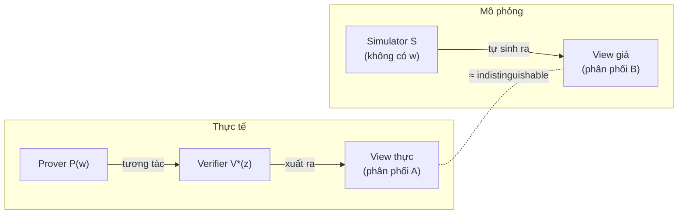
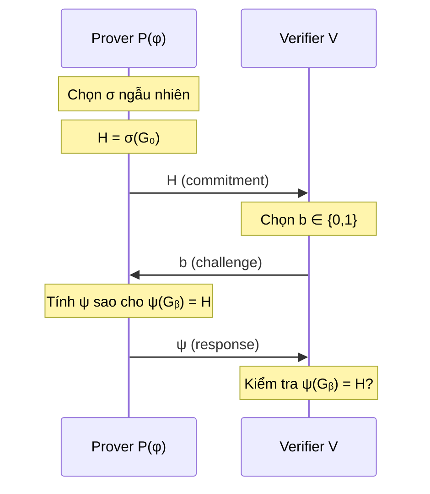

> **Prerequisites**: [[01-interactive-proofs-and-complexity|01. Interactive Proofs & Complexity]] — mô hình prover-verifier, completeness, soundness  
> **Objectives**:  
> - Hình thức hóa được câu hỏi: "verifier học được gì từ giao thức?"
> - Nắm vững khái niệm **view** của verifier và **transcript**
> - Hiểu **simulator paradigm** — nền tảng toán học của định nghĩa ZK
> - Phân biệt **HVZK** (honest-verifier) và **ZK** (full, against any verifier)

---

## Motivation

Hãy tưởng tượng Ali Baba biết mật khẩu mở hang, và muốn chứng minh điều đó cho Bob mà không tiết lộ mật khẩu. Họ có thể tương tác như sau: Bob đứng ngoài, Ali vào hang theo một trong hai lối và đi ra lối mà Bob yêu cầu. Nếu Ali thực sự biết mật khẩu, Ali luôn đi ra đúng lối. Nếu không biết, Ali chỉ đoán đúng với xác suất $1/2$.

Câu hỏi tinh tế hơn: **Bob học được gì từ quá trình này?** Sau $k$ lần thành công, Bob tin Ali biết mật khẩu — nhưng Bob có học được *mật khẩu* không? Trực giác nói là không. Nhưng làm thế nào để phát biểu điều này một cách toán học chính xác?

Đây là vấn đề trung tâm mà bài này giải quyết: **định nghĩa formal của "không tiết lộ thông tin"**.

---

## View của Verifier

### Transcript và View

Để nói "verifier không học được gì", ta phải định nghĩa rõ verifier *nhận được gì* trong suốt giao thức.

> [!definition] Definition 2.1 — Transcript và View
>
> Cho interactive proof $(P, V)$ trên input $x$ với witness $w$ (chứng nhân — giá trị bí mật mà $P$ biết và $V$ không biết):
>
> - **Transcript** $\tau$: dãy tất cả các tin nhắn được trao đổi giữa $P$ và $V$, theo thứ tự thời gian.
>
> $$\tau = (m_1, m_2, m_3, \ldots, m_{2k})$$
>
> trong đó $m_1, m_3, \ldots$ là tin nhắn của $P$ và $m_2, m_4, \ldots$ là challenge của $V$.
>
> - **View** của $V$: bao gồm transcript *và* toàn bộ các random bits nội bộ của $V$:
>
> $$\text{View}_V\langle P(w), V \rangle(x) = (x,\ r_V,\ m_1, m_2, \ldots, m_{2k})$$
>
> trong đó $r_V$ là random tape của $V$.

Lưu ý: $V$ tính ra các challenge $m_2, m_4, \ldots$ từ $r_V$ và các tin nhắn nhận được trước đó. Nên view chứa đủ thông tin để tái hiện lại mọi tính toán của $V$.

> [!note] Remark
> View là một **biến ngẫu nhiên** (random variable) — nó phụ thuộc vào random bits của cả $P$ lẫn $V$. Khi nói "verifier học được gì", ta đang hỏi về **phân phối** (distribution) của biến ngẫu nhiên này.

### Thông tin trong View

View của $V$ có thể tiết lộ thông tin về witness $w$ theo nhiều cách:

- Trực tiếp: $P$ vô tình gửi một tin nhắn chứa thông tin về $w$
- Gián tiếp: phân phối của các tin nhắn $P$ gửi phụ thuộc vào $w$ theo cách $V$ có thể nhận ra

Để chứng minh ZK, ta phải loại trừ cả hai khả năng này. Công cụ để làm điều đó là **simulator paradigm**.

---

## Simulator Paradigm

### Ý tưởng cốt lõi

Câu hỏi: *Verifier học được gì từ giao thức?*

Câu trả lời trực giác: Verifier không học được gì thêm ngoài sự thật rằng $x \in L$, nếu verifier *tự mình* có thể tạo ra một transcript có phân phối giống hệt transcript thực — **mà không cần biết witness**.

Nếu verifier có thể tự sinh ra một view trông y hệt view thực thì rõ ràng giao thức không thể đã cung cấp thêm thông tin nào, vì verifier không dùng gì từ prover để làm điều đó.

Đây là **simulator paradigm**: ZK ⟺ tồn tại một algorithm (simulator) có thể tái tạo view của verifier mà không cần witness.

> [!definition] Definition 2.2 — Simulator
>
> Một **simulator** $S$ là một thuật toán probabilistic polynomial-time (PPT) nhận input $x$ (và *không* nhận witness $w$) và xuất ra một phân phối trên các transcript có thể được so sánh với view thực.

### Định nghĩa ZK Chính Thức

> [!definition] Definition 2.3 — Zero-Knowledge (ZK)
>
> Một interactive proof $(P, V)$ cho ngôn ngữ $L$ là **zero-knowledge** nếu với mọi verifier $V^*$ chạy trong thời gian đa thức, tồn tại một simulator PPT $S$ sao cho với mọi $x \in L$ và mọi witness $w$ hợp lệ:
>
> $$\left\{ \text{View}_{V^*}\langle P(w), V^*(z) \rangle(x) \right\}_{x \in L} \approx \left\{ S(x, z) \right\}_{x \in L}$$
>
> Ký hiệu $\approx$ chỉ sự **indistinguishable** (không thể phân biệt). $z$ là **auxiliary input** — thông tin phụ mà $V^*$ có thể có từ trước.

Auxiliary input $z$ quan trọng: một verifier thực tế có thể đã biết một số thông tin liên quan đến $x$ trước khi bắt đầu giao thức. Định nghĩa ZK phải đảm bảo rằng ngay cả khi đó, giao thức cũng không tiết lộ thêm gì.

*ZK: phân phối A (view thực) và phân phối B (view giả của simulator) không thể phân biệt được.*

### Tại sao Simulator không cần Witness?

Đây là điểm tinh tế nhất: simulator $S$ chỉ nhận $x$, *không* nhận $w$. Nếu $S$ có thể tạo ra view thuyết phục mà không cần $w$, điều đó có nghĩa là:

> Bất kỳ thông tin nào verifier *tưởng* là học được từ prover thực ra đều có thể được verifier *tự tạo ra* — tức là giao thức không cung cấp thêm thông tin nào thực sự.

Đây là phép phủ nhận (negation) rất mạnh: "không tiết lộ thông tin" không phải là nói về entropy hay information theory theo nghĩa Shannon — mà là về khả năng tái tạo phân phối.

---

## Phân loại ZK theo Độ Mạnh của Indistinguishability

Ba mức độ của $\approx$ cho ra ba loại ZK khác nhau. Đây là nội dung của Bài 03 — ở đây ta chỉ cần biết sự phân loại tồn tại:

| Loại | Ký hiệu $\approx$ | Ý nghĩa |
|------|-----------------|---------|
| **Perfect ZK** | $\equiv$ (phân phối đồng nhất) | View thực và view giả có cùng phân phối chính xác |
| **Statistical ZK** | $\approx_s$ (statistical distance $\leq \text{negl}$) | Phân phối gần nhau về mặt thống kê, bất kể adversary có sức mạnh tính toán vô hạn |
| **Computational ZK** | $\approx_c$ (không PPT nào phân biệt được) | Chỉ cần adversary đa thức thời gian không phân biệt được |

Trong Bài 03 sẽ định nghĩa và phân tích chi tiết từng loại.

---

## Honest-Verifier ZK vs. Full ZK

### Vấn đề với HVZK

Nhiều giao thức ZK dễ thiết kế theo dạng **HVZK** (Honest-Verifier Zero-Knowledge): simulator chỉ hoạt động khi verifier tuân thủ giao thức (gửi challenge ngẫu nhiên đúng theo quy định).

> [!definition] Definition 2.4 — Honest-Verifier ZK (HVZK)
>
> Một interactive proof là **HVZK** nếu định nghĩa ZK thỏa mãn *chỉ* với verifier trung thực $V$ (verifier tuân thủ giao thức, không có auxiliary input):
>
> $$\left\{ \text{View}_V\langle P(w), V \rangle(x) \right\} \approx \left\{ S(x) \right\}$$

> [!definition] Definition 2.5 — Full ZK (ZK against malicious verifier)
>
> Một interactive proof là **full ZK** nếu định nghĩa ZK thỏa mãn với *mọi* PPT verifier $V^*$, kể cả verifier gian lận gửi challenge không đều:
>
> $$\forall V^* \text{ PPT},\ \forall z:\ \left\{ \text{View}_{V^*}\langle P(w), V^*(z) \rangle(x) \right\} \approx \left\{ S(x, z) \right\}$$

### Tại sao sự phân biệt này quan trọng?

Một verifier gian lận $V^*$ có thể gửi challenge không ngẫu nhiên — ví dụ, challenge được tính toán từ commitment của prover, nhằm ép prover tiết lộ thông tin về $w$. HVZK không bảo vệ chống lại điều này.

> [!warning] Pitfall
> **HVZK không ngụ ý Full ZK.** Một giao thức HVZK có thể bị phá vỡ khi verifier gian lận nếu không có biện pháp bổ sung (như sử dụng Fiat-Shamir transform hoặc thiết kế giao thức cẩn thận hơn).
>
> Tuy nhiên, trong thực tế, nhiều giao thức HVZK được *compiles* thành NIZK an toàn thông qua Fiat-Shamir transform (Bài 08), và tính ZK đầy đủ đạt được trong Random Oracle Model.

---

## Ví dụ Cụ thể: Graph Isomorphism là HVZK

Đây là ví dụ kinh điển nhất minh họa simulator paradigm hoạt động.

**Bài toán**: Cho $G_0$ và $G_1$ là hai đồ thị đẳng cấu ($G_0 \cong G_1$) với đẳng cấu bí mật $\phi$ (prover biết $\phi$, verifier không biết). Prover muốn chứng minh biết $\phi$ mà không tiết lộ $\phi$.

> [!example] Example 2.6 — Giao thức Graph Isomorphism (GMW 1986)
>
> **Setup**: $x = (G_0, G_1)$, witness $w = \phi$ sao cho $\phi(G_0) = G_1$.
>
> **Round 1 (Commit)**: $P$ chọn hoán vị ngẫu nhiên $\sigma$ trên tập đỉnh. Tính $H = \sigma(G_0)$. Gửi $H$ cho $V$.
>
> **Round 2 (Challenge)**: $V$ chọn ngẫu nhiên bit $b \in \{0, 1\}$. Gửi $b$ cho $P$.
>
> **Round 3 (Response)**: $P$ trả lời bằng hoán vị $\psi$ sao cho $\psi(G_b) = H$:
> - Nếu $b = 0$: $\psi = \sigma$ (vì $\sigma(G_0) = H$)
> - Nếu $b = 1$: $\psi = \sigma \circ \phi^{-1}$ (vì $\sigma(\phi^{-1}(G_1)) = \sigma(G_0) = H$)
>
> **Verification**: $V$ kiểm tra $\psi(G_b) = H$.

*Giao thức 3-move cho Graph Isomorphism: commit → challenge → response.*

**Phân tích Completeness**: Nếu $P$ trung thực và biết $\phi$, $P$ luôn tính được $\psi$ đúng. $V$ chấp nhận với xác suất 1.

**Phân tích Soundness**: Nếu $G_0 \not\cong G_1$ (prover gian lận), $P^*$ gửi $H$ nào đó. $H$ có thể đẳng cấu với nhiều nhất một trong $G_0, G_1$ (nếu đẳng cấu với cả hai thì $G_0 \cong G_1$, mâu thuẫn). Vậy với xác suất $1/2$, $b$ là giá trị mà $H$ không đẳng cấu với $G_b$, và $P^*$ không thể trả lời đúng.

### Simulator cho Graph Isomorphism (HVZK)

> [!example] Example 2.7 — Simulator cho Graph Isomorphism
>
> Simulator $S(x) = S(G_0, G_1)$ hoạt động như sau:
>
> 1. Chọn ngẫu nhiên $b' \in \{0, 1\}$ và hoán vị ngẫu nhiên $\psi'$.
> 2. Tính $H' = \psi'(G_{b'})$.
> 3. Xuất transcript $(H', b', \psi')$.
>
> **Nhận xét**: Đây là transcript hợp lệ — $\psi'(G_{b'}) = H'$ đúng theo cách xây dựng. Và simulator *không dùng* $\phi$.
>
> **Phân phối của simulator**: $H'$ là ảnh của $G_{b'}$ qua hoán vị ngẫu nhiên → $H'$ phân phối đều trên mọi đồ thị đẳng cấu với $G_0$ (hay $G_1$ — vì $G_0 \cong G_1$). Challenge $b'$ phân phối đều. Tất cả nhất quán.
>
> **Phân phối thực**: Trong giao thức thực, $H = \sigma(G_0)$ cũng phân phối đều trên đồ thị đẳng cấu với $G_0$. Challenge $b$ phân phối đều. Transcript $(H, b, \psi)$ có cùng phân phối với $(H', b', \psi')$.
>
> Kết luận: hai phân phối **đồng nhất** → giao thức Graph Isomorphism là **Perfect HVZK**.

> [!note] Remark — Tại sao chỉ là HVZK?
> Simulator trên chỉ hoạt động vì ta giả sử $b'$ phân phối đều — đúng với honest verifier. Nếu $V^*$ gian lận gửi $b$ phụ thuộc vào $H$, simulator cần "đoán" $b$ trước khi tạo $H$ — nhưng sau khi gửi $H$ rồi thì không thể quay lại.
>
> Để đạt full ZK, cần kỹ thuật bổ sung như **rewinding** — đây là nội dung của Bài 04 (Knowledge Extractor) và liên quan đến Sigma Protocols (Bài 05).

---

## Phân tích Sâu hơn: Tại sao Simulation = "Không học được gì"?

Hãy trả lời câu hỏi: tại sao simulation lại là cách đúng để hình thức hóa "không tiết lộ thông tin"?

**Lập luận trực giác**: Nếu $S$ có thể tạo ra view $\approx$ view thực mà không cần $w$, thì mọi thứ $V^*$ có thể tính ra từ view thực, $V^*$ cũng có thể tính ra từ view giả (vì hai view không thể phân biệt). Nhưng $V^*$ tự sinh view giả được mà không cần giao thức. Suy ra $V^*$ không cần giao thức để tính ra bất kỳ thứ gì.

**Lập luận formal**: Giả sử sau khi chạy giao thức, $V^*$ có thể tính ra một bit $f(w)$ nào đó của witness với xác suất đáng kể hơn $1/2$. Khi đó ta xây dựng một **distinguisher** $D$ phân biệt view thực và view giả: $D$ chạy thuật toán của $V^*$ trên view nhận được, và nếu view thực thì $V^*$ tính đúng $f(w)$, còn view giả thì không (vì view giả không liên quan đến $w$). Điều này mâu thuẫn với giả thiết indistinguishability.

> [!theorem] Theorem 2.8 — ZK ⟹ No Information Leakage
>
> Nếu $(P, V)$ là ZK, thì với mọi PPT $A$ và mọi hàm $f$:
>
> $$\Pr[A(\text{View}_{V^*}\langle P(w), V^* \rangle(x)) = f(w)] \leq \Pr[A(S(x)) = f(w)] + \text{negl}(\lambda)$$
>
> Tức là: adversary không học được hàm *nào* của witness từ giao thức hơn mức có thể tính từ $x$ đơn thuần.

---

## Summary

- **View** của verifier $= (x, r_V, \text{transcript})$ — biến ngẫu nhiên ghi lại toàn bộ thông tin verifier nhận được.
- **Simulator paradigm**: ZK ⟺ tồn tại PPT $S$ tạo ra view có phân phối $\approx$ view thực *mà không cần witness*.
- Định nghĩa ZK đòi hỏi $\forall V^*$ PPT — kể cả verifier gian lận với auxiliary input $z$.
- **HVZK**: simulator chỉ cần hoạt động với honest verifier — yếu hơn, nhưng đủ cho nhiều ứng dụng (đặc biệt sau khi compile với Fiat-Shamir).
- **Graph Isomorphism** là ví dụ Perfect HVZK: simulator không cần witness, chỉ cần "đoán" challenge trước khi tạo commitment.
- ZK ⟹ không có hàm nào của witness bị rò rỉ (Theorem 2.8) — nhưng điều ngược lại không nhất thiết đúng.
- Mức độ của $\approx$ (perfect / statistical / computational) cho ra ba loại ZK khác nhau — phân tích chi tiết trong Bài 03.

---

## References

- Goldwasser, Micali, Rackoff — *The Knowledge Complexity of Interactive Proof Systems* (1989)
- Goldreich, Micali, Wigderson — *Proofs that Yield Nothing But Their Validity* (1991) — JACM
- Boneh & Shoup — *A Graduate Course in Applied Cryptography*, Ch. 19 (toc.cryptobook.us)
- Thaler — *Proofs, Arguments, and Zero-Knowledge*, Ch. 3 (people.cs.georgetown.edu/jthaler/ProofsArgsAndZK.pdf)
- Goldreich — *Foundations of Cryptography Vol. 1*, Ch. 4 (definitions of ZK)
