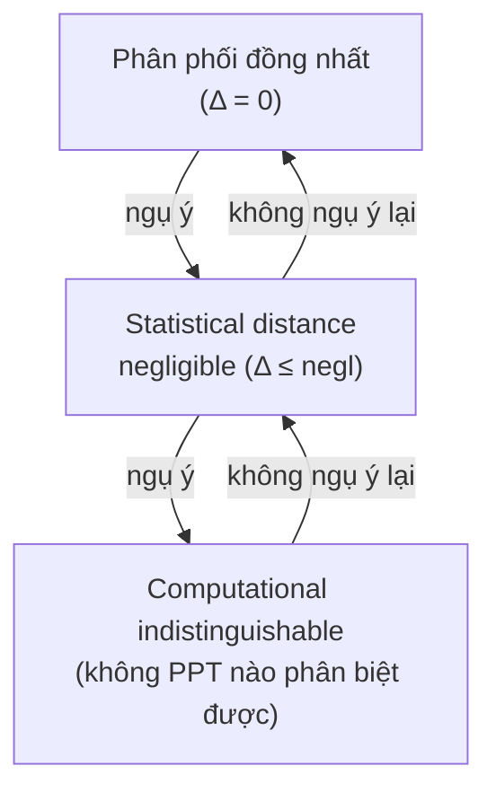

> **Prerequisites**: [[02-zk-definitions-and-simulator|02. ZK Definitions & Simulator Paradigm]] — view, simulator paradigm, định nghĩa ZK  
> **Objectives**:  
> - Định nghĩa chính xác ba mức độ ZK: perfect, statistical, computational
> - Nắm vững khái niệm **statistical distance** và **computational indistinguishability**
> - Hiểu quan hệ bao hàm và sự khác biệt về giả định bảo mật giữa ba loại
> - Nhận diện loại ZK của các giao thức cụ thể

---

## Motivation

Trong Bài 02, ta định nghĩa ZK qua ký hiệu $\approx$ — "phân phối của view thực và view giả không thể phân biệt". Nhưng "không thể phân biệt" có thể có nhiều nghĩa khác nhau về mặt toán học, và mỗi nghĩa cho ra một mức độ đảm bảo bảo mật khác nhau.

Câu hỏi cụ thể: nếu view thực và view giả *gần giống nhau nhưng không đồng nhất*, điều đó có đủ để bảo mật không? Điều đó phụ thuộc vào adversary có sức mạnh tính toán như thế nào. Bài này phân tích ba mức độ, từ mạnh nhất đến yếu nhất.

---

## Công cụ nền tảng: Statistical Distance

Trước khi định nghĩa ba loại ZK, ta cần hai công cụ đo lường sự khác biệt giữa các phân phối.

### Statistical Distance

> [!definition] Definition 3.1 — Statistical Distance
>
> Cho hai phân phối $X$ và $Y$ trên cùng không gian mẫu $\Omega$. **Statistical distance** (khoảng cách thống kê) giữa chúng là:
>
> $$\Delta(X, Y) = \frac{1}{2} \sum_{\omega \in \Omega} \left| \Pr[X = \omega] - \Pr[Y = \omega] \right|$$
>
> Tương đương:
>
> $$\Delta(X, Y) = \max_{S \subseteq \Omega} \left| \Pr[X \in S] - \Pr[Y \in S] \right|$$

Diễn giải của định nghĩa thứ hai: $\Delta(X, Y)$ là ưu thế tối đa mà bất kỳ test nào (kể cả có sức mạnh tính toán vô hạn) có thể đạt được khi phân biệt $X$ và $Y$. Nếu $\Delta(X, Y) = 0$ thì hai phân phối hoàn toàn như nhau; nếu $\Delta(X, Y) = 1$ thì có thể phân biệt hoàn hảo.

> [!example] Example 3.2 — Tính Statistical Distance
>
> $X$ phân phối đều trên $\{0, 1, 2\}$, $Y$ phân phối đều trên $\{0, 1, 2, 3\}$.
>
> $$\Pr[X=0] = \frac{1}{3}, \quad \Pr[Y=0] = \frac{1}{4}$$
>
> $$\Delta(X, Y) = \frac{1}{2}\left(\left|\frac{1}{3} - \frac{1}{4}\right| \cdot 3 + \left|0 - \frac{1}{4}\right|\right) = \frac{1}{2}\left(3 \cdot \frac{1}{12} + \frac{1}{4}\right) = \frac{1}{2} \cdot \frac{1}{2} = \frac{1}{4}$$

> [!note] Remark — Statistical Distance và Lợi thế Phân biệt
>
> Nếu adversary $D$ nhận được một mẫu từ $X$ hoặc $Y$ (mỗi loại xác suất $1/2$) và phải đoán từ đâu, lợi thế của $D$ (advantage) tốt nhất là:
>
> $$\text{Adv}(D) = \left| \Pr[D(X) = 1] - \Pr[D(Y) = 1] \right| \leq \Delta(X, Y)$$
>
> Adversary tốt nhất đạt đúng $\Delta(X, Y)$ — không hơn, dù có sức mạnh tính toán vô hạn.

### Computational Indistinguishability

> [!definition] Definition 3.3 — Computational Indistinguishability
>
> Hai family phân phối $\{X_\lambda\}_\lambda$ và $\{Y_\lambda\}_\lambda$ là **computationally indistinguishable** (ký hiệu $X \approx_c Y$) nếu với mọi thuật toán PPT $D$ (distinguisher):
>
> $$\left| \Pr[D(1^\lambda, X_\lambda) = 1] - \Pr[D(1^\lambda, Y_\lambda) = 1] \right| \leq \text{negl}(\lambda)$$

Sự khác biệt then chốt với statistical distance: $\approx_c$ chỉ yêu cầu adversary *đa thức thời gian* không phân biệt được. Adversary có sức mạnh vô hạn *có thể* phân biệt được $X$ và $Y$ — nhưng điều đó không ảnh hưởng đến bảo mật trong thực tế nếu không có adversary đa thức thời gian nào làm được.

*Quan hệ một chiều: mỗi mức độ mạnh hơn ngụ ý mức độ yếu hơn, nhưng không ngược lại.*

---

## Ba Loại ZK

### Perfect Zero-Knowledge (PZK)

> [!definition] Definition 3.4 — Perfect Zero-Knowledge
>
> Interactive proof $(P, V)$ là **perfect zero-knowledge (PZK)** nếu với mọi verifier $V^*$ PPT, tồn tại simulator $S$ PPT sao cho:
>
> $$\forall x \in L,\ \forall w,\ \forall z:\ \text{View}_{V^*}\langle P(w), V^*(z) \rangle(x) \equiv S(x, z)$$
>
> Ký hiệu $\equiv$ nghĩa là hai phân phối **đồng nhất** (identical distributions), tức là $\Delta = 0$.

PZK là mức độ mạnh nhất: ngay cả adversary có sức mạnh tính toán vô hạn cũng không thể phân biệt view thực và view giả. Không có giả định tính toán nào được sử dụng.

**Ví dụ**: Graph Isomorphism (Bài 02) là Perfect HVZK — simulator tạo ra phân phối đồng nhất với view thực.

> [!note] Remark
> PZK rất mạnh nhưng hiếm gặp trong thực tế vì khó đạt được khi giao thức phức tạp. Thường chỉ đạt được ở dạng HVZK (honest-verifier), sau đó dùng Fiat-Shamir để compile thành NIZK.

### Statistical Zero-Knowledge (SZK)

> [!definition] Definition 3.5 — Statistical Zero-Knowledge
>
> Interactive proof $(P, V)$ là **statistical zero-knowledge (SZK)** nếu với mọi verifier $V^*$ PPT, tồn tại simulator $S$ PPT sao cho:
>
> $$\forall x \in L,\ \forall w,\ \forall z:\ \Delta\!\left(\text{View}_{V^*}\langle P(w), V^*(z) \rangle(x),\ S(x, z)\right) \leq \text{negl}(|x|)$$

SZK yếu hơn PZK một chút: hai phân phối không nhất thiết phải đồng nhất, nhưng statistical distance giữa chúng là negligible. Ngay cả adversary có sức mạnh vô hạn cũng không thể khai thác sự khác biệt này.

**Ví dụ**: Giao thức Pedersen commitment mở (reveal) với randomness — thường đạt SZK thay vì PZK vì simulator cần tạo randomness giả mà phân phối gần nhưng không hoàn toàn đồng nhất với randomness thực.

### Computational Zero-Knowledge (CZK)

> [!definition] Definition 3.6 — Computational Zero-Knowledge
>
> Interactive proof $(P, V)$ là **computational zero-knowledge (CZK)** nếu với mọi verifier $V^*$ PPT, tồn tại simulator $S$ PPT sao cho:
>
> $$\forall x \in L,\ \forall w,\ \forall z:\ \text{View}_{V^*}\langle P(w), V^*(z) \rangle(x) \approx_c S(x, z)$$

CZK là mức độ yếu nhất: chỉ cần adversary đa thức thời gian không thể phân biệt. Adversary vô hạn *có thể* phân biệt được, nhưng trong thực tế mọi adversary đều bị giới hạn tính toán. CZK thường dựa trên một giả định tính toán cụ thể (ví dụ: hardness của discrete log, DDH, LWE, ...).

**Ví dụ**: Phần lớn các SNARK và Sigma protocol hiện đại là CZK, dựa trên DDH hoặc các giả định tính toán khác.

---

## Quan hệ giữa Ba Loại

> [!theorem] Theorem 3.7 — Quan hệ bao hàm
>
> $$\text{PZK} \subsetneq \text{SZK} \subsetneq \text{CZK}$$
>
> Tức là:
> - Mọi PZK đều là SZK (hiển nhiên — $\Delta = 0$ ngụ ý $\Delta \leq \text{negl}$)
> - Mọi SZK đều là CZK (hiển nhiên — phân phối gần về thống kê ngụ ý không PPT nào phân biệt được)
> - Hai chiều ngược lại không đúng trong tổng quát

Bảng so sánh:

| Thuộc tính | Perfect ZK | Statistical ZK | Computational ZK |
|------------|-----------|----------------|-----------------|
| Adversary bị đánh bại | Vô hạn | Vô hạn | Chỉ PPT |
| Giả định tính toán | Không cần | Không cần | Cần (DDH, LWE, ...) |
| Sức mạnh bảo mật | Tối đa | Rất mạnh | Thực dụng |
| Tính khả thi | Khó đạt | Khó đạt | Phổ biến nhất |
| Ví dụ điển hình | Graph Isomorphism | Pedersen-based protocols | Schnorr, Groth16, PLONK |

---

## Lớp Độ Phức Tạp SZK

Các bài toán có SZK proof system tạo thành lớp **SZK** trong lý thuyết độ phức tạp.

> [!theorem] Theorem 3.8 — SZK ⊆ AM ∩ co-AM (Fortnow 1989)
>
> Mọi bài toán có SZK proof system nằm trong $\text{AM} \cap \text{co-AM}$.
>
> Điều này ngụ ý: nếu $\text{NP} \not\subseteq \text{co-AM}$ (giả định thường được tin là đúng), thì không có bài toán NP-complete nào có SZK proof.

> [!theorem] Theorem 3.9 — Sahai-Vadhan (1997)
>
> Có một bài toán **SZK-complete** tự nhiên: **Statistical Difference problem (SD)**. Cho hai mạch $C_0, C_1$ mô tả phân phối, quyết định:
> - $\Delta(C_0, C_1) \geq 2/3$ (YES instance), hoặc
> - $\Delta(C_0, C_1) \leq 1/3$ (NO instance)
>
> Mọi bài toán trong SZK đều có thể reduce về SD.

Ý nghĩa: SZK là lớp tự nhiên, có cấu trúc đẹp, và bao gồm các bài toán quan trọng như Graph Isomorphism, Quadratic Residuosity.

---

## Ví dụ Theo Từng Loại ZK

### Perfect ZK: Quadratic Residuosity

Bài toán: cho $N = pq$ (tích hai số nguyên tố) và $y \in \mathbb{Z}_N^*$, chứng minh $y$ là **quadratic residue** (bình phương của một phần tử nào đó), tức là tồn tại $x$ sao cho $x^2 \equiv y \pmod N$.

> [!example] Example 3.10 — Giao thức QR (Perfect HVZK)
>
> Witness: $x$ sao cho $x^2 \equiv y \pmod N$.
>
> 1. $P$ chọn ngẫu nhiên $r \in \mathbb{Z}_N^*$, tính $s = r^2 \bmod N$. Gửi $s$ cho $V$.
> 2. $V$ chọn $b \in \{0, 1\}$. Gửi $b$.
> 3. $P$ gửi $z = r \cdot x^b \bmod N$.
> 4. $V$ kiểm tra $z^2 \equiv s \cdot y^b \pmod N$.
>
> **Simulator** $S$: Chọn ngẫu nhiên $b' \in \{0,1\}$ và $z' \in \mathbb{Z}_N^*$. Tính $s' = z'^2 \cdot y^{-b'} \bmod N$. Xuất $(s', b', z')$.
>
> Phân phối của $(s', b', z')$ đồng nhất với phân phối thực → **Perfect HVZK**.

### Statistical ZK: Giao thức dựa Pedersen Commitment

Trong nhiều giao thức dùng Pedersen commitment $C = g^m h^r$ với $r$ ngẫu nhiên, simulator thường cần tạo ra $r$ "giả" không hoàn toàn đồng nhất với $r$ thật (vì phân phối của $r$ thật bị conditioned trên $m$). Kết quả là statistical distance negligible → SZK.

### Computational ZK: Schnorr Protocol

Giao thức Schnorr (Bài 05) là CZK dưới giả định DDH (Decisional Diffie-Hellman). Simulator chạy bằng cách "đoán" challenge trước, nhưng cần abort và restart với xác suất nhất định. Phân phối cuối cùng computationally indistinguishable với view thực dưới DDH.

---

## Perfect ZK cho NP-Complete: Nền tảng lý thuyết

Một kết quả nền tảng quan trọng:

> [!theorem] Theorem 3.11 — GMW: NP ⊆ CZK (Goldreich-Micali-Wigderson 1987)
>
> Giả sử tồn tại **one-way permutation** (và do đó commitment scheme). Thì mọi ngôn ngữ trong NP có một **computational ZK** interactive proof.
>
> Cụ thể: bài toán **Graph 3-Coloring** — bài toán NP-complete — có CZK proof. Vì mọi bài toán NP đều reduce về Graph 3-Coloring, suy ra mọi bài toán NP đều có CZK proof.

Đây là kết quả lý thuyết có tầm quan trọng lịch sử: nó nói rằng ZKP không chỉ tồn tại cho các bài toán đặc biệt (như QR hay Graph Isomorphism) mà cho *toàn bộ* lớp NP. Tuy nhiên, giao thức này không hiệu quả trong thực tế (dùng commitment scheme cho từng cạnh đồ thị) — đây là lý do các scheme hiện đại (SNARK/STARK) được phát triển.

---

## Summary

- **Statistical distance** $\Delta(X, Y)$: đo sự khác biệt tối đa giữa hai phân phối, bất kể sức mạnh tính toán.
- **Computational indistinguishability** $\approx_c$: không PPT nào phân biệt được, nhưng adversary vô hạn có thể.
- **PZK**: view thực $\equiv$ view giả — không giả định tính toán, bảo mật tuyệt đối.
- **SZK**: $\Delta(\text{view thực}, \text{view giả}) \leq \text{negl}$ — bảo mật chống adversary vô hạn.
- **CZK**: view thực $\approx_c$ view giả — cần giả định tính toán (DDH, LWE, ...), phổ biến nhất trong thực tế.
- Quan hệ: $\text{PZK} \subsetneq \text{SZK} \subsetneq \text{CZK}$.
- **NP ⊆ CZK** (GMW 1987): mọi bài toán NP có ZK proof, nền tảng lý thuyết của ZKP hiện đại.

---

## References

- Goldreich, Micali, Wigderson — *Proofs that Yield Nothing But Their Validity* (1991) — JACM
- Sahai, Vadhan — *A Complete Problem for Statistical Zero Knowledge* (1997) — JACM
- Fortnow — *The Complexity of Perfect Zero-Knowledge* (1989)
- Boneh & Shoup — *A Graduate Course in Applied Cryptography*, Ch. 19 (toc.cryptobook.us)
- Thaler — *Proofs, Arguments, and Zero-Knowledge*, Ch. 3 (people.cs.georgetown.edu/jthaler/ProofsArgsAndZK.pdf)
- Goldreich — *Foundations of Cryptography Vol. 1*, Sec. 4.3–4.4
