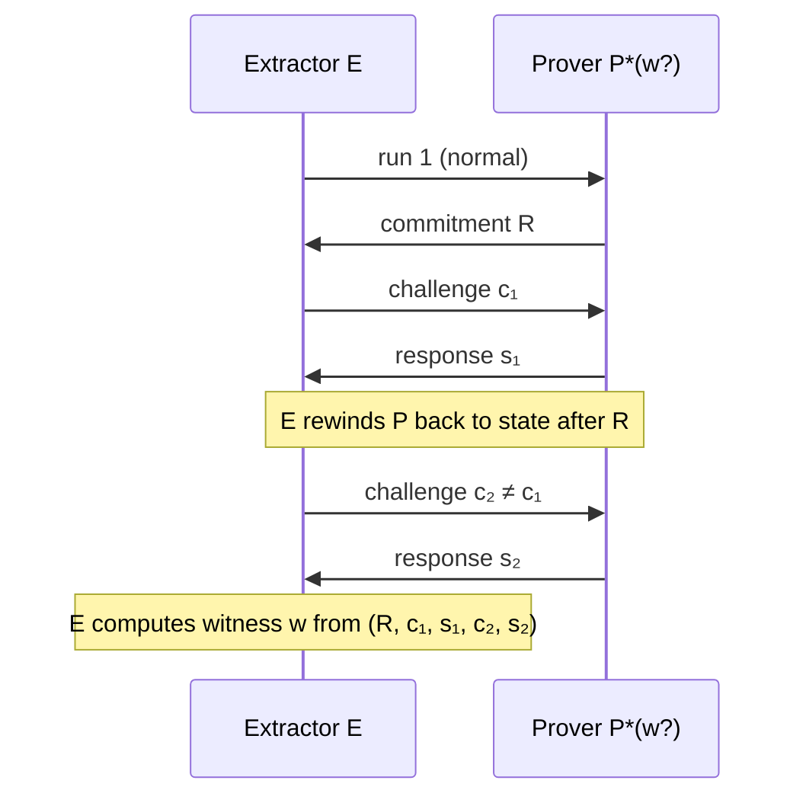

> **Prerequisites**: [[02-zk-definitions-and-simulator|02. ZK Definitions & Simulator Paradigm]] — view, soundness; [[03-perfect-statistical-computational-zk|03. Perfect, Statistical, Computational ZK]] — các mức độ ZK  
> **Objectives**:  
> - Phân biệt rõ "chứng minh rằng $x \in L$" với "chứng minh rằng mình *biết* witness $w$"
> - Nắm vững định nghĩa formal của **proof of knowledge** qua **knowledge extractor**
> - Hiểu kỹ thuật **rewinding** — cách extractor hoạt động
> - Thấy tại sao knowledge soundness là tính chất mạnh hơn soundness thông thường

---

## Motivation

Soundness thông thường (Bài 01) nói rằng: nếu $x \notin L$, không prover nào có thể thuyết phục verifier chấp nhận. Đây là tính chất về *tính đúng của tuyên bố*.

Nhưng trong nhiều ứng dụng thực tế, điều ta thực sự muốn mạnh hơn. Ví dụ:

- Trong xác thực (authentication): không chỉ muốn biết rằng "có tồn tại ai đó biết khóa bí mật", mà muốn biết rằng *chính prover này* biết khóa bí mật.
- Trong chữ ký số: người ký phải chứng minh rằng *họ* có private key, không chỉ rằng private key tồn tại.
- Trong blockchain: người chi tiêu coin phải chứng minh rằng *họ* sở hữu coin, không chỉ rằng coin hợp lệ.

Câu hỏi: làm thế nào để phân biệt hai tình huống sau?

1. Prover biết witness $w$ và dùng $w$ để tạo proof.
2. Prover không biết $w$ nhưng bằng cách nào đó vẫn tạo được proof thuyết phục (thông qua may mắn, hoặc exploit cấu trúc giao thức).

Soundness thông thường không thể phân biệt hai trường hợp này — nó chỉ đảm bảo trường hợp 2 xảy ra với xác suất nhỏ, nhưng không đảm bảo rằng trường hợp 1 là lý do thực sự prover thành công.

**Proof of Knowledge** giải quyết câu hỏi này thông qua một định nghĩa tinh tế hơn.

---

## Từ Soundness đến Knowledge Soundness

### Soundness Thông Thường — Hạn Chế

> [!note] Remark — Soundness không ngụ ý "Biết Witness"
>
> Giả sử $L = \{x : \exists w,\ R(x, w) = 1\}$ và $(P, V)$ có soundness. Soundness nói: nếu $x \notin L$, mọi prover đều bị từ chối. Nhưng nếu $x \in L$, soundness không nói gì về việc prover có *biết* $w$ hay không.
>
> Ví dụ cực đoan: Trong một giao thức NP cổ điển (prover gửi witness, verifier kiểm tra), nếu prover không biết witness thì không thể tạo proof. Nhưng trong các interactive proof phức tạp hơn, cấu trúc giao thức có thể cho phép prover "may mắn" trả lời đúng mà không cần witness thực sự.

### Trực Giác về Knowledge Soundness

Ý tưởng: nếu prover có thể thuyết phục verifier chấp nhận với xác suất đáng kể hơn "may mắn thuần túy", thì prover *phải đang sử dụng* witness. Cách formalize điều này là thông qua **knowledge extractor**.

Nếu tồn tại một thuật toán $E$ (extractor) có thể, bằng cách *tương tác với prover như một black box*, rút ra (extract) witness $w$ từ prover — thì ta có thể kết luận prover biết $w$.

---

## Knowledge Extractor và Rewinding

### Mô hình Black-Box Extractor

> [!definition] Definition 4.1 — Black-Box Knowledge Extractor
>
> Một **knowledge extractor** $E$ là thuật toán có access đến prover $P^*$ như một **oracle** (black box). $E$ có thể:
> - Gửi messages cho $P^*$ và nhận responses
> - **Rewind** (tua lại) $P^*$ về trạng thái bất kỳ trước đó
> - Reset random tape của $P^*$ hoặc gửi lại message từ một điểm trước
>
> $E$ không có access bên trong thuật toán của $P^*$ — chỉ quan sát input/output.

Khả năng **rewinding** là điểm then chốt. Trong thực tế, một verifier không thể rewind prover — nhưng trong định nghĩa lý thuyết (để *chứng minh* tính chất), ta cho phép extractor làm điều này.

> [!note] Remark — Tại sao Extractor Cần Rewind?
>
> Để extract witness từ prover, extractor thường cần prover trả lời *hai challenge khác nhau* cho cùng một commitment. Điều này không thể xảy ra trong một lần chạy giao thức đơn (prover chỉ nhận một challenge). Rewinding cho phép extractor "chạy lại" prover với challenge khác, thu được hai responses và từ đó tính ra witness.

### Rewinding — Ví dụ Cụ thể

Xét giao thức Schnorr (ta sẽ phân tích chi tiết trong Bài 05), nhưng ý tưởng extraction như sau: prover cam kết một giá trị $R$, nhận challenge $c$, trả lời $s$. Nếu extractor rewind và gửi challenge khác $c'$, prover trả lời $s'$. Từ $(R, c, s)$ và $(R, c', s')$ với cùng một $R$, extractor có thể tính ra witness.

*Extractor dùng rewinding: gửi hai challenge khác nhau cho cùng commitment, nhận hai responses, và extract witness từ cặp này.*

---

## Định nghĩa Proof of Knowledge

### Special Soundness — Trường hợp Đặc Biệt

Trước khi đến định nghĩa tổng quát, ta định nghĩa **special soundness** — tính chất quan trọng của Sigma protocols:

> [!definition] Definition 4.2 — Special Soundness
>
> Một 3-move interactive proof $(P, V)$ có **special soundness** nếu tồn tại thuật toán đa thức thời gian $E$ (extractor) sao cho:
>
> Cho hai transcript hợp lệ $(a, c_1, z_1)$ và $(a, c_2, z_2)$ với cùng commitment $a$ nhưng **khác challenge** $c_1 \neq c_2$ (một "accepting transcript pair"), $E$ luôn tính được witness $w$ hợp lệ trong thời gian đa thức.
>
> Tức là: $E(a, c_1, z_1, a, c_2, z_2) = w$ sao cho $R(x, w) = 1$.

Special soundness trực tiếp hơn: không cần nói đến xác suất — chỉ cần có hai transcript hợp lệ với commitment giống nhau và challenge khác nhau là đủ để extract.

### Proof of Knowledge — Định nghĩa Tổng Quát

> [!definition] Definition 4.3 — Proof of Knowledge (PoK)
>
> Interactive proof $(P, V)$ cho quan hệ $R = \{(x, w)\}$ là một **proof of knowledge** với **knowledge error** $\kappa$ nếu tồn tại PPT extractor $E$ sao cho:
>
> Với mọi prover $P^*$ và mọi $x$, nếu:
>
> $$\Pr[\langle P^*, V \rangle(x) = \text{accept}] \geq \kappa(x) + \epsilon$$
>
> thì $E^{P^*}(x)$ (extractor với oracle access đến $P^*$) xuất ra $w$ hợp lệ với xác suất ít nhất $\text{poly}(\epsilon)$, trong thời gian $\text{poly}(|x|, 1/\epsilon)$.

Diễn giải: nếu prover thành công với xác suất *đáng kể* hơn knowledge error $\kappa$ (mức "may mắn thuần túy"), thì extractor có thể extract witness từ prover đó. Prover không thể "giả vờ biết" — nếu thành công quá ngưỡng $\kappa$, extractor sẽ rút ra witness thực.

> [!note] Remark — Knowledge Error
>
> Knowledge error $\kappa$ là xác suất prover thành công mà *không cần* biết witness (chỉ nhờ may mắn). Trong giao thức 3-move với challenge space $\mathcal{C}$, knowledge error thường là $1/|\mathcal{C}|$.
>
> - Challenge space nhỏ (ví dụ $\{0,1\}$): $\kappa = 1/2$ — cần lặp lại nhiều lần để giảm xuống.
> - Challenge space lớn ($\mathbb{F}_p$ với $p$ là số nguyên tố lớn): $\kappa = 1/p \approx 2^{-128}$ — một lần chạy đã đủ.

---

## Phân tích Forking Lemma

### Phát biểu Không Chính Thức

Để chứng minh một giao thức là PoK, ta cần chứng minh extractor hoạt động. Công cụ then chốt là **Forking Lemma**.

> [!theorem] Theorem 4.4 — Forking Lemma (Bellare-Neven 2006, phiên bản đơn giản)
>
> Cho 3-move interactive proof với challenge space $\mathcal{C}$ có $|\mathcal{C}| = N$. Nếu prover $P^*$ thuyết phục verifier chấp nhận với xác suất $\epsilon > 0$, thì extractor chạy $P^*$ nhiều lần (với cùng commitment, các challenge khác nhau) tạo ra accepting transcript pair trong thời gian $O(N/\epsilon)$ với xác suất ít nhất $\epsilon - 1/N$.

Chứng minh chi tiết và phiên bản tổng quát hơn của Forking Lemma được trình bày trong [[a0-forking-lemma|A0. Forking Lemma — Full Proof]].

### Ý nghĩa

Forking Lemma nói: nếu prover thành công với $\epsilon > 0$, thì sau $O(1/\epsilon)$ lần rewind, extractor gần như chắc chắn thu được hai responses khác nhau cho cùng một commitment. Special soundness sau đó cho phép tính witness.

Đây là cầu nối giữa "giao thức có special soundness" và "giao thức là PoK": special soundness + Forking Lemma ⟹ PoK.

> [!theorem] Theorem 4.5 — Special Soundness ⟹ Proof of Knowledge
>
> Nếu một 3-move interactive proof có special soundness và challenge space có kích thước $N$, thì nó là PoK với knowledge error $1/N$.
>
> **Chứng minh phác thảo**: Extractor chạy $P^*$ với commitment $a$ nhận được. Nếu $P^*$ thành công với xác suất $\epsilon > 1/N$, theo Forking Lemma, extractor rewind và thu được hai transcript $(a, c_1, z_1)$ và $(a, c_2, z_2)$ với $c_1 \neq c_2$ (vì challenge space đủ lớn, có thể chọn hai challenge khác nhau mà $P^*$ đều trả lời đúng). Special soundness cho phép tính $w$. $\blacksquare$

---

## Knowledge Soundness vs. Soundness Thông Thường

Đây là điểm tinh tế quan trọng nhất của bài này:

> [!theorem] Theorem 4.6 — Knowledge Soundness ⟹ Soundness
>
> Mọi giao thức có knowledge soundness đều có soundness thông thường.
>
> **Chứng minh**: Nếu $x \notin L$ (không có witness hợp lệ), thì extractor không thể extract witness (vì witness không tồn tại). Theo định nghĩa PoK, prover thành công với xác suất $\leq \kappa + \text{negl} \approx \kappa$. $\blacksquare$

> [!warning] Pitfall — Chiều ngược lại không đúng
>
> **Soundness KHÔNG ngụ ý Knowledge Soundness.**
>
> Ví dụ trực quan: Giả sử $L = \{N : N \text{ là hợp số}\}$ và giao thức là "prover gửi $N = pq$ với $p, q$". Giao thức này có soundness (nếu $N$ là số nguyên tố, prover không thể phân tích), nhưng liệu nó có knowledge soundness không?
>
> Câu trả lời phụ thuộc vào cấu trúc giao thức. Một giao thức tầm thường như "prover tuyên bố $N$ là hợp số, verifier kiểm tra trực tiếp bằng Miller-Rabin" có soundness nhưng prover không cần biết nhân tử — đây không phải PoK.
>
> Knowledge soundness là tính chất mạnh hơn, đòi hỏi giao thức *buộc* prover phải dùng witness.

---

## Ví dụ: Discrete Logarithm là PoK

Bài toán: cho nhóm cyclic $\mathbb{G} = \langle g \rangle$ và $X = g^x$, prover muốn chứng minh biết $x$ (discrete log của $X$).

Đây là giao thức Schnorr sơ bộ — ta sẽ phân tích đầy đủ trong Bài 05. Ở đây tập trung vào tính chất PoK:

> [!example] Example 4.7 — Discrete Log PoK
>
> Witness: $x$ sao cho $g^x = X$.
>
> **Giao thức** (3-move):
> 1. $P$ chọn ngẫu nhiên $r \leftarrow \mathbb{Z}_q$. Tính $R = g^r$. Gửi $R$.
> 2. $V$ gửi challenge $c \leftarrow \mathbb{Z}_q$.
> 3. $P$ gửi $s = r + cx \pmod q$.
> 4. $V$ kiểm tra $g^s = R \cdot X^c$.
>
> **Extraction**: Giả sử extractor có hai transcript hợp lệ $(R, c_1, s_1)$ và $(R, c_2, s_2)$ với $c_1 \neq c_2$:
>
> $$g^{s_1} = R \cdot X^{c_1}, \quad g^{s_2} = R \cdot X^{c_2}$$
>
> Trừ hai phương trình (trong số mũ):
>
> $$s_1 - s_2 = c_1 x - c_2 x = (c_1 - c_2) x \pmod q$$
>
> Vì $c_1 \neq c_2$, $(c_1 - c_2)$ khả nghịch mod $q$:
>
> $$x = \frac{s_1 - s_2}{c_1 - c_2} \pmod q$$
>
> Extractor tính được $x$ — giao thức là PoK với knowledge error $1/q$.

---

## ZK-PoK: Kết Hợp Hai Tính Chất

Trong thực tế, ta thường muốn giao thức vừa là ZK vừa là PoK:

> [!definition] Definition 4.8 — ZK Proof of Knowledge (ZK-PoK)
>
> Một giao thức là **ZK-PoK** nếu nó đồng thời thỏa mãn:
> - **Knowledge soundness**: verifier có thể "extract" witness từ prover thành công (thông qua extractor).
> - **Zero-knowledge**: prover không tiết lộ thông tin về witness cho verifier.

Điều thú vị: hai tính chất này có vẻ mâu thuẫn — soundness đòi hỏi extractor *có thể* lấy witness, còn ZK đòi hỏi verifier *không thể* lấy thông tin về witness. Nhưng chúng không mâu thuẫn:
- **Extractor** dùng kỹ thuật rewinding — không phải là verifier thực tế.
- **Verifier thực tế** chạy giao thức một lần, không thể rewind.
- Simulator trong định nghĩa ZK hoạt động khác với extractor — simulator giả mạo transcript mà không cần witness, extractor extract witness từ prover thực.

---

## Summary

| Khái niệm | Định nghĩa | Mục đích |
|-----------|-----------|----------|
| **Soundness** | $x \notin L$ ⟹ prover không thể thuyết phục | Đảm bảo tuyên bố đúng |
| **Knowledge Soundness** | Prover thành công quá $\kappa$ ⟹ extractor extract được $w$ | Đảm bảo prover *biết* witness |
| **Special Soundness** | Hai transcript hợp lệ cùng commitment, khác challenge ⟹ extractor tính được $w$ | Tính chất cụ thể cho 3-move protocol |
| **Forking Lemma** | Prover thành công với $\epsilon$ ⟹ extractor thu được transcript pair trong $O(1/\epsilon)$ bước | Cầu nối special soundness → PoK |
| **ZK-PoK** | Vừa ZK vừa PoK | Tính chất thực tế của Sigma protocols |

- Knowledge soundness **mạnh hơn** soundness thường — ngụ ý soundness, không ngược lại.
- Kỹ thuật cốt lõi: **rewinding extractor** — chạy prover nhiều lần với commitment giống nhau, challenge khác nhau.
- Special soundness + Forking Lemma ⟹ PoK (Theorem 4.5).
- ZK và PoK không mâu thuẫn: extractor dùng rewinding (không khả thi trong thực tế), verifier thực tế không thể rewind.

---

## References

- Bellare, Neven — *Multi-Signatures in the Plain Public-Key Model and a General Forking Lemma* (2006) — ACM CCS
- Schnorr — *Efficient Signature Generation by Smart Cards* (1991)
- Boneh & Shoup — *A Graduate Course in Applied Cryptography*, Ch. 19 (toc.cryptobook.us)
- Thaler — *Proofs, Arguments, and Zero-Knowledge*, Ch. 3 (people.cs.georgetown.edu/jthaler/ProofsArgsAndZK.pdf)
- Damgård — *On Sigma Protocols* (lecture notes, 2010) — cs.au.dk/~ivan/Sigma.pdf
- [[a0-forking-lemma|A0. Forking Lemma — Full Proof]]
