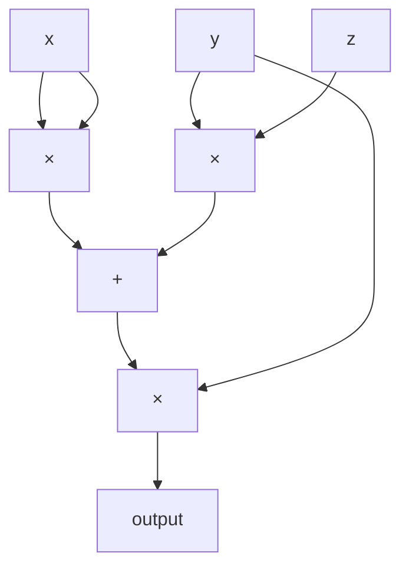
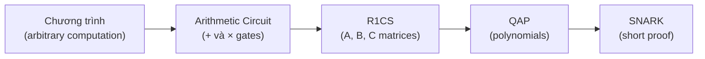

> **Prerequisites**: [[01-interactive-proofs-and-complexity|01. Interactive Proofs & Complexity]] — NP, witness; kiến thức về trường hữu hạn $\mathbb{F}_p$  
> **Objectives**:  
> - Hiểu tại sao tính toán cần được "số học hóa" trước khi đưa vào ZKP
> - Nắm vững arithmetic circuit và circuit satisfiability
> - Định nghĩa R1CS: matrices A, B, C và vector witness
> - Biết cách flatten một chương trình đơn giản thành R1CS

---

## Motivation

Sigma protocols và Fiat-Shamir (Bài 05–08) hiệu quả cho các tuyên bố cụ thể như "tôi biết discrete log". Nhưng trong thực tế, ta muốn chứng minh các tuyên bố phức tạp hơn nhiều:

- "Tôi biết $x$ là nghiệm của phương trình $f(x) = 0$ với $f$ là đa thức bậc cao"
- "Tôi biết preimage của hash $H$"
- "Tôi biết hai số nguyên tố $p, q$ sao cho $N = pq$ mà không tiết lộ $p, q$"
- "Tôi biết ký tự bí mật của một giao dịch blockchain hợp lệ"

Thách thức: làm thế nào để biến một **chương trình tính toán tùy ý** thành dạng mà ZKP có thể xử lý?

Câu trả lời: **arithmetization** — biến tính toán thành một hệ phương trình đại số trên trường hữu hạn. Bài này trình bày bước đầu tiên: arithmetic circuits và R1CS.

---

## Trường Hữu Hạn — Nền Tảng

Mọi tính toán trong SNARKs đều được thực hiện trên một **trường hữu hạn** (finite field) $\mathbb{F}_p$ với $p$ là số nguyên tố lớn.

> [!definition] Definition 9.1 — Trường Hữu Hạn $\mathbb{F}_p$
>
> $\mathbb{F}_p = \mathbb{Z}/p\mathbb{Z} = \{0, 1, 2, \ldots, p-1\}$ với các phép toán modulo $p$:
> - Cộng: $(a + b) \bmod p$
> - Nhân: $(a \cdot b) \bmod p$
> - Nghịch đảo: $a^{-1} \bmod p$ tồn tại khi $a \neq 0$ (vì $p$ nguyên tố)
>
> Trong SNARKs hiện đại, $p$ thường là số nguyên tố ~254 bit, ví dụ:
> - BN254: $p = 21888242871839275222246405745257275088548364400416034343698204186575808495617$
> - BLS12-381: $p \approx 2^{255}$

Mọi phép tính (cộng, trừ, nhân, chia — trừ chia cho 0) đều hợp lệ trong $\mathbb{F}_p$.

---

## Arithmetic Circuit

> [!definition] Definition 9.2 — Arithmetic Circuit
>
> Một **arithmetic circuit** $C$ trên trường $\mathbb{F}_p$ là một đồ thị có hướng không có chu trình (DAG) trong đó:
> - **Input wires**: nhận giá trị từ $\mathbb{F}_p$.
> - **Gates** (cổng): mỗi gate thực hiện hoặc cộng ($+$) hoặc nhân ($\times$) hai giá trị input.
> - **Output wires**: giá trị đầu ra của circuit.
>
> **Size** của circuit: số lượng gates.
> **Depth**: chiều dài đường đi dài nhất từ input đến output.

*Ví dụ arithmetic circuit tính $f(x, y, z) = (x^2 + yz) \cdot y$.*

### Circuit Satisfiability

> [!definition] Definition 9.3 — Circuit Satisfiability
>
> Cho circuit $C$ với $n$ input wires và $m$ output wires.
>
> **Circuit satisfiability**: tồn tại input $(x_1, \ldots, x_n) \in \mathbb{F}_p^n$ sao cho $C(x_1, \ldots, x_n) = \mathbf{0}$ (hay một giá trị cụ thể).
>
> Đây là bài toán NP-complete khi mã hóa trên trường hữu hạn — là dạng tổng quát của SAT và là canonical NP problem cho ZKP.

Trong ZKP, **public input** là phần statement $x$, **private input** (witness) là phần $w$ mà prover muốn giữ bí mật. Circuit encode mối quan hệ giữa chúng.

---

## Rank-1 Constraint System (R1CS)

Arithmetic circuit đủ biểu đạt nhưng bất tiện để làm toán học trên đó. **R1CS** là một cách viết lại hệ phương trình của circuit dưới dạng tuyến tính.

### Ý Tưởng

Mỗi cổng nhân $a \times b = c$ trong circuit tạo ra một **ràng buộc** (constraint). Cổng cộng là ràng buộc tuyến tính, không cần viết riêng. R1CS collect tất cả ràng buộc nhân thành một hệ đại số.

> [!definition] Definition 9.4 — R1CS (Rank-1 Constraint System)
>
> Một **R1CS** được xác định bởi:
> - Số ràng buộc $m$, kích thước witness $n+1$ (bao gồm $1$ hằng số).
> - Ba ma trận $A, B, C \in \mathbb{F}_p^{m \times (n+1)}$.
>
> Một **witness** (hay **assignment**) $\mathbf{w} \in \mathbb{F}_p^{n+1}$ **thỏa mãn** R1CS nếu:
>
> $$(A\mathbf{w}) \circ (B\mathbf{w}) = C\mathbf{w}$$
>
> trong đó $\circ$ là **Hadamard product** (nhân từng phần tử).
>
> Tức là với mỗi constraint $i \in [m]$:
>
> $$\left(\sum_j A_{ij} w_j\right) \cdot \left(\sum_j B_{ij} w_j\right) = \sum_j C_{ij} w_j$$

Mỗi hàng $i$ của $(A, B, C)$ mã hóa một **cổng nhân**: phần trái, phần phải, và kết quả là các tổ hợp tuyến tính của witness.

### Cấu Trúc Witness

> [!note] Remark — Cấu trúc của $\mathbf{w}$
>
> Quy ước chuẩn: $w_0 = 1$ (hằng số), tiếp theo là **public inputs** (statement $x$), sau đó là **private inputs** và **intermediate values** (witness $w$):
>
> $$\mathbf{w} = (1,\ \underbrace{x_1, \ldots, x_\ell}_{\text{public}},\ \underbrace{w_1, \ldots, w_k}_{\text{private}})$$
>
> Verifier biết $x_1, \ldots, x_\ell$ nhưng không biết $w_1, \ldots, w_k$.

---

## Ví dụ: Flatten một Computation thành R1CS

### Bài Toán

Chứng minh biết $x$ sao cho $x^3 + x + 5 = 35$ (tức là $x = 3$) mà không tiết lộ $x$.

### Bước 1: Phân Tách thành Gates

Flatten thành các phép nhân (intermediate variables $v_1, v_2$):

$$v_1 = x \cdot x \quad (= x^2)$$

$$v_2 = v_1 \cdot x \quad (= x^3)$$

$$\text{output}: v_2 + x + 5 = 35 \quad \Leftrightarrow \quad v_2 + x - 30 = 0$$

### Bước 2: Định nghĩa Witness

$$\mathbf{w} = (1,\ \underbrace{35}_{\text{public out}},\ \underbrace{x, v_1, v_2}_{\text{private}}) = (1,\ 35,\ 3,\ 9,\ 27)$$

Indices: $w_0 = 1$, $w_1 = 35$ (output), $w_2 = x$, $w_3 = v_1$, $w_4 = v_2$.

### Bước 3: Viết Ma Trận R1CS

**Constraint 1**: $v_1 = x \cdot x$, tức là $(x) \cdot (x) = v_1$

$$\text{Row A: } [0, 0, 1, 0, 0] \quad (= x)$$
$$\text{Row B: } [0, 0, 1, 0, 0] \quad (= x)$$
$$\text{Row C: } [0, 0, 0, 1, 0] \quad (= v_1)$$

Kiểm tra: $(A_1 \mathbf{w}) \cdot (B_1 \mathbf{w}) = x \cdot x = 9 = v_1 = C_1 \mathbf{w}$. ✓

**Constraint 2**: $v_2 = v_1 \cdot x$, tức là $(v_1) \cdot (x) = v_2$

$$\text{Row A: } [0, 0, 0, 1, 0] \quad (= v_1)$$
$$\text{Row B: } [0, 0, 1, 0, 0] \quad (= x)$$
$$\text{Row C: } [0, 0, 0, 0, 1] \quad (= v_2)$$

Kiểm tra: $9 \cdot 3 = 27 = v_2$. ✓

**Constraint 3**: $v_2 + x + 5 = 35$, tức là $(v_2 + x + 5) \cdot (1) = 35$

$$\text{Row A: } [5, 0, 1, 0, 1] \quad (= 5 \cdot 1 + x + v_2)$$
$$\text{Row B: } [1, 0, 0, 0, 0] \quad (= 1)$$
$$\text{Row C: } [0, 1, 0, 0, 0] \quad (= 35)$$

Kiểm tra: $(5 + 3 + 27) \cdot 1 = 35$. ✓

> [!example] Example 9.5 — Ma trận R1CS đầy đủ
>
> $$A = \begin{pmatrix} 0 & 0 & 1 & 0 & 0 \\ 0 & 0 & 0 & 1 & 0 \\ 5 & 0 & 1 & 0 & 1 \end{pmatrix}, \quad B = \begin{pmatrix} 0 & 0 & 1 & 0 & 0 \\ 0 & 0 & 1 & 0 & 0 \\ 1 & 0 & 0 & 0 & 0 \end{pmatrix}, \quad C = \begin{pmatrix} 0 & 0 & 0 & 1 & 0 \\ 0 & 0 & 0 & 0 & 1 \\ 0 & 1 & 0 & 0 & 0 \end{pmatrix}$$
>
> Witness: $\mathbf{w} = (1, 35, 3, 9, 27)^T$
>
> Xác minh: $(A\mathbf{w}) \circ (B\mathbf{w}) = (3, 9, 35)^T \circ (3, 3, 1)^T = (9, 27, 35)^T = C\mathbf{w}$. ✓

---

## R1CS và Tính Biểu Đạt

### Độ Phức Tạp

> [!theorem] Theorem 9.6 — R1CS là NP-Complete
>
> Bài toán "tìm $\mathbf{w}$ thỏa mãn R1CS $(A, B, C)$" là NP-complete.
>
> Reduction: bất kỳ boolean circuit nào (do đó bất kỳ bài toán NP nào) đều có thể encode thành R1CS. Gate AND $(a \wedge b = c)$ encode thành constraint $(a) \cdot (b) = c$ với $a, b, c \in \{0, 1\}$ và thêm ràng buộc $a(1-a) = 0$ để đảm bảo $a$ là bit.

### Overhead: Số Ràng Buộc

Arithmetic circuit với $M$ multiplication gates → R1CS với $M$ constraints (một constraint per multiplication gate). Addition gates không tạo ra constraints (được mã hóa miễn phí vào ma trận).

Một chương trình tính toán phức tạp hơn sẽ có nhiều gates hơn → ma trận lớn hơn → bài toán R1CS lớn hơn. Trong thực tế:
- Hàm SHA-256: ~25,000 constraints
- Chương trình EVM execution: hàng triệu constraints

---

## Từ R1CS đến ZKP

R1CS là dạng trung gian — nó chưa phải là ZKP. Bước tiếp theo:

*Pipeline từ chương trình tùy ý đến SNARK: mỗi bước là một biến đổi toán học.*

- **R1CS → QAP** (Bài 10): biến hệ ràng buộc thành đa thức, dùng Lagrange interpolation.
- **QAP → SNARK** (Bài 13–15): biến đa thức thành proof ngắn qua polynomial commitment.

---

## Summary

- **Arithmetic circuit**: DAG với gates cộng và nhân trên $\mathbb{F}_p$ — mô hình tính toán chuẩn cho ZKP.
- **Circuit satisfiability**: NP-complete, là bài toán cần giải quyết.
- **R1CS**: hệ $m$ ràng buộc $(A\mathbf{w}) \circ (B\mathbf{w}) = C\mathbf{w}$ — mỗi hàng encode một cổng nhân.
- **Witness** $\mathbf{w}$: gồm $1$, public inputs, private inputs, và intermediate values.
- Bất kỳ computation nào cũng có thể flatten thành R1CS: tách thành phép nhân + tổ hợp tuyến tính.
- Bước tiếp theo (Bài 10): biến R1CS thành đa thức để áp dụng Schwartz-Zippel và xây dựng QAP.

---

## References

- Gennaro et al. — *Quadratic Span Programs and Succinct NIZKs without PCPs* (2013) — EUROCRYPT
- Parno et al. — *Pinocchio: Nearly Practical Verifiable Computation* (2013) — IEEE S&P
- Thaler — *Proofs, Arguments, and Zero-Knowledge*, Ch. 5–6 (people.cs.georgetown.edu/jthaler/ProofsArgsAndZK.pdf)
- Vitalik Buterin — *Quadratic Arithmetic Programs from Zero to Hero* (medium.com/@VitalikButerin)
- 0xPARC — *R1CS Explainer* (learn.0xparc.org)
