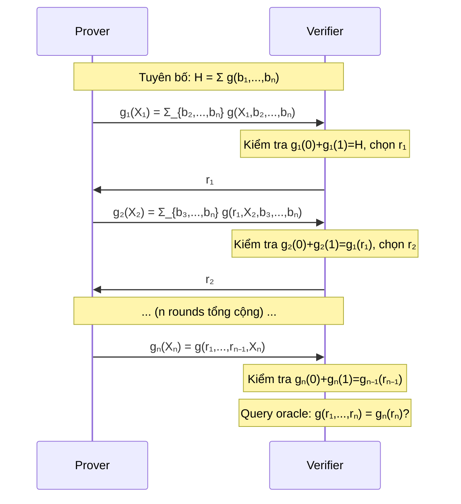
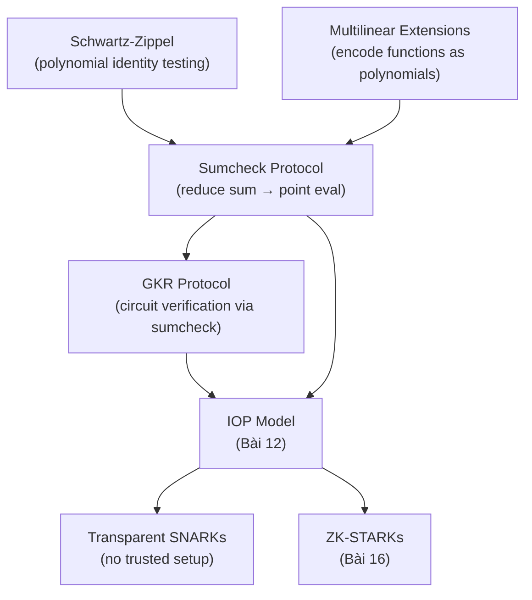

> **Prerequisites**: [[10-qap|10. Quadratic Arithmetic Programs]] — Schwartz-Zippel, polynomial identity; [[01-interactive-proofs-and-complexity|01. Interactive Proofs & Complexity]] — IP = PSPACE, interactive proofs  
> **Objectives**:  
> - Hiểu multilinear polynomial và multilinear extension của một hàm
> - Nắm vững sumcheck protocol: cách reduce tổng trên hypercube thành point evaluation
> - Theo dõi được phân tích completeness và soundness của sumcheck
> - Hiểu GKR protocol: delegating circuit evaluation dùng sumcheck

---

## Motivation

QAP (Bài 10) dùng đa thức univariate (một biến) và phù hợp với pairing-based SNARKs như Groth16. Nhưng có một con đường khác: **multilinear polynomials** và **sumcheck protocol** — nền tảng của các SNARK không cần trusted setup (FRI-based, IPA-based) và của GKR protocol.

Sumcheck protocol là một trong những primitive ZK quan trọng nhất — nó là backbone của: Thaler's GKR, STARKs, nhiều transparent SNARK, và biểu thức "SNARK = IOP + PCS" mà ta sẽ thấy trong Bài 12.

---

## Multilinear Polynomials

> [!definition] Definition 11.1 — Multilinear Polynomial
>
> Đa thức $f : \mathbb{F}_p^n \to \mathbb{F}_p$ là **multilinear** nếu bậc theo mỗi biến riêng lẻ tối đa là 1. Dạng tổng quát:
>
> $$f(X_1, \ldots, X_n) = \sum_{S \subseteq [n]} c_S \prod_{i \in S} X_i$$
>
> Tức là không có $X_i^2$, $X_i^3$, ... trong $f$. Số monomial tối đa là $2^n$ (mỗi tập con của các biến).

> [!example] Example 11.2 — Multilinear vs. Non-multilinear
>
> - $f(X_1, X_2) = 3X_1 X_2 + 2X_1 - X_2 + 5$ — **multilinear** ✓
> - $g(X_1, X_2) = X_1^2 + X_2$ — **không** multilinear (có $X_1^2$) ✗
> - $h(X_1, X_2, X_3) = X_1 X_2 + X_2 X_3 + X_1 X_3$ — multilinear ✓

### Multilinear Extension (MLE)

> [!definition] Definition 11.3 — Multilinear Extension
>
> Cho hàm $f : \{0, 1\}^n \to \mathbb{F}_p$ (định nghĩa trên boolean hypercube). **Multilinear extension (MLE)** của $f$ là đa thức multilinear duy nhất $\tilde{f} : \mathbb{F}_p^n \to \mathbb{F}_p$ thỏa mãn:
>
> $$\tilde{f}(\mathbf{x}) = f(\mathbf{x}) \quad \forall \mathbf{x} \in \{0,1\}^n$$
>
> Công thức tường minh:
>
> $$\tilde{f}(X_1, \ldots, X_n) = \sum_{\mathbf{w} \in \{0,1\}^n} f(\mathbf{w}) \cdot \prod_{i=1}^n \left(X_i w_i + (1-X_i)(1-w_i)\right)$$
>
> trong đó $\chi_\mathbf{w}(X_1, \ldots, X_n) = \prod_i (X_i w_i + (1-X_i)(1-w_i))$ là **Lagrange basis multilinear** — bằng 1 tại $\mathbf{w}$ và 0 tại mọi điểm boolean khác.

> [!theorem] Theorem 11.4 — Tính Duy Nhất của MLE
>
> Với mỗi hàm $f : \{0,1\}^n \to \mathbb{F}_p$, tồn tại duy nhất multilinear extension $\tilde{f}$.
>
> **Proof phác thảo**: Không gian đa thức multilinear có chiều $2^n$ (mỗi monomial $\prod_{i \in S} X_i$). Tập các điểm $\{0,1\}^n$ có $2^n$ điểm. Interpolation multilinear cho duy nhất một đa thức bậc $\leq 1$ theo mỗi biến đi qua $2^n$ điểm đã cho. $\blacksquare$

> [!example] Example 11.5 — Tính MLE
>
> Cho $f : \{0,1\}^2 \to \mathbb{F}_p$ với $f(0,0) = 1$, $f(0,1) = 2$, $f(1,0) = 3$, $f(1,1) = 4$.
>
> $$\tilde{f}(X_1, X_2) = 1 \cdot (1-X_1)(1-X_2) + 2 \cdot (1-X_1)X_2 + 3 \cdot X_1(1-X_2) + 4 \cdot X_1 X_2$$
>
> $$= 1 - X_1 - X_2 + X_1 X_2 + 2X_2 - 2X_1 X_2 + 3X_1 - 3X_1 X_2 + 4X_1 X_2$$
>
> $$= 1 + 2X_1 + X_2$$
>
> Kiểm tra: $\tilde{f}(0,0) = 1$, $\tilde{f}(0,1) = 2$, $\tilde{f}(1,0) = 3$, $\tilde{f}(1,1) = 4$. ✓

---

## Sumcheck Protocol

### Bài Toán

> [!definition] Definition 11.6 — Sumcheck Problem
>
> Cho đa thức $g : \mathbb{F}_p^n \to \mathbb{F}_p$ bậc $\leq d$ theo mỗi biến. Prover muốn thuyết phục verifier rằng:
>
> $$H = \sum_{\mathbf{b} \in \{0,1\}^n} g(b_1, \ldots, b_n)$$
>
> Tổng gồm $2^n$ số hạng — quá lớn để verifier tự tính (PPT).

Ý tưởng: prover "tách" bài toán thành $n$ bài toán nhỏ hơn, mỗi round giảm đi một biến.

### Giao Thức Sumcheck

> [!definition] Definition 11.7 — Sumcheck Protocol
>
> **Round 1**: Prover gửi univariate polynomial $g_1(X_1) = \sum_{b_2, \ldots, b_n \in \{0,1\}} g(X_1, b_2, \ldots, b_n)$.
>
> Verifier kiểm tra $g_1(0) + g_1(1) = H$. Chọn ngẫu nhiên $r_1 \leftarrow \mathbb{F}_p$. Gửi $r_1$.
>
> **Round $i$** ($i = 2, \ldots, n$): Prover gửi $g_i(X_i) = \sum_{b_{i+1}, \ldots, b_n \in \{0,1\}} g(r_1, \ldots, r_{i-1}, X_i, b_{i+1}, \ldots, b_n)$.
>
> Verifier kiểm tra $g_i(0) + g_i(1) = g_{i-1}(r_{i-1})$. Chọn $r_i \leftarrow \mathbb{F}_p$. Gửi $r_i$.
>
> **Round $n$ (cuối)**: Prover gửi $g_n(X_n) = g(r_1, \ldots, r_{n-1}, X_n)$.
>
> Verifier kiểm tra $g_n(0) + g_n(1) = g_{n-1}(r_{n-1})$ và tự evaluate $g(r_1, \ldots, r_n)$, kiểm tra $g_n(r_n) = g(r_1, \ldots, r_n)$.

*Sumcheck protocol: $n$ rounds, mỗi round giảm một biến, cuối cùng reduce về một point evaluation.*

### Phân Tích Bảo Mật

> [!theorem] Theorem 11.8 — Completeness của Sumcheck
>
> Nếu prover trung thực gửi đúng $g_i$, verifier chấp nhận với xác suất 1.
>
> **Proof**: $g_i(0) + g_i(1) = \sum_{b_{i+1},\ldots,b_n} g(r_1,\ldots,r_{i-1},0,b_{i+1},\ldots,b_n) + \sum g(r_1,\ldots,r_{i-1},1,b_{i+1},\ldots,b_n) = \sum_{b_i,\ldots,b_n} g(r_1,\ldots,r_{i-1},b_i,b_{i+1},\ldots,b_n) = g_{i-1}(r_{i-1})$. ✓

> [!theorem] Theorem 11.9 — Soundness của Sumcheck
>
> Nếu $H' \neq H$ (prover gian lận), verifier từ chối với xác suất ít nhất $1 - nd/p$.
>
> **Proof phác thảo** (Union Bound):
>
> Tại round $i$, prover gian lận gửi $g_i'$ với $g_i' \neq g_i$ (để lừa verifier tại một round). Theo Schwartz-Zippel, xác suất $g_i'(r_i) = g_i(r_i)$ là $\leq d/p$ (vì $g_i' - g_i$ không phải đa thức không, bậc $\leq d$).
>
> Có $n$ rounds, mỗi round soundness error $\leq d/p$. Union bound:
>
> $$\Pr[\text{prover gian lận không bị phát hiện}] \leq n \cdot \frac{d}{p}$$
>
> Với $d \leq 3$, $n = \log N$, $p \approx 2^{254}$: soundness error $\approx 3\log N / 2^{254}$ — negligible. $\blacksquare$

### Độ Phức Tạp

| | Complexity |
|--|-----------|
| **Prover** | $O(2^n)$ (tính tổng qua hypercube) |
| **Verifier** | $O(n)$ field operations + 1 oracle query |
| **Communication** | $O(nd)$ field elements (mỗi round gửi đa thức bậc $d$) |

Verifier **exponentially faster** hơn naive computation ($O(2^n)$) — đây là sức mạnh của sumcheck.

---

## GKR Protocol

### Delegating Circuit Evaluation

Sumcheck protocol trở nên mạnh mẽ hơn nhiều khi kết hợp với **GKR protocol** (Goldwasser-Kalai-Rothblum, 2008): cho phép prover thuyết phục verifier về output của một layered arithmetic circuit, với verifier chỉ cần thời gian gần như tuyến tính.

> [!definition] Definition 11.10 — Layered Arithmetic Circuit
>
> **Layered circuit** là arithmetic circuit trong đó các gate được sắp xếp thành các lớp $0, 1, \ldots, d$:
> - Lớp $0$: inputs
> - Lớp $d$: outputs
> - Mỗi gate ở lớp $i+1$ chỉ nhận input từ lớp $i$

Đây là dạng phổ biến cho các computation: CNN layers, hash rounds, EVM opcodes, ...

### Ý Tưởng GKR

Tại mỗi lớp $i$, ta có hàm **wiring** mô tả kết nối: gate $z$ ở lớp $i+1$ nhận từ gates $x, y$ ở lớp $i$ và tính $V_{i+1}(z) = V_i(x) + V_i(y)$ hoặc $V_{i+1}(z) = V_i(x) \cdot V_i(y)$.

GKR reduce việc verify output lớp $d$ thành verify một claim về lớp $d-1$, rồi lớp $d-2$, ... đến lớp 0 (inputs — public). Mỗi reduction dùng sumcheck.

> [!theorem] Theorem 11.11 — GKR Protocol Complexity
>
> Với layered circuit depth $d$, size $S$:
>
> - **Prover time**: $O(S \log S)$
> - **Verifier time**: $O(d \cdot n + \text{input size})$ — gần như tuyến tính trong input
> - **Proof size**: $O(d \cdot n)$
>
> So sánh: naive verification cần $O(S)$. GKR cho phép verifier sub-linear trong $S$.

---

## Vai trò trong Kiến trúc SNARK Hiện Đại

Sumcheck và multilinear extensions là nền tảng của:

*Sumcheck là backbone của mọi transparent SNARK và ZK-STARK hiện đại.*

Quan trọng: **đường QAP** (Bài 10) và **đường Sumcheck** (Bài 11) là hai con đường khác nhau để xây dựng SNARK:

| | QAP path | Sumcheck path |
|--|---------|--------------|
| **Arithmetization** | Univariate QAP | Multilinear |
| **Trusted setup** | Cần (pairing-based) | Không cần (transparent) |
| **Ví dụ** | Groth16, PLONK | GKR, STARKs, Hyperplonk |
| **Proof size** | Nhỏ (O(1) group elements) | Lớn hơn (O(log n)) |

---

## Summary

- **Multilinear polynomial**: bậc $\leq 1$ theo mỗi biến — không gian $2^n$ chiều, phù hợp với boolean hypercube $\{0,1\}^n$.
- **Multilinear Extension (MLE)**: đa thức multilinear duy nhất extend hàm $f : \{0,1\}^n \to \mathbb{F}_p$ — công thức Lagrange multilinear.
- **Sumcheck protocol**: $n$ rounds, mỗi round giảm một biến, reduce tổng $\sum_{\mathbf{b} \in \{0,1\}^n} g(\mathbf{b})$ thành kiểm tra $g(r_1, \ldots, r_n)$ tại một điểm ngẫu nhiên.
- **Soundness**: $nd/p$ — negligible với $p$ lớn.
- **Verifier complexity**: $O(n)$ — exponentially faster hơn naive $O(2^n)$.
- **GKR protocol**: áp dụng sumcheck $d$ lần để verify layered circuit với verifier gần như tuyến tính.
- Sumcheck là backbone của transparent SNARKs và STARKs — con đường không cần trusted setup.

---

## References

- Goldwasser, Kalai, Rothblum — *Delegating Computation: Interactive Proofs for Muggles* (2008) — STOC (GKR protocol)
- Lund et al. — *Algebraic Methods for Interactive Proof Systems* (1992) — JACM (sumcheck origin)
- Thaler — *Proofs, Arguments, and Zero-Knowledge*, Ch. 4 (Sumcheck), Ch. 7 (GKR) (people.cs.georgetown.edu/jthaler/ProofsArgsAndZK.pdf)
- Thaler — *A Note on the GKR Protocol* (2013)
- Wahby et al. — *Doubly-Efficient zkSNARKs Without Trusted Setup* (2018) — IEEE S&P
