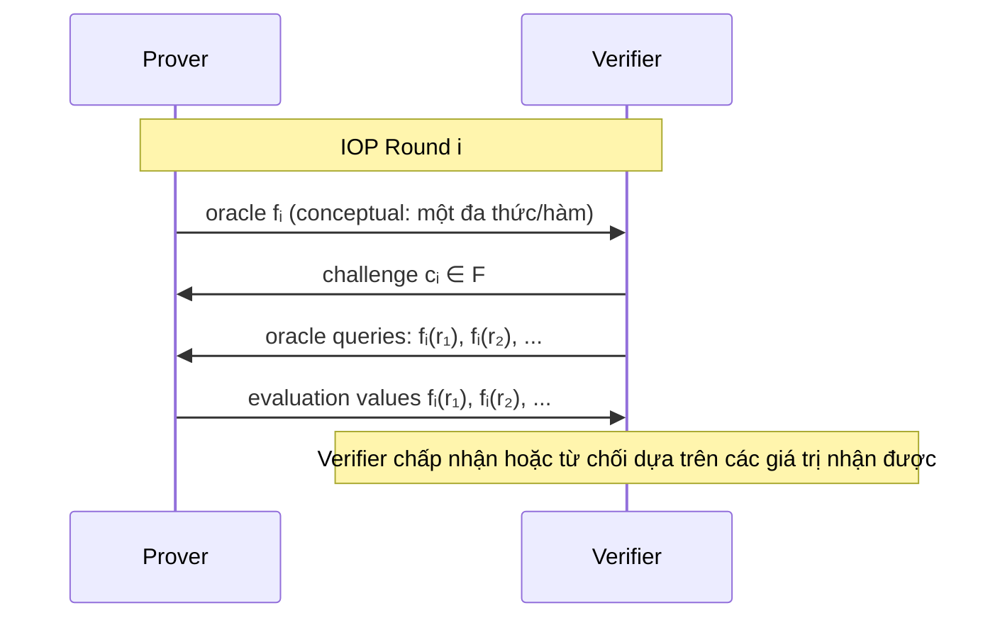
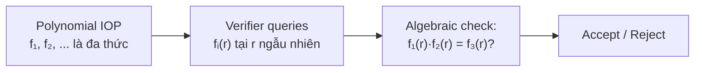
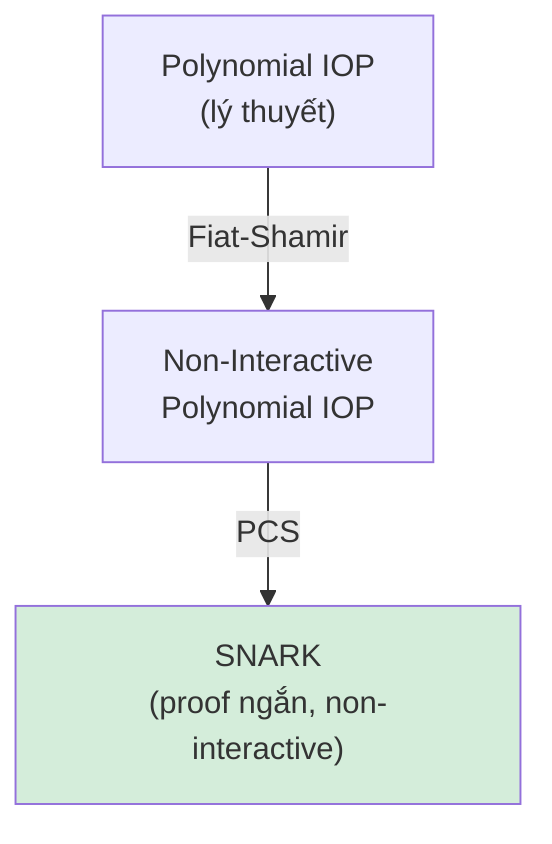
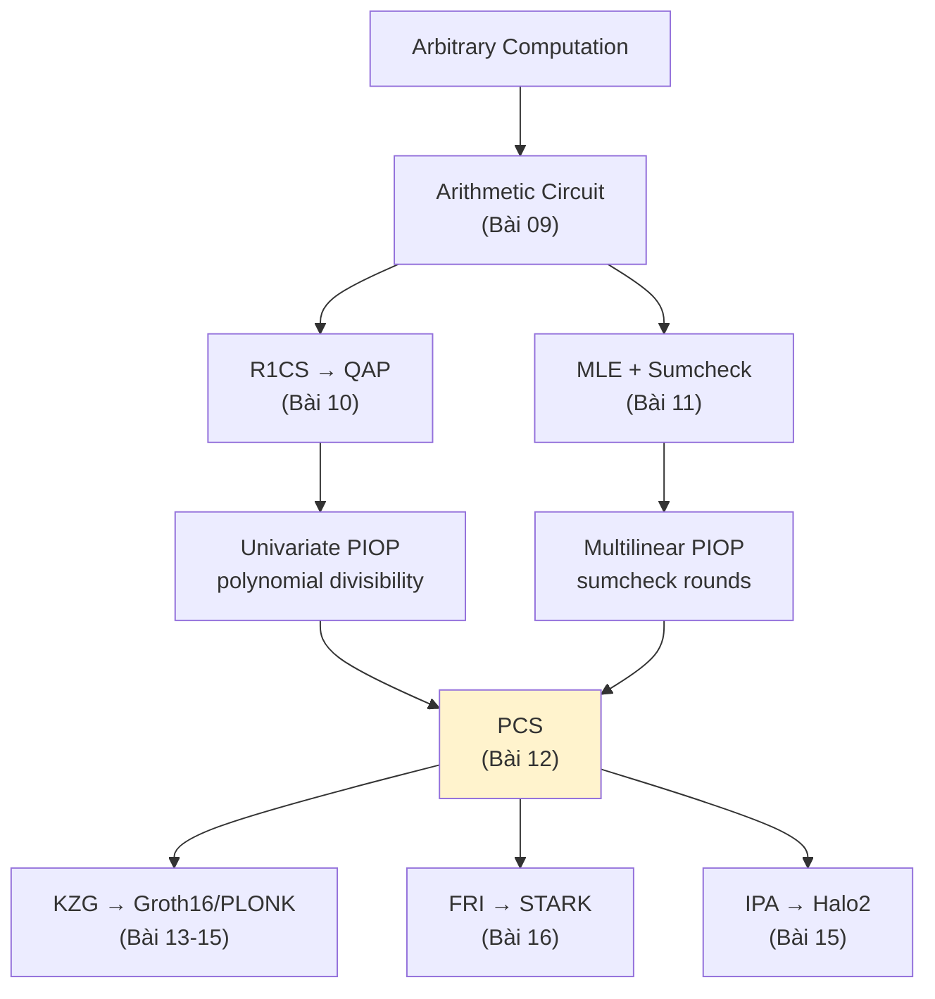

> **Prerequisites**: [[07-commitment-schemes|07. Commitment Schemes]] — hiding/binding; [[11-multilinear-extensions-and-sumcheck|11. Multilinear Extensions & Sumcheck]] — đa thức multilinear, sumcheck protocol  
> **Objectives**:  
> - Hiểu mô hình Interactive Oracle Proof (IOP) và vai trò của oracle access
> - Nắm được cách compile IOP thành SNARK qua polynomial commitment scheme
> - Định nghĩa formal của polynomial commitment scheme (PCS): commit, open, verify
> - Hiểu tính chất binding và hiding cho PCS
> - Phân biệt các loại PCS: pairing-based, hash-based, inner-product-based

---

## Motivation

Ở các bài trước, ta đã xây dựng hai đường dẫn khác nhau để chuyển tính toán thành phát biểu có thể chứng minh:

1. **Đường QAP** (Bài 09–10): Program → R1CS → QAP → polynomial divisibility check
2. **Đường Sumcheck** (Bài 11): Circuit → Multilinear extensions → Sumcheck + GKR

Cả hai đường đều đưa bài toán về câu hỏi: *"Prover có thực sự biết một đa thức thỏa mãn điều kiện nào đó không?"*

Nhưng verifier không thể đọc toàn bộ đa thức — nó có thể có bậc cao hay nhiều biến. Vậy làm sao prover thuyết phục verifier mà không gửi toàn bộ đa thức?

Câu trả lời được chia thành hai lớp:
- **Mô hình IOP**: framework lý thuyết mô tả prover gửi "oracle" (đa thức ảo) mà verifier query vào điểm bất kỳ
- **Polynomial Commitment Scheme (PCS)**: công cụ cryptographic cụ thể thay thế oracle bằng commitment ngắn gọn

---

## Mô hình Interactive Oracle Proof

### Từ Interactive Proof đến IOP

Trong Interactive Proof (IP) chuẩn (Bài 01), prover gửi toàn bộ tin nhắn cho verifier. Điều này không hiệu quả khi prover muốn "gửi" một đa thức bậc $d$ — nó có $d+1$ hệ số.

> [!definition] Definition 12.1 — Interactive Oracle Proof (IOP)
>
> Một **IOP** (Interactive Oracle Proof) là một interactive proof trong đó:
> - Prover có thể gửi các **oracle** $f_1, f_2, \ldots$ — về mặt lý thuyết, mỗi oracle là một hàm có thể query tại bất kỳ điểm nào.
> - Verifier được phép thực hiện **oracle queries** $f_i(r)$ cho các điểm $r$ tùy chọn, nhưng **không** đọc toàn bộ hàm $f_i$.
> - Verifier chi phí: số lượng queries (không phải tổng chiều dài của oracle).
>
> Formally: transcript $(f_1, c_1, f_2, c_2, \ldots, f_k, c_k)$ trong đó $c_i$ là challenge của verifier, $f_i$ là oracle của prover.

Mô hình IOP tách biệt hai vấn đề:
1. **Logic của proof**: Verifier cần query oracle ở đâu để kiểm tra tính đúng đắn? (thuần túy lý thuyết)
2. **Cách thực hiện oracle**: Dùng cơ chế cryptographic nào để "thực sự" thực hiện oracle access?

*Một round trong mô hình IOP: prover gửi oracle (đa thức), verifier query vào điểm ngẫu nhiên.*

### Hiệu quả trong IOP

> [!definition] Definition 12.2 — IOP Efficiency Metrics
>
> Một IOP được đặc trưng bởi:
> - **Proof length** $\ell$: tổng kích thước các oracle (đo bằng số bits nếu oracle là hàm hữu hạn)
> - **Query complexity** $q$: số lượng oracle queries của verifier
> - **Verification time**: thời gian verifier chạy (không bao gồm thời gian đọc toàn bộ oracle)
> - **Round complexity**: số vòng trao đổi
>
> Mục tiêu: verifier có thể kiểm tra với **polylogarithmic** queries trong khi prover tính $f_i$ từ witness.

So sánh với IP chuẩn:

| Mô hình | Prover gửi | Verifier đọc | Overhead |
|---------|-----------|-------------|---------|
| IP chuẩn | toàn bộ tin nhắn | tất cả | tuyến tính theo proof |
| IOP | oracle (hàm) | query tại $q$ điểm | polylogarithmic |

### Tính chất bảo mật của IOP

> [!definition] Definition 12.3 — IOP Soundness
>
> Một IOP $(P, V)$ có **soundness error** $\varepsilon$ nếu: với mọi $x \notin \mathcal{L}$ và mọi (cheating) prover $P^*$:
>
> $$\Pr[\langle P^*, V \rangle(x) = 1] \leq \varepsilon$$
>
> trong đó xác suất tính trên random coins của verifier (bao gồm cả query points).

> [!definition] Definition 12.4 — IOP Zero-Knowledge
>
> Một IOP là **zero-knowledge** nếu tồn tại simulator $S$ sao cho với mọ $x \in \mathcal{L}$:
>
> $$\{(\text{queries}, \text{answers}) : \text{từ tương tác với } P\} \approx \{(\text{queries}, \text{answers}) : S(x)\}$$
>
> Lưu ý: simulator chỉ cần tái tạo các **giá trị tại query points**, không phải toàn bộ oracle.

---

## Polynomial IOP

Trong thực tế, các IOP hiện đại hầu hết là **Polynomial IOP** (PIOP): oracle là các đa thức, verifier query tại điểm ngẫu nhiên.

> [!definition] Definition 12.5 — Polynomial IOP (PIOP)
>
> Một **Polynomial IOP** là IOP trong đó:
> - Prover gửi oracle là các **đa thức** $f_i \in \mathbb{F}_p[X_1, \ldots, X_k]$ với degree bound $d$.
> - Verifier query: "cho tôi $f_i(r)$" với $r \in \mathbb{F}_p^k$ ngẫu nhiên.
> - Verifier check: các algebraic relations giữa evaluation values nhận được.

Lý do dùng đa thức:
- **Schwartz-Zippel**: nếu $f \neq g$ là đa thức bậc $d$, thì $\Pr_r[f(r) = g(r)] \leq d/p$ — query một điểm ngẫu nhiên là kiểm tra hiệu quả
- **Low-degree testing**: có thể kiểm tra một hàm có "gần là đa thức bậc $d$" hay không (dùng trong FRI/STARK)

*PIOP: tất cả kiểm tra là algebraic relation giữa evaluation values.*

---

## Biên dịch IOP thành SNARK

Mô hình IOP/PIOP thuần túy lý thuyết — verifier cần oracle thực sự. Để tạo SNARK (Non-Interactive với proof ngắn), ta cần "thực tế hóa" oracle bằng cryptography.

### Bước 1: Fiat-Shamir Transform (Non-Interactive)

Áp dụng Fiat-Shamir (Bài 08) để biến interactive IOP thành non-interactive: thay các challenge $c_i$ bằng $H(\text{transcript cho đến thời điểm đó})$.

### Bước 2: Polynomial Commitment Scheme

Thay oracle $f$ bằng:
1. Prover tính **commitment** $\mathsf{cm} = \mathsf{Commit}(f)$ — một chuỗi bits ngắn
2. Khi verifier query $f(r)$, prover trả lời $v = f(r)$ kèm **evaluation proof** $\pi$
3. Verifier kiểm tra: $\mathsf{Verify}(\mathsf{cm}, r, v, \pi) = 1$

*Hai bước compile: Fiat-Shamir khử tương tác, PCS thay oracle bằng commitment ngắn gọn.*

> [!theorem] Theorem 12.6 — IOP + PCS = SNARK
>
> Nếu $(P_{\mathsf{IOP}}, V_{\mathsf{IOP}})$ là một Polynomial IOP với soundness error $\varepsilon_{\mathsf{IOP}}$ và PCS có binding error $\varepsilon_{\mathsf{PCS}}$, thì SNARK được compile từ chúng có soundness error khoảng:
>
> $$\varepsilon_{\mathsf{SNARK}} \approx \varepsilon_{\mathsf{IOP}} + q \cdot \varepsilon_{\mathsf{PCS}}$$
>
> trong đó $q$ là số lượng queries của IOP verifier.
>
> Proof sketch: cheating prover phải vừa vi phạm IOP soundness vừa "cheat" trong PCS. Union bound trên $q$ queries.

---

## Polynomial Commitment Scheme

### Định nghĩa Formal

> [!definition] Definition 12.7 — Polynomial Commitment Scheme (PCS)
>
> Một **Polynomial Commitment Scheme** cho đa thức bậc $\leq d$ gồm bốn thuật toán:
>
> - $\mathsf{Setup}(1^\lambda, d) \to \mathsf{pp}$: sinh public parameters (có thể có trusted setup).
>
> - $\mathsf{Commit}(\mathsf{pp}, f) \to \mathsf{cm}$: nhận đa thức $f \in \mathbb{F}_p[X]$, trả về commitment $\mathsf{cm}$ (ngắn).
>
> - $\mathsf{Open}(\mathsf{pp}, f, r) \to (v, \pi)$: nhận đa thức $f$ và điểm $r$, trả về evaluation $v = f(r)$ và proof $\pi$.
>
> - $\mathsf{Verify}(\mathsf{pp}, \mathsf{cm}, r, v, \pi) \to \{0,1\}$: kiểm tra rằng $\mathsf{cm}$ commit đến đa thức $f$ thỏa $f(r) = v$.

### Correctness

> [!definition] Definition 12.8 — PCS Correctness
>
> PCS **correct** nếu với mọ đa thức hợp lệ $f$, mọ điểm $r$:
>
> $$\Pr\left[\mathsf{Verify}(\mathsf{pp}, \mathsf{cm}, r, v, \pi) = 1 \;\middle|\; \begin{array}{l} \mathsf{pp} \leftarrow \mathsf{Setup}(1^\lambda, d) \\ \mathsf{cm} \leftarrow \mathsf{Commit}(\mathsf{pp}, f) \\ (v, \pi) \leftarrow \mathsf{Open}(\mathsf{pp}, f, r) \end{array} \right] = 1$$

### Binding

Tính chất **binding** đảm bảo prover không thể "mở" commitment theo hai cách khác nhau.

> [!definition] Definition 12.9 — Evaluation Binding
>
> PCS thỏa **evaluation binding** nếu với mọi PPT adversary $\mathcal{A}$:
>
> $$\Pr\left[\begin{array}{l} \mathsf{Verify}(\mathsf{pp}, \mathsf{cm}, r, v, \pi) = 1 \\ \mathsf{Verify}(\mathsf{pp}, \mathsf{cm}, r, v', \pi') = 1 \\ v \neq v' \end{array} \;\middle|\; \begin{array}{l} \mathsf{pp} \leftarrow \mathsf{Setup}(1^\lambda) \\ (\mathsf{cm}, r, v, \pi, v', \pi') \leftarrow \mathcal{A}(\mathsf{pp}) \end{array} \right] \leq \mathsf{negl}(\lambda)$$
>
> Tức là: với cùng một commitment $\mathsf{cm}$ và điểm $r$, không thể tồn tại hai bằng chứng $\pi, \pi'$ cho hai giá trị khác nhau $v \neq v'$.

Có tính chất mạnh hơn — **polynomial binding**:

> [!definition] Definition 12.10 — Polynomial Binding
>
> PCS thỏa **polynomial binding** nếu với mọi PPT adversary:
>
> $$\Pr\left[\begin{array}{l} \mathsf{cm} = \mathsf{Commit}(\mathsf{pp}, f) = \mathsf{Commit}(\mathsf{pp}, f') \\ f \neq f' \end{array}\right] \leq \mathsf{negl}(\lambda)$$
>
> Polynomial binding ⟹ evaluation binding (vì $f \neq f'$ ⟹ $\exists r: f(r) \neq f'(r)$).

### Hiding

> [!definition] Definition 12.11 — PCS Hiding
>
> PCS thỏa **hiding** nếu commitment $\mathsf{cm}$ không tiết lộ thông tin về đa thức $f$: với mọi PPT adversary, $\mathsf{cm}$ computationally indistinguishable giữa commit đến $f_0$ vs. $f_1$ (chọn trước khi thấy $\mathsf{pp}$).

> [!note] Remark — Hiding là optional trong nhiều ứng dụng
>
> Nhiều PCS (như KZG cơ bản) **không hiding**: commitment $\mathsf{cm}$ có thể tiết lộ thông tin về $f$. Điều này không ảnh hưởng đến soundness, nhưng ảnh hưởng đến ZK.
>
> Để đạt ZK, cần thêm "blinding" (thêm randomness vào commit) hoặc dùng PCS có hiding từ đầu.

### Tính Chất Quan Trọng Khác

> [!definition] Definition 12.12 — Succinctness
>
> PCS **succinct** nếu:
> - $|\mathsf{cm}| = O(\lambda)$ bits — commitment có độ dài cố định (constant-size)
> - $|\pi| = O(\text{poly}(\lambda) \cdot \text{polylog}(d))$ — proof ngắn hơn nhiều so với đa thức
> - $\mathsf{Verify}$ chạy trong $O(\text{polylog}(d))$ thời gian

Succinctness là lý do tại sao PCS cho phép tạo SNARK với proof ngắn:
- Không có PCS succinct → cần gửi toàn bộ đa thức → proof lớn
- Với PCS succinct → commitment $O(\lambda)$, proof per query $O(\text{polylog}(d))$

---

## Phân Loại Polynomial Commitment Schemes

Có ba họ PCS chính, khác nhau về giả định bảo mật và đặc điểm:

### 1. Pairing-Based PCS (KZG)

| Đặc điểm | Giá trị |
|----------|---------|
| Giả định | q-SDH assumption (bilinear pairings) |
| Trusted setup | Cần (circuit-specific hoặc universal) |
| Commitment size | $O(1)$ — một group element |
| Proof size | $O(1)$ — một group element |
| Verify time | $O(1)$ pairing operations |
| ZK | Cần thêm blinding |

**Ưu điểm**: proof cực ngắn, verify cực nhanh.
**Nhược điểm**: trusted setup, giả định số học mạnh, không quantum-safe.

KZG (Kate-Zaverucha-Goldberg 2010) là PCS phổ biến nhất, dùng trong Groth16, PLONK, Marlin. Sẽ trình bày chi tiết ở Bài 13.

### 2. Hash-Based PCS (FRI / Merkle-based)

| Đặc điểm | Giá trị |
|----------|---------|
| Giả định | Collision-resistant hash (computational) |
| Trusted setup | Không cần (transparent) |
| Commitment size | $O(\log d)$ — Merkle root |
| Proof size | $O(\log^2 d)$ |
| Verify time | $O(\log^2 d)$ |
| ZK | Có thể đạt |

**Ưu điểm**: không trusted setup, post-quantum safe, nền tảng giả định tối thiểu.
**Nhược điểm**: proof lớn hơn đáng kể so với KZG.

FRI (Fast Reed-Solomon IOP of Proximity) là PCS dùng trong ZK-STARKs. Sẽ trình bày ở Bài 16.

### 3. Inner-Product-Based PCS (IPA / Bulletproofs)

| Đặc điểm | Giá trị |
|----------|---------|
| Giả định | Discrete Logarithm (DL assumption) |
| Trusted setup | Không cần (universal SRS — "trapdoor-free") |
| Commitment size | $O(1)$ — Pedersen-style |
| Proof size | $O(\log d)$ |
| Verify time | $O(d)$ (không succinct!) |
| ZK | Tự nhiên (Pedersen-based) |

**Ưu điểm**: không trusted setup, proof size $O(\log d)$.
**Nhược điểm**: verify time tuyến tính — không succinct verify. Dùng trong Halo2/Plonky2.

### Bảng So sánh Tổng quan

| PCS | Trusted Setup | Proof Size | Verify | Quantum-Safe |
|-----|--------------|-----------|--------|-------------|
| KZG | Circuit-specific | $O(1)$ | $O(1)$ | ✗ |
| FRI | Transparent | $O(\log^2 d)$ | $O(\log^2 d)$ | ✓ |
| IPA/Bulletproofs | Universal | $O(\log d)$ | $O(d)$ | ✗ |

---

## Multivariate PCS

Các PCS trên thường xét đa thức univariate $f(X)$. Với sumcheck (Bài 11), cần PCS cho đa thức multivariate $f(X_1, \ldots, X_n)$.

> [!definition] Definition 12.13 — Multivariate PCS
>
> Định nghĩa tương tự PCS univariate nhưng:
> - Đa thức $f \in \mathbb{F}_p[X_1, \ldots, X_n]$ với total degree $\leq d$ (hoặc multilinear: degree $\leq 1$ per variable)
> - Open tại điểm $\mathbf{r} = (r_1, \ldots, r_n) \in \mathbb{F}_p^n$
> - $v = f(r_1, \ldots, r_n)$

Trong thực tế:
- **KZG multivariate** (Papamanthou et al.): sử dụng SRS lớn hơn, proof $O(n)$ group elements
- **Dory** (Lee 2021): IPA-style cho multilinear, verify $O(\log^2 n)$
- **Hyrax** (Wahby et al.): Pedersen-based multilinear, verify $O(\sqrt{n})$
- **Binius**: mới nhất (2023), dùng binary fields, hiệu quả cho multilinear

---

## Kết Nối với Các Bài Trước

Nhìn lại toàn bộ pipeline từ Phần II:

*PCS là cầu nối giữa PIOP (lý thuyết) và SNARK (thực tế). Tùy loại PCS sẽ dẫn đến hệ thống ZKP khác nhau.*

Ý nghĩa của từng bài trong pipeline:

| Bài | Vai trò |
|-----|---------|
| 09 (R1CS) | Mã hóa computation thành constraint system |
| 10 (QAP) | Mã hóa constraints thành đa thức (univariate) |
| 11 (Sumcheck) | Protocol hiệu quả query đa thức (multilinear) |
| **12 (IOP + PCS)** | **Framework và công cụ để "thực hiện" oracle queries** |
| 13–16 | Các hệ thống cụ thể với PCS cụ thể |

---

## Summary

- **IOP**: mô hình lý thuyết trong đó prover gửi oracle (hàm), verifier query tại điểm ngẫu nhiên — hiệu quả vì verifier chỉ đọc $q \ll |\text{oracle}|$ evaluations.
- **Polynomial IOP (PIOP)**: oracle là đa thức; tất cả kiểm tra là algebraic relations giữa evaluations.
- **Compile IOP → SNARK**: Fiat-Shamir (khử tương tác) + PCS (thay oracle bằng commitment ngắn).
- **PCS**: bộ bốn thuật toán $(\mathsf{Setup}, \mathsf{Commit}, \mathsf{Open}, \mathsf{Verify})$; tính chất: evaluation binding (soundness), hiding (ZK), succinctness.
- **Ba họ PCS**: pairing-based (KZG, proof $O(1)$, trusted setup), hash-based (FRI, transparent, proof $O(\log^2 d)$), inner-product-based (IPA, no setup, verify $O(d)$).
- Mỗi SNARK hiện đại = một PIOP + một PCS + Fiat-Shamir.

---

## References

- Eli Ben-Sasson et al. — *Interactive Oracle Proofs* (2016) — TCC (định nghĩa gốc IOP)
- Kate, Zaverucha, Goldberg — *Constant-Size Commitments to Polynomials and Their Applications* (2010) — ASIACRYPT (KZG gốc)
- Bunz et al. — *Transparent SNARKs from DARK Compilers* (2020) — EUROCRYPT (IPA → PCS)
- Thaler — *Proofs, Arguments, and Zero-Knowledge*, Ch. 4, 10 (people.cs.georgetown.edu/jthaler/ProofsArgsAndZK.pdf)
- ZKProof Community Reference — *Commit-and-Prove Zero-Knowledge Proof Systems* (zkproof.org)
- Berkeley ZK MOOC — Lecture 7: Polynomial Commitments (youtube.com/watch?v=bz16x0MoFiE)
