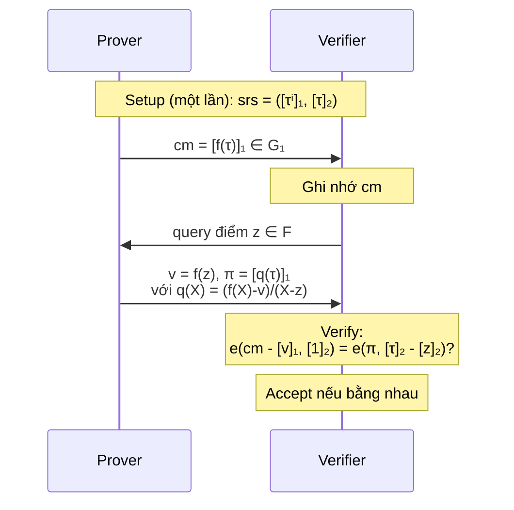
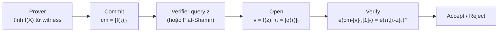

> **Prerequisites**: [[07-commitment-schemes|07. Commitment Schemes]] — hiding/binding, Pedersen; [[12-iop-and-polynomial-commitments|12. IOP & Polynomial Commitments]] — định nghĩa PCS formal; kiến thức nhóm cyclic, discrete log  
> **Objectives**:  
> - Hiểu bilinear pairing là gì và tại sao nó mạnh hơn DLP thông thường
> - Nắm được KZG commitment scheme: cách commit, open, verify đa thức
> - Hiểu tại sao KZG có constant-size proof và ý nghĩa của nó
> - Biết trusted setup (SRS) là gì và tại sao cần thiết cho KZG
> - Hiểu security assumption $q$-SDH và tại sao KZG binding dựa vào đó

---

## Motivation

Ở Bài 12, ta đã thấy PCS là mảnh ghép cuối cùng để compile PIOP thành SNARK. Nhưng PCS trừu tượng đó được xây dựng như thế nào cụ thể?

KZG (Kate-Zaverucha-Goldberg, 2010) là câu trả lời đầu tiên — và vẫn là PCS phổ biến nhất — với đặc điểm nổi bật:

- **Commitment**: 1 group element ($\approx$ 48 bytes với BLS12-381)
- **Evaluation proof**: 1 group element
- **Verify**: 2 pairing operations — $O(1)$

Để hiểu tại sao KZG hoạt động, cần hiểu công cụ toán học nền tảng: **bilinear pairing**.

---

## Bilinear Pairings

### Nhóm Elliptic Curve

Nhắc lại: nhóm $\mathbb{G}$ cyclic bậc $p$ (số nguyên tố lớn), generator $g$. Discrete Log: biết $g, g^x$, khó tính $x$.

Trong pairing-based crypto, ta làm việc với **elliptic curve groups** $\mathbb{G}_1, \mathbb{G}_2, \mathbb{G}_T$ — nhưng ký hiệu additive: $g, h \in \mathbb{G}_1$, $[a]_1 = a \cdot g$ (scalar multiplication).

> [!definition] Definition 13.1 — Bilinear Pairing
>
> Cho ba nhóm cyclic $\mathbb{G}_1, \mathbb{G}_2, \mathbb{G}_T$ bậc $p$ (số nguyên tố). Một **bilinear pairing** là ánh xạ:
>
> $$e: \mathbb{G}_1 \times \mathbb{G}_2 \to \mathbb{G}_T$$
>
> thỏa mãn:
>
> 1. **Bilinearity**: $e([a]_1, [b]_2) = e([1]_1, [1]_2)^{ab}$ với mọi $a, b \in \mathbb{F}_p$.
>
>    Tương đương: $e(a \cdot P, b \cdot Q) = e(P, Q)^{ab}$.
>
> 2. **Non-degeneracy**: $e([1]_1, [1]_2) \neq 1_{\mathbb{G}_T}$ (generator không map về identity).
>
> 3. **Efficient computation**: tính $e(P, Q)$ trong thời gian polynomial.

Ký hiệu: $[a]_1 = a \cdot g_1 \in \mathbb{G}_1$, $[b]_2 = b \cdot g_2 \in \mathbb{G}_2$.

Bilinearity cho phép:
$$e([a]_1, [b]_2) = e([ab]_1, [1]_2) = e([1]_1, [ab]_2) = e([1]_1, [1]_2)^{ab}$$

### Tại Sao Pairing Mạnh Hơn DLP?

Với nhóm thông thường $\mathbb{G}$: biết $g^a, g^b$, **không thể** tính $g^{ab}$ (CDH assumption).

Với pairing: biết $[a]_1, [b]_2$ ta tính được $e([a]_1, [b]_2) = e(g_1, g_2)^{ab}$ — nhưng $e(g_1,g_2)^{ab} \in \mathbb{G}_T$, không phải $g_1^{ab} \in \mathbb{G}_1$. Điều này cho phép "kiểm tra" quan hệ nhân mà không tiết lộ giá trị.

> [!example] Example 13.2 — Pairing cho phép kiểm tra đẳng thức nhân
>
> **Bài toán**: Verifier biết $[a]_1$ và $[b]_2$. Prover claim rằng họ biết $c = ab \in \mathbb{F}_p$ và gửi $[c]_1$. Làm sao verify $c = ab$ mà không biết $a, b$?
>
> **Giải**: Kiểm tra $e([c]_1, [1]_2) \stackrel{?}{=} e([a]_1, [b]_2)$.
>
> Nếu $c = ab$: $e([c]_1, [1]_2) = e(c \cdot g_1, g_2) = e(g_1, g_2)^c = e(g_1,g_2)^{ab} = e([a]_1, [b]_2)$. ✓
>
> Nếu $c \neq ab$: hai vế bằng $e(g_1,g_2)^c \neq e(g_1,g_2)^{ab}$. ✗

Đây là "phép màu" của pairing: kiểm tra nhân trong exponent mà không cần biết giá trị cụ thể.

### Các Loại Pairing Curve Phổ Biến

| Curve | $\mathbb{G}_1$ | $\mathbb{G}_2$ | Security | Dùng trong |
|-------|---------------|---------------|----------|------------|
| BN254 | 254-bit | 254-bit | ~128-bit | Groth16, nhiều SNARK cũ |
| BLS12-381 | 381-bit | 381-bit | ~128-bit | Ethereum 2.0, Plonk |
| BLS12-377 | 377-bit | 377-bit | ~128-bit | Aleo, Celo |

---

## Trusted Setup — Structured Reference String (SRS)

### Tại Sao Cần Trusted Setup?

KZG cần prover biết $\tau, \tau^2, \ldots, \tau^d$ trong exponent — nhưng không ai được biết $\tau$ (scalar). Giải pháp: **trusted setup** sinh $\mathsf{srs}$ chứa $[\tau^i]_1$ mà $\tau$ đã bị xóa sau đó.

> [!definition] Definition 13.3 — Structured Reference String (SRS) của KZG
>
> Cho tham số bậc tối đa $d$. Trusted setup sinh:
>
> $$\mathsf{srs} = \left( \underbrace{[1]_1, [\tau]_1, [\tau^2]_1, \ldots, [\tau^d]_1}_{\mathbb{G}_1},\; \underbrace{[1]_2, [\tau]_2}_{\mathbb{G}_2} \right)$$
>
> trong đó $\tau \xleftarrow{R} \mathbb{F}_p^*$ được chọn ngẫu nhiên rồi **xóa** (toxic waste).
>
> Prover chỉ biết $[\tau^i]_1$, không biết $\tau$ trực tiếp.

> [!warning] Toxic Waste
>
> Nếu ai đó giữ lại $\tau$ sau setup, họ có thể forge bất kỳ proof nào — tạo proof giả cho statement sai. Đây là lý do trusted setup cần được thực hiện cẩn thận (multi-party ceremony với nhiều bên tham gia).
>
> **Powers of Tau**: lễ ceremony nổi tiếng nhất — hàng nghìn người tham gia. Chỉ cần 1 người trung thực xóa $\tau$ là toàn bộ setup an toàn.

### Universal vs. Circuit-Specific Setup

| Loại | Mô tả | Ví dụ |
|------|-------|-------|
| Circuit-specific | SRS phụ thuộc vào circuit cụ thể | Groth16 |
| Universal | SRS dùng cho mọi circuit bậc $\leq d$ | KZG, PLONK |
| Transparent | Không cần trusted setup | FRI, IPA |

---

## KZG Commitment Scheme

### Ý Tưởng Cốt Lõi

Commit đến đa thức $f(X)$ bằng cách evaluate $f$ tại $\tau$ "trong exponent":

$$\mathsf{cm} = f(\tau) \cdot g_1 = [f(\tau)]_1$$

Vì prover không biết $\tau$, chỉ biết $[\tau^i]_1$, nên:

$$[f(\tau)]_1 = \left[\sum_{i=0}^d a_i \tau^i\right]_1 = \sum_{i=0}^d a_i \cdot [\tau^i]_1$$

Đây là tổ hợp tuyến tính của SRS — prover tính được mà không cần biết $\tau$.

### Thuật Toán KZG

> [!definition] Definition 13.4 — KZG Polynomial Commitment Scheme
>
> **Setup**: $\mathsf{KZG.Setup}(1^\lambda, d)$
> - Chọn $\tau \xleftarrow{R} \mathbb{F}_p^*$
> - Tính $\mathsf{srs} = ([1]_1, [\tau]_1, \ldots, [\tau^d]_1, [1]_2, [\tau]_2)$
> - Xóa $\tau$, trả về $\mathsf{srs}$
>
> **Commit**: $\mathsf{KZG.Commit}(\mathsf{srs}, f) \to \mathsf{cm}$
> - $f(X) = \sum_{i=0}^d a_i X^i$
> - $\mathsf{cm} := \sum_{i=0}^d a_i \cdot [\tau^i]_1 = [f(\tau)]_1 \in \mathbb{G}_1$
>
> **Open**: $\mathsf{KZG.Open}(\mathsf{srs}, f, z) \to (v, \pi)$
> - $v := f(z) \in \mathbb{F}_p$
> - Tính quotient polynomial: $q(X) := \frac{f(X) - v}{X - z}$ (đa thức bậc $d-1$)
> - $\pi := [q(\tau)]_1 \in \mathbb{G}_1$ (tính tương tự commit)
>
> **Verify**: $\mathsf{KZG.Verify}(\mathsf{srs}, \mathsf{cm}, z, v, \pi) \to \{0,1\}$
> - Kiểm tra: $e(\mathsf{cm} - [v]_1,\; [1]_2) \stackrel{?}{=} e(\pi,\; [\tau]_2 - [z]_2)$

### Tại Sao Verify Đúng?

Quan sát then chốt: nếu $f(z) = v$, thì $(X - z) \mid (f(X) - v)$, tức là $q(X) = \frac{f(X)-v}{X-z}$ là đa thức (không có phần dư).

Phương trình này tương đương với:
$$f(\tau) - v = q(\tau) \cdot (\tau - z)$$

Trong ngôn ngữ pairing:
$$e([f(\tau) - v]_1, [1]_2) = e([q(\tau)]_1, [\tau - z]_2)$$
$$e(\mathsf{cm} - [v]_1, [1]_2) = e(\pi, [\tau]_2 - [z]_2)$$

> [!theorem] Theorem 13.5 — KZG Correctness
>
> $\mathsf{KZG.Verify}$ luôn accept khi proof được tạo bởi $\mathsf{KZG.Open}$ với $f$ đúng.
>
> *Proof*: trực tiếp từ bilinearity:
>
> $$e(\mathsf{cm} - [v]_1, [1]_2) = e([f(\tau) - v]_1, [1]_2) = e([q(\tau)(\tau-z)]_1, [1]_2)$$
>
> $$= e([q(\tau)]_1, [(\tau-z)]_2) = e(\pi, [\tau]_2 - [z]_2)$$
>
> $\blacksquare$

*Giao thức KZG: commit một lần, open tại bất kỳ điểm nào verifier yêu cầu.*

### Quotient Polynomial — Ý Nghĩa

Quotient polynomial $q(X) = \frac{f(X) - f(z)}{X - z}$ là bằng chứng rằng $f(z) = v$.

> [!note] Remark — Factor Theorem
>
> Theo Factor Theorem đại số: $(X - z) \mid (f(X) - v)$ trong $\mathbb{F}_p[X]$ khi và chỉ khi $f(z) = v$.
>
> Nếu prover gian lận với $v' \neq f(z)$: $(f(X) - v')$ không chia hết cho $(X-z)$, không tồn tại $q(X)$ nguyên. Prover phải giả mạo $\pi$ — và KZG binding đảm bảo không thể.

---

## Security: $q$-SDH Assumption

### Định Nghĩa Assumption

> [!definition] Definition 13.6 — Strong Diffie-Hellman ($q$-SDH)
>
> Cho nhóm $(\mathbb{G}_1, \mathbb{G}_2, \mathbb{G}_T, e, p)$ với pairing $e$. **$q$-SDH assumption** phát biểu:
>
> Với SRS $= ([1]_1, [\tau]_1, \ldots, [\tau^q]_1, [1]_2, [\tau]_2)$ và $\tau \xleftarrow{R} \mathbb{F}_p^*$, mọi PPT adversary $\mathcal{A}$:
>
> $$\Pr\left[\mathcal{A}(\mathsf{srs}) = (c, [1/(\tau+c)]_1) \text{ với } c \in \mathbb{F}_p\right] \leq \mathsf{negl}(\lambda)$$
>
> Tức là: không thể tính $[1/(\tau + c)]_1$ cho bất kỳ $c$ nào, dù biết toàn bộ powers of $\tau$.

### KZG Binding từ $q$-SDH

> [!theorem] Theorem 13.7 — KZG Evaluation Binding
>
> Dưới giả định $q$-SDH, KZG thỏa evaluation binding: không có PPT adversary nào tạo được $(\mathsf{cm}, z, v, \pi, v', \pi')$ với $v \neq v'$ mà cả hai đều pass verify.
>
> *Sketch*: Giả sử tồn tại adversary $\mathcal{A}$ với $(\mathsf{cm}, z, v, \pi, v', \pi')$ hợp lệ, $v \neq v'$. Thì:
>
> $$e(\mathsf{cm} - [v]_1, [1]_2) = e(\pi, [\tau-z]_2)$$
> $$e(\mathsf{cm} - [v']_1, [1]_2) = e(\pi', [\tau-z]_2)$$
>
> Trừ hai phương trình:
> $$e([v'-v]_1, [1]_2) = e(\pi - \pi', [\tau-z]_2)$$
>
> Từ đây, ta có thể tính $[1/(\tau-z)]_1 = [(v'-v)^{-1}]_1 \cdot (\pi - \pi')$, vi phạm $q$-SDH với $c = -z$.
>
> $\blacksquare$

### KZG Không Có Hiding

> [!note] Remark — KZG cơ bản không hiding
>
> $\mathsf{cm} = [f(\tau)]_1$ là deterministic — cùng đa thức $f$ luôn cho cùng commitment. Không có randomness.
>
> Hơn nữa: với SRS trong exponent, có thể "detect" một số thông tin về $f$ nếu biết structure.
>
> **Cách thêm hiding**: commit $\mathsf{cm} = [f(\tau) + r \cdot \hat{\tau}]_1$ với $r \xleftarrow{R} \mathbb{F}_p$ và $\hat{\tau}$ từ SRS phụ. Điều này làm commitment perfectly hiding (Pedersen-like trong exponent).

---

## Batch Opening và Multi-Point

### Batch Opening — Nhiều Điểm Cùng Lúc

Nếu cần mở $f$ tại $k$ điểm $z_1, \ldots, z_k$ cùng lúc, KZG cơ bản cần $k$ proofs. Có thể batch:

> [!definition] Definition 13.8 — KZG Batch Opening
>
> Cho $k$ điểm $z_1, \ldots, z_k$ và $v_i = f(z_i)$. Gọi $Z(X) = \prod_i (X - z_i)$ (vanishing polynomial), $I(X)$ là interpolation polynomial với $I(z_i) = v_i$.
>
> Vì $f(z_i) = v_i = I(z_i)$ tại mọi $z_i$, ta có $Z \mid (f - I)$. Batch proof:
>
> $$\pi_{\text{batch}} = \left[\frac{f(\tau) - I(\tau)}{Z(\tau)}\right]_1$$
>
> Verify: $e(\mathsf{cm} - [I(\tau)]_1, [1]_2) = e(\pi_{\text{batch}}, [Z(\tau)]_2)$.
>
> **Một proof duy nhất** thay cho $k$ proofs.

### Multi-Polynomial — Nhiều Đa Thức Cùng Lúc

Nếu có nhiều đa thức $f_1, \ldots, f_m$ cần mở tại cùng điểm $z$, dùng random linear combination:

$$f_{\text{agg}}(X) = \sum_{i=1}^m \rho^{i-1} f_i(X) \quad (\rho \xleftarrow{\$} \text{challenge})$$

Mở $f_{\text{agg}}$ tại $z$ thay cho $m$ polynomials.

---

## KZG cho Multilinear Polynomials

KZG cơ bản xử lý univariate polynomial. Để dùng với sumcheck (Bài 11), cần MLE PCS.

**Cách tiếp cận**: dùng KZG multivariate (Papamanthou et al.) hoặc reduce multilinear → univariate:

1. **Tensor product structure**: $f(X_1, \ldots, X_n)$ multilinear có thể biểu diễn qua tensor của $n$ univariate commitments.
2. **Hyrax** (Wahby et al. 2018): batch KZG cho multilinear, proof $O(\sqrt{n})$ elements.
3. **PST commitment** (Papamanthou-Shi-Tamassia): SRS kích thước $2^n$, proof $O(n)$ elements.

---

## Tổng Quan: KZG trong SNARK Pipeline

*KZG pipeline: constant-size commit, constant-size proof, O(1) verify với pairings.*

KZG là PCS dùng trong:
- **Groth16** (Bài 14): QAP → univariate polynomial → KZG
- **PLONK** (Bài 15): Plonkish → universal KZG
- **Marlin, Sonic, Spartan**: các biến thể với universal setup

---

## Summary

- **Bilinear pairing** $e: \mathbb{G}_1 \times \mathbb{G}_2 \to \mathbb{G}_T$: bilinear, non-degenerate. Cho phép kiểm tra $e([a]_1, [b]_2) = e([1]_1, [1]_2)^{ab}$ — xác minh nhân trong exponent.
- **SRS (Trusted Setup)**: $\tau$ bí mật, chỉ công khai $[\tau^i]_1$ — prover tính $[f(\tau)]_1$ mà không biết $\tau$.
- **KZG Commit**: $\mathsf{cm} = [f(\tau)]_1$ — một group element.
- **KZG Open**: $\pi = [q(\tau)]_1$ với $q(X) = (f(X)-v)/(X-z)$ — một group element.
- **KZG Verify**: kiểm tra bằng pairing, $O(1)$ thời gian.
- **Security**: evaluation binding dưới $q$-SDH assumption. Không hiding trong version cơ bản.
- **Batch opening**: một proof cho $k$ điểm cùng lúc dùng vanishing polynomial.
- KZG là nền tảng của Groth16, PLONK, và nhiều SNARK hiện đại.

---

## References

- Kate, Zaverucha, Goldberg — *Constant-Size Commitments to Polynomials and Their Applications* (2010) — ASIACRYPT 2010
- Boneh, Drake, Fisch, Gabizon — *Efficient polynomial commitment schemes for multiple points and polynomials* (2020) — ePrint 2020/081 (batch KZG)
- Papamanthou, Shi, Tamassia — *Signatures of Correct Computation* (2013) — TCC (multivariate KZG)
- Boneh & Shoup — *A Graduate Course in Applied Cryptography*, Ch. 15–16 (toc.cryptobook.us)
- Thaler — *Proofs, Arguments, and Zero-Knowledge*, Ch. 15 (people.cs.georgetown.edu/jthaler/ProofsArgsAndZK.pdf)
- Dankrad Feist — *KZG polynomial commitments* (dankradfeist.de/ethereum/2020/06/16/kate-polynomial-commitments.html)
- ZK MOOC Berkeley — Lecture 8: KZG and Pairings (zk-learning.org)
