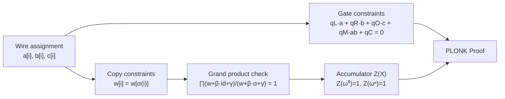
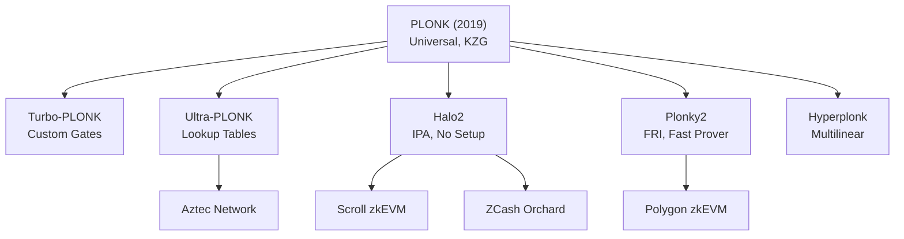

> **Prerequisites**: [[09-arithmetic-circuits-and-r1cs|09. Arithmetic Circuits & R1CS]] — gates, constraints; [[13-kzg-and-pairings|13. KZG & Pairings]] — KZG commit/verify, batch opening; [[14-groth16|14. Groth16]] — để hiểu vấn đề circuit-specific setup  
> **Objectives**:  
> - Hiểu tại sao Groth16's circuit-specific setup là vấn đề và universal setup giải quyết như thế nào
> - Nắm được Plonkish arithmetization: gate constraints và copy constraints (wiring)
> - Hiểu permutation argument và grand product check
> - Biết cấu trúc proof PLONK (conceptual) và tại sao nó universal
> - Phân biệt PLONK và các biến thể (Turbo-PLONK, Ultra-PLONK, Plonky2)

---

## Motivation: Vấn Đề Với Circuit-Specific Setup

Groth16 cần trusted setup **riêng cho mỗi circuit**. Điều này có nghĩa:

- App A dùng circuit $\mathcal{C}_A$ → cần ceremony A
- App B dùng circuit $\mathcal{C}_B$ → cần ceremony B
- Mỗi update circuit → ceremony mới

Với hàng trăm dApps và circuits thay đổi liên tục, đây là bottleneck thực tế nghiêm trọng.

**Mục tiêu của PLONK** (Gabizon, Williamson, Ciobotaru, 2019): Universal setup — một lần setup SRS, dùng cho **mọi circuit bậc $\leq n$** — không cần circuit-specific ceremony.

---

## Plonkish Arithmetization

Groth16 dùng R1CS. PLONK dùng một hệ constraint khác gọi là **Plonkish arithmetization** — linh hoạt hơn và phù hợp với universal setup.

### Gate Constraints

> [!definition] Definition 15.1 — Plonkish Gate
>
> PLONK circuit gồm $n$ gates. Mỗi gate $i$ có:
> - Ba **wire values**: $a_i$ (left input), $b_i$ (right input), $c_i$ (output)
> - Năm **selector polynomials**: $q_L, q_R, q_O, q_M, q_C$ (fixed từ circuit)
>
> **Gate constraint** tại row $i$:
>
> $$q_L(i) \cdot a_i + q_R(i) \cdot b_i + q_O(i) \cdot c_i + q_M(i) \cdot a_i b_i + q_C(i) = 0$$
>
> Tùy chọn selectors:
> - Addition gate: $q_L = q_R = 1, q_O = -1, q_M = q_C = 0$ → $a_i + b_i - c_i = 0$
> - Multiplication gate: $q_M = 1, q_O = -1$, rest $= 0$ → $a_i b_i - c_i = 0$
> - Constant gate: $q_L = 1, q_C = -k$ → $a_i = k$
> - Custom gates: selector polynomials mã hóa constraint bất kỳ

So sánh với R1CS: R1CS mỗi constraint là $(A\mathbf{w}) \cdot (B\mathbf{w}) = (C\mathbf{w})$ — chỉ encode multiplication. Plonkish linh hoạt hơn: một row có thể encode nhiều loại constraint khác nhau.

### Copy Constraints — Wiring

Gate constraints đảm bảo từng gate đúng nhưng **không đảm bảo** các gate kết nối đúng nhau. Ví dụ: output $c_1$ của gate 1 phải bằng input $a_2$ của gate 2.

> [!definition] Definition 15.2 — Copy Constraint (Wiring)
>
> **Copy constraint**: $w[i] = w[j]$ — giá trị wire tại vị trí $i$ bằng giá trị tại vị trí $j$.
>
> Ví dụ: $c_1 = a_2$ nghĩa là output của gate 1 là input trái của gate 2.
>
> Tập hợp các copy constraints xác định **wiring** (topology) của circuit.
>
> Thay vì encode từng copy constraint riêng lẻ, PLONK dùng **permutation argument** để check tất cả cùng lúc.

---

## Permutation Argument

### Ý Tưởng

Copy constraint $w[i] = w[j]$ nghĩa là trong hoán vị $\sigma$ (mã hóa circuit wiring), vị trí $i$ và $j$ phải nằm trong cùng orbit, và giá trị tại đó phải bằng nhau.

> [!definition] Definition 15.3 — Permutation Check
>
> Gọi $\sigma$ là hoán vị của $\{0, \ldots, 3n-1\}$ mã hóa copy constraints (map từ vị trí wire này sang vị trí wire kia mà cần bằng nhau).
>
> Wire assignment hợp lệ nếu: với mọ $i$, $w[i] = w[\sigma(i)]$.
>
> PLONK kiểm tra điều này bằng **grand product argument**:
>
> $$\prod_{i=0}^{n-1} \frac{w[i] + \beta \cdot \mathsf{id}(i) + \gamma}{w[i] + \beta \cdot \sigma(i) + \gamma} = 1$$
>
> trong đó $\beta, \gamma$ là random challenges của verifier, $\mathsf{id}(i) = i$ là identity permutation.

### Tại Sao Grand Product Encode Copy Constraints?

> [!theorem] Theorem 15.4 — Grand Product Soundness
>
> Gọi $f(i) = w[i] + \beta \cdot i + \gamma$ và $g(i) = w[i] + \beta \cdot \sigma(i) + \gamma$.
>
> $\prod f(i) = \prod g(i)$ khi và chỉ khi (với xác suất cao qua Schwartz-Zippel):
>
> $$\{(w[i], i)\}_{i} = \{(w[\sigma(i)], \sigma(i))\}_{i} \text{ là cùng multiset}$$
>
> Điều này tương đương với $w[i] = w[\sigma(i)]$ cho mọ $i$ trong orbit của $\sigma$.

*Sketch*: Nếu tất cả copy constraints thỏa mãn ($w[i] = w[\sigma(i)]$), thì mỗi phần tử trong tử số có phần tử tương ứng bằng nhau trong mẫu số (chỉ khác index). Tích bằng 1.

Nếu có vi phạm ($w[i] \neq w[\sigma(i)]$ cho một $i$ nào đó), tử và mẫu không "match" → tích $\neq 1$ với xác suất cao qua Schwartz-Zippel.

### Accumulated Product Polynomial

Grand product được kiểm tra bằng **accumulator polynomial** $Z(X)$:

$$Z(\omega^0) = 1$$  
$$Z(\omega^{i+1}) = Z(\omega^i) \cdot \frac{w[i] + \beta \cdot i + \gamma}{w[i] + \beta \cdot \sigma(i) + \gamma}$$  
$$Z(\omega^n) = 1 \text{ (phải về 1)}$$

Điều kiện $Z(\omega^n) = 1$ chính là grand product = 1.

*PLONK: gate constraints + permutation argument → PLONK proof.*

---

## PLONK Protocol (Conceptual)

### Polynomials trong PLONK

Mọi thứ trong PLONK được encode thành đa thức (univariate, over evaluation domain $H = \{1, \omega, \omega^2, \ldots, \omega^{n-1}\}$):

| Polynomial | Mô tả | Fixed? |
|------------|-------|--------|
| $q_L, q_R, q_O, q_M, q_C$ | Selector polynomials | Cố định theo circuit |
| $\sigma_1, \sigma_2, \sigma_3$ | Permutation polynomials | Cố định theo circuit |
| $a(X), b(X), c(X)$ | Wire polynomials | Prover tính từ witness |
| $Z(X)$ | Accumulator | Prover tính |
| $T(X)$ | Quotient polynomial | Prover tính |

### Round Structure (5-round PLONK)

> [!definition] Definition 15.5 — PLONK Proof Structure
>
> **Round 1**: Prover commit $[a]_1, [b]_1, [c]_1$ — wire polynomials.
>
> **Round 2**: Verifier gửi $\beta, \gamma$. Prover tính và commit $[Z]_1$ — accumulator polynomial.
>
> **Round 3**: Verifier gửi $\alpha$. Prover tính và commit $[T_{lo}]_1, [T_{mid}]_1, [T_{hi}]_1$ — quotient polynomial (chia nhỏ do bậc cao).
>
> **Round 4**: Verifier gửi evaluation point $\zeta$. Prover gửi evaluations:
> $\bar{a} = a(\zeta), \bar{b} = b(\zeta), \bar{c} = c(\zeta), \bar{\sigma}_1 = \sigma_1(\zeta), \bar{\sigma}_2 = \sigma_2(\zeta), \bar{z}_\omega = Z(\omega\zeta)$.
>
> **Round 5**: Verifier gửi $v$. Prover gửi KZG opening proofs $W_\zeta, W_{\omega\zeta}$ (batch opening tại $\zeta$ và $\omega\zeta$).
>
> **Proof**: $\pi = ([a]_1, [b]_1, [c]_1, [Z]_1, [T_{lo}]_1, [T_{mid}]_1, [T_{hi}]_1, \bar{a}, \bar{b}, \bar{c}, \bar{\sigma}_1, \bar{\sigma}_2, \bar{z}_\omega, W_\zeta, W_{\omega\zeta})$

Sau Fiat-Shamir (thay $\beta, \gamma, \alpha, \zeta, v$ bằng hash), PLONK proof là **non-interactive** với ~9 group elements + 7 field elements.

### Verification

Verifier:
1. Recompute challenges $\beta, \gamma, \alpha, \zeta, v$ từ Fiat-Shamir.
2. Tính $[\text{PI}]_1$ từ public inputs (linear combination selector polynomials tại $\zeta$).
3. Kiểm tra gate constraint và permutation constraint tại $\zeta$ bằng evaluations nhận được.
4. Verify KZG batch opening proof $W_\zeta$ và $W_{\omega\zeta}$.

Verify chạy trong $O(n_{\text{pub}})$ field ops + $O(1)$ pairings.

---

## Tại Sao PLONK Universal?

Trong Groth16, proving key chứa $[\alpha u_i(\tau)]_1$ — depends trực tiếp vào circuit polynomials $u_i$. Thay đổi circuit → thay đổi proving key → cần setup mới.

Trong PLONK:
- **SRS universal**: chỉ cần $[\tau^i]_1$ và $[\tau^i]_2$ — không phụ thuộc circuit.
- **Circuit-specific data** ($q_L, q_R, \ldots, \sigma_i$): được **commit** vào verification key, không encode vào SRS.
- **Prover** nhúng circuit constraints vào $T(X)$ (quotient polynomial) và commit bằng KZG — dùng SRS chung.

Vì vậy: một SRS setup → dùng cho mọi circuit bậc $\leq n$.

> [!note] Remark — "Updateable" SRS
>
> SRS của PLONK còn có tính **updateable**: bất kỳ ai cũng có thể thêm entropy vào SRS hiện tại mà không cần phối hợp — chỉ cần 1 người trung thực thêm randomness là đủ an toàn.

---

## Biến Thể của PLONK

Sau PLONK (2019), nhiều "Plonkish" variants xuất hiện:

| Variant | Điểm mới | Dùng trong |
|---------|----------|------------|
| **Turbo-PLONK** | Custom gates (range check, non-native arithmetic) | Aztec |
| **Ultra-PLONK** | Lookup tables (PLONKup) — precomputed table constraints | Aztec, dYdX |
| **Halo2** | IPA thay KZG (không trusted setup, recursive) | ZCash, Scroll |
| **Plonky2** | Baby Bear field + FRI (rất nhanh prover) | Polygon |
| **Hyperplonk** | Multilinear sumcheck thay univariate | zkEVM |

### Custom Gates và Lookup Tables

**Custom gates**: thêm selector polynomials cho các operations phức tạp (hash, elliptic curve ops) — mã hóa trực tiếp thay vì decompose thành nhiều multiplication gates.

**Lookup tables**: constraint $w[i] \in T$ (bảng tra cứu $T$ cố định) — hiệu quả cho range checks, byte operations, XOR, v.v. Dùng trong AIR của FRI/STARK.

---

## So Sánh PLONK vs. Groth16

| | Groth16 | PLONK |
|--|---------|-------|
| Proof size | **3 elements** | ~9 elements |
| Verify time | **3 pairings** | ~11 pairings (tương đương) |
| Setup | Circuit-specific | **Universal** |
| Flexibility | R1CS only | Custom gates, lookups |
| Aggregation | Khó | **Dễ** (accumulate openings) |
| Recursive proofs | Không tự nhiên | **Tốt** (Halo2) |
| Prover time | Nhanh hơn | Chậm hơn đôi chút |

---

## PLONK trong Hệ Sinh Thái ZKP

*PLONK và các biến thể trong hệ sinh thái ZKP thực tế.*

---

## Summary

- **Vấn đề Groth16**: circuit-specific trusted setup — phải redo ceremony mỗi khi circuit thay đổi.
- **PLONK**: universal setup — một SRS cho mọi circuit bậc $\leq n$.
- **Plonkish arithmetization**: gate constraints (5 selectors) + copy constraints (wiring).
- **Permutation argument**: grand product $\prod (w+\beta\cdot\mathsf{id}+\gamma) / (w+\beta\cdot\sigma+\gamma) = 1$ kiểm tra copy constraints.
- **Accumulator** $Z(X)$: encode grand product như polynomial constraint.
- **Proof**: ~9 KZG commitments + evaluations — lớn hơn Groth16 nhưng universal.
- **Biến thể**: Turbo-PLONK (custom gates), Ultra-PLONK (lookups), Halo2 (IPA, recursive), Plonky2 (FRI).
- PLONK là nền tảng của đa số zkEVM và modern SNARK systems.

---

## References

- Gabizon, Williamson, Ciobotaru — *PLONK: Permutations over Lagrange-bases for Oecumenical Noninteractive arguments of Knowledge* (2019) — ePrint 2019/953 (bài báo gốc)
- Bowe, Grigg, Hopwood — *Recursive Proof Composition without a Trusted Setup* (2019) — ePrint 2019/1021 (Halo, nền tảng Halo2)
- Gabizon, Williamson — *plookup: A simplified polynomial protocol for lookup tables* (2020) — ePrint 2020/315
- ZKProof Community — *PLONK Explainer* (zkproof.org)
- Thaler — *Proofs, Arguments, and Zero-Knowledge*, Ch. 17 (people.cs.georgetown.edu/jthaler/ProofsArgsAndZK.pdf)
- Dankrad Feist — *PLONK: Permutations over Lagrange-bases* (dankradfeist.de)
- Vitalik Buterin — *Understanding PLONK* (2019) (vitalik.ca)
