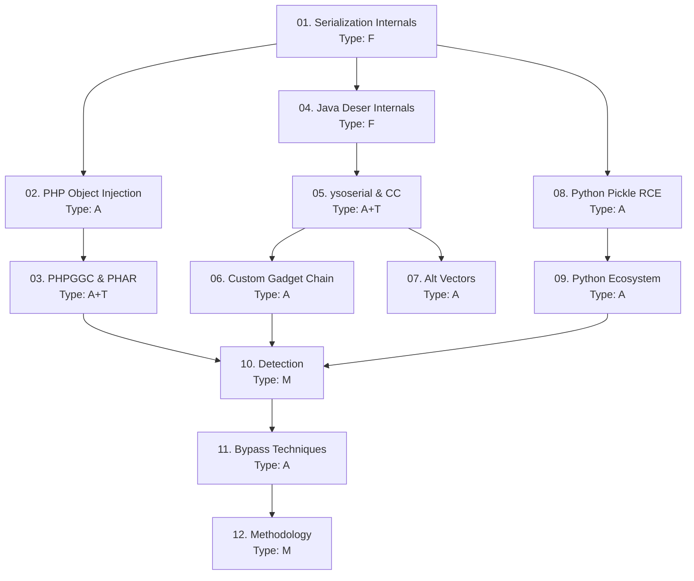

> **Course**: Insecure Deserialization Attacks (PHP, Java, Python)
> **Scope**: Toàn bộ attack chain từ serialization internals → exploit thực chiến → bypass technique → methodology
> **Depth**: Advanced — exploit chain, bypass WAF/sandbox, custom gadget
> **Lab**: HackTheBox + Local VM / Docker
> **Estimated sessions**: 4 sessions × 3 lessons
>
---

## SVG Assets Plan

| SVG File | Lesson | Mô tả | Priority |
|----------|--------|-------|---------|
| `assets/img-01-serialization-format-comparison.svg` | [[01-serialization-internals\|01. Serialization Internals]] | Byte format của PHP/Java/Pickle side-by-side | H |
| `assets/img-03-phar-gadget-chain-flow.svg` | [[03-phpggc-phar-deserialization\|03. PHPGGC & PHAR Deserialization]] | PHAR wrap → trigger → POP chain flow | H |
| `assets/img-04-java-objectinputstream-flow.svg` | [[04-java-deserialization-internals\|04. Java Deserialization Internals]] | ObjectInputStream.readObject() → magic method invocation | H |
| `assets/img-06-custom-gadget-chain.svg` | [[06-custom-java-gadget-chain\|06. Custom Java Gadget Chain]] | Custom gadget chain internals với FieldValues trick | M |
| `assets/img-08-pickle-opcode-flow.svg` | [[08-python-pickle-rce\|08. Python Pickle RCE]] | Pickle VM opcode execution model | H |

**Priority**: H = Cần thiết cho hiểu cơ chế · M = Tăng clarity · L = Nice-to-have

---

## Lesson Map

| # | Tên Lesson | Type | Phụ thuộc | Mô tả |
|---|-----------|------|----------|-------|
| 01 | [[01-serialization-internals\|01. Serialization Internals]] | F | — | PHP/Java/Python format bytes, magic methods, gadget primitives |
| 02 | [[02-php-object-injection\|02. PHP Object Injection]] | A | 01 | unserialize(), POP chain thủ công, magic method chain |
| 03 | [[03-phpggc-phar-deserialization\|03. PHPGGC & PHAR Deserialization]] | A+T | 02 | PHPGGC, Laravel/Monolog gadgets, PHAR stream wrapper bypass |
| 04 | [[04-java-deserialization-internals\|04. Java Deserialization Internals]] | F | 01 | ObjectInputStream, readObject(), serialVersionUID, magic bytes |
| 05 | [[05-ysoserial-commons-collections\|05. ysoserial & CommonsCollections]] | A+T | 04 | CC1–CC6 anatomy, Transformer chain, JDK version constraints |
| 06 | [[06-custom-java-gadget-chain\|06. Custom Java Gadget Chain]] | A | 05 | Xây gadget từ đầu, FieldValues trick, secondary vuln chain |
| 07 | [[07-java-deserialization-alt-vectors\|07. Java Alt Vectors (XStream/YAML/RMI)]] | A | 05 | XStream, SnakeYAML !! syntax, JMX/RMI/JRMP, OFBiz xmlrpc |
| 08 | [[08-python-pickle-rce\|08. Python Pickle RCE]] | A | 01 | __reduce__, opcode injection, pickletools, Django cache poisoning |
| 09 | [[09-python-unsafe-deserialization-ecosystem\|09. Python Unsafe Deser Ecosystem]] | A | 08 | PyYAML, jsonpickle, shelve, bypass RestrictedUnpickler |
| 10 | [[10-detection-fingerprinting\|10. Detection & Fingerprinting]] | M | 01-09 | Black-box detection, magic bytes, Burp plugins, GadgetProbe |
| 11 | [[11-bypass-techniques\|11. Bypass Techniques]] | A | 02-09 | PHP type juggling, Java SerialKiller bypass, Python sandbox bypass |
| 12 | [[12-deserialization-methodology\|12. Deserialization Methodology]] | M | All | Workflow hoàn chỉnh, checklist, tool stack, exploit chain template |
| FM | [[fm-field-manual\|Field Manual]] | Ref | Tích lũy | Tài liệu tra cứu thực chiến |

**Type legend**: F = Foundation · A = Attack · T = Tool · M = Methodology · H = Hybrid (A+T)

---

## Dependency Graph

---

## Phase Breakdown

### Phase 1 — Foundation (Lessons 01, 04)
**Mục tiêu**: Hiểu format bytes, magic methods, và attack surface của từng ngôn ngữ
**Lab**: Không cần lab — đọc, chạy Python/PHP/Java code local

### Phase 2 — PHP Attacks (Lessons 02, 03)
**Mục tiêu**: Xây POP chain thủ công, master PHPGGC và PHAR bypass
**Lab**: HTB BroScience, HTB Horizontall, HTB BigBang

### Phase 3 — Java Attacks (Lessons 05, 06, 07)
**Mục tiêu**: Hiểu CC gadget chain internals, xây custom gadget, exploit alt vectors
**Lab**: HTB Arkham, HTB Time, HTB Monitors, HTB Ophiuchi

### Phase 4 — Python Attacks (Lessons 08, 09)
**Mục tiêu**: Exploit pickle/PyYAML/jsonpickle, bypass RestrictedUnpickler
**Lab**: HTB Canape, HTB Blurry, HTB HackNet, HTB Developer

### Phase 5 — Advanced (Lessons 10, 11, 12)
**Mục tiêu**: Detection evasion, bypass hardened configs, master methodology
**Lab**: All above machines + PortSwigger Web Security Academy labs

---

## Progress Tracker

- [ ] 01. Serialization Internals
- [ ] 02. PHP Object Injection
- [ ] 03. PHPGGC & PHAR Deserialization
- [ ] 04. Java Deserialization Internals
- [ ] 05. ysoserial & CommonsCollections
- [ ] 06. Custom Java Gadget Chain
- [ ] 07. Java Alt Vectors
- [ ] 08. Python Pickle RCE
- [ ] 09. Python Unsafe Deserialization Ecosystem
- [ ] 10. Detection & Fingerprinting
- [ ] 11. Bypass Techniques
- [ ] 12. Deserialization Methodology
- [ ] Field Manual complete

---

## Appendices

| File | Nội dung |
|------|---------|
| [[fm-field-manual\|Field Manual]] | Tài liệu tra cứu thực chiến — tích lũy từ tất cả lessons |

---

## Study Notes

*Ghi chú thêm của người học — cập nhật trong quá trình học*