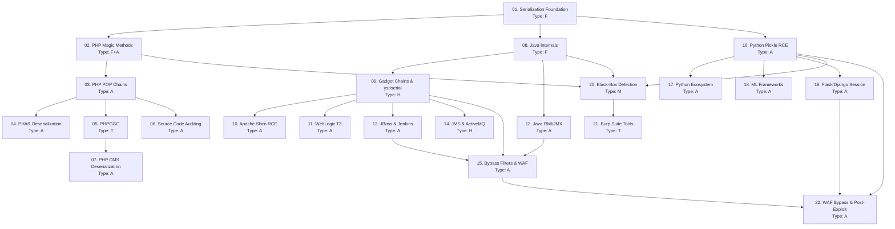

> **Course**: Insecure Deserialization Attacks — PHP · Java · Python
> **Scope**: Toàn bộ attack surface deserialization trên 3 ngôn ngữ, từ foundation đến advanced bypass và post-exploitation
> **Depth**: Intermediate → Advanced / CPTS + OSCP Focused
> **Lab**: HTB, PortSwigger Web Security Academy, TryHackMe, VulnHub
> **Estimated sessions**: ~8 sessions × 2–3 lessons

---

## Diagram Assets Plan

| File | Lesson | Description | Priority |
|------|--------|-------------|----------|
| `assets/img-01-format-comparison.png` | [[01-serialization-foundation\|01. Foundation]] | PHP/Java/Python serialization format side-by-side | H |
| `assets/img-03-pop-chain-flow.png` | [[03-php-pop-chains\|03. POP Chains]] | PHP POP chain execution: magic method → gadgets → sink | H |
| `assets/img-04-phar-structure.png` | [[04-phar-deserialization\|04. PHAR]] | PHAR file anatomy: stub / manifest / content / signature | H |
| `assets/img-06-source-audit-flow.png` | [[06-php-source-code-auditing\|06. Source Auditing]] | PHP source code audit call graph với sink highlighting | M |
| `assets/img-08-java-stream-format.png` | [[08-java-serialization-internals\|08. Java Internals]] | Java binary stream anatomy với color coding | H |
| `assets/img-09-cc1-gadget-chain.png` | [[09-java-gadget-chains-ysoserial\|09. Gadget Chains]] | CommonsCollections1 full gadget chain flow | H |
| `assets/img-10-shiro-cookie-flow.png` | [[10-apache-shiro-rce\|10. Shiro RCE]] | Shiro rememberMe cookie encryption lifecycle | H |
| `assets/img-11-t3-protocol.png` | [[11-weblogic-t3-deserialization\|11. WebLogic T3]] | WebLogic T3 protocol network attack diagram | H |
| `assets/img-12-rmi-architecture.png` | [[12-java-rmi-jmx\|12. RMI/JMX]] | Java RMI registry / stub / remote object architecture | M |
| `assets/img-14-jms-architecture.png` | [[14-java-jms-activemq-jmet\|14. JMS/ActiveMQ]] | JMS broker producer/consumer deserialization point | M |
| `assets/img-15-filter-bypass.png` | [[15-bypass-serialization-filters\|15. Filter Bypass]] | Defense layers + bypass map | H |
| `assets/img-16-pickle-reduce.png` | [[16-python-pickle-rce\|16. Pickle RCE]] | Python pickle REDUCE opcode → __reduce__ → RCE flow | H |
| `assets/img-18-ml-attack-surface.png` | [[18-ml-framework-deserialization\|18. ML Frameworks]] | ML model file loading attack surface lifecycle | M |
| `assets/img-19-flask-cookie-anatomy.png` | [[19-flask-django-session\|19. Flask/Django]] | Flask session cookie anatomy + forge flow | M |
| `assets/img-22-inmemory-webshell.png` | [[22-waf-bypass-postexploit\|22. WAF Bypass]] | In-memory webshell injection via deserialization | M |

**Priority**: H = Essential for understanding the mechanism · M = Increases clarity · L = Nice-to-have
**Workflow**: Generate HTML/CSS → `render.py` → PNG → embed `![[assets/img-{nn}-name.png]]`

---

## Lesson Map

| # | Lesson Name | Type | Depends on | Est. |
|---|-------------|------|-----------|------|
| 01 | [[01-serialization-foundation\|01. Serialization Foundation]] | F | — | 1 session |
| 02 | [[02-php-magic-methods\|02. PHP Magic Methods & Object Injection]] | F+A | 01 | 1 session |
| 03 | [[03-php-pop-chains\|03. PHP POP Chain Construction]] | A | 02 | 1 session |
| 04 | [[04-phar-deserialization\|04. PHAR Deserialization]] | A | 03 | 1 session |
| 05 | [[05-phpggc\|05. PHPGGC — Framework Gadget Chains]] | T | 03 | 1 session |
| 06 | [[06-php-source-code-auditing\|06. PHP Source Code Auditing]] | A | 03 | 1 session |
| 07 | [[07-php-cms-deserialization\|07. PHP CMS Deserialization]] | A | 05 | 1 session |
| 08 | [[08-java-serialization-internals\|08. Java Serialization Internals]] | F | 01 | 1 session |
| 09 | [[09-java-gadget-chains-ysoserial\|09. Gadget Chains & ysoserial]] | H | 08 | 1 session |
| 10 | [[10-apache-shiro-rce\|10. Apache Shiro RememberMe RCE]] | A | 09 | 1 session |
| 11 | [[11-weblogic-t3-deserialization\|11. WebLogic T3 Deserialization]] | A | 09 | 1 session |
| 12 | [[12-java-rmi-jmx\|12. Java RMI/JMX Exploitation]] | A | 08 | 1 session |
| 13 | [[13-jboss-jenkins-deserialization\|13. JBoss & Jenkins CLI]] | A | 09 | 1 session |
| 14 | [[14-java-jms-activemq-jmet\|14. Java JMS & ActiveMQ — JMET]] | H | 09 | 1 session |
| 15 | [[15-bypass-serialization-filters\|15. Bypass Serialization Filters & WAF]] | A | 09,12,13 | 1 session |
| 16 | [[16-python-pickle-rce\|16. Python Pickle & __reduce__ RCE]] | A | 01 | 1 session |
| 17 | [[17-python-ecosystem-deserialization\|17. Python Ecosystem Deserialization]] | A | 16 | 1 session |
| 18 | [[18-ml-framework-deserialization\|18. ML/AI Framework Deserialization]] | A | 16 | 1 session |
| 19 | [[19-flask-django-session\|19. Flask/Django Session Deserialization]] | A | 16 | 1 session |
| 20 | [[20-blackbox-detection-methodology\|20. Black-Box Detection Methodology]] | M | 02,08,16 | 1 session |
| 21 | [[21-burp-deserialization-tools\|21. Burp Suite — Deserialization Tools]] | T | 20 | 1 session |
| 22 | [[22-waf-bypass-postexploit\|22. WAF Bypass & In-Memory Post-Exploitation]] | A | 15,16,19 | 1 session |
| A0 | [[a0-quick-reference\|A0. Quick Reference]] | — | All | — |

**Type legend**: F = Foundation · A = Attack · T = Tool · M = Methodology · H = Hybrid

---

## Dependency Graph

---

## Phase Breakdown

### Phase 0 — Foundation (Lesson 01)
**Goal**: Hiểu serialization format của cả 3 ngôn ngữ; nhận biết attack surface chung; đọc raw bytes
**Lab**: Không cần lab — đọc và hiểu conceptually

### Phase 1 — PHP Deserialization (Lessons 02–07)
**Goal**: PHP magic methods → POP chains → PHAR → PHPGGC → Source auditing → CMS targets
**Lab**: HTB Tenet, PortSwigger PHP deserialization labs, VulnHub

### Phase 2 — Java Core (Lessons 08–12)
**Goal**: Java binary format → gadget chains → real-world CVEs (Shiro, WebLogic, RMI)
**Lab**: HTB Arkham, HTB LogForge, PortSwigger Java labs

### Phase 3 — Java Advanced (Lessons 13–15)
**Goal**: JBoss/Jenkins, JMS/ActiveMQ, filter bypass và WAF evasion
**Lab**: HTB Jeeves, custom lab environments

### Phase 4 — Python Deserialization (Lessons 16–19)
**Goal**: Pickle RCE → Python ecosystem → ML frameworks → Flask/Django sessions
**Lab**: PortSwigger Python labs, THM OWASP10, custom Flask apps

### Phase 5 — Methodology & Tools (Lessons 20–22)
**Goal**: Black-box detection, Burp tools, WAF bypass, in-memory post-exploitation
**Lab**: Tất cả machines phía trên

---

## Progress Tracker

- [ ] 01. Serialization Foundation
- [ ] 02. PHP Magic Methods & Object Injection
- [ ] 03. PHP POP Chain Construction
- [ ] 04. PHAR Deserialization
- [ ] 05. PHPGGC — Framework Gadget Chains
- [ ] 06. PHP Source Code Auditing
- [ ] 07. PHP CMS Deserialization
- [ ] 08. Java Serialization Internals
- [ ] 09. Gadget Chains & ysoserial
- [ ] 10. Apache Shiro RememberMe RCE
- [ ] 11. WebLogic T3 Deserialization
- [ ] 12. Java RMI/JMX Exploitation
- [ ] 13. JBoss & Jenkins CLI Deserialization
- [ ] 14. Java JMS & ActiveMQ — JMET
- [ ] 15. Bypass Serialization Filters & WAF
- [ ] 16. Python Pickle & __reduce__ RCE
- [ ] 17. Python Ecosystem Deserialization
- [ ] 18. ML/AI Framework Deserialization
- [ ] 19. Flask/Django Session Deserialization
- [ ] 20. Black-Box Detection Methodology
- [ ] 21. Burp Suite — Deserialization Tools
- [ ] 22. WAF Bypass & In-Memory Post-Exploitation

---

## Appendices

| File | Contents |
|------|---------|
| [[a0-quick-reference\|A0. Quick Reference]] | Aggregated payload/command reference across PHP · Java · Python |

---

## Study Notes

*Learner's notes — update as you progress through the course*
