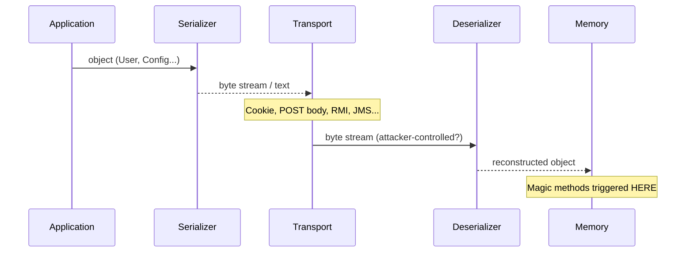
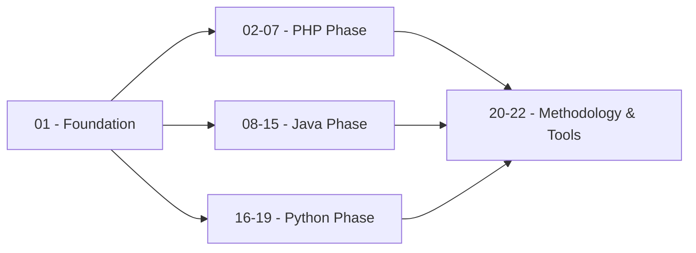

> **Prerequisites**: Không có — đây là lesson đầu tiên
> **Objectives**:
> - Phân biệt serialization format của PHP, Java, Python ở cấp độ byte
> - Nhận biết magic signatures trong HTTP traffic (cookie, body, header)
> - Hiểu tại sao deserialization tạo ra attack surface nguy hiểm
> - Xác định entry point tiềm năng trong mỗi ngôn ngữ

---

## Động lực

Trước khi tấn công bất kỳ ứng dụng nào, attacker phải nhận ra: *"Đây có phải serialized data không?"* Đây là câu hỏi quan trọng nhất — vì nếu bỏ sót, bạn sẽ đi qua một RCE mà không biết.

Ba ngôn ngữ PHP, Java, Python đều serialise object theo cách khác nhau hoàn toàn — khác format, khác cơ chế trigger, khác tool khai thác. Foundation này đặt nền tảng cho toàn bộ khoá học.

---

## Serialization là gì và tại sao nguy hiểm

**Serialization** (tuần tự hoá) là quá trình chuyển đổi một object trong memory thành dạng byte stream để:
- Lưu trữ vào database, file, cache (Redis, Memcached)
- Truyền qua mạng (HTTP cookie, POST body, WebSocket)
- Trao đổi giữa các service (RPC, message queue)

**Deserialization** là chiều ngược lại: byte stream → object trong memory.

> [!danger] Tại sao deserialization nguy hiểm?
> Khi ứng dụng deserialise dữ liệu do user kiểm soát, attacker có thể:
> - Inject một object độc hại vào memory
> - Trigger code execution thông qua **magic methods** (PHP), **readObject()** (Java), hoặc **__reduce__()** (Python)
> - Không cần authentication trong nhiều trường hợp (WebLogic T3, Shiro rememberMe)
>
> OWASP xếp Insecure Deserialization vào Top 10. Hơn 364 CVE liên quan đến Java deserialization trên MITRE. Nhiều CVE đạt CVSS 9.8.

---

## Kiến trúc & Format của từng ngôn ngữ

### Vòng đời serialization chung



> [!warning] Điểm nguy hiểm
> Nếu **byte stream** ở bước Transport do attacker kiểm soát → toàn bộ quá trình reconstruct object là attack surface.

---

### PHP — Human-readable text format

PHP serialize/unserialize dùng format text thuần tuý — dễ đọc, dễ sửa bằng tay.

![[assets/img-01-format-comparison.png]]
*Hình 1: So sánh format serialization của PHP, Java, và Python — magic signatures, hook points, và tools*

**Cấu trúc một PHP serialized string:**

```text
O:4:"User":3:{s:8:"username";s:5:"admin";s:4:"role";s:4:"user";b:0;}
^  ^ ^----^ ^  ^--------------------------------------------^
|  | class  |  properties (key:value pairs)
|  +-- tên class length (4 chars)
+-- O = Object type token
```

**Type tokens:**

| Token | Ý nghĩa | Ví dụ |
|-------|---------|-------|
| `O` | Object | `O:4:"User":2:{...}` |
| `s` | String | `s:5:"hello";` |
| `i` | Integer | `i:42;` |
| `b` | Boolean | `b:1;` (true) |
| `a` | Array | `a:2:{i:0;s:3:"foo";}` |
| `N` | NULL | `N;` |
| `d` | Float | `d:3.14;` |
| `C` | Custom (Serializable) | `C:9:"SplStack":...` |

**Entry points phổ biến trong PHP:**

```php
// Các pattern nguy hiểm khi audit
unserialize($_COOKIE['auth'])       // cookie
unserialize($_GET['data'])          // GET param
unserialize($_POST['payload'])      // POST body
unserialize(base64_decode($token))  // base64-encoded
unserialize(file_get_contents($f))  // từ file
```

> [!info] Magic methods trong PHP
> PHP có 17 magic methods. Khi unserialize() được gọi, các methods sau được trigger tự động:
> - `__wakeup()` — ngay khi deserialise xong
> - `__destruct()` — khi object bị garbage-collected
> - `__toString()` — khi object bị dùng như string
> - `__call()` — khi method không tồn tại được gọi
>
> Nếu bất kỳ method nào chứa code nguy hiểm (`eval`, `system`, `file_put_contents`...) → attacker có thể kiểm soát execution flow.

---

### Java — Binary stream format

Java serialization là binary protocol, không thể đọc bằng mắt thường. Dấu hiệu nhận biết **luôn cố định**.

**Magic bytes — không thể giả mạo:**

```text
Hex:    AC ED 00 05
Bytes:  0xAC 0xED = Magic number
        0x00 0x05 = Stream version 5

Khi encode base64 (xuất hiện trong HTTP):
        rO0AB...  (luôn bắt đầu bằng rO0)
```

**Cấu trúc stream:**

```text
AC ED 00 05          ← Stream header (magic + version)
73                   ← TC_OBJECT (0x73)
72 00 04             ← TC_CLASSDESC
55 73 65 72          ← "User" (classname, 4 bytes)
[8 bytes]            ← serialVersionUID
02                   ← SC_SERIALIZABLE flag
00 02                ← field count (2 fields)
...                  ← field descriptors
77 [len] [data]      ← TC_BLOCKDATA (field values)
78                   ← TC_ENDBLOCKDATA
70                   ← TC_NULL (superclass = null)
```

**Entry points phổ biến trong Java:**

```java
// ObjectInputStream — main deserialization mechanism
ObjectInputStream ois = new ObjectInputStream(inputStream);
Object obj = ois.readObject();  // ← entry point

// Xuất hiện ở:
// - HTTP request body (POST với Content-Type: application/x-java-serialized-object)
// - Cookie (base64-encoded: rO0AB...)
// - Java RMI (port 1099)
// - JMX (port 8686)
// - WebLogic T3 (port 7001)
// - JBoss JMXInvokerServlet (/invoker/JMXInvokerServlet)
// - Jenkins CLI (port 50000)
// - ActiveMQ (port 61616)
// - Apache Shiro rememberMe cookie
```

> [!note] Gadget chains — tại sao nguy hiểm hơn PHP?
> Java không có magic methods đơn giản như PHP. Thay vào đó, attacker phải tìm "gadget chains" — chuỗi các method calls trong thư viện bên thứ ba (Apache Commons Collections, Spring, Groovy...) mà khi được trigger bởi readObject(), sẽ dẫn đến code execution.
>
> Nguy hiểm vì: nếu ứng dụng có một trong các thư viện này trong classpath → vulnerable, dù code của developer không có lỗi trực tiếp.

---

### Python — Opcode stream format

Python pickle không phải binary thuần túy mà là **opcode stream** — giống như bytecode cho một stack machine tí hon.

**Protocol versions:**

| Protocol | Signature | Python version |
|----------|-----------|---------------|
| 0 | Text-based (legacy) | Python 2 |
| 2 | `\x80\x02` | Python 2.3+ |
| 4 | `\x80\x04` / base64: `gASV` | Python 3.4+ |
| 5 | `\x80\x05` | Python 3.8+ |

**REDUCE opcode — tại sao pickle là unsafe by design:**

```python
# Khi pickle.loads() gặp opcode REDUCE (0x52 = 'R'):
# → Pop một callable và một tuple of args từ stack
# → Gọi callable(*args)
# → Push result lên stack

# Attacker kiểm soát __reduce__ → kiểm soát callable và args
class Exploit:
    def __reduce__(self):
        return (os.system, ("id",))  # callable=os.system, args=("id",)

pickle.dumps(Exploit())  # Tạo payload
# Khi nạn nhân chạy pickle.loads(payload) → os.system("id") được gọi
```

**Entry points phổ biến trong Python:**

```python
# Các pattern nguy hiểm
pickle.loads(request.cookies.get('session'))   # cookie
pickle.loads(base64.b64decode(token))          # base64-encoded
cPickle.loads(data)                            # Python 2
torch.load(model_path)                         # ML model (không có weights_only=True)
joblib.load(model_file)                        # sklearn model
numpy.load(arr_file, allow_pickle=True)        # numpy array
yaml.load(config, Loader=yaml.Loader)          # PyYAML unsafe
```

> [!danger] Python pickle — unsafe by design
> Python documentation chính thức ghi rõ: *"The pickle module is not secure. Only unpickle data you trust."*
>
> Khác với PHP và Java (cần gadget chain), Python pickle **inherently executes code** trong quá trình deserialization qua opcode REDUCE. Không cần chain phức tạp — chỉ cần `__reduce__` return `(os.system, ("cmd",))` là có RCE.

---

## Góc nhìn kẻ tấn công

### Magic signatures để nhận biết trong traffic

```text
PHP:    O:4:"ClassName":N:{...}
        a:2:{i:0;s:5:"value";}

Java:   0xACED 0x0005 (hex trong binary)
        rO0AB... (base64 trong HTTP header/cookie/body)

Python: \x80\x02... (Protocol 2, binary)
        gASV... (Protocol 4, base64)
        ccos\nsystem\n (text protocol 0)
```

### Điểm quan sát trong Burp Suite

Khi intercepting traffic, chú ý:

```text
Cookie: auth=rO0ABXNyAA...          ← Java serialized (base64)
Cookie: session=gASVGwAAAAAAAA...    ← Python pickle (base64)
Cookie: data=O%3A4%3A%22User%22...  ← PHP serialized (URL-encoded)

POST body:
Content-Type: application/x-java-serialized-object
[binary content starting with 0xACED]

X-XSRF-TOKEN: [base64 blob]         ← Laravel/Shiro token
rememberMe: [base64 blob]           ← Apache Shiro
```

---

## Pentest Checklist

Khi bắt đầu kiểm tra một ứng dụng web:

```text
□ Intercept tất cả HTTP requests/responses bằng Burp Suite
□ Tìm cookies, headers, và body parameters chứa base64 blobs
□ Decode base64 và check magic bytes:
    → AC ED → Java
    → \x80\x0? → Python pickle
    → O: / a: / s: → PHP
□ Tìm kiếm trong source (nếu có):
    → PHP: unserialize(
    → Java: readObject( / ObjectInputStream
    → Python: pickle.loads( / yaml.load(
□ Check HTTP ports không chuẩn:
    → 1099 = Java RMI
    → 8686 = JMX
    → 7001 = WebLogic T3
    → 61616 = ActiveMQ
    → 50000 = Jenkins CLI
```

---

## Kết nối

Lesson này là foundation cho toàn bộ khoá học:



| Ngôn ngữ | Lesson tiếp theo | Nội dung |
|---------|-----------------|---------|
| PHP | [[02-php-magic-methods\|02. PHP Magic Methods]] | 17 magic methods, Object Injection anatomy |
| Java | [[08-java-serialization-internals\|08. Java Internals]] | Binary stream format, ObjectInputStream deep dive |
| Python | [[16-python-pickle-rce\|16. Python Pickle RCE]] | __reduce__ mechanism, reverse shell payload |
