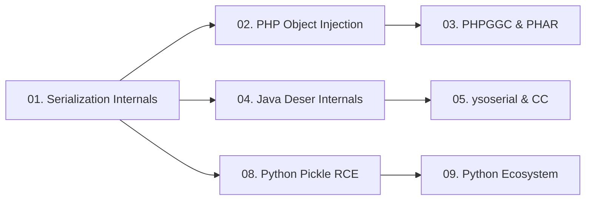

> **Prerequisites**: Kiến thức cơ bản về OOP (class, object, method)
> **Objectives**:
> - Hiểu serialization là gì và tại sao nó tồn tại
> - Phân tích format bytes của PHP, Java, Python Pickle
> - Nắm rõ các magic methods tự động kích hoạt khi deserialize
> - Xác định attack surface trong cả 3 ngôn ngữ
>
---

## Động lực

Insecure deserialization là một trong những lớp lỗ hổng nguy hiểm nhất vì nó cho phép attacker **thực thi code tùy ý** chỉ bằng cách kiểm soát dữ liệu được truyền vào một hàm deserialize. Điểm đặc biệt: code độc hại chạy **trong quá trình deserialize** — trước khi ứng dụng có cơ hội validate bất kỳ thứ gì.

Để khai thác thành công, bạn cần hiểu ba điều: format dữ liệu của từng ngôn ngữ trông như thế nào, magic methods nào tự động kích hoạt, và attack surface nằm ở đâu. Đây là foundation bắt buộc trước khi đi vào exploit cụ thể.

---

## Kiến trúc & Cơ chế

### Serialization là gì?

**Serialization** (tuần tự hóa) là quá trình chuyển đổi một object trong bộ nhớ thành một chuỗi bytes để có thể lưu trữ hoặc truyền qua network. **Deserialization** là chiều ngược lại — từ bytes tái tạo lại object.

Các use case phổ biến dẫn đến lỗ hổng: session cookies, cache files, message queue payloads, RPC calls, file uploads.

![[img-01-serialization-format-comparison.svg]]
*Hình 1: So sánh format bytes của PHP, Java, và Python Pickle — ba ngôn ngữ, ba attack surface khác nhau*

---

### PHP Serialization

PHP dùng cú pháp text dễ đọc của riêng nó.

```php
<?php
class User {
    public $name = "admin";
    public $admin = false;
}

$obj = new User();
$serialized = serialize($obj);
echo $serialized;
// O:4:"User":2:{s:4:"name";s:5:"admin";s:5:"admin";b:0;}

$restored = unserialize($serialized);
echo $restored->name; // admin
```

**Cú pháp format**:

| Ký tự | Kiểu | Ví dụ |
|-------|------|-------|
| `i:` | integer | `i:42;` |
| `s:` | string (kèm length) | `s:5:"hello";` |
| `b:` | boolean | `b:1;` (true) / `b:0;` (false) |
| `O:` | object | `O:4:"User":2:{...}` |
| `a:` | array | `a:2:{i:0;s:3:"foo";i:1;s:3:"bar";}` |
| `N;` | null | `N;` |

> [!info] Đặc điểm của PHP format
> Format text của PHP cho phép attacker **đọc và chỉnh sửa trực tiếp** giá trị mà không cần tool đặc biệt. Ví dụ: đổi `b:0` thành `b:1` để leo quyền admin.
>
**Magic methods trong PHP — auto-triggered khi deserialize**:

| Method | Kích hoạt khi nào |
|--------|------------------|
| `__wakeup()` | Ngay sau `unserialize()` — dùng để "khởi tạo lại" object |
| `__destruct()` | Khi object bị garbage collected — cuối script hoặc khi unset |
| `__toString()` | Khi object bị ép kiểu sang string (`echo $obj`, string concat) |
| `__get()` | Khi access thuộc tính không tồn tại |
| `__call()` | Khi gọi method không tồn tại |
| `__invoke()` | Khi object được gọi như function |

> [!warning] Tại sao `__destruct` nguy hiểm nhất?
> Bất kỳ object nào được tạo ra từ `unserialize()` đều **chắc chắn** bị destruct khi script kết thúc. Attacker không cần chain phức tạp nếu `__destruct` của một class nào đó đã có code nguy hiểm.
>
---

### Java Serialization

Java dùng binary format với magic bytes đặc trưng.

```java
import java.io.*;

// Serialize
ByteArrayOutputStream baos = new ByteArrayOutputStream();
ObjectOutputStream oos = new ObjectOutputStream(baos);
oos.writeObject(new User("admin"));
byte[] serialized = baos.toByteArray();
// Starts with: AC ED 00 05

// Deserialize
ObjectInputStream ois = new ObjectInputStream(
    new ByteArrayInputStream(serialized)
);
User restored = (User) ois.readObject(); // ← attack surface
```

**Fingerprint để nhận biết Java serialized object**:

| Dạng | Giá trị | Ý nghĩa |
|------|---------|---------|
| Hex | `AC ED 00 05` | Magic bytes header |
| Base64 | Bắt đầu bằng `rO0A` | Sau khi encode bytes trên |
| HTTP | Cookie/POST body bắt đầu `rO0A` | Thường gặp trong web apps |

**Magic methods trong Java**:

| Method | Kích hoạt khi nào |
|--------|------------------|
| `readObject(ObjectInputStream)` | Trong quá trình deserialization — thay thế behavior mặc định |
| `readResolve()` | Sau `readObject()` — dùng để trả về instance thay thế |
| `readObjectNoData()` | Khi stream không có data cho class |
| `finalize()` | Khi GC collect object — ít dùng hơn |

> [!note] Điều kiện để class serialize được
> Class phải implement `java.io.Serializable`. Tuy nhiên, gadget chain khai thác các library classes **đã có sẵn** trong classpath của ứng dụng — attacker không cần inject class mới.
>
**serialVersionUID — trường quan trọng**:

```java
class MyClass implements Serializable {
    // Nếu không khai báo, JVM tự tính từ class structure
    // Nếu class thay đổi mà serialVersionUID khác → InvalidClassException
    private static final long serialVersionUID = 1234567890L;
}
```

---

### Python Pickle

Python pickle dùng kiến trúc stack-based VM với opcode stream.

```python
import pickle, os

# Serialize bình thường
import pickle
data = {"user": "admin", "role": "user"}
serialized = pickle.dumps(data)
# bytes: \x80\x04\x95...\x94.

# Deserialize bình thường (an toàn nếu data trusted)
restored = pickle.loads(serialized)

# Serialize NGUY HIỂM — exploit class
class RCE:
    def __reduce__(self):
        return (os.system, ("id",))

payload = pickle.dumps(RCE())
# Khi pickle.loads(payload) chạy → gọi os.system("id")
```

**Phân tích opcode với pickletools**:

```python
import pickle, pickletools, os

class RCE:
    def __reduce__(self):
        return (os.system, ("id",))

data = pickle.dumps(RCE())
pickletools.dis(data)
```

Output:
```yaml
    0: \x80 PROTO      4
    2: \x95 FRAME      14
   11: \x8c SHORT_BINUNICODE 'nt'    # hoặc 'posix'
   15: \x8c SHORT_BINUNICODE 'system'
   23: \x93 STACK_GLOBAL            # push os.system lên stack
   24: \x8c SHORT_BINUNICODE 'id'
   28: \x85 TUPLE1                  # tạo tuple ('id',)
   29: R    REDUCE                  # gọi os.system('id') ← đây!
   30: .    STOP
```

**Magic methods trong Python Pickle**:

| Method | Mô tả |
|--------|-------|
| `__reduce__()` | Trả về `(callable, args)` — callable sẽ được gọi khi load |
| `__reduce_ex__(protocol)` | Phiên bản extended — ưu tiên hơn `__reduce__` |
| `__getstate__()` | Trả về state để serialize |
| `__setstate__(state)` | Khôi phục state sau khi load — có thể inject tại đây |

**Các hàm không an toàn**:

```python
# Tất cả đều vulnerable nếu nhận untrusted input
pickle.loads(data)        # standard
cPickle.loads(data)       # C implementation (Python 2)
shelve.open("file")       # dùng pickle internally
joblib.load("model.pkl")  # ML models
torch.load("model.pt")    # PyTorch models (trừ khi weights_only=True)
numpy.load(arr, allow_pickle=True)
```

---

## Góc nhìn kẻ tấn công

### Nơi tìm attack surface

**PHP**:
- Cookies chứa PHP serialized string (có thể nhận ra bởi `O:` prefix)
- POST parameters nhận base64-encoded data
- File uploads được load bằng `phar://` stream wrapper
- `unserialize()` calls trong source code

**Java**:
- HTTP cookies / headers / POST body bắt đầu bằng `rO0A` (base64) hoặc `AC ED` (hex)
- RMI ports (1099, 1098)
- JMX ports (phổ biến trong enterprise apps)
- XML endpoints (`/xmlrpc`, `/webservices/`) nhận serialized data trong XML tags
- WebSocket data
- Deserialization từ database (BLOB columns)

**Python**:
- Session cookies (Flask, Django signed cookies)
- File uploads (`.pkl`, `.pickle`, `.npy` với allow_pickle)
- Cache files (Django FileBasedCache)
- Message queue payloads (Celery, Redis queue)
- ML model files (joblib, PyTorch, TensorFlow h5)

### Bảng so sánh attack surface

| Thuộc tính | PHP | Java | Python |
|-----------|-----|------|--------|
| Format | Text (dễ đọc) | Binary | Binary (opcode) |
| Nhận biết | `O:`, `a:`, `s:` prefix | `AC ED 00 05` / `rO0A` | `\x80\x04` hoặc `\x80\x02` |
| Magic method chính | `__destruct`, `__wakeup` | `readObject` | `__reduce__` |
| Cần gadget lib? | Có (framework-specific) | Có (commons-collections...) | Không — trực tiếp |
| Tool tạo payload | PHPGGC | ysoserial | Viết Python thuần |
| Độ khó exploit | Medium | Hard | Easy |

---

## Pentest Checklist

```yaml
□ PHP: Tìm "O:" hoặc base64 decode cookie/param — có thấy "O:" không?
□ PHP: Xem source → tìm unserialize() nhận user input trực tiếp
□ PHP: Kiểm tra PHP version (PHAR attack cần < 8.0)
□ Java: Tìm magic bytes AC ED 00 05 trong hex view của cookie/POST
□ Java: base64 decode cookie → bắt đầu bằng rO0A?
□ Java: Nmap service discovery → port 1099 (RMI), 1098, 9010 (JMX)?
□ Java: Response headers → X-Powered-By, Server cho biết Java framework
□ Python: Session cookie → decode → thấy pickle bytes (\x80\x04)?
□ Python: .pkl file upload endpoint?
□ Python: Django DEBUG=True → có thể leak SECRET_KEY → Django deser
□ Tất cả: Gửi ysoserial URLDNS / PHP Ping / pickle DNS OOB → xác nhận deser
```

---

## Kết nối

