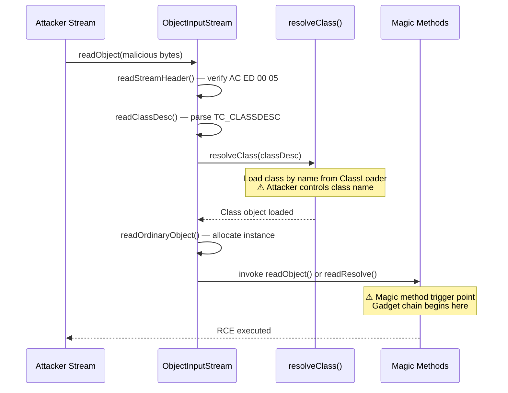
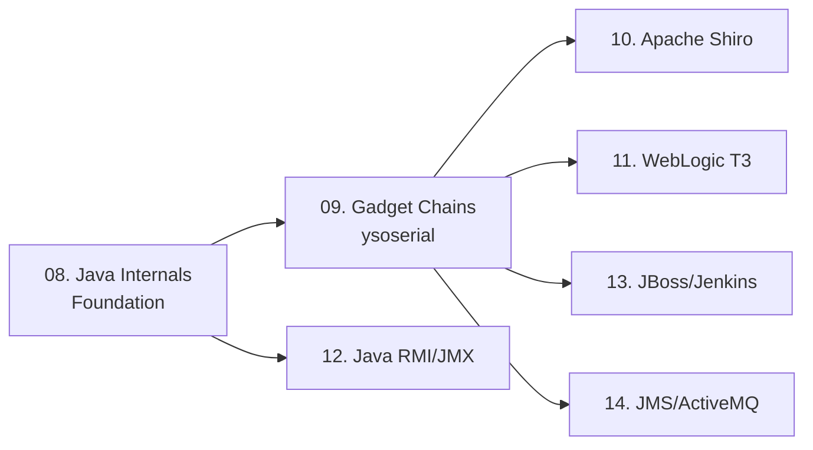

> **Prerequisites**: [[01-serialization-foundation|01. Serialization Foundation]]
> **Objectives**:
> - Đọc được Java binary stream format: magic bytes, classDesc, serialVersionUID
> - Hiểu vòng đời `ObjectInputStream.readObject()` từ góc độ attacker
> - Nhận diện Java serialized objects trong HTTP traffic (raw + base64)
> - Chuẩn bị nền tảng cho gadget chain exploitation (Lesson 09+)

---

## Động lực

Java serialization là attack surface lớn nhất trong lịch sử deserialization vulnerabilities — hơn 364 CVE được MITRE ghi nhận, với các target nổi tiếng như WebLogic, JBoss, Jenkins, và Apache Shiro. Trước khi exploit gadget chain, cần hiểu cơ chế nội tại của `ObjectInputStream` để biết *tại sao* gadget chain hoạt động và *khi nào* magic method được trigger.

---

## Kiến trúc & Cơ chế

### Java Binary Stream Format

![[assets/img-08-java-stream-format.png]]
*Hình 1: Java serialization stream anatomy — từ magic bytes đến object data, với attacker recognition signatures*

Java serialization sử dụng binary format định nghĩa bởi Java Object Serialization Specification. Mọi serialized object stream đều bắt đầu bằng 4 bytes cố định:

```
AC ED 00 05
```

Đây là **stream header** gồm:
- `AC ED` — STREAM_MAGIC (magic number nhận dạng Java serialized stream)
- `00 05` — STREAM_VERSION (luôn là 5)

Khi base64-encoded, 4 bytes `AC ED 00 05` luôn tạo ra chuỗi bắt đầu bằng `rO0AB` — đây là signature phổ biến nhất để nhận diện Java deserialization trong HTTP cookies, POST bodies, và parameters.

### Stream Structure Chi Tiết

```
AC ED 00 05                     ← Stream Header (4 bytes)
72                              ← TC_CLASSDESC (0x72)
00 0A                           ← Class name length (10 bytes)
4D 79 43 6C 61 73 73 ... (UTF8) ← Class name: "MyClass"
12 34 56 78 9A BC DE F0         ← serialVersionUID (8 bytes)
02                              ← classDescFlags (SC_SERIALIZABLE)
00 02                           ← fieldCount = 2
  ...field descriptors...
73                              ← TC_OBJECT (0x73) — instance data
  ...field values...
78                              ← TC_ENDBLOCKDATA (0x78)
```

> [!info] serialVersionUID — Fingerprinting target
> `serialVersionUID` là 8-byte hash duy nhất của class. Nếu server trả về `InvalidClassException` với UID không khớp, attacker biết được version của library đang chạy trên server → dùng để chọn đúng gadget chain.

### ObjectInputStream.readObject() Flow



### Magic Methods Trong Java Deserialization

Java không có `__wakeup` như PHP, nhưng có các hook tương đương được gọi tự động:

| Method | Khi nào trigger | Attacker interest |
|--------|----------------|-------------------|
| `readObject(ObjectInputStream)` | Ngay khi object được deserialize | **Cao nhất** — entry point gadget chain |
| `readResolve()` | Sau readObject, trước khi return | Dùng để replace object returned |
| `readExternal(ObjectInput)` | Nếu implement Externalizable | Kiểm soát hoàn toàn deserialization |
| `hashCode()` / `equals()` | Khi object insert vào HashMap | Trigger tự động với PriorityQueue trick |
| `finalize()` | Khi GC collect object | Ít dùng, không reliable |

> [!warning] Class phải có trong Classpath
> Khác với PHP, Java chỉ deserialize được class đã load trong JVM classpath. Đây là lý do gadget chains target common libraries (Apache Commons, Spring) — chúng có mặt trong hầu hết Java applications.

---

## Góc nhìn kẻ tấn công

### Nhận Diện Java Serialized Data Trong Traffic

```bash
# Burp Suite — Search trong HTTP history
# Request body hoặc cookie chứa:
rO0AB...          # Base64 của AC ED 00 05
H4sIAAAA...       # GZipped + base64 của Java stream
%AC%ED%00%05...   # URL-encoded raw bytes

# Command line detection
echo "rO0ABXNy..." | base64 -d | xxd | head -2
# Output: 0000000: aced 0005 7372 ...  ← xác nhận Java serialized

# Grep trong response body / error messages
curl -s http://target/ | grep -i "InvalidClassException\|NotSerializableException"
```

### SerializationDumper — Phân Tích Stream

```bash
# Install
git clone https://github.com/NickstaDB/SerializationDumper
cd SerializationDumper && ./build.sh

# Parse hex stream
java -jar SerializationDumper.jar ACED0005...

# Parse base64
echo "rO0AB..." | base64 -d > /tmp/stream.bin
java -jar SerializationDumper.jar -r /tmp/stream.bin
```

> **Expected output**: Cây object hierarchy với tên class, serialVersionUID, fields — giúp identify version của gadget library target đang dùng.

### Nhận Diện Qua Error Messages

```
java.io.InvalidClassException: com.example.User; 
  local class incompatible: stream classdesc serialVersionUID = 1234,
  local class serialVersionUID = 5678
```

Từ error này biết được: class `com.example.User` đang được deserialize trên server.

```
java.lang.ClassNotFoundException: org.apache.commons.collections.functors.InvokerTransformer
```

Ngược lại — lỗi này cho biết class *không có* trên classpath → gadget chain này không work.

---

## Pentest Checklist

```
□ Tìm base64 blob bắt đầu "rO0AB" trong cookies, hidden fields, POST body
□ Tìm raw bytes AC ED 00 05 qua Burp Proxy raw view
□ Kiểm tra error messages Java deserialization exception leakage
□ Identify Java application server type → xác định likely libraries
□ Nmap scan: 1099 (RMI), 7001 (WebLogic T3), 8080 (Tomcat), 50000 (Jenkins)
□ Run SerializationDumper để phân tích stream structure nếu có
```

---

## Connections


